# 开发态性能检测

更新时间：2026-03-19 08:43:01

来源：https://developer.huawei.com/consumer/cn/doc/best-practices/bpta-performance-detection

## 简介

调优是通过优化应用程序提高运行速度、资源利用效率和响应时间的过程。通过对应用程序进行细致的调优，可以使应用程序更高效、更稳定。在当今数字化时代，随着应用程序变得越来越复杂和庞大，调优变得尤为重要。一个经过有效调优的应用程序不仅可以更高效地运行，还能提高应用的稳定性，提升程序的效率，减少资源的浪费，从而为用户带来更好的体验。因此，了解调优的方法和常用工具对于开发人员至关重要。

调优的过程通常包括现场复现、问题分析、确定解决方案和性能测试这几个关键步骤。现场复现是指在具体环境中复现问题，以便更好地分析和解决。问题分析阶段则是深入分析应用程序的性能瓶颈和问题根源，为后续优化提供指导。确定解决方案是根据问题分析的结果，制定具体的优化方案和措施。最后，性能测试是验证调优效果的关键步骤，通过对优化后的应用程序进行性能测试，评估改进效果。

为了有效进行调优工作，需要借助一些常用的工具。例如，性能分析工具DevEco Profiler可以监测应用的性能指标、录制Trace记录，开发者可以通过分析Trace数据，发现代码中的性能瓶颈，进而优化性能。

本文将介绍调优的方法和常用工具，帮助开发者更好地分析和解决应用程序中的性能问题，提升用户体验，实现应用程序的高效稳定运行。

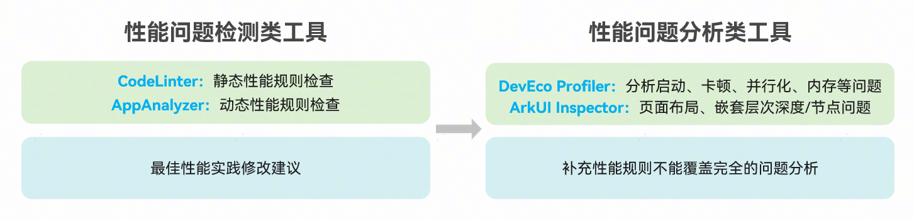

性能调优贯穿于HarmonyOS应用开发的整个生命周期中，开发前有性能最佳实践和指南等赋能套件让开发者快速上手学习，开发过程中有性能工具开发套件覆盖应用开发各阶段，应用开发完成上架后有专业的性能测试工具检查测试应用性能指标。目前DevEco Studio主要集成了四种性能工具，在不同的开发阶段各有侧重，主要分为性能问题检测类工具和性能问题分析类工具。本文重点介绍使用性能问题检测类工具来检测应用性能问题。

## 静态扫描工具检测应用性能问题

### Code Linter

介绍

静态检测工具，白盒检查代码性能问题。可配置开发者关注的性能规则，扫描结果支持跳转到代码，性能规则详情或者官网的最佳性能实践指导。

使用方法

在已打开的代码编辑器窗口单击右键点击Code Linter，或在工程管理窗口中鼠标选中单个或多个工程文件/目录，右键选择Code Linter > Full Linter执行代码全量检查。如图所示输入@performance，过滤性能检查结果。

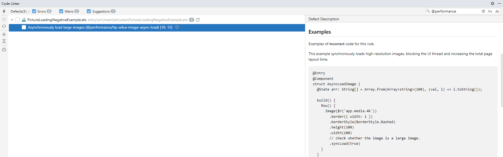

详细使用指导见：

代码Code Linter检查

静态性能规则全集见：

性能规则@performance

> [!NOTE]
> 若未配置代码检查规则文件，直接执行Code Linter，将按照默认的编程规范规则对.ets文件进行检查。注意规则变更说明。

## 动态运行工具检测应用性能问题

### AppAnalyzer

介绍

应用与元服务体检工具用于对应用和元服务进行本地测试体检，并给出体检报告、分析指导以及修改建议，帮助开发者提升应用与元服务质量。在体检过程中，工具会收集应用或元服务的trace信息、代码栈、内存快照以及应用或元服务页面的截屏，并保存在本地工程目录.appanalyzer下，帮助开发者快速进行问题分析定位。

使用方法

启动DevEco Studio，连接设备，打开应用，依次执行以下操作：

> [!NOTE]
> 在使用AppAnalyzer工具前，请确保完成以下准备工作：
>  1、应用已配置签名[signingConfigs](https://developer.huawei.com/consumer/cn/doc/harmonyos-guides/ide-hvigor-build-profile-app#section153288223224)。
>  2、确认模块Product配置正确。
>  3、关闭代码混淆：在模块级build-profile.json5配置文件中关闭代码混淆，详见：[字段说明](https://developer.huawei.com/consumer/cn/doc/harmonyos-guides/ide-build-obfuscation#section88021016154414)。
>  4、将编译模式Build Mode设置为release。

1. 点击菜单栏Tools，选择AppAnalyzer进入AppAnalyzer页面。
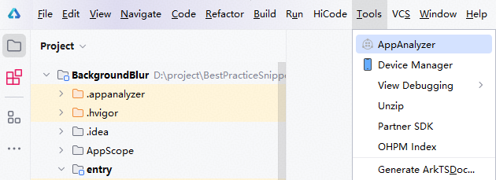
2. 在AppAnalyzer页面，默认选择场景化体检。以页面间转场场景为例，点击“手动性能页面间转场体检”即可进入体检界面。
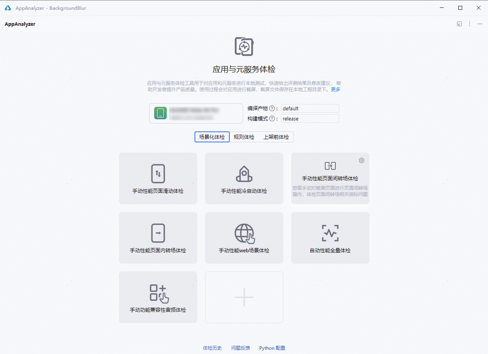
3. 在准备体检时，开发者需要保持手机解锁状态，待被检测应用自动安装并运行后，即表示准备完成。然后操作手机至检测页面，点击开始按钮开始体检。
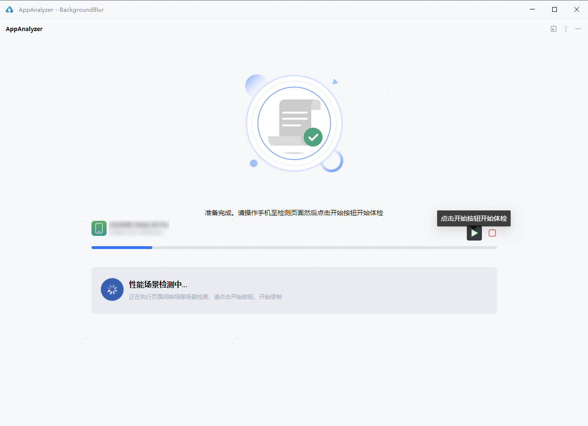
4. 等待界面出现“体检中，请操作手机”时，开始操作手机，等待体检工具录制和分析。操作完成后，可以点击结束按钮结束体检。
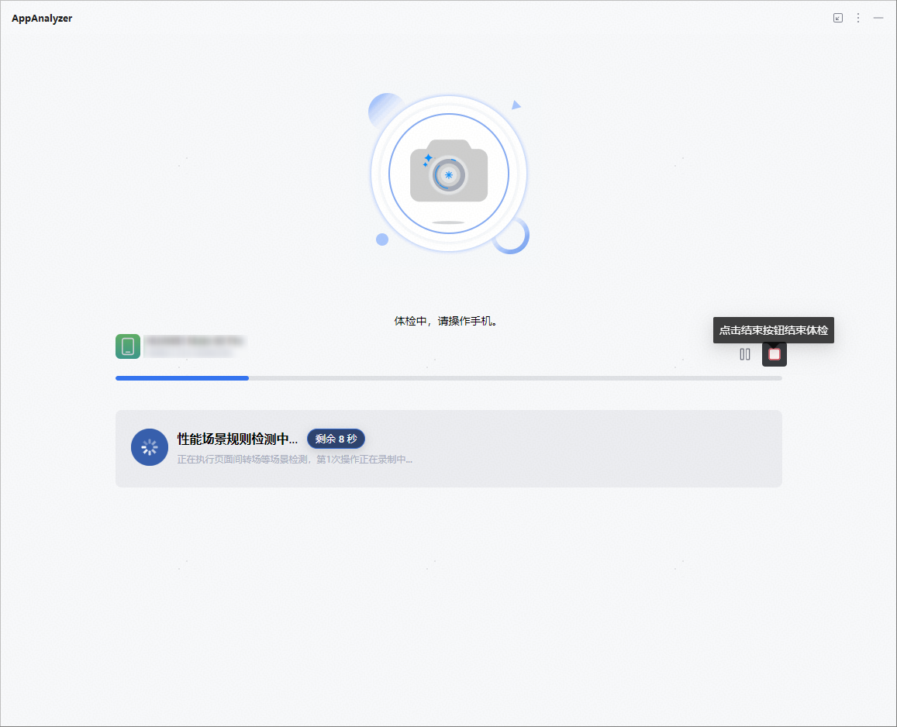
5. 等待体检工具生成报告。
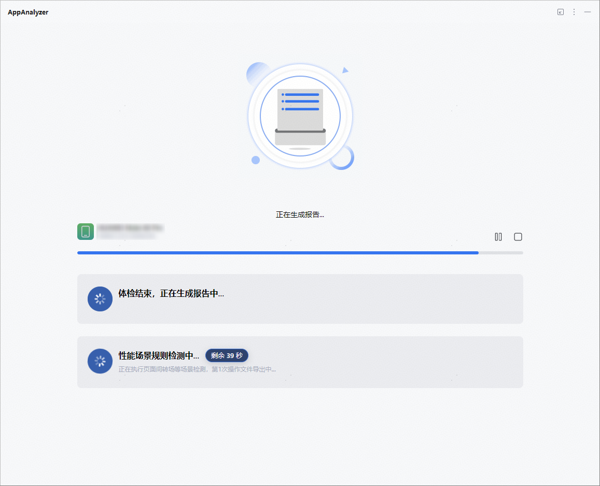
6. 查看检测结果报告，点击展开检测报告中的“页面间转场”，如果体检不为满分100，点击展开体检检测结果，若显示诊断异常（如下图中出现黄色、红色警告），则表示存在页面间转场的性能问题。
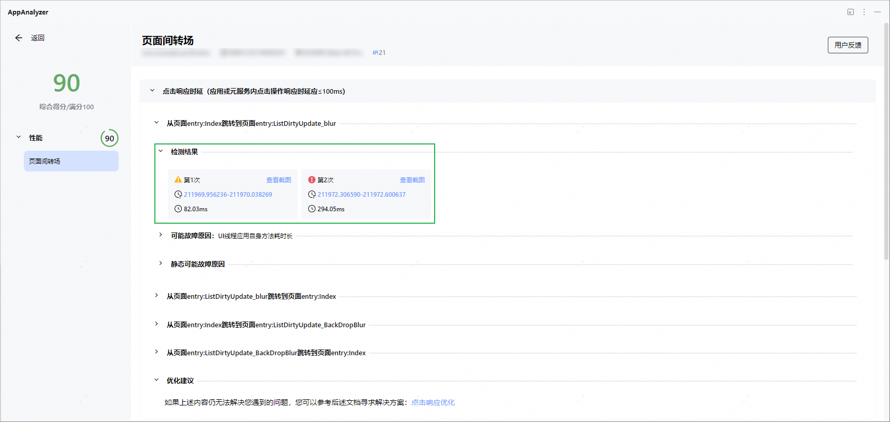
7. 检测存在故障时，开发者可通过点击“可能故障原因”，查看详细测试结果及优化建议。
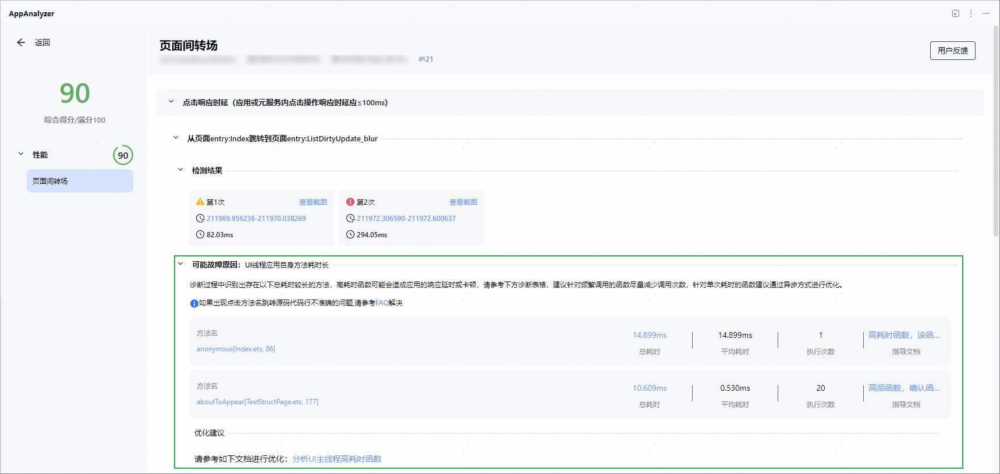

详细使用指导见：

应用与元服务体检

应用体检工具集成性能规则见：

应用/元服务体检规则

## Testing测试报告导入体检工具分析

DevEco Testing为开发者提供了稳定性、性能、应用基础质量等专项测试服务。通过DevEco Testing进行场景化性能测试，可检测出应用相关场景的性能问题，生成测试报告。为进一步分析定位应用问题，可将Testing测试报告导入至体检工具AppAnalyzer，从而对应用进行本地测试体检与优化。

图1 Testing测试报告导入体检工具分析流程

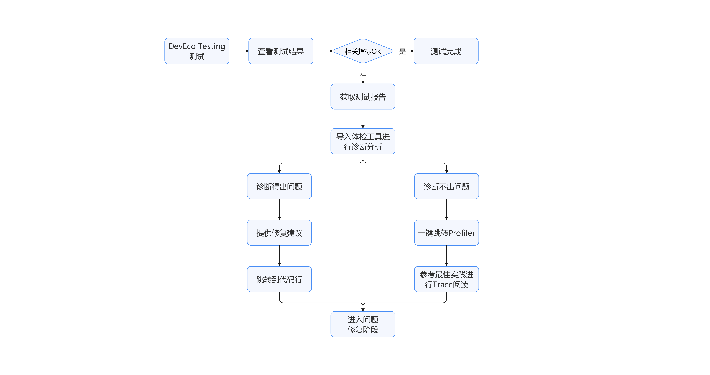

Testing测试报告导入体检工具分析的过程主要包括以下步骤。

1. **DevEco Testing测试**使用DevEco Testing进行场景化性能测试，支持编写测试脚本和自定义测试场景对应用性能进行评估。具体使用方法和指导请见：[场景化性能测试](https://developer.huawei.com/consumer/cn/doc/harmonyos-guides/specialized-testing#section8642101711299)。
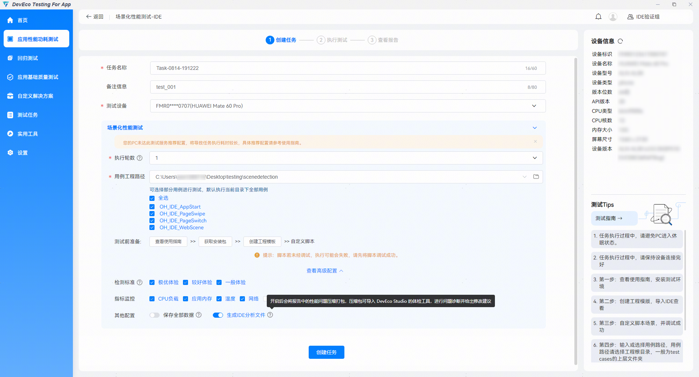
 **查看测试结果** 根据DevEco Testing检测结果，查看是否存在页面间转场等场景不达标的问题。
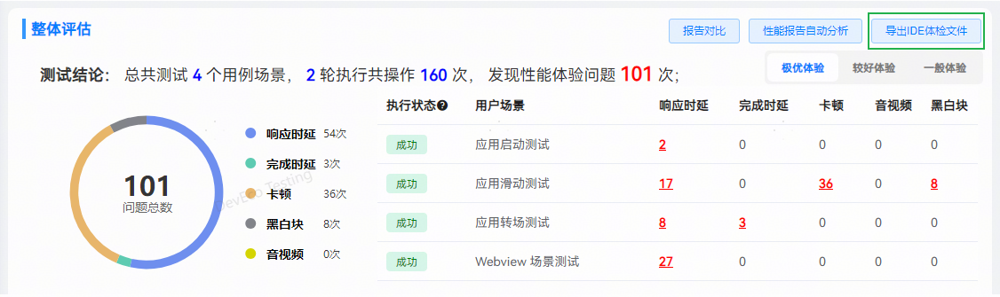
 **获取测试报告** 点击导出IDE体检文件按钮，跳转至报告文件本地路径，获取DevEco Testing体检测试报告。
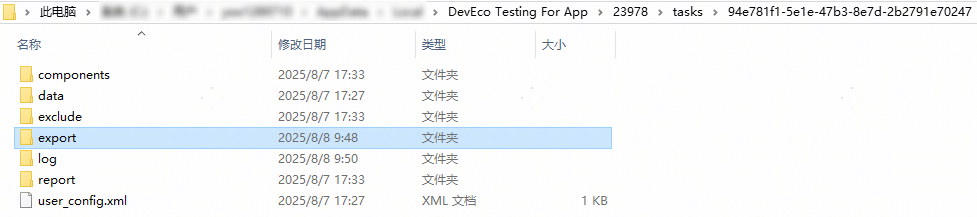
2. **体检报告导入AppAnalyzer**通过DevEcoTesting发现问题后，为深入分析问题，可将获取的体检报告导入体检工具AppAnalyzer进行具体定位和优化。打开DevEcoStudio，点击AppAnalyzer图标进入AppAnalyzer页面，随后点击“体检历史”按钮，跳转至历史记录页面。
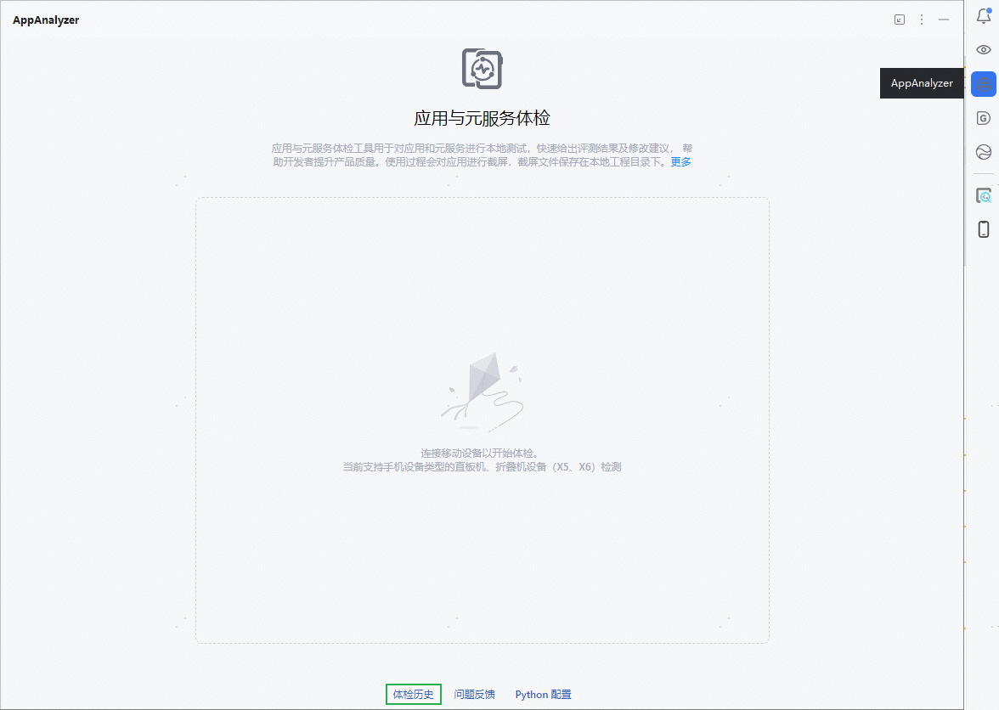
 点击“导入报告”，即可将Testing测试诊断出的体检文件导入体检工具进行解析。
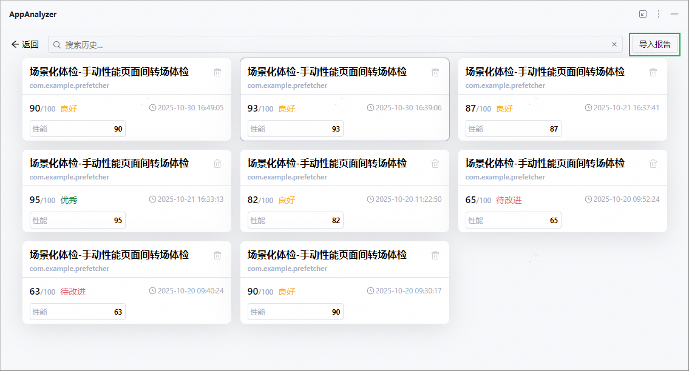

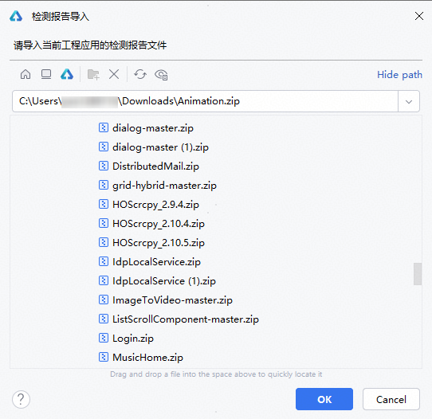

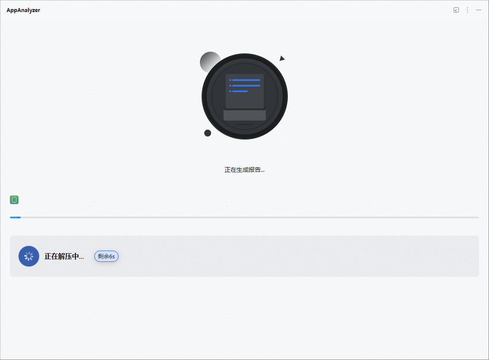

> [!NOTE]
> 检测报告导入前注意事项：
>  1、请导入和当前工程包名一致的检测报告文件。
>  2、请确认当前工程代码和被检测应用的版本是否一致。如果不一致，会导致诊断报告源码跳转代码行功能不准确。
>  3、如果被检测应用为应用市场上架版本，无法获取应用堆栈，会导致某些诊断规则无法执行。

3. **问题分析和修复**解析完成后，会生成测试报告和详情报告。通过测试报告，可以定位出性能问题的页面截图、检测指标和检测结果等。
