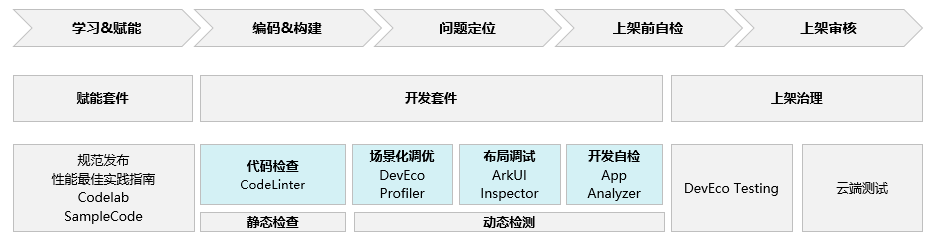
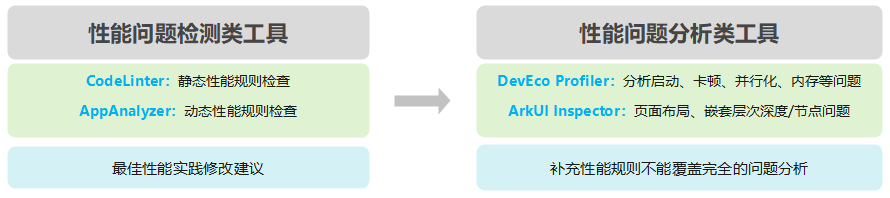
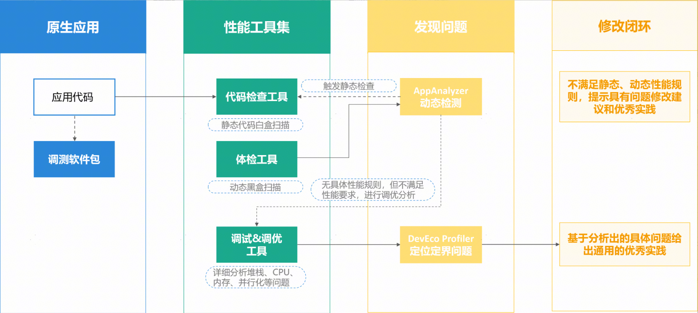

# 性能概览

更新时间：2026-03-12 08:45:02

来源：https://developer.huawei.com/consumer/cn/doc/best-practices/bpta-performance-guide-reading

 
性能调优贯穿于HarmonyOS应用开发的整个生命周期中。开发前有性能最佳实践和指南等赋能套件让开发者快速上手学习。开发过程中有性能工具开发套件覆盖应用开发各阶段。应用开发完成上架后有专业的性能测试工具检测应用性能指标。本文重点介绍应用开发过程中使用性能工具与性能优化文章定位分析性能问题流程，目前DevEco Studio主要集成了四种性能工具，在不同的开发阶段各有侧重，主要分为性能问题检测类工具和性能问题分析类工具。
 

 

##### 性能工具集定位分析性能问题流程

体检工具和代码检查工具联动：针对共性问题触发代码白盒检查，通过性能规则精确发现开发者开发过程中引入的性能问题，并给出具体的修改建议和范式。
 
体检工具和调试&调优工具联动：部分不能通过具体规则拦截的性能问题，跳转到调试&调优工具进行分析，分析并行化、组件耗时、页面层次等具体问题。
 

 1. 检测发现性能问题，在代码编辑阶段可以使用Code Linter代码检查工具对代码进行单个文件或者文件夹进行静态代码扫描；同时在应用功能开发完成后，在运行态可以使用应用体检工具检测应用运行过程中的性能问题；
2. 以应用体检工具为主，对于动态运行检测发现的性能问题，提供三种修复问题的路径：
- 根据跳转的官网性能指导来修改发现的性能问题；

3. 根据检测结果的问题页面，触发该页面源文件的Code Linter静态性能检查，根据静态检查结果跳转到官方最佳性能实践指导修复性能问题；

4. 根据检测结果的过程性能文件，跳转到DevEco Profiler导入该文件深入分析，定位发现性能瓶颈点；

  

  ##### 解决应用性能问题的策略

  构建以体检工具为主，调优工具为辅的性能工具集，通过应用体检发现问题并给出修复建议。

  

  ##### 滑动卡顿丢帧和时延类问题

  

  应用体检工具AppAnalyzer目前集成了场景化体检、规则体检和上架前体检，对于滑动卡顿丢帧和时延类性能问题，这类问题的定位思路如下：

  
打开应用体检工具和应用、连接设备，选择体检场景或者自定义选择性能检查项，点击开始执行应用体检；
- 执行检测过程分为自动检测和手动检测，手动体检需要根据提示完成手动操作应用。应用体检工具会自动分析发现应用执行过程中的性能问题，将检测结果呈现给用户，用户重点关注未通过项；
- 查看报告里面的可能故障原因和更多耗时数据，可以获取导致性能问题的原因。点击报告里面部分时间超链接可以拉起Profiler深入分析问题，点击查看截图超链接可以查看操作过程中的截图，点击方法名超链接可以跳转到问题代码，点击优化建议超链接可以获取对应问题的优化建议。根据优化建议优化性能问题后可以再次执行体检过程查看优化后的效果。

 
 

##### 内存类问题

对于应用的内存类问题，DevEco Profiler提供了[基础内存分析](https://developer.huawei.com/consumer/cn/doc/harmonyos-guides/ide-insight-session-allocations)和[内存泄漏分析](https://developer.huawei.com/consumer/cn/doc/harmonyos-guides/ide-insight-session-snapshot)能力：
 
- [分析ArkTS/JS内存](https://developer.huawei.com/consumer/cn/doc/best-practices/bpta-arkts-js-memory-analysis)：DevEco Studio中Profiler Snapshot模板支持采集堆内存快照和对比功能，且每次采集快照前都会触发垃圾回收（GC），通过对比操作前后的两个堆内存快照，可以直观地识别内存占用的根本原因，分析新增对象是否应被回收，并通过对象引用链找到合适的断点，从而解决问题。
- [分析native内存](https://developer.huawei.com/consumer/cn/doc/best-practices/bpta-native-memory-analysis)：DevEco Studio Profiler插件的Allocation模板，通过对基础库的malloc，free等函数进行插桩记录，可以抓取Native内存分配释放记录，包括大小和堆栈等数据，用以分析native内存的占用问题。

1.
