# libuv使用规范及案例

更新时间：2026-03-12 08:45:02

来源：https://developer.huawei.com/consumer/cn/doc/best-practices/bpta-stability-coding-standard-libuv

## 前言


本文主要从以下几方面展开，以帮助开发者正确使用libuv相关接口，并在出现问题时能够排查代码找到问题点：

- libuv使用细则
- 与libuv相关的Crash案例
- 与libuv相关的Freeze案例


## libuv使用细则


本章节主要阐述libuv中Requests和Handles的使用规范，确保开发者正确使用libuv接口，避免应用出现稳定性问题。关于libuv原理，感兴趣的开发者可参考libuv。


### libuv中Requests使用规范


在libuv库中，Request表示一个短暂的请求，不会被事件循环长期持有。请求任务执行完毕后，该请求在事件循环上的使命结束。如果需要继续下一次请求，必须再次调用相关接口。在libuv官方文档中，Request主要有如下几种类型：

```cpp
typedef struct uv_req_s uv_req_t;
typedef struct uv_getaddrinfo_s uv_getaddrinfo_t;
typedef struct uv_getnameinfo_s uv_getnameinfo_t;
typedef struct uv_shutdown_s uv_shutdown_t;
typedef struct uv_write_s uv_write_t;
typedef struct uv_connect_s uv_connect_t;
typedef struct uv_udp_send_s uv_udp_send_t;
typedef struct uv_fs_s uv_fs_t;
typedef struct uv_work_s uv_work_t;
typedef struct uv_random_s uv_random_t;
```

但是经过异步线程池的只有下面几种：

```cpp
typedef struct uv_getaddrinfo_s uv_getaddrinfo_t;
typedef struct uv_getnameinfo_s uv_getnameinfo_t;
typedef struct uv_fs_s uv_fs_t;
typedef struct uv_work_s uv_work_t;
typedef struct uv_random_s uv_random_t;
```

在HarmonyOS中，使用频率最高的数据结构是uv_work_t，主要用于自定义异步任务请求。与之配套的接口是uv_queue_work，定义如下：

```text
UV_EXTERN int uv_queue_work(uv_loop_t* loop,
uv_work_t* req,
uv_work_cb work_cb,
uv_after_work_cb after_work_cb);
```

loop表示请求所在的事件循环，work_cb表示执行在异步线程池的异步任务，after_work_cb表示在事件循环上处理异步任务的执行结果的回调。在HarmonyOS上，uv_queue_work的整个处理过程如下：

1. 调用uv_queue_work。
2. work_cb被封装成一个函数uv__queue_work，after_work_cb被封装成uv__queue_done。
3. 异步线程池（ffrt）执行uv__queue_work继而执行真正的work_cb。
4. 接下来，根据是否是主线程来分开处理。如果是主线程，将uv__queue_done根据优先级不同插入到主线程的eventhandler任务队列上等待执行。
5. 如果是其他TS线程或是开发者创建的事件循环线程，则将uv__queue_done放在wq队列上，并调用uv_async_send触发fd等待事件循环处理wq队列。


了解了uv_queue_work的执行原理后，开发者可以按照下面几种情况使用该接口。

异步任务执行一次即删除

伪代码写法1：

```text
Context* context = new Context; // context为开发者自定义的对象
uv_work_t* work = new uv_work_t;
work->data = (void*)context;
uv_queue_work(loop, work, [](uv_work_t*){
Context *ctx = (Context*)work->data;
// 业务逻辑
}, [uv_work_t* work, int status] {
Context *ctx = (Context*)work->data;
// 业务逻辑
delete ctx; // 是否删除由开发者决定
delete work;
});
```

伪代码写法2：

```text
class Context {
public:
uv_work_t work; // 该work与Context生命周期保持一致
}

Context* context = new Context; // context为开发者自定义的对象
context->work.data = (void*)context;
uv_queue_work(loop, &context->work, [](uv_work_t*){
Context *ctx = (Context*)work->data;
// 业务逻辑
}, [uv_work_t* work, int status] {
Context *ctx = (Context*)work->data;
// 业务逻辑
delete ctx; // 是否删除由开发者决定
});
```

上述代码遵循了一个基本原则：对于uv_queue_work的调用方式，必须确保释放内存的操作在after_work_cb中完成。开发者应避免自行管理异步任务的生命周期，因为无法确定任务在何时完成。对于在其他线程池中执行的异步请求，这一原则同样适用。

多次请求任务共用一个结构体

针对这种场景，如果预期的异步任务是在完成上一次异步请求后，继续使用同一个结构体执行相同的请求任务，可以使用以下类似的代码：

```cpp
uv_loop_t* loop;

bool g_done = false;
uv_work_t *work = new uv_work_t;
void ExecuteCB(uv_work_t *work) {
  // Business Logic
}


void CompleteCB(uv_work_t *work, int status) {
  // Business Logic
  if (!g_done) {
    uv_queue_work(work->loop, work, ExecuteCB, CompleteCB);
  } else {
    delete work;
  }
}
uv_queue_work(loop, work, ExecuteCB, CompleteCB);
```

这样可以减少对象的频繁申请和释放，降低开销。


> [!NOTE]
> 如果开发者无法确保创建的对象与libuv Requests对象的生命周期是否需要保持一致，最佳做法是将开发者自定义的对象与Requests对象分开创建，并将自定义对象放在Requests对象的data字段中。这样可以保证两者互不影响。即使自定义对象的生命周期管理出现问题，也不会影响系统库的正常执行。如果出现崩溃问题，崩溃栈会显示在具体的业务逻辑上，而不是系统库上，从而便于问题的定位。


### libuv中Handles使用规范


在libuv开发指南中，Handle表示一个持久的请求，可以被事件循环长期持有。如果开发者不调用uv_close函数，创建的Handle会持久保存在事件循环上，影响事件循环的正常退出。在官方文档中，Handle主要有如下几种类型：

```cpp
/* Handle types. */
typedef struct uv_loop_s uv_loop_t;
typedef struct uv_handle_s uv_handle_t;
typedef struct uv_dir_s uv_dir_t;
typedef struct uv_stream_s uv_stream_t;
typedef struct uv_tcp_s uv_tcp_t;
typedef struct uv_udp_s uv_udp_t;
typedef struct uv_pipe_s uv_pipe_t;
typedef struct uv_tty_s uv_tty_t;
typedef struct uv_poll_s uv_poll_t;
typedef struct uv_timer_s uv_timer_t;
typedef struct uv_prepare_s uv_prepare_t;
typedef struct uv_check_s uv_check_t;
typedef struct uv_idle_s uv_idle_t;
typedef struct uv_async_s uv_async_t;
typedef struct uv_process_s uv_process_t;
typedef struct uv_fs_event_s uv_fs_event_t;
typedef struct uv_fs_poll_s uv_fs_poll_t;
typedef struct uv_signal_s uv_signal_t;
```

但是HarmonyOS中常见的Handles，主要有以下几个：

```cpp
/* Handle representing an event loop */
typedef struct uv_loop_s uv_loop_t;
/* The parent structure of all handles */
typedef struct uv_handle_s uv_handle_t;
/* Handle used to represent timer tasks */
typedef struct uv_timer_s uv_timer_t;
/* Handle used to represent communication between threads */
typedef struct uv_async_s uv_async_t;
```

对于uv_loop_t的使用，不会出现严重问题。开发者在使用时，需在事件循环退出时正确释放事件循环中的资源，避免因事件循环无法退出导致资源泄露。如果开发者创建的事件循环不清楚上层业务如何使用，可以在退出时调用uv_walk遍历事件循环上的Handles，并在回调中调用uv_close将Handles从事件循环中移除。然后执行uv_run，确保异步任务执行完毕。这样可以保证事件循环的正常退出，前提是此过程中没有其他业务向事件循环中添加任务。具体可参考libuv中的事件循环。

在使用libuv中的Handles时，确保在不使用时调用uv_close，并且必须在事件循环所在的线程中调用，以避免多线程数据竞争问题。如果需要在多线程环境中操作Handles，可以参考libuv开发指南的“libuv timer使用规范“章节。

特别注意uv_close的使用，它并不会同步从事件循环中移除handle。在说明uv_close的运行逻辑之前，开发者需要了解几个背景知识：

- libuv中的事件循环上有多个任务队列，依次串行执行。例如，使用uv_idle_t，该Handle会依次插入到loop->idle_handles上；使用uv_async_t，便会插入到loop->async_handles。
- 事件循环里面又包含了一个handle_queue，它记录了初始化在事件循环上的所有的Handles。
- 每一个Handle上都有两个成员变量：一个是queue，它挂在对应的任务队列上，例如uv_async_t中的queue就挂在loop->async_handles；一个是handle_queue，它挂在loop->handle_queue上。以摘除uv_async_t为例，uv_close运行逻辑如下：


1. 调用uv_close，将uv_async_t从loop->async_handles上摘除，然后将uv_async_t结点挂到loop->closing_handles上，表示该结点正在关闭，并设置一些标志位。
2. 事件循环在本次迭代中继续往下执行，直到执行到uv__run_closing_handles这个函数。
3. 在2中的函数里，将uv_async_t中的handle_queue从loop->handle_queue摘下来，然后执行该结点的close_cb回调。该close_cb为开发者调用uv_close时传入的参数。因此，开发者需要注意的是：避免在调用uv_close后到事件循环执行在uv__run_closing_handles期间内，释放Handle句柄。


## 与libuv相关的Crash案例


本章将介绍应用调用uv接口引发的Crash案例。

案例一、某应用使用uv_close错误

问题描述：应用在native层调用libuv接口时，由于使用不当导致偶尔出现崩溃，崩溃栈位于libuv。崩溃栈如下：

```text
Pid:44250
Uid:20020034
Process name:crasher_cpp
Process life time:8s
Reason:Signal:SIGSEGV(SEGV MAPERR)0000000000000000000 probably caused by NULL pointer dereference
Fault thread info:
Tid:44250, Name:crasher_cpp
#00 pc 0000000000018528 /system/lib64/platformsdk/libuv.so(uv_run+724)(1616669436a9c6d4bcaf8ae1f5989855)
#01 pc 0000000000083518 /system/lib64/platformsdk/libruntime.z.so(OHOS::AbilityRuntime::OHOSLoopHandler::OnTriggered()+268)(d061df412ec8b3260629e85ba1a6344b)
#02 pc 00000000000833dc /system/lib64/platformsdk/libruntime.z.so(OHOS::AbilityRuntime::OHOSLoopHandler::OnReadable(int)+244) (dO61df412ec8b3260629e85ba1a6344b)
#03 pc 0000000000016710 /system/lib64/chipset-pub-sdk/libeventhandler.z.so(std:: __h::_ function::_ func<OHOS::AppExecFwk::EpollIoWaiter::HandleFileDescriptorEvent(i
#04 pc 000000000001aOdO /system/lib64/chipset-pub-sdk/libeventhandler.z.so(OHOS::AppExecFwk::EventHandler::DistributeEvent(std:: hocunique ptr<OHOS::AppExecFwk::Ir
#05 pc 0000000000028418 /system/lib64/chipset-pub-sdk/libeventhandler.z.so(OHOS::AppExecFwk::(anonymous namespace)::EventRunnerImpl::ExecuteEventHandler(std::_ hoste
#06 pc 0000000000027cbc /system/lib64/chipset-pub-sdk/libeventhandler.z.so(OHOS::AppExecFwk::(anonymous namespace)::EventRunnerImpl::Run()+880)(a83d7f5ebf4fe67105b5
#07 pc 000000000002a9d0 /system/lib64/chipset-pub-sdk/libeventhandler.z.so(OHOS::AppExecFwk::EventRunner::Run()+320)(a83d7f5ebf4fe67105b53501f28aa078)
#08 pc 00000000000ba48c /system/lib64/platformsdk/libappkit_native.z.so(OHOS::AppExecFwk::MainThread::Start()+872)(8f59740ee20585693a5c2814e1e9f6dd)
#09 pc 0000000000004ac4 /system/lib64/appspawn/appspawn/libappspawn_ace.z.so(RunChildProcessor(AppSpawnContent*, AppSpawnClient*)+216)(c368de983182514a8ea3Odaa3ba41
#10 pc 0000000000008688 /system/bin/appspawn(AppSpawnChild+436)(8e25bd745a01ef608e0816fd1eabcce2)
#11 pc 0000000000008368 /system/bin/appspawn(AppSpawnProcessMsg+564)(8e25bd745a01ef608e0816fd1eabcce2)
#12 pc 000000000000ff28 /system/bin/appspawn(OnReceiveRequest+676)(8e25bd745a01ef608e0816fd1eabcce2)
#13 pc 0000000000017af8 /system/lib64/chipset-pub-sdk/libbegetutil.z.so(HandleRecvMsg_+260)(fcd62c07eOd7d3c70d75c3c61180bc55)
#14 pc 0000000000017618 /system/lib64/chipset-pub-sdk/libbegetutil.z.so(HandleStreamEvent_+168)(fcd62c07eOd7d3c70d75c3c61180bc55)
```

原因分析：反编译解栈得到如下调用链：

uv_run->uv__run_closing_handles->uv__finish_close->uv__queue_remove

uv__queue_remove表示将某结点从事件循环队列上摘除。现在崩溃在这个函数上面，又是空指针解引用。这种情况下，开发者只需要参考使用ASan检测内存错误这篇文档，开启ASan后复现，即可将具体崩溃栈获取到。通过解栈定位到具体代码行。在本例中，出错代码如下：

```text
class NapiTaskRunner : public AbstractTaskRunner {
public:
NapiTaskRunner (
napi env env,
ExceptionHandler exceptionHandler = defaultExceptionHandler);
~NapiTaskRunner() override;
NapiTaskRunner(const NapiTaskRunner&) = delete;
NapiTaskRunner& operator=(const NapiTaskRunner&) = delete;
void runAsyncTask(Task&& task) override;
void runSyncTask(Task&& task) override;
bool isOnCurrentThread() const override;
void setExceptionHandler (ExceptionHandler handler) override;
private:
napi env env;
uv_loop_t* getLoop() const;
uv_async_t	asyncHandle;
std::mutex tasksMutex;
std::queue<Task> tasksQueue;
std::thread::id threadId;
std::condition_variable cv;
std::shared_ptr<std::atomic_bool> running = std::make_shared<std::atomic_bool>(true);
ExceptionHandler exceptionHandler;
};

//构造函数部分代码
NapiTaskRunner::NapiTaskRunner (napi_env env, ExceptionHandler exceptionHandler)
: env(env), exceptionHandler(std::move (exceptionHandler)) {
threadId = std::this_thread::get id();
auto loop = getLoop() ;
asyncHandle.data = static_cast<void*>(this);
uv_async_init(loop, &asyncHandle, [](auto handle) {});
}

//析构函数部分代码
NapiTaskRunner::~NapiTaskRunner() {
running->store(false);
cv.notify_all();
uv_close(reinterpret_cast<uv_handle_t*>(&asyncHandle), nullptr);
}
```

将内存操作放在析构函数中执行是个好习惯，但开发者可能并未完全理解uv_close的调用时序。当uv_async_t作为NapiTaskRunner的普通成员变量时，asyncHandle的生命周期与NapiTaskRunner保持一致。在析构函数中调用uv_close将该句柄从事件循环中移除，但由于uv_close是一个异步操作，调用后并不能立即完成整个移除过程。因此，当析构函数执行完毕后，asyncHandle会被释放。如果事件循环随后尝试操作该节点，将会导致崩溃。

崩溃原因如下：


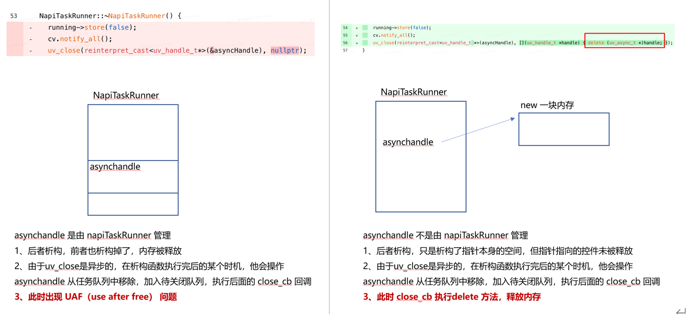


解决方法：

如果开发者需要将asyncHandle放在自定义对象中，可以将其作为指针放在NapiTaskRunner中。在构造函数中使用new创建asyncHandle，在析构函数中调用uv_close。这样，NapiTaskRunner和asyncHandle可以互不影响。

```cpp
class NapiTaskRunner : public AbstractTaskRunner {
public:
  NapiTaskRunner (
  napi_env env,
  ExceptionHandler exceptionHandler = defaultExceptionHandler);
  ~NapiTaskRunner() override;
  NapiTaskRunner(const NapiTaskRunner&) = delete;
  NapiTaskRunner& operator=(const NapiTaskRunner&) = delete;
  void runAsyncTask(Task&& task) override;
  void runSyncTask(Task&& task) override;
  bool isOnCurrentThread() const override;
  void setExceptionHandler (ExceptionHandler handler) override;
private:
  napi_env env;
  uv_loop_t* getLoop() const;
  uv_async_t* asyncHandle;
  std::mutex tasksMutex;
  std::queue<Task> tasksQueue;
  std::thread::id threadId;
  std::condition_variable cv;
  std::shared_ptr<std::atomic_bool> running = std::make_shared<std::atomic_bool>(true);
  ExceptionHandler exceptionHandler;
};


//Constructor code section
NapiTaskRunner::NapiTaskRunner (napi_env env, ExceptionHandler exceptionHandler)
: env(env), exceptionHandler(std::move (exceptionHandler)) {
  threadId = std::this_thread::get_id();
  auto loop = getLoop() ;
  asyncHandle = new uv_async_t;
  asyncHandle->data = static_cast<void*>(this);
  uv_async_init(loop, asyncHandle, [](auto handle) {});
}


//Destructor section code
NapiTaskRunner::~NapiTaskRunner() {
  running->store(false);
  cv.notify_all();
  uv_close(reinterpret_cast<uv_handle_t*>(asyncHandle), [](uv_handle_t* handle) {
    delete (uv_async_t*)handle;
  });
}
```

案例二、异步任务执行过程中崩溃

异步任务执行过程中出现崩溃，可以分为三种场景进行分析：

- 崩溃在主线程的after_work_cb的封装函数uv__queue_done执行之前。
- 崩溃在主线程的after_work_cb的封装函数uv__queue_done执行期间。
- 崩溃在异步线程的work_cb执行之前。


场景一

问题描述：应用在主线程执行after_work_cb之前，函数地址被破坏，导致崩溃。部分调用栈如下：

```text
Pid:13724
Uid:20020032
Process name:crasher_cpp
Reason:Signal:SIGBUS(BUS_ADRALN)@0xddde2ddf82f7dddd
Process life time:24s
Fault thread info:
Tid:13724, Name:crasher_cpp
#00 pc ddde2ddf82f7dddd Not mapped
#01 pc 000000000007c2fc /system/lib64/platformsdk/libruntime.z.so	(430e3acd9544f1f7ca5b27a4cecc0195)
#02 pc 000000000001ad94 /system/lib64/chipset-pub-sdk/libeventhandler.z.so(OHOS: :AppExecFwk::EventHandler::DistributeEvent(std::_h::unique ptr<OHOS::AppExecFwk::InnerEvent, void (*)(OHOS::AppExecFwk::InnerEvent*)> con=
#03 pc 000000000002bcf4 /system/lib64/chipset-pub-sdk/libeventhandler.z.so(OHOS::AppExecFwk::(anonymous namespace):EventRunnerImpl::ExecuteEventHandler(std::__h::unique ptr<OHOS::AppExecFwk::InnerEvent, void (*)(OHOS:
#04 pc 000000000002b5cc /system/lib64/chipset-pub-sdk/libeventhandler.z.so(OHOS::AppExecFwk::(anonymous namespace)::EventRunnerImpl::Run()+880)(b89cf5c314801ffd0e29111078d34982)
#05 pc 000000000002e96c /system/lib64/chipset-pub-sdk/libeventhandler.z.so(OHOS::AppExecFwk::EventRunner::Run()+524)(b89cf5c314801ffd0e29111078d34982)
#06 pc 00000000000b3fb4 /system/lib64/platformsdk/libappkit_native.z.so(OHOS::AppExecFwk::MainThread::Start()+616)(e9ba1356486e1df571afbc78c5f9d693)
#07 pc 0000000000004e28 /system/lib64/appspawn/appspawn/libappspawn_ace.z.so(RunChildProcessor(AppSpawnContent*, AppSpawnClient*)+568)(9f5d8e5303d934ad8210339181dca305)
#08 pc 000000000000b308 /system/bin/appspawn(AppSpawnChild+576)(ea1fc238c52f4e7577605cb35a5238b7)
#09 pc 000000000000af9c /system/bin/appspawn(AppSpawnProcessMsg+712)(ea1fc238c52f4e7577605cb35a5238b7)
#10 pc 00000000000138e0 /system/bin/appspawn(ProcessSpawnReqMsg+228)(ea1fc238c52f4e7577605cb35a5238b7)
```

问题分析：

根据崩溃栈，第0帧为Notmapped，表明after_work_cb的地址为ddde2ddf82f7dddd，该地址已不是正常的PC地址，且ddd和末尾的ddd表示这块内存已被释放。因此，可以判定这是由于UAF（useafterfree）导致的崩溃。对于这类问题，开发者可以根据崩溃栈的寄存器信息找到一些现场信息，但异步任务的崩溃通常离问题现场较远。因此，HarmonyOS还提供了ASan检测工具，使用该工具复现问题，可以轻松找到问题现场。下面是通过工具抓到的现场：

初次分配的调用栈如下：


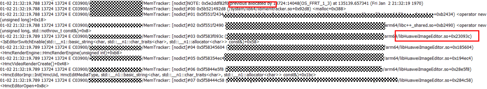


第一次释放的调用栈如下：


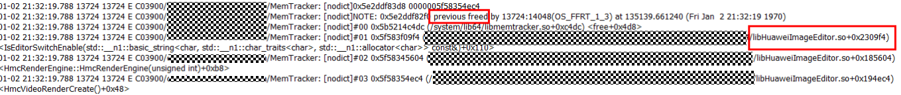


经过相关开发者的反编译，定位到现场，代码如下：


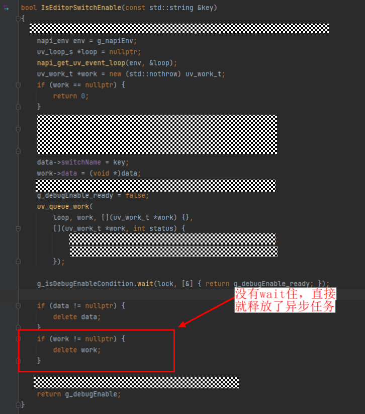


问题结论：调用uv_work_t相关的函数时，内存的释放动作一定要放在after_work_cb里面。如果开发者没法控制好自定义对象的生命周期，就可以通过uv_work_t和自定义对象分开的方式，将uv_work_t的内存释放放在after_work_cb里，自定义对象的内存由开发者自行管理。

场景二

问题描述：应用在异步任务生命周期管理中出现问题，导致在uv__queue_done期间崩溃。崩溃栈如下：

```text
Pid:26268
uid:20020114
Process name:crasher_cpp
Process life time:18s
Reason:Signal:SIGSEGV(SEGV MAPERR)@0x0000007400650073
Fault thread info:
Tid:26268, Name:crasher_cpp
#00 pc 00000000000112fc /system/lib64/platformsdk/libuv.so(uv_queue_done+8)(a90636dbbfd39960db73e29590075d11)
#01 pc 000000000007c28c /system/lib64/platformsdk/libruntime.z.so(92caabbc4aec7feb10ce78ccb2755b86)
#02 pc 000000000001ad8c /system/lib64/chipset-pub-sdk/libeventhandler.z.so(OHOS::AppExecFwk::EventHandler::DistributeEvent (std::h:unique ptr<OHOS::AppExecFwk::InnerEvent, void (*)
#03 pc 000000000002b580 /system/lib64/chipset-pub-sdk/libeventhandler.z.so(OHOS::AppExecFwk::(anonymous namespace)::EventRunnerImpl::ExecuteEventHandler (std:: h::unique ptr<OHOS::Apr
#04 pc 000000000002ae58 /system/lib64/chipset-pub-sdk/libeventhandler.z.so(OHOS::AppExecFwk::(anonymous namespace)::EventRunnerImpl::Run()+880)(6394acafle4743acfbb25998ee37297b)
#05	pc 000000000002e1£8 /system/lib64/chipset-pub-sdk/libeventhandler.z.so(OHOS::AppExecFwk::EventRunner::Run ()+524)(6394acaf1e4743acfbb25998ee37297b)
#06	pc 00000000000b4408 /system/lib64/platformsdk/libappkit_native.z.so(OHOS::AppExecFwk::MainThread::Start()+408)(7771dOfba84d0fcd69£48428a264274a)
#07	pc 0000000000004d18 /system/lib64/appspawn/appspawn/libappspawn_ace.z.so (RunChildProcessor(AppSpawnContent*, AppSpawnClient*)+560)(e33c30d195115715c46ece122£278d5£)
#08	pc 000000000000a4a4 /system/bin/appspawn(AppSpawnChild+484)(f60d4361d8bc8fe7e6b3a73529a98031)
#09	pc 000000000000a194 /system/bin/appspawn(AppSpawnProcessMsg+688)(f60d4361d8bc8fe7e6b3a73529a98031)
#10	pc 0000000000011c18 /system/bin/appspawn(ProcessSpawnReqMsg+228)(f60d4361d8bc8fe7e6b3a73529a98031)
#11	pc 0000000000011238 /system/bin/appspawn(OnReceiveRequest+172)(£60d4361d8bc8fe7e6b3a73529a98031)
#12	pc 0000000000016058 /system/lib64/chipset-pub-sdk/libbegetutil.z.so(HandleRecvMsg_+292)(bc25e5f0f7a71£78a286£419d13c202£)
#13	pc 0000000000015b58 /system/lib64/chipset-pub-sdk/libbegetutil.z.so(HandleStreamEvent_+172) (bc25e5f0f7a71£78a286£419d13c202f)
#14	pc 0000000000013230 /system/lib64/chipset-pub-sdk/libbegetutil.z.so(ProcessEvent+108)(bc25e5f0f7a71£78a286£419d13c202f)
#15	pc 0000000000012df0 /system/lib64/chipset-pub-sdk/libbegetutil.z.so(RunLoop_+356)(bc25e5f0f7a71f78a286£419d13c202f)
#16	pc 000000000000£3c0 /system/bin/appspawn(AppSpawnRun+136)(f60d4361d8bc8fe7e6b3a73529a98031)
#17	pc 000000000000cd4c /system/bin/appspawn(main+744)(£60d4361d8bc8fe7e6b3a73529a98031)
#18	pc 00000000000a05£4 /system/lib/ld-musl-aarch64.so.1(1ibc start main stage2+64)(73£87e7c2e4e0d3e8e0510b97431a820)
```

问题分析：

此类问题通常源于开发者对uv_work_t对象生命周期管理不当导致的崩溃。然而，如何溯源一直是个难题。本案例介绍了一种特殊方法，即利用crash文件中的寄存器信息推测问题现场。

首先，经过反编译，可以看到具体的代码行和汇编指令，如下：


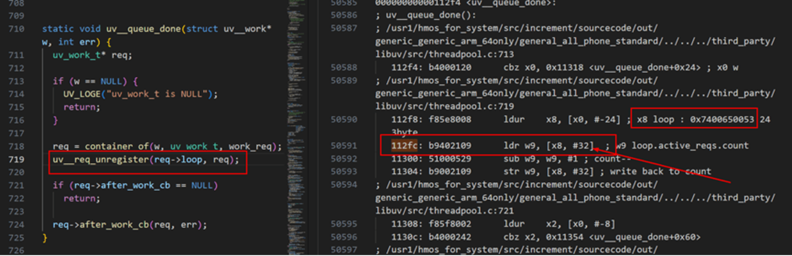


上图红框中的汇编指令含义：

112fc：表示将x8寄存器的值加上十进制的32作为地址，然后将该地址的内容取出来放在w9寄存器中。（其实w9就是x9，一个是32位，一个是64位）w9 = [x8+32]

112f8：将x0寄存器的值减去十进制的24作为地址，将该地址的内容放在x8寄存器里头。x8 = [x0 - 24] 。 []表示取内容

再来解释一下上述两个寄存器存放的是什么内容。这里有个基本的知识，在C++函数中，x0寄存器往往对应着函数的第一个形参。所以x0寄存器放的就是形参w的地址。然后根据112f8这条指令，可以知道从x0对应的地址向前偏移24个字节就是x8寄存器的内容。x8表示的内容可由下面的结构体推测出来：

```text
struct uv_work_s {
UV_REQ_FIELDS
uv_loop_t* loop; //x0 -24
uv_work_cb work_cb; //x0 -16
uv_after_work_cb after_work_cb; //x0 -8
struct uv__work work_req; //x0
};
```

根据上述内存布局，x8寄存器存放的是loop的地址。当前的错误出现在x8寄存器上，这验证了上述结论，表明这是一个异步任务的UAF问题。

接下来，通过分析uv_work_s结构体，可以发现该结构体包含uv__queue_done的第一个参数w，以及最重要的after_work_cb函数指针。

after_work_cb是开发者传入的函数指针，通常在开发者编写的代码文件中定义，并最终编译到动态库（so）中。HarmonyOS上的crash文件包含当前应用进程映射的so文件的地址范围。因此，开发者可以通过after_work_cb的地址在crash文件中找到对应的so文件，并通过起始地址定位到具体代码行。检查x0寄存器是否仍然保留after_work_cb的信息。


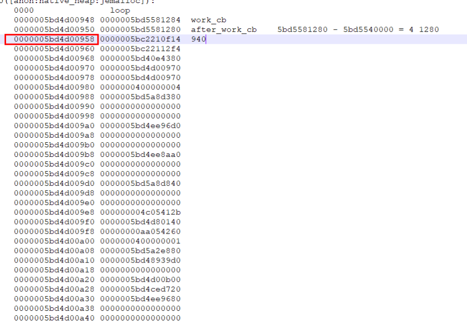


x0包含after_work_cb的地址。根据该地址确定其所在的so文件地址范围，再用该地址减去so文件的起始地址，即可得到其偏移地址。通过反编译可以找到具体的代码行。


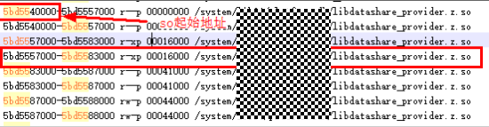


具体的代码：

```text
void DataShareUvQueue::LambdaForWork(uv_work_t *work, int uvstatus)
{
if (work == nullptr || work->data == nullptr) {
LOG_ERROR("invalid work or work->data.");
return;
}
auto *entry = static_cast<UvEntry*>(work->data);
{
// 报错在这一行，加锁失败。
std::unique_lock<std::mutex> lock(entry->mutex);
if (entry->func) {
entry->func();
}
entry->done = true;
if (!entry->purge) {
entry->condition.notify_all();
return;
}
}
DataShareUvQueue::Purge(work);
}

void DataShareUvQueue::SyncCall(NapiVoidFunc func, NapiBoolFunc retFunc)
{
// 动态申请uv_work_t
uv_work_t* work = new (std::nothrow) uv_work_t;
if (work == nullptr) {
LOG_ERROR("invalid work.");
return;
}
// 申请一个UvEntry赋值给work->data
work->data = new UvEntry {env_, std::move(func), false, false, {}, {}, std::move(retFunc)};
if (work->data == nullptr) {
delete work;
LOG_ERROR("invalid uvEntry.");
return;
}

bool noNeedPurge = false;
auto *uvEntry = static_cast<UvEntry*>(work->data);
{
std::unique_lock<std::mutex> lock(uvEntry->mutex);
// 抛异步任务，一切都是正常的
auto status = uv_queue_work(
loop_, work, [](uv_work_t *work) {}, LambdaForWork);
if (status != napi_ok) {
LOG_ERROR("queue work failed");
DataShareUvQueue::Purge(work);
return;
}
// 异步转同步，实际上只要不在同一个线程，其实也没问题，就是代码实现比较难看
if (uvEntry->condition.wait_for(lock, std::chrono::seconds(WAIT_TIME), [uvEntry] { return uvEntry->done; })) {
auto time = static_cast<uint64_t>(duration_cast<milliseconds>(
system_clock::now().time_since_epoch()).count());
LOG_INFO("function ended successfully. times %{public}" PRIu64 ".", time);
}
// 好了，到这里就开始出现问题了。这个本质上是在处理异常，也就是任务都执行不到的时候，需要调用uv_cancel取消该任务。然后往下执行Purge做清理动作。
if (!uvEntry->done && uv_cancel((uv_req_t*)work) != napi_ok) {
LOG_ERROR("uv_cancel failed.");
uvEntry->purge = true;
noNeedPurge = true;
}
}

CheckFuncAndExec(uvEntry->retFunc);
if (!noNeedPurge) {
// Purge是做清理动作的，包括delete uv_work_t和delete uvEntry
DataShareUvQueue::Purge(work);
}
}
```

上述代码出错的原因是开发者对uv_cancel函数不熟悉。uv_cancel函数的运行逻辑如下：

1. 首先它会根据uv_work_t中的异步任务work_cb的状态判断该任务可否被取消，如果不可以则返回。
2. 然后，将work_cb置为uv__cancelled。并将异步流程继续往下执行，然后将status设为UV_ECANCELED传给after_work_cb
3. 最后，继续执行after_work_cb。uv_cancel实际上不会真正取消异步任务，也不会阻止after_work_cb回调的执行。如果开发者调用uv_cancel但不在回调中检查status是否等于UV_ECANCELED，代码将不会按预期执行。这可能导致清理工作不到位，进而引发double free或UAF问题。


问题结论：确保在after_work_cb中释放异步任务对象的内存。

场景三

问题描述：某应用调用异步任务，在异步线程池中执行work_cb之前发生崩溃，崩溃栈如下：

```text
Thread name:OS_FFRT
#00 pc 0000000000000000 Not mapped
#01 pc 0000000000012790/system/lib64/platformsdk/libuv.so(uv_ffrt_work+56)(e51f7fcef979b717a8cfda493466e715)
#02 pc 00000000000647bc/system/lib64/ndk/libffrt.so(ffrt:CPUWorker:Run(ffrt_executor_task*, int)+488)(2922cbbd7fc6ad47a9cdddf7480a607e)
#03 pc 0000000000064fe8 /system/lib64/ndk/libffrt.so(ffrt:CPUWorker::RunTask(ffrt_executor_task*, ffrt::CPUWorker*)+124)(2922cbbd7fc6ad47a9cdddf7480a607e)
#04 pc 000000000006553c/system/lib64/ndk/libffrt.so(ffrt:CPUWorker:WorkerLooperDefault(ffrt::WorkerThread*)+588)(2922cbbd7fc6ad47a9cdddf7480a607e)
#05 pc 0000000000064e84/system/lib64/ndk/libffrt.so(ffrt:CPUWorker:Dispatch(ffrt:CPUWorker*)+144)(2922cbbd7fc6ad47a9cdddf7480a607e)
#06 pc 0000000000064ddc/system/lib64/ndk/libffrt.so(ffrt:CPUWorker:WrapDispatch(void*)+28)(2922cbbd7fc6ad47a9cdddf7480a607e)
#07 pc 00000000001bc964 /system/lib/ld-musl-aarch64.so.1(start+236)(9df691eca4c7c964a4d25c8af1c7a550)
```

问题分析：

由于该问题场景复现极其困难，只能依赖大数据复现，因此工具的作用并不大。最终只能排查代码，将前文伪代码写法2的代码全部分离，采用自定义对象与uv对象独立创建的形式，修改完毕后，该问题不再复现。修改如下：


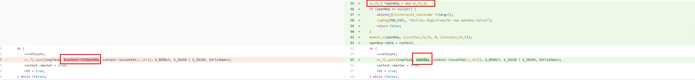


问题结论：参考场景一，如果不确定自定义创建的对象与UV异步任务对象的生命周期管理是否同步，建议将两者分离开来，独立进行管理。

```text
Context* context = new Context;//context为开发者自定义的对象
uv_work_t* work = new uv_work_t;
work->data = (void*)context;
uv_queue_work(loop, work, [](uv_work_t*){
Context *ctx = (Context*)work->data;
//业务逻辑
}, [uv_work_t* work, int status] {
Context *ctx = (Context*)work->data;
//业务逻辑
delete ctx; //是否删除由开发者决定
delete work;
});
```


## 与libuv相关的Freeze案例


libuv作为框架提供给开发者一些异步IO的能力，它本身不会造成死锁。如果freeze栈体现的是libuv相关接口在栈顶，都是开发者在主线程（UI线程）调用了libuv一些阻塞式的接口导致。这种情况下，就需要开发者尽量避免在主线程调用libuv的阻塞接口，比如文件的同步读取。另外，开发者使用libuv接口不当也会造成卡死在事件循环框架上，这个后面会介绍到。

案例一、主线程调用uv阻塞接口

问题描述：某应用在主线程调用文件模块的同步接口，该TS接口底层使用uv底层能力。导致在sendfile的时候，阻塞主线程产生freeze。

```text
Tid:19473, Name:app_name
#00 pc 00000000000a457c /system/lib/ld-musl-aarch64.so.1(fbb1eb526bb54f59c5dc4f2521b68e52)
#01 pc 0000000000019f88 /system/lib64/platformsdk/libuv.so(uv__fs_work+2956)(afecd0c8f506e5fc1661ef2cb46dea9d)
#02 pc 000000000001c048 /system/lib64/platformsdk/libuv.so(uv_fs_sendfile+148)(afecd0c8f506e5fc1661ef2cb46dea9d)
#03 pc 000000000011d27c /system/lib64/module/file/libfs.z.so(OHOS::FileManagement::ModuleFileIO::OpenFile(OHOS::FileManagement::ModuleFileIO::FileInfo&, OHOS::FileManagement::ModuleFileIO::FileInfo&)+732)(c8dbb978ac2472548e07ccb7f6f9eb18)
#04 pc 000000000011c99c /system/lib64/module/file/libfs.z.so(OHOS::FileManagement::ModuleFileIO::CopyFile::Sync(napi_env__*, napi_callback_info__*) (.cfi)+756)(c8dbb978ac2472548e07ccb7f6f9eb18)
#05 pc 000000000003dec8 /system/lib64/platformsdk/libace_napi.z.so(panda::JSValueRef ArkNativeFunctionCallBack<true>(panda::JsiRuntimeCallInfo*)+216)(e9eee6ffeb9040c06af8fe2188c7ee8e)
#06 pc 00000000003f3b6c /system/lib64/module/arkcompiler/stub.an(RTStub_PushCallArgsAndDispatchNative+40)
#07 at handleSendVideo (entry|feat_chat|1.0.0|src/main/ets/viewmodel/ChatViewModel.ts:874:1)
#08 pc 00000000003a1500 /system/lib64/platformsdk/libark_jsruntime.so(panda::ecmascript::InterpreterAssembly::GeneratorReEnterInterpreter(panda::ecmascript::JSThread*, panda::ecmascript::JSHandle<panda::ecmascript::GeneratorContext>)+104)(77423abf0869226a2e04e046a4b743b7)
#09 pc 00000000003db234 /system/lib64/platformsdk/libark_jsruntime.so(panda::ecmascript::EcmaInterpreter::GeneratorReEnterInterpreter(panda::ecmascript::JSThread*, panda::ecmascript::JSHandle<panda::ecmascript::GeneratorContext>)+144)(77423abf0869226a2e04e046a4b743b7)
#10 pc 000000000038fc34 /system/lib64/platformsdk/libark_jsruntime.so(panda::ecmascript::GeneratorHelper::Next(panda::ecmascript::JSThread*, panda::ecmascript::JSHandle<panda::ecmascript::GeneratorContext> const&, panda::ecmascript::JSTaggedValue)+156)(77423abf0869226a2e04e046a4b743b7)
#11 pc 000000000046c6c0 /system/lib64/platformsdk/libark_jsruntime.so(77423abf0869226a2e04e046a4b743b7)
#12 pc 00000000002757ac /system/lib64/platformsdk/libark_jsruntime.so(panda::ecmascript::builtins::BuiltinsPromiseHandler::AsyncAwaitFulfilled(panda::ecmascript::EcmaRuntimeCallInfo*)+112)(77423abf0869226a2e04e046a4b743b7)
#13 pc 00000000003f37b0 /system/lib64/module/arkcompiler/stub.an(RTStub_AsmInterpreterEntry+208)
#14 pc 00000000003a12b8 /system/lib64/platformsdk/libark_jsruntime.so(panda::ecmascript::InterpreterAssembly::Execute(panda::ecmascript::EcmaRuntimeCallInfo*)+216)(77423abf0869226a2e04e046a4b743b7)
#15 pc 0000000000277568 /system/lib64/platformsdk/libark_jsruntime.so(panda::ecmascript::builtins::BuiltinsPromiseJob::PromiseReactionJob(panda::ecmascript::EcmaRuntimeCallInfo*)+344)(77423abf0869226a2e04e046a4b743b7)
#16 pc 00000000003f37b0 /system/lib64/module/arkcompiler/stub.an(RTStub_AsmInterpreterEntry+208)
#17 pc 00000000003a12b8 /system/lib64/platformsdk/libark_jsruntime.so(panda::ecmascript::InterpreterAssembly::Execute(panda::ecmascript::EcmaRuntimeCallInfo*)+216)(77423abf0869226a2e04e046a4b743b7)
#18 pc 0000000000408d18 /system/lib64/platformsdk/libark_jsruntime.so(panda::ecmascript::job::MicroJobQueue::ExecutePendingJob(panda::ecmascript::JSThread*, panda::ecmascript::JSHandle<panda::ecmascript::job::MicroJobQueue>)+552)(77423abf0869226a2e04e046a4b743b7)
#19 pc 0000000000367d78 /system/lib64/platformsdk/libark_jsruntime.so(panda::ecmascript::EcmaContext::ExecutePromisePendingJob()+92)(77423abf0869226a2e04e046a4b743b7)
#20 pc 000000000058ebcc /system/lib64/platformsdk/libark_jsruntime.so(panda::PromiseCapabilityRef::Resolve(panda::ecmascript::EcmaVM const*, unsigned long)+256)(77423abf0869226a2e04e046a4b743b7)
#21 pc 0000000000060c28 /system/lib64/platformsdk/libace_napi.z.so(napi_resolve_deferred+120)(e9eee6ffeb9040c06af8fe2188c7ee8e)
#22 pc 00000000005455c0 /system/lib64/libmedialibrary_nutils.z.so(OHOS::Media::MediaLibraryNapiUtils::InvokeJSAsyncMethod(napi_env__*, napi_deferred__*, napi_ref__*, napi_async_work__*, OHOS::Media::JSAsyncContextOutput const&) (.cfi)+264)(c9ee202598f64bfbd76934922ac5a1e8)
#23 pc 00000000004729d0 /system/lib64/libmedialibrary_nutils.z.so(OHOS::Media::JSGetThumbnailCompleteCallback(napi_env__*, napi_status, OHOS::Media::FileAssetAsyncContext*) (.cfi)+504)(c9ee202598f64bfbd76934922ac5a1e8)
#24 pc 000000000006652c /system/lib64/platformsdk/libace_napi.z.so(NativeAsyncWork::AsyncAfterWorkCallback(uv_work_s*, int)+524)(e9eee6ffeb9040c06af8fe2188c7ee8e)
#25 pc 000000000007c9c0 /system/lib64/platformsdk/libruntime.z.so(929be9ac71f5f1b8c50d931718342ac3)
#26 pc 000000000001bdb4 /system/lib64/chipset-pub-sdk/libeventhandler.z.so(OHOS::AppExecFwk::EventHandler::DistributeEvent(std::__h::unique_ptr<OHOS::AppExecFwk::InnerEvent, void (*)(OHOS::AppExecFwk::InnerEvent*)> const&)+1140)(ea7c9b930d7b542607af81677dd531e7)
#27 pc 000000000002d6a8 /system/lib64/chipset-pub-sdk/libeventhandler.z.so(OHOS::AppExecFwk::(anonymous namespace)::EventRunnerImpl::ExecuteEventHandler(std::__h::unique_ptr<OHOS::AppExecFwk::InnerEvent, void (*)(OHOS::AppExecFwk::InnerEvent*)>&)+348)(ea7c9b930d7b542607af81677dd531e7)
#28 pc 000000000002cf64 /system/lib64/chipset-pub-sdk/libeventhandler.z.so(OHOS::AppExecFwk::(anonymous namespace)::EventRunnerImpl::Run()+908)(ea7c9b930d7b542607af81677dd531e7)
#29 pc 0000000000030308 /system/lib64/chipset-pub-sdk/libeventhandler.z.so(OHOS::AppExecFwk::EventRunner::Run()+528)(ea7c9b930d7b542607af81677dd531e7)
#30 pc 00000000000b19ac /system/lib64/platformsdk/libappkit_native.z.so(OHOS::AppExecFwk::MainThread::Start()+400)(fe61820fe652b04577747dfc89270211)
#31 pc 0000000000004e34 /system/lib64/appspawn/appspawn/libappspawn_ace.z.so(RunChildProcessor(AppSpawnContent*, AppSpawnClient*)+568)(7c113fbf97a325774d8a727348d15388)
#32 pc 000000000000ba7c /system/bin/appspawn(AppSpawnChild+576)(3d47202f3e52b59a2a29815389a567f0)
#33 pc 0000000000015320 /system/bin/appspawn(ProcessSpawnReqMsg+3180)(3d47202f3e52b59a2a29815389a567f0)
#34 pc 00000000000134b8 /system/bin/appspawn(OnReceiveRequest+132)(3d47202f3e52b59a2a29815389a567f0)
#35 pc 0000000000016cf8 /system/lib64/chipset-pub-sdk/libbegetutil.z.so(HandleRecvMsg_+344)(3e5c25bc70c753fec6381de8070a97e0)
#36 pc 00000000000167cc /system/lib64/chipset-pub-sdk/libbegetutil.z.so(HandleStreamEvent_+192)(3e5c25bc70c753fec6381de8070a97e0)
#37 pc 0000000000013eac /system/lib64/chipset-pub-sdk/libbegetutil.z.so(ProcessEvent+88)(3e5c25bc70c753fec6381de8070a97e0)
#38 pc 0000000000013a68 /system/lib64/chipset-pub-sdk/libbegetutil.z.so(RunLoop_+308)(3e5c25bc70c753fec6381de8070a97e0)
#39 pc 00000000000113b4 /system/bin/appspawn(AppSpawnRun+212)(3d47202f3e52b59a2a29815389a567f0)
#40 pc 000000000000ecd4 /system/bin/appspawn(main+764)(3d47202f3e52b59a2a29815389a567f0)
#41 pc 00000000000a12c0 /system/lib/ld-musl-aarch64.so.1(libc_start_main_stage2+64)(fbb1eb526bb54f59c5dc4f2521b68e52)
```

问题结论：

开发者在使用文件同步接口时，不要在主线程上调用。建议在worker线程或taskpool中调用。

案例二、pdf必现卡死在事件循环

问题描述：应用在taskpool场景中调用其他SDK中的so接口时，会导致在libuv上卡死。

```text
Tid:61139, Name:example.pdftest
#00 pc 0000000000018044 /system/lib64/platformsdk/libuv.so(uv async_io+360)(fe4a9f2630458fa5b8b7b0e4dacc5f9a)
#01 pc 0000000000017720 /system/lib64/platformsdk/libuv.so(uv_io_poll+1268)(fe4a9f2630458fa5b8b7b0e4dacc5f9a)
#02 pc 0000000000018540 /system/lib64/platformsdk/libuv.so(uv_run+376)(fe4a9f2630458fa5b8b7b0e4dacc5f9a)
#03 pc 00000000000768b4 /system/lib64/platformsdk/libruntime.z.so(OHOS::AbilityRuntime::OHOSLoopHandler:OnTriggered()+148)(09902ebffe1260cecd7be3e24ad58df5)
#04 pc 00000000000195b8 /system/lib64/chipset-pub-sdk/libeventhandler.z.so(96fe4d4a21391569c237423eae1d16df)
#05 pc 0000000000015324 /system/lib64/chipset-pub-sdk/libeventhandler.z.so(OHOS::AppExecFwk::EventHandler:DistributeEvent(std: h:unique ptrOHOS::AppExecFwk:In
#06 pc 0000000000023f78 /system/lib64/chipset-pub-sdk/libeventhandler.z.so(OHOS::AppExecFwk:(anonymous namespace):EventRunnerImpl:ExecuteEventHandler(std:: hu
#07 pc 0000000000023850 /system/lib64/chipset-pub-sdk/libeventhandler.z.so(OHOS::AppExecFwk::(anonymous namespace)::EventRunnerImpl:Run()+872)(96fe4d4a2139156S
#08 pc 0000000000026628/system/lib64/chipset-pub-sdk/libeventhandler.z.so(OHOS::AppExecFwk::EventRunner:Run()+284)(96fe4d4a21391569c237423eae1d16df)
#09 pc 00000000000a5bb4 /system/lib64/platformsdk/libappkit_native.z.so(OHOS::AppExecFwk:MainThread::Start()+764)(b926a67fe9460965838f4a20dbd3a020)
#10 pc 0000000000004880 /system/lib64/appspawn/appspawn/libappspawn_ace.z.so(RunChildProcessor(AppSpawnContent*, AppSpawnClient*)+216)(1f4858241fab18c5ee268
#11 pc 0000000000008788 /system/bin/appspawn(AppSpawnChild+404)(3d1b41c7794e59721bc566882e35a530)
#12 pc 00000000000084c8 /system/bin/appspawn(AppSpawnProcessMsg+636)(3d1b41c7794e59721bc566882e35a530)
#13 pc 000000000000f974 /system/bin/appspawn(ProcessSpawnReqMsg+228)(3d1b41c7794e59721bc566882e35a530)
#14 pc 000000000000f224 /system/bin/appspawn(OnReceiveRequest+172)(3d1b41c7794e59721bc566882e35a530)
#15 pc 0000000000017c9c /system/lib64/chipset-pub-sdk/libbegetutil.z.so(HandleRecvMsg_+260)(6725d8c1610eb726305c093a8f27148c)
#16 pc 00000000000177bc /system/lib64/chipset-pub-sdk/libbegetutil.z.so(HandleStreamEvent_+168)(6725d8c1610eb726305c093a8f27148c)
#17 pc 0000000000014ee0/system/lib64/chipset-pub-sdk/libbegetutil.z.so(ProcessEvent+108)(6725d8c1610eb726305c093a8f27148c)
#18 pc 0000000000014aa0/system/lib64/chipset-pub-sdk/libbegetutil.z.so(RunLoop_+356)(6725d8c1610eb726305c093a8f27148c)
#19 pc 000000000000d3bc /system/bin/appspawn(AppSpawnRun+136)(3d1b41c7794e59721bc566882e35a530)
#20 pc 000000000000ad20 /system/bin/appspawn(main+708)(3d1b41c7794e59721bc566882e35a530)
#21 pc 000000000009eac0 /system/lib/ld-musl-aarch64.so.1(libc start main stage2+64)(82429be6ea2851745621f83dce721120)
```

问题分析：

首先经过反编译，看一下卡死在哪一行：


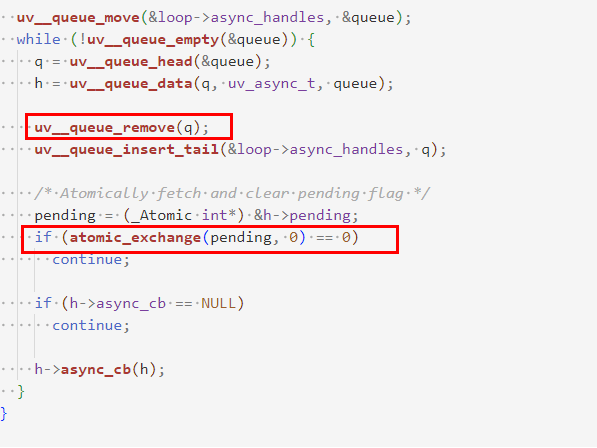


这段代码的逻辑是依次遍历loop上的队列，判断内部的pending是否已更改。如果已更改，则往下执行传入的回调函数。

Freeze发生在这个循环里，一直处于死循环。造成这种现象的原因主要有两种。

- 队列无限长。
- 摘下来的结点又挂在了队列上。


针对第一种情况，可能性较低。经过加日志验证，确实不是该原因导致的。对于第二种情况，通过GDB调试，模拟出卡死时链表的操作过程：


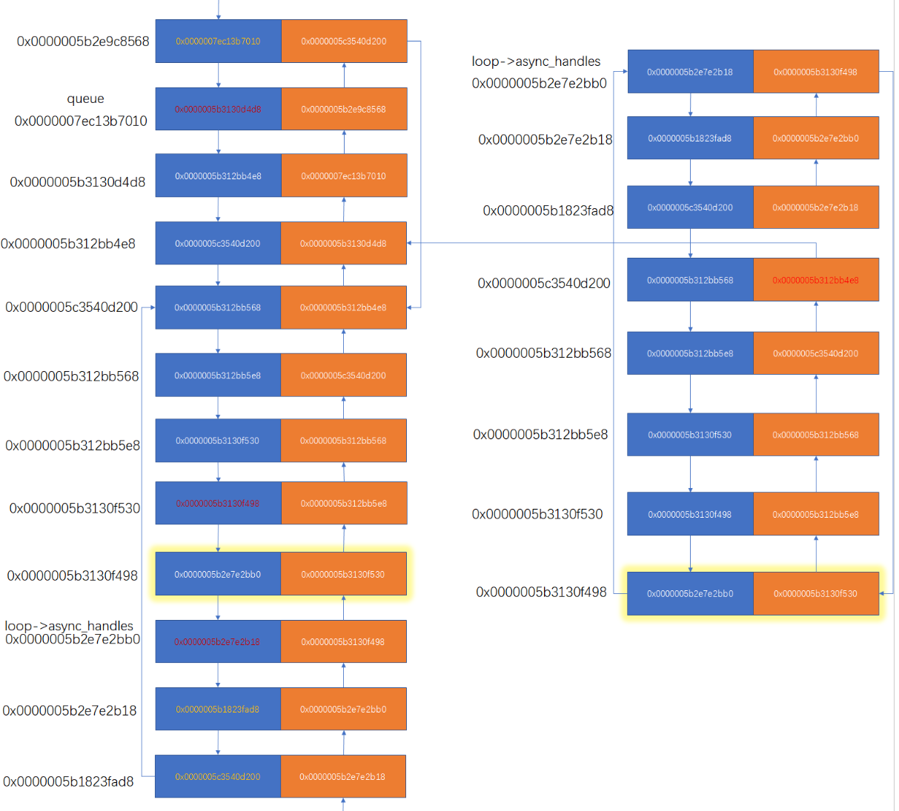


该图显示，在卡死发生时，遍历loop上的async_handles队列会将之前取出的节点重新挂载到当前队列上，导致死循环。这种现象可能是由于同一个句柄在两个事件循环中初始化，导致两个链表互相交织。为了验证这一推断，我们再次加日志复现，日志如下：


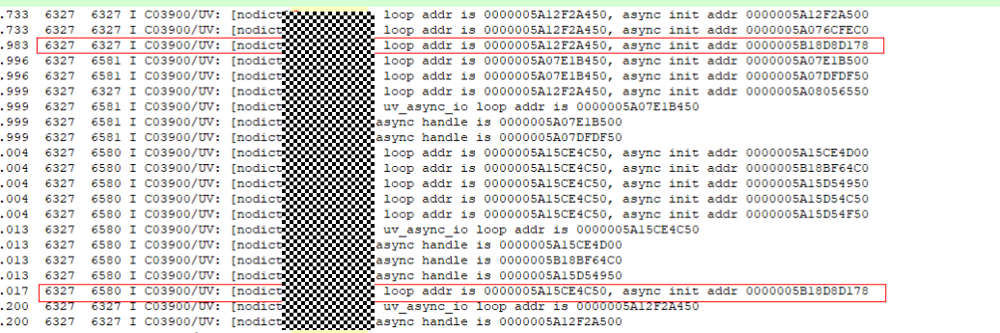


该日志证明了同一个句柄在主线程的loop和taskpool的TaskWorker线程上进行了初始化。

接下来查看该SDK下的so代码，代码如下：


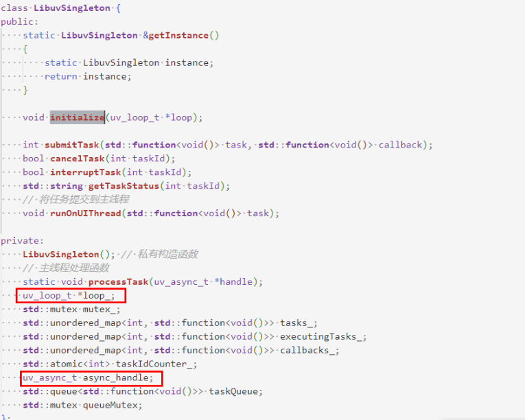


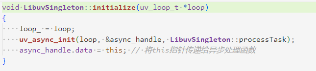


该代码保存了一个普通的uv_async_t对象在静态对象中，但未进行call_once处理，导致每次导入组件时都会初始化，从而造成同一个句柄在不同的事件循环中被多次初始化。

问题结论：开发者应使用call_once处理单例，避免同一个句柄在不同事件循环中初始化，这会导致事件循环死循环。如果在主线程上，可能会出现系统冻结。此外，一个句柄在一个事件循环中初始化两次会导致之前初始化的节点丢失，进而引发功能失效。如果开发者遇到创建了多个napi_threadsafe_function或uv_async_t，且触发这些句柄时回调未执行，可以考虑上述问题。


## double close问题导致的libuv的crash


double close详解

问题描述：libuv作为异步I/O的事件调度框架，核心逻辑使用文件描述符（fd）驱动。其内部代码在调用fd相关的系统调用后，如果检测到errno不符合预期，会终止程序。在HarmonyOS上，事件循环延续了这一做法，但在终止之前会获取更多信息。以下是fd异常时的崩溃栈：

```text
Process life time:569s
Reason:Signal:SIGABRT(SI_TKILL)@0x01317b430000996b from:39275:20020035
LastFatalMessage:errno is 9, loop addr is 385399404800, fd is 315 (../../../third_party/libuv/src/unix/async.c:uv_async_send:170)
Fault thread info:
Tid:39304, Name:OS TaskManager
#00 pc 0000000000197420./system/lib/ld-musl-aarch64.so.1 (raise+228)(b168£10a179c£6050a309242262e6a17)
#01 pc 0000000000145760 /system/lib/ld-musl-aarch64.so.1(abort+20)(b168f10a179cf6050a309242262e6a17)
#02 pc 0000000000017814 /system/lib64/platformsdk/libuv.so(uv_async_send+360)(23ffblfca6d55d23fe917788b2334b12)
#03 pc 000000000001bb3c /system/lib64/module/libtaskpool.z.so(Commonlibrary::Concurrent:: TaskPoolModule::TaskManager:: TryExpand ()+60)
#04 pc 0000000000017be0 /system/lib64/platformsdk/libuv.so(uvasync_io+352)(23ffb1fca6d55d23fe917788b2334b12)
#05 pc 0000000000017258 /system/lib64/platformsdk/libuv.so(uvio poll+956)(23ffblfca6d55d23fe917788b2334b12)
#06 pc 00000000000180e4 /system/lib64/platformsdk/libuv.so(uv _run+376)(23ffblfca6d55d23fe917788b2334b12)
#07 pc 000000000001cc88./system/lib64/module/libtaskpool.z.so(Commonlibrary::Concurrent::TaskPoolModule:: TaskManager:: RunTaskManager ()+172)
#08 pc 000000000001e058 /system/lib64/module/libtaskpool.z.so(e18ade536547e34d8ef7a614e073£74a)
#09 pc 00000000001b87ac /system/lib/ld-musl-aarch64.so.1(start+236)(b168£10a179c£6050a309242262e6a17)
```

当前上面的崩溃栈只是libuv异常终止的其中一处，其余的栈与上述崩溃栈类似，都有LastFatalMessage信息，且第0、1帧都是musl库raise和abort，第2帧为libuv的代码。其中LastFatalMessage字段的含义是指，操作的是哪个fd，返回的errno是多少，这个fd属于哪个事件循环（一个ArkTS线程对应一个事件循环，开发者自己创建的uv_loop_t也是一个事件循环）。

问题分析：

针对上述崩溃栈，errno为9，表示该问题为double close问题。如果errno为22，也是double close问题。double close的模型为：

三个模块A，B，C，接下来按照顺序执行。

1. A申请一个fd，假设fd为100，并将其共享给B。
2. B使用完，将数值为100的fd关闭。
3. C此时去申请fd，假设内核此时分配的fd也为100（极有可能），C拿着进行操作。
4. A此时还不知道为100的fd已经被B关闭了，现在到了A关闭fd操作的时候了，因此A调用了一次close操作。
5. C使用该fd的时候崩溃。


经过大量的试验，double close可能造成的影响主要有三种：

1. 如果A创建的fd被B关闭后，此时该fd未被分配给其他模块，在使用时会报errno = 9的错误。
2. 如果A创建的fd被B关闭后，该fd已经被分配给其他模块，但与之前的类型不一致（比如旧的fd是eventfd类型，新创建的fd是一个文件类型），会报错errno=22。
3. 如果A创建的文件描述符（fd）被B关闭后，该fd被分配给其他模块且类型相同，就会发生文件冲突。例如，A线程有一个事件循环，触发回调需要往A的fd写字符。如果B线程创建的事件循环获取了这个fd，所有原本应触发到A线程的回调将无法正常执行，而是会触发到B线程的事件循环中。


排查方法：

1. 如果应用进程内包含native侧代码并涉及文件操作，在对文件描述符 (fd) 进行操作时，必须遵循谁申请谁释放的原则。若有特殊业务需求，例如透传fd，需明确约定：透传方不得对透传的fd执行close操作，确保每个fd仅创建一次并仅关闭一次。
2. 如果没有ArkTS层有使用TS接口，返回了具体的fd数字，需要按照第一条方法操作fd。另外，fd是从0开始的，开发者一定要保证关闭后，将该变量设为-1，而不是0。


案例一、某应用退出账号，重新启动闪退（偶现）

问题描述：应用存在double close导致偶现崩溃。复现步骤为退出账号后点击应用，出现crash。崩溃栈与文章第一幅图中的崩溃栈一致，主要集中在worker线程或与taskpool相关的线程（TaskManager线程、TaskWorker线程）。


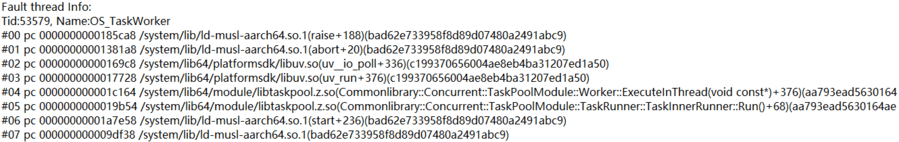


问题分析：

排查应用方代码，代码如下：


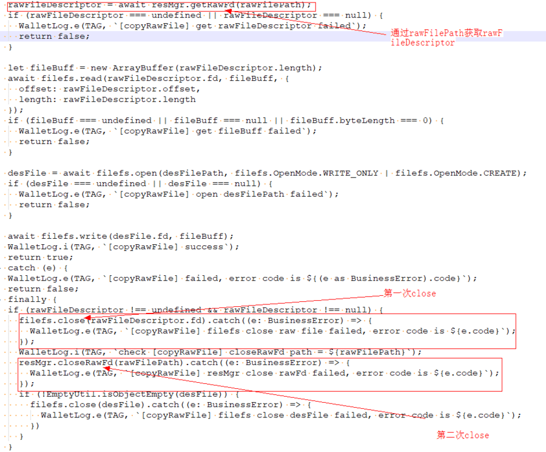


其中rawFileDescriptor是资源管理子系统通过rawFilePath获取的文件描述符的管理对象。

注释部分表示第一次关闭操作是通过文件管理子系统的close接口完成的。第二次关闭操作是通过rawFilePath文件路径，传入资源管理子系统的closeRawFd接口进行的。这两次关闭操作正好对应了插件捕获的两次调用栈。

解决方法：

按照上图中的代码注释，将多余的close操作进行删除即可。


## 示例代码


- [libuv使用规范及案例](https://gitcode.com/harmonyos_samples/BestPracticeSnippets/tree/master/LibuvDevelopment)
