# 易错API的使用规范

更新时间：2026-05-22 09:46:30

来源：https://developer.huawei.com/consumer/cn/doc/best-practices/bpta-stability-coding-standard-api

##### 视效API

 
静态图片，建议使用EffectKit异步模糊；AdaptiveColor使用问题
 
**【问题描述】**
 
内外部多个应用在使用取色模糊时，AdaptiveColor参数选择了AVERAGE方式，导致出现帧率不达标问题。此参数已经标注在非DEFAULT方式下会产生耗时。典型 trace 如下：
 


 
**【使用错误影响】**
 
应用单帧处理时间过长，影响刷新帧率，导致动画卡顿。
 
**【使用建议】**
 
使用 AdaptiveColor.DEFAULT方式取色，或者参考 [EffectKit的ColorPicker](https://developer.huawei.com/consumer/cn/doc/harmonyos-references/js-apis-effectkit#colorpicker) 方式进行异步取色。
 
**【文档链接】**
 
[AdaptiveColor.DEFAULT](https://developer.huawei.com/consumer/cn/doc/harmonyos-references/ts-universal-attributes-foreground-blur-style#adaptivecolor枚举说明)：不使用取色模糊。使用默认的颜色作为蒙版颜色。采用非DEFAULT方式较耗时。
 
[EffectKit的ColorPicker](https://developer.huawei.com/consumer/cn/doc/harmonyos-references/js-apis-effectkit#colorpicker)：取色类，用于从一张图像数据中获取它的主要颜色。
 

##### 媒体平台API

 

##### 播控

 
1、回调泄漏问题
 
**【问题描述】**
 
应用在使用.on('xxx')注册回调后，使用匿名函数传入.off('xxx')注销回调。匿名函数传入的回调会被认为是新的回调函数，使得无法移除之前注册的回调，回调会越来越多。监听注册使用的回调callback需要保证合理释放，避免使用匿名函数无法管控生命周期。
 
**【使用错误影响】**
 
应用程序无响应
 
**【使用建议】**
 
如需删除回调，请先定义回调方法，然后传参
 
**【文档链接】**
 
[媒体会话管理on('playbackStateChange')](https://developer.huawei.com/consumer/cn/doc/harmonyos-references/arkts-apis-avsession-avsessioncontroller#onplaybackstatechange10)
 
[媒体会话管理off('playbackStateChange')](https://developer.huawei.com/consumer/cn/doc/harmonyos-references/arkts-apis-avsession-avsessioncontroller#offplaybackstatechange10)
 
**【典型案例】**
 
```text
sessionController.on('playbackStateChange', 'all', (state) => {
  callback(state, 'locale');
})
...
sessionController.off('playbackStateChange', 'all', (state) => {
  callback(state, 'locale');
})
```
 
**【最佳实践】**
 
```ArkTS
let playStateCallback: (state: avSession.AVPlaybackState) => void = (state: avSession.AVPlaybackState) => {
}
sessionController.on('playbackStateChange', 'all', this.playStateCallback);
sessionController.off('playbackStateChange', this.playStateCallback);
```
 

 
2、打印日志过多问题
 
**【问题描述】**
 
日志打印量超过60MB
 
**【使用建议】**
 
减少频繁调用setAVPlaybackState和SetAVMetadata的场景
 
**【文档链接】**
 
[媒体会话管理setAVPlaybackState](https://developer.huawei.com/consumer/cn/doc/harmonyos-references/arkts-apis-avsession-avsession#setavplaybackstate10)
 
[媒体会话管理setAVMetadata](https://developer.huawei.com/consumer/cn/doc/harmonyos-references/arkts-apis-avsession-avsession#setavmetadata10)
 

 
3、投播时正确播放资源
 
**【问题描述】**
 
使用AVCastController进行资源播放。非同步调用接口时，需要在callback回调中启动播放。
 
**【使用错误影响】**
 
无法播放投屏内容
 
**【使用建议】**
 
使用AVCastController进行资源播放，非同步调用接口，需在callback回调中启动。
 
**【文档链接】**
 
[投播组件开发指导](https://developer.huawei.com/consumer/cn/doc/harmonyos-guides/distributed-playback-guide)
 
**【典型案例】**
 
```text
this.castController?.prepare(playItem, () => {
   ...
});
```
 
**【最佳实践】**
 
```ArkTS
// Preparing to play, this will not trigger actual playback, it will load and buffer
this.castController?.prepare(playItem, () => {
  // Start playback, truly triggering the playback on the other end. Please call start after Prepare is successful.
  this.castController?.start(playItem, () => {
    hilog.info(0x0000, 'testTag', 'Playback started');
  });
});
```
 
4、正确设置播放状态和进度
 
**【问题描述】**
 
播放或暂停应用时，设置播放状态及当前进度。
 
**【使用错误影响】**
 
播放状态显示异常，包括进度回弹和进度显示错误。
 
**【使用建议】**
 
当应用的播放状态、进度或倍速发生变化时，使用setAVPlaybackState接口更新AVPlaybackState。
 
**【文档链接】**
 
[基础播控](https://developer.huawei.com/consumer/cn/doc/harmonyos-guides/basic-playback-control)
 
**【典型案例】**
 
```text
this.session?.on('pause', async () => {
  // 无实现
});
```
 
**【最佳实践】**
 
```ArkTS
this.session?.on('pause', async () => {
  // Execute player pause
  // Set the status and progress during pause
  this.currentState = {
    state: avSession.PlaybackState.PLAYBACK_STATE_PAUSE,
    position: {
      elapsedTime: this.currentTime,
      updateTime: new Date().getTime(),
    }
  };
  await this.session?.setAVPlaybackState(this.currentState);
});
```
 

##### 相机

 
1、回调on('xxx')接口中，禁止添加（调用on）或者移除（调用off）回调操作
 
**【问题描述】**
 
框架侧的回调实现已经进行了加锁操作。如果应用在框架触发回调时移除或添加回调，会导致线程死锁。
 
**【使用错误影响】**
 
应用发生卡死
 
**【使用建议】**
 
如果需要对回调进行其他增减操作，应在其他线程中执行或在其他业务流程中处理。
 
**【文档链接】**
 
[相机管理on('error')](https://developer.huawei.com/consumer/cn/doc/harmonyos-references/arkts-apis-camera-videosession#onerror11)
 
[相机管理on('cameraStatus')](https://developer.huawei.com/consumer/cn/doc/harmonyos-references/arkts-apis-camera-cameramanager#oncamerastatus)
 
文档中所有的on接口不仅限于上述两个示例。
 
**【典型案例】**
 
当cameraStatus回调触发后，代码在off处发生卡死。
 
```text
function callback() {
  cameraManager.off('cameraStatus');
}
cameraManager.on('cameraStatus', callback);
```
 

 
2、CameraSession中，addInput接口的入参必须是一个已经调用了open的CameraInput。
 
**【问题描述】**
 
打开CameraInput 后，会获取对应设备的信息。如果未成功获取这些信息，将CameraInput添加到Session时会抛出异常。
 
**【使用错误影响】**
 
应用在调用接口时发生错误
 
**【使用建议】**
 
CameraInput打开成功后，添加到CameraSession中。
 
**【文档链接】**
 
[相机管理CameraInput](https://developer.huawei.com/consumer/cn/doc/harmonyos-references/arkts-apis-camera-cameramanager#createcamerainput)
 
[相机管理Session](https://developer.huawei.com/consumer/cn/doc/harmonyos-references/arkts-apis-camera-session)
 
**【典型案例】**
 
在执行到addInput时发生异常。
 
```text
cameraInput = cameraManager.createCameraInput(camera);
session.beginConfig();
session.addInput(cameraInput); // 接口抛出异常
```
 
**【最佳实践】**
 
```ArkTS
cameraInput = cameraManager.createCameraInput(camera);
await cameraInput.open();
session.beginConfig();
session.addInput(cameraInput);
```
 

 
3、CameraSession中，addOutput前需要先addInput。
 
**【问题描述】**
 
如果Session中没有Input信息，addOutput会抛出异常。
 
**【使用错误影响】**
 
应用在调用接口时发生错误
 
**【使用建议】**
 
Session添加Input后，再添加Output。
 
**【文档链接】**
 
[相机管理CameraInput](https://developer.huawei.com/consumer/cn/doc/harmonyos-references/arkts-apis-camera-cameramanager#createcamerainput)
 
Output包括 PreviewOutput、PhotoOutput、VideoOutput、MetadataOutput。
 
[相机管理CameraOutput](https://developer.huawei.com/consumer/cn/doc/harmonyos-references/arkts-apis-camera-cameramanager#createpreviewoutput)
 
[相机管理Session](https://developer.huawei.com/consumer/cn/doc/harmonyos-references/arkts-apis-camera-session)
 
**【典型案例】**
 
在执行到addOutput时，代码发生异常并抛出。
 
```text
previewOutput = cameraManager.createPreviewOutput(profile, surfaceId);
cameraInput = cameraManager.createCameraInput(camera);
await cameraInput.open();
session.beginConfig();
session.addOutput(previewOutput);
session.addInput(cameraInput);
```
 
**【最佳实践】**
 
```ArkTS
previewOutput = cameraManager.createPreviewOutput(profile, surfaceId);
cameraInput = cameraManager.createCameraInput(camera);
await cameraInput.open();
session.beginConfig();
session.addInput(cameraInput);
session.addOutput(previewOutput);
```
 

 
4、Session增减Input和Output的接口调用流程必须在beginConfig和commitConfig接口调用之间。
 
**【问题描述】**
 
如果Session中未调用beginConfig，调用addInput和addOutput将导致异常抛出。若Session未调用commitConfig，则无法调用后续的start接口。
 
**【使用错误影响】**
 
应用调用接口时出现错误
 
**【使用建议】**
 
Session调用beginConfig接口之后再添加Input和Output，最后记得调用commitConfig。
 
**【文档链接】**
 
[相机管理CameraInput](https://developer.huawei.com/consumer/cn/doc/harmonyos-references/arkts-apis-camera-cameramanager#createcamerainput)
 
Output包括 PreviewOutput、PhotoOutput、VideoOutput 和 MetadataOutput。
 
[相机管理CameraOutput](https://developer.huawei.com/consumer/cn/doc/harmonyos-references/arkts-apis-camera-cameramanager#createpreviewoutput)
 
[相机管理Session](https://developer.huawei.com/consumer/cn/doc/harmonyos-references/arkts-apis-camera-session)
 
[相机管理beginConfig](https://developer.huawei.com/consumer/cn/doc/harmonyos-references/arkts-apis-camera-session#beginconfig11)
 
[相机管理commitConfig](https://developer.huawei.com/consumer/cn/doc/harmonyos-references/arkts-apis-camera-session#commitconfig11)
 
**【典型案例】**
 
在执行到addInput时发生异常并抛出。
 
```text
previewOutput = cameraManager.createPreviewOutput(profile, surfaceId);
cameraInput = cameraManager.createCameraInput(camera);
await cameraInput.open();
session.addInput(cameraInput); 
session.beginConfig();
session.addOutput(previewOutput);
```
 
**【最佳实践】**
 
```ArkTS
previewOutput = cameraManager.createPreviewOutput(profile, surfaceId);
cameraInput = cameraManager.createCameraInput(camera);
await cameraInput.open();
session.beginConfig();
session.addInput(cameraInput);
session.addOutput(previewOutput);
session.commitConfig();
```
 

 
5、Session的release，Input的close等返回Promise的操作如果在异步函数内调用，请确保调用了await保证时序正常。
 
**【问题描述】**
 
将异步函数当作同步函数调用会导致时序问题。
 
**【使用错误影响】**
 
应用出现异常。
 
**【使用建议】**
 
在异步函数中调用返回Promise的异步函数时，使用await确保调用顺序正确。
 
**【文档链接】**
 
[相机管理release](https://developer.huawei.com/consumer/cn/doc/harmonyos-references/arkts-apis-camera-session#release11)
 
[相机管理close](https://developer.huawei.com/consumer/cn/doc/harmonyos-references/arkts-apis-camera-camerainput#close)
 
**【典型案例】**
 
```text
async function onBackground() {
  cameraInput.close();
  cameraSession.release();
}
```
 
**【最佳实践】**
 
```ArkTS
async function onBackground(): Promise<void> {
  await cameraInput.close();
  await cameraSession.release();
}
```
 

##### 音频

 
1、多次调用裸指针的Release会触发UAF（use after free）。
 
**【问题描述】**
 
应用在使用OHAudioRenderer或OHAudioCapturer等OHAudio相关接口时，需要传递相关对象的裸指针给音频。调用对象的release方法后，框架会删除对象。此时，如果应用再次传递裸指针调用方法，音频接收到的指针只能进行判空，无法判断指针的有效性，导致UAF问题。
 
**【使用错误影响】**
 
出现地址越界导致的崩溃问题，造成客户端进程异常退出。
 
**【使用建议】**
 
在使用OHAudio时，调用Release方法后，不要再传递已失效的指针。
 
**【文档链接】**
 
[使用OHAudio开发音频录制功能(C/C++)](https://developer.huawei.com/consumer/cn/doc/harmonyos-guides/using-ohaudio-for-recording)
 
[使用OHAudio开发音频播放功能(C/C++)](https://developer.huawei.com/consumer/cn/doc/harmonyos-guides/using-ohaudio-for-playback)
 

 
2、使用OHAudio的应用仅注册部分回调，可能导致野指针崩溃。
 
**【问题描述】**
 
根据C语言的特性，结构体中的指针必须初始化后才能使用，可以使用正常值或nullptr进行初始化。音频提供了OH_AudioRenderer_Callbacks_Struct和OH_AudioCapturer_Callbacks_Struct等结构体，其中包含指针类型的方法。当应用注册这些结构体时，必须初始化所有元素，否则音频在发送回调时可能会因无法判断指针是否合法而出现异常。
 
**【使用错误影响】**
 
在框架回调应用时，如果需要回调的方法是用户未赋值的方法，可能会导致客户端进程异常退出。
 
**【使用建议】**
 
设置音频回调函数时，确保OH_AudioRenderer_Callbacks和OH_AudioCapturer_Callbacks的每个回调被初始化。
 
**【文档链接】**
 
[使用OHAudio开发音频录制功能(C/C++)](https://developer.huawei.com/consumer/cn/doc/harmonyos-guides/using-ohaudio-for-recording)
 
[使用OHAudio开发音频播放功能(C/C++)](https://developer.huawei.com/consumer/cn/doc/harmonyos-guides/using-ohaudio-for-playback)
 

 
3、OnWriteData回调排查
 
**【问题描述】**
 
开发者使用OHAudio的接口时，使用了OH_AudioStreamBuilder_SetRendererCallback设置了OH_AudioRenderer_OnWriteData作为写数据的回调函数。然而，由于网络或解码性能问题，应用在系统请求音频数据时，无法提供完整的数据块，而只能写入部分数据。例如，当系统请求10ms的数据时，应用只提供了6ms的数据。系统在拿到这段数据后，仍然按照10ms的数据播放，导致未写入的4ms数据不可控，表现为播放卡顿和杂音。
 
**【使用错误影响】**
 
播放过程中出现卡顿和杂音。
 
**【使用建议】**
 
- 应用确认调用的接口类型及设置的回调函数。
- 当前系统有两种设置回调的接口，分别设置两种回调函数：1. 通过 OH_AudioStreamBuilder_SetRendererCallback 设置 OH_AudioRenderer_OnWriteData （不支持返回值）

2. 通过 OH_AudioStreamBuilder_SetRendererWriteDataCallback 设置 OH_AudioRenderer_OnWriteDataCallback（支持返回值）
- 应用需明确每次回调时，Buffer是否已写满。
- 可通过比较应用自身写入的数据长度是否与回调函数的参数length或者是audioDataSize相等

 
**【注意事项】**
 
- 应用需保证连续发送音频数据，避免数据断续导致听感卡顿。
- 应用需明确自身写入的数据长度能否填满系统回调的Buffer。如果无法填满，对于无返回值的回调函数，推荐应用暂时停止写入数据（不暂停音频流），阻塞回调函数（AudioRender其他操作前要解阻塞）或将Buffer置空，等待数据充足时再继续写入数据。需注意，如果Buffer置空，也会被统计到已写入的数据。如果使用支持返回值的回调函数，可返回INVALID，系统会暂不处理该段音频数据，再次向应用请求数据，等返回VALID后，系统继续播放。
- 应用避免在回调函数外访问回调Buffer，确保其数据不被异步修改。
- 应用需注意，不支持返回值的回调函数与支持返回值的回调函数的注册是相互覆盖的。如果需要使用支持返回值的回调函数，可将OH_AudioStreamBuilder_SetRendererWriteDataCallback接口的调用放在OH_AudioStreamBuilder_SetRendererCallback接口后面。
- 推荐使用OH_AudioStreamBuilder_SetRendererWriteDataCallback设置支持返回值的回调函数，处理异常帧或数据不足。

 
**【文档链接】**
 
[使用OHAudio开发音频播放功能(C/C++)](https://developer.huawei.com/consumer/cn/doc/harmonyos-guides/using-ohaudio-for-playback)
 

 
4、防止Offload流卡顿的自排查步骤
 
**【问题描述】**
 
**offload功能说明**
 
- 应用在播放流类型为MUSIC或AUDIOBOOK时，熄屏后会进入低功耗模式，调度间隔为7秒。
- 休眠结束唤醒后，应用需在200毫秒内提供至少1帧数据。
- offload通路会请求应用数据，应用需保证数据充足。
- 应用数据写入后不立即播放，播放进度需通过框架接口获取。

 
**【使用建议】**
 
**典型案例（应用自查）**
 
Q1. 【息屏异常停流】当CPU休眠时，APP检测到解码阻塞或长时间未收到系统请求，会执行停流操作。
 
A1. 使用offload通路的应用需申请长时任务；应用应感知休眠状态，保持正常运行。
 
Q2. 【息屏异常停流】APP在CPU唤醒后的一段时间内，未能及时提供至少一帧数据。
 
A2. APP需进行解码等操作的性能优化，确保CPU唤醒时及时提供数据。
 
Q3. 【息屏卡顿杂音】APP在数据不足一帧时写入，导致出现卡顿和杂音。
 
A3：根据情况排查。
 
- 若使用OH_AudioStreamBuilder_SetRendererCallback回调：
需要应用阻塞直到数据准备充足，确保buffer写满

 - 若使用OH_AudioStreamBuilder_SetRendererWriteDataCallback，可以选择两种方案：
数据不足时，返回AUDIO_DATA_CALLBACK_RESULT_INVALID，框架会在短时间内再次请求数据
- 若需要写数据，确保buffer写满

 
 
Q4. 【未播完切歌】APP在一段数据写完后，切歌进入下一首，此时数据尚未播放完毕。
 
A4. 通过框架接口OH_AudioRenderer_GetTimeStamp()获取框架侧播放的数据数量，以判断播放进度。控制调用频率，建议每200毫秒调用一次，避免影响系统性能。注意，调用OH_AudioRenderer_Flush()后，播放的数据数量会重置为0。
 
PS: 针对案例3和4，应用可以添加维测：统计实际写入的数据数量p1，通过框架接口OH_AudioRenderer_GetTimeStamp()获取框架侧播放的数据数量p2。符合预期的场景：
 
- 在p1 - p2 约为休眠水线(目前约7s)时，进入休眠；
- 在p1 - p2 约为唤醒水线(目前约400ms)时，唤醒。

 
不符合预期的场景：
 
- p1 - p2 为负值
- p1 - p2 没达到休眠水线时，进入休眠；

 

##### 视频

 
AVImageGenerator或AVMetadataExtractor功能失效问题。
 
**【问题描述】**
 
设置同一个FD给AVImageGenerator和AVMetadataExtractor实例，导致AVImageGenerator或者AVMetadataExtractor功能失效。
 
**【使用错误影响】**
 
功能失效，导致数据读取异常
 
**【使用建议】**
 
即使是沙箱路径下的同一个文件，也建议打开两次，获取不同的文件描述符（Fd）分别传递给AVImageGenerator和AVMetadataExtractor对象。否则，这两个对象对同一个文件描述符进行操作，会导致读取数据异常，从而功能失效。
 
**【文档链接】**
 
[AVImageGenerator](https://developer.huawei.com/consumer/cn/doc/harmonyos-references/arkts-apis-media-avimagegenerator)
 
> [!NOTE]
> 将资源句柄（fd）传递给 AVImageGenerator 实例后，请勿使用该句柄进行其他读写操作，包括传递给多个 AVPlayer、AVMetadataExtractor、AVImageGenerator 或 AVTranscoder。同一时间通过该句柄读写文件会导致视频缩略图数据异常。

 
**【最佳实践】**
 
```ArkTS
async fetchFrame(): Promise<void> {
  await this.fetchMeta();
  if (canIUse("SystemCapability.Multimedia.Media.AVImageGenerator")) {
    this.pixelMap = new Array;
    let avImageGenerator: media.AVImageGenerator = await media.createAVImageGenerator();
    // raw fd
    avImageGenerator.fdSrc = fs.openSync(this.rootPath + this.testFilename);
    for (let i = 0; i < 6; i++) {
      let pixelMap: image.PixelMap = await avImageGenerator.fetchFrameByTime(this.diffTime[i], this.seekOption,
        { width: this.pixelMapWidth, height: this.pixelMapHeight });
      this.pixelMap.push(pixelMap);
      if (i == 0) {
        this.pixelLcd = pixelMap;
        let rate: number = pixelMap.getImageInfoSync().size.height / pixelMap.getImageInfoSync().size.width;
        this.lcdHeight =
          display.getDefaultDisplaySync().width / 2 / display.getDefaultDisplaySync().densityPixels * rate;
      }
      let imageInfo: image.ImageInfo = pixelMap.getImageInfoSync();
      hilog.info(0x0000, 'testTag',
        `colorFormat ${imageInfo.pixelFormat} width ${imageInfo.size.width} height ${imageInfo.size.height} isHdr ${imageInfo.isHdr}`);
    }
  }
}

async fetchMeta(): Promise<void> {
  if (canIUse("SystemCapability.Multimedia.Media.AVMetadataExtractor")) {
    let avMetadataExtractor: media.AVMetadataExtractor = await media.createAVMetadataExtractor();
    let fd: number = fs.openSync(this.rootPath + this.testFilename).fd;
    let fileSize: number = fs.statSync(this.rootPath + this.testFilename).size;
    let dataSrc: media.AVDataSrcDescriptor = {
      fileSize: fileSize,
      callback: (buffer, len, pos) => {
        if (buffer == undefined || len == undefined || pos == undefined) {
          return -1;
        }
        let options: ReadOptions = {
          offset: pos,
          length: len
        }
        let num: number = fs.readSync(fd, buffer, options);
        if (num > 0 && fileSize >= pos) {
          return num;
        }
        return -1;
      }
    }

    avMetadataExtractor.dataSrc = dataSrc;
    let metadata: media.AVMetadata;
    try {
      metadata = await avMetadataExtractor.fetchMetadata();
    } catch (error) {
      hilog.error(0x0000, 'testTag', 'error code ' + error.code);
      return;
    }
    if (metadata.duration) {
      let duration: number = parseInt(metadata.duration) * 1000;
      let pick: number = duration / 5;
      this.diffTime[0] = 0;
      this.diffTime[5] = duration;
      let time: number = pick;
      for (let i = 1; i < 5; i++) {
        this.diffTime[i] = time;
        time += pick;
      }
    }
    if (metadata.videoHeight && metadata.videoWidth) {
      let rate: number = Number(metadata.videoHeight) / Number(metadata.videoWidth);
      if (metadata.videoOrientation && Number(metadata.videoOrientation) % 180) {
        rate = 1 / rate;
      }
      this.videoHeight =
        display.getDefaultDisplaySync().width / 6 / display.getDefaultDisplaySync().densityPixels * rate;
    }
    await avMetadataExtractor.release();
  }
}
```
 

##### ArkUI相关API

 
1. Inspector接口在业务代码里使用
 
**【问题描述】**
 
在使用Inspector相关接口查询组件信息时，如果出现错误行为，可能会导致应用闪退。该接口设计初衷是用于调试，性能较低，不建议在业务代码中调用，以避免引起应用卡顿或闪退。
 
**【使用错误影响】**
 
应用闪退。
 
**【使用建议】**
 
避免使用Inspector进行信息查询。
 
**【文档链接】**
 
[getFilteredInspectorTre()](https://developer.huawei.com/consumer/cn/doc/harmonyos-references/arkts-apis-uicontext-uicontext#getfilteredinspectortree12)
 
[getFilteredInspectorTreeById()](https://developer.huawei.com/consumer/cn/doc/harmonyos-references/arkts-apis-uicontext-uicontext#getfilteredinspectortreebyid12)
 
[组件标识](https://developer.huawei.com/consumer/cn/doc/harmonyos-references/ts-universal-attributes-component-id)
 
[getInspectorInfo()](https://developer.huawei.com/consumer/cn/doc/harmonyos-references/js-apis-arkui-framenode#getinspectorinfo12)
 

 
2、OH_NativeXComponent_RegisterCallback接口传参
 
**【问题描述】**
 
应用在使用OH_NativeXComponent_RegisterCallback接口传的回调函数必须保证在OnSurfaceDestroyed回调之前是有效的，该回调是XComponent生命周期结束后给应用的通知，一定会调用。如果提前释放该回调会导致uaf问题。
 
**【使用错误影响】**
 
应用程序意外终止运行。
 
**【使用建议】**
 
- 在Native侧的OnSurfaceXXX回调中，nativewindow指针的生命周期在OnSurfaceDestroyed回调之后结束。因此，应用需要确保在此之后不再使用该指针，特别是在多线程场景中，以避免访问野指针的问题。
- 在OnSurfaceDestroyed回调触发前，不要释放该回调所在对象，否则会导致系统在调用该回调时出错。

 
**【文档链接】**
 
[OH_NativeXComponent_RegisterCallback](https://developer.huawei.com/consumer/cn/doc/harmonyos-references/capi-native-interface-xcomponent-h#oh_nativexcomponent_registercallback)
 

 
3、@ohos.measure和@ohos.font不推荐在UIAbility的生命周期中调用
 
**【问题描述】**
 
在UIAbility的生命周期中调用@ohos.measure和@ohos.font接口无法达到预期效果。下面的代码示例是在EntryAbility.ets的onCreate回调函数中使用这些接口。
 
```text
onCreate(want: Want, launchParam: AbilityConstant.LaunchParam): void {
  const width = MeasureText.measureText({ // 建议使用 this.getUIContext().getMeasureUtils().measureText()接口
    textContent: "Hello World",
    fontSize: '50px'
  })
  hilog.info(0x0001, "testTag", "Hello World, width: %{public}d", width);
  font.registerFont({ // 建议使用 this.getUIContext().getFont().registerFont()接口
    familyName: 'contentFont',
    familySrc: $rawfile('hwxw.ttf')
  })
}
```
 
**【使用错误影响】**
 
运行上述代码，编译会通过，但在运行时，width无法打印出有效结果，且注册的font也不生效。
 
**【使用建议】**
 
1、本模块功能依赖UI的执行上下文，不可在UI上下文不明确的地方使用。建议使用this.getUIContext().getMeasureUtils().measureText()和this.getUIContext().getFont().registerFont()调用。
 
**【文档链接】**
 
[@ohos.font (注册自定义字体)](https://developer.huawei.com/consumer/cn/doc/harmonyos-references/js-apis-font)
 
[@ohos.measure (文本计算)](https://developer.huawei.com/consumer/cn/doc/harmonyos-references/js-apis-measure)
 

 
4、在CustomdialogController方法中禁止动态赋值。
 
**【问题描述】**
 
在方法中动态声明并赋值。
 
**【使用错误影响】**
 
如果重复执行该方法，已打开的弹窗将无法关闭，且不会显示异常日志。
 
**【使用建议】**
 
在@component下定义并初始化
 
**【文档链接】**
 
[自定义弹窗 (CustomDialog)](https://developer.huawei.com/consumer/cn/doc/harmonyos-references/ts-methods-custom-dialog-box)
 

 
5、在懒加载、list与web场景下手动控制CheckboxGroup的状况变量
 
**【问题描述】**
 
在懒加载、列表和Web场景下，需要手动控制CheckboxGroup的状态变量。
 
**【使用错误影响】**
 
使用CheckboxGroup依赖系统控制Checkbox时，可能会导致某些Checkbox无法被CheckboxGroup统一管理。为避免这种情况，建议确保所有Checkbox都正确绑定到CheckboxGroup，以实现统一管理。
 
**【使用建议】**
 
在懒加载、列表和Web场景下，需要手动控制CheckboxGroup的状态变量。
 
**【文档链接】**
 
[CheckboxGroup](https://developer.huawei.com/consumer/cn/doc/harmonyos-references/ts-basic-components-checkboxgroup)
 
**【典型案例】**
 
```json
@Entry
@Component
struct CheckBoxPage {
  @State fontColor: string = '#182431'
  @State selectedFontColor: string = '#007DFF'
  @State currentIndex: number = 0
  @State arr: number[] = [1, 2, 3, 4, 5, 6, 7, 8, 9];
  @State arr_more: number[][] = []
  build() {
    Column() {
      List() {
        ForEach(this.arr, (item: number, itemIndex) => {
          ListItem() {
            Row() {
              Checkbox({ name: itemIndex + "_" + itemIndex, group: 'checkboxGroupA' + 1 })
              // Blank()
              Text(item + "__")
                .id('CheckBoxPageHelloWorld')
                .fontSize(50)
                .fontWeight(FontWeight.Bold)
            }.width("100%")
          }.width("100%").height(100)
        })
      }.id("list")
      .height('80%')
      CheckboxGroup({ group: 'checkboxGroupA' + 1 })
        .checkboxShape(CheckBoxShape.ROUNDED_SQUARE)
        .selectedColor('#007DFF')
        .onChange((itemName: CheckboxGroupResult) => {
          console.info("checkbox group content" + JSON.stringify(itemName))
        })
        .height('20%')
    }
  }
}
```
 

 
6、UIExtensionComponent send&sendSync 能力有效周期注意点
 
**【问题描述】**
 
UIExtensionComponent用于承载跨进程UI，提供send和sendSync方法，用于向提供方发送信息。这些方法只有在提供方进程启动并建立连接后才能生效。如果提供方断开连接或出现问题（如通过UIExtensionComponent的onError、onRelease和onTerminated回调检测到），这些方法将失效。
 
**【使用错误影响】**
 
send和sendSync失效
 
**【使用建议】**
 
监听UIExtensionProxy的on('asyncReceiverRegister')和on('syncReceiverRegister')状态，在回调之后使用。
 
监听UIExtensionComponent的onError、onRelease和onTerminated状态。监听之后，组件将无法使用。
 
**【典型案例】**
 
```json
Boolean isExtensionReady = false;
UIExtensionComponent({
    bundleName : "com.example.newdemo",
    abilityName: "UIExtensionProvider",
    parameters: {
        "ability.want.params.uiExtensionType": "dialog"
}})
.onRemoteReady((proxy) => {
    console.info('onRemoteReady, for test')
    this.proxy = proxy
    this.proxy.on("syncReceiverRegister", (proxy1) => {
        console.info("on invoke for test, type is syncReceiverRegister");
        this.isExtensionReady = true;
    });
    //或者如下
    this.proxy.on("asyncReceiverRegister", (proxy1) => {
        console.info("on invoke for test, type is asyncReceiverRegister");
        this.isExtensionReady = true;
    });
})
.onTerminated((info) => {
    console.info('onTerminated: code =' + info.code + ', want = ' + JSON.stringify(info.want));
    this.isExtensionReady = false;
})
.onRelease((info) => {
    this.isExtensionReady = false;
})
.onError((info) => {
    this.isExtensionReady = false;
})

Button("点击向UIExtensionAbility发送数据").onClick(() => {
    if (this.proxy != undefined && this.isExtensionReady) {
        this.proxy.send({data: "你好1"})

        try {
            let re = this.proxy.sendSync({data: "你好2"})
            console.info("for test, re=" + JSON.stringify(re));
        } catch (err) {
            console.error(`sendSync failed for test. errCode=${err.code}, msg=${err.message}`);
        }
    }
})
```
 

 
7、在使用多态配置按钮的按压效果和hover效果之前，需要先关闭按钮自身的按压和hover效果。
 
**【问题描述】**
 
Button组件配置多态样式前需禁用默认按压和悬停效果。
 
**【使用错误影响】**
 
按钮在按压或悬停时会闪烁或样式异常。
 
**【使用建议】**
 
关闭按压和hover效果，设置stateEffect(false)和hoverEffect(false)。
 
**【文档链接】**
 
[多态样式](https://developer.huawei.com/consumer/cn/doc/harmonyos-references/ts-universal-attributes-polymorphic-style)
 
[Button](https://developer.huawei.com/consumer/cn/doc/harmonyos-references/ts-basic-components-button)
 
**【典型案例】**
 
```ArkTS
// xxx.ets
@Entry
@Component
struct StyleExample {
  @Styles
  pressedStyles(): void {
    .backgroundColor("#ED6F21")
  }
  build() {
    Flex({ direction: FlexDirection.Column, alignItems: ItemAlign.Center }) {
      Button("pressed")
        .width(100)
        .height(25)
        .stateStyles({
          pressed: this.pressedStyles,
        })
    }
    .width(350).height(300)
  }
}
```
 
**【最佳实践】**
 
```ArkTS
// xxx.ets
@Entry
@Component
struct StyleExample {
  @Styles
  pressedStyles(): void {
    .backgroundColor("#ED6F21")
  }
  build() {
    Flex({ direction: FlexDirection.Column, alignItems: ItemAlign.Center }) {
      Button("pressed")
        .width(100)
        .height(25)
        .stateEffect(false)
        .stateStyles({
          pressed: this.pressedStyles,
        })
    }
    .width(350).height(300)
  }
}
```
 

 
8、Image组件接口使用不规范
 
**【问题描述】**
 
使用image组件申请pixmap或直接使用OH_pixmap接口时，如果不设置编解码尺寸，单张图片可能占用数百MB甚至超过1GB的内存。多张图片申请后，可能会因系统限制导致应用闪退。
 
**【使用错误影响】**
 
应用会闪退
 
**【使用建议】**
 
使用Image组件时，建议通过autoSize或sourceSize降低编解码分辨率。
 

 
9、GetRectangleById接口可能存在组件不存在场景
 
**【问题描述】**
 
该接口使用了Inspector的内部接口。如果指定的Id对应的组件不存在，此时不会返回异常，入参ComponentInfo将使用全0的默认值。
 
**【使用错误影响】**
 
错误使用位置信息会导致应用异常
 
**【使用建议】**
 
判断入参ComponentInfo是否为全0的默认值
 
**【文档链接】**
 
[getRectangleById](https://developer.huawei.com/consumer/cn/doc/harmonyos-references/arkts-apis-uicontext-componentutils#getrectanglebyid)
 
**【典型案例】**
 
桌面返回时查找位置异常，导致返回动效和桌面显示异常。
 
**【最佳实践】**
 

 
10、getInspectorByKey接口可能存在组件不存在场景，返回的是空字符串而不是空json对象。
 
**【问题描述】**
 
getInspectorByKey接口可能存在组件不存在场景，返回的是空字符串而不是空json对象
 
**【使用错误影响】**
 
应用错误地使用JSON判断空字符串，导致异常。
 
**【使用建议】**
 
应对接口进行空字符串判断。
 
**【文档链接】**
 
[getInspectorByKey](https://developer.huawei.com/consumer/cn/doc/harmonyos-references/ts-universal-attributes-component-id#getinspectorbykey9)
 

 
11、不推荐在aboutToAppear、aboutToDisappear中调用动画。
 
**【问题描述】**
 
- 如果在[aboutToAppear](https://developer.huawei.com/consumer/cn/doc/harmonyos-references/ts-custom-component-lifecycle#abouttoappear)中调用动画，自定义组件内的build还未执行，内部组件还未创建，动画时机过早，动画属性没有初值无法对组件产生动画。
- 执行[aboutToDisappear](https://developer.huawei.com/consumer/cn/doc/harmonyos-references/ts-custom-component-lifecycle#abouttodisappear)时，组件即将销毁，不能在aboutToDisappear里面做动画。

 
**【使用建议】**
 
不要在aboutToAppear和aboutToDisappear生命周期回调中调用以下动画接口：animateTo、animateToImmediately、keyframeAnimateTo。
 
**【文档链接】**
 
[显式动画 (animateTo)](https://developer.huawei.com/consumer/cn/doc/harmonyos-references/ts-explicit-animation)
 
**【典型案例】**
 
```text
@State widthSize: number = 250
  @State heightSize: number = 100
  @State opacitySize: number = 0
  @State myScale: number = 1.0;
  uiContext: UIContext | undefined = undefined;
  aboutToAppear(): void {
    animateToImmediately({
      delay: 0,
      duration: 1000
    }, () => {
      this.opacitySize = 1
    })
    this.getUIContext().animateTo({
      delay: 1000,
      duration: 1000
    }, () => {
      this.widthSize = 150
      this.heightSize = 60
    })
    this.uiContext = this.getUIContext?.();
    this.uiContext.keyframeAnimateTo({ iterations: 3 }, [
      {
        // 第一段关键帧动画时长为800ms，scale属性做从1到1.5的动画
        duration: 800,
        event: () => {
          this.myScale = 1.5;
        }
      },
      {
        // 第二段关键帧动画时长为500ms，scale属性做从1.5到1的动画
        duration: 500,
        event: () => {
          this.myScale = 1;
        }
      }
    ]);
  }
  aboutToDisappear(): void {
    animateToImmediately({
      delay: 0,
      duration: 1000
    }, () => {
      this.opacitySize = 1
    })
    this.getUIContext().animateTo({
      delay: 1000,
      duration: 1000
    }, () => {
      this.widthSize = 150
      this.heightSize = 60
    })
    this.uiContext = this.getUIContext?.();
    this.uiContext.keyframeAnimateTo({ iterations: 3 }, [
      {
        // 第一段关键帧动画时长为800ms，scale属性做从1到1.5的动画
        duration: 800,
        event: () => {
          this.myScale = 1.5;
        }
      },
      {
        // 第二段关键帧动画时长为500ms，scale属性做从1.5到1的动画
        duration: 500,
        event: () => {
          this.myScale = 1;
        }
      }
    ]);
  }
```
 

 
12、使用if/else来做数据保护时，不建议在动画闭包里操作数据，否则会crash。
 
**【问题描述】**
 
在动画过程中修改if/else分支，而该分支用于数据保护。继续使用该分支会导致数据访问异常，最终引发崩溃。
 
**【使用错误影响】**
 
应用会生成jscrash日志
 
**【使用建议】**
 
请参见“最佳实践”示例代码
 
**【文档链接】**
 
[if/else：条件渲染](https://developer.huawei.com/consumer/cn/doc/harmonyos-guides/arkts-rendering-control-ifelse)
 
**【典型案例】**
 
```text
class MyData {
  str: string;
  constructor(str: string) {
    this.str = str;
  }
}
@Entry
@Component
struct Index {
  @State data1: MyData|undefined = new MyData("branch 0");
  @State data2: MyData|undefined = new MyData("branch 1");
  build() {
    Column() {
      if (this.data1) {
        // 如果在动画中增加/删除，会给Text增加默认转场
        // 对于删除时，增加默认透明度转场后，会延长组件的生命周期，Text组件没有真正删除，而是等转场动画做完后才删除
        Text(this.data1.str)
          .id("1")
      } else if (this.data2) {
        // 如果在动画中增加/删除，会给Text增加默认转场
        Text(this.data2.str)
          .id("2")
      }
      Button("play with animation")
        .onClick(() => {
          this.getUIContext().animateTo({}, ()=>{
            // 在animateTo中修改if条件，在动画当中，会给if下的第一层组件默认转场
            if (this.data1) {
              this.data1 = undefined;
              this.data2 = new MyData("branch 1");
            } else {
              this.data1 = new MyData("branch 0");
              this.data2 = undefined;
            }
          })
        })
      Button("play directly")
        .onClick(() => {
          // 直接改if条件，不在动画当中，可以正常切换，也不会加默认转场
          if (this.data1) {
            this.data1 = undefined;
            this.data2 = new MyData("branch 1");
          } else {
            this.data1 = new MyData("branch 0");
            this.data2 = undefined;
          }
        })
    }.width("100%")
    .padding(10)
  }
}
```
 
**【最佳实践】**
 
方式1：给数据继续加判空的保护，即在使用data时再加一层判空，即"Text(this.data1?.str)"。
 
```ArkTS
class MyData {
  str: string;

  constructor(str: string) {
    this.str = str;
  }
}

@Entry
@Component
struct Index {
  @State data1: MyData | undefined = new MyData("branch 0");
  @State data2: MyData | undefined = new MyData("branch 1");

  build() {
    Column() {
      if (this.data1) {
        // If adding/deleting in the animation, it will add default transitions to the Text
        // When deleting, increasing the default transparency transition will extend the lifecycle of the component. The Text component is not actually deleted, but is only deleted after the transition animation is completed
        // Add an additional layer of null protection when using data, and only use the str in data1 if it exists
        Text(this.data1?.str)
          .id("1")
      } else if (this.data2) {
        // If adding/deleting in the animation, it will add default transitions to the Text
        // Add another layer of null protection when using data
        Text(this.data2?.str)
          .id("2")
      }
      Button("play with animation")
        .onClick(() => {
          this.getUIContext().animateTo({}, () => {
            // Modifying the if condition in animateTo will give default transitions to the first layer components under if in the animation
            if (this.data1) {
              this.data1 = undefined;
              this.data2 = new MyData("branch 1");
            } else {
              this.data1 = new MyData("branch 0");
              this.data2 = undefined;
            }
          })
        })
    }.width("100%")
    .padding(10)
  }
}
```
 
方式2：给if/else下要删除的组件添加transition(TransitionEffect.IDENTITY)属性，避免系统添加默认转场。
 
```ArkTS
class MyData {
  str: string;
  constructor(str: string) {
    this.str = str;
  }
}
@Entry
@Component
struct Index {
  @State data1: MyData|undefined = new MyData("branch 0");
  @State data2: MyData|undefined = new MyData("branch 1");
  build() {
    Column() {
      if (this.data1) {
        // Display a specified empty transition effect in the root component of IfElse to avoid default transition animations
        Text(this.data1.str)
          .transition(TransitionEffect.IDENTITY)
          .id("1")
      } else if (this.data2) {
        // Display a specified empty transition effect in the root component of IfElse to avoid default transition animations
        Text(this.data2.str)
          .transition(TransitionEffect.IDENTITY)
          .id("2")
      }
      Button("play with animation")
        .onClick(() => {
          this.getUIContext().animateTo({}, ()=>{
            // Modifying the if condition in animateTo will give default transitions to the first layer components under if in the animation
            // But since the specified transition has already been displayed, no default transition will be added
            if (this.data1) {
              this.data1 = undefined;
              this.data2 = new MyData("branch 1");
            } else {
              this.data1 = new MyData("branch 0");
              this.data2 = undefined;
            }
          })
        })
    }.width("100%")
    .padding(10)
  }
}
```
 

 
13、滚动类组件当Scroller控制器未绑定容器组件或者容器组件被异常释放时，currentOffset的返回值为空。
 
**【问题描述】**
 
当Scroller控制器未绑定容器组件或者容器组件被异常释放时，currentOffset的返回值为空。
 
**【使用错误影响】**
 
currentOffset的返回值为空，导致应用出现异常。
 
**【使用建议】**
 
使用该接口时，应判断this.scroller.currentOffset?.yOffset是否为空。
 
**【文档链接】**
 
[currentOffset](https://developer.huawei.com/consumer/cn/doc/harmonyos-references/ts-container-scroll#currentoffset)
 

 

##### IPC相关API

1、使用IPC&RPC通信时，调用writeString使用不规范
 
**【问题描述】**
 
业务在使用writeString时，某些特殊字符无法通过IPC传输，导致报错“检查参数错误”。
 
**【使用错误影响】**
 
调用IPC接口失败
 
**【使用建议】**
 
- 使用writeString传递字符串时，长度不要超过40960字节。
- 如果超过上限，业务在做分段传递时需要考虑截断字符串时不要截出异常字符。

 
**【文档链接】**
 
[writeString](https://developer.huawei.com/consumer/cn/doc/harmonyos-references/js-apis-rpc#writestring9)
 

 
2、使用IPC&RPC通信时，MessageSequence使用不规范
 
**【问题描述】**
 
在MessageSequence类中写入大量数据时，调用具体的write方法可能会失败，具体错误日志为：No enough capacity to write。
 
**【使用错误影响】**
 
调用IPC接口失败
 
**【使用建议】**
 
1、使用MessageSequence对象传递数据，写的总数据量不超过200KB。
 
2、遇到大数据量传输时，同设备调用可以使用writeRawDataBuffer和writeAshmem，跨设备调用使用writeRawDataBuffer。
 
**【文档链接】**
 
[MessageSequence](https://developer.huawei.com/consumer/cn/doc/harmonyos-references/js-apis-rpc#messagesequence9)
 

 
3、rpc.MessageParcel 或rpc.MessageSequence 使用不规范
 
**【问题描述】**
 
业务TS应用客户端使用rpc.MessageParcel.create()或rpc.MessageSequence.create()创建的data和reply未调用其reclaim接口，导致资源无法释放。
 
**【使用错误影响】**
 
内存泄漏、文件描述符泄露、binder内存不足导致通信失败。
 
**【使用建议】**
 
客户端发消息结束后需调用data 和 reply 的 reclaim接口。
 
**【文档链接】**
 
[MessageSequence](https://developer.huawei.com/consumer/cn/doc/harmonyos-references/js-apis-rpc#messagesequence9)
 
**【最佳实践】**
 
达到parcel的上限200KB后，使用RawData传输超过200KB的数据。
 

 
4、创建Ashmem对象后，写入数据正常，但读取数据失败。
 
**【问题描述】**
 
创建Ashmem对象后，写数据正常读数据失败
 
**【使用错误影响】**
 
无法接收对端传输的数据。
 
调用IPC接口时出现错误。
 
**【使用建议】**
 
1、在使用Ashmem去写数据时，先调用mapReadWriteAshmem方法，创建可读写的共享文件的映射，之后调用writeDataToAshmem方法写对应的数据。
 
2、从Ashmem中去读取数据时，需要先调用mapReadWriteAshmem方法，创建可读写的共享文件的映射，之后调用readDataFromAshmem方法读对应的数据。
 
**【文档链接】**
 
[Ashmem](https://developer.huawei.com/consumer/cn/doc/harmonyos-references/js-apis-rpc#ashmem8)
 
[mapReadWriteAshmem](https://developer.huawei.com/consumer/cn/doc/harmonyos-references/js-apis-rpc#mapreadwriteashmem9)
 
[writeDataToAshmem](https://developer.huawei.com/consumer/cn/doc/harmonyos-references/js-apis-rpc#writedatatoashmem11)
 
[readDataFromAshmem](https://developer.huawei.com/consumer/cn/doc/harmonyos-references/js-apis-rpc#readdatafromashmem11)
 

 
5、使用Ashmem对象传递数据，Ashmem的内存未释放
 
**【问题描述】**
 
业务使用了Ashmem存储数据，读取完成后调用了closeAshmem方法以释放之前分配的共享内存，但似乎没有生效。
 
**【使用错误影响】**
 
内存无法释放，导致内存泄漏、FD泄露、binder内存不足通信失败。
 
**【使用建议】**
 
释放之前开辟的共享内存，第一步先调用unmapAshmem方法，删除前面创建出来的Ashmem对象的地址映射，第二步才是调用closeAshmem方法，关闭这个Ashmem对象。
 
**【文档链接】**
 
[Ashmem](https://developer.huawei.com/consumer/cn/doc/harmonyos-references/js-apis-rpc#ashmem8)
 
[writeDataToAshmem](https://developer.huawei.com/consumer/cn/doc/harmonyos-references/js-apis-rpc#writedatatoashmem11)
 
[readDataFromAshmem](https://developer.huawei.com/consumer/cn/doc/harmonyos-references/js-apis-rpc#readdatafromashmem11)
 
MessageSequence类中的读写方法：
 
[writeAshmem](https://developer.huawei.com/consumer/cn/doc/harmonyos-references/js-apis-rpc#writeashmem9)
 
[readAshmem](https://developer.huawei.com/consumer/cn/doc/harmonyos-references/js-apis-rpc#readashmem9)
 

 
6、调用新接口传递ArrayBuffer数据时，读取数据对应不上
 
**【问题描述】**
 
上层业务使用writeArrayBuffer和readArrayBuffer方法传递ArrayBuffer数据时，读取数据不匹配。
 
**【使用错误影响】**
 
写入的数据和读取的数据有差异
 
**【使用建议】**
 
1、读写的第一个参数一定是ArrayBuffer类型，不能传具体的TypedArray，例如：Int16Array
 
2、读写第二个参数是具体的typedArray类型枚举值，读和写的TypeCode值需要是对应的
 
**【文档链接】**
 
[writeArrayBuffer](https://developer.huawei.com/consumer/cn/doc/harmonyos-references/js-apis-rpc#writearraybuffer12)
 
[readArrayBuffer](https://developer.huawei.com/consumer/cn/doc/harmonyos-references/js-apis-rpc#readarraybuffer12)
 
**【典型案例】**
 
具体创建的typedArray跟写时传递的类型枚举值TypeCode不匹配，报错read data from message sequence failed
 

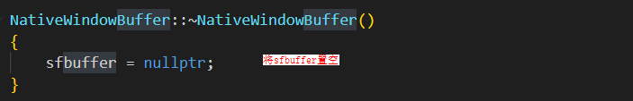

 
字节不匹配，写入失败
 

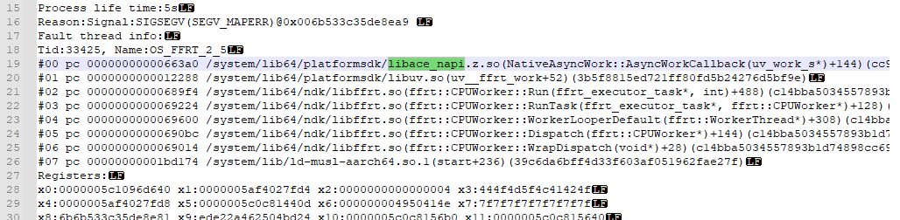

 

 
7、onRemoteRequest函数报错，返回错误码4
 
**【问题描述】**
 
客户端发送信息给服务端，服务端处理时出现错误，错误日志为：OnJsRemoteRequest failed, ret:4, time:xxxxx。
 

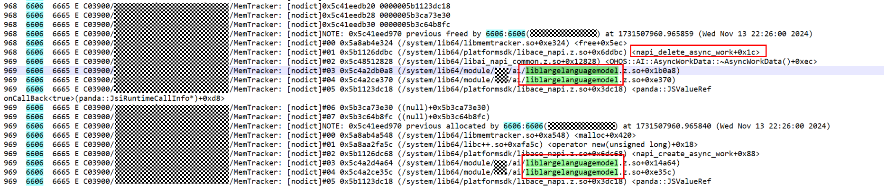

 
**【使用错误影响】**
 
服务端在处理接受的消息后，客户端无法拿到其回传的信息
 
**【使用建议】**
 
1、业务在onRemoteRequest或RemoteMessageRequest函数中，合理返回true或false。
 
2、当上层业务返回false时，IPC内部会认为此次通信是失败的，会直接赋值为4，结束此次通信
 

 
8、使用IPC进行通信时，业务data和reply释放时机不对
 
**【问题描述】**
 
使用IPC进行通信时，业务data和reply释放时机不对，业务在调用readInt方法时调用失败
 
**【使用错误影响】**
 
方法调用失败，无法拿到业务回传的信息
 
**【使用建议】**
 
合理使用reclaim方法，确保在创建data和reply对象时不会出现问题。
 
**【文档链接】**
 
[reclaim](https://developer.huawei.com/consumer/cn/doc/harmonyos-references/js-apis-rpc#reclaim9)
 
**【最佳实践】**
 
sendMessageRequest(code: number, data: MessageSequence, reply: MessageSequence, options: MessageOption): Promise&lt;RequestResult&gt;
 
在使用上述方法时，确保在promise的.finally回调中释放不再需要的对象，并且确保promise的.then或.catch回调中的逻辑先于释放对象的操作。
 

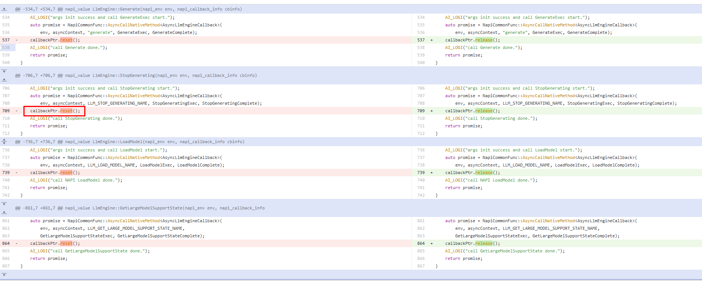

 
sendMessageRequest(code: number, data: MessageSequence, reply: MessageSequence, options: MessageOption, callback: AsyncCallback&lt;RequestResult&gt;): void
 
在使用此方法时，必须在AsyncCallback回调中获取业务数据后才能释放。
 

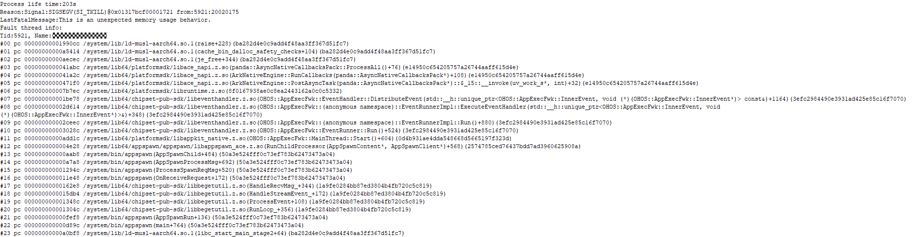

 
 

##### 图形API

 
1、OH_NativeWindow_DestroyNativeWindow()使用问题
 
**【问题描述】**
 
由于对OH_NativeImage_AcquireNativeWindow()和OH_NativeWindow_DestroyNativeWindow()等接口理解不准确，导致重复释放。
 
**【使用错误影响】**
 
处理地址越界问题
 
**【使用建议】**
 
调用OH_NativeImage_Destroy时，无需调用OH_NativeWindow_DestroyNativeWindow进行释放。
 
**【文档链接】**
 
[OH_NativeImage](https://developer.huawei.com/consumer/cn/doc/harmonyos-references/capi-native-image-h)
 

 
2、OH_NativeWindow相关接口野指针crash问题
 
**【问题描述】**
 
通过Native层接口调用时出现的崩溃问题
 

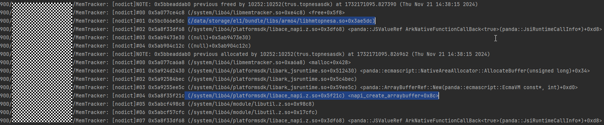

 
**【使用错误影响】**
 
- 当应用在xcomponent析构后，如果已经触发了OnSurfaceDestroyedCB回调接口，nativewindow的引用计数会减少1。当引用计数减少到0时，将触发nativewindow的析构。在nativewindow析构后，如果再通过nativewindow调用接口，将会触发野指针崩溃。
- 应用可能手动调用OH_NativeWindow_DestroyNativeWindow接口对nativewindow进行引用计数减1。如果nativewindow已经析构，再次调用该接口会导致崩溃。

 
**【使用建议】**
 
- 排查xcomponent组件释放后是否还通过nativewindow进行接口调用。
- 排查是否存在并发释放xcomponent组件和并发调用nativewindow接口。
- 排查应用是否调用了OH_NativeWindow_DestroyNativeWindow对nativewindow进行引用计数减1。

 
**【文档链接】**
 
[NativeWindow](https://developer.huawei.com/consumer/cn/doc/harmonyos-references/capi-external-window-h)
 

 
3、OH_NativeWindow相关接口空指针crash问题
 
**【问题描述】**
 
crash的栈顶在libsurface.z.so中。
 

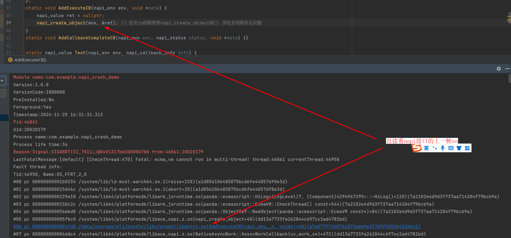

 
**【使用错误影响】**
 
1、在调用GetBufferHandleFromNative接口时访问sfbuffer，此时sfbuffer为空指针，原因是另一个线程并发地将sfbuffer置空，导致系统崩溃。
 
2、另一个线程触发了nativewindow的析构流程。在析构流程中，会将buffer进行unreference操作，随后触发buffer的析构，最后将sfbuffer置空。
 

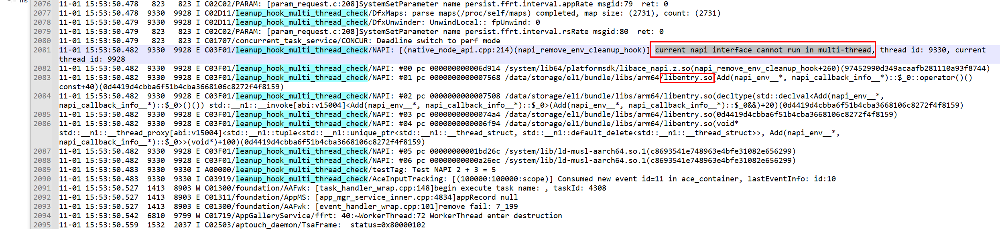

 

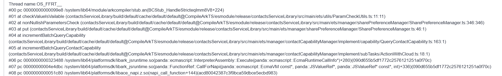

 

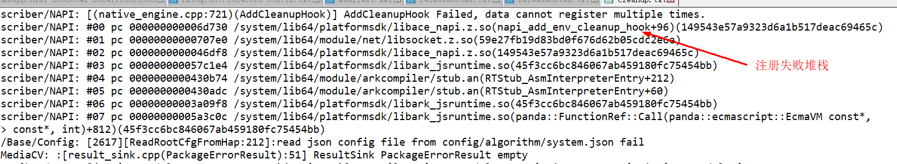

 
**【使用建议】**
 
通过调用栈往下找，找到真正使用nativewindow的so，例如上面的调用栈就找libweb_engine.so
 
**【文档链接】**
 
[NativeWindow](https://developer.huawei.com/consumer/cn/doc/harmonyos-references/capi-external-window-h)
 

##### 方舟运行时API

1、【use after free】napi_async_work使用不规范
 
**【问题描述】**
 
napi_async_work 使用不规范导致了 UAF 问题。涉及的接口主要包括 napi_create_async_work、napi_queue_async_work 和 napi_queue_async_work_with_qos、napi_delete_async_work。
 
**【使用错误影响】**
 
系统栈发生crash，问题溯源较为困难。
 
**【使用建议】**
 
在napi_create_async_work的第五个参数中设置回调函数，将napi_delete_async_work的工作放在该回调函数中执行。这可以确保在异步任务执行期间，上层开发者的内存问题不会导致系统栈报错，从而便于问题定位。
 
**【典型案例】**
 
打开某应用时发生闪退。
 

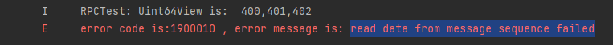

 
此栈主要由native开发者使用napi_async_work变量时，因生命周期管理不当导致UAF问题。难点在于这些栈都是系统栈，无法追踪到具体的调用方。然而，该问题是必然出现的，因此使用memtracker压测后，崩溃栈如下：
 

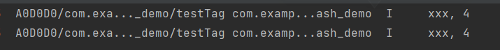

 
根据上面崩溃栈，发现是liblargelanguagemodel.z.so申请和释放的内存，看一下他们的代码
 

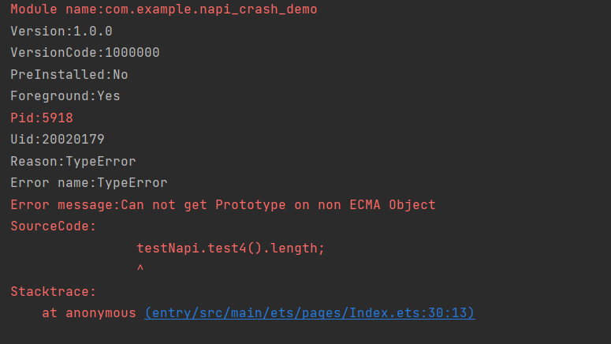

 
开发者使用智能指针管理AsyncWorkData这块内存。在将任务插入到异步任务队列后，智能指针被重置，导致在析构函数中调用napi_delete_async_work。这使得异步任务流程还未完成时，内存已被释放，从而产生了UAF问题：
 
```text
#include "napi/native_api.h"
#include "uv.h"
#define LOG_DOMAIN 0X0202
#define LOG_TAG "MyTag"
#include <hilog/log.h>
#include <thread>
#include <sys/eventfd.h>
#include <unistd.h>
uv_loop_t *loop;
napi_value jsCb;
int fd = -1;

static napi_value Add(napi_env env, napi_callback_info info)
{
    napi_value work_name;
    napi_async_work work;
    napi_create_string_utf8(env, "ohos", NAPI_AUTO_LENGTH, &work_name);
    /* 第四个参数是异步线程的work任务，第五个参数为主线程的回调 */
    napi_create_async_work(env, nullptr, work_name, [](napi_env env, void* data){
        OH_LOG_INFO(LOG_APP, "ohos in execute");
    }, [](napi_env env, napi_status status, void *data){
        /* 不关心具体实现 */
        OH_LOG_INFO(LOG_APP, "ohos in complete");
        napi_delete_async_work(env, (napi_async_work)data);
    }, nullptr, &work);
    /* 通过napi_queue_async_work触发异步任务执行 */
    napi_queue_async_work(env, work);
    return 0;
}

EXTERN_C_START
static napi_value Init(napi_env env, napi_value exports){
    napi_property_descriptor desc[] = {{"add", nullptr, Add, nullptr, nullptr, nullptr, napi_default, nullptr}};
    napi_define_properties(env, exports, sizeof(desc) / sizeof(desc[0]), desc);
    return exports;
}
EXTERN_C_END

static napi_module demoModule = {
    .nm_version = 1,
    .nm_flags = 0,
    .nm_filename = nullptr,
    .nm_register_func = Init,
    .nm_modname = "entry",
    .nm_priv = ((void *)0),
    .reserved = {0},
};

extern "C" __attribute__((constructor)) void RegisterEntryModule(void){
    napi_module_register(&demoModule);
}
```
 
在napi_create_async_work的第五个参数中设置回调函数，将napi_delete_async_work的工作放在该回调函数中执行。这可以确保在异步任务执行期间，上层开发者的内存问题不会反映在系统栈中，从而避免问题难以定位。
 

 
2、【double free】开发者手动释放ArrayBuffer内存导致double free
 
**【问题描述】**
 
开发者通过napi_get_arraybuffer_info接口获取ArrayBuffer的data指针，然后直接手动free这个内存导致应用崩溃。ArrayBuffer的内存由虚拟机GC统一管理，禁止开发者手动释放。
 
napi_create_arraybuffer、napi_create_sendable_arraybuffer、napi_get_arraybuffer_info、napi_create_buffer、napi_get_buffer_info、napi_get_typedarray_info 和 napi_get_dataview_info 等接口的使用方法类似。
 
**【使用错误影响】**
 
应用出现闪退
 
**【使用建议】**
 
禁止手动释放ArrayBuffer内存。
 
**【文档链接】**
 
[防止重复释放获取的buffer](https://developer.huawei.com/consumer/cn/doc/harmonyos-guides/napi-guidelines#防止重复释放获取的buffer)
 
**【典型案例】**
 
安装某应用后，如果搁置一段时间，会被强制退出，崩溃栈如下：
 

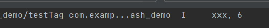

 
【案例分析】
 
安装MemTracker地址越界检测工具后，发现问题是由于开发者手动释放了通过虚拟机创建的ArrayBuffer内存，而虚拟机在垃圾回收时再次尝试释放同一块内存，导致了double free。对于ArrayBuffer内存，应由虚拟机统一管理，无需开发者手动释放。如果开发者尝试手动释放这块内存，可能会引发double free问题。
 

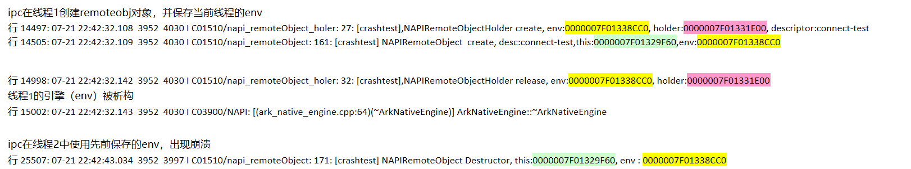

 
**【最佳实践】**
 
开发者不允许主动释放虚拟机管理的ArrayBuffer指针。
 

 
3、【memory leak】开发者使用uv_queue_work方法将任务抛到js线程上面执行的时候，对js线程的回调方法未加handle scope
 
**【问题描述】**
 
开发者使用uv_queue_work方法将任务提交到JS线程执行时，在JS回调中创建了JS对象，但未使用napi_handle_scope管理回调中创建的napi_value的生命周期，导致内存泄漏。
 
**【使用错误影响】**
 
内存泄漏
 
**【使用建议】**
 
当使用uv_queue_work方法将任务提交到JS线程执行时，需要在JS线程的回调方法中使用napi_handle_scope来管理回调方法创建的napi_value的生命周期。
 
**【文档链接】**
 
[异步任务](https://developer.huawei.com/consumer/cn/doc/harmonyos-guides/napi-guidelines#异步任务)
 
**【最佳实践】**
 
```cpp
void callbackTest(CallbackContext* context)
{
    uv_loop_s* loop = nullptr;
    napi_get_uv_event_loop(context->env, &loop);


    uv_work_t* work = new uv_work_t;
    context->retData = 1;
    work->data = (void*)context;


    uv_queue_work(
        loop, work, [](uv_work_t* work) {},
        // using callback function back to JS thread
        [](uv_work_t* work, int status) {
            CallbackContext* context = (CallbackContext*)work->data;
            napi_handle_scope scope = nullptr;
            napi_open_handle_scope(context->env, &scope); // open handle scope，The lifecycle of the JS object created below is managed by this scope
            if (scope == nullptr) {
                return;
            }
            napi_value callback = nullptr;
            napi_get_reference_value(context->env, context->callbackRef, &callback);
            napi_value retArg;
            napi_create_int32(context->env, context->retData, &retArg);
            napi_value ret;
            napi_call_function(context->env, nullptr, callback, 1, &retArg, &ret);
            napi_delete_reference(context->env, context->callbackRef);
            napi_close_handle_scope(context->env, scope); // close handle scope，If the objects under this scope are not referenced by other objects, they will be released after GC
            if (work != nullptr) {
                delete work;
            }
            delete context;
        }
    );
}
```
 

 
4、【multi-thread】开发者使用napi接口时，跨线程使用napi_env或napi_value引发多线程安全问题
 
**【问题描述】**
 
绝大多数napi接口在调用时要求线程安全。即：
 
1. NAPI接口仅能在JS线程上使用。
 
2. 使用napi接口的线程需要与napi_env对应的JS线程保持一致。
 
3. 使用napi接口的线程必须与创建资源类型（如napi_value、napi_ref等）的JS线程一致。
 
如果开发者使用以下任一方式，则存在多线程安全问题：
 
1. 开发者在非JS线程中使用NAPI接口。
 
2. 开发者在JS线程中使用napi接口，但不在napi_env对应的JS线程上。
 
3. 开发者使用napi接口时，不在napi_value或napi_ref创建的JS线程上。
 
以上指的是“绝大多数napi接口”。部分napi接口例外，无以上约束。涉及接口有：1.napi_call_threadsafe_function/napi_call_threadsafe_function_with_priority/napi_acquire_threadsafe_function/napi_release_threadsafe_function/napi_get_threadsafe_function_context/napi_ref_threadsafe_function/napi_unref_threadsafe_function -- napi的线程安全函数。
 
2. napi_get_uv_event_loop -- 获取env上的loop，不涉及上述限制。
 
3. napi_get_node_version。
 
**【使用错误影响】**
 
应用闪退
 
**【使用建议】**
 
请遵循线程安全的要求，并在开发过程中开启多线程检测开关，以便及时发现多线程安全问题。
 
```bash
hdc shell param set persist.ark.properties 0x107c
hdc shell reboot
```
 
**【典型案例】**
 
```text
struct AddonData {
    napi_async_work asyncWork = nullptr;
};
static void AddExecuteCB(napi_env env, void *data) {
    napi_value ret = nullptr;
    napi_create_object(env, &ret); // 在非js线程使用napi_create_object接口，存在多线程安全问题
}
static void AddCallbackCompleteCB(napi_env env, napi_status status, void *data) {

}

static napi_value Test(napi_env env, napi_callback_info info) {
    struct AddonData *addonData = (struct AddonData *)malloc(sizeof(struct AddonData));
    if (addonData == nullptr) {
        return nullptr;
    }
    napi_value resourceName = nullptr;
    napi_create_string_utf8(env, "AsyncWorkTest", NAPI_AUTO_LENGTH, &resourceName);
    napi_create_async_work(env, nullptr, resourceName, AddExecuteCB, AddCallbackCompleteCB,
                                          (void *)addonData, &addonData->asyncWork);
    napi_queue_async_work(env, addonData->asyncWork);

    return nullptr;
}
```
 
**【最佳实践】**
 
打开多线程检测开关后，可拦截到第一现场。
 
可通过命令整机打开多线程检测开关。
 
```bash
hdc shell param set persist.ark.properties 0x107c
hdc shell reboot
```
 
也可在DevEco Studio中勾选多线程检测选项。
 

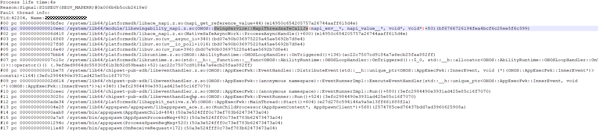

 
5、【multi-thread】跨线程使用napi_add_env_cleanup_hook导致多线程安全问题
 
**【问题描述】**
 
同理接口有napi_remove_env_cleanup_hook。此系列接口并非线程安全，只允许在napi_env所对应的js线程上使用，多线程使用会存在多线程安全问题导致崩溃。
 
**【使用错误影响】**
 
应用闪退
 
**【使用建议】**
 
只允许在napi_env对应的JS线程中调用napi_add_env_cleanup_hook和napi_remove_env_cleanup_hook，禁止跨线程调用。
 
**【典型案例】**
 
```text
Reason:Signal:SIGSEGV(SEGV_MAPERR)@0x006b6b5b440fd5c8 
LastFatalMessage:LabelServiceStub construct
Fault thread info:
Tid:9138, Name:OS_IPC_13_9138
#00 pc 0000000000069ff0 /system/lib64/platformsdk/libace_napi.z.so(std::__h::__hash_table<NativeEngine*, std::__h::hash<NativeEngine*>, std::__h::equal_to<NativeEngine*>, std::__h::allocator<NativeEngine*>>::remove(std::__h::__hash_const_iterator<std::__h::__hash_node<NativeEngine*, void*>*>)+112)(1529322f26fe2bfe6fc21fa2caae6e4d)
#01 pc 000000000006a938 /system/lib64/platformsdk/libace_napi.z.so(1529322f26fe2bfe6fc21fa2caae6e4d)
#02 pc 0000000000068170 /system/lib64/platformsdk/libace_napi.z.so(NativeEngine::RemoveCleanupHook(void (*)(void*), void*)+416)(1529322f26fe2bfe6fc21fa2caae6e4d)
#03 pc 000000000006cbbc /system/lib64/platformsdk/libace_napi.z.so(napi_remove_env_cleanup_hook+76)(1529322f26fe2bfe6fc21fa2caae6e4d)
#04 pc 000000000004460c /system/lib64/platformsdk/libipc_napi.z.so(OHOS::NAPIRemoteObject::OnJsRemoteRequest(OHOS::CallbackParam*)+796)(f9231ae5cbe6abf63dff4fda9df5a97b)
#05 pc 00000000000441a8 /system/lib64/platformsdk/libipc_napi.z.so(OHOS::NAPIRemoteObject::OnRemoteRequest(unsigned int, OHOS::MessageParcel&, OHOS::MessageParcel&, OHOS::MessageOption&)+544)(f9231ae5cbe6abf63dff4fda9df5a97b)
#06 pc 00000000000443e8 /system/lib64/chipset-pub-sdk/libipc_single.z.so(OHOS::IPCObjectStub::SendRequestInner(unsigned int, OHOS::MessageParcel&, OHOS::MessageParcel&, OHOS::MessageOption&)+152)(762ec7ac78c9865d1985559fef9f42ac)
#07 pc 000000000005f508 /system/lib64/chipset-pub-sdk/libipc_single.z.so(OHOS::BinderInvoker::GeneralServiceSendRequest(binder_transaction_data const&, OHOS::MessageParcel&, OHOS::MessageParcel&, OHOS::MessageOption&)+408)(762ec7ac78c9865d1985559fef9f42ac)
#08 pc 000000000005f66c /system/lib64/chipset-pub-sdk/libipc_single.z.so(OHOS::BinderInvoker::TargetStubSendRequest(binder_transaction_data const&, OHOS::MessageParcel&, OHOS::MessageParcel&, OHOS::MessageOption&, unsigned int&)+148)(762ec7ac78c9865d1985559fef9f42ac)
#09 pc 000000000005f92c /system/lib64/chipset-pub-sdk/libipc_single.z.so(OHOS::BinderInvoker::Transaction(binder_transaction_data_secctx&)+644)(762ec7ac78c9865d1985559fef9f42ac)
```
 
**【最佳实践】**
 
开发过程中可打开多线程安全检测开关。若存在napi_add_env_cleanup_hook或napi_remove_env_cleanup_hook的多线程问题，hilog会打印第一现场的调用栈。
 

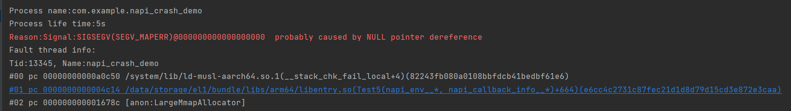

 
6、开发者使用napi_add_env_cleanup_hook时，键值重复导致注册失败
 
**【问题描述】**
 
同理接口有napi_remove_env_cleanup_hook。开发者使用napi_add_env_cleanup_hook向env上注册回调时，该接口第三个入参args是作为map的key值，当开发者重复注册同一个args的回调时，后续注册动作将会失败，仅第一次注册才会成功。注册失败可能会引起后续业务上的功能/崩溃问题。
 
**【使用错误影响】**
 
功能问题/应用闪退。
 
**【使用建议】**
 
避免对同一args值注册不同回调。一次回调内完成所有动作。
 
**【典型案例】**
 
使用env作为参数调用AddCleanHook注册可能会失败。如果注册失败，将无法调用回调来清理map中的reference。这可能导致env的指针后续被复用，从而获取到一个已经被释放的napi_ref。
 
修改方案：使用唯一的key
 

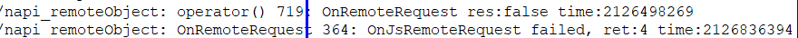

 
**【最佳实践】**
 
打开多线程检测开关后，hilog会打印注册失败的backtrace。
 

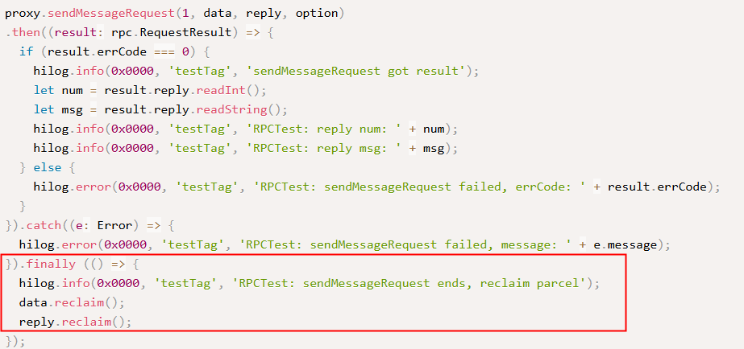

 
7、【use after free】合理运用napi_handle_scope，避免超napi_value生命周期导致崩溃
 
**【问题描述】**
 
napi_value受scope管控，出scope后napi_value将失效，出scope后再使用napi_value会产生未定义行为。
 
**【使用错误影响】**
 
应用闪退/应用行为异常
 
**【使用建议】**
 
可选方案（任选其一）：
 
1. 使用napi_escapable_handle_scope，将napi_value逃逸出当前作用域，交由上层作用域管理。
 
2. 使用napi_ref创建强引用，主动管理JS对象的生命周期。注意，需要主动调用napi_delete_reference以释放强引用。
 
**【典型案例】**
 
**案例一**：napi_value超开发者自己声明的scope范围
 
```text
static napi_value Test2(napi_env env, napi_callback_info info) {
    napi_handle_scope scope = nullptr;
    napi_value value1 = nullptr;
    napi_value value2 = nullptr;
    napi_value value3 = nullptr;
    napi_open_handle_scope(env, &scope);
    napi_create_object(env, &value1);
    napi_close_handle_scope(env, scope);
    napi_create_string_utf8(env, "const char *str", NAPI_AUTO_LENGTH, &value2);
    napi_create_string_utf8(env, "const char *str", NAPI_AUTO_LENGTH, &value3);
    napi_valuetype type = napi_null;
    napi_typeof(env, value1, &type);
    OH_LOG_INFO(LOG_APP, "xxx, %{public}d", type);

    return value1;
}
```
 

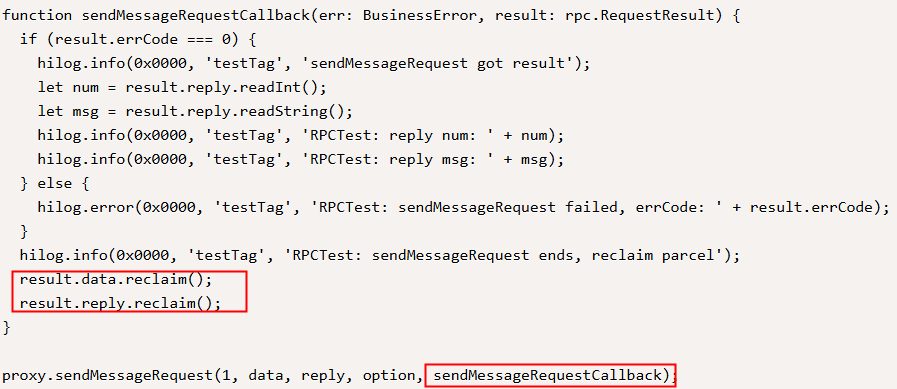

 
创建时是对象（obj），但超出作用域后再次使用时，类型变为字符串（string），导致行为异常。
 
**案例二**：napi_value超napi框架的scope范围
 
```text
testNapi.test3(2, 3);
testNapi.test4().length;
```
 
```text
napi_value objvalues = nullptr;
static napi_value Test3(napi_env env, napi_callback_info info) {
    napi_create_object(env, &objvalues);
    return nullptr;
}

static napi_value Test4(napi_env env, napi_callback_info info) { return objvalues; }
```
 

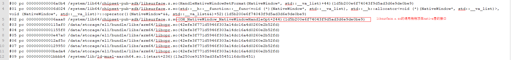

 
**原因分析：**
 
跨NAPI的native_value未使用napi_ref保存，超出NAPI调用框架的范围后，native_value失效。
 
注：NAPI框架中的scope即napi_handle_scope，开发者可以通过napi_handle_scope管理napi_value的生命周期。框架层的scope嵌入在js调用native的整个流程中，在进入native方法前打开scope，在native方法结束后关闭scope。
 
**【最佳实践】**
 
1. 针对案例1，使用napi_escapable_handle_scope，并在close之前提前escape。
 
```cpp
static napi_value Test2(napi_env env, napi_callback_info info) {
    napi_escapable_handle_scope scope = nullptr;
    napi_value value1 = nullptr;
    napi_value value2 = nullptr;
    napi_value value3 = nullptr;
    napi_value value4 = nullptr;


    napi_open_escapable_handle_scope(env, &scope);
    napi_create_object(env, &value1);
    napi_escape_handle(env, scope, value1, &value4);
    napi_close_escapable_handle_scope(env, scope);
    napi_create_string_utf8(env, "const char *str", NAPI_AUTO_LENGTH, &value2);
    napi_create_string_utf8(env, "const char *str", NAPI_AUTO_LENGTH, &value3);
    napi_valuetype type = napi_null;
    napi_typeof(env, value4, &type);
    OH_LOG_INFO(LOG_APP, "xxx, %{public}d", type);


    return value1;
}
```
 
以上代码，结果符合预期
 

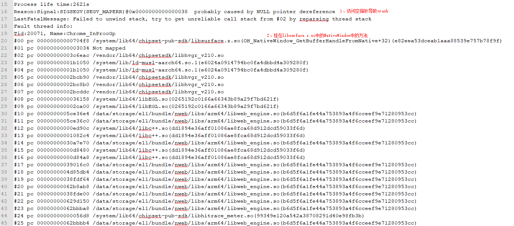

 
2. 针对案例2，使用napi_ref保存强引用。
 
```cpp
napi_ref g_ref = nullptr;
static napi_value Test3(napi_env env, napi_callback_info info) {
    napi_value value;
    napi_create_object(env, &value);
    napi_create_reference(env, value, 1, &g_ref);
    return nullptr;
}

static napi_value Test4(napi_env env, napi_callback_info info) {
    napi_value result;
    napi_get_reference_value(env, g_ref, &result);
    napi_delete_reference(env, g_ref);
    return result;
}
```
 

 
8、【use after free】开发者保存env指针，env释放后开发者继续使用，产生UAF导致崩溃
 
**【问题描述】**
 
开发者提前保存napi_env指针，js线程退出后地址被释放，再使用旧napi_env调用napi接口时崩溃。
 
**【使用错误影响】**
 
应用闪退
 
**【使用建议】**
 
- 减少保存env指针的行为，直接使用napi框架层透传的env更为安全。
- 若需保存env指针，可使用napi_add_env_cleanup_hook接口注册回调，在回调中处理env的退出。

 
**【典型案例】**
 
```text
Timestamp:2023-07-21 22:42:43.036
Pid:3952
Uid:20010086
Reason:Signal:SIGSEGV(SEGV_MAPERR)@0x0000000000000028 
Tid:3997, Name:PaEngineRunner1
#00 pc 0000000000022794 /system/lib64/platformsdk/libace_napi.z.so(NativeEngineInterface::ClearLastError()+0)(7c5267e605f12e7abb774fca82e34826)
#01 pc 000000000001c150 /system/lib64/platformsdk/libace_napi.z.so(napi_delete_reference+44)(7c5267e605f12e7abb774fca82e34826)
#02 pc 000000000002cf74 /system/lib64/chipset-pub-sdk/libipc_napi.z.so(OHOS::NAPIRemoteObject::~NAPIRemoteObject()+100)(e5ef129057d21508b210b1ea767c123e)
#03 pc 000000000002d0e0 /system/lib64/chipset-pub-sdk/libipc_napi.z.so(virtual thunk to OHOS::NAPIRemoteObject::~NAPIRemoteObject()+36)(e5ef129057d21508b210b1ea767c123e)
#04 pc 00000000000208b8 /system/lib64/chipset-pub-sdk/libutils.z.so(OHOS::RefBase::DecStrongRef(void const*)+184)(764d94f3f9f77923ad3529406319770b)
#05 pc 000000000003123c /system/lib64/chipset-pub-sdk/libipc_napi.z.so(OHOS::NAPIRemoteObjectHolder::~NAPIRemoteObjectHolder()+92)(e5ef129057d21508b210b1ea767c123e)
#06 pc 00000000000312b4 /system/lib64/chipset-pub-sdk/libipc_napi.z.so(OHOS::NAPIRemoteObjectHolder::~NAPIRemoteObjectHolder()+16)(e5ef129057d21508b210b1ea767c123e)
#07 pc 0000000000026b24 /system/lib64/libace_napi_ark.z.so(ArkNativeReference::FinalizeCallback()+36)(6b56b7e2cdfb750cbb348dbc6b3f65cd)
```
 
根据日志打印的env地址定位，发现env被释放后仍在使用。
 

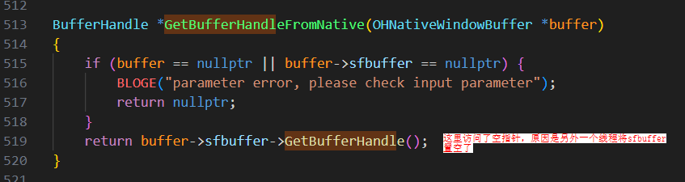

 
9、【use after free】开发者使用napi_get_reference_value时，napi_ref已被释放，导致UAF问题
 
**【问题描述】**
 
开发者在napi_ref已被释放的情况下使用napi_get_reference_value，导致UAF问题。
 
**【使用错误影响】**
 
应用闪退
 
**【使用建议】**
 
若创建的napi_ref为强引用，开发者需要主动管理其生命周期，避免在调用napi_delete_reference后继续使用。
 
**【典型案例】**
 
napi_ref被释放后使用
 

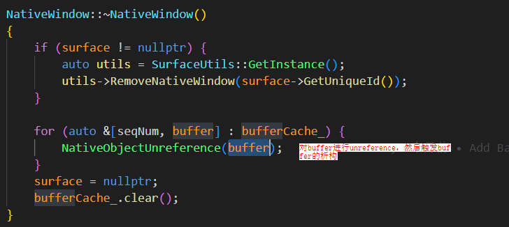

 
10、【buffer overflow】napi_get_value_string_utf8时，buffer长度不足导致越界问题
 
**【问题描述】**
 
开发者在napi同理，接口如napi_get_cb_info和napi_get_string_value_xxx有一个共同特点：需要开发者传入缓冲区及其对应的长度。如果开发者传入的缓冲区大小超过实际的缓冲区大小，就会发生越界问题。_ref已被释放的情况下使用napi_get_reference_value，导致UAF问题。同理，接口如napi_get_cb_info和napi_get_string_value_xxx有一个共同特点：需要开发者传入缓冲区及其对应的长度。如果开发者传入的缓冲区大小超过实际的缓冲区大小，就会发生越界问题。
 
**【使用错误影响】**
 
应用闪退
 
**【使用建议】**
 
1. 开发者需确保buffer容量充足，防止越界。
 
2. 对于napi_get_value_string_xxx系列接口，可以传入NAPI_AUTO_LENGTH作为buffer长度，接口会自动计算buffer长度。
 
**【典型案例】**
 
argc的值超过argv数组的实际长度，导致数组越界。
 
```text
static napi_value Test5(napi_env env, napi_callback_info info) {
    size_t argc; // 未初始化，argc可能是个随机的、很大的值
    napi_value argv[3] = {nullptr};
    napi_get_cb_info(env, info, &argc, argv, nullptr, nullptr);
    return argv[0];
}
```
 

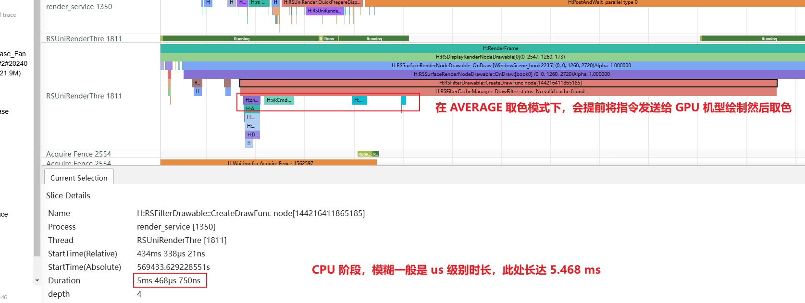

 
 

##### 示例代码

- [易错API的使用规范](https://gitcode.com/harmonyos_samples/BestPracticeSnippets/tree/master/ApiUsingStandards)
