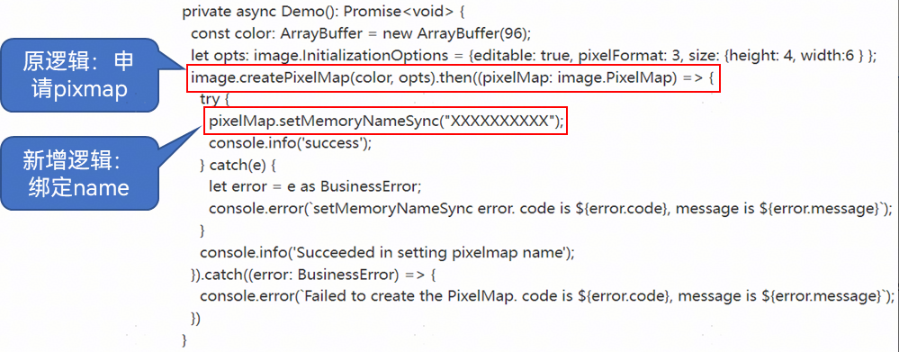
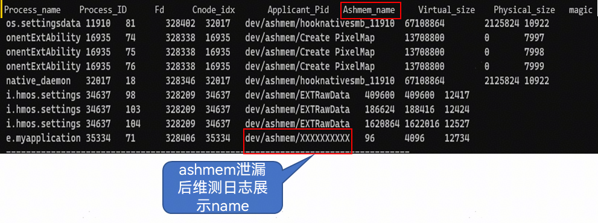
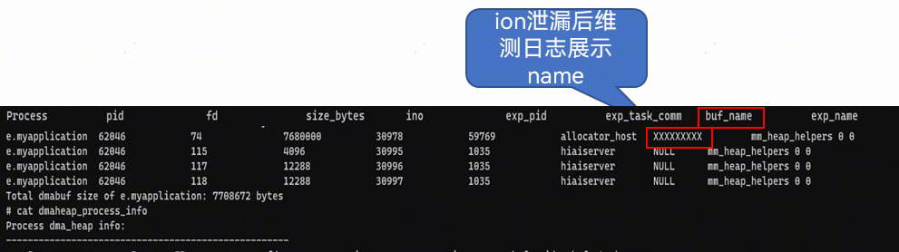

# 资源泄漏类问题优化建议

更新时间：2026-03-12 08:45:02

来源：https://developer.huawei.com/consumer/cn/doc/best-practices/bpta-stability-leak-opt

## 内存泄漏问题优化建议


### 优化建议1：使用定时器组件销毁时一定要调用clearTimeout和clearInterval，否则对象无法析构


定时器未清理导致组件一直没有析构。

```ts
export default class test {
  private timer: number | null = null; // 正确声明类属性

  onInit() {
    this.timer = setInterval(() => {
      this.updateData(); // 通过this调用类方法
    }, 1000);
  }

  private updateData() {
    // 定时任务具体逻辑
  }
}
```

优化建议：

使用定时器组件销毁时一定要调用clearTimeout和clearInterval，否则对象无法析构。

```ts
export default class test {
  private timer: number | null = null; // 正确声明类属性

  onInit() {
    this.timer = setInterval(() => {
      this.updateData(); // 通过this调用类方法
    }, 1000);
  }

  private updateData() {
    // 定时任务具体逻辑
  }

  onDestroy() {
    if (this.timer !== null) {
      clearInterval(this.timer); // 清理定时器
      this.timer = null;
    }
  }
}
```


### 优化建议2：异常分支需要关注释放申请的内存


申请堆内存但是没有在异常分支进行释放。

```cpp
static bool InjectNativeLeak1()
{
  char* p = (char*)malloc(g_cmdLen + 1);
  if (!p) {
    return false;
  }
  auto err = memset(p, 'a', g_cmdLen);
  if (err) {
    // 异常分支退出未释放
    return false;
  }
  free(p);
  return true;
}
```

优化建议：

在代码开发中需要特别注意以下场景：

1. 同一函数内，异常分支未释放资源。
2. 构造函数中申请资源，析构函数未释放资源。
3. 资源申请释放有配对，但配对函数或变量不匹配。
4. 指针地址偏移等原因导致申请的内存地址丢失。


```cpp
static bool InjectNativeLeak2()
{
  char* p = (char*)malloc(g_cmdLen + 1);
  if (!p) {
    return false;
  }
  auto err = memset(p, 'a', g_cmdLen);
  if (err) {
    free(p);
    return false;
  }
  free(p);
  return true;
}
```


## ashmem/ION泄漏问题优化建议


### 优化建议1：调用命名API接口，设定ashmem和ION的名字，与pixmap绑定，来提高这类内存泄漏的定位效率


未释放的共享内存映射。

```cpp
void processWithLeak1(int fd, size_t size) {
  void* ptr = mmap(nullptr, size, PROT_READ | PROT_WRITE, MAP_SHARED, fd, 0);
  if (ptr == MAP_FAILED) {
    return;
  }
  // 使用共享内存
  processData(ptr);
  // 忘记调用munmap(ptr, size);
  // 每一次调用都会泄漏一块映射内存
}
```

优化建议：

及时释放内存映射。

```cpp
void processWithLeak2(int fd, size_t size) {
  void* ptr = mmap(nullptr, size, PROT_READ | PROT_WRITE, MAP_SHARED, fd, 0);
  if (ptr == MAP_FAILED) {
    return;
  }
  // 使用共享内存
  processData(ptr);
  munmap(ptr, size);
}
```

针对ION和ashmem内存泄漏，开发者可以调用命名API接口，设定ashmem和ION的名字，与pixmap绑定，来提高这类内存泄漏的定位效率。

提供的API接口使用方法可参考：

JS层API：setMemoryNameSync()

NATIVE层API：OH_PixelmapNative_SetMemoryName()

建议Name按照窗口+组件+图片序号自定义，如果出现批量组件图片内存未释放，可快速定位。

修改方法示例：





ashmem日志结果示例展示：





ION日志结果示例展示：





## 句柄泄漏问题优化建议


### 优化建议1：函数各个异常分支及时增加关闭句柄的操作


代码打开文件句柄，但是没有释放造成句柄泄漏。

```cpp
void InjectContinuingFileFdLeak1(std::string path) {
  mode_t fileMode = 0644;
  int fd = open(path.c_str(), O_CREAT | O_RDWR, fileMode);
  if (fd < 0) {
    return;
  }

  if (!CheckStatus()) {
    // 异常分支未关闭句柄
    return;
  }
  close(fd); // 正常业务流程关闭句柄
}
```


优化建议：在创建文件句柄的同时在函数出口（含函数各个异常分支）及时增加关闭句柄的操作，防止句柄未正常关闭导致的泄漏。

```cpp
void InjectContinuingFileFdLeak2(std::string path) {
  mode_t fileMode = 0644;
  int fd = open(path.c_str(), O_CREAT | O_RDWR, fileMode);
  if (fd < 0) {
    return;
  }

  if (!CheckStatus()) {
    close(fd);
    return;
  }
  close(fd); // 正常业务流程关闭句柄
}
```


## 线程泄漏问题优化建议


### 优化建议1：严格控制线程生命周期


未正确管理线程对象，无法知道线程何时结束，可能导致资源泄漏。

```cpp
void riskyThreadFunction(int num) {
  for (int i = 0; i < num; i++) { // 创建 Num 个线程
    pthread_t thread;
    pthread_create(&thread, NULL, LeadThreadFn, NULL);
    // ...
  }
  // ...
  return;
}
```

优化建议：

1. 严格控制线程的生命周期，尽量避免大量线程同时存在以及线程生命周期脱离控制的情况；
2. 保证异常场景的线程安全，补充异常场景下的线程管理机制，推荐使用线程池来进行管理；
3. 创建线程时为线程取名（默认继承父进程名，导致大量同名线程），便于出现线程泄漏后的快速定位；
4. pthread_create后需要调用pthread_join或者pthread_detach确保线程资源能回收掉。


```cpp
class ThreadPool { // 线程池实现，支持线程生命周期管理和回收
public:
  // ...
  static bool addTask(const Task& task) {
    // ...
    return true;
  }
};

void safeThreadFunction(int num) {
  for (int i = 0; i < num; i++) { // 创建 Num 个线程
    Task task;
    bool ret = ThreadPool::addTask(task); // 使用线程池管理线程
    if (ret) {
      break;
    }
    // ...
  }
  // ...
  return;
}
```
