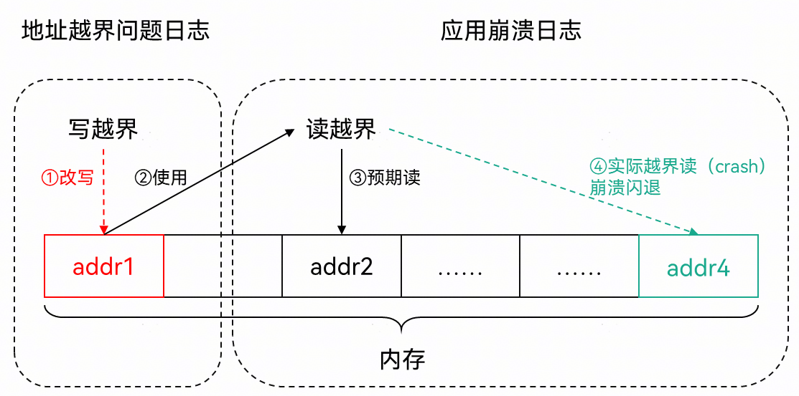
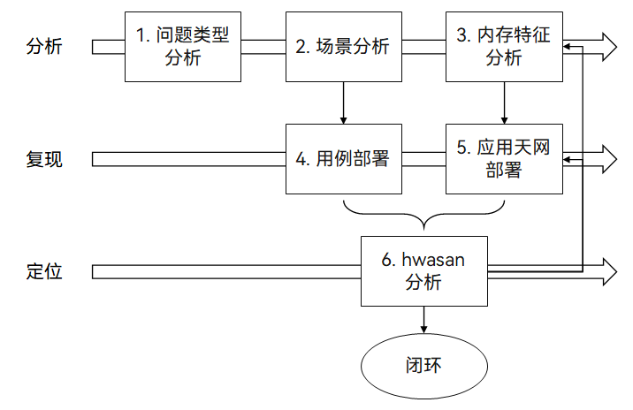
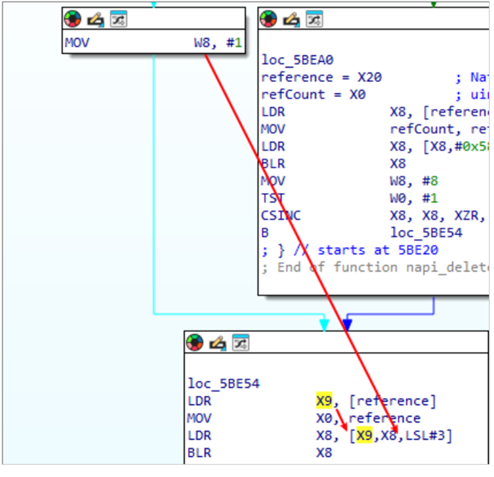
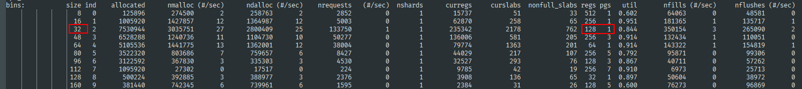
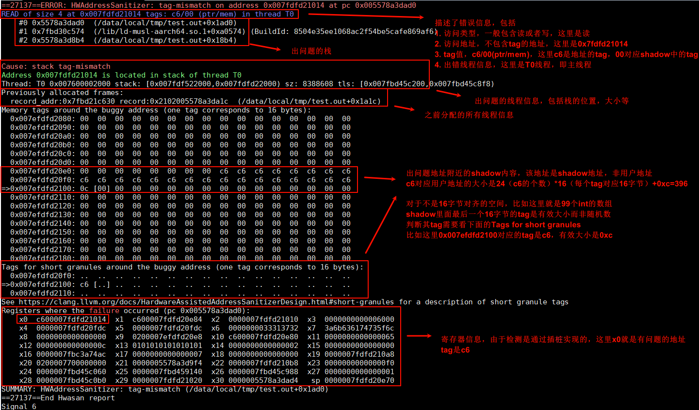

# 地址越界类问题分析方法

更新时间：2026-03-12 08:45:02

来源：https://developer.huawei.com/consumer/cn/doc/best-practices/bpta-stability-address-illegal-way

## 概述


地址越界问题是指访问了不合法的地址，导致程序运行出现异常，通常表现为应用崩溃（crash），其故障原因为释放后使用（use after free）、重复释放（double-free）、栈溢出（stack-overflow）、堆溢出（heap-overflow）等。由于应用崩溃（crash）日志信息有限且非崩溃第一现场，地址越界问题定位较为困难，一般依赖ASan、HWASan、GWP-ASan等检测工具以获取更多内存操作信息。从API13开始推荐使用HWASan检测工具进行地址越界问题的分析，具体参考使用HWASan检测内存错误。

本文主要介绍地址越界问题检测能力、地址越界问题定位分析思路。


## 检测能力


目前系统提供了ASan、HWASan、GWP-ASan等检测工具，支撑应用解决地址越界问题，相关介绍、检测问题类型均在《使用ASan检测内存错误》、《使用GWP-ASan检测内存错误》已有讲解，不再赘述。


## 分析定位思路


### 地址越界问题的定位流程


如下，由于地址越界问题在应用的故障现象通常为崩溃闪退（Crash），且Crash的栈可能不是第一现场，而是受害者的栈，因此这类问题分析难度较高，且经常依赖于天网版本复现。





以下为踩内存问题的通用分析流程，力求提升踩内存问题检测和定位效率。





第一步：问题类型分析

识别cppcrash问题的类型，是否为地址越界导致，一般需要提供汇编（C++隐藏太多细节，建议查看汇编）、内存的分析，代码中此内存的生命周期。具体详细案例可参看地址越界类问题案例。

第二步：场景分析

1. **用户场景：**配合流水日志、崩溃栈（报错原因）、应用处理逻辑，分析用户或者测试在什么场景激发此问题（哪些页面、哪些控件，哪些功能，例如用户点击从App的页面1切换到页面2，再例如上面案例中某个进程崩在启动阶段），代码在什么场景下会走到这段流程。最好结合多份日志提炼共性，搞清楚场景有助于明确这个过程中用到了哪些部分的代码，针对性的测试，并且对这部分代码补充维测和天网插桩。
2. **异常线程分析：**由于大部分内存分配器（比如jemalloc、scudo等）都是线程亲和，本线程前一个释放的内存会优先给到下一个分配者，因此如果崩溃线程非常聚焦，那说明凶手也和这个线程上跑的业务相关。同样有助于找到场景。


第三步：内存特征分析

包含内存的大小、踩内存点在内存块的偏移、踩内存值的特征，最好结合多份日志提炼共性。

找准出现问题的内存是什么

错误的内存使用，可能有两种：

1. 地址直接从某个内存取出来的，取错了，例如从this解引用出来一个值放x0，再做一次解引用，如果第二行挂了，那说明this上面的值是坏的。
```text
LDR X0, [this] // ARM64架构示例，X0寄存器存储this指针值
LDR X8, [X0]   // ARM64架构示例，X8寄存器存储X0寄存器指向的值
```
 可能的原因：
- 地址越界：this这块内存已经被本模块释放了，被新申请走填了新内容（常见）。
- 地址越界：this这块内存还是本模块持有，但内容被别的代码改坏了（常见）。
- 兼容性：数据结构定义不一致（少见但必现）。
- 器件问题：DDR、SOC问题（少见）。
2. 地址是算出来的，计算过程中有一些参数是从某个内存取出来的，计算结果错了，那肯定是这些取的参数有问题。如下图所示，IDA（反汇编工具）展示了一个典型的函数指针数组操作，w8是数组下标，从1开始，x9是reference解引用出来的，如果blr x8这条挂了，说明x9[x8]上面的值是坏的，而如果是ldr x8, [x9,x8,LSL#3]这条挂了，说明x9[x8]这个地址是无效的。



找出现问题的内存大小：

在sizeclass类型的分配器中，大小是一个重要的信息，筛选该内存大小的栈有助于快速筛选，提升定位效率。

以native内存分配器jemalloc为例，内存统计布局如下：





假设踩内存大小为32，查看上图右边红框标记出来的地方表示128个32字节的内存会挤在1个page上，刚好是32*128=4096字节。同样，下面80字节的内存块，每256个都挤在5个page上，80*256==20480=4096*5。17-32字节的内存分配，都会从这个32档位sizeclass的内存页上去分配，也就是说，如果发生overflow，凶手前后多半也是32字节的，因此受害者是32字节的，如果发生uaf（use-after-free），那么free的内存会被另一个17-32字节的申请者拿走，这个申请者就成为了受害者。

第四步：用例部署

针对场景分析给出测试场景建议，以及测试部署规模的预测。

1. **目标****：**复杂问题的测试往往需要分类分段。有这么几种：复现为了找到场景，明确用例是否有效。
2. 添加了更多的定位信息后，复现为了证明/排除某个怀疑方向。


当一个目标达成，要尽快制定策略进入下一个目标。例如当添加的日志已经证明输入参数是有问题的，那需要找到传参模块进行流程分析并给出维测和测试方案。
 用例：由于越界问题和特定代码相关，因此需要对应用例让故障代码执行到。
最常规的用例就是UI随机测试，但是随机测试效率较低，需要根据场景和内存特征定制用例。同时应用的问题往往和内存的析构相关，因此要重点关注页面退出、资源关闭等场景。
 规模：开发应当了解crash的发生频率，以此预估所需要的测试资源。
例如某个Crash问题的APR为10（发生10次/千小时），也就是说此问题100小时复现1次，那么也就是在实验室和Beta测试这类综合场景中，大约4台手机测24小时能复现一次。如果在针对性的复现测试中，4台手机测试了24-48小时还不能出现一次同类的crash，那么说明测试的场景不对。需要根据现场的hilog等日志，再分析出高效的场景。

第五步：应用天网部署

明确应用进程中已经有哪些so插桩，有条件插桩的应用侧so都应该部署插桩。由于踩内存产生的crash调用栈存在很多随机性，而且反复复现编译很浪费时间，因此建议插桩越全越好，进程加载的so可基于crash文件的maps数据段确定，尽量都用HWASan编译。并且so链接时如果有静态库，静态库本身最好也用HWASan编译。插桩方法可见配置HWASan，继而基于上文部署的用例进行压测。


> [!NOTE]
> 应用天网版本：应用开启地址越界检测能力后编译的版本，具体参考[地址越界检测能力概述](https://developer.huawei.com/consumer/cn/doc/best-practices/bpta-stability-address-sanitizer-overview)。


第六步：日志分析

对于稳定性测试出来的地址越界问题，基于问题日志，分析问题根因并解决。同样，也可基于地址越界日志，基于内存特征、场景等信息逆向分析，确认是否与之前疑似踩内存的crash问题类似。


### 地址越界问题类型


常见地址问题类型可参见地址越界事件介绍-type字段说明


### 地址越界问题的日志分析


对于地址越界问题的日志分析，由于日志落盘与cppcrash日志相似，具体参考CppCrash类问题分析方法，详细的步骤为：

1. 获取HWASan检测工具，检测并获取地址越界问题日志。
2. 获取符号表，定位行号（use栈、free栈）。
3. 结合应用代码逻辑分析代码的内存操作。


地址越界问题代码示例：

以地址越界问题类型栈缓存区溢出（stack-buffer-overflow）为例，该类型是指程序读、写的栈内存超出预期范围，程序运行异常、崩溃，具体影响如下

1. 对于越界读的场景，读取到无效数据并且使用时，程序运行出现异常；
2. 对于越界写的场景，出现对有效数据的覆盖，甚至覆盖支撑问题定位的信息（例如，栈帧信息）；


地址越界问题类型的示例代码如下。

```cpp
int AddressOverflowCode(int argc)
{
  int stack_array[99];
  stack_array[1] = 0;
  return stack_array[argc + 100]; // BOOM
}
```

- 地址越界问题日志分析


开启HWASan检测，上报的地址越界问题日志如下，

```text
==27137==ERROR: HWAddressSanitizer: tag-mismatch on address 0x007fdfd21014 at pc 0x005578a3dad0
READ of size 4 at 0x007fdfd21014 tags: c6/00 (ptr/mem) in thread T0
 #0 0x5578a3dad0  (/data/local/tmp/test.out+0x1ad0)
 #1 0x7fbd30c574  (/lib/ld-musl-aarch64.so.1+0xa0574) (BuildId: 8504e35ee1068ac2f54be5cafe869af6)
 #2 0x5578a3d8b4  (/data/local/tmp/test.out+0x18b4)
Cause: stack tag-mismatch
Address 0x007fdfd21014 is located in stack of thread T0
Thread: T0 0x007600002000 stack: [0x007fdf522000,0x007fdfd22000) sz: 8388608 tls: [0x007fbd45c200,0x007fbd45c8f8)
Previously allocated frames:
record_addr:0x7fbd21c630 record:0x2102005578a3da1c  (/data/local/tmp/test.out+0x1a1c)
Memory tags around the buggy address (one tag corresponds to 16 bytes):
0x007efdfd2080: 00  00  00  00  00  00  00  00  00  00  00  00  00  00  00  00
0x007efdfd2090: 00  00  00  00  00  00  00  00  00  00  00  00  00  00  00  00
0x007efdfd20a0: 00  00  00  00  00  00  00  00  00  00  00  00  00  00  00  00
0x007efdfd20b0: 00  00  00  00  00  00  00  00  00  00  00  00  00  00  00  00
0x007efdfd20c0: 00  00  00  00  00  00  00  00  00  00  00  00  00  00  00  00
0x007efdfd20d0: 00  00  00  00  00  00  00  00  00  00  00  00  00  00  00  00
0x007efdfd20e0: 00  00  00  00  00  00  00  00  c6  c6  c6  c6  c6  c6  c6  c6
0x007efdfd20f0: c6  c6  c6  c6  c6  c6  c6  c6  c6  c6  c6  c6  c6  c6  c6  c6
=>0x007efdfd2100: 0c [00] 00  00  00  00  00  00  00  00  00  00  00  00  00  00
0x007efdfd2110: 00  00  00  00  00  00  00  00  00  00  00  00  00  00  00  00
0x007efdfd2120: 00  00  00  00  00  00  00  00  00  00  00  00  00  00  00  00
0x007efdfd2130: 00  00  00  00  00  00  00  00  00  00  00  00  00  00  00  00
0x007efdfd2140: 00  00  00  00  00  00  00  00  00  00  00  00  00  00  00  00
0x007efdfd2150: 00  00  00  00  00  00  00  00  00  00  00  00  00  00  00  00
0x007efdfd2160: 00  00  00  00  00  00  00  00  00  00  00  00  00  00  00  00
0x007efdfd2170: 00  00  00  00  00  00  00  00  00  00  00  00  00  00  00  00
0x007efdfd2180: 00  00  00  00  00  00  00  00  00  00  00  00  00  00  00  00
Tags for short granules around the buggy address (one tag corresponds to 16 bytes):
0x007efdfd20f0: ..  ..  ..  ..  ..  ..  ..  ..  ..  ..  ..  ..  ..  ..  ..  ..
=>0x007efdfd2100: c6 [..] ..  ..  ..  ..  ..  ..  ..  ..  ..  ..  ..  ..  ..  ..
0x007efdfd2110: ..  ..  ..  ..  ..  ..  ..  ..  ..  ..  ..  ..  ..  ..  ..  ..
See https://clang.llvm.org/docs/HardwareAssistedAddressSanitizerDesign.html#short-granules for a description of short granule tags
Registers where the failure occurred (pc 0x005578a3dad0):
x0  c600007fdfd21014  x1  c600007fdfd20e84  x2  0000007fdfd21010  x3  0000000000006000
x4  0000007fdfd20fdc  x5  0000007fdfd20fdc  x6  0000000033313732  x7  3a6b636174735f6c
x8  0000000000000000  x9  0200007efdfd20e8  x10 c600007fdfd20e80  x11 0000000000000065
x12 000000000000000c  x13 0101010101010101  x14 0000000000000002  x15 0000000000000000
x16 0000007fbc3a74ac  x17 0000000000000007  x18 0000000000000000  x19 0000007fdfd210a8
x20 0200007700000000  x21 0000005578a3d9f4  x22 0000007fdfd210b8  x23 00000000000000f0
x24 0000007fbd45c060  x25 0000007fbd459140  x26 0000007fbd45c988  x27 0000000000000001
x28 0000007fbd45c0b0  x29 0000007fdfd21020  x30 0000005578a3dad4   sp 0000007fdfd20e70
SUMMARY: HWAddressSanitizer: tag-mismatch (/data/local/tmp/test.out+0x1ad0)
==27137==End Hwasan report
```

对应的日志结构如下，以#0栈为例，可使用反编译工具llvm-addr2line，输入地址的偏移0x1ad0，即可解析出对应的源代码行号。



