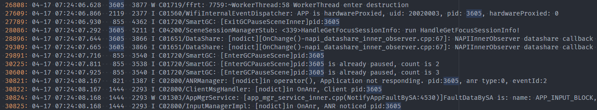
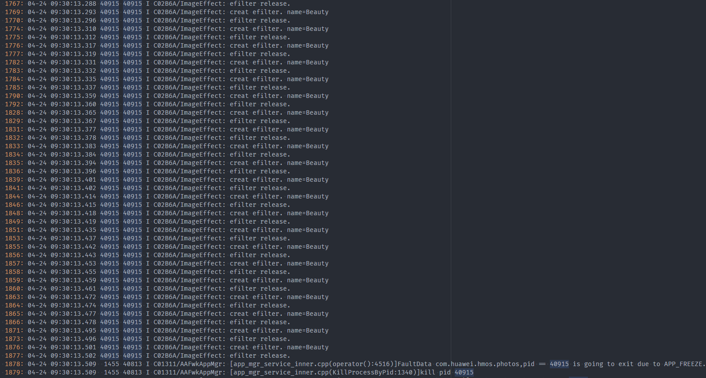
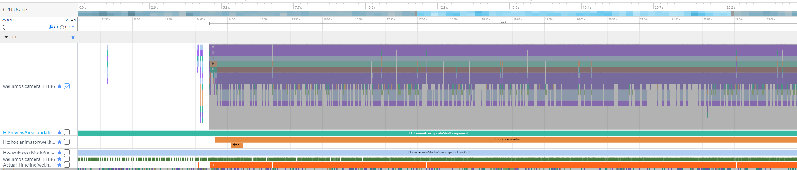
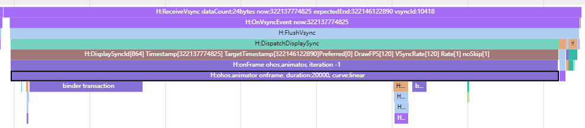
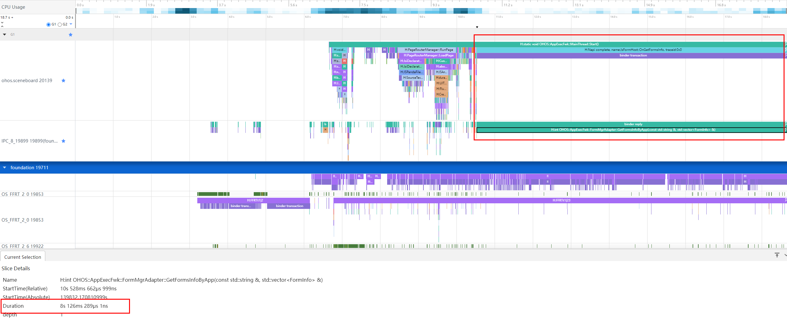
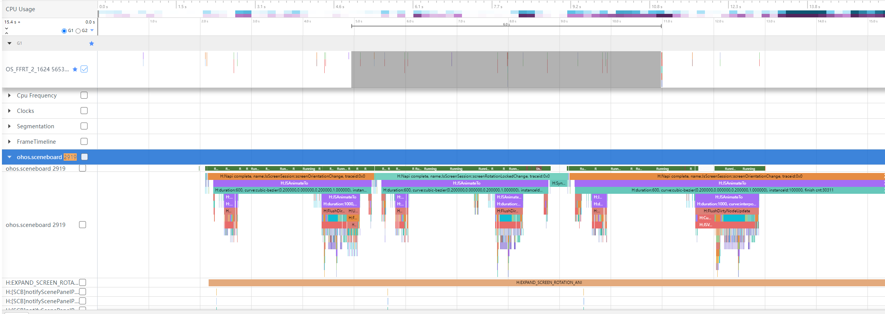

# 应用冻屏问题排查方法

更新时间：2026-03-12 08:45:02

来源：https://developer.huawei.com/consumer/cn/doc/best-practices/bpta-stability-app-freeze-way


 

应用冻屏日志获取方法与日志规格详见[日志获取](https://developer.huawei.com/consumer/cn/doc/harmonyos-guides/appfreeze-guidelines#日志获取)和[日志规格](https://developer.huawei.com/consumer/cn/doc/harmonyos-guides/appfreeze-guidelines#日志规格)。
 

 

#### 定位步骤与思路

 

#### 获取日志

 
应用冻屏（AppFreeze）日志是一种故障日志，与Native进程崩溃、JS应用崩溃、系统进程异常等都由FaultLog模块管理，可通过以下方式获取日志：
 
方式一：通过DevEco Studio获取日志
 
DevEco Studio会收集设备的故障日志并归档到FaultLog下。具体可参考[FaultLog](https://developer.huawei.com/consumer/cn/doc/harmonyos-guides/ide-fault-log)。
 
方式二：通过hiappevent获取
 
hiappevent对外提供订阅系统卡死事件，可以查询卡死事件信息，详见[应用冻屏事件介绍](https://developer.huawei.com/consumer/cn/doc/harmonyos-guides/hiappevent-watcher-freeze-events)。
 
方式三：通过shell获取日志
 
应用冻屏日志是以appfreeze-开头，生成在设备“/data/log/faultlog/faultlogger/”路径下。该日志文件名格式为“appfreeze-应用包名-应用UID-毫秒级时间”。
 

#### 查看基本信息
1. 进程号故障日志中搜索“Pid”可获得。

  根据进程号可以查找对应进程的栈信息、在流水日志中过滤出对应进程的日志输出等。
2. 故障类型故障日志中搜索“Reason”可获得。

  根据故障类型可以参考对应类型的检测原理和故障检测时长。
3. 故障上报时间点故障日志中搜索“Fault time”可获得。

  请注意日志中多处“TIMESTAMP”字段的含义，代表着故障形成过程中中间重要节点的时间，正常场景下与故障上报时间点接近，但是特殊的，当故障形成时由于种种系统原因导致阻塞，可能存在一定的时间误差。

  而“Fault time”字段最接近故障上报时间点。
4. 前后台信息故障日志中搜索“Foreground”可获得。

  该字段表示应用发生故障时所处前后台状态。

  值得注意的是，APP_INPUT_BLOCK 用户输入响应超时，事件能够分发到应用上，所以应用必为前台状态。
5. 故障检测时长该信息可从故障类型和前后台信息推理得出。

  对于THREAD_BLOCK_6S事件，当应用处于前台时，检测时长为6s；当应用处在后台时，由于不直接与用户交互，其对主线程阻塞判断有所放宽，其故障检测时长为21s。

  对于LIFECYCLE_TIMEOUT事件，可以从MSG的reason部分获取是哪种生命周期超时，参照表格获取其对应的故障检测时长。
6. 故障检测时间区间该信息可从故障上报时间点和故障检测时长推理得出。通过故障时间点往前推故障检测时长可得到故障发生的具体时间。

  区间为：【故障上报时间点 - 故障检测时长，故障上报时间点】
 
 

#### 查看eventHandler信息

1. EventHandler dump begin curTime & Current Running
```text
mainHandler dump is:
EventHandler dump begin curTime: 2024-08-08 12:17:43.544         -> 开始 dump 时间
Event runner (Thread name = , Thread ID = 35854) is running
Current Running: start at 2024-08-08 12:17:16.629, Event { send thread = 35882, send time = 2024-08-08 12:17:16.628, handle time = 2024-08-08 12:17:16.629, trigger time = 2024-08-08 12:17:16.630, task name = , caller = xxx  }
-> trigger time：任务开始运行的时间
```
 当前任务已运行时长 = dump begin curTime - trigger time，如示例中当前任务运行达到27s

  若时间差 > 故障检测时长，表示当前正在运行的任务即是导致应用卡死的任务，需排查该任务运行情况。

  若时间差较小，表示当前任务仅是检测时间区间内主线程运行的任务之一，主要耗时不一定是本任务，需排查近期运行的任务中耗时较长者。该情形多为线程繁忙导致的watchdog无法调度执行。
2. History event queue information
```cpp
Current Running: start at 2024-08-08 12:17:16.629, Event { send thread = 35882, send time = 2024-08-08 12:17:16.628, handle time = 2024-08-08 12:17:16.629, trigger time = 2024-08-08 12:17:16.630, task name = , caller = [extension_ability_thread.cpp(ScheduleAbilityTransaction:393)] }
History event queue information:
No. 0 : Event { send thread = 35854, send time = 2024-08-08 12:17:15.525, handle time = 2024-08-08 12:17:15.525, trigger time = 2024-08-08 12:17:15.527, completeTime time = 2024-08-08 12:17:15.528, priority = High, id = 1 }
No. 1 : Event { send thread = 35854, send time = 2024-08-08 12:17:15.525, handle time = 2024-08-08 12:17:15.525, trigger time = 2024-08-08 12:17:15.527, completeTime time = 2024-08-08 12:17:15.527, priority = Low, task name = MainThread:SetRunnerStarted }
No. 2 : Event { send thread = 35856, send time = 2024-08-08 12:17:15.765, handle time = 2024-08-08 12:17:15.765, trigger time = 2024-08-08 12:17:15.766, completeTime time = 2024-08-08 12:17:15.800, priority = Low, task name = MainThread:LaunchApplication }
No. 3 : Event { send thread = 35856, send time = 2024-08-08 12:17:15.767, handle time = 2024-08-08 12:17:15.767, trigger time = 2024-08-08 12:17:15.800, completeTime time = 2024-08-08 12:17:16.629, priority = Low, task name = MainThread:LaunchAbility }
No. 4 : Event { send thread = 35854, send time = 2024-08-08 12:17:15.794, handle time = 2024-08-08 12:17:15.794, trigger time = 2024-08-08 12:17:16.629, completeTime time = 2024-08-08 12:17:16.629, priority = IDEL, task name = IdleTime:PostTask }
No. 5 : Event { send thread = 35882, send time = 2024-08-08 12:17:16.629, handle time = 2024-08-08 12:17:16.629, trigger time = 2024-08-08 12:17:16.629, completeTime time = , priority = Low, task name =  }
```
 可以从历史任务队列中寻找故障发生时间区间内较为耗时的任务。其中completeTime time为空的任务即是当前任务。

  任务运行耗时 = completeTime time - trigger time

  筛选出耗时较高的任务，排查其运行情况。
3. VIP priority event queue information
```cpp
VIP priority event queue information:
No.1 : Event { send thread = 3205, send time = 2024-08-07 04:11:15.407, handle time = 2024-08-07 04:11:15.407, task name = ArkUIWindowInjectPointerEvent, caller = [task_runner_adapter_impl.cpp(PostTask:33)] }
No.2 : Event { send thread = 3205, send time = 2024-08-07 04:11:15.407, handle time = 2024-08-07 04:11:15.407, task name = ArkUIWindowInjectPointerEvent, caller = [task_runner_adapter_impl.cpp(PostTask:33)] }
No.3 : Event { send thread = 3205, send time = 2024-08-07 04:11:15.407, handle time = 2024-08-07 04:11:15.407, task name = ArkUIWindowInjectPointerEvent, caller = [task_runner_adapter_impl.cpp(PostTask:33)] }
No.4 : Event { send thread = 3961, send time = 2024-08-07 04:11:15.408, handle time = 2024-08-07 04:11:15.408, task name = MMI::OnPointerEvent, caller = [input_manager_impl.cpp(OnPointerEvent:493)] }
No.5 : Event { send thread = 3205, send time = 2024-08-07 04:11:15.408, handle time = 2024-08-07 04:11:15.408, task name = ArkUIWindowInjectPointerEvent, caller = [task_runner_adapter_impl.cpp(PostTask:33)] }
No.6 : Event { send thread = 3205, send time = 2024-08-07 04:11:15.409, handle time = 2024-08-07 04:11:15.409, task name = ArkUIWindowInjectPointerEvent, caller = [task_runner_adapter_impl.cpp(PostTask:33)] }
No.7 : Event { send thread = 3205, send time = 2024-08-07 04:11:15.409, handle time = 2024-08-07 04:11:15.409, task name = ArkUIWindowInjectPointerEvent, caller = [task_runner_adapter_impl.cpp(PostTask:33)] }
No.8 : Event { send thread = 3205, send time = 2024-08-07 04:11:15.409, handle time = 2024-08-07 04:11:15.409, task name = ArkUIWindowInjectPointerEvent, caller = [task_runner_adapter_impl.cpp(PostTask:33)] }
No.9 : Event { send thread = 3205, send time = 2024-08-07 04:11:15.410, handle time = 2024-08-07 04:11:15.410, task name = ArkUIWindowInjectPointerEvent, caller = [task_runner_adapter_impl.cpp(PostTask:33)] }
No.10 : Event { send thread = 3205, send time = 2024-08-07 04:11:15.410, handle time = 2024-08-07 04:11:15.410, task name = ArkUIWindowInjectPointerEvent, caller = [task_runner_adapter_impl.cpp(PostTask:33)] }
No.11 : Event { send thread = 3205, send time = 2024-08-07 04:11:15.411, handle time = 2024-08-07 04:11:15.411, task name = ArkUIWindowInjectPointerEvent, caller = [task_runner_adapter_impl.cpp(PostTask:33)] }
No.12 : Event { send thread = 3205, send time = 2024-08-07 04:11:15.412, handle time = 2024-08-07 04:11:15.412, task name = ArkUIWindowInjectPointerEvent, caller = [task_runner_adapter_impl.cpp(PostTask:33)] }
No.13 : Event { send thread = 3205, send time = 2024-08-07 04:11:15.412, handle time = 2024-08-07 04:11:15.412, task name = ArkUIWindowInjectPointerEvent, caller = [task_runner_adapter_impl.cpp(PostTask:33)] }
No.14 : Event { send thread = 3205, send time = 2024-08-07 04:11:15.413, handle time = 2024-08-07 04:11:15.413, task name = ArkUIWindowInjectPointerEvent, caller = [task_runner_adapter_impl.cpp(PostTask:33)] }
No.15 : Event { send thread = 3205, send time = 2024-08-07 04:11:15.414, handle time = 2024-08-07 04:11:15.414, task name = ArkUIWindowInjectPointerEvent, caller = [task_runner_adapter_impl.cpp(PostTask:33)] }
No.16 : Event { send thread = 3205, send time = 2024-08-07 04:11:15.414, handle time = 2024-08-07 04:11:15.414, task name = ArkUIWindowInjectPointerEvent, caller = [task_runner_adapter_impl.cpp(PostTask:33)] }
No.17 : Event { send thread = 3205, send time = 2024-08-07 04:11:15.414, handle time = 2024-08-07 04:11:15.414, task name = ArkUIWindowInjectPointerEvent, caller = [task_runner_adapter_impl.cpp(PostTask:33)] }
No.18 : Event { send thread = 3205, send time = 2024-08-07 04:11:15.415, handle time = 2024-08-07 04:11:15.415, task name = ArkUIWindowInjectPointerEvent, caller = [task_runner_adapter_impl.cpp(PostTask:33)] }
No.19 : Event { send thread = 3205, send time = 2024-08-07 04:11:15.416, handle time = 2024-08-07 04:11:15.416, task name = ArkUIWindowInjectPointerEvent, caller = [task_runner_adapter_impl.cpp(PostTask:33)] }
No.20 : Event { send thread = 3961, send time = 2024-08-07 04:11:15.417, handle time = 2024-08-07 04:11:15.417, task name = MMI::OnPointerEvent, caller = [input_manager_impl.cpp(OnPointerEvent:493)] }
No.21 : Event { send thread = 3205, send time = 2024-08-07 04:11:15.417, handle time = 2024-08-07 04:11:15.417, task name = ArkUIWindowInjectPointerEvent, caller = [task_runner_adapter_impl.cpp(PostTask:33)] }
...
```
 用户输入事件传递链中的任务都属于VIP优先级任务，为保障第一时间响应用户。

  
> [!NOTE]
> watchdog任务位于此优先级队列中，观察可发现其是每隔3s发送一次。 watchdog任务仅针对于THREAD_BLOCK任务，用户输入无响应和生命周期超时任务不适用。

4. 对比warning/block事件，观察watchdog任务在队列中的移动情况。参考：[AppFreeze（应用冻屏）检测](https://developer.huawei.com/consumer/cn/doc/harmonyos-guides/appfreeze-guidelines)。warning：

  
```cpp
VIP priority event queue information:
No.1 : Event { send thread = 35862, send time = 2024-08-08 12:17:25.526, handle time = 2024-08-08 12:17:25.526, id = 1, caller = [watchdog.cpp(Timer:156)] }
No.2 : Event { send thread = 35862, send time = 2024-08-08 12:17:28.526, handle time = 2024-08-08 12:17:28.526, id = 1, caller = [watchdog.cpp(Timer:156)] }
No.3 : Event { send thread = 35862, send time = 2024-08-08 12:17:31.526, handle time = 2024-08-08 12:17:31.526, id = 1, caller = [watchdog.cpp(Timer:156)] }
No.4 : Event { send thread = 35862, send time = 2024-08-08 12:17:34.530, handle time = 2024-08-08 12:17:34.530, id = 1, caller = [watchdog.cpp(Timer:156)] }
Total size of High events : 4
```
 block:

  
```cpp
VIP priority event queue information:
No.1 : Event { send thread = 35862, send time = 2024-08-08 12:17:25.526, handle time = 2024-08-08 12:17:25.526, id = 1, caller = [watchdog.cpp(Timer:156)] }
No.2 : Event { send thread = 35862, send time = 2024-08-08 12:17:28.526, handle time = 2024-08-08 12:17:28.526, id = 1, caller = [watchdog.cpp(Timer:156)] }
No.3 : Event { send thread = 35862, send time = 2024-08-08 12:17:31.526, handle time = 2024-08-08 12:17:31.526, id = 1, caller = [watchdog.cpp(Timer:156)] }
No.4 : Event { send thread = 35862, send time = 2024-08-08 12:17:34.530, handle time = 2024-08-08 12:17:34.530, id = 1, caller = [watchdog.cpp(Timer:156)] }
No.5 : Event { send thread = 35862, send time = 2024-08-08 12:17:37.526, handle time = 2024-08-08 12:17:37.526, id = 1, caller = [watchdog.cpp(Timer:156)] }
Total size of High events : 5
```
 以上示例中可发现block队列相比于warning队列更长了，而对应的第一个任务没有发生变化，可能存在两种情况：

  
- 当前正在运行的任务卡死阻塞，导致其他任务一直未被调度执行。

5. 更高优先级队列中任务堆积，导致位于较低优先级队列中的watchdog任务未被调度执行。

  

  #### 查看stack信息

  应用冻屏所对应的故障类型，其检测主要都是应用主线程。

  应用主线程存在以下几种情况：

1. warning/block栈一致，卡锁
```text
Tid:3025, Name: xxx
# 00 pc 00000000001b4094 /system/lib/ld-musl-aarch64.so.1(__timedwait_cp+188)(b168f10a179cf6050a309242262e6a17)
# 01 pc 00000000001b9fc8 /system/lib/ld-musl-aarch64.so.1(__pthread_mutex_timedlock_inner+592)(b168f10a179cf6050a309242262e6a17)
# 02 pc 00000000000c3e40 /system/lib64/libc++.so(std::__h::mutex::lock()+8)(9cbc937082b3d7412696099dd58f4f78242f9512) --> 等锁卡死
# 03 pc 000000000007ac4c /system/lib64/platformsdk/libnative_rdb.z.so(OHOS::NativeRdb::SqliteConnectionPool::Container::Release(std::__h::shared_ptr<OHOS::NativeRdb::SqliteConnectionPool::ConnNode>)+60)(5e8443def4695e8c791e5f847035ad9f)
# 04 pc 000000000007aaf4 /system/lib64/platformsdk/libnative_rdb.z.so(OHOS::NativeRdb::SqliteConnectionPool::ReleaseNode(std::__h::shared_ptr<OHOS::NativeRdb::SqliteConnectionPool::ConnNode>)+276)(5e8443def4695e8c791e5f847035ad9f)
# 05 pc 000000000007a8c0 /system/lib64/platformsdk/libnative_rdb.z.so(5e8443def4695e8c791e5f847035ad9f)
# 06 pc 00000000000b36ec /system/lib64/platformsdk/libnative_rdb.z.so(OHOS::NativeRdb::SqliteSharedResultSet::Close()+324)(5e8443def4695e8c791e5f847035ad9f)
# 07 pc 000000000006da94 /system/lib64/module/data/librelationalstore.z.so(OHOS::RelationalStoreJsKit::ResultSetProxy::Close(napi_env__*, napi_callback_info__*) (.cfi)+212)(5c7c67512e12e0e53fd23e82ee576a88)
# 08 pc 0000000000034408 /system/lib64/platformsdk/libace_napi.z.so(panda::JSValueRef ArkNativeFunctionCallBack<true>(panda::JsiRuntimeCallInfo*)+220)(f271f536a588ef9d0dc5328c70fce511)
# 09 pc 00000000002d71d0 /system/lib64/module/arkcompiler/stub.an(RTStub_PushCallArgsAndDispatchNative+40)
# 10 at parseResultSet (entry/build/default/cache/default/default@CompileArkTS/esmodule/release/datamanager/datawrapper/src/main/ets/database/RdbManager.ts:266:1)
# 11 at query (entry/build/default/cache/default/default@CompileArkTS/esmodule/release/datamanager/datawrapper/src/main/ets/database/RdbManager.ts:188:1)
```
 堆栈显示等锁卡死，通过反汇编获取对应代码行，排查其他线程栈和代码上下文锁的使用解决故障，请参考：[通过llvm-addr2line工具定位行号](https://developer.huawei.com/consumer/cn/doc/best-practices/bpta-stability-app-crash-cpp-way#li186453444512)。

2. warning/block栈一致，卡在IPC请求
```text
Tid:53616, Name:xxx
# 00 pc 0000000000171c1c /system/lib/ld-musl-aarch64.so.1(ioctl+176)(b168f10a179cf6050a309242262e6a17)
# 01 pc 0000000000006508 /system/lib64/chipset-pub-sdk/libipc_common.z.so(OHOS::BinderConnector::WriteBinder(unsigned long, void*)+100)(1edec25445c569dd1093635c1da3bc0a) --> binder 卡死
# 02 pc 000000000004d500 /system/lib64/platformsdk/libipc_core.z.so(OHOS::BinderInvoker::TransactWithDriver(bool)+296)(6151eca3b47aa2ab3e378e6e558b90f3)
# 03 pc 000000000004c6c0 /system/lib64/platformsdk/libipc_core.z.so(OHOS::BinderInvoker::WaitForCompletion(OHOS::MessageParcel*, int*)+128)(6151eca3b47aa2ab3e378e6e558b90f3)
# 04 pc 000000000004c304 /system/lib64/platformsdk/libipc_core.z.so(OHOS::BinderInvoker::SendRequest(int, unsigned int, OHOS::MessageParcel&, OHOS::MessageParcel&, OHOS::MessageOption&)+348)(6151eca3b47aa2ab3e378e6e558b90f3)
# 05 pc 00000000000319ac /system/lib64/platformsdk/libipc_core.z.so(OHOS::IPCObjectProxy::SendRequestInner(bool, unsigned int, OHOS::MessageParcel&, OHOS::MessageParcel&, OHOS::MessageOption&)+124)(6151eca3b47aa2ab3e378e6e558b90f3)
# 06 pc 0000000000031cfc /system/lib64/platformsdk/libipc_core.z.so(OHOS::IPCObjectProxy::SendRequest(unsigned int, OHOS::MessageParcel&, OHOS::MessageParcel&, OHOS::MessageOption&)+184)(6151eca3b47aa2ab3e378e6e558b90f3)
# 07 pc 0000000000023c7c /system/lib64/libipc.dylib.so(<ipc::remote::obj::RemoteObj>::send_request+268)(7006cb5520edc22f64d04df86cb90152)
# 08 pc 000000000000b904 /system/lib64/libasset_sdk.dylib.so(<asset_sdk::Manager>::send_request+48)(4073ec22b58b83f79883d5fc8102ce77)
# 09 pc 000000000000b600 /system/lib64/libasset_sdk.dylib.so(<asset_sdk::Manager>::query+156)(4073ec22b58b83f79883d5fc8102ce77)
# 10 pc 0000000000006d94 /system/lib64/libasset_sdk_ffi.z.so(query_asset+116)(9a309896092ba014c878289a54688679)
# 11 pc 0000000000006740 /system/lib64/module/security/libasset_napi.z.so((anonymous namespace)::NapiQuerySync(napi_env__*, napi_callback_info__*) (.cfi)+220)(ef7afe850712e4822f085ed0ac184e8a)
# 12 pc 0000000000034408 /system/lib64/platformsdk/libace_napi.z.so(panda::JSValueRef ArkNativeFunctionCallBack<true>(panda::JsiRuntimeCallInfo*)+220)(f271f536a588ef9d0dc5328c70fce511)
```
 通过IPC栈帧下面的业务栈帧，识别应用是通过什么接口进行IPC请求，识别对端是什么进程。需要结合binder调用链，确定对端阻塞没有返回的原因。参考：[查看binder信息](#section1743626572)。

3. warning/block栈一致，卡在某业务栈帧
```text
Tid:14727, Name:xxx
# 00 pc 00000000001c4c60 /system/lib/ld-musl-aarch64.so.1(pread+72)(b168f10a179cf6050a309242262e6a17)
# 01 pc 0000000000049154 /system/lib64/platformsdk/libsqlite.z.so(unixRead+180)(48485aa23da681fc87d8dc0b4be3e34c)
# 02 pc 0000000000053e98 /system/lib64/platformsdk/libsqlite.z.so(readDbPage+116)(48485aa23da681fc87d8dc0b4be3e34c)
# 03 pc 0000000000053d48 /system/lib64/platformsdk/libsqlite.z.so(getPageNormal+864)(48485aa23da681fc87d8dc0b4be3e34c)
# 04 pc 00000000000757a0 /system/lib64/platformsdk/libsqlite.z.so(getAndInitPage+216)(48485aa23da681fc87d8dc0b4be3e34c)
# 05 pc 0000000000077658 /system/lib64/platformsdk/libsqlite.z.so(moveToLeftmost+164)(48485aa23da681fc87d8dc0b4be3e34c)
# 06 pc 000000000006aa34 /system/lib64/platformsdk/libsqlite.z.so(sqlite3VdbeExec+34532)(48485aa23da681fc87d8dc0b4be3e34c)
# 07 pc 000000000002e424 /system/lib64/platformsdk/libsqlite.z.so(sqlite3_step+644)(48485aa23da681fc87d8dc0b4be3e34c)
# 08 pc 00000000000b1a70 /system/lib64/platformsdk/libnative_rdb.z.so(FillSharedBlockOpt+408)(5e8443def4695e8c791e5f847035ad9f)
# 09 pc 0000000000082a94 /system/lib64/platformsdk/libnative_rdb.z.so(OHOS::NativeRdb::SqliteStatement::FillBlockInfo(OHOS::NativeRdb::SharedBlockInfo*) const+76)(5e8443def4695e8c791e5f847035ad9f)
# 10 pc 00000000000b4214 /system/lib64/platformsdk/libnative_rdb.z.so(OHOS::NativeRdb::SqliteSharedResultSet::ExecuteForSharedBlock(OHOS::AppDataFwk::SharedBlock*, int, int, bool)+236)(5e8443def4695e8c791e5f847035ad9f)
```
 结合trace进一步确认，排查是否为应用调用的单一函数内部逻辑执行超时，例如：某函数内执行复杂计算。

4. 瞬时栈，warning/block栈不一致表示两个时刻是在线程的运行过程中抓取的栈信息，此时进程未卡死，属于线程繁忙场景。

  warning栈：

  
```text
Tid:2648, Name:ohos.sceneboard
# 00 pc 00000000001bd7e4 /system/lib/ld-musl-aarch64.so.1(__pthread_mutex_trylock+36)(aded9a3bf39f018cb492cc3b0ba36667)
# 01 pc 0000000000609d7c /system/lib64/platformsdk/libark_jsruntime.so(panda::ecmascript::Mutex::TryLock()+8)(9d0bbd23f13dc63b84dc8d6c98d8ea54)
# 02 pc 00000000005a10d4 /system/lib64/platformsdk/libark_jsruntime.so(panda::ecmascript::RuntimeLockHolder::RuntimeLockHolder(panda::ecmascript::JSThread*, panda::ecmascript::Mutex&)+32)(9d0bbd23f13dc63b84dc8d6c98d8ea54)
# 03 pc 000000000030abf8 /system/lib64/platformsdk/libark_jsruntime.so(panda::ecmascript::EcmaStringTable::GetOrInternString(panda::ecmascript::EcmaVM*, unsigned char const*, unsigned int, bool)+136)(9d0bbd23f13dc63b84dc8d6c98d8ea54)
# 04 pc 00000000005249d0 /system/lib64/platformsdk/libark_jsruntime.so(panda::ecmascript::ObjectFactory::NewFromASCII(std::__h::basic_string_view<char, std::__h::char_traits<char>>)+44)(9d0bbd23f13dc63b84dc8d6c98d8ea54)
# 05 pc 0000000000184768 /system/lib64/platformsdk/libark_jsruntime.so(panda::ecmascript::base::NumberHelper::NumberToString(panda::ecmascript::JSThread const*, panda::ecmascript::JSTaggedValue)+412)(9d0bbd23f13dc63b84dc8d6c98d8ea54)
# 06 pc 0000000000166c28 /system/lib64/platformsdk/libark_jsruntime.so(9d0bbd23f13dc63b84dc8d6c98d8ea54)
# 07 pc 0000000000166ba4 /system/lib64/platformsdk/libark_jsruntime.so(9d0bbd23f13dc63b84dc8d6c98d8ea54)
# 08 pc 00000000001d8334 /system/lib64/platformsdk/libark_jsruntime.so(panda::ecmascript::builtins::BuiltinsArray::Flat(panda::ecmascript::EcmaRuntimeCallInfo*)+416)(9d0bbd23f13dc63b84dc8d6c98d8ea54)
# 09 pc 0000000000339790 /system/lib64/module/arkcompiler/stub.an(RTStub_PushCallArgsAndDispatchNative+40)
# 10 at getPageIndex (product/phone/build/default/cache/default/default@CompileArkTS/esmodule/release/staticcommon/launchercommon/src/main/ets/folder/model/FolderData.ts:463:463)
# 11 at anonymous (product/phone/build/default/cache/default/default@CompileArkTS/esmodule/release/feature/desktop/bigfolder/src/main/ets/default/view/OpenFolderSwiperPage.ts:761:761)
# 12 at anonymous (product/phone/build/default/cache/default/default@CompileArkTS/esmodule/release/feature/desktop/bigfolder/src/main/ets/default/view/OpenFolderSwiperPage.ts:749:749)
# 13 pc 00000000003291ac /system/lib64/platformsdk/libark_jsruntime.so(panda::ecmascript::InterpreterAssembly::Execute(panda::ecmascript::EcmaRuntimeCallInfo*)+280)(9d0bbd23f13dc63b84dc8d6c98d8ea54)
```
 block栈：

  
```text
Tid:2648, Name:ohos.sceneboard
# 00 pc 000000000001d52c /system/lib64/module/arkcompiler/stub.an(BCStub_HandleLdobjbynameImm8Id16+2392)
# 01 at anonymous (product/phone/build/default/cache/default/default@CompileArkTS/esmodule/release/staticcommon/launchercommon/src/main/ets/folder/model/FolderData.ts:464:464)
# 02 at getPageIndex (product/phone/build/default/cache/default/default@CompileArkTS/esmodule/release/staticcommon/launchercommon/src/main/ets/folder/model/FolderData.ts:463:463)
# 03 at anonymous (product/phone/build/default/cache/default/default@CompileArkTS/esmodule/release/feature/desktop/bigfolder/src/main/ets/default/view/OpenFolderSwiperPage.ts:761:761)
# 04 at anonymous (product/phone/build/default/cache/default/default@CompileArkTS/esmodule/release/feature/desktop/bigfolder/src/main/ets/default/view/OpenFolderSwiperPage.ts:749:749)
# 05 pc 00000000003291ac /system/lib64/platformsdk/libark_jsruntime.so(panda::ecmascript::InterpreterAssembly::Execute(panda::ecmascript::EcmaRuntimeCallInfo*)+280)(9d0bbd23f13dc63b84dc8d6c98d8ea54)
# 06 pc 00000000001d34dc /system/lib64/platformsdk/libark_jsruntime.so(panda::ecmascript::builtins::BuiltinsArray::ForEach(panda::ecmascript::EcmaRuntimeCallInfo*)+680)(9d0bbd23f13dc63b84dc8d6c98d8ea54)
# 07 pc 00000000003393d4 /system/lib64/module/arkcompiler/stub.an(RTStub_AsmInterpreterEntry+208)
```
 warning/block栈可能存在相似性，需结合trace和hilog判断应用具体运行场景，针对场景进行优化。

5. eventhandler栈
```text
Tid:1778, Name:sapp.appgallery
# 00 pc 0000000000154c54 /system/lib/ld-musl-aarch64.so.1(epoll_wait+80)(aded9a3bf39f018cb492cc3b0ba36667)
# 01 pc 00000000000181e0 /system/lib64/chipset-pub-sdk/libeventhandler.z.so(OHOS::AppExecFwk::EpollIoWaiter::WaitFor(std::__h::unique_lock<std::__h::mutex>&, long)+228)(ccb2dd405e62e3312e9e49a76e8ba04b)
# 02 pc 00000000000201b0 /system/lib64/chipset-pub-sdk/libeventhandler.z.so(OHOS::AppExecFwk::EventQueue::WaitUntilLocked(std::__h::chrono::time_point<std::__h::chrono::steady_clock, std::__h::chrono::duration<long long, std::__h::ratio<1l, 1000000000l>>> const&, std::__h::unique_lock<std::__h::mutex>&)+140)(ccb2dd405e62e3312e9e49a76e8ba04b)
# 03 pc 0000000000021b8c /system/lib64/chipset-pub-sdk/libeventhandler.z.so(OHOS::AppExecFwk::EventQueueBase::GetEvent()+232)(ccb2dd405e62e3312e9e49a76e8ba04b)
# 04 pc 000000000002b638 /system/lib64/chipset-pub-sdk/libeventhandler.z.so(OHOS::AppExecFwk::(anonymous namespace)::EventRunnerImpl::Run()+900)(ccb2dd405e62e3312e9e49a76e8ba04b)
# 05 pc 000000000002e9c4 /system/lib64/chipset-pub-sdk/libeventhandler.z.so(OHOS::AppExecFwk::EventRunner::Run()+524)(ccb2dd405e62e3312e9e49a76e8ba04b)
# 06 pc 00000000000b4200 /system/lib64/platformsdk/libappkit_native.z.so(OHOS::AppExecFwk::MainThread::Start()+408)(40f96e5ff3eda8dfba747fd3d21ecd70)
# 07 pc 0000000000004e30 /system/lib64/appspawn/appspawn/libappspawn_ace.z.so(RunChildProcessor(AppSpawnContent*, AppSpawnClient*)+568)(4ed3e05e4fafe7623cd5942d69fc13c8)
# 08 pc 000000000000af04 /system/bin/appspawn(AppSpawnChild+576)(14694678248bb218ea81845fd797df79)
# 09 pc 000000000000ab98 /system/bin/appspawn(AppSpawnProcessMsg+708)(14694678248bb218ea81845fd797df79)
# 10 pc 0000000000012f30 /system/bin/appspawn(ProcessSpawnReqMsg+228)(14694678248bb218ea81845fd797df79)
# 11 pc 0000000000011cac /system/bin/appspawn(OnReceiveRequest+132)(14694678248bb218ea81845fd797df79)
# 12 pc 00000000000160ac /system/lib64/chipset-pub-sdk/libbegetutil.z.so(HandleRecvMsg_+344)(db681f1dae48804a106924985d1ee750)
```
 此堆栈表示当前线程eventhandler在等待任务提交，说明此时线程不繁忙，需结合trace和hilog判断应用具体运行场景，针对场景进行优化。

  

  #### 查看binder信息

  binder信息抓取时机：存在半周期检测的故障类型是在warning事件产生后获取，其他则在block事件后获取。

1. 获取binder调用链
```text
PeerBinderCatcher -- pid==35854
BinderCatcher --
    35854:35854 to 52462:52462 code 16 wait:27.185154163 s frz_state:3,  ns:-1:-1 to -1:-1, debug:35854:35854 to 52462:52462, active_code:0, active_thread=0, pending_async_proc=0                       -> 35854:35854 to 52462:52462 code 3 wait:27.185154163 s
    3712:3712 to 13967:14076 code d2 wait:0.703385417 s frz_state:3,  ns:-1:-1 to -1:-1, debug:3712:3712 to 13967:14076, active_code:0, active_thread=0, pending_async_proc=0
    52462:52462 to 1386:0 code 13 wait:24.733640622 s frz_state:3,  ns:-1:-1 to -1:-1, debug:35854:35854 to 52462:52462, active_code:0 active_thread:0, pending_async_proc=0
    1733:2285 to 3712:3712 code b wait:1.365925521 s frz_state:3,  ns:-1:-1 to -1:-1, debug:1733:2285 to 3712:3712, active_code:0, active_thread=0, pending_async_proc=0
...
```
 以上示例为参考：从故障进程的主线程出发，存在35854:35854 -> 52462:52462 -> 1386:0的调用链关系。

  结合对端进程堆栈信息排查对端阻塞原因。

2. 线程号为0表示该应用IPC FULL，即应用的ipc线程都在使用中，没有空闲线程分配来完成本次请求，导致阻塞。例如上面示例中的1386进程

  
```text
pid      context      request       started       max       ready  free_async_space
35863    binder     0          2         16        2      519984
35854    binder     0          2         16        3      520192
35850    binder     0          2         16        3      520192
13669    binder     0          1         16        3      520192
52516    binder     0          3         16        4      520192
52462    binder     0          9         16        8      520192
16786    binder     0          8         16        10     520192
1972     binder     0          1         16        3      520192
1386     binder     1          15        16        0      517264    -> binderInfo
1474     binder     0          2         16        4      520192
```
 可以看到此时1386进程处于ready态的线程为0，验证了上述说法。 此情况说明该进程的其他ipc线程可能全部被阻塞了，需要分析排查为什么其他ipc线程不释放。常见场景为：某一ipc线程持锁阻塞，导致其他所有线程等锁卡死。

  另一种情况为free_async_space消耗殆尽，导致新的ipc线程没有足够的buffer空间完成请求。值得说明的是，同步和异步请求都会消耗该值，常见场景为：某短时间段内大批量异步请求。

3. waitTime过小waitTime表示的是本次ipc通信时长，如果该值远小于故障检测时长，有理由确定本次ipc请求并不是卡死的根本原因。

  一种典型场景是：应用侧主线程在短时间内多次ipc请求，总请求时长过长导致故障。

  排查方向：

  
单次请求是否在预期时长内（例如：规格在20ms的请求接口异常情形下达到1s），排查该接口性能不达预期的原因。

4. 应用侧频繁调用场景是否合理。

5. 无调用关系，而栈却为ipc栈确定是否为瞬时栈，即warning/block栈是否一致，可能场景是：warning为ipc栈，block栈为其他瞬时栈，表明抓取binder时ipc请求已经结束，本次ipc请求耗时并不长。

  需要提到的是：binder信息并不是在发生故障时刻实时获取的，有一定的延迟性；对于存在半周期检测的故障类型来说，binder抓取比较准确，绝大多数都可以在故障时间段内完成采集；而其他故障类型在上报存在延迟的情况下可能抓取到非现场binder。

  当然，结合trace分析更能直观查看binder耗时情况。

  

  #### 结合HiLog信息

  DFX 相关打印：

1. 故障上报时间点搜索关键词“Start NotifyAppFault”确定流水中故障上报时间点。

2. 后台检测（5次后上报）搜索关键词“In Background, thread may be blocked in, do not report this time”，判断故障检测时长是否达到 21s。

3. 抓栈（signal: 35）搜索关键词“DfxFaultLogger: Receive dump request”获取故障抓栈时间点，结合故障上报时间点判断抓栈时机是否准确。

4. 记录查杀原因搜索关键词“hisysevent write result=0, send event [FRAMEWORK,PROCESS_KILL]”获取故障查杀原因，结合AppRecovery。

5. 应用退出搜索关键词“is going to exit due to APP_FREEZE”获取应用退出时间点

  一种可能的场景：应用退出时还未完成抓栈，该情况下无法获取到栈信息。

  一般分析步骤：

  
确定故障上报时间点

6. 推断故障检测区间

7. 判断该时间区间内应用主线程运行状态：

  应用主线程日志完全无打应输出：卡死在最后日志打印的接口调用处

  



例如示例：APP_INPUT_BLOCK 类型在07:24:08.167上报，应用主线程在07:24:01.581后就没有打印了，可排查是否为FormManagerService: [form_mgr_proxy.cpp(GetFormsInfoByApp:1128)]中的逻辑超时。

  应用高频打印输出同类日志：分析对应输出表示的场景及其合理性

  

例如示例：进程在被杀死前在大量输出，对应的ImageEffect领域需排查此日志是否正常，是否陷入死循环或频繁调用场景。

 

#### 结合trace信息

当前应用冻屏获取trace仅支持log版本，请参考[查看log版本信息](https://developer.huawei.com/consumer/cn/doc/harmonyos-guides/hilog#查看log版本信息)。trace规格及获取详见[hitrace](https://developer.huawei.com/consumer/cn/doc/harmonyos-guides/hitrace)。
 1. 进程频繁执行密集任务超时





  示例为：PreviewArea::updateShotComponent（更新组件） -> ohos.animator （执行动画）-> 密集的动画执行过程达9.2s；

  线程繁忙地循环执行某业务，分析每一小段业务：

  
- 不符合业务场景（此处不应该频繁调用），分析业务代码，为何会循环执行；

2. 符合业务场景，分析每一小段业务是否耗时超过预期，性能为何不满足设计规格；
- 进程执行某一任务超时



  示例为：OHOS::AppExecFwk::FormMgrAdapter::GetFormsInfoByApp接口执行时长达到8s。
- 进程多段任务累积超时

示例中：三段任务累积到达6s超时，判断场景为屏幕旋转后页面动画超时。
