# 栈顶在方舟运行时的应用冻屏问题定位实践

更新时间：2026-03-17 02:20:01

来源：https://developer.huawei.com/consumer/cn/doc/best-practices/bpta-stability-app-freeze-ark-runtime

##### 概述

 
本文旨在指导HarmonyOS应用开发者如何定位定界栈顶在方舟运行时（libark_jsruntime.so、libace_napi.z.so）的应用冻屏（AppFreeze）问题。
 
关于应用冻屏（AppFreeze）问题的基本检测原理可先阅读[应用冻屏问题排查方法](https://developer.huawei.com/consumer/cn/doc/best-practices/bpta-stability-app-freeze-way)。
 

##### 定位思路

 
定位应用冻屏（AppFreeze）问题常用“三板斧”可归纳为：看freeze栈、看trace、看日志。
 

##### 一板斧：看freeze栈

 
目前应用冻屏（AppFreeze）检测会从以下维度检测，HarmonyOS应用开发者了解其原理对定位和分析应用冻屏（AppFreeze）问题非常有帮助。
  
| 问题故障类型 | 说明 |
| --- | --- |
| THREAD_BLOCK_6S | 应用主线程卡死超时。 |
| APP_INPUT_BLOCK | 用户输入响应超时。 |
| LIFECYCLE_TIMEOUT | Ability生命周期切换超时。 |
 
 
其中THREAD_BLOCK_6S（应用主线程卡死超时）最终表现在libark_jsruntime.so栈顶的应用冻屏（AppFreeze）问题比较多。
 
出现该类问题表示当前应用主线程有卡死或者执行任务过多的情况，影响任务执行的流畅度和体验。
 
该事件的检测原理是：应用的watchdog线程定期向主线程插入判活检测，并在自己线程插入超时上报机制。当判活检测超过3s没有被执行，会上报THREAD_BLOCK_3S警告事件；超过6s依然没有被执行，会上报THREAD_BLOCK_6S主线程卡死事件。两个事件匹配生成THREAD_BLOCK的应用冻屏日志。问题发生时会生成freeze堆栈，包括warning栈（3s）与error栈（6s）。
 
通过分析freeze堆栈可得到如下信息：
 1. 通过解析栈顶代码行，可以知道应用所有线程3S和6S正在执行的代码逻辑。
2. 如果3S和6S的栈不一致，则说明3S和6S间程序仍在执行业务代码，线程未卡死，那么就需要考虑是否是应用执行的任务太重导致的线程繁忙，这个可以通过trace和log做进一步确认。
3. 如果3S和6S的栈相同，可以看主线程和其他线程是否有相互持锁导致的死锁问题。
4. 还可以根据调用栈查看是否有长耗时的函数调用，如DumpHeapSnapshot、RegExpExecutor::Execute等典型耗时函数。
 

##### 二板斧：看trace

 
通过freeze的栈只能看到3S和6S的瞬时栈（有的freeze甚至只有6S的瞬时栈），如果想要知道应用freeze前的6S时间内整个应用进程的状态，在应用开发态中通过看trace进一步分析。查看freeze前的trace，可以重点关注以下信息：
 1. 主线程是否有大段空白，如果有大段空白，则说明主线程在持锁等待，可以进一步看主线程在等待谁唤醒。
2. 主线程是否有某个函数调用耗时太长，如果有某个函数执行耗时过长（如超过3S），则可以分析为产生freeze的根因，需要进行优化。
3. 主线程是否有某个函数频繁调用，如果有某个函数频繁调用，则可能是不合理的for循环逻辑导致。
4. 主线程是否频繁触发GC，如果有频繁GC触发，则可能是应用有内存泄漏，需要排查内存泄漏问题。
5. 主线程是否有大段runnable，如果有，则说明有调度问题，需要确认是否是应用高优先级任务过多，或者找调度域协助定位。
6. 主线程是否有大段的Uninterruptible sleep，如果有，则说明有D状态问题，需要分析D状态问题发生原因。
 

##### 三板斧：看日志

 
有时会遇到通过Freeze栈和trace仍无法定界的情况（如对应时间点trace丢失或者trace中看不到在执行什么代码逻辑），这个时候就需要借助freeze前的日志信息做进一步定位。查看freeze前的日志，重点关注以下信息：
 1. freeze前主线程是否仍有频繁的业务日志打印，如果有，则很有可能是业务繁忙导致，需要根据打印的日志信息找到对应代码逻辑进行优化。
2. 如果freeze前打印的日志很少，则重点看最后几条日志信息，找到对应代码排查是否有死锁或者函数执行时间长的问题。
 

##### 问题分类

 

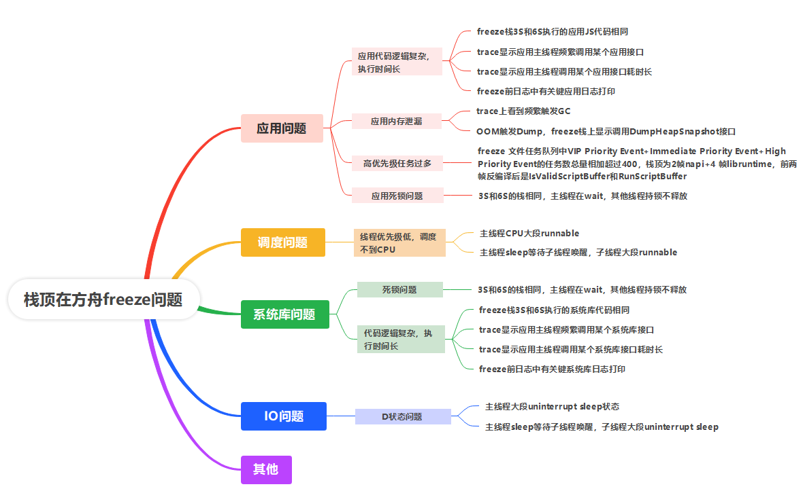

 
总结栈顶在方舟的应用冻屏（AppFreeze）问题根因以及每种问题的典型特征，归纳如下：
 

##### 应用问题
1. 应用代码逻辑复杂，执行时间长导致freeze，问题典型特征如下：
- 除去jsruntime的栈顶后，freeze栈3S和6S执行的应用JS代码相同，则很可能是应用在执行耗时函数导致超时（详见案例一）

2. trace显示应用主线程频繁调用某个应用接口（详见案例二）

3. trace显示应用主线程调用某个应用接口耗时长（详见案例三）

4. freeze前日志中有关键应用日志打印（详见案例四）
- 应用内存泄漏导致频繁GC或触发OOM dump，问题典型特征如下：1. trace上看到频繁触发GC（详见案例五）

2. OOM触发Dump，Freeze栈上显示调用DumpHeapSnapshot接口（详见案例六）
- 高优先级任务太多，问题典型特征如下：1. freeze文件任务队列中VIP Priority Event+Immediate Priority Event+High Priority Event的任务数总量相加超过400（详见案例七）

2. 栈顶为2帧napi+4 帧libruntime，前两帧反编译后是IsValidScriptBuffer和RunScriptBuffer（详见案例七）
- 死锁问题，堆栈显示持锁和wait的都是应用的so库，问题典型特征如下：1. 3S和6S的栈相同

2. 主线程在wait，其他线程持锁不释放

 
 

##### 调度问题

 
因为线程优先级低，调度不到CPU资源，应用进程一直处于runnable状态，最终导致应用冻屏（AppFreeze），问题典型特征如下：
 
- 从trace上看，主线程CPU大段runnable状态（详见案例九）
- 主线程sleep等待子线程唤醒，子线程大段runnable

 

##### 系统库问题

1. 系统库代码逻辑复杂，执行时间长导致freeze，问题典型特征如下：
- 除去jsruntime的栈顶后，freeze栈3S和6S执行的系统库代码相同（详见案例十）

2. trace显示应用主线程频繁调用某个系统库接口

3. trace显示应用主线程调用某个系统库接口耗时长

4. freeze前日志中有关键系统库日志打印
- 死锁问题，堆栈显示持锁和wait的都是系统库so，问题典型特征如下：1. 3S和6S的栈相同

2. 主线程在wait，其他线程持锁不释放（详见案例十一）

 

##### IO问题

 
读写问题导致的D状态问题，典型特征如下：
 
- 主线程大段Uninterruptible sleep状态（详见案例十二）
- 主线程sleep等待子线程唤醒，子线程大段Uninterruptible sleep

 

##### 典型案例分析

 

##### 应用问题案例分析

 
**案例一：3S和6S调用的应用JS代码相同**
 
下面是某应用一个应用冻屏（AppFreeze）问题3S和6S的调用栈，栈顶都是JSStableArray::IndexOfBigInt，这是一个Builtins接口，流程中没有加锁，因此排除死锁的问题。可以看到，除去jsruntime的栈顶，3S和6S执行的应用代码行都是同一行:LeakXXXModel.ts:440:1，怀疑应用有循环调用导致的线程繁忙问题，经确认，根因为对应应用代码中有个很大的for循环执行耗时长，代码优化后得以解决。
 
3S栈：
 

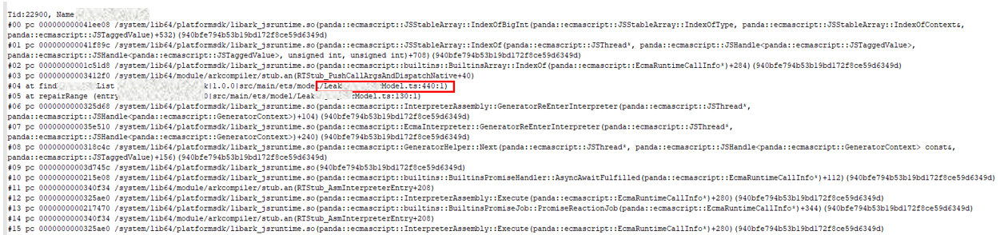
6S栈：
 

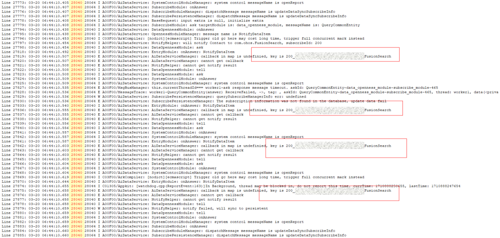

 
解决方案：下面是应用findXXXList接口的伪代码示例，该接口的功能是返回[start,end]区间中缺失消息组成的列表，当indexList很大时，循环遍历查找将非常耗时，可能造成应用appfreeze。伙伴侧的规避方案是设置一个定时器做超时检测，当for循环代码执行超时后则直接跳出循环，避免发生应用冻屏（AppFreeze）。
 
```text
public async findXXXList(indexList, start, end) {
    let needBreak = false;
    setTimeout(() => {
        needBreak = true;
    }, 100); // 定时器
    while (start <= end) {
        // do some thing
        start++;
        if (needBreak) {
            break; // 超时退出
        }
    }
}
```
 
**案例二：应用主线程频繁调用某个应用接口**
 
该案例主线程的trace如下，从trace可以看出，应用在频繁调用某个接口。打开其中一小段发现是在频繁调用反序列化接口，每段反序列化的时间1us以上。反序列化接口在应用跨线程传输数据时调用，如调用Work的PostMessage接口或TaskPool的execute接口。由此可确认，该freeze问题发生的根因是应用频繁跨线程传输数据导致。
 

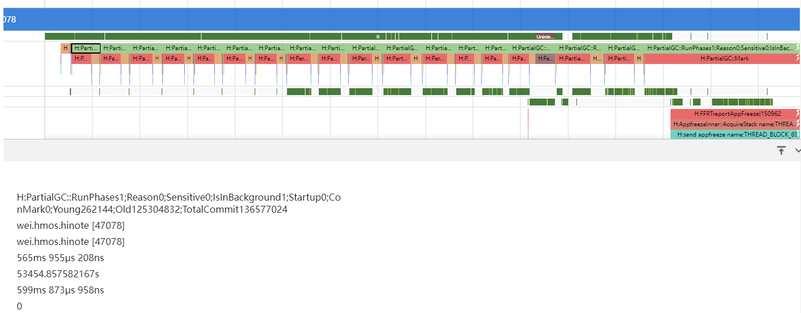

 

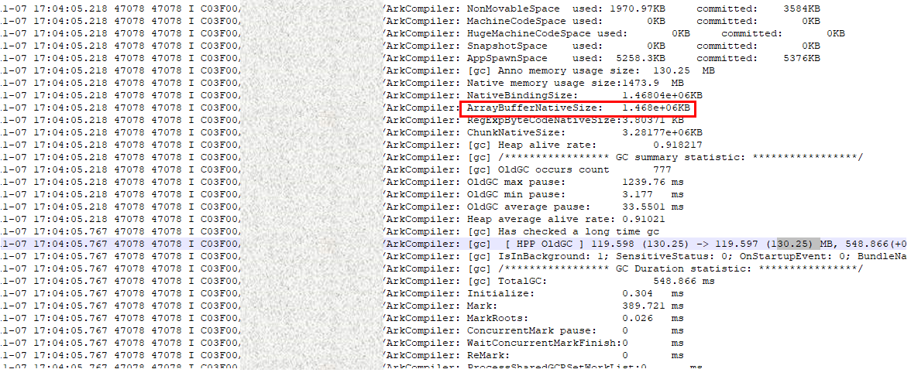

 

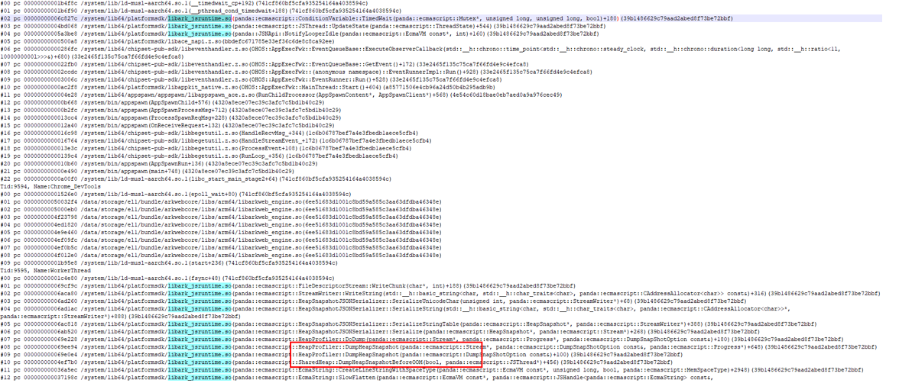

 
解决方案：减少同一时间段频繁跨线程传输数据的操作。
 
**案例三：应用主线程调用某个耗时长接口**
 
该案例应用freeze堆栈栈顶在执行正则操作，从trace中可以看出，主线程一直在执行正则匹配导致超时freeze。
 

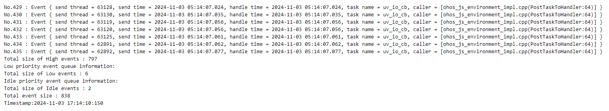

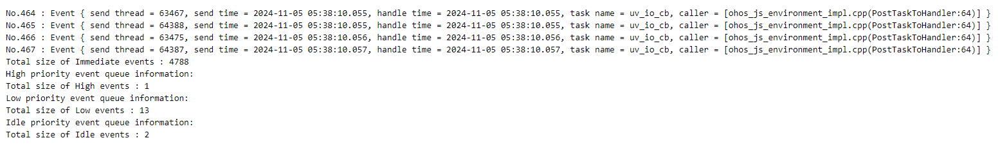
解决方案：
 1. 优化正则匹配的逻辑，避免超长字符串的正则匹配；
2. 将耗时操作放到taskpool线程执行，不阻塞主线程。
 
**案例四：freeze前关键应用日志打印**
 
下面是一个服务类进程的卡死问题，该问题通过freeze栈和trace均无法完成问题定界，最终通过日志才分析出问题根因。
 
结合trace分析：trace中显示的是GC的循环调用，但每次GC在running中的占比并不高，也符合GC调用的规律，因此确认不是GC的问题。可能是未插桩的running状态导致未响应，无法进一步定位问题。
 

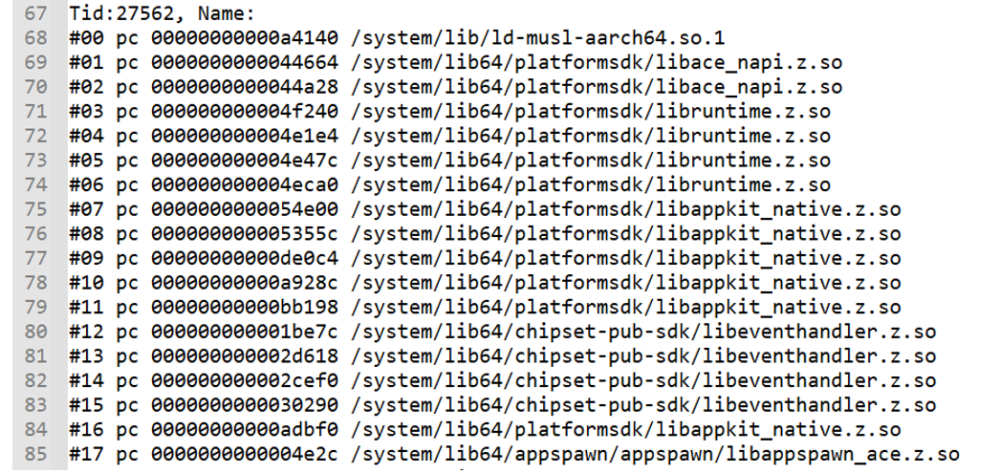

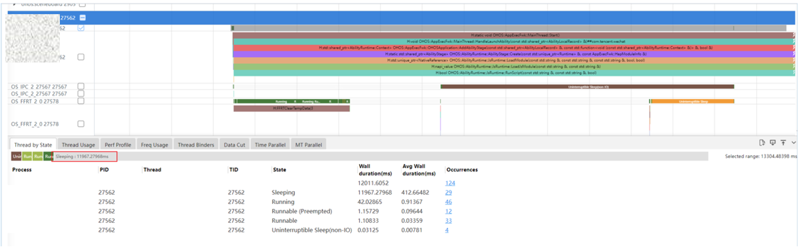

 
此时结合HiLog日志分析，HiLog搜索崩溃线程28040，崩溃时间点在06:44:16，卡了6s。推测大概是在06:44:10附近出现问题。
 
进一步观察HiLog日志发现，应用一直在调用融合搜索FusionSearch，和应用对齐后，确认问题是应用循环调用FusionSearch接口导致。
 

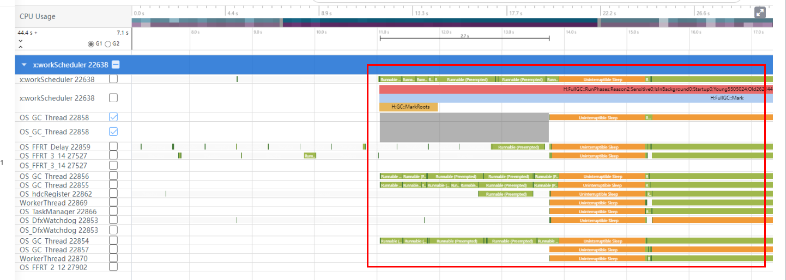
**案例五：应用内存泄漏导致频繁GC**
 
该案例的trace如下，可以看到主线程一直在触发GC，几乎占满了整个线程。在应用内存正常时（远小于应用js内存上限），每次GC后都会根据存活对象大小适当提升GC的阈值，从而防止频繁的GC触发。而当应用发生内存泄漏时，应用占用的js内存可能一直处于OOM的边缘，GC阈值调整的空间则非常有限（GC阈值不能超过js内存上限），可能就会出现频繁GC的现象。
 

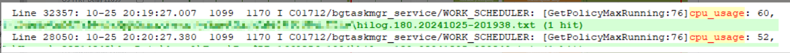
为了进一步验证上述猜想，结合GC日志做进一步分析。从日志可以看出，应用分配的ArrayBuffer内存已经达到1.4G，且GC仍无法释放，再加上NativeBindingSize，总的内存大小已经接近3G。根据虚拟机的GC内存触发策略，当Native内存超过2G后，每次分配都会尝试去触发GC。
 

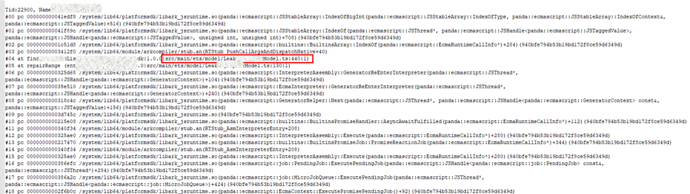
解决方案：通过上面分析，该问题实际就由freeze问题转换成了内存泄漏问题。应用内存泄漏一般可以分为两种：一种是js内存泄漏，另一种是Native内存泄漏。对于js内存泄漏，可以同HeapSnapshot工具生成内存快照，辅助问题定位，参考文档[ArkTS内存泄漏分析：Snapshot分析](https://developer.huawei.com/consumer/cn/doc/harmonyos-guides/ide-insight-session-snapshot)。对于Native内存泄漏，DevEco Profiler提供了基础的内存场景分析Allocation，参考文档[Native内存泄漏分析：Allocation分析](https://developer.huawei.com/consumer/cn/doc/harmonyos-guides/ide-insight-session-allocations)。
 
**案例六：应用内存泄漏触发OOM Dump**
 
该问题的典型freeze栈如下，其中有一个js线程（主线程或taskpool、worker线程）触发了OOM的dump，堆栈显示调用DumpHeapSnapshotBeforeOOM接口。该问题发生的原因是某个js线程的虚拟机内存超过了设定的上限（主线程448MB，worker、taskpool线程768MB），这种一般是应用内存泄漏导致，解决方案同案例五。
 

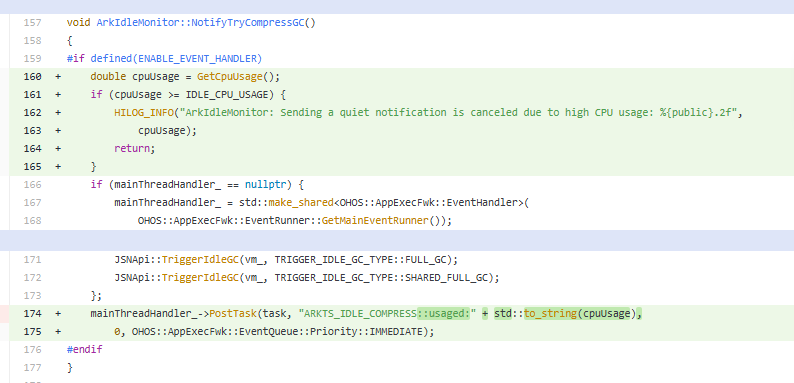
**案例七：高优先级任务过多**
 
原理：
 
在每个freeze文件中都会有任务队列的dump信息；高级别优先级别的任务会抢占低级别优先级任务的队列资源，以保证高优先级任务能够尽早被执行；
 
THREAD_BLOCK_6S的检测机制为watchdog向主线程队列中每隔3s抛一个watchdog的任务（Timer），这些任务必须要在被抛出的3s内被主线程执行到；
 
因为watchdog的任务是高优先级任务（High Priority Event），所以如果任务队列中VIP Priority Event + Immediate Priority Event + High Priority Event的任务总量过多，就会容易发生watchdog定时任务无法及时被执行，从而导致出现appfreeze；
 
特征：
 
一般来说，这三者的任务数总量相加超过400，应用就有发生freeze的风险，需要应用侧进行整改，减少高优先级任务数量
 

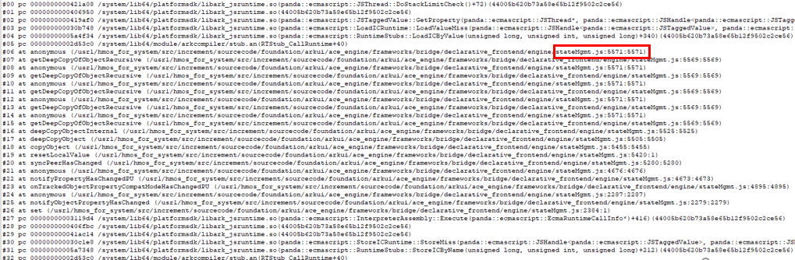
High Priority Event的数量过多
 

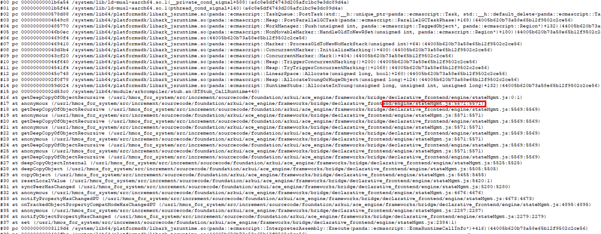
Immediate Priority Event的数量过多。
 
**案例八：加密应用**
 
原理：主线程等解密的秘钥一直等不到，导致长时间sleep后卡死。
 
特征：这类问题只通过栈就可以确定，00 帧到 20 帧基本完全一致，01、02 帧反编译后是IsValidScriptBuffer和RunScriptBuffer
 
解决方案：一般由加密应用hdc install安装方式引起，从应用市场重新安装即可解决
 

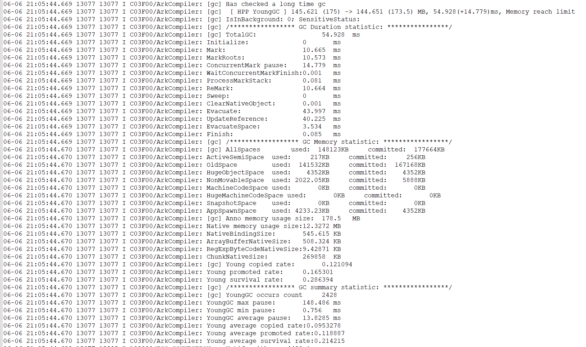

 

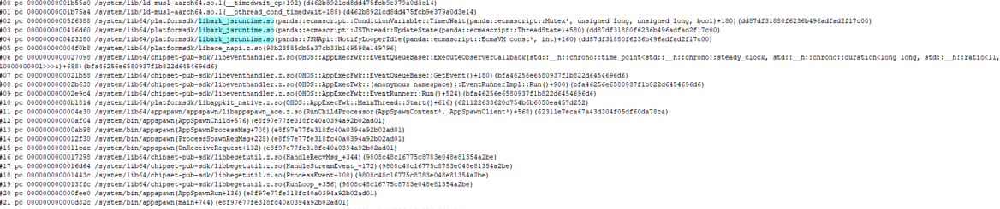
后续观察kernel stack，发现代码逻辑进入内核的代码，且等锁。
 

##### 调度问题案例分析

 
**案例九：整机CPU负载高导致后台应用GC线程调度不到资源**
 
调度问题的典型特征是trace中freeze前有大段的runnable状态。下图是hiviewx应用appfreeze问题的trace，从trace中可以看出，问题发生前应用的所有线程都处于调度不到的状态，而此时主线程正好在触发方舟虚拟机的GC，因此freeze栈顶会挂在方舟的GC里。
 

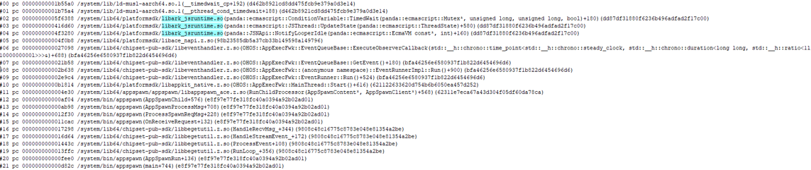
进一步分析日志，发现此时整机CPU负载达到60%以上，而hiviewx为后台应用，且GC线程本身优先级较低，在高负载场景下，无法调度到CPU资源，导致执行超时。
 

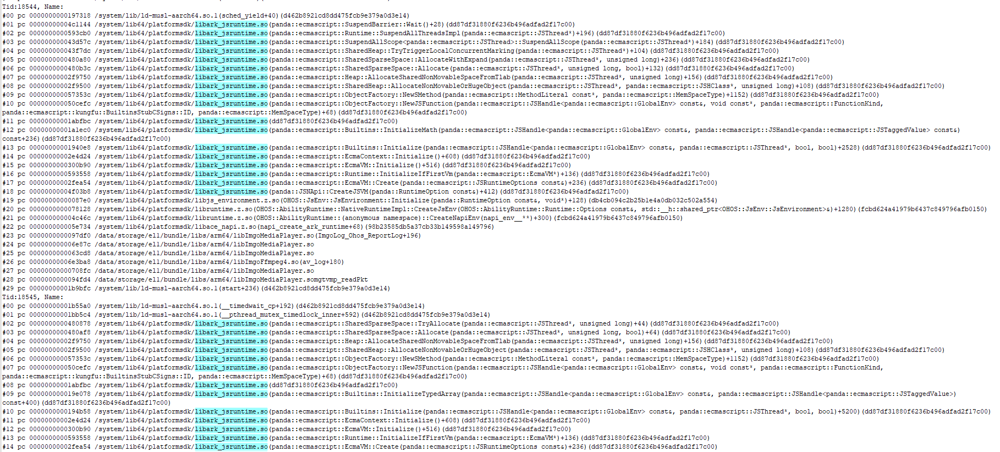

 
解决方案：该问题GC触发的原因是虚拟机判断进程处于空闲场景触发的IdleGC，对于CPU高负载场景，可以选择不触发IdleGC。判定空闲场景通知做GC任务前，先获取当前的cpu使用率，高于50%的cpu使用率就放弃当次任务通知。
 

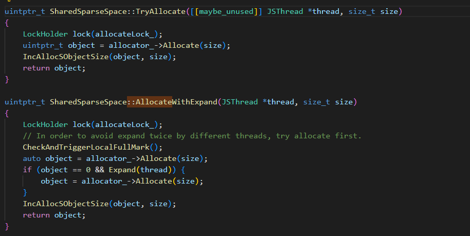

 

##### 系统库问题案例分析

 
**案例十：除去jsruntime的栈顶后，freeze栈3S和6S执行的系统库代码相同**
 
问题背景：
 
Beta用户使用网页在线表格编辑突然卡死，表格点击没反应。
 
定位过程：
 
根据问题单发现，beta用户只提供了AppFreeze和HiLog，没有日志，最好的分析方法是看trace，但崩溃点trace缺失，只能结合AppFreeze和HiLog分析。
 
3S栈：
 

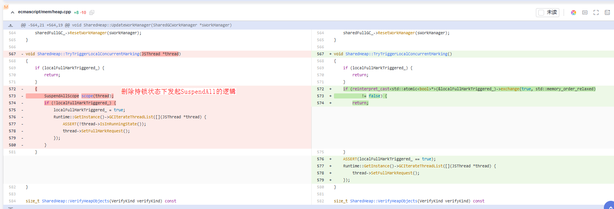

 
6S栈：
 

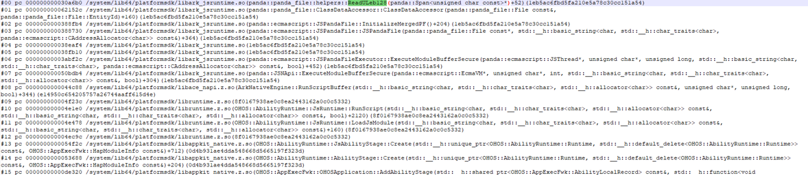
从3s和6s栈可以看出，栈顶都是在libark_jsruntime.so但栈顶不同。由于无法提供trace，只能根据堆栈和日志分析。
 
通过继续查看堆栈可以发现libark_jsruntime.so下面的调用栈3S和6S是相同的，然后跳过libark_jsruntime.so，发现下面在调arkui的深拷贝(getDeepCopyOfObjectRecursive);
 
然后再看对应时间点得日志，可以看到在appfreeze之前的一段时间一直在做GC操作，这说明是应用一直在执行JS逻辑，再结合崩溃栈看，应用是在做一个很大的对象的深拷贝，导致耗时产生了appfreeze。
 

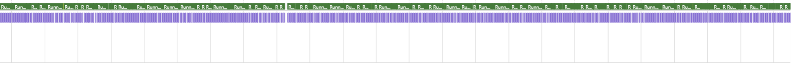

 
解决方案：用@prop修饰子组件时，当父组件刷新时子组件对象会进行深拷贝，当子组件很复杂时可能导致拷贝超时，应用排查后改用@ObjectLink修饰，避免深拷贝的开销。
 
**案例十一：系统库死锁导致freeze冻屏**
 
问题背景：
 
华为视频应用发生freeze，3S和6S栈显示主线程一直在wait。
 
3S栈
 

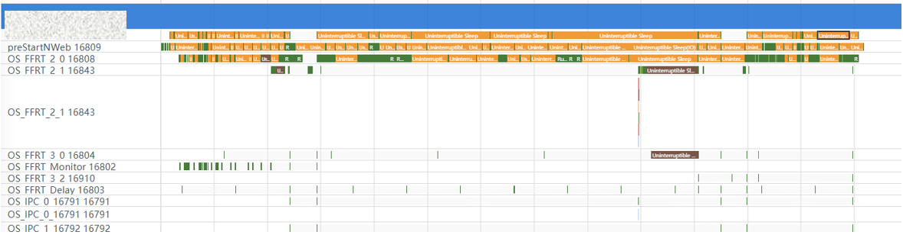
6S栈
 

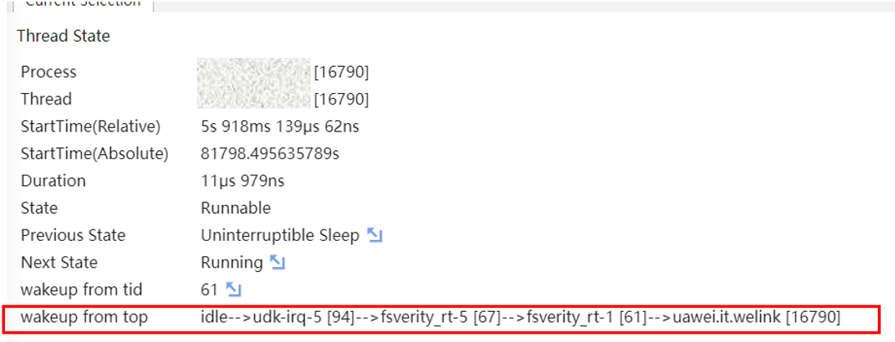
定位过程：
 
主线程3S和6S栈相同且一直显示在wait，这种问题一般发生在主线程需要等待其他线程唤醒，而其他线程发生死锁，导致主线程一直wait不到，最终产生冻屏。因此，首先需要确认主线程在等什么线程唤醒，然后再去看对应线程是否存在死锁问题。对于该问题场景，主线程是在UpdateState，说明有其他线程发起了SuspendAll任务去触发SharedGC，而SharedGC又需要等所有线程都走到Suspend状态，初步怀疑是有其他work/taskpool线程发生死锁，导致无法走到Suspend状态。查看堆栈中其他线程的状态，发现18544线程持锁发起了SuspendAll(AllocateWithExpand接口中持有了allocateLock_)，而18545线程调用TryAllocate接口又会等allocateLock_锁，从而导致死锁。
 1. 观察冻屏栈，锁定问题方向

  首先查看3秒和6秒的冻屏堆栈，发现两者完全相同，且主线程状态均为 wait。这种现象一般是主线程因等待某个资源（如锁、信号等）而被阻塞，并非因执行耗时任务而繁忙，问题方向指向线程死锁。
2. 步骤分析主线程等待的根源

  分析栈顶信息，发现主线程正在执行 UpdateState，这通常与方舟运行时的垃圾回收（GC）机制相关。主线程的 wait状态很可能是由于有其他线程发起了 SuspendAll任务（旨在暂停所有线程以进行垃圾回收），而主线程作为被暂停者，需要等待该 SuspendAll任务完成才能被唤醒。
3. 排查“SuspendAll”任务卡住的原因

  SuspendAll任务需要等待所有线程都进入Suspend状态。若有线程无法挂起，则会导致死锁。检查冻屏文件中记录的所有其他线程状态。发现：线程 18544的堆栈显示，它在 AllocateWithExpand函数中持有了锁 allocateLock_ 的情况下，发起了 SuspendAll请求。

  线程 18545的堆栈显示，它正在 TryAllocate函数中尝试获取 allocateLock_锁，因此处于等待状态。
 
死锁链条形成：
 
线程18544持有着锁allocateLock_，同时它要等待所有线程（包括18545）挂起，SuspendAll任务才能完成。但线程18545需要先获得锁allocateLock_才能继续执行并进入可挂起状态。这就导致了循环等待：18544等18545挂起，18545等18544释放锁。典型的死锁场景。
 

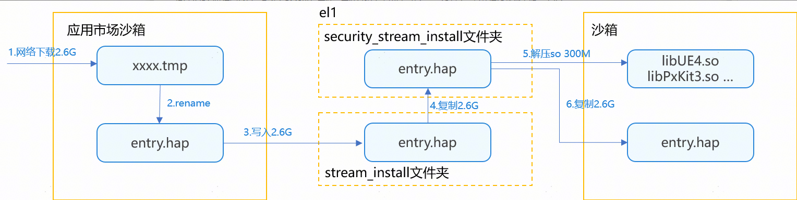


 
解决方案：开发者在写多线程代码时，一定要管理好锁的状态，防止不同线程间发生死锁。对于上述案例，修改方案是不要在持锁状态下发起SuspendAll，修改如下：
 

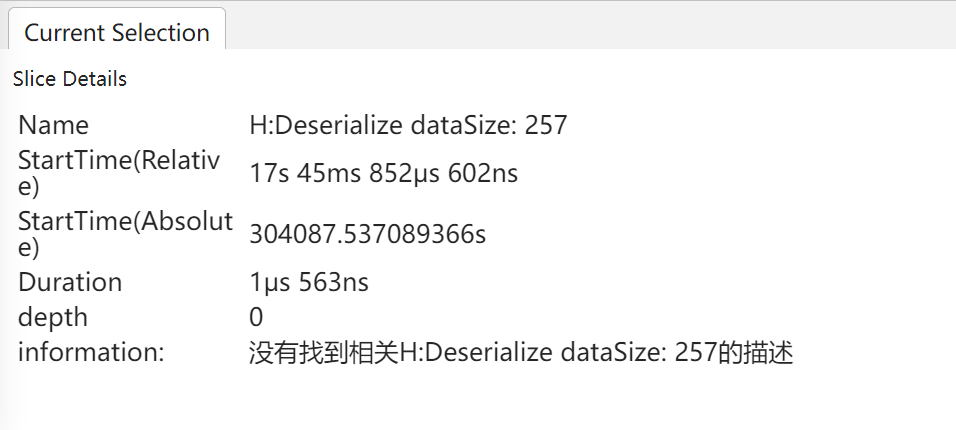

 

##### IO问题案例分析

 
**案例十二：读写交替场景频繁写入影响读的性能**
 
问题背景：应用启动时发生freeze卡死，瞬时栈:
 

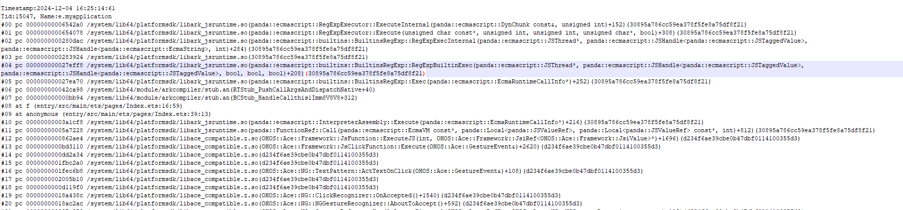
定位过程：
 
瞬时栈相关调用为vm加载abc接口。
 
通过trace信息看到主线程主要耗时在IO操作：
 

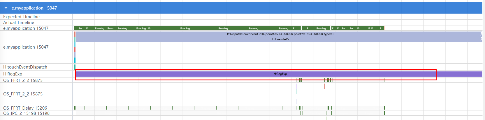

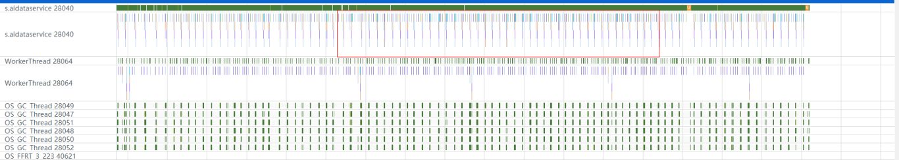

 
分析方法
 
IO行为判断不要完全通过trace上的显示io/non-io，要通过唤醒关系来判断，如果Uninterruptible sleep的后面一个runnable，trace上显示是udk-irq线程唤醒，则是IO行为。trace上显示fsverity、fsignature、hmfs_txn，都会与IO行为相关，只是在IO行为上叠加了校验等行为，IO行为分析方向：
 
当前版本已经切换较多文件系统，涉及到IO的线程可能比之前更多，但是唤醒关系上最终都会收敛到udk-irq线程
 
- erofs_unzipd - 只读文件系统，IO磁盘读取解压线程
- fsverity_rt/fsignature_rt - 首次IO磁盘读文件校验权限
- hmfs_txn - data目录hmfs IO相关

 
可以看出问题场景IO整体性能差，写入量较大，导致器件频繁gc，降低了器件的IO带宽。同时是读写交替的场景，写入会影响读取的性能，导致部分读IO性能下降。
 
经过分析问题读写场景，后台有BMS进行安装，安装过程中需拷贝三次hap，IO量大，导致读IO性能下降，产生freeze。
 
解决方案：在原本的应用安装流程中，会经历三次hap包的拷贝，导致IO写入量很大，包管理子系统最终的优化方案是优化最后一次hap包拷贝的耗时，将copy改为rename。
 

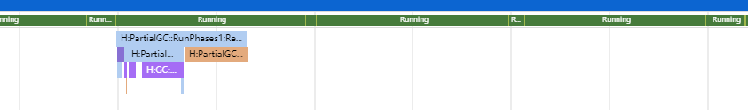

 
安装流程
 1. 应用市场线程从网络下载应用hap包，先保存在tmp文件中，共2.6G。
2. 下载完毕后将tmp文件rename为entry.hap，此步无IO。
3. 应用市场线程调用BMS的StreamInstall接口，将hap包写入el1的stream_install文件夹中（正常从应用市场目录拷贝到bms的目录），共2.6G。
4. foundation的BMS线程将hap从stream_install复制到security_stream_install中（因为安全问题，步骤3的fd返回给应用市场客户端会有被篡改的风险，额外拷贝一次安全目录），共2.6G。
5. installs线程从hap包中解压名种so文件，共300M。
6. installs线程从security_stream_install文件夹将entry.hap复制到应用沙箱中，共2.6G。
7. 安装完成后先后删除el1两文件夹中的hap、应用市场沙箱中的hap。
 

##### 小结

 
对于Freeze冻屏问题，需要结合freeze栈、trace、log三方面信息进行准备定位定界。需要提取出典型问题特征，根据这些特征初步定位是应用自身问题、系统库问题、调度问题还是IO问题，再进一步判断是代码逻辑复杂、接口调用频繁还是死锁等问题，最后针对问题根因确认解决方案。
