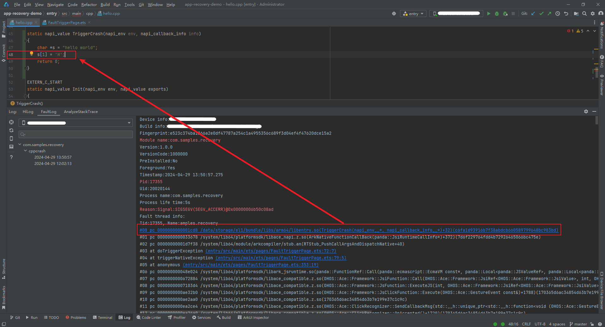
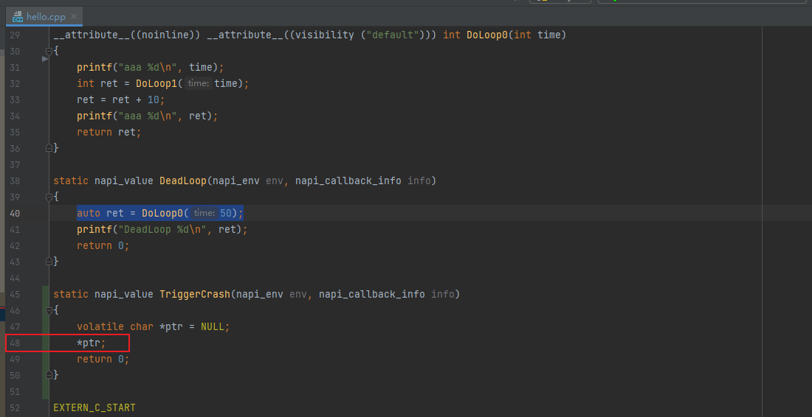

# CppCrash类问题分析方法

更新时间：2026-03-12 08:45:02

来源：https://developer.huawei.com/consumer/cn/doc/best-practices/bpta-stability-app-crash-cpp-way

本文分为获取日志、分析步骤、CppCrash常见问题分类与原因三个小节，重点介绍如何获取CppCrash日志、如何查看日志以及如何分析问题。开发者可阅读应用崩溃类问题检测方法了解系统检测CppCrash问题的原理和机制。开发者还可以参考CppCrash类问题案例，结合实际案例分析CppCrash类问题。


## 获取日志


进程崩溃日志是故障日志中的一种，可通过以下方式获取：

- **方式一：通过DevEco Studio获取日志**DevEco Studio会收集设备/data/log/faultlog/faultlogger/路径下的进程崩溃故障日志到FaultLog下，根据进程名和故障和时间分类显示。获取日志的方法参见[DevEco Studio FaultLog使用指南](https://developer.huawei.com/consumer/cn/doc/harmonyos-guides/ide-fault-log)。


- **方式二：通过hiAppEvent接口订阅**HiAppEvent给开发者提供了故障订阅接口，详见[HiAppEvent介绍](https://developer.huawei.com/consumer/cn/doc/harmonyos-guides/hiappevent-intro)。参考[订阅崩溃事件（ArkTS）](https://developer.huawei.com/consumer/cn/doc/harmonyos-guides/hiappevent-watcher-crash-events-arkts)或[订阅崩溃事件（C/C++）](https://developer.huawei.com/consumer/cn/doc/harmonyos-guides/hiappevent-watcher-crash-events-ndk)完成崩溃事件订阅，并通过事件的[external_log](https://developer.huawei.com/consumer/cn/doc/harmonyos-guides/hiappevent-watcher-crash-events#事件字段说明)字段获取崩溃日志。


- **方式三：通过hdc获取日志，需打开开发者选项**在开发者选项打开的情况下，开发者可以通过hdc file recv /data/log/faultlog/faultlogger D:\命令导出故障日志到本地，故障日志文件名格式为cppcrash-进程名-进程UID-毫秒级时间.log。


## 分析步骤


### 步骤一：基于信号值确定崩溃类型


本节只介绍常见信号值对应的崩溃类型，其他信号请参见系统处理的崩溃信号。

```text
Reason:Signal:SIGSEGV(SI_TKILL)@0x000027e0 from:10208:0
字段解释如下：
Reason:Signal:信号值(tkill()函数信号)@崩溃地址 from:发送信号的Pid:发送信号的Uid
```

常见的崩溃：

- SIGSEGV、SIGILL以及SIGBUS，需要结合Register寄存器进行分析，案例分析参考[内存访问类崩溃问题](https://developer.huawei.com/consumer/cn/doc/best-practices/bpta-scenario-stability-cppcrash#section3692438732)。
- SIGABRT进程主动中止，查看调用栈中调用abort的代码，案例分析参考[SIGABRT类崩溃问题](https://developer.huawei.com/consumer/cn/doc/best-practices/bpta-scenario-stability-cppcrash#section134911495417)。


### 步骤二：查看崩溃日志


CppCrash日志中Signal会携带崩溃时访问的地址，如非法访问地址会触发SIGSEGV、访问合法地址但地址指向的不是代码段会触发SIGILL，上例中崩溃时正在访问000027e0。


### 步骤三：查看寄存器和栈地址范围


```text
Registers:  <- 故障现场寄存器
r0:00000000 r1:ffc09854 r2:00000000 r3:00000008
r4:00000000 r5:fffff000 r6:0000000a r7:000000af
r8:ffc09919 r9:ffc09930 r10:00000000
fp:ffc098e8 ip:005b76e4 sp:ffbe8daa lr:005ade99 pc:f7bb0400
cpsr:20870010  <- 状态寄存器（arm32架构为cpsr，aarch64架构为pstate和esr）
...
Maps:
...
ffbe9000-ffc0a000 rw-p 00000000 [stack] <- 栈地址范围，sp小于栈的低地址ffbe9000
```

检查堆栈指针寄存器（sp）保存的地址，如果超出栈地址范围或接近栈的低地址，考虑可能发生了栈溢出。目前对于大多数栈溢出问题，CppCrash日志里也会给出提示，开发者也可将此作为参考，详见栈溢出故障场景日志规格。


### 步骤四：基于崩溃栈定位行号


1. DevEco Studio开发调试环境下，支持调用栈直接跳转到对应行号。在应用开发场景，对于应用自身的动态库，生成的cppcrash调用栈可直接跳转到代码行处，支持Native栈帧和JS栈帧，无需开发者自行进行解行号操作。对于部分未能解析跳转到对应行号的栈帧，可参考方式二解析。

2. 通过SDK llvm-addr2line 工具定位行号。获取符号表。获取崩溃栈中so文件对应的带符号版本，保证与应用/系统内运行时的so文件版本一致。 对于应用自身的动态库，经DevEco编译构建，生成在工程的/build/default/intermediates/libs目录下，默认是带符号的版本。可通过Linux file命令查询二进制文件的BuildID以核对是否匹配。其中，BuildID是用于标识二进制文件的唯一标识符，通常由编译器在编译时生成，not stripped表示该动态库是包含符号表的。
```text
$ file libbabel.so
libbabel.so: ELF 64-bit LSB shared object, ARM aarch64, version 1 (SYSV), dynamically linked, BuildID[sha1]=fdb1b5432b9ea4e2a3d29780c3abf30e2a22da9d, with debug_info, not stripped
```
 上述fdb1b5432b9ea4e2a3d29780c3abf30e2a22da9d即为libbabel.so的BuildID，对比cppcrash日志中打印的二进制BuildID是否相同。
```text
#00     pc 000072e6       /system/lib/libbabel.so(xxxxxxx(void*)+30)(fdb1b5432b9ea4e2a3d29780c3abf30e2a22da9d)
#序号   pc pc在段内的偏移   pc属于的段名称(函数名+函数内偏移的字节数)(BuildID)
```
 **pc（Program Counter）**：程序计数器表示程序执行指令的地址。 对比可知，有符号的libbabel.so是与版本相匹配的so，必须匹配才能继续下面的分析流程，否则会误导开发者。
3. 通过 llvm-addr2line 工具定位行号。llvm-addr2line工具归档在DevEco Studio安装目录/DevEco Studio/sdk/default/openharmony/native/llvm/bin下。 例如有核心调用栈如下：
```text
# 00 pc 00003510 /data/storage/el1/bundle/libs/arm/libentry.so(TriggerCrash(napi_env__*, napi_callback_info__*)+24)(446ff75d3f6a518172cc52e8f8055650b02b0e54)
# 01 pc 0002b0c5 /system/lib/platformsdk/libace_napi.z.so(panda::JSValueRef ArkNativeFunctionCallBack<true>(panda::JsiRuntimeCallInfo*)+448)(a84fbb767fd826946623779c608395bf)
# 02 pc 001e7597 /system/lib/platformsdk/libark_jsruntime.so(panda::ecmascript::EcmaInterpreter::RunInternal(panda::ecmascript::JSThread*, unsigned char const*, unsigned long long*)+14710)(106c552f6ce4420b9feac95e8b21b792)
# 03 pc 001e0439 /system/lib/platformsdk/libark_jsruntime.so(panda::ecmascript::EcmaInterpreter::Execute(panda::ecmascript::EcmaRuntimeCallInfo*)+984)(106c552f6ce4420b9feac95e8b21b792)
...
# 39 pc 00072998 /system/lib/ld-musl-arm.so.1(libc_start_main_stage2+56)(5b1e036c4f1369ecfdbb7a96aec31155)
# 40 pc 00005b48 /system/bin/appspawn(_start_c+84)(cb0631260fa74df0bc9b0323e30ca03d)
# 41 pc 00005aec /system/bin/appspawn(cb0631260fa74df0bc9b0323e30ca03d)
```
 基于SDK llvm-addr2line解析行号如下所示：
```text
[DevEco Studio安装目录]\DevEco Studio\sdk\default\openharmony\native\llvm\bin> .\llvm-addr2line.exe -Cfie libentry.so 3150
TriggerCrash(napi_env__*, napi_callback_info__*)
D:/code/apprecovery-demo/entry/src/main/cpp/hello.cpp:48
```
 llvm-addr2line 逐行解析的命令为：llvm-addr2line.exe -fCpie libutils.z.so pc在段内的偏移，可以多个偏移一起解析：llvm-addr2line.exe -fCpie libxxx.so 0x1bc868 0x1be28c。使用llvm-addr2line后，如果得出的行号结合源码分析不正确，可以考虑对地址进行微调（如减1），或者考虑关闭一些编译优化。

 通过DevEco Studio hstack工具解析调用栈信息。
hstack是DevEco Studio为开发人员提供的用于将release应用混淆后的crash调用栈还原为源码对应调用栈的工具，支持Windows、Mac、Linux三个平台。使用说明请参考堆栈解析工具（hstack）。


### 步骤五：结合业务检视代码


在分析CppCrash日志内容和定位行号后，回到代码中检视上下文，分析具体是什么业务逻辑导致崩溃。借助hilog提供的崩溃现场日志分析业务场景，找出代码中的可疑点。如下图所示，hello.cpp中的48行是一个空指针解引用的代码问题。





本场景是一个故障构造的应用，实际场景需要结合具体业务进行分析。


### 步骤六：反汇编（可选）


如果开发人员对自己的业务流程非常熟悉并且要解决的是一个crash在出错代码附近的简单问题，结合业务代码分析能够定位清楚问题。但在一些较为复杂的场景，如定位到某一行里面调用的方法有多个参数等，只看代码无法直接得出分析结论，则需要借助反编译来进一步分析，问题分析请参见案例通过反汇编分析CppCrash问题。


### 步骤七：分析地址越界问题（可选）


地址越界问题通常会产生随机的崩溃调用栈，进程崩溃时已非问题发生的第一现场，仅根据崩溃调用栈很难分析到问题根因。因此需要借助HWASan等检测工具辅助分析，具体分析方法请参见地址越界类问题分析方法。


### 步骤八：验证问题是否修复


根据已有分析结论尝试修复问题后，部署测试环境模拟问题发生时的场景，按照问题出现概率评估压测时长，如果压测时长内问题未复现说明问题已经修复，如果压测时长内问题复现则需要继续排查其他可疑点，直到压测时长内问题不再复现才能认为问题被修复。


## CppCrash常见问题分类与原因


- 空指针解引用 NULL pointer dereference形如 SIGSEGV(SEGV_MAPERR)@0x00000000 或 cppcrash日志的Register中打印的r0，r1 等传参寄存器的值为0时，应首先考虑调用时是否传入了空指针。
- 形如 SIGSEGV(SEGV_MAPERR)@0x0000000c 或 cppcrash日志Register中打印的r1 等传参寄存器的值为一个很小的值时应考虑调用入参的结构体成员是否包含空指针。

 程序主动终止SIGABRT 一般为用户/框架/C库主动触发，大部分场景下跳过C库/abort发起的框架库的第一帧即为崩溃原因，这里主要检测的是资源使用类的问题，如线程创建，文件描述符使用，接口调用时序等。SIGSEGV无效内存访问
- 多线程操作集合，std库的集合为非线程安全，如果多线程添加删除，容易出现SIGSEGV类崩溃，如果使用 llvm-addr2line 后的代码行与集合相关，可以考虑这个原因。
- 不匹配的对象生命周期，比如使用裸指针（不含有封装、自动内存管理等特性的指针）保存sptr类型以及shared_ptr类型，会导致内存泄漏和悬空指针问题。它只是一个指向内存地址的简单指针，没有对指针指向的内存进行保护或管理。裸指针可以直接访问指向的内存，但也容易出现内存泄漏、空指针引用等问题。因此，在使用裸指针时需要特别小心，避免出现潜在的安全问题；推荐使用智能指针来管理内存。

 use after free：指使用已经被释放的内存，比如函数返回局部变量的引用、指针释放后未置空并继续使用等。
```cpp
#include <iostream>

int &getStackReference() {
  int x = 5;
  return x; // Return the reference of x
}


int Run1() {
  int &ref = getStackReference(); // Obtain the reference of x
  // x is released after the getStackReference function returns
  // ref is now a dangling reference. Continuing to access it will result in undefined behavior
  std::cout << ref << std::endl; // Attempting to output the value of x is an undefined behavior
  return 0;
}
```
 栈溢出：如递归调用，析构函数相互调用，特殊的栈（信号栈）中使用大块栈内存。
```text
#include <iostream>

class RecursiveClass {
public:
RecursiveClass() {
std::cout << "Constructing RecursiveClass" << std::endl;
}


~RecursiveClass() {
std::cout << "Destructing RecursiveClass" << std::endl;
// Make recursive calls in the destructor
RecursiveClass obj;
}
};


int Run2() {
RecursiveClass obj;
return 0;
}
```

创建一个RecursiveClass对象时，它的构造函数被调用。销毁这个对象时，它的析构函数被调用。在析构函数中，创建了一个新的RecursiveClass对象，这会导致递归调用，直到栈溢出。递归调用导致了无限的函数调用，最终导致栈空间耗尽，程序崩溃。
 二进制不匹配：通常由ABI（应用程序二进制接口）不匹配引起，如编译的二进制与实际运行的二进制接口存在差异，数据结构定义存在差异，这种一般会产生随机的崩溃栈。地址越界：使用有效的野指针，并修改了其中的内存为非法值，访问越界，覆盖了正常的数据这种一般会产生随机的崩溃栈。SIGBUS (BUS_ADRALN)：考虑对指针进行强转之后地址是否已经处于非对齐状态。
