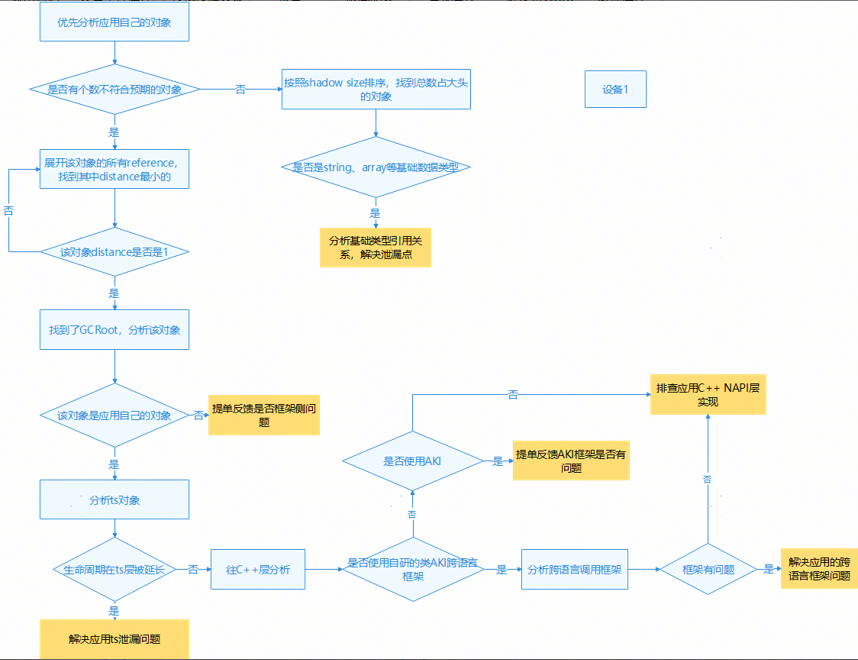
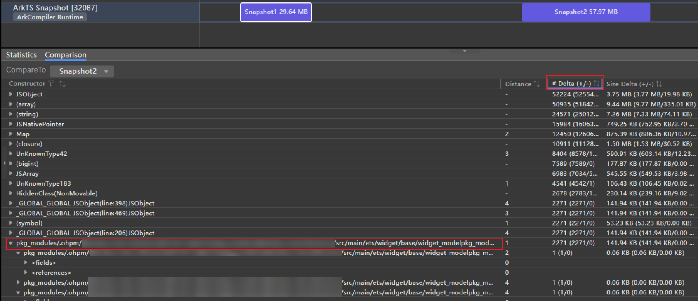
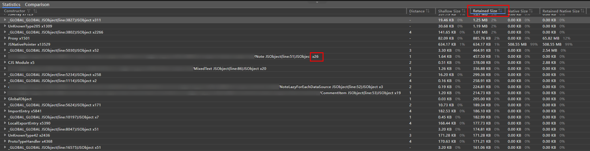
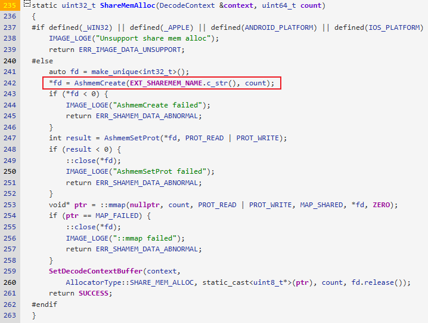

# 资源泄漏类问题分析方法

更新时间：2026-05-18 00:55:31

来源：https://developer.huawei.com/consumer/cn/doc/best-practices/bpta-stability-leak-way

#### 概述
资源泄漏产生的原因是程序未正确释放已分配的资源（如内存、文件句柄等），导致资源被持续占用无法再利用。本章节会详细介绍资源泄漏问题的相关分析方法。


资源泄漏日志获取方法与日志规格详见[Resource Leak（资源泄漏）检测](https://developer.huawei.com/consumer/cn/doc/harmonyos-guides/resource-leak-guidelines)。

#### 内存泄漏分析方法
#### JS泄漏
应用侧声明的class、struct、enum，以及通过new创建的实例对象、build中声明的组件、lambda表达式创建的匿名函数，对应在ArkTS虚拟机中都会创建对应的内存对象，虚拟机会自动在函数对象中引用依赖上下文的闭包环境，从而产生隐式的一些引用关系，比较容易产生内存泄漏。
整体分析策略：


**开发态-JS泄漏分析方法（适用于开发过程中特定场景下调优）**
使用DevEco Studio Snapshot能力可抓取两次heapdump，请参考[使用Snapshot模板基本操作](https://developer.huawei.com/consumer/cn/doc/harmonyos-guides/ide-snapshot-basic-operations)，通过比较两次heapdump的对象delta进行分析：
Summary功能可以用来查看全量内存信息，Comparison可以用来进行两份内存快照对比。
如下：
1. 在profiler模块，在操作前后采集两次snapshot看一下delta（按照delta排序）；
2. 找到和业务相关的对象；
3. 展开业务代码根节点，通过Distance观察引用路径，值越小表示离GC Root的距离越近，展开节点依次找到最小的值，看一下这些业务对象个数是否符合当前这个页面的预期，是否存在循环引用或者闭包问题导致泄漏。 找到应用自己的包名的对象。 查看reference分组的每个对象。 展开这个对象，找到对象的成员，看每个成员的distance，找到其中最小的。 重复b和c步骤，直到找到distance为1的为止，这个就是GC Root根节点。



具体操作方法可见[JS内存泄漏问题检测方法](https://developer.huawei.com/consumer/cn/doc/best-practices/bpta-stability-js-memleak-detection)。
**运维态-JS泄漏分析方法【适用于运维态自动采集获取日志】**
如果自动上报的只有1份heapdump，需要根据实际应用逻辑，按照Retained Size排序，看是否当前对象个数超过业务逻辑预期（比如X1000、X10000个对象的，明显是存在异常的），如果超过就根据该对象的引用关系查找泄漏点；
如下图，存在26个Note JSObject对象，与实际业务不符合，需要进一步查其引用关系判断是否泄漏：


除以上方法外，JS泄漏分析方法还可参考
。


每次抓snapshot会触发1次GC，snapshot文件中展示的对象都是经过GC后因GC根可达无法释放的对象。

#### Native泄漏
**开发态-native内存泄漏分析方法**
对于开发过程中遇到的泄漏问题，开发者可以参考[分析native内存](https://developer.huawei.com/consumer/cn/doc/best-practices/bpta-native-memory-analysis)抓取维测并分析占用最大的内存块及其调用栈排查泄漏点。
**运维态-native内存泄漏分析方法**
1. 分析sample日志 开发者可以通过分析采样日志[memleak-native-[process_name]-[pid]-sample.txt]，观察进程内存增长趋势，来确认内存泄漏情况。 如：某应用 PSS泄漏，根据TotalMem列可以看到进程内存一直持续增长，峰值内存TopPssMemory为3GB左右，观察Realtime一列带*的那一行为将共享内存去重后的进程pss内存使用情况：
2. 分析smaps日志 native泄漏有多种泄漏类型，具体可根据表格定位分析是哪一块泄漏，其中总PSS内存即sample文件的采样内存（可用最后一个）。 泄漏类型  判定方法  定位方法 虚拟机对象泄漏  搜索关键字“ArkTS”，PSS和SWAP PSS列的值加起来，如果超过总PSS内存的50%，则说明是虚拟机对象内存过大。  同JS泄漏定位方法。 堆内存泄漏  搜索关键字“jemalloc”，PSS和SWAP PSS列的值加起来，如果超过总PSS内存的50%，则说明是堆内存过大。  基于NMD和profiler分析。 堆内存泄漏有两种可能： 1、调用ArkUI的接口或者开发者的so，直接malloc申请的堆内存过大。 2、虚拟机对象持有堆内存引用，对象泄漏导致native内存过大。 ashmem泄漏  搜索关键字“/dev/ashmem”，如果超过总PSS内存的50%，则说明是ashmem内存过大。  同ashmem泄漏方法。 1、开发者使用image组件、pixmap组件可能未释放。 2、开发者直接通过系统调用申请。 anon类型较大  单个anon类型占用内存较大。  怀疑mmap内存未释放，直接排查profiler栈，框选All Anonymous VM，筛选Created & Existing，排查内存占用最多的部分。 对于堆内存泄漏，开发者可以基于NMD（堆内存快照，判定泄漏时，堆内存布局的快照）和profiler分析： “LOGGER_MEMCHECK_SAMPLE_NMD_INFO”与“LOGGER_MEMCHECK_DETIAL_INFO”中记录抓取进程native日志时内存的快照信息，主要关注其size和allocated两列，是否有比较突出的内存占用，日志格式如下。  如果有，假设size为a（如128），就去调用栈中查找size为a的内存申请，重点分析这行调用栈，极可能是泄漏点。 如果单次抓取的NMD信息无法确定具体的size，那么可以通过比较两次LOGGER_MEMCHECK_SAMPLE_NMD_INFO来判断5分钟内增长最大的size。 Size：用户申请的内存经过对齐后的大小，jemalloc对齐size的分割是按照一个特定算法算的，8字节是最小单位，从第二个size开始，最小step是16，一个size到它的两倍size之间有4个分档。用户态传入的申请大小会向下对齐到离它最近的size中。 Allocated：size申请的总内存。
3. 分析profiler日志 除了通过smaps日志对内存占用进行初步分析，开发者还可以通过对profiler进行解析来对泄漏问题作进一步分析，日志解析主要有以下两种方法  开发者可以将获取到的profiler文件导入DevEco Studio Profiler插件中进行分析，导入后会在界面展示进程的内存分配情况及其调用栈。按照如下步骤将解析结果展开，通过将Bytes/Count的结果与通过smaps日志分析出的size进行匹配，来排查可疑的泄漏点，并通过调用栈进一步确认泄漏位置。 本地搭建Smartperf环境，并导入profiler日志进行解析，框选All Heap，解析profiler，选择Created & Existing，在搜索框中搜索通过NMD信息拿到初步怀疑内存块并通过调用栈确认泄漏点。 假设NMD信息中，12582912字节的内存块内存占比最大，则搜索并排查该堆栈中对应12582912字节对应的调用栈如下：

#### ashmem泄漏
图片共享内存一般有以下几种命名方式：

```ts
/dev/ashmem/PixelMap RawData, uniqueId: xxxx_xx
/dev/ashmem/JPEG RawData, uniqueId: xxx_xxx
/dev/ashmem/EXTRawData
```

这些内存都是由图片编解码框架提供的编解码工具申请的，申请代码如下：


解码框架本身没有问题，一旦完成解码，ashmem的所有权会转移给C++的PixelMap对象，如果是ashmem泄漏，基本上可以断定是C++层的PixelMap泄漏。
开发者首先排查是否存在如下可能：
- 开发者的应用使用了JS层API（[setMemoryNameSync()](https://developer.huawei.com/consumer/cn/doc/harmonyos-references/arkts-apis-image-pixelmap#setmemorynamesync13)），在native层创建并使用decode()解码获取PixelMap，但是可能存在申请未释放、把PixelMap缓存到应用生命周期的容器类中、引用计数多加等可能。
- 如果应用根本就没有使用 Node-API 实现C++代码，那么排查是否使用JS层的PixelMap，可能存在JS对象泄漏或者缓存太多导致PixelMap大量占用，可以使用 DevEco Studio抓取两次snapshot，分析对象的增量。
- **【推荐】**pixmap使用的ashmem内存，应用自定义绑定pixmap名字，当出现ashmem泄漏，快速根据ashmem块的名字锁定哪张图片存在问题，反推至对应的问题组件。

> [!NOTE] 说明
> 提供的API接口使用方法可参考：@ohos.multimedia.image (图片处理).setMemoryNameSync 和 OH_PixelmapNative_SetMemoryName()。

#### ION泄漏
1. 对于ION泄漏，开发者可在ION泄漏维测日志[memleak-kernel-[module]-0-[timestamp].txt]中搜索“Total dmaheap size of”查看自身应用进程的ION内存占用量。
2. 搜索magic这一列，magic相同表示属于用一块buffer，正常如下，应该是存在buffer流转，buffer被多个进程共享。 Process name Process ID fd size magic buf->pid   buf->task_comm
process1 965 41 1048576 6507 965 process1
process5 965 43 1048576 6507 965 process1
process6 965 44 1048576 6507 965 process1
3. 如果存在如下的大量只存在一个进程内部的buffer，高概率怀疑存在泄漏，大概率是一个进程已经释放了，但是另一个进程未释放。 Process name Process ID fd size magic buf->pid   buf->task_comm
process6 39654 604 45441024 5105 1331 process1
4. 目前因为采用了统一渲染机制，大部分ION内存都是在Render_service进程分配使用的，如果发现应用使用ION超标了，那么按照历史经验，高概率怀疑是PixelMap C++对象泄漏。 开发者首先排查是否存在如下可能： step1：开发者的应用使用了Node-API在native层创建并使用decode()解码获取PixelMap，但是可能存在申请未释放、把PixelMap缓存到应用生命周期的容器类中、引用计数多加等可能。 step2：如果应用根本就没有使用Node-API实现C++代码，那么排查是否使用JS层的PixelMap，可能存在JS对象泄漏或者缓存太多导致PixelMap大量占用，可使用IDE抓两次snapshot看一下对象的增量分析，操作方法见下图。  step3:  【推荐】pixmap使用的ION内存，应用自定义绑定pixmap名字，当出现ION泄漏，快速根据ION的buffer名锁定哪张图片存在问题，反推至对应的问题组件。 如果上述两种情况都不存在，那么很有可能ArkUI组件内部实现存在PixelMap泄漏。
5. 从HarmonyOS 6.0.0开始，如果应用未自行打标签，系统支持自动为ion内存打tag标签信息，可通过查看维测日志[memleak-kernel-[module]-0-[timestamp].txt]中进程的ion内存信息中的buf_name、leak_type等列定界可疑泄漏组件，组件分类如下： 组件/特性  buf_name  leak_type Image  宽x高-url 覆盖如下三种图片路径： 本地 file://data/xxx/xxxxxx/xxx.png 网络 https://xxxx/xxxxx.png 资源 resource://xxxxxxx.png 示例： 72x72-resource://xxx.webp 72x72-https://xxx.png  pixelmap XComponent  /  xc-type-id 注：type取s(surface)、t(texture)，id取xcomponent id 示例： xc-s-393064299264xc-t-396425487424 Web特性-渲染合成  /  web-特性-组件id注：特性为surface和texture、组件id默认为内部的nodeid，外部三方应用不可设 示例： web-surface-组件id web-texture-组件id Web特性-媒体  web-宽x高-特性 注：宽和高是图片的分辨率 示例： web-1920x1280-heif  web-宽x高-特性 注：宽和高是图片的分辨率 示例： web-1920x1280-heif 图片解码  原图-宽x高-解码后-宽x高-原图文件大小[B]-原图图片类型 注：B代表单位-字节 示例： srcImageSize-2160x2880-pixelMapSize-2160x2880-streamsize-761322-mimetype-webp 各字段含义解释： srcImageSize-宽x高：原图分辨率 宽x高 pixelMapSize-宽x高：原图解码后的分辨率 宽x高 streamSize-文件大小：原图文件大小（单位：字节数） mmitype-图片类型：原图图片类型（png/webp/jpg/...）  NULL 视频硬编解码  宽x高-协议类型-实例id 注：宽x高是指视频的分辨率，协议类型取值hevc、avc、vvc，实例id为内部生成  hw-video-编解码类型 注：编解码类型取值encoder、decoder 视频软编解码  宽x高-协议类型-实例id 注：宽x高是指视频的分辨率，协议类型取值hevc、avc，实例id为内部生成  sw-video-编解码类型 注：编解码类型取值encoder（手机不支持）、decoder 图形Surface  /  external 注1：应用C/C++代码若调用如下2个NDK API，则会自动被添加external标签 (1) OH_NativeWindow_NativeWindowRequestBuffer (2) OH_NativeBuffer_Alloc 注2：如下接口务必配对使用，否则会造成内存泄漏 (1) OH_NativeWindow_NativeWindowRequestBuffer与OH_NativeWindow_NativeWindowFlushBuffer配对 当OH_NativeWindow_NativeWindowFlushBuffer执行失败，可在异常处理流程中使用OH_NativeWindow_NativeWindowAbortBuffer归还请求的Buffer到Buffer队列。 (2) OH_NativeBuffer_Alloc与OH_NativeBuffer_Unreference配对 如果应用发生ion内存泄漏，开发者可以在泄漏日志中[memleak-kernel-[module]-0-[timestamp].txt]，查找导如下与进程相关维测信息： *****************************
LOGGER_MEMCHECK_PROC_INFO
MM_DMABUF_INFO
Process pid fd	 size_bytes  ino	 exp_pid exp_task_comm	buf_name exp_name	 buf_type	   leak_type
process1	65141	246	 278528	 432510	 42829	 allocator_host	65141 mm_heap_helpers	NULL	 NULL
process1	65141	247	 266240	 434225	 42829	 allocator_host	65141 mm_heap_helpers	NULL	 NULL
process1	65141	248	 274432	 430933	 42829	 allocator_host	65141 mm_heap_helpers	NULL	 NULL
process1	65141	264	 14036992	432500	 42829	 allocator_host	https://xxxx/xxxxx.png	 mm_heap_helpers	pixelmap	 pixelmap
process1	65141	266	 14036992 426988	 42829	 allocator_host	https://xxxx/xxxxx.png	 mm_heap_helpers	pixelmap	 pixelmap
process1	65141	268	 14036992	430936	 42829	 allocator_host	https://xxxx/xxxxx.png	 mm_heap_helpers	pixelmap	 pixelmap
process1	65141	258	 4493312	 432499	 42829	 allocator_host	srcImageSize-2160x2880-pixelMapSize-2160x2880-streamsize-761322-mimetype-webp mm_heap_helpers	NULL	 NULL
process1	65141	260	 4493312	 426987	 42829	 allocator_host	srcImageSize-2160x2880-pixelMapSize-2160x2880-streamsize-761322-mimetype-webp mm_heap_helpers	NULL	 NULL
process1	65141	262	 4493312	 431689	 42829	 allocator_host	srcImageSize-2160x2880-pixelMapSize-2160x2880-streamsize-761322-mimetype-webp mm_heap_helpers	NULL	 NULL
process1	65141	254	 4493312	 430935	 42829	 allocator_host	srcImageSize-2160x2880-pixelMapSize-2160x2880-streamsize-761322-mimetype-webp mm_heap_helpers	NULL	 NULL
process1	65141	256	 4493312	 431688	 42829	 allocator_host	srcImageSize-2160x2880-pixelMapSize-2160x2880-streamsize-761322-mimetype-webp mm_heap_helpers	NULL	 NULL
process1	65141	250	 4493312	 432498	 42829	 allocator_host	srcImageSize-2160x2880-pixelMapSize-2160x2880-streamsize-761322-mimetype-webp mm_heap_helpers	NULL	 NULL
process1	65141	252	 4493312	 430934	 42829	 allocator_host	srcImageSize-2160x2880-pixelMapSize-2160x2880-streamsize-761322-mimetype-webp mm_heap_helpers	NULL	 NULL
************ endl ************ 开发者可以首先根据通过size_bytes的大小以及分布趋势初步排查出可疑的泄漏内存块：  以下内存块的的单个buf较大，每个buf都占用14036992字节： process1	65141	264	 14036992	432500	 42829	 allocator_host	https://xxxx/xxxxx.png	 mm_heap_helpers	pixelmap	 pixelmap
process1	65141	266	 14036992 426988	 42829	 allocator_host	https://xxxx/xxxxx.png	 mm_heap_helpers	pixelmap	 pixelmap
process1	65141	268	 14036992	430936	 42829	 allocator_host	https://xxxx/xxxxx.png	 mm_heap_helpers	pixelmap	 pixelmap  开发者可根据其buf_name判断出该内存用于image组件显示图片，且可以根据图片名大致推断业务场景，并以此来排查泄漏点。  以下内存块虽然单个不大，但是有重复申请嫌疑： process1	65141	258	 4493312	 432499	 42829	 allocator_host	srcImageSize-2160x2880-pixelMapSize-2160x2880-streamsize-761322-mimetype-webp mm_heap_helpers	NULL	 NULL
process1	65141	260	 4493312	 426987	 42829	 allocator_host	srcImageSize-2160x2880-pixelMapSize-2160x2880-streamsize-761322-mimetype-webp mm_heap_helpers	NULL	 NULL
process1	65141	262	 4493312	 431689	 42829	 allocator_host	srcImageSize-2160x2880-pixelMapSize-2160x2880-streamsize-761322-mimetype-webp mm_heap_helpers	NULL	 NULL
process1	65141	254	 4493312	 430935	 42829	 allocator_host	srcImageSize-2160x2880-pixelMapSize-2160x2880-streamsize-761322-mimetype-webp mm_heap_helpers	NULL	 NULL
process1	65141	256	 4493312	 431688	 42829	 allocator_host	srcImageSize-2160x2880-pixelMapSize-2160x2880-streamsize-761322-mimetype-webp mm_heap_helpers	NULL	 NULL
process1	65141	250	 4493312	 432498	 42829	 allocator_host	srcImageSize-2160x2880-pixelMapSize-2160x2880-streamsize-761322-mimetype-webp mm_heap_helpers	NULL	 NULL
process1	65141	252	 4493312	 430934	 42829	 allocator_host	srcImageSize-2160x2880-pixelMapSize-2160x2880-streamsize-761322-mimetype-webp mm_heap_helpers	NULL	 NULL 开发者可根据bufname判断该内存用于图片解码组件，且图片尺寸为2160x2880，且可以根据buf_name推断业务场景为图片解码场景，并根据buf_name中提供的信息来排查泄漏点。

#### gpu泄漏
1. 对于gpu泄漏，开发者可以在维测日志[memleak-kernel-[module]-0-[timestamp].txt]中搜索“used summary:”字段； ctx_247 5264 5058 used summary:200704 grow:0 driver:180224 kmd:131072 jit:0 map:0 0 0
ctx_245 5264 5058 used summary:12288 grow:0 driver:12288 kmd:0 jit:0 map:0 0 0
ctx_235 63531 61358 used summary:1079209984 grow:131072 driver:5595136 kmd:1695744 jit:0 map:168 0 0
ctx_234 63531 61358 used summary:12288 grow:0 driver:12288 kmd:0 jit:0 map:0 0 0
ctx_231 59150 58736 used summary:2289664 grow:0 driver:1732608 kmd:1695744 jit:0 map:11 0 0
ctx_230 59150 58736 used summary:12288 grow:0 driver:12288 kmd:0 jit:0 map:0 0 0
ctx_229 58497 58064 used summary:4366336 grow:0 driver:1777664 kmd:1695744 jit:0 map:15 0 0
ctx_228 58497 58064 used summary:12288 grow:0 driver:12288 kmd:0 jit:0 map:0 0 0
ctx_227 58133 57801 used summary:1769472 grow:0 driver:1724416 kmd:1695744 jit:0 map:10 0 0
ctx_226 58133 57801 used summary:12288 grow:0 driver:12288 kmd:0 jit:0 map:0 0 0
2. 找到问题进程“com.huawei.hmos.xxx”的GPU内存信息打印； ctx_235 63531 61358 used summary:1079209984 grow:131072 driver:5595136 kmd:1695744 jit:0 map:168 0 0
com.huawei.hmos.xxx used summary:为进程内存申请总量，第二行为问题进程名。
3. 排查数据段中gpu内存的分布情况，观察内存占用异常的gpu内存类型，以及各大小内存申请分布状况： C: vulkan image (Total memory: 1027194880)
 13: 87 / 356352
 15: 33 / 540672
 17: 20 / 1409024
 18: 5 / 868352
 19: 10 / 3604480
 20: 1 / 589824
 21: 10 / 12255232
 22: 9 / 29097984
 23: 9 / 65753088
 24: 23 / 293847040
 25: 5 / 165888000
 26: 9 / 452984832 以vulkan image为例，vulkan主要用于纹理渲染等用途，从日志可见：2^23~2^24大小的图片，申请了23次，总占用293847040字节。开发者可以根据场景以及纹理申请大小排查泄漏点。
4. 分析profiler日志 开发者可以将获取到的profiler文件（内存栈）导入DevEco Studio Profiler插件中进行分析，导入后会在界面展示进程的内存分配情况及其调用栈。按照如下步骤将解析结果展开，按照前置分析框选怀疑泄漏的泳道，选择Created & Existing，按照内存申请大小来排查可疑的泄漏点，并通过调用栈进一步确认泄漏位置。 可本地搭建Smartperf环境，并导入profiler日志进行解析，按照前置分析框选怀疑泄漏的泳道，选择Created & Existing，通过步骤二分析出异常size范围进行匹配，来排查可疑的泄漏点，并通过调用栈进一步确认泄漏位置。

#### gpu_rs泄漏
1. 对于gpu_rs泄漏，开发者可以在维测日志[memleak-kernel-[module]-0-[timestamp].txt]中搜索“used summary:”字段，来查看renderservice的内存使用情况；
2. 找到render_service对应的GPU内存信息打印，gpu_rs上报的进程泄漏是通过render_service进行统一渲染的，因此需要分析render_service的GPU内存信息占用来排查问题；
3. 进一步查看rs gpu的内存占用发现vulkan image和vulkan buffer占用比较高，重点排查一下框选的两处维测信息。

#### 句柄泄漏分析方法
系统侧检测到进程发生句柄泄漏后，会落盘句柄泄漏日志[[pid]_fd_leak.txt]以支撑开发者定位，详细分析方法如下：
1. 泄漏日志中的“leaked fd nums”字段记录了进程总句柄使用量，开发者可以通过句柄使用量来判断当前进程的泄漏严重程度（单进程句柄上限3w+）。 leaked fd nums: xxxxxx
2. 句柄泄漏的详细信息中会分别按照**文件名与文件路径**聚类后，列出top10的类型与句柄个数。 FdCount	FileDescriptor

*****************************
Leaked fd Top 10:
1337	ashmem
259	socket
119	dmabuf
48	eventfd
42	sync_file
17	eventpoll
3	/sys/kernel/debug/tracing/trace_marker
3	/dev/null
2	/dev/hvgr0

Dir Type Top 10:
3	/dev/null
3	/sys/kernel/debug/tracing/trace_marker
2	/dev/hvgr
1	/dev/binder
1	/proc/
3. 根据不同泄漏句柄类型，按照对应的分析方法**初步分析**，日志格式可参考[句柄泄漏日志规格](https://developer.huawei.com/consumer/cn/doc/harmonyos-guides/resource-leak-guidelines#句柄泄漏日志规格)。 文件句柄泄漏 文件句柄泄漏，主要原因是：应用TS调用API间接打开了某个文件，或者C++代码直接调用open()接口，从日志内可以看到完整的文件的entry信息，基于文件路径和文件名可以反推对应的使用场景，在哪里调用的，建议关注对应的对象或者fd的生命周期，及时释放防止并发场景下fd过载导致出现功能甚至稳定性异常。 如下日志，可以看到/data/storage/el1/bundle/entry.hap这个文件的fd有5663，且是一个hap，找到对应open的位置，发现是应用内不断open 这个文件，句柄未及时释放。 Leaked fd Top 10:
5663	/data/storage/el1/bundle/entry.hap
125	ashmem
22	eventpoll
22	eventfd
16	pipe
13	socket
Top Dir Type 10:
5711  /data/storage/el...
4	/dev/urandom
3	/dev/null
2	/proc/
2	/dev/binder ashmem类型句柄或dmabuf类型句柄 如果泄漏日志中top句柄报的是ashmem、dmabuf（ION），可按照ashmem、ION泄漏问题进行分析： *****************************
Leaked fd Top 10:
5000	dmabuf
3	/dev/pts/0
2	socket
1	/dev/dma_heap/system_heap
1	/dev/kmsg
1	eventpoll
1/log/updater/quickfix/log/... 分析方法可参考ashmem泄漏和ION泄漏，判断是这两种句柄类型泄漏后同样会打印下述分析方法中的维测信息。 socket类型句柄  由于打印的维测信息是整机的，因此首先在日志中根据进程pid或者进程名搜索，查看本应用所占用的socket句柄。 查看inode和对端进程，两方进程通信持有的inode相同，PeerTid一般就是对端进程的PID。 关注应用代码中是否使用socket()等接口创建socket句柄，排查其生命周期是否存在泄漏。  pipe类型句柄  由于打印的维测信息是整机的，因此首先在日志中根据进程pid或者进程名搜索，查看本应用所占用的pipe句柄。 关注应用代码中是否使用pipe()和pipe2()等接口创建pipe句柄，排查其生命周期是否存在泄漏。  sync_file泄漏  由于打印的维测信息是整机的，因此首先在日志中根据进程pid或者进程名搜索，查看本应用所占用的sync句柄。 关注应用可能使用如OH_NativeImage_AcquireNativeWindowBuffer()接口，获取了sync_file句柄，需严格按照指导文档，如该接口文档明确表示，应用使用该接口需要和OH_NativeImage_ReleaseNativeWindowBuffer()接口配合使用，否则会存在内存泄漏。当fenceFd（即sync_file）使用完，用户需要将其关闭。
4. 基于初步分析结果，如果定位仍存在困难，建议开发者打开开发者选项-系统资源泄漏日志开关，基于流水日志分析场景复现。此时当判定句柄泄漏后，会hook该进程的pipe/open等系统调用10分钟，抓取调用栈，并基于相同调用栈聚类。如下每一行都是一个调用栈，调用顺序为从右到左，其中num后面的数字表示这个调用栈总共有多少个，bt后面为具体调用栈。具体栈信息可通过[addr2line](https://developer.huawei.com/consumer/cn/doc/best-practices/bpta-stability-app-crash-cpp-way#li186453444512)解析到对应的函数。 *****************************
LOGGER_MEMCHECK_FD_STACK_INFO
pid: 12326
get stack time: 2024/06/17 19:16:48
==============================FdTrack Stack==============================
Generated by HiviewDFX @OpenHarmony
==============================Sorted by num==============================
num 8272 bt [/system/lib64/libfdleak_tracker.so+0x1fb58] [/system/lib/ld-musl-aarch64.so.1+0x1d3154] [/system/lib/ld-musl-aarch64.so.1+0x148940] [/system/lib64/platformsdk/libuv.so+0x1ab30] [/system/lib64/platformsdk/libuv.so+0x1cbd0] [/system/lib64/module/file/libfs.z.so+0x17109c] [/system/lib64/module/file/libfs.z.so+0x170af4] [/system/lib64/module/file/libfs.z.so+0x1701c8] [/system/lib64/platformsdk/libace_napi.z.so+0x34828] 
num 3968 bt [/system/lib64/libfdleak_tracker.so+0x1fb58] [/system/lib/ld-musl-aarch64.so.1+0x1d3154] [/system/lib64/platformsdk/libipc_core.z.so+0x4ac64] [/system/lib64/platformsdk/libbackup_kit_inner.z.so+0x532d4] [/system/lib64/platformsdk/libbackup_kit_inner.z.so+0x4f8fc] [/system/lib64/platformsdk/libipc_core.z.so+0x38420] [/system/lib64/platformsdk/libipc_core.z.so+0x4e99c] [/system/lib64/platformsdk/libipc_core.z.so+0x4eb34] [/system/lib64/platformsdk/libipc_core.z.so+0x4edc8] 
num 3968 bt [/system/lib64/libfdleak_tracker.so+0x1fb58] [/system/lib/ld-musl-aarch64.so.1+0x1d3154] [/system/lib64/platformsdk/libipc_core.z.so+0x4ac64] [/system/lib64/platformsdk/libbackup_kit_inner.z.so+0x532b0] [/system/lib64/platformsdk/libbackup_kit_inner.z.so+0x4f8fc] [/system/lib64/platformsdk/libipc_core.z.so+0x38420] [/system/lib64/platformsdk/libipc_core.z.so+0x4e99c] [/system/lib64/platformsdk/libipc_core.z.so+0x4eb34] [/system/lib64/platformsdk/libipc_core.z.so+0x4edc8]

> [!CAUTION] 说明
> 


> 此处统计的是10分钟内全量申请句柄的调用栈，并没有将已经close的去掉； 栈信息只有在log版本直接存在，nolog版本若未开“开发者选项-系统资源泄漏日志”，则不抓取栈信息，如果发现不存在栈信息，可以打开开关抓取。

#### 线程泄漏分析方法
检测到进程发生线程泄漏后，泄漏插件会落盘线程泄漏日志[[pid]_thread_leak.txt]以支撑开发者定位。
1. 泄漏日志中的“summary”字段记录了判定泄漏时进程内的线程个数，开发者可以通过当前线程数来判断当前进程的泄漏严重程度。  summary: XXXX
2. 线程泄漏的详细信息中会按照线程名聚类，并列出top10的线程使用量、线程的启动时间等信息，支撑开发者识别定位。   TOP10泄漏线程 可初步定位泄漏时主要占用的线程名和对应的个数。 Top 10 Thread Name:
913 process1
3 gpu-work-client
2 OS_Actor_402
1 IPC_11_13795
1 IPC_12_13796
1 IPC_13_13797   线程启动信息 线程的启动时间，用于和流水日志结合分析线程启动原因、场景等。 ======================================================
tid	thread_name	start_time(jiffies)
221	process1	4688297
240	IPC_3_4318	3081382
...
...
3. 日志中包含采样时刻所有线程的线程快照，可基于快照信息判断线程当时所处的状态（如：等锁、__pthread_cond_timedwait表示线程正在等待唤醒等）。  ======================================================
Result: 0 ( no error )
Timestamp:2024-06-27 03:45:20.000
Pid:41897
Uid:1013
Process name:process1
Tid:1527, Name:xxx

#00 pc 00000000001b6464 /system/lib/ld-musl-aarch64.so.1(__timedwait_cp+192)(98dc7600a0fc62125e291b93ca336154)
#01 pc 00000000001b8468 /system/lib/ld-musl-aarch64.so.1(__pthread_cond_timedwait+188)(98dc7600a0fc62125e291b93ca336154)
#02 pc 00000000000c108c /system/lib64/libc++.so(std::__h::condition_variable::wait(std::__h::unique_lock<std::__h::mutex>&)+20)(9cbc937082b3d7412696099dd58f4f78242f9512)
#03 pc 000000000024654c /system/lib64/platformsdk/xxx.so(mindspore::Worker::WaitUntilActive()+204)(534ce78b66262dc14658c35fa018662f)
#04 pc 000000000023da14 /system/lib64/platformsdk/xxx.so(mindspore::ActorWorker::RunWithSpin()+256)(534ce78b66262dc14658c35fa018662f)
#05 pc 000000000023edb0 /system/lib64/platformsdk/xxx.so(void* std::__h::__thread_proxy[abi:v15004]<std::__h::tuple<std::__h::unique_ptr<std::__h::__thread_struct, std::__h::default_delete<std::__h::__thread_struct>>, void (mindspore::ActorWorker::*)(), mindspore::ActorWorker*>>(void*)+60)(534ce78b66262dc14658c35fa018662f)
#06 pc 00000000001baac0 /system/lib/ld-musl-aarch64.so.1(start+236)(98dc7600a0fc62125e291b93ca336154)