# 地址越界类问题案例

更新时间：2026-03-12 08:45:02

来源：https://developer.huawei.com/consumer/cn/doc/best-practices/bpta-scenario-stability-address-sanitizer

本文按照[地址越界类问题分析方法](https://developer.huawei.com/consumer/cn/doc/best-practices/bpta-stability-address-illegal-way)的流程展开，以实际案例的形式指导开发者如何从CppCrash日志出发，分析、定位，修复地址越界问题。开发者可阅读[地址越界类问题检测](https://developer.huawei.com/consumer/cn/doc/best-practices/bpta-stability-ram-detection)了解系统检测地址越界问题的原理和机制。
 

#### 问题现象

地址越界问题在应用的故障现象通常为应用崩溃，且仅通过CppCrash的调用栈难以定位到问题现场。
 
 

#### 分析过程

**第一步 问题类型分析**
 
当进程崩溃时，首先从faultlogger下获取CppCrash日志，明确Crash的类型，判断是否为地址越界问题。
 
```text
Generated by HiviewDFX@OpenHarmony
================================================================
Device info:HXX
Build info:HAD-W24 5.0.0.313(C00E200R5P1log)
Fingerprint:89ae25972aa871bc94a3324de12f14d3367eb0be78c2e0229f96a4cf387bad45
Module name:com.ohos.sceneboard
Version:1.0.2.44
VersionCode:10002044
PreInstalled:Yes
Foreground:Yes
Timestamp:2025-04-07 17:14:10.834
Pid:3820
Uid:20020031
Process name:com.ohos.sceneboard
Process life time:6729s
Reason:Signal:SIGSEGV(SEGV_MAPERR)@0x0045fadb69fb3553 
Fault thread info:
Tid:3820, Name:ohos.sceneboard
#00 pc 0000000000a5f83c /system/lib64/platformsdk/libace_compatible.z.so(OHOS::Ace::RefPtr<OHOS::Ace::NG::AccessibilityProperty> OHOS::Ace::AceType::DynamicCast<OHOS::Ace::NG::AccessibilityProperty, OHOS::Ace::NG::AccessibilityProperty>(OHOS::Ace::RefPtr<OHOS::Ace::NG::AccessibilityProperty> const&)+40)(f9b03bc71db8776fed1a1bedec5c4048)
#01 pc 000000000286947c /system/lib64/platformsdk/libace_compatible.z.so(OHOS::Ace::Framework::(anonymous namespace)::GetFramenodeByAccessibilityId(OHOS::Ace::RefPtr<OHOS::Ace::NG::FrameNode> const&, long)+464)(f9b03bc71db8776fed1a1bedec5c4048)
#02 pc 000000000287c888 /system/lib64/platformsdk/libace_compatible.z.so(OHOS::Ace::Framework::JsAccessibilityManager::FindNodeFromPipeline(OHOS::Ace::WeakPtr<OHOS::Ace::PipelineBase> const&, long)+172)(f9b03bc71db8776fed1a1bedec5c4048)
#03 pc 0000000002864d4c /system/lib64/platformsdk/libace_compatible.z.so(OHOS::Ace::Framework::JsAccessibilityManager::FindPipelineByElementId(long, OHOS::Ace::RefPtr<OHOS::Ace::NG::FrameNode>&)+76)(f9b03bc71db8776fed1a1bedec5c4048)
#04 pc 0000000002864abc /system/lib64/platformsdk/libace_compatible.z.so(OHOS::Ace::Framework::JsAccessibilityManager::GetDelayTimeBeforeSendEvent(OHOS::Ace::AccessibilityEvent const&, OHOS::Ace::RefPtr<OHOS::Ace::AceType> const&)+820)(f9b03bc71db8776fed1a1bedec5c4048)
...
#51 pc 000000000001286c /system/bin/appspawn(AppSpawnRun+212)(5b32b2b72482af0bcb596742e983267f)
#52 pc 0000000000010184 /system/bin/appspawn(main+728)(5b32b2b72482af0bcb596742e983267f)
#53 pc 00000000000a0ac4 /system/lib/ld-musl-aarch64.so.1(libc_start_main_stage2+80)(8630db2fad668ca54158b85db8e122b0)
Registers:
x0:0000005c3eb6ad60 x1:bdb5745bf3302164 x2:0000007fba0874f0 x3:0000007fba0874e8
x4:0000005c0fca7800 x5:0000005c0fca77f8 x6:0000005c19476000 x7:0000005c19462000
x8:0d45fadb69fb35a3 x9:0000005c3ec2f400 x10:0000000000000001 x11:0000005c19462000
x12:0000000000000090 x13:0000005c19462000 x14:0000000000000001 x15:0000000000000000
x16:0000005af3021e38 x17:0000005af2070044 x18:ffff000000000006 x19:0000007fba087528
x20:00000000000002eb x21:0000005af3014000 x22:0000005c3eb6aa00 x23:0000005c3eb6aa00
x24:0000000000000000 x25:0000005af053c380 x26:0000000000000000 x27:0000007fba0874d0
x28:0000005af31cb228 x29:0000007fba087470
lr:0000005af25e9480 sp:0000007fba087420 pc:0000005af07df83c
```
 
首先从日志可以看到这是一个SIGSEGV(SEGV_MAPERR) 的问题，这表示进程试图访问一个不存在的内存地址，或者试图访问一个没有映射到进程地址空间的内存地址。这种情况通常是由于程序中的指针错误或内存泄漏引起。接下来就要解栈初步定位出问题的代码行， 根据[llvm-addr2line](https://developer.huawei.com/consumer/cn/doc/best-practices/bpta-stability-app-crash-cpp-way#section14952241528)反编译#00号栈，可以看到该栈对应下图中黄色高亮代码行，该代码行在对裸指针做类型转换。
 

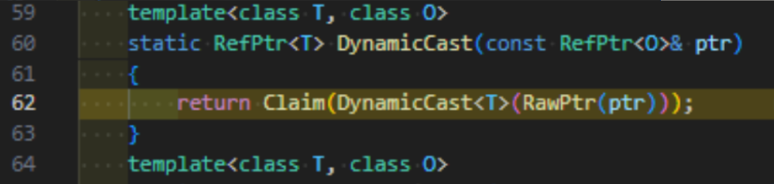

 
用[llvm-objdump](https://developer.huawei.com/consumer/cn/doc/best-practices/bpta-scenario-stability-cppcrash#section10107179911)工具解该栈的地址，发现出问题的是x8寄存器，从当前指针里面取其中的第一个成员（虚表地址）取到了一个异常地址，从中偏移-80取内容的时候挂了。
 
```text
0000000000a5f814 <OHOS::Ace::RefPtr<OHOS::Ace::NG::AccessibilityProperty> OHOS::Ace::AceType::DynamicCast<OHOS::Ace::NG::AccessibilityProperty, OHOS::Ace::NG::AccessibilityProperty>(OHOS::Ace::RefPtr<OHOS::Ace::NG::AccessibilityProperty> const&)>:
  a5f814: d10203ff     	sub	sp, sp, #128
  a5f818: a9057bfd     	stp	x29, x30, [sp, #80]
  a5f81c: a90657f6     	stp	x22, x21, [sp, #96]
  a5f820: a9074ff4     	stp	x20, x19, [sp, #112]
  a5f824: 910143fd     	add	x29, sp, #80
  a5f828: f9400009     	ldr	x9, [x0] // 从RefPtr中取出实际对象指针
  a5f82c: b4000fc9      cbz x9, ... // 取出对象虚表指针
  a5f830: aa0803f3     	mov	x19, x8
  a5f834: f9400128     	ldr	x8, [x9] // 取出对象虚表指针
  a5f838: b00141b5     	adrp	x21, 0x3294000 <OHOS::Ace::NG::SvgGraphic::OnDraw(OHOS::Rosen::Drawing::Canvas&, OHOS::Ace::Size const&, std::__h::optional<OHOS::Ace::Color> const&)+0x257c>
  a5f83c: f85b0108      ldur	x8, [x8, #-80] // 尝试访问虚表中偏移为-80的位置
```
 
前方的代码如下，从fnode指针中获取其成员时出现故障，通过汇编和代码初步定位可能是地址中的内存被覆盖。
 

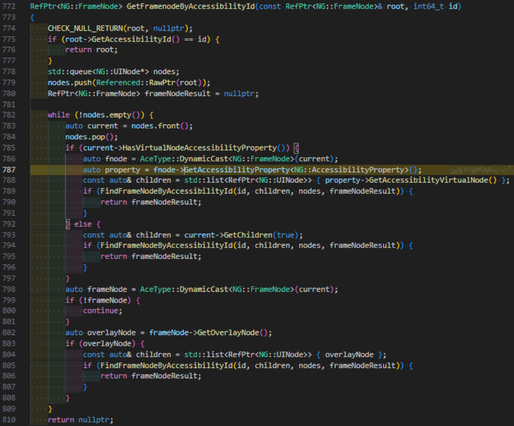

 

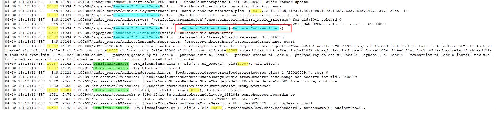

 
**第二步：场景分析**
 
通过走读代码，发现可疑点，几个地址越界问题的流水日志都有一个共同点，存在设置声音的操作。最终决定增加设置声音的测试用例进行压测。
 

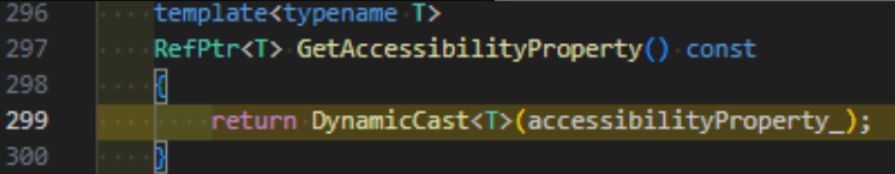

 
**第三步：内存特征分析**
 
继续使用[llvm-objdump](https://developer.huawei.com/consumer/cn/doc/best-practices/bpta-scenario-stability-cppcrash#section10107179911)进行反汇编分析，关注崩溃栈中的#01栈：
 
```text
#01 pc 000000000286947c /system/lib64/platformsdk/libace_compatible.z.so
```
 
对应汇编片段如下：
 
```text
286944c: f94002e8     	ldr	x8, [x23]
 2869450: f85c0118     	ldur	x24, [x8, #-64]
 2869454: 08dffea8     	ldarb	w8, [x21]
 2869458: 360028e8     	tbz	w8, #0, 0x2869974 <OHOS::Ace::Framework::(anonymous namespace)::GetFramenodeByAccessibilityId(OHOS::Ace::RefPtr<OHOS::Ace::NG::FrameNode> const&, long)+0x6c8>
 286945c: 8b1802e0     	add	x0, x23, x24
 2869460: f9400381     	ldr	x1, [x28]
 2869464: f9400008     	ldr	x8, [x0]
 2869468: f9400908     	ldr	x8, [x8, #16]
 286946c: d63f0100     	blr	x8
 2869470: 910d8000     add	x0, x0, #864
 2869474: d10023a8     	sub	x8, x29, #8
 2869478: f81f83bf     	stur	xzr, [x29, #-8]
 286947c: 9787d8e6     	bl	0xa5f814 <OHOS::Ace::RefPtr<OHOS::Ace::NG::AccessibilityProperty> OHOS::Ace::AceType::DynamicCast<OHOS::Ace::NG::AccessibilityProperty, OHOS::Ace::NG::AccessibilityProperty>(OHOS::Ace::RefPtr<OHOS::Ace::NG::AccessibilityProperty> const&)>
 2869480: f85f83a8     	ldur	x8, [x29, #-8]
```
 
从指令add x0, x0, #864可以看出，在执行bl跳转之前，x0寄存器的值被偏移了864字节，目的是定位到类中的某个成员变量。为确定该偏移对应的具体成员，可通过gdb的ptype /o命令查看类的内存布局。如图所示，864字节的偏移恰好对应NG::FrameNode结构体中的成员变量accessibilityProperty_的位置。
 

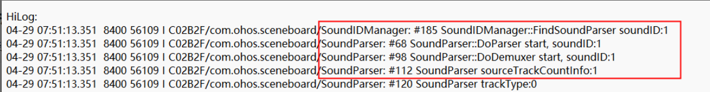

 
因此可判断，此时的x0指向的就是accessibilityProperty_ 成员的地址。紧随其后的bl指令跳转至0xa5f814（DynamicCast），该函数会以x0为实参，对其执行虚表查找，并尝试进行向下类型转换。看x0的内存布局，和FrameNode结构体内存大小也能对上。说明FrameNode是正常的，但是里面的这个成员的指针指向的内容异常了，如下图所示5c3eb6ad68地址的值异常，可能是accessibilityProperty_这个指针本身被踩，也可能是这个对象的内容被踩。
 

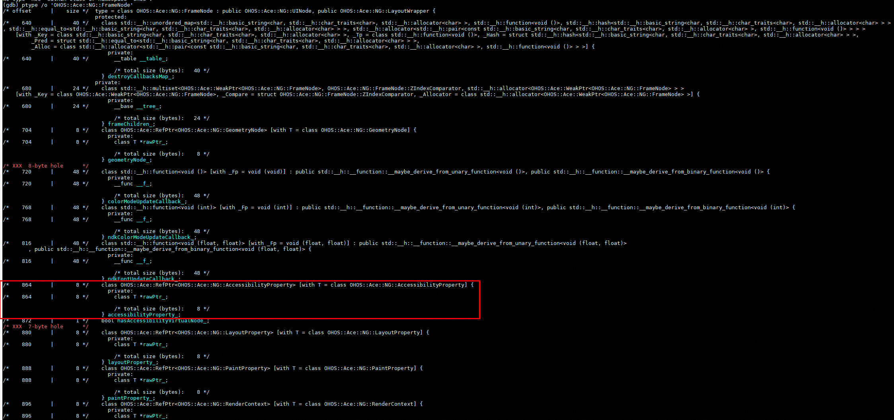

 
**第四步：用例部署**
 
**用例：**基于第二步的场景分析结果，构建定向测试用例，优先覆盖声音播放路径，以提升问题复现的概率。
 
**规模：**该问题的出现概率为0.36次/千小时，意味着平均每运行约2700小时才可能出现一次。以此推算，若不具备高概率复现的测试手段，需部署约100台设备并持续运行24小时，才可能复现一次问题。
 
**第五步：应用天网部署**
 
通过定位hap包中未插桩的so（共计 6 个），并完成插桩编译，结合场景分析开展压测。最终，在当天即捕获到了地址越界的内存问题，验证了插桩的有效性与场景分析的准确性。
 
**第六步：日志分析**
 
最终的日志如下：
 
```text
Reason:Signal:SIGTRAP(TRAP_BRKPT)@0x0000005993e64380 
Fault thread info:
Tid:3609, Name:ohos.sceneboard
#00 pc 000000000002431c /system/asan/lib64/libclang_rt.hwasan.so(__hwasan_memcpy+104)(923568647ab45629f49bfc2f49994f3ad1ed78d7)
#01 pc 000000000005851c /system/asan/lib64/chipset-pub-sdk/libutils.z.so(memcpy_s+92)(ccf5dfd85d62df9862da8c793fda4686)
#02 pc 0000000000019eb8 /system/asan/lib64/platformsdk/libsoundpool_client.z.so(OHOS::Media::CacheBuffer::DealWriteData(unsigned long)+784)(eeedf0103bb0362f04cf668b2aacc59c)
#03 pc 000000000001994c /system/asan/lib64/platformsdk/libsoundpool_client.z.so(OHOS::Media::CacheBuffer::OnWriteData(unsigned long)+316)(eeedf0103bb0362f04cf668b2aacc59c)
#04 pc 0000000000112188 /system/asan/lib64/platformsdk/libaudio_client.z.so(OHOS::AudioStandard::RendererInClientInner::WriteCallbackFunc()+1488)(8c5f08d14bbf64621f12f008754788e2)
#05 pc 0000000000124fd4 /system/asan/lib64/platformsdk/libaudio_client.z.so(8c5f08d14bbf64621f12f008754788e2)
#06 pc 000000000010fe74 /system/lib/ld-musl-aarch64-asan.so.1(start+244)(e9b4aaf89b017030f72cd5cadf60ea8b)
#07 pc 00000000000a1b88 /system/lib/ld-musl-aarch64-asan.so.1(e9b4aaf89b017030f72cd5cadf60ea8b)
```
 
解析#00栈，对应的汇编如下
 
```text
00000000000242b4 <__hwasan_memcpy>:
   242b4: aa0103e8     mov	x8, x1 // x8 = src
   242b8: aa0003e9     mov	x9, x0 // x9 = dest
   242bc: b5000082     	cbnz	x2, 0x242cc <__hwasan_memcpy+0x18>
   242c0: aa0903e0     	mov	x0, x9
   242c4: aa0803e1     	mov	x1, x8
   242c8: 1400952e     	b	0x49780 <memcpy@plt>
   242cc: f000012a     	adrp	x10, 0x4b000 <__hwasan_memcpy+0xb4>
   242d0: 9240dd2b     and	x11, x9, #0xffffffffffffff // x11 = dest地址去tag
   242d4: 8b02016e     	add	x14, x11, x2
   242d8: f941c94a     ldrx10, [x10, #912]
   242dc: f940014d     ldr	x13, [x10] // base_addr = *(shadow_table)
   242e0: 8b4b11ac     	add	x12, x13, x11, lsr #4 // shadow_ptr = base + (addr >> 4)
   242e4: 8b4e11ab     	add	x11, x13, x14, lsr #4 // shadow_end = base + ((addr+size) >> 4)
   242e8: eb0b019f     	cmp	x12, x11
   242ec: 54000202     	b.hs	0x2432c <__hwasan_memcpy+0x78>
   242f0: cb0c016d     	sub	x13, x11, x12
   242f4: d378fd2e     lsr      x14, x9, #56 // >>56位后得到高8位的指针tag，x14 = tag(x9)
   242f8: 3940018f     ldrb	w15, [x12] // 找到shadow memory中的tag
   242fc: 6b0e01ff     cmp      w15, w14 // 比较 tag 是否一致
   24300: 540000a1     b.ne     0x24314 <__hwasan_memcpy+0x60> // 不一致 → 报错
   24304: 9100058c     	add	x12, x12, #1
   24308: f10005ad     	subs	x13, x13, #1
   2430c: 54ffff61     	b.ne	0x242f8 <__hwasan_memcpy+0x44>
   24310: 14000007     	b	0x2432c <__hwasan_memcpy+0x78>
   24314: aa0903e0     mov      x0, x9 // x0 = dest (错误地址)
   24318: aa0203e1     mov	x1, x2 // x1 = size
   2431c: d42127e0     brk#0x93f // HWAASan测到问题，tag mismatch
   24320: 9100058c     	add	x12, x12, #1
   24324: f10005ad     subs	x13, x13, #1
```
 
看汇编hwasan抓到tag不对了，从汇编看就是x0寄存器不对，也就是dest的指针有问题。
 

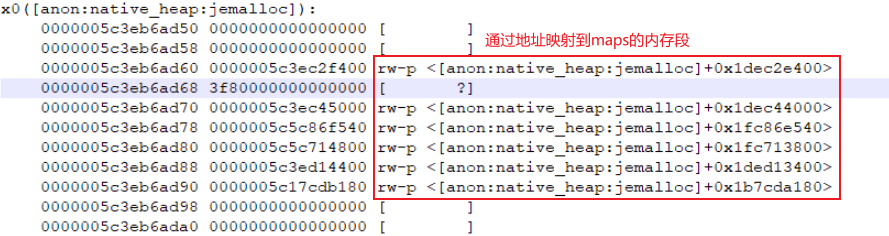

 
向前回栈看：
 

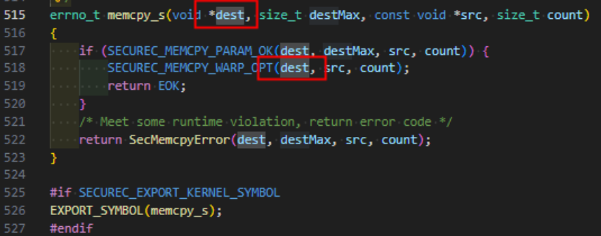

 
结合反编译第一个参数，是音频audiorenderer传过来找soundpool要数据填充的目的地址，看是否提前释放导致野指针了。
 

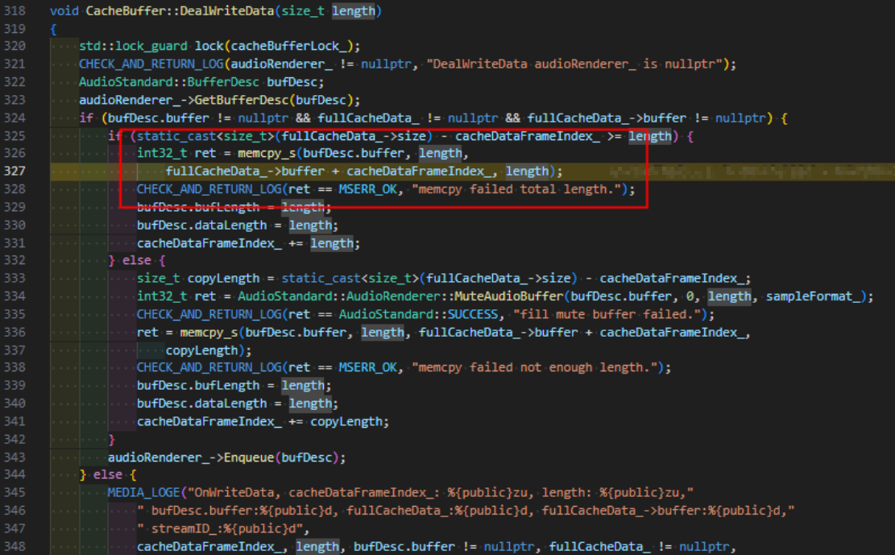

 

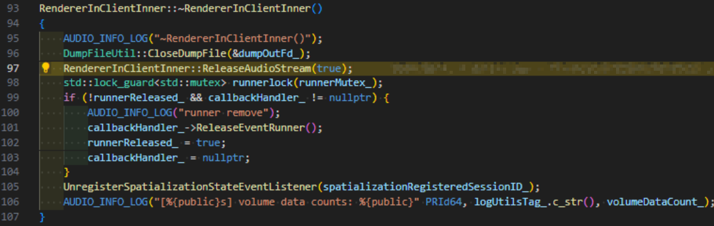

 

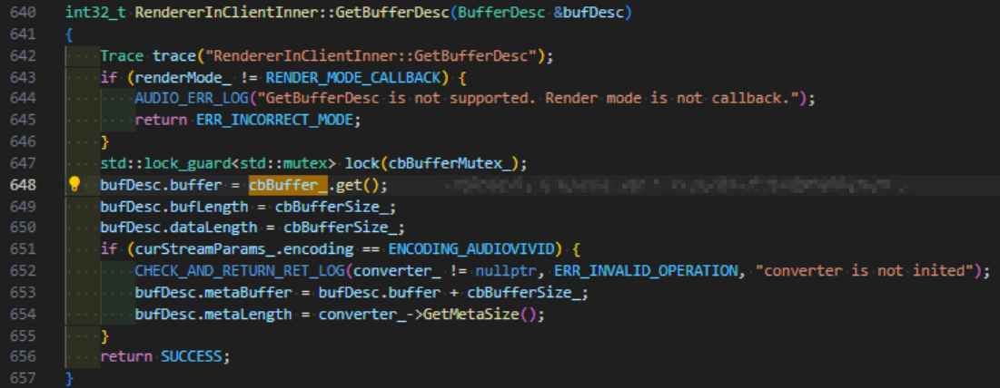

 
问题已明确是Use-After-Free问题，GetBufferDesc函数将cbBuffer_的裸指针返回出去，另一个线程将RendererInClientInner销毁了，生命周期不一致导致了Use-After-Free问题。
