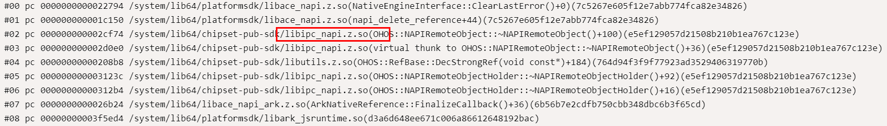
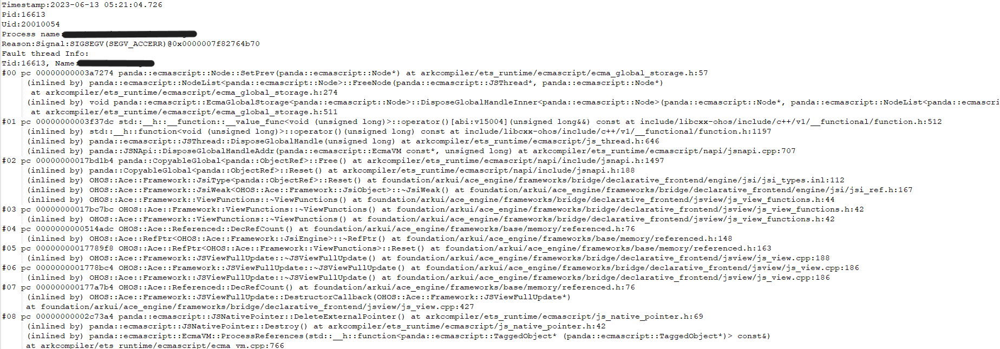
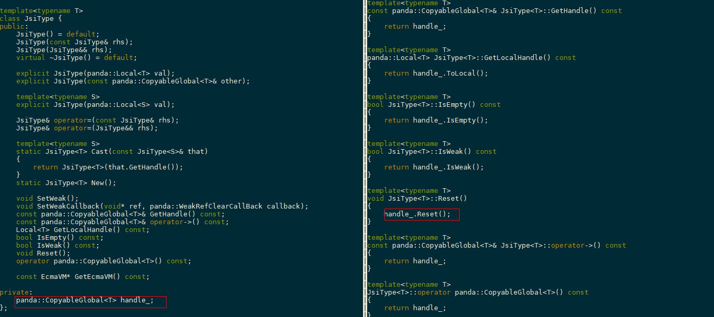
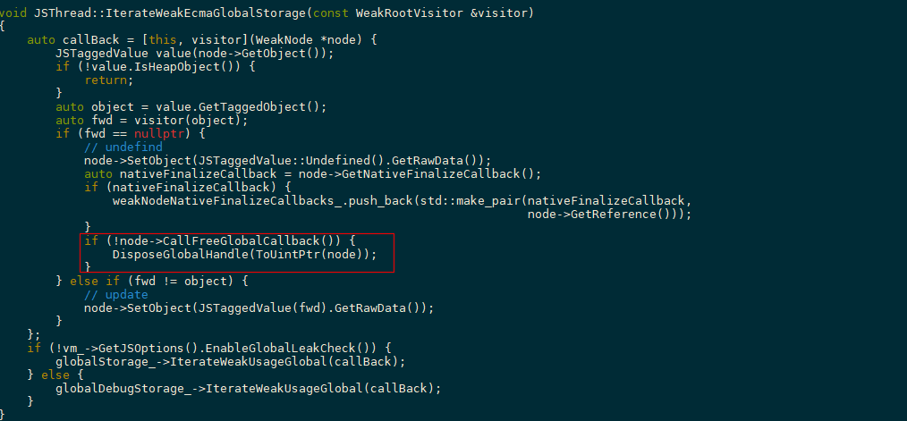
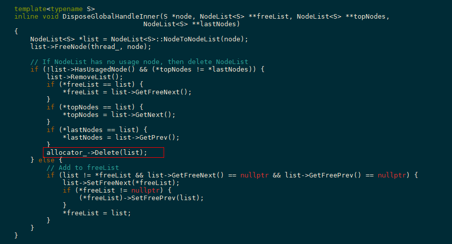
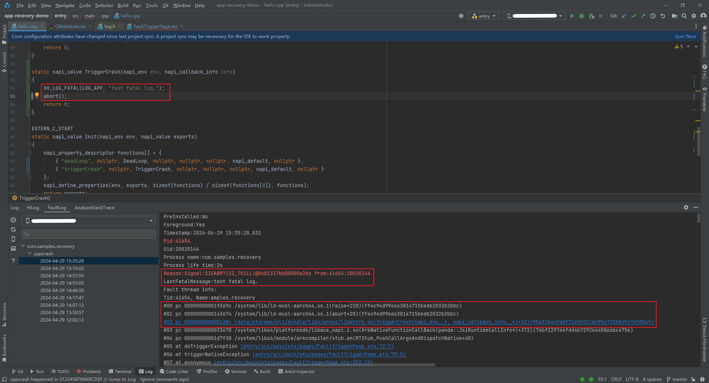
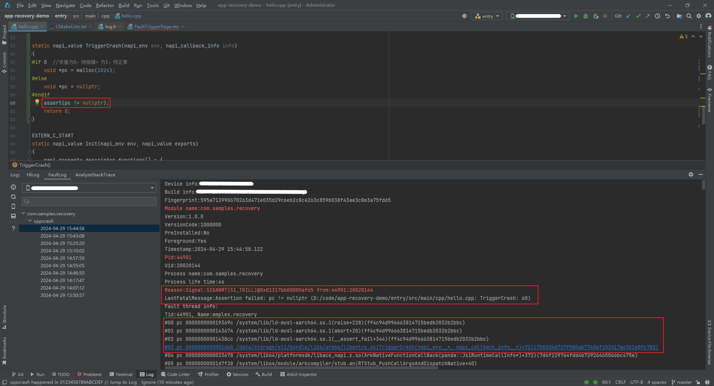

# CppCrash类问题案例

更新时间：2026-05-22 09:46:30

来源：https://developer.huawei.com/consumer/cn/doc/best-practices/bpta-scenario-stability-cppcrash

本文以列举常见案例方式介绍如何分析并修复CppCrash问题。阅读本文之前，建议开发者先阅读[应用崩溃问题检测方法](https://developer.huawei.com/consumer/cn/doc/best-practices/bpta-stability-runtime-crash-detection)了解系统检测CppCrash问题的原理和机制，然后阅读[CppCrash类问题分析方法](https://developer.huawei.com/consumer/cn/doc/best-practices/bpta-stability-app-crash-cpp-way)了解分析CppCrash问题的一般步骤。
 
除本文之外，开发者还可以参考以下文档分析API相关的CppCrash问题:
 
[UI相关应用崩溃常见问题](https://developer.huawei.com/consumer/cn/doc/harmonyos-guides/arkts-stability-crash-issues)
 
[易错API的使用规范](https://developer.huawei.com/consumer/cn/doc/best-practices/bpta-stability-coding-standard-api)
 
[稳定性相关问题汇总](https://developer.huawei.com/consumer/cn/doc/harmonyos-guides/napi-faq-about-stability)
 

#### 案例1：空指针解引用问题

 

#### 概述

 
智能指针使用之前未判空，造成进程运行时发生空指针解引用崩溃问题。
 

#### 问题现象

 
进程发生崩溃，影响稳定运行，导致非预期退出。
 

#### 分析步骤

```text
Timestamp:1970-12-07 10:27:48.228
Pid:26984
Uid:20010045
Process name:xxx
Reason:Signal:SIGSEGV(SEGV_MAPERR)@0000000000000004  probably caused by NULL pointer dereference 额
Fault thread Info:
Tid:27270, Name:xxx
#00 pc 0000000000022770 /system/lib64/libapp context.z.so(OHOS::AbilityRuntime::ApplicationContext::DispatchWindowStageFocus (std::__l::shared ptr<NativeReference> consts, std::__l::shared_ptr<NativeReference> consts)+152)
#01 pc 000000000014ea58 /system/lib64/libabilitykit_native.z.so(OHOS::AppExecFwk::AbilityImpl::AfterFocused()+560)
#02 pc 000000000014f8ec /system/lib64/libabilitykit_native.z.so(OHOS::AppExecFwk::AbilityImpl::WindowLifeCycleImpl::AfterFocused()+92)
#03 pc 000000000006acb8 /system/lib64/libwm.z.so
#04 pc 000000000000e680 /system/lib64/libeventhandler.z.so(OHOS::AppExecFwk::EventHandler::DistributeEvent (std::__l::unique_ptr<OHOS::AppExecFwk::InnerEvent, void (*)(OHOS::AppExecFwk::InnerEvent*)> const&)+808)
#05 pc 00000000000174cc /system/lib64/libeventhandler.z.so
#06 pc 0000000000015c30 /system/lib64/libeventhandler.z.so
#07 pc 0000000000018698 /system/lib64/libeventhandler.z.so
#08 pc 00000000000d02a0 /system/lib64/libc.so(__pthread_start(void*)+40)
#09 pc 0000000000072128 /system/lib64/libc.so(__start_thread+68)
```
 
 
空指针类型崩溃可以从故障原因得到提示信息。通过llvm-addr2line解析行号发现业务代码中在使用智能指针之前未对智能指针判空，对空地址进行访问导致崩溃产生。
 

#### 修复方法

 
对所有使用该指针的地方进行保护性判空。
 

#### 建议与总结

 
指针在使用之前应该要进行判空处理，防止访问空指针造成进程崩溃退出。
 

#### 案例2：多线程竞争问题

 

#### 概述

 
napi_env释放后仍被使用。
 

#### 问题现象

 
核心崩溃栈如下：
 



 

#### 分析步骤

 
napi接口的env（JavaScript环境）指向非法内存，崩溃栈直接挂在NativeEngineInterface::ClearLastError()中，增加维测打印后结合HiLog梳理崩溃前的业务流程，根据打印的env地址0000007F01338CC0定位，发现是env被释放后仍然被使用。
 
```cpp
ipc在线程1创建remoteobj对象,并保存当前线程的env
07-21 22:42:32.108 3952 4030 I CO1510/napi_remoteObject_holer:27:[crashtest],NAPIRemoteObjectHolder create, env:0000007F01338CC0, holder:0000007F01331E00, descriptor:connect-test
07-21 22:42:32.109 3952 4030 I CO1510/napi_remoteObject:161:[crashtest] NAPIRemoteObject create, desc:connect-test,this:0000007F01329F60,env:0000007F01338CC0
07-21 22:42:32.142 3952 4030 I CO1510/napi_remoteObject_holer:32:[crashtest],NAPIRemoteObjectHolder release, env:0000007F01338CC0, holder:0000007F01331E00
线程1的引擎(env)被析构行
07-21 22:42:32.143 3952 4030 I C03900/NAPI:[(ark_native_engine.cpp:64)(~ArkNativeEngine)] ArkNativeEngine:~ArkNativeEngine
ipc在线程2中使用先前保存的env,出现崩溃
07-21 22:42:43.034 3952 3997 I C01510/napi_remoteObject: 171:[crashtest] NAPIRemoteObject Destructor, this:0000007F01329F60,env:0000007F01338CC0
```
 
由于JavaScript本身是单线程执行的，对env的任何操作都必须在创建该JS线程的原始线程上进行，如果违反该规则可能会出现意想不到的问题。
 

#### 修复方法

 
一个线程创建的env，不要传递给其他线程使用。
 

#### 建议与总结

 
对于栈顶崩溃在libace_napi.z.so、libark_jsruntime.so等库操作env的问题，并且出现概率相对较高，在CppCrash日志的调用栈难以直接分析出崩溃原因情况下，可以考虑开启[多线程检测](https://developer.huawei.com/consumer/cn/doc/harmonyos-guides/ide-multi-thread-check)帮助开发者快速定位问题。此外，在多线程操作STL容器（如vector、map、set等）的场景中，由于STL容器是非线程安全的，如果多线程进行添加和删除操作，容易出现SIGSEGV类崩溃，如果崩溃现场代码与STL容器相关，也可以考虑是多线程竞争问题。
 

#### 案例3：内存访问类崩溃问题

 

#### 概述

 
每次崩溃地址都在libace_napi_ark.z.so的可读可执行段上。崩溃原因是需要对地址进行写操作，而对应的maps段只有可读、可执行权限没有写权限，当进程试图访问不被允许访问的内存区域时，进程发生内存访问类崩溃。
 
```text
7f82740000-7f8275c000 r--p 00000000 /system/lib64/libace_napi_ark.z.so
7f8275c000-7f8276e000 r-xp 0001b000 /system/lib64/libace_napi_ark.z.so <-崩溃地址落在该地址区间
7f8276e000-7f82773000 r--p 0002c000 /system/lib64/libace_napi_ark.z.so
7f82773000-7f82774000 rw-p 00030000 /system/lib64/libace_napi_ark.z.so
```
 

#### 问题现象

 
崩溃调用栈如下图。
 



 

#### 分析步骤

 
根据业务逻辑分析，node应该保存在堆上，node地址不可能落在libace_napi_ark.z.so的代码段。从问题的现象分析，大概率是踩内存问题。踩内存问题可使用[HWASan工具](https://developer.huawei.com/consumer/cn/doc/harmonyos-guides/ide-hwasan)排查问题。于是后续使用ASan版本进行压测复现，也找到了稳定必现的场景。ASan版本检测出来的问题也和上面崩溃栈反映的问题一致。ASan日志显示的踩内存类型是heap-use-after-free，根据日志信息弄清从内存申请、内存释放到使用已被释放的内存整个过程。经过分析后发现业务代码对同一个地址（0x003a375eb724）进行重复释放，在重复释放内存操作时，使用该地址去访问了其对象成员，因此报出了use-after-free（使用已经释放的内存）问题。
 
ASan核心日志如下：
 
```cpp
=================================================================
==appspawn==2029==ERROR: AddressSanitizer: heap-use-after-free on address 0x003a375eb724 at pc 0x002029ba8514 bp 0x007fd8175710 sp 0x007fd8175708
READ of size 1 at 0x003a375eb724 thread T0 (thread name) <- 使用已被释放的内存现场
    # 0 0x2029ba8510  (/system/asan/lib64/platformsdk/libark_jsruntime.so+0xca8510) panda::ecmascript::Node::IsUsing() const at arkcompiler/ets_runtime/ecmascript/ecma_global_storage.h:82:16
(inlined by) panda::JSNApi::DisposeGlobalHandleAddr(panda::ecmascript::EcmaVM const*, unsigned long) at arkcompiler/ets_runtime/ecmascript/napi/jsnapi.cpp:749:67 BuildID[md5/uuid]=9a18e2ec0dc8a83216800b2f0dd7b76a
    # 1 0x403ee94d30  (/system/asan/lib64/libace.z.so+0x6194d30) panda::CopyableGlobal<panda::ObjectRef>::Free() at arkcompiler/ets_runtime/ecmascript/napi/include/jsnapi.h:1520:9
(inlined by) panda::CopyableGlobal<panda::ObjectRef>::Reset() at arkcompiler/ets_runtime/ecmascript/napi/include/jsnapi.h:189:9
(inlined by) OHOS::Ace::Framework::JsiType<panda::ObjectRef>::Reset() at foundation/arkui/ace_engine/frameworks/bridge/declarative_frontend/engine/jsi/jsi_types.inl:112:13
(inlined by) OHOS::Ace::Framework::JsiWeak<OHOS::Ace::Framework::JsiObject>::~JsiWeak() at foundation/arkui/ace_engine/frameworks/bridge/declarative_frontend/engine/jsi/jsi_ref.h:167:16
(inlined by) OHOS::Ace::Framework::ViewFunctions::~ViewFunctions() at foundation/arkui/ace_engine/frameworks/bridge/declarative_frontend/jsview/js_view_functions.h:44:5 BuildID[md5/uuid]=1330f8b9be73bdb76ae18107c2a60ca1
    # 2 0x403ee9296c  (/system/asan/lib64/libace.z.so+0x619296c) OHOS::Ace::Framework::ViewFunctions::~ViewFunctions() at foundation/arkui/ace_engine/frameworks/bridge/declarative_frontend/jsview/js_view_functions.h:42:5
(inlined by) OHOS::Ace::Framework::ViewFunctions::~ViewFunctions() at foundation/arkui/ace_engine/frameworks/bridge/declarative_frontend/jsview/js_view_functions.h:42:5 BuildID[md5/uuid]=1330f8b9be73bdb76ae18107c2a60ca1
    # 3 0x403ed9b130  (/system/asan/lib64/libace.z.so+0x609b130) OHOS::Ace::Referenced::DecRefCount() at foundation/arkui/ace_engine/frameworks/base/memory/referenced.h:76:13
(inlined by) OHOS::Ace::RefPtr<OHOS::Ace::Framework::ViewFunctions>::~RefPtr() at foundation/arkui/ace_engine/frameworks/base/memory/referenced.h:148:22 BuildID[md5/uuid]=1330f8b9be73bdb76ae18107c2a60ca1
    # 4 0x403ed9b838  (/system/asan/lib64/libace.z.so+0x609b838) OHOS::Ace::RefPtr<OHOS::Ace::Framework::ViewFunctions>::Reset() at foundation/arkui/ace_engine/frameworks/base/memory/referenced.h:163:9
(inlined by) OHOS::Ace::Framework::JSViewFullUpdate::~JSViewFullUpdate() at foundation/arkui/ace_engine/frameworks/bridge/declarative_frontend/jsview/js_view.cpp:159:21 BuildID[md5/uuid]=1330f8b9be73bdb76ae18107c2a60ca1
    # 5 0x403ed9bf24  (/system/asan/lib64/libace.z.so+0x609bf24) OHOS::Ace::Framework::JSViewFullUpdate::~JSViewFullUpdate() at foundation/arkui/ace_engine/frameworks/bridge/declarative_frontend/jsview/js_view.cpp:157:1
(inlined by) OHOS::Ace::Framework::JSViewFullUpdate::~JSViewFullUpdate() at foundation/arkui/ace_engine/frameworks/bridge/declarative_frontend/jsview/js_view.cpp:157:1 BuildID[md5/uuid]=1330f8b9be73bdb76ae18107c2a60ca1
...
freed by thread T0 (thread name) here: <- 内存释放的现场
    # 0 0x2024ed3abc  (/system/asan/lib64/libclang_rt.asan.so+0xd3abc)
    # 1 0x2029ba8424  (/system/asan/lib64/platformsdk/libark_jsruntime.so+0xca8424) std::__h::__function::__value_func<void (unsigned long)>::operator()[abi:v15004](unsigned long&&) const at prebuilts/clang/ohos/linux-x86_64/llvm/bin/../include/libcxx-ohos/include/c++/v1/__functional/function.h:512:16
(inlined by) std::__h::function<void (unsigned long)>::operator()(unsigned long) const at prebuilts/clang/ohos/linux-x86_64/llvm/bin/../include/libcxx-ohos/include/c++/v1/__functional/function.h:1197:12
(inlined by) panda::ecmascript::JSThread::DisposeGlobalHandle(unsigned long) at arkcompiler/ets_runtime/ecmascript/js_thread.h:604:9
(inlined by) panda::JSNApi::DisposeGlobalHandleAddr(panda::ecmascript::EcmaVM const*, unsigned long) at arkcompiler/ets_runtime/ecmascript/napi/jsnapi.cpp:752:24 BuildID[md5/uuid]=9a18e2ec0dc8a83216800b2f0dd7b76a
    # 2 0x403ee94b68  (/system/asan/lib64/libace.z.so+0x6194b68) panda::CopyableGlobal<panda::FunctionRef>::Free() at arkcompiler/ets_runtime/ecmascript/napi/include/jsnapi.h:1520:9
(inlined by) panda::CopyableGlobal<panda::FunctionRef>::Reset() at arkcompiler/ets_runtime/ecmascript/napi/include/jsnapi.h:189:9
(inlined by) OHOS::Ace::Framework::JsiType<panda::FunctionRef>::Reset() at foundation/arkui/ace_engine/frameworks/bridge/declarative_frontend/engine/jsi/jsi_types.inl:112:13
(inlined by) OHOS::Ace::Framework::JsiWeak<OHOS::Ace::Framework::JsiFunction>::~JsiWeak() at foundation/arkui/ace_engine/frameworks/bridge/declarative_frontend/engine/jsi/jsi_ref.h:167:16
(inlined by) OHOS::Ace::Framework::ViewFunctions::~ViewFunctions() at foundation/arkui/ace_engine/frameworks/bridge/declarative_frontend/jsview/js_view_functions.h:44:5 BuildID[md5/uuid]=1330f8b9be73bdb76ae18107c2a60ca1
    # 3 0x403ee9296c  (/system/asan/lib64/libace.z.so+0x619296c) OHOS::Ace::Framework::ViewFunctions::~ViewFunctions() at foundation/arkui/ace_engine/frameworks/bridge/declarative_frontend/jsview/js_view_functions.h:42:5
(inlined by) OHOS::Ace::Framework::ViewFunctions::~ViewFunctions() at foundation/arkui/ace_engine/frameworks/bridge/declarative_frontend/jsview/js_view_functions.h:42:5 BuildID[md5/uuid]=1330f8b9be73bdb76ae18107c2a60ca1
    # 4 0x403ed9b130  (/system/asan/lib64/libace.z.so+0x609b130) OHOS::Ace::Referenced::DecRefCount() at foundation/arkui/ace_engine/frameworks/base/memory/referenced.h:76:13
(inlined by) OHOS::Ace::RefPtr<OHOS::Ace::Framework::ViewFunctions>::~RefPtr() at foundation/arkui/ace_engine/frameworks/base/memory/referenced.h:148:22 BuildID[md5/uuid]=1330f8b9be73bdb76ae18107c2a60ca1
...
previously allocated by thread T0 (thread name) here: <- 内存申请的现场
    # 0 0x2024ed3be4  (/system/asan/lib64/libclang_rt.asan.so+0xd3be4)
    # 1 0x2029ade778  (/system/asan/lib64/platformsdk/libark_jsruntime.so+0xbde778) panda::ecmascript::NativeAreaAllocator::AllocateBuffer(unsigned long) at arkcompiler/ets_runtime/ecmascript/mem/native_area_allocator.cpp:98:17 BuildID[md5/uuid]=9a18e2ec0dc8a83216800b2f0dd7b76a
    # 2 0x2029a39064  (/system/asan/lib64/platformsdk/libark_jsruntime.so+0xb39064) std::__h::enable_if<!std::is_array_v<panda::ecmascript::NodeList<panda::ecmascript::WeakNode>>, panda::ecmascript::NodeList<panda::ecmascript::WeakNode>*>::type panda::ecmascript::NativeAreaAllocator::New<panda::ecmascript::NodeList<panda::ecmascript::WeakNode>>() at arkcompiler/ets_runtime/ecmascript/mem/native_area_allocator.h:61:19
(inlined by) unsigned long panda::ecmascript::EcmaGlobalStorage<panda::ecmascript::Node>::NewGlobalHandleImplement<panda::ecmascript::WeakNode>(panda::ecmascript::NodeList<panda::ecmascript::WeakNode>**, panda::ecmascript::NodeList<panda::ecmascript::WeakNode>**, unsigned long) at arkcompiler/ets_runtime/ecmascript/ecma_global_storage.h:565:34
(inlined by) panda::ecmascript::EcmaGlobalStorage<panda::ecmascript::Node>::SetWeak(unsigned long, void*, void (*)(void*), void (*)(void*)) at arkcompiler/ets_runtime/ecmascript/ecma_global_storage.h:455:26 BuildID[md5/uuid]=9a18e2ec0dc8a83216800b2f0dd7b76a
    # 3 0x2029ba5620  (/system/asan/lib64/platformsdk/libark_jsruntime.so+0xca5620) std::__h::__function::__value_func<unsigned long (unsigned long, void*, void (*)(void*), void (*)(void*))>::operator()[abi:v15004](unsigned long&&, void*&&, void (*&&)(void*), void (*&&)(void*)) const at prebuilts/clang/ohos/linux-x86_64/llvm/bin/../include/libcxx-ohos/include/c++/v1/__functional/function.h:512:16
(inlined by) std::__h::function<unsigned long (unsigned long, void*, void (*)(void*), void (*)(void*))>::operator()(unsigned long, void*, void (*)(void*), void (*)(void*)) const at prebuilts/clang/ohos/linux-x86_64/llvm/bin/../include/libcxx-ohos/include/c++/v1/__functional/function.h:1197:12
(inlined by) panda::ecmascript::JSThread::SetWeak(unsigned long, void*, void (*)(void*), void (*)(void*)) at arkcompiler/ets_runtime/ecmascript/js_thread.h:610:16
(inlined by) panda::JSNApi::SetWeak(panda::ecmascript::EcmaVM const*, unsigned long) at arkcompiler/ets_runtime/ecmascript/napi/jsnapi.cpp:711:31 BuildID[md5/uuid]=9a18e2ec0dc8a83216800b2f0dd7b76a
...
```
 
根据调用栈继续分析，JsiWeak析构或重置的时候会触发其成员（类型为JsiObject/JsiValue/JsiFunction）父类JsiType中CopyableGlobal被释放，如下图。
 



 
运行时在GC过程中IterateWeakEcmaGlobalStorage，会对无callback的WeakNode调用DisposeGlobalHandle操作，也对其进行释放，如下图。
 



 
对于同一个WeakNode，可能会存在两个入口释放。如果是GC过程中IterateWeakEcmaGlobalStorage先释放，因为无callback回调通知到JsiWeak进行清理，JsiWeak那边仍保存一个对已释放的WeakNode引用，即CopyableGlobal；当前面讲的WeakNode所在的NodeList被整体释放，JsiWeak处保留的CopyableGlobal再释放，就会存在重复释放内存问题。
 



 

#### 修复方法

 
JsiWeak调用SetWeakCallback，传入callback，在GC过程中IterateWeakEcmaGlobalStorage释放WeakNode时，通知JsiWeak对其保存的CopyableGlobal进行重置，确保同一个地址不被重复释放。
 

#### 建议与总结

 
使用内存时应考虑是否存在重复释放或者未释放的可能，另外定位内存访问类崩溃问题（一般是SIGSEGV类型问题）时，如果根据调用栈继续分析问题无头绪时，应优先考虑使能HWASan版本复现问题。
 

#### 案例4：生命周期类问题

 

#### 概述

 
生命周期类问题是指在对象生命周期外访问其内存产生崩溃的问题，通常是由于不恰当使用裸指针造成。裸指针是指不具有封装或自动内存管理特性的指针。它只是一个简单的指针，指向内存地址，没有保护或管理指针指向的内存。裸指针可以直接访问内存，但容易导致内存泄漏和空指针引用等问题。使用裸指针时需要特别小心，以避免潜在的安全问题。推荐使用智能指针来管理内存。
 

#### 问题现象

 
开发者在写native代码创建napi_value时，需要配合napi_handle_scope一起使用。napi_handle_scope的作用是管理napi_value的生命周期，napi_value只能在napi_handle_scope的作用域范围内进行使用，离开napi_handle_scope作用域范围后，napi_value及它所持有的JS对象的生命周期不再得到保护，一旦引用计数为0，就会被GC回收掉，此时再去使用napi_value就会访问已释放的内存，产生问题。
 
napi_value其实是个裸指针（结构体指针），其作用是持有JS对象，用于保持JS对象的生命周期，保证JS对象不被GC当成垃圾对象回收。离开napi_handle_scope作用域之后，napi_value由GC回收，napi_value不再持有JS对象（不再保护JS对象生命周期）。
 

#### 分析步骤

 
根据调用栈定位到行号找到出现问题的napi接口的上层接口，在上层接口内找到出问题的napi_value，检查napi_value的使用范围是否超出了napi_handle_scope的作用域范围。
 
napi_value超出napi_handle_scope的作用域范围，如下：
 
```cpp
napi_value g_Values;

// Add方法默认在napi_handle_scope的作用域范围内，方法结束后会关闭scope
static napi_value Add(napi_env env, napi_callback_info info)
{
    size_t argc = 3;
    napi_value args[3] = {nullptr};

    napi_get_cb_info(env, info, &argc, args, nullptr, nullptr);

    napi_valuetype valuetype0;
    napi_typeof(env, args[0], &valuetype0);
    std::vector<napi_value> dataList;
    for (int i = 0; i < argc; i++) {
        napi_value data = args[i];
        dataList.push_back(data);
    }
    void* buffer = nullptr;
    napi_value arrayBuffer;
    napi_create_arraybuffer(env, dataList.size(), &buffer, &arrayBuffer);
    memcpy(buffer, dataList.data(), dataList.size());
    napi_value typedArray;
    napi_create_typedarray(
        env, napi_int8_array, dataList.size(), arrayBuffer, 0, &typedArray
    );
    g_Values = typedArray; // Add方法执行完后，typedArray因离开作用域内存会被回收
    return nullptr;
}

static napi_value Get(napi_env env, napi_callback_info info)
{
    return g_Values; // 还在使用已经回收的内存，导致崩溃     
}
```
 
JS侧通过Add接口添加数据，native侧以napi_value保存到vector，JS侧通过get接口获取添加的数据，native侧将保存的napi_value以数组形式返回回去，然后JS侧读取数据的属性。出现报错：Can not get Prototype on non ECMA Object。跨napi的napi_value未使用napi_ref保存，导致napi_value失效。
 

#### 建议与总结

开发者可以通过napi_handle_scope来管理napi_value的生命周期，进入native方法前开始作用域，从native方法出来后结束作用域，详细使用请参考[使用Node-API接口进行生命周期相关开发](https://developer.huawei.com/consumer/cn/doc/harmonyos-guides/use-napi-life-cycle)。
 
 

#### 案例5：SIGABRT类崩溃问题

 
SIGABRT进程异常终止，通常为进程自身调用标准函数库的abort()函数，崩溃原因在调用abort()函数的代码。由程序检测到异常时触发，如线程创建失败，文件描述符使用异常等，大多数情况是各基础库（C库等）进行校验操作，校验失败会主动终止进程。
 
```cpp
static napi_value TriggerCrash(napi_env env, napi_callback_info info)
{
    OH_LOG_FATAL("LOG_APP", "test fatal log.");
    abort();
    return 0;
}
```
 


构造主动调用abort函数场景举例说明SIGABRT类崩溃问题如何分析。上图所示，LastFatalMessage是进程退出前的最后一条fatal级别日志，对于SIGABRT类崩溃问题其一般能提供程序主动异常终止的原因，对定位该类问题有很大帮助。从上往下跳过C库的调用栈，找到调用abort函数的调用栈（图中#02层调用栈），从这里结合LastFatalMessage进行分析。
 
除了调用abort函数外，C++中的另一个异常处理机制还包括assert函数，assert用于校验当前函数执行流程中的一些数据，校验失败进程会主动终止，分析问题的方法都是一样的。
 
```cpp
static napi_value TriggerCrash(napi_env env, napi_callback_info info)
{
#if 0  //If the value is 0, an error will be reported. If it is 1, it is normal
    void *pc = malloc(1024);
#else
    void *pc = nullptr;
#endif
    assert(pc != nullptr);
    return 0;
}
```
 



 

#### 案例6：通过反汇编分析CppCrash问题

 
**llvm-objdump工具使用方法**
 
llvm-objdump是系统侧提供的反汇编工具，归档路径[SDK DIR PATH]/default/HarmonyOS/native/llvm/bin/llvm-objdump.exe，使用命令如下：
 
```text
llvm-objdump.exe -d -l libark_jsruntime.so > dump.txt
```
 
进行以上操作可以导出libark_jsruntime.so的全量汇编指令到dump.txt文件。
 
**结合具体案例解答**
 
CppCrash日志核心内容如下：
 
```text
Process name:xxx
Process life time:13402s
Process Memory(kB): 11902(Rss)
Device Memory(kB): Total 1935820, Free 516244, Available 1205608
Reason:SIGSEGV(SEGV_MAPERR)@0x0000005b3b46c000
Fault thread info:
Tid:48552, Name:xxx
#00 pc 00000000000a87e4 /system/lib/ld-musl-aarch64.so.1(memcpy+356)(3c3e7fb27680dc2ee99aa08dd0f81e85)
...
```
 
分析步骤：
 1. 根据pc寄存器地址找到对应的汇编指令，确定在哪条指令执行时发生崩溃。

  在CppCrash日志文件中找到栈顶的PC地址，并反汇编对应的二进制。

  例如在执行00000000000a87e4地址对应的指令时发生崩溃，反汇编查看ld-musl-aarch64.so.1文件0xa87e4偏移地址显示的信息：

  
```text
xxx/../../third_party/optimized-routines/string/aarch64/memcpy.S:175 <- 源码行号
a87e4：a94371aa         ldp x10, x11, [x1, #48]
地址：    值                   汇编指令
```
 ldr指令是加载多数据指令（LDP-Load Pair），用于从内存中同时加载两个64位的数据到两个不同的寄存器中。

  
```text
ldp    x10,        x11,    [x1, #48]
ldp 目标寄存器1, 目标寄存器2, <源地址>
```
 从内存中指定位置（由寄存器x1中地址加上48字节偏移量确定）读取两个连续的64位数据，并将它们分别存储到寄存器x10和x11中。

  根据反汇编显示的源码文件位置175行，查看对应memcpy.S源文件代码：

  
```text
L(loop64):
line 170   stp A_l, A_h, [dst, 16]
line 171   ldp A_l, A_h, [src, 16]
line 172   stp B_l, B_h, [dst, 32]
line 173   ldp B_l, B_h, [src, 32]
line 174   stp C_l, C_h, [dst, 48]
line 175   ldp C_l, C_h, [src, 48]      <-  崩溃处指令
line 176   stp D_l, D_h, [dst, 64]
line 177   ldp D_l, D_h, [src, 64]
line 178   subs count, count, 64
line 179   b.hi L(loop64)
```

2. 根据寄存器值，结合上下文确定哪个对象导致了问题。

  非类成员函数x0寄存器加载的是函数第1个参数，x1加载的是第2个参数，x2加载的第3个参数，依次类推；类成员函数，x0加载的是类实例对象的指针，其后x1、x2、x3为参数，注意函数参数超过5个会压入栈中。栈顶函数void* memcpy(void* restrict dest, void* restrict src, size_t n)参数，x0是dest（目的地址）, x1是src（源地址），x2是n（拷贝字节数）。

  
```text
Register:
x0:000005b50c3e3c4 x1:000005b3b46bfcc x2:0000000000007e88 x3:000005b50c42380
...
```
 根据在CppCrash日志中找到对应的三个寄存器值，结合崩溃地址0x0000005b3b46c000，确定出问题的参数是memcpy函数第2个参数（源地址）。
3. 结合崩溃地址附近的内存特征确定问题类型。

  通过CppCrash日志中Memory near registers查看寄存器附近内存地址值：

  
```text
x1(xxxx):
    0000005b3b46bfbc 3e99fedbc0a9b5e9
    0000005b3b46bfc4 a91ab9d327969682
    0000005b3b46bfcc 83906d9c18cdb9c1
    0000005b3b46bfd4 627dd75ab9335eb0
    0000005b3b46bfdc aabe2bb1b00f2c03
    0000005b3b46bfe4 f981e4acb716cbc1
    0000005b3b46bfec 806b3d5730d281ee
    0000005b3b46bff4 3e99fedbc0a9b5e9
    0000005b3b46bffc ffffffffffffffff  -> 内存值是ffffffffffffffff表示0000005b3b46bffc是非法地址，读取越界
    0000005b3b46c004 ffffffffffffffff
    0000005b3b46c00c ffffffffffffffff
    0000005b3b46c014 ffffffffffffffff
    0000005b3b46c01c ffffffffffffffff
    0000005b3b46c024 ffffffffffffffff
    0000005b3b46c02c ffffffffffffffff
    0000005b3b46c034 ffffffffffffffff
    ...
```
 以上确定是一个读取越界的问题，只需分析代码中调用memcpy时传入的src（源内存的指针）和n（拷贝的字节数）两个参数即可。
4. 跟踪出问题对象的参数来源，结合代码与流水日志确定问题。

  
- 排查参数对象的有效性、范围是否合法，例如源内存的实际大小是否与传入的n一致。

5. 排查参数对象的生命周期是否合法，例如源内存是否已被释放，是否存在多线程操作对象。

6. 根据函数的上下文，排查参数的不合理操作逻辑，例如跟踪buf和bufsize的操作逻辑，增加调试信息，锁定不合理操作逻辑，上下文片段如下。

  
```cpp
static int xxxFunc(const uint8_t *buf, uint32_t bufSize)
{
    // ...
    uint32_t srcOffset = appendOffset - bufSize;
    auto ret = memcpy(cache + srcOffset, buf, bufSize);
    if (ret == nullptr) {
        return -1;
    }
    // ...
}
```


  

  #### 案例7：ILL_ILLPACCFI类崩溃问题

  

  #### 概述

  ILL_ILLPACCFI类崩溃问题仅在开启指针校验功能后，在校验指针时发现异常产生崩溃。因此该类问题需要分析是什么原因造成指针异常，导致校验指针失败。

  

  #### 问题现象

  进程发生崩溃后生成的cppcrash中Reason字段是ILL_ILLPACCFI，崩溃日志核心内容如下：

  
```text
Generated by HiviewDFX@OpenHarmony
Device info:xxx
Build info:xxx
Fingerprint:2e5b4fa2280718c81a0ad9597d1c86676b6cce4f6beeda75d7068cafbafd9f86
Module name:fpac10
Timestamp:2025-06-12 14:19:29.750
Pid:540
Uid:0
Process name:./fpacl0
Process life time:ls
ReaSon:Signal:SIGILL(ILL_ILLPACCFI) @0x0000005615e449a8 <- Reason字段是ILL_ILLPACCFI
Fault thread info:
Tid:540, Name:fpac10.
#00 pc 00000000000019a8 /data/kernel test/fpac10(main+84) <- 异常发生位置
#01 pc 00000000000a1574 /system/lib/ld-musl-aarch64.so.1(libc_start _main_stage2+80) (aca211c0cbb78f65c624199913847e19)
Registers: <- 寄存器信息
x0:0000007fc581cad0 x1:0000007fc581cad0 x2:000000000000000c x3:0000000000006000
x4:0000005615e46cfc x5:0000007fc581cadc x6:0000216f6c6c6568 x7:000000000000216f
x8:0 0000005a00000000x9：000000000000a51f xl0:00000000ffffffe0 xll:ffffffffffffffd8
x12:0000007fc581c940 x13:0000005a193527ec x14:0000000000000001 x15:0000000000000000
x16:0000005615e45cd8 x17:0000005a193cba80 x18:0000000000000000 x19:0000007fc581cb68
x20:0000000000000001 x21:0000005615e44954 x22:0000007fc581cb78 x23:00000000000000e8
X24:0000005a1951d880 x25:0000005a1951e1a0 x26:0000000000000001 x27:0000005a1951a000
x28:0000005a1951d8c8 x29:0000007fc581caf0
lr:0000005615e4499c sp:0000007fc581cac0 pc:0000005615e449a8
```


  

  #### 分析步骤

  根据CppCrash日志提供的堆栈信息，找到异常发生位置为fpac10二进制中的0x19a8处。

1. 根据地址定位到行号发现崩溃在autia汇编指令。
```cpp
char g_ori[12] = "hello!";

int main()
{
    unsigned long context = 0xa51f;
    void *addr = (void*)(&SupportPac::SupportPacPrint);
    char a[8] = {};
    memcpy(a, &g_ori, sizeof(g_ori)); // 伪造内存溢出攻击，篡改addr内容
#ifdef __ARM_FEATURE_PAUTH
    __asm__ __volatile__("autia %0, %1\n\t"
        "blr %0\n\t"
        : "+r"(addr) : "r"(context):);
#endif
    std::cout << a;
    return 0;
}
```


2. 通过反汇编查看汇编指令，汇编指令片段如下:
```text
0000000000001954 <span style="color: rgb(128,128,128);"><</span><span style="color: rgb(0,0,255);">main</span><span style="color: rgb(128,128,128);">></span>:
1954: d10103ff sub sP, sp, #64
1958: a9037bfd stp x29, x30, [sp, #48] 
195c: 9100c3fd add x29, sp, #48
1960: 2a1f03e8 mov w8, wzr
1964: b9000fes str w8, [sp, #12]
1968: b81fc3bf stur wzr,[x29, #-4]
196c: d294a3e8 mov x8, #42271
1970: f81f03a8 stur x8, [x29, #-16]
1974: bo00008  adrp x8, 0x2000 <span style="color: rgb(128,128,128);"><</span><span style="color: rgb(0,0,255);">main+0x24</span><span style="color: rgb(128,128,128);">></span>
1978: f9464d08 ldr x8, [x8, #3224]
197c: f9000fe8 str x8, [sp, #24]
1980: 910043e0 add x0, sp, #16 
1984: f90003e0 str x0,[<span style="color: rgb(181,106,1);">sp</span>] 
1988: f90oobff str xzr, [sp, #16]
198c: d503201f nop
1990: 10011b01 adr x1, #9056
1994: d2800182 mov x2, #12 
1998: 9400003a bl 0x1a80 <memcpy@plt>
199c: f94003e1 ldr x1, [<span style="color: rgb(181,106,1);">sp</span>] 
19a0: f9400fe8 ldr x8, [sp, #24]
19a4: f85f03a9 ldur. x9. [x29, #-16]
19a8: dac11128 autia x8, x9            <- 异常位置
19ac: d03f0100 blr   x8
19b0: f9000fe8 str x8, [sp, #24] 
19b4: d503201f nop
19b8: 10ff6c40 adr x0, #-4728
19bc: 94000035 bl 0x1a90 <printf@plt>
19c0: b9400fe0 ldr w0, [sp, #12]
19c4: a9437bfd ldp x29, x30,[sp, #48] 
19c8: 910103ff add sp, sp, #64
19cc: d65f03c0 ret
```


  
0x19a8地址对应的指令是autia x8, x9。autia是armv8.3芯片上的一个指针校验指令，第一个参数x8为函数指针，第二参数x9为用于指针校验的key值，key在编译时期自动生成。

3. 从崩溃日志中发现x8寄存器中的地址0x5a00000000是异常的，所以导致autia指令执行失败。

4. 向上查找汇编指令寻找x8寄存器的值怎么来的，发现0x19a0地址处ldr x8, [sp, #24]，x8寄存器值是从sp+24地址处加载得到，再往上查找发现0x197c地址处指令str x8, [sp, #24]，将x8的寄存器的值存入内存地址sp+24。

5. 排查0x197c到0x19a0地址之间是否有写栈内存的操作，排查发现memcpy函数第一个参数x0为sp+16，第二个参数x1为9056，第三个参数x2为12，即往a数组首地址sp+16拷贝12个字节内存。但a数组缓冲区大小只有8个字节，所以在拷贝时写入内存超过缓冲区边界，造成sp+24地址处内存值被非法改写，该地址处原本存的是函数指针。

 

#### 修复方法

 
在使用memcpy函数拷贝内存时要注意拷贝内存的大小不能超过目的缓冲区大小，建议使用memcpy_s安全函数代替memcpy。
