# 资源泄漏类问题案例

更新时间：2026-03-12 08:45:02

来源：https://developer.huawei.com/consumer/cn/doc/best-practices/bpta-scenario-stability-leak

本文按照[资源泄漏分析方法](https://developer.huawei.com/consumer/cn/doc/best-practices/bpta-stability-leak-way)的流程展开，以实际案例的形式指导开发者如何从泄漏维测日志出发，分析、定位具体泄漏点。开发者可阅读[资源泄漏检测](https://developer.huawei.com/consumer/cn/doc/harmonyos-guides/resource-leak-guidelines)了解系统检测资源泄漏问题的机制与日志规格。
 

#### 内存泄漏-JS内存泄漏类案例

 

#### 概述

该类问题的典型特征是ArkTS层代码编写不规范，如组件未释放等，持续的内存泄漏最终会导致应用闪退。
 
 

#### 问题现象

应用卡顿甚至发生闪退。
 
 

#### 问题代码

代码中定时器没有增加停止逻辑导致组件一直没有释放，出现泄漏。
 

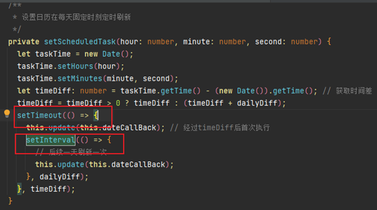

 
 

#### 分析思路

详见[JS泄漏问题分析方法](https://developer.huawei.com/consumer/cn/doc/best-practices/bpta-stability-leak-way#section1183695881312)。
 
 

#### 分析步骤

某应用AppIconCalendar对象大量泄漏触发虚拟机OOM，打开heapdump，按照RetainedSize排序后发现AppIconCalendarEvent.ts18对象存在307.54MB，该对象及其引用的内存占用81%内存**。**
 

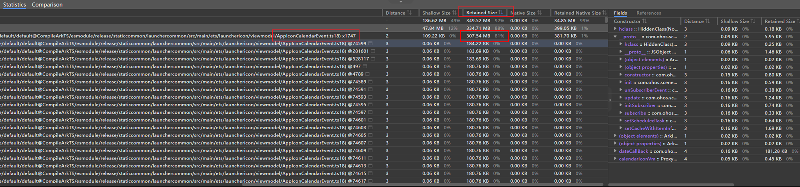

 
结合代码分析**：**这两个定时器没有停止逻辑导致组件对象一直未析构。
 
 

#### 修复方法

使用定时器组件销毁时调用clearTimeout和clearInterval，否则对象无法析构。
 
 

#### 内存泄漏-native jemalloc泄漏类案例

 

#### 概述

该类问题的典型特征是申请堆内存后没有释放，导致堆内存不断膨胀。
 
 

#### 问题现象

某应用进程内存持续泄漏上报内存泄漏事件，泄漏严重的进程系统会进行查杀管控，用户体验为应用冷启或应用闪退。
 
 

#### 问题代码

```cpp
void DemoCase(int length)
{
    // ...
    int bitmapLength = inShapeFromImage[0] * inShapeForImage[1];
    auto bitmapBuffer = new unsigned char[bitmapLength];
    for (int i = 0; i < length; ++i) {
        if (!CheckBuffer(bitmapBuffer)) {
            free(bitmapBuffer);
            bitmapBuffer = nullptr;
            return;
        }
    }
    // ...
    delete[] bitmapBuffer;
}
```
 
 

#### 分析思路

详见[Native泄漏问题分析方法](https://developer.huawei.com/consumer/cn/doc/best-practices/bpta-stability-leak-way#section1658571616574)。
 
 

#### 分析步骤
1. 某应用发生PSS泄漏，分析采样文件，发现峰值内存TopPssMemory为2.9GB左右，且内存一直增长。
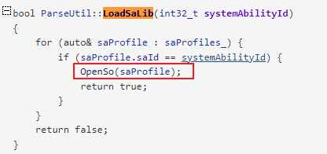

2. 分析smaps日志，发现本例当前应用jemalloc大小2.6GB（Pss 1.5GB + SwapPss 1.1GB），占总内存的90%+，因此怀疑堆内存泄漏。
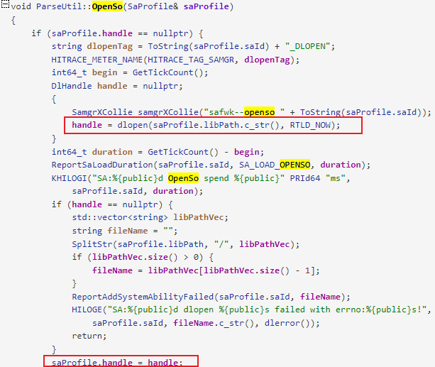

3. 按照[资源泄漏类问题分析方法](https://developer.huawei.com/consumer/cn/doc/best-practices/bpta-stability-leak-way)基于NMD和profiler继续分析：观察NMD信息发现，size=12582912字节的内存块占用最多（allocated值最大），优先怀疑该内存块。

  
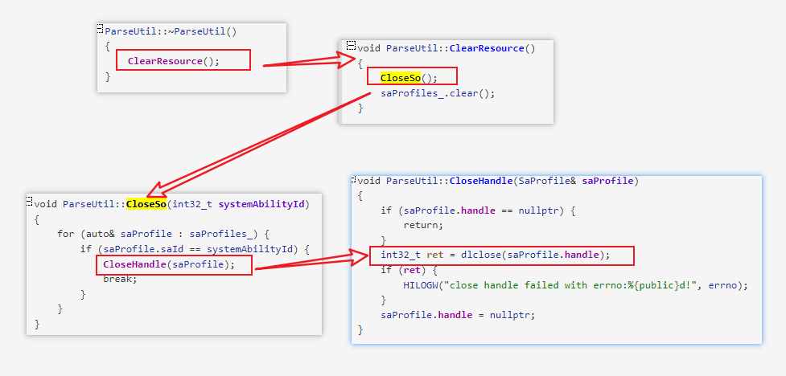

4. 分析profiler日志：
方法一：将获取到的profiler文件导入DevEco Studio  Profiler插件中进行分析，通过将profile框选All Heap，解析profiler，选择Created & Existing，内存块会按照占用比例排序，此处展开的栈中，存在内存占用比例为98%的可疑点，展开可疑点发现其中大头是“operator new(unsigned long)”申请了89次。此时，将步骤3中NMD找到的size=12582912字节的内存块乘以89再对齐是GB单位，大小恰好是1.04G左右，由此可确认进程的真正泄漏点。
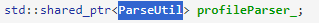

5. 方法二：本地搭建[Smartperf](https://gitcode.com/openharmony-sig/smartperf)环境，并导入profiler日志进行解析，框选All Heap，解析profiler，选择Created & Existing，在搜索框中搜索12582912字节，并查看调用栈，确认泄漏点。
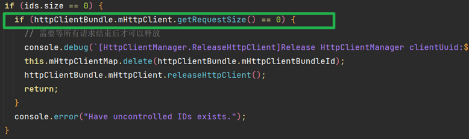

6. 分析代码：bitmapBuffer new后只在异常分支释放了内存，主分支未释放。
 
 

#### 修复方法

通过new等方式申请的内存使用完成后需要及时释放掉。
 
 

#### 内存泄漏-内核内存泄漏类案例

 

#### 概述

该类问题的典型特征是申请了ashmem、ION、GPU等内核类内存，但是未释放导致的内存膨胀。
 
 

#### 问题现象

轻微泄漏可能不会造成用户的体验问题，但是该类内存发生严重泄漏后，可能会导致整机低内存，进而出现整机稳定性问题。
 
 

#### 分析思路

详见[ION泄漏分析方法](https://developer.huawei.com/consumer/cn/doc/best-practices/bpta-stability-leak-way#section5493141412410)。
 
 

#### 分析步骤
1. 分析sample文件，可确认整机ION内存在16:37-16:52期间内存波动较明显。
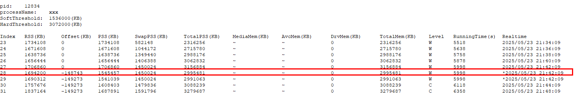

2. 根据memleak-kernel-[module]-0-[timestamp].txt中ION节点信息，看到上报进程process7的ION内存占用3.3G，基本可以确定第一步中的内存增长时间段就是process7进程泄漏时间段。
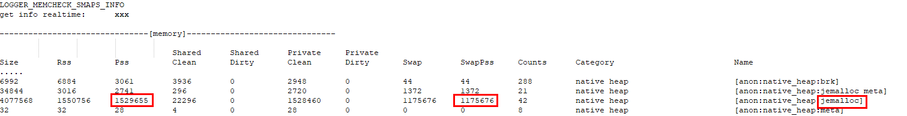

3. 进一步查看process7进程详细ION内存信息，主要是192512000和48128000 bytes大小的内存块占用，再结合内存增长时间段的日志，以及这些buffer都设定了pixelmap name，确认是ImageEditorCallback存在ION泄漏。
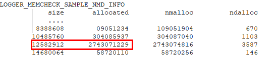

4. 根据pixelmap name已确定创建pixelmap的位置（由于开发者已通过[setMemoryNameSync](https://gitcode.com/openharmony/docs/blob/c897489afd3a7403adfff79f20b8596ca05f7bcf/zh-cn/application-dev/reference/apis-image-kit/js-apis-image.md#setmemorynamesync13)接口接入能力，所以能快速定位到pixelmap创建位置），查看相关代码确认问题根因：创建pixelmap后未关闭句柄。
 
 

#### 修复方法
1. 使用image等组件申请pixmap，需严格关注对象的生命周期，在使用结束后直接使用release或destroy等API接口释放，而非依赖于GC回收。
2. 尽量使用缩略图加载，而非原图加载。
 
 

#### 建议与总结

详见[ashmem/ION泄漏问题优化建议](https://developer.huawei.com/consumer/cn/doc/best-practices/bpta-stability-leak-opt#section12687113513352)。
 
 

#### 句柄泄漏-文件句柄泄漏案例

 

#### 概述

该类型问题的典型特征为打开了数量较多的文件句柄，但是没有关闭。
 
 

#### 问题现象

上报句柄泄漏事件，无体验类影响。
 
 

#### 分析思路

详见[句柄泄漏分析方法](https://developer.huawei.com/consumer/cn/doc/best-practices/bpta-stability-leak-way#section9594173320417)。
 
 

#### 分析步骤

某service上报句柄泄漏，/system/lib占用的so句柄个数超过5000。
 
```json
time: 2024/07/09 08:32:16
pid: 1386
process: XXX
leaked fd nums: 5022
FdCount	FileDescriptor
*****************************
Leaked fd Top 10:
179	/system/lib64/libinsightintent_common.z.so
179	/system/lib64/platformsdk/libzuri.z.so
179	/system/lib64/platformsdk/libpdfinner.z.so
179	/system/lib64/platformsdk/libwant.z.so
179	/system/lib64/platformsdk/libtokenid_sdk.z.so
179	/system/lib64/chipset-pub-sdk/libcrypto_openssl.z.so
179	/system/lib64/chipset-pub-sdk/libjsoncpp.z.so
179	/system/lib64/libai_datasync_innerapi.z.so
179	/system/lib64/libai_framework_innerapi.z.so
179	/system/lib64/libai_label_detect_innerapi.z.so
Top Dir Type 10:
5012	/system/lib
3	/dev/null
1	/dev/binder
1	/dev/kmsg
1	/dev/tty
1	/sys/kernel/debug/tracing/trace_marker
*****************************
LOGGER_MEMCHECK_FD_STACK_INFO
pid: 1386
get stack time: 2024/07/09 08:42:22
==============================FdTrack Stack==============================
Generated by HiviewDFX @OpenHarmony
==============================Sorted by num==============================
num 1134 bt [/system/lib64/libfdleak_tracker.so+0x20248] [/system/lib/ld-musl-aarch64.so.1+0x144dfc] [/system/lib/ld-musl-aarch64.so.1+0xba5b0] [/system/lib/ld-musl-aarch64.so.1+0xd1ac] [/system/lib/ld-musl-aarch64.so.1+0x7c30] [/system/lib/ld-musl-aarch64.so.1+0x48e8] [/system/lib/ld-musl-aarch64.so.1+0x62bc] [/system/lib64/platformsdk/libsamgr_common.z.so+0xdb88] [/system/lib64/platformsdk/libsamgr_common.z.so+0xde58] 
num 42 bt [/system/lib64/libfdleak_tracker.so+0x20248] [/system/lib/ld-musl-aarch64.so.1+0x144dfc] [/system/lib/ld-musl-aarch64.so.1+0xba5b0] [/system/lib/ld-musl-aarch64.so.1+0xd1ac] [/system/lib/ld-musl-aarch64.so.1+0x7c30] [/system/lib/ld-musl-aarch64.so.1+0x6250] [/system/lib64/platformsdk/libsamgr_common.z.so+0xdb88] [/system/lib64/platformsdk/libsamgr_common.z.so+0xde58] [/system/lib64/platformsdk/libsystem_ability_fwk.z.so+0x127d0] 
num 1 bt [/system/lib64/libfdleak_tracker.so+0x20248] [/system/lib/ld-musl-aarch64.so.1+0x144dfc] [/system/lib64/platformsdk/libfwmark_client.z.so+0x4208] [/system/lib64/chipset-pub-sdk/libhisysevent.z.so+0x13abc] [/system/lib64/chipset-pub-sdk/libhisysevent.z.so+0x13eec] [/system/lib64/chipset-pub-sdk/libhisysevent.z.so+0x7b08] [/system/lib64/platformsdk/libsamgr_common.z.so+0x26c38] [/system/lib64/platformsdk/libsamgr_common.z.so+0x26998] [/system/lib64/platformsdk/libsamgr_common.z.so+0x294ec] 
END
```
 
分析：
 1. /system/lib句柄超过5000个，从Leaked fd Top 10信息可以看出都是so，推测为dlopen获取的句柄未释放。
2. 根据“LOGGER_MEMCHECK_FD_STACK_INFO”下hook open等系统调用获取的调用栈，发现第一个栈在hook的10分钟内申请了1134次句柄，高度怀疑这个栈。
3. 获取这些so的符号表（libfdleak_tracker.so是维测用的so，可忽略），通过[addr2line](https://llvm.org/docs/CommandGuide/llvm-symbolizer.html)获取调用栈。
4. 对应的代码调用顺序如下：
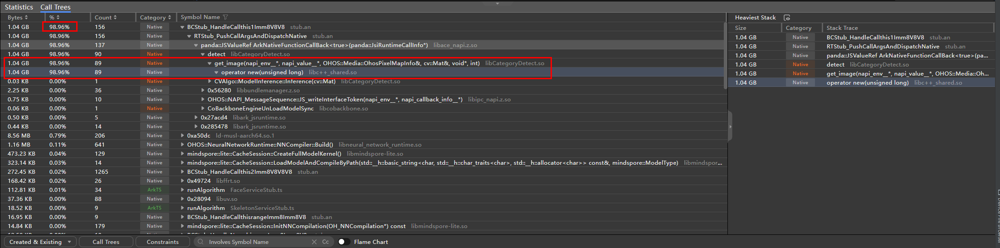


  dlopen获取的句柄的位置如下，fd存在saProfile，需要进一步查看saProfile的释放时机。

  
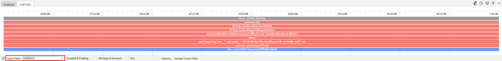


  搜索saProfile的释放位置，发现只有在ParseUtil对象析构时才会释放fd资源。

  
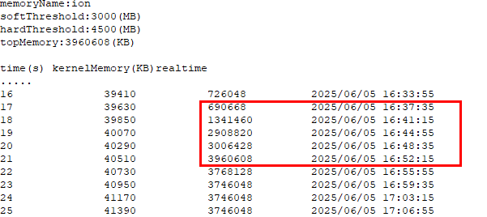


  找到调用者的位置，发现定义了一个类内的私有变量，而这个类的对象一直没析构，导致profileParser_一直没析构，从而导致fd资源一直未释放。

  


 
 

#### 修复方法

将ParseUtil对象及时释放或将私有变量改成局部变量进行释放。
 
 

#### 建议与总结

详见[句柄泄漏问题优化建议](https://developer.huawei.com/consumer/cn/doc/best-practices/bpta-stability-leak-opt#section7375193133214)。
 
 

#### 线程泄漏案例

 

#### 概述

该类问题的典型特征是未考虑边界场景，导致一直频繁创建线程。
 
 

#### 问题现象

上报线程泄漏事件，应用出现卡顿或卡死问题。
 
 

#### 分析思路

详见[线程泄漏分析方法](https://developer.huawei.com/consumer/cn/doc/best-practices/bpta-stability-leak-way#section282262074411)。
 
 

#### 分析步骤

某应用network和Network File Thread线程泄漏，运维态泄漏检测机制抓取的日志如下：
 
```text
process: 某应用
summary: 826
 
Top 10 Thread Name:
309  network
309  Network File Th
......
=================================
```
 1. 流水/故障日志分析故障日志发现network和Network File Thread线程皆占用309个，流水日志发现一直在断网重连。
2. 结合业务代码分析查看代码发现每个httpclient都会创建单独线程，流水日志中追踪该申请和释放日志。
3. 接口调用不匹配发现业务需要主动调用releaseHttpClient才能释放线程，领域未感知。
 
 

#### 修复方法

导入@ohos.net.http使用url请求能力的应用，一定要释放线程
 1. HttpClient.getRequestSize()接口判断当前是否还有未结束的请求
2. HttpClient.releaseHttpClient()接口释放线程
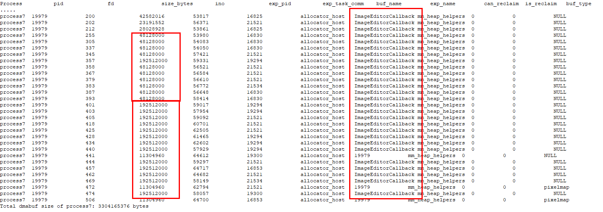

 
 

#### 建议与总结

详见[线程泄漏问题优化建议](https://developer.huawei.com/consumer/cn/doc/best-practices/bpta-stability-leak-opt#section10137113593613)。
