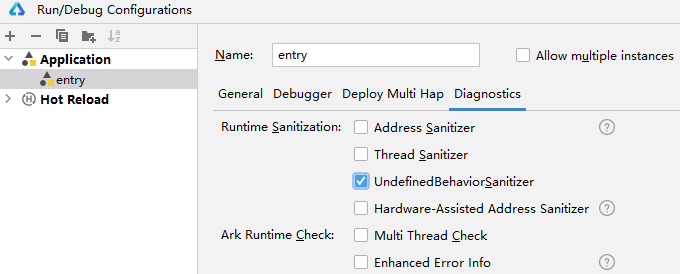
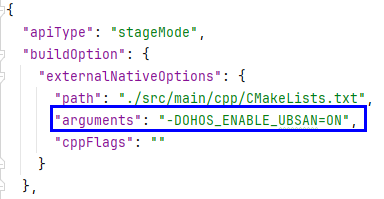

# 使用UBSan检测未定义行为

更新时间：2026-03-12 08:45:02

来源：https://developer.huawei.com/consumer/cn/doc/best-practices/bpta-stability-ubsan-detection

##### 原理概述

 
代码中出现未定义行为最初可能不会引发问题，但随着代码复杂度增加，未定义行为可能导致程序崩溃或错误，检测根源也会变得更加困难。UBSan（Undefined Behavior Sanitizer）可以检测代码中的未定义行为，帮助开发者清除由未定义行为引起的运行时错误。
 
常见的未定义UBSan异常检测类型包括：存储到未对齐地址、访问未对齐地址的成员、不是类型“bool”的有效值、除以零等。具体类型详见[UBSan异常检测类型](#section124211321406)。
 

##### 使用约束

 
ASan、TSan、UBSan 和 HWASan 不能同时开启，只能启用其中一个。
 

##### UBSan使能

可以通过以下两种方式启用UBSan。每种方式都包括DevEco Studio场景和流水线场景。
 
 

##### 方式一

**DevEco Studio场景**
 
 
点击**Run > Edit Configurations > Diagnostics**，勾选**UndefinedBehaviorSanitizer**开启检测。
 



 
**流水线场景**
 
在hvigorw命令后加上**ohos-enable-ubsan=true**的选项，执行hvigorw命令，更多options参考[hvigorw文档](https://developer.huawei.com/consumer/cn/doc/harmonyos-guides/ide-hvigor-commandline)
 
```text
hvigorw [taskNames...] ohos-enable-ubsan=true  <options>
```
 

##### 方式二

**DevEco Studio场景**
 
 
在需要启用UBSan的模块中，通过添加构建参数来开启UBSan检测。在对应模块的build-profile.json5文件中添加命令参数：
 
```text
"arguments": "-DOHOS_ENABLE_UBSAN=ON"
```
 



 
**流水线场景**
 
在AppScope/app.json5和模块build-profile.json5配置对应UBSan项后，可直接执行hvigorw命令，更多options参考[hvigorw文档](https://developer.huawei.com/consumer/cn/doc/harmonyos-guides/ide-hvigor-commandline)
 
```text
hvigorw [taskNames...]  <options>
```
 
> [!NOTE]
> 方式一的勾选操作会覆盖app.json5中的配置项，因此即使设置为false，UBSan仍会生效。

 

##### UBSan异常检测类型

 

##### store to misaligned address

 
**背景**
 
变量使用了不对齐的指针，或未对齐的引用地址。
 
**错误代码实例**
 
```text
int8_t *buffer = static_cast<int8_t*> (malloc(64));
int32_t *pointer = (int32_t *)(buffer + 1);
*pointer = 42;
```
 
**影响**
 
程序存在安全漏洞，有崩溃风险。
 
开启UBSan检测后，触发demo中的函数，faultlog报UBSAN，错误信息为：runtime error: store to misaligned address。
 
**定位思路**
 
如果有工程代码，直接开启UBSAN检测，以debug模式运行并复现错误，可以触发UBSAN，点击堆栈中的超链接即可定位到错误代码的位置。
 
```cpp
Reason:UBSAN
E:/MyCppUbsan/entry/src/main/cpp/napi_init.cpp:8:5: runtime error: store to misaligned address 0x005acba55c01 for type 'int32_t' (aka 'int'), which requires 4 byte alignment
0x005acba55c01: note: pointer points here
 00 00 00  00 00 00 00 00 00 00 00  1f dd b2 e1 57 0f 44 58  08 6e 61 6d 65 00 00 00  a0 86 01 00 00
              ^ 
    #0 0x5bd3f020e8  (/data/storage/el1/bundle/libs/arm64/libentry.so+0x20e8) (BuildId: cb738bedadc1fbdf663f3584c3546b3a16cf896d)
    #1 0x5ab8a7d908  (/system/lib64/platformsdk/libace_napi.z.so+0x3d908) (BuildId: fbb88ca45aa4ffefe148b9838dfd0db7)
    #2 0x5acfc6ca98  (/system/lib64/module/arkcompiler/stub.an+0x42ca98)
    #3 0x5acf84be54  (/system/lib64/module/arkcompiler/stub.an+0xbe54)

SUMMARY: UndefinedBehaviorSanitizer: undefined-behavior E:/MyCppUbsan/entry/src/main/cpp/napi_init.cpp:8:5 in 
==com.example.mycppubsan==25467==Process memory map follows:
	0x001a60000000-0x001a90000000	[anon:ArkTS MemPoolCache]
	0x002890000000-0x002890080000	[anon:ArkTS Heap25467non movable space]
```
 
**修改方法**
 
确保指针指向的内存地址是正确对齐的。例如，如果一个类型应该4字节对齐，那么它的地址应该是4的倍数。
 
**推荐建议**
 
避免用地址加偏移量赋值，确保指针字节对齐。
 

##### member access within misaligned address

 
**背景**
 
成员（如struct）使用了不对齐的指针，或未对齐的引用地址。
 
**错误代码实例**
 
```text
struct A {
    int32_t i32;
    int64_t i64;
};

int8_t *buffer = static_cast<int8_t*>(malloc(32));
struct A *pointer = (struct A *)(buffer + 1);
pointer->i32 = 7;
```
 
**影响**
 
程序存在安全漏洞和崩溃风险。
 
开启UBSan检测后，触发demo中的函数，faultlog报UBSAN，错误信息包含：runtime error: member access within misaligned address。
 
**定位思路**
 
如果有工程代码，直接开启UBSAN检测，在debug模式下运行并复现该错误，可以触发UBSAN。点击堆栈中的超链接即可定位到代码行，查看错误代码的位置。
 
```cpp
Reason:UBSAN
E:/MyCppUbsan/entry/src/main/cpp/napi_init.cpp:14:14: runtime error: member access within misaligned address 0x005be8bbb061 for type 'struct A', which requires 8 byte alignment
0x005be8bbb061: note: pointer points here
 00 00 00  00 00 00 00 00 00 00 00  6e 6e 65 63 74 69 6f 6e  00 00 00 00 00 00 00 00  00 00 00 00 00
              ^ 
    #0 0x5cf0b42128  (/data/storage/el1/bundle/libs/arm64/libentry.so+0x2128) (BuildId: d6de121f4d1e5fef552a5ff31b02d78637bd108f)
    #1 0x5bdc73d908  (/system/lib64/platformsdk/libace_napi.z.so+0x3d908) (BuildId: fbb88ca45aa4ffefe148b9838dfd0db7)
    #2 0x5bec62ca98  (/system/lib64/module/arkcompiler/stub.an+0x42ca98)
    #3 0x5bec20be54  (/system/lib64/module/arkcompiler/stub.an+0xbe54)

SUMMARY: UndefinedBehaviorSanitizer: undefined-behavior E:/MyCppUbsan/entry/src/main/cpp/napi_init.cpp:14:14 in 
==com.example.mycppubsan==34776==Process memory map follows:
	0x001d00000000-0x001d30000000	[anon:ArkTS MemPoolCache]
```
 
**修改方法**
 
确保指针指向的内存地址是正确对齐的。例如，如果一个类型应该4字节对齐，那么它的地址应该是4的倍数。
 
**推荐建议**
 
避免用地址加偏移量赋值，确保指针字节对齐。
 

##### not a valid value for type 'bool'

 
**背景**
 
使用既不是true也不是false的bool值。通常是由不恰当的类型转换导致的，例如将整数或指针用作bool值。
 
**错误代码实例**
 
```text
int res = 2;
bool *predicate = (bool *)&res;
if (*predicate) { // Error: variable is not a valid Boolean
    res+=2;
}
```
 
**影响**
 
程序存在安全漏洞和崩溃风险。
 
开启UBSan检测后，触发demo中的函数，faultlog报告UBSAN错误。
 
**定位思路**
 
如果存在工程代码，直接开启UBSAN检测，在debug模式下运行并复现错误，可以触发UBSAN，点击堆栈中的超链接即可定位到错误代码行。
 
```cpp
Reason:UBSAN
E:/MyCppUbsan/entry/src/main/cpp/napi_init.cpp:14:9: runtime error: load of value 2, which is not a valid value for type 'bool'
    #0 0x5bf7842114  (/data/storage/el1/bundle/libs/arm64/libentry.so+0x2114) (BuildId: bdc801021450256f3247301024c66ba35759bd8e)
    #1 0x5adb1bd908  (/system/lib64/platformsdk/libace_napi.z.so+0x3d908) (BuildId: fbb88ca45aa4ffefe148b9838dfd0db7)
    #2 0x5af332ca98  (/system/lib64/module/arkcompiler/stub.an+0x42ca98)
    #3 0x5af2f0be54  (/system/lib64/module/arkcompiler/stub.an+0xbe54)

SUMMARY: UndefinedBehaviorSanitizer: undefined-behavior E:/MyCppUbsan/entry/src/main/cpp/napi_init.cpp:14:9 in 
==com.example.mycppubsan==61094==Process memory map follows:
0x001bb0000000-0x001be0000000	[anon:ArkTS MemPoolCache]
```
 
**修改方法**
 
使用恰当的类型转换
 
**推荐建议**
 
不要使用不恰当的类型转换
 

##### index xxx out of bounds for type xxx

 
**背景**
 
固定长度的数组越界
 
**错误代码实例**
 
```text
int array[5];
for (int i = 0; i <= 5; ++i) {
    array[i] += 1; // Error: out-of-bounds access on the last iteration
}
```
 
**影响**
 
程序存在安全漏洞，有崩溃风险。
 
开启UBSan检测后，触发demo中的函数应用闪退，faultlog报UBSAN。
 
**定位思路**
 
如果有工程代码，直接开启UBSAN检测并在debug模式下运行以复现错误，触发UBSAN后，直接点击堆栈中的超链接即可定位到错误代码的位置。
 
```cpp
Reason:UBSAN
E:/MyCppUbsan/entry/src/main/cpp/napi_init.cpp:14:9: runtime error: index 5 out of bounds for type 'int[5]'
    #0 0x5c2e6820f0  (/data/storage/el1/bundle/libs/arm64/libentry.so+0x20f0) (BuildId: ee21ab192e41eb5f030d33e86321164eb1171fae)
    #1 0x5b1217d908  (/system/lib64/platformsdk/libace_napi.z.so+0x3d908) (BuildId: fbb88ca45aa4ffefe148b9838dfd0db7)
    #2 0x5b2a46ca98  (/system/lib64/module/arkcompiler/stub.an+0x42ca98)
    #3 0x5b2a04be54  (/system/lib64/module/arkcompiler/stub.an+0xbe54)

SUMMARY: UndefinedBehaviorSanitizer: undefined-behavior E:/MyCppUbsan/entry/src/main/cpp/napi_init.cpp:14:9 in 
==com.example.mycppubsan==555==Process memory map follows:
	0x001c60000000-0x001c90000000	[anon:ArkTS MemPoolCache]
```
 
**修改方法**
 
确保访问数组的位置不超过固定数组的最大索引。
 
**推荐建议**
 
在访问数组前校验访问位置和数组长度。
 

##### xxx is outside the range of representable values of type 'int'

 
**背景**
 
浮点数转换引起的溢出
 
**错误代码实例**
 
```text
double n = 10e50;
int m = (int)n;
```
 
**影响**
 
程序存在安全漏洞，有崩溃风险。
 
开启UBSan检测后，触发demo中的函数，faultlog报UBSAN。
 
**定位思路**
 
开启UBSan检测后，触发demo中的函数，faultlog报UBSAN，错误信息为：runtime error: 1e+51 超出 'int' 类型的表示范围。
 
```cpp
Reason:UBSAN
E:/MyCppUbsan/entry/src/main/cpp/napi_init.cpp:13:18: runtime error: 1e+51 is outside the range of representable values of type 'int'
    #0 0x5bd2602080  (/data/storage/el1/bundle/patch_3000001/libs/arm64/libentry.so+0x2080) (BuildId: 17cfd563ada1f6699d9c7369d90e109ffae4ee1b)
    #1 0x5ab6cbd908  (/system/lib64/platformsdk/libace_napi.z.so+0x3d908) (BuildId: fbb88ca45aa4ffefe148b9838dfd0db7)
    #2 0x5ace06ca98  (/system/lib64/module/arkcompiler/stub.an+0x42ca98)
    #3 0x5acdc4be54  (/system/lib64/module/arkcompiler/stub.an+0xbe54)

SUMMARY: UndefinedBehaviorSanitizer: undefined-behavior E:/MyCppUbsan/entry/src/main/cpp/napi_init.cpp:13:18 in 
==com.example.mycppubsan==9054==Process memory map follows:
	0x001ab0000000-0x001ae0000000	[anon:ArkTS MemPoolCache]
```
 
**修改方法**
 
使用更大范围的数据类型
 
**推荐建议**
 
强转之前检查值，确保不会溢出
 

##### division by zero

 
**背景**
 
/0操作
 
**错误代码实例**
 
```text
int sum = 10;
for (int i = 0; i < 64; ++i) {
    sum /= i; 
}
```
 
**影响报错**
 
程序存在安全漏洞，并有崩溃的风险。
 
开启UBSan检测后，触发demo中的函数，faultlog报UBSAN，字段：runtime error: division by zero。
 
**定位思路**
 
如果工程包含代码，直接启用UBSAN检测，以Debug模式运行并复现错误。触发UBSAN后，点击堆栈中的超链接可直接定位到错误代码行，查看错误代码的具体位置。
 
```cpp
Reason:UBSAN
E:/MyCppUbsan/entry/src/main/cpp/napi_init.cpp:12:14: runtime error: division by zero
    #0 0x5ba7a01ff4  (/data/storage/el1/bundle/libs/arm64/libentry.so+0x1ff4) (BuildId: 4d6b1a9e31b1ab325be3aabdd184a22476349eaf)
    #1 0x5a8edbd908  (/system/lib64/platformsdk/libace_napi.z.so+0x3d908) (BuildId: fbb88ca45aa4ffefe148b9838dfd0db7)
    #2 0x5aa366ca98  (/system/lib64/module/arkcompiler/stub.an+0x42ca98)
    #3 0x5aa324be54  (/system/lib64/module/arkcompiler/stub.an+0xbe54)

SUMMARY: UndefinedBehaviorSanitizer: undefined-behavior E:/MyCppUbsan/entry/src/main/cpp/napi_init.cpp:12:14 in 
==com.example.mycppubsan==24346==Process memory map follows:
	0x001170000000-0x0011a0000000	[anon:ArkTS MemPoolCache]
```
 
**修改方法**
 
确保除数不为0
 
**推荐建议**
 
增加对除数的非零判断
