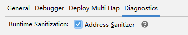
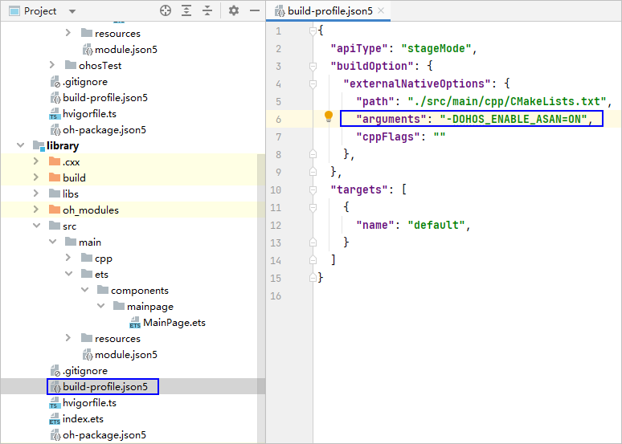
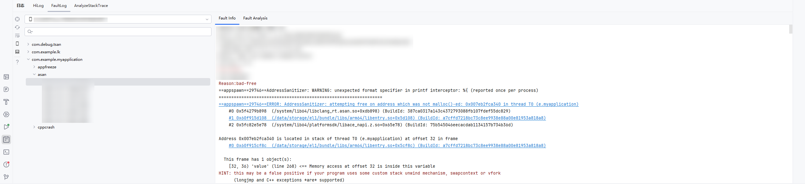
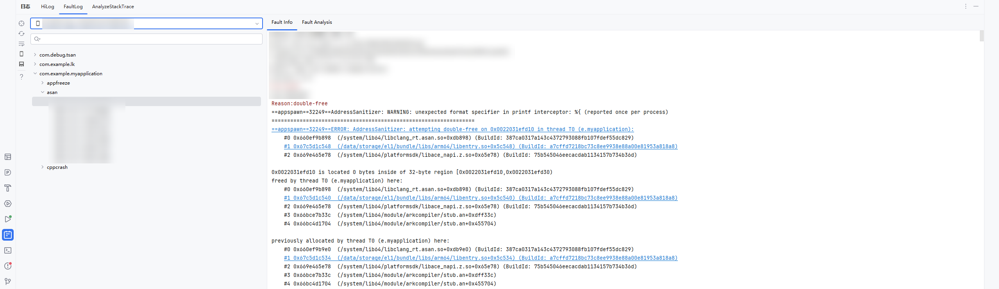
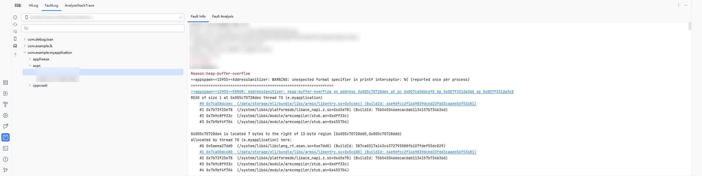
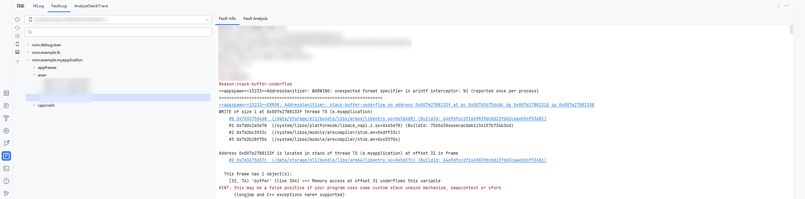
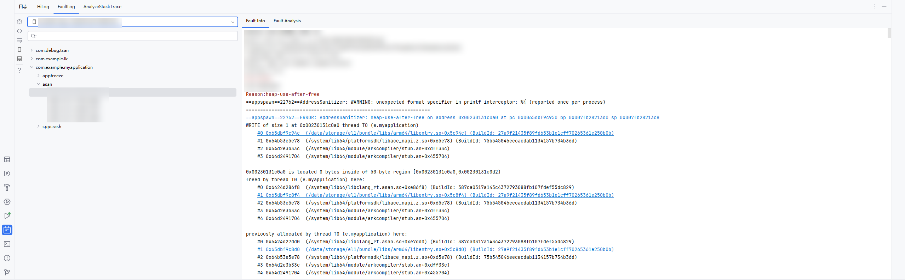
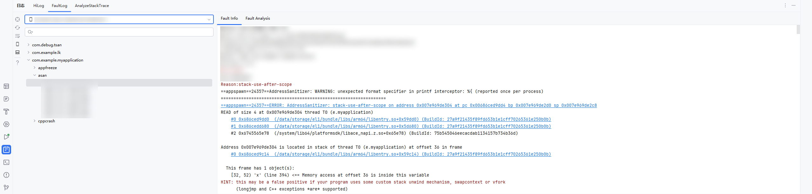

# 使用ASan检测内存错误

更新时间：2026-03-12 08:45:02

来源：https://developer.huawei.com/consumer/cn/doc/best-practices/bpta-stability-asan-detection

ASan的能力概述和检测原理可参看[地址越界检测能力概述](https://developer.huawei.com/consumer/cn/doc/best-practices/bpta-stability-address-sanitizer-overview)以及[ASan检测原理](https://developer.huawei.com/consumer/cn/doc/best-practices/bpta-stability-address-sanitizer-principle#section159561141247)，适用于开发态调试压测场景。
 

##### 使用约束

 
- 如果应用内的任一模块使能ASan，那么entry模块需同时使能ASan。如果entry模块未使能ASan，该应用在启动时将闪退，出现CPP Crash报错。
- ASan和其他内存检测工具能力互斥，不能同时开启，ASan、TSan、UBSan、HWASan、GWP-ASan五个只能开启其中一个。

 

##### 配置参数

ASAN_OPTIONS：在运行时配置ASan的行为，包括设置检测级别、输出格式、内存错误报告的详细程度等。常用参数请查看[表1](#table103859310379)。
 
ASAN_OPTIONS支持在app.json5中配置，也支持在Run/Debug Configurations中配置。app.json5的优先级较高，即两种方式都配置后，以app.json5中的配置为准。
 
 

##### 在app.json5中配置环境变量

 
打开AppScope > app.json5文件，添加配置示例如下。
 
```text
{
  "app": {
    "appEnvironments": [
      {
        "name": "ASAN_OPTIONS",
        "value": "log_exe_name=true abort_on_error=0 print_cmdline=true" // 示例仅供参考，具体以实际为准
      },
    ],
    ...
  }
}
```
 
配置ASan参数时，建议带上以下各项，并设置成默认值，然后按需进行修改。
 
```text
allow_user_segv_handler=1
detect_odr_violation=0
alloc_dealloc_mismatch=0
allocator_may_return_null=1
detect_container_overflow=0
abort_on_error=0
halt_on_error=0
report_globals=0
handle_abort=0
allow_user_poisoning=1
log_exe_name=true
handle_segv=0
detect_stack_use_after_return=0
print_module_map=2
handle_sigbus=0
```
 

##### 在Run/Debug Configurations中配置环境变量

 
具体请查看[配置环境变量](https://developer.huawei.com/consumer/cn/doc/harmonyos-guides/ide-run-debug-configurations#section9413113717532)。
 
表1 常用参数
  
| 参数 | 默认值 | 是否必填 | 说明 |
| --- | --- | --- | --- |
| log_exe_name | true | 是 | 不可修改。指定内存错误日志中是否包含执行文件的名称。 |
| log_path | /dev/hwasan/hwasan.log | 否 | ROM版本小于NEXT.0.0.68时必填，值不可修改；NEXT.0.0.68及以上版本不再需要该参数。 |
| abort_on_error | 0 | 是 | 指定在打印错误报告后调用abort()或_exit()。 false(0)：打印错误报告后使用_exit()结束进程。true(1)：打印错误报告后使用abort()结束进程，同时会生成cppcrash日志。 |
| strip_path_prefix | - | 否 | 内存错误日志的文件路径中去除所配置的前缀。 如：/data/storage/el1。 |
| detect_stack_use_after_return | 0 | 否 | 指定是否检查访问指向已被释放的栈空间。 false(0)：不检查。 true(1)：检查。 |
| halt_on_error | 0 | 否 | 检测内存错误后是否继续运行。 0表示继续运行。1表示结束运行。 |
| malloc_context_size | - | 否 | 内存错误发生时，显示的调用栈层数。 |
| suppressions | "" | 否 | 屏蔽文件名。 |
| handle_segv | - | 否 | 检查段错误。 |
| handle_sigill | - | 否 | 检查SIGILL信号。 |
| quarantine_size_mb | 256 | 否 | 指定检测访问指向已被释放的栈空间错误的隔离区大小。 |
 
 
更多可配置参数请参见[asan_flags](https://gitcode.com/openharmony/third_party_llvm-project/blob/master/compiler-rt/lib/asan/asan_flags.inc)。
 

##### ASan使能

可通过以下两种方式使能ASan。每种方式分为DevEco Studio场景和流水线场景。
 
 

##### 方式一 调试窗口快速使能

**DevEco Studio场景**
 
1. 在运行调试窗口，点击**Diagnostics**，勾选**Address Sanitizer**。


2. 如果有引用本地library，需在library模块的build-profile.json5文件中，配置arguments字段值为“-DOHOS_ENABLE_ASAN=ON”，表示以ASan模式编译so文件。


 
**流水线场景**
 
在hvigorw命令后加上**ohos-debug-asan=true**的选项，执行hvigorw命令，更多options参考[hvigorw文档](https://developer.huawei.com/consumer/cn/doc/harmonyos-guides/ide-hvigor-commandline)
 
```text
hvigorw [taskNames...] ohos-debug-asan=true  <options>
```
 
同上，如果有引用本地library，需在library模块的build-profile.json5文件中，配置arguments字段值为“-DOHOS_ENABLE_ASAN=ON”，表示以ASan模式编译so文件。
 

##### 方式二 配置文件方式使能

 
**DevEco Studio场景**
 1. 修改工程目录下AppScope/app.json5，添加ASan配置开关
```text
"asanEnabled": true
```
 


2. 设置模块级构建ASan插桩。在需要使能ASan的模块中，通过添加构建参数开启ASan检测插桩，在对应模块的模块级build-profile.json5中添加命令参数：

  
```text
"arguments": "-DOHOS_ENABLE_ASAN=ON"
```
 


 
> [!NOTE]
> 该参数未配置不会报错，但是除包含malloc和free函数等少数内存错误外，出现其他需要插桩检测的内存错误时，ASan无法检测到错误。

 
**流水线场景**
 
在AppScope/app.json5和模块build-profile.json5配置对应asan项后，可直接执行hvigorw命令，更多options参考[hvigorw文档](https://developer.huawei.com/consumer/cn/doc/harmonyos-guides/ide-hvigor-commandline)
 
```text
hvigorw [taskNames...] ohos-debug-asan=true  <options>
```
 
> [!NOTE]
> 当通过Diagnostics勾选启用ASan后，即便app.json5中asanEnabled设为false仍会生效。

 

##### ASan插桩验证

 
当应用依赖未经过ASan插桩的第三方或第四方库时，ASAN无法检测这些库中可能存在的越界错误。因此，对于应用所引用的第三方或第四方动态库，必须单独进行ASan插桩适配处理，以确保内存错误能够被完整捕获。 动态库插桩状态检查方法，可使用llvm-readelf工具检查目标动态库是否已完成ASan插桩，当前默认以动态库的方式链接，查询是否插桩成功命令如下：
 
```text
llvm-readelf -d libthird_party.so | grep 'libclang_rt.asan.so'
```
 
若是静态链接，可使用如下命令查询：
 
```text
llvm-readelf -s libthird_party.so | grep '__asan_init'
```
 
> [!NOTE]
> llvm-readelf工具路径为：${DevEco Studio安装目录}/sdk/default/openharmony/native/llvm/bin或者${command-line-tools安装目录}/sdk/default/openharmony/native/llvm/bin/llvm-readelf。

 

##### 运行ASan

1. 运行或调试当前应用。
2. 当程序出现内存错误时，弹出ASan log信息，点击信息中的链接即可跳转至引起内存错误的代码处（非release版本）。release版本本地无工程代码，可以使用[AnalyzeStackTrace功能](https://developer.huawei.com/consumer/cn/doc/harmonyos-guides/ide-release-app-stack-analysis)，提供要解析堆栈的so，解析结果为源码地址。


 

##### ASan异常检测类型

 
当前提供案例在[debug版本应用](https://developer.huawei.com/consumer/cn/doc/harmonyos-guides/performance-analysis-kit-terminology#debug版本应用)中可产生ASan，[release版本应用](https://developer.huawei.com/consumer/cn/doc/harmonyos-guides/performance-analysis-kit-terminology#release版本应用)因为在编译构建期间会进行代码优化，不一定会产生异常。
 
> [!NOTE]
> 对于 release版本应用 ，本地无工程代码，可以使用AnalyzeStackTrace功能，提供要解析堆栈的so，解析结果为源码地址。

  
| 常见ASan检测异常码 | 说明 | 可能的Crash信号 |
| --- | --- | --- |
| heap-buffer-overflow | 超出堆上分配的缓冲区范围。 | SIGSEGV（段错误）、SIGABRT（异常终止）、SIGILL（非法指令）、SIGFPE（浮点异常）、SIGTRAP（陷阱）。 |
| stack-buffer-overflow/underflow | 超出栈上分配的缓冲区范围。 | SIGSEGV（段错误）、SIGABRT（异常终止）、SIGILL（非法指令）、SIGFPE（浮点异常）、SIGTRAP（陷阱）。 |
| heap-use-after-free | 使用了释放后的堆内存。 | SIGSEGV（段错误）、SIGABRT（异常终止）。 |
| stack-use-after-scope | 栈变量在作用域外被使用。 | SIGSEGV（段错误）、SIGABRT（异常终止）。 |
| attempt-free-nonallocated-memory | 尝试释放了非堆对象（non-heap object）或未分配内存。 | SIGSEGV（段错误）、SIGABRT（异常终止）。 |
| double-free | 重复释放内存。 | SIGSEGV（段错误）、SIGABRT（异常终止）。 |
 
 

##### heap-buffer-overflow

 
**背景**
 
访问堆内存越界（上下界）
 
**代码实例**
 
```cpp
int HeapBufferOverflow()
{
    char* buffer;
    buffer = (char *)malloc(100);
    *(buffer + 101) = 'n';
    *(buffer + 102) = 'n';
    free(buffer);
    printf("address: %p", buffer);
    return buffer[1];
}
```
 
**影响**
 
导致程序存在安全漏洞，并有崩溃风险。
 
开启ASan检测后，触发demo中的函数，应用闪退报ASan，包含字段：AddressSanitizer: heap-buffer-overflow
 
**定位思路**
 
如果有工程代码，直接开启ASan检测，debug模式运行后复现该错误，可以触发ASan，直接点击堆栈中的超链接定位到代码行，能看到错误代码的位置。
 



 
**修改方法**
 
注意数组的长度，不要访问越界
 
**推荐建议**
 
已知大小的数组注意访问不要越界，访问已知大小数组前先判断访问位置是否落在边界外
 

##### stack-buffer-overflow

 
**背景**
 
访问越栈内存上界
 
**代码实例**
 
```cpp
int StackBufferOverflow() {
    int subscript = 43;
    char buffer[42];
    buffer[subscript] = 42;
    printf("address: %p", buffer);
    return 0;
}
```
 
**影响**
 
导致程序存在安全漏洞，并有崩溃风险。
 
开启ASan检测后，触发demo中的函数，应用闪退报ASan，包含字段：AddressSanitizer: stack-buffer-overflow
 
**定位思路**
 
如果有工程代码，直接开启ASan检测，debug模式运行后复现该错误，可以触发ASan，直接点击堆栈中的超链接定位到代码行，能看到错误代码的位置。
 



 
**优化建议**
 
访问索引不应大于上界。
 

##### stack-buffer-underflow

 
**背景**
 
访问越栈内存下界
 
**代码实例**
```cpp
int StackBufferUnderflow() {
    int subscript = -1;
    char buffer[42];
    buffer[subscript] = 42;
    printf("address: %p", buffer);
    return 0;
}
```
 
 
**影响**
 
导致程序存在安全漏洞，并有崩溃风险。
 
开启ASan检测后，触发demo中的函数，应用闪退报ASan，包含字段：AddressSanitizer: stack-buffer-underflow
 
**定位思路**
 
如果有工程代码，直接开启ASan检测，debug模式运行后复现该错误，可以触发ASan，直接点击堆栈中的超链接定位到代码行，能看到错误代码的位置。
 



 
**优化建议**
 
访问索引不应小于下界。
 

##### heap-use-after-free

 
**背景**
 
当指针指向的内存被释放后，仍然通过该指针访问已经被释放的内存，就会触发heap-use-after-free。
 
**代码实例**
 
```cpp
int HeapUseAfterFree()
{
    int *array = new int[100];
    delete[] array;
    return array[5];
}
```
 
**影响**
 
导致程序存在安全漏洞，并有崩溃风险。
 
开启ASan检测后，触发demo中的函数，应用闪退报ASan，显示reason为AddressSanitizer: heap-use-after-free
 
**定位思路**
 
如果有工程代码，直接开启ASan检测，debug模式运行后复现该错误，可以触发ASan，直接点击堆栈中的超链接定位到代码行，能看到错误代码的位置。
 


 
**修改方法**
 
已经释放的指针不要再使用，将指针设置为NULL/nullptr。
 
**推荐建议**
 
使用智能指针，或实现一个free()函数的替代版本或者delete析构器来保证指针的重置。
 

##### stack-use-after-scope

 
**背景**
 
栈变量在作用域之外被使用。
 
**代码实例**
 
```cpp
int *gp;
bool b = true;
int StackUseAfterScope() {
    if (b) {
        int x[5];
        gp = x + 1;
        printf("address: %p", gp);
    }
    return *gp;
}
```
 
**影响**
 
导致程序存在安全漏洞，并有崩溃风险。
 
开启ASan检测后，触发demo中的函数，应用闪退报ASan，包含字段：AddressSanitizer: stack-use-after-scope
 
**定位思路**
 
如果有工程代码，直接开启ASan检测，debug模式运行后复现该错误，可以触发ASan，直接点击堆栈中的超链接定位到代码行，能看到错误代码的位置。
 


 
**优化建议**
 
在作用域内使用该变量。
 

##### attempt-free-nonallocated-memory

 
**背景**
 
尝试释放了非堆对象（non-heap object）或未分配内存。
 
**代码实例**
 
```cpp
int AttempFreeNonAllocatedMem() {
    int value = 42;
    printf("address: %p", &value);
    free(&value);
    return 0;
}
```
 
**影响**
 
导致程序存在安全漏洞，并有崩溃风险。
 
开启ASan检测后，触发demo中的函数，应用闪退报ASan，包含字段：
 
AddressSanitizer: attempting free on address which was not malloc()-ed
 
**定位思路**
 
如果有工程代码，直接开启ASan检测，debug模式运行后复现该错误，可以触发ASan，直接点击堆栈中的超链接定位到代码行，能看到错误代码的位置。
 


 
**优化建议**
 
不要对非堆对象或未分配的内存使用free()函数。
 

##### double-free

 
**背景**
 
重复释放内存
 
**代码实例**
 
```cpp
int DoubleFree() {
    int *x = new int[42];
    printf("address: %p", &x);
    delete [] x;
    delete [] x;
    return 0;
}
```
 
**影响**
 
导致程序存在安全漏洞，并有崩溃风险。
 
开启ASan检测后，触发demo中的函数，应用闪退报ASan，包含字段：AddressSanitizer: attempting double-free
 
**定位思路**
 
如果有工程代码，直接开启ASan检测，debug模式运行后复现该错误，可以触发ASan，直接点击堆栈中的超链接定位到代码行，能看到错误代码的位置。
 


 
**修改方法**
 
已经释放一次的指针，不要再重复释放。
 
**推荐建议**
 
变量定义声明时初始化为NULL，释放内存后也应立即将变量重置为NULL，这样每次释放之前都可以通过判断变量是否为NULL来判断是否可以释放。
 

##### Other-categories

未知的错误类型，持续更新中。
 
 

##### 日志规格和日志获取方式

请参看[日志获取方式](https://developer.huawei.com/consumer/cn/doc/harmonyos-guides/address-sanitizer-guidelines#日志获取方式)和[ASan日志规格](https://developer.huawei.com/consumer/cn/doc/harmonyos-guides/address-sanitizer-guidelines#asan日志规格)。
