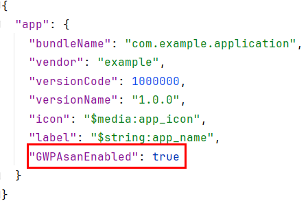

# 使用GWP-ASan检测内存错误

更新时间：2026-05-18 00:55:31

来源：https://developer.huawei.com/consumer/cn/doc/best-practices/bpta-stability-gwpasan-detection

GWP-ASan的能力概述和检测原理可参看[地址越界检测能力概述](https://developer.huawei.com/consumer/cn/doc/best-practices/bpta-stability-address-sanitizer-overview)以及[GWP-ASan检测原理](https://developer.huawei.com/consumer/cn/doc/best-practices/bpta-stability-address-sanitizer-principle#section555616291854)，适用于运行态商用场景。

#### 使用约束
ASan、TSan、UBSan、HWASan、GWP-ASan不能同时开启，五个只能开启其中一个。

#### GWP-ASan使能
可通过以下两种方式使能GWP-ASan。

#### 方式一 修改app.json5配置文件
在app.json5中添加"GWPAsanEnabled": true配置，如下图所示。


开启GWP-ASan检测后，如果应用发生地址越界问题，且该问题正好被GWP-ASan采样监控，GWP-ASan会记录地址越界事件并且使进程崩溃，开发者可以通过订阅地址越界事件来获取相关信息，请参考：[地址越界事件介绍](https://developer.huawei.com/consumer/cn/doc/harmonyos-guides/hiappevent-watcher-address-sanitizer-events)。

#### 方式二 调用hidebug接口
从API 20开始，GWP-ASan可通过hidebug接口配置参数，可配置参数如下：

| 名称 | 默认值 | 是否必填 | 说明 |
| --- | --- | --- | --- |
| alwaysEnabled | false | 否 | true：100%开启GWP-ASan，与app.json5中GWPAsanEnabled标签功能一致。 false：1/128概率开启GWP-ASan，在应用冷启动时候会判断是否开启。 注意：若在app.json5中设置了 GWPAsanEnabled，将会覆盖该参数。 |
| sampleRate | 2500 | 否 | GWP-ASan采样频率。1/sampleRate的概率对分配的内存进行采样。 建议值：≥1000，默认参数下性能开销小于1%。采样频率过小会显著影响性能，若调整参数请开发者自行保证用户体验。 |
| maxSimutaneousAllocations | 1000 | 否 | 最大分配的插槽数。当插槽用尽时，新分配的内存将不再受监控。释放已使用的内存后，其占用的插槽将自动复用，以便于后续内存的监控。 建议值：≤20000，每个插槽会额外占用约4.5KB内存，默认参数下约占4.5MB，过大可能导致VMA超限崩溃。 |

接口具体使用方式，可查看[@ohos.hidebug (Debug调试)](https://developer.huawei.com/consumer/cn/doc/harmonyos-references/js-apis-hidebug#hidebugenablegwpasangrayscale20)。

#### GWP-ASan异常检测类型
下面给出异常检测码和相关日志

#### double free

```ts
*** GWP-ASan detected a memory error ***
Double Free at 0x7f9c31efe0 (a 20-byte allocation) by thread 11725 here:
  #0 0x7f9c548958 (/lib/ld-musl-aarch64.so.1+0x1ea958)
  #1 0x7f9c548730 (/lib/ld-musl-aarch64.so.1+0x1ea730)
  #2 0x7f9c4810f4 (/lib/ld-musl-aarch64.so.1+0x1230f4)
  #3 0x7f9c4018d8 (/lib/ld-musl-aarch64.so.1+0xa38d8)
  #4 0x7f9c547944 (/lib/ld-musl-aarch64.so.1+0x1e9944)
  #5 0x7f9c418c64 (/lib/ld-musl-aarch64.so.1+0xbac64)
  #6 0x555dab4f24 (/data/local/tmp/double_free+0x1f24)
  #7 0x7f9c4c1668 (/lib/ld-musl-aarch64.so.1+0x163668)
  #8 0x555dab4c14 (/data/local/tmp/double_free+0x1c14)
0x7f9c31efe0 was deallocated by thread 11725 here:
  #0 0x7f9c5480f8 (/lib/ld-musl-aarch64.so.1+0x1ea0f8)
  #1 0x7f9c54799c (/lib/ld-musl-aarch64.so.1+0x1e999c)
  #2 0x7f9c418c64 (/lib/ld-musl-aarch64.so.1+0xbac64)
  #3 0x555dab4f1c (/data/local/tmp/double_free+0x1f1c)
  #4 0x7f9c4c1668 (/lib/ld-musl-aarch64.so.1+0x163668)
  #5 0x555dab4c14 (/data/local/tmp/double_free+0x1c14)
0x7f9c31efe0 was allocated by thread 11725 here:
  #0 0x7f9c5480f8 (/lib/ld-musl-aarch64.so.1+0x1ea0f8)
  #1 0x7f9c547780 (/lib/ld-musl-aarch64.so.1+0x1e9780)
  #2 0x7f9c41882c (/lib/ld-musl-aarch64.so.1+0xba82c)
  #3 0x555dab4f10 (/data/local/tmp/double_free+0x1f10)
  #4 0x7f9c4c1668 (/lib/ld-musl-aarch64.so.1+0x163668)
  #5 0x555dab4c14 (/data/local/tmp/double_free+0x1c14)
*** End GWP-ASan report ***
```

#### use_after_free

```ts
*** GWP-ASan detected a memory error ***
Use After Free at 0x7fa2ab6000 (0 bytes into a 10-byte allocation at 0x7fa2ab6000) by thread 3594 here:
  #0 0x7fa4781f18 (/lib/ld-musl-aarch64.so.1+0x1e9f18)
  #1 0x7fa4781cf0 (/lib/ld-musl-aarch64.so.1+0x1e9cf0)
  #2 0x7fa46ba6bc (/lib/ld-musl-aarch64.so.1+0x1226bc)
  #3 0x7fa463b298 (/lib/ld-musl-aarch64.so.1+0xa3298)
  #4 0x5562e886ac (/data/local/tmp/gwp_asan_use_after_free_test+0x16ac)
  #5 0x7fa46fac28 (/lib/ld-musl-aarch64.so.1+0x162c28)
  #6 0x5562e88654 (/data/local/tmp/gwp_asan_use_after_free_test+0x1654)
0x7fa2ab6000 was deallocated by thread 3594 here:
  #0 0x7fa47816b8 (/lib/ld-musl-aarch64.so.1+0x1e96b8)
  #1 0x7fa4780f5c (/lib/ld-musl-aarch64.so.1+0x1e8f5c)
  #2 0x7fa46522cc (/lib/ld-musl-aarch64.so.1+0xba2cc)
  #3 0x5562e886ac (/data/local/tmp/gwp_asan_use_after_free_test+0x16ac)
  #4 0x7fa46fac28 (/lib/ld-musl-aarch64.so.1+0x162c28)
  #5 0x5562e88654 (/data/local/tmp/gwp_asan_use_after_free_test+0x1654)
0x7fa2ab6000 was allocated by thread 3594 here:
  #0 0x7fa47816b8 (/lib/ld-musl-aarch64.so.1+0x1e96b8)
  #1 0x7fa4780d40 (/lib/ld-musl-aarch64.so.1+0x1e8d40)
  #2 0x7fa4652010 (/lib/ld-musl-aarch64.so.1+0xba010)
  #3 0x5562e886a4 (/data/local/tmp/gwp_asan_use_after_free_test+0x16a4)
  #4 0x7fa46fac28 (/lib/ld-musl-aarch64.so.1+0x162c28)
  #5 0x5562e88654 (/data/local/tmp/gwp_asan_use_after_free_test+0x1654)
*** End GWP-ASan report ***
```

#### invalid free left

```ts
*** GWP-ASan detected a memory error ***
Invalid (Wild) Free at 0x7f8551ffff (1 byte to the left of a 1-byte allocation at 0x7f85520000) by thread 11708 here:
  #0 0x7f856746b8 (/lib/ld-musl-aarch64.so.1+0x1286b8)
  #1 0x7f85674268 (/lib/ld-musl-aarch64.so.1+0x128268)
  #2 0x7f856cfbc0 (/lib/ld-musl-aarch64.so.1+0x183bc0)
  #3 0x7f855ea1b4 (/lib/ld-musl-aarch64.so.1+0x9e1b4)
  #4 0x7f8567349c (/lib/ld-musl-aarch64.so.1+0x12749c)
  #5 0x556c5c67a8 (/data/local/tmp/gwp_asan_invalid_free_left_test+0x17a8)
  #6 0x7f855ecd74 (/lib/ld-musl-aarch64.so.1+0xa0d74)
  #7 0x556c5c6754 (/data/local/tmp/gwp_asan_invalid_free_left_test+0x1754)
0x7f8551ffff was allocated by thread 11708 here:
  #0 0x7f85673f20 (/lib/ld-musl-aarch64.so.1+0x127f20)
  #1 0x7f85673298 (/lib/ld-musl-aarch64.so.1+0x127298)
  #2 0x7f856891b4 (/lib/ld-musl-aarch64.so.1+0x13d1b4)
  #3 0x556c5c67a0 (/data/local/tmp/gwp_asan_invalid_free_left_test+0x17a0)
  #4 0x7f855ecd74 (/lib/ld-musl-aarch64.so.1+0xa0d74)
  #5 0x556c5c6754 (/data/local/tmp/gwp_asan_invalid_free_left_test+0x1754)
*** End GWP-ASan report ***
```

#### invalid free right

```ts
*** GWP-ASan detected a memory error ***
Invalid (Wild) Free at 0x7fa4e96ff1 (1 byte to the right of a 1-byte allocation at 0x7fa4e96ff0) by thread 11852 here:
  #0 0x7fa4fec6b8 (/lib/ld-musl-aarch64.so.1+0x1286b8)
  #1 0x7fa4fec268 (/lib/ld-musl-aarch64.so.1+0x128268)
  #2 0x7fa5047bc0 (/lib/ld-musl-aarch64.so.1+0x183bc0)
  #3 0x7fa4f621b4 (/lib/ld-musl-aarch64.so.1+0x9e1b4)
  #4 0x7fa4feb49c (/lib/ld-musl-aarch64.so.1+0x12749c)
  #5 0x55625737a8 (/data/local/tmp/gwp_asan_invalid_free_right_test+0x17a8)
  #6 0x7fa4f64d74 (/lib/ld-musl-aarch64.so.1+0xa0d74)
  #7 0x5562573754 (/data/local/tmp/gwp_asan_invalid_free_right_test+0x1754)
0x7fa4e96ff1 was allocated by thread 11852 here:
  #0 0x7fa4febf20 (/lib/ld-musl-aarch64.so.1+0x127f20)
  #1 0x7fa4feb298 (/lib/ld-musl-aarch64.so.1+0x127298)
  #2 0x7fa50011b4 (/lib/ld-musl-aarch64.so.1+0x13d1b4)
  #3 0x55625737a0 (/data/local/tmp/gwp_asan_invalid_free_right_test+0x17a0)
  #4 0x7fa4f64d74 (/lib/ld-musl-aarch64.so.1+0xa0d74)
  #5 0x5562573754 (/data/local/tmp/gwp_asan_invalid_free_right_test+0x1754)
*** End GWP-ASan report ***
```

#### buffer underflow

```ts
*** GWP-ASan detected a memory error ***
Buffer Underflow at 0x7f8db1aff1 (4063 bytes to the left of a 48-byte allocation at 0x7f8db1bfd0) by thread 12086 here:
  #0 0x7f8dc716b8 (/lib/ld-musl-aarch64.so.1+0x1286b8)
  #1 0x7f8dc71268 (/lib/ld-musl-aarch64.so.1+0x128268)
  #2 0x7f8dcccbc0 (/lib/ld-musl-aarch64.so.1+0x183bc0)
  #3 0x7f8dbe71b4 (/lib/ld-musl-aarch64.so.1+0x9e1b4)
  #4 0x55801287f8 (/data/local/tmp/gwp_asan_buffer_overflow_test+0x17f8)
  #5 0x7f8dbe9d74 (/lib/ld-musl-aarch64.so.1+0xa0d74)
  #6 0x558012879c (/data/local/tmp/gwp_asan_buffer_overflow_test+0x179c)
0x7f8db1aff1 was allocated by thread 12086 here:
  #0 0x7f8dc70f20 (/lib/ld-musl-aarch64.so.1+0x127f20)
  #1 0x7f8dc70298 (/lib/ld-musl-aarch64.so.1+0x127298)
  #2 0x7f8dc861b4 (/lib/ld-musl-aarch64.so.1+0x13d1b4)
  #3 0x7f8d4ef4fc (/system/lib64/libc++.so+0xaf4fc)
  #4 0x7f8da76818 (/system/lib64/chipset-pub-sdk/libhilog.so+0x36818)
  #5 0x7f8da76af8 (/system/lib64/chipset-pub-sdk/libhilog.so+0x36af8)
  #6 0x7f8da6f228 (/system/lib64/chipset-pub-sdk/libhilog.so+0x2f228)
  #7 0x7f8dbd4d18 (/lib/ld-musl-aarch64.so.1+0x8bd18)
  #8 0x7f8dbd8cc4 (/lib/ld-musl-aarch64.so.1+0x8fcc4)
  #9 0x7f8dd00370 (/lib/ld-musl-aarch64.so.1+0x1b7370)
  #10 0x7f8dbd4d18 (/lib/ld-musl-aarch64.so.1+0x8bd18)
  #11 0x7f8dbd4b28 (/lib/ld-musl-aarch64.so.1+0x8bb28)
  #12 0x7f8dbe9d58 (/lib/ld-musl-aarch64.so.1+0xa0d58)
  #13 0x558012879c (/data/local/tmp/gwp_asan_buffer_overflow_test+0x179c)
*** End GWP-ASan report ***
```

#### 日志规格和日志获取方式
请参看[日志获取方式](https://developer.huawei.com/consumer/cn/doc/harmonyos-guides/address-sanitizer-guidelines#日志获取方式)和[GWP-ASan日志规格](https://developer.huawei.com/consumer/cn/doc/harmonyos-guides/address-sanitizer-guidelines#gwp-asan日志规格)。