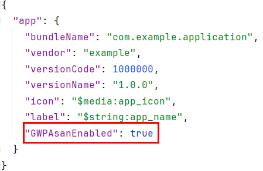

# 使用GWP-ASan检测内存错误

更新时间：2026-06-12 07:22:00

来源：https://developer.huawei.com/consumer/cn/doc/best-practices/bpta-stability-gwpasan-detection

GWP-ASan的能力概述和检测原理可参看[地址越界检测能力概述](https://developer.huawei.com/consumer/cn/doc/best-practices/bpta-stability-address-sanitizer-overview)以及[GWP-ASan检测原理](https://developer.huawei.com/consumer/cn/doc/best-practices/bpta-stability-address-sanitizer-principle#section555616291854)，适用于运行态商用场景。
 

#### 使用约束

 
ASan、TSan、UBSan、HWASan、GWP-ASan不能同时开启，五个只能开启其中一个。
 

#### GWP-ASan使能

 
可通过以下两种方式使能GWP-ASan。
 

#### 方式一 修改app.json5配置文件

 
在app.json5中添加"GWPAsanEnabled": true配置，如下图所示。
 



 
开启GWP-ASan检测后，如果应用发生地址越界问题，且该问题正好被GWP-ASan采样监控，GWP-ASan会记录地址越界事件并且使进程崩溃，开发者可以通过订阅地址越界事件来获取相关信息，请参考：[地址越界事件介绍](https://developer.huawei.com/consumer/cn/doc/harmonyos-guides/hiappevent-watcher-address-sanitizer-events)。
 

#### 方式二 调用hidebug接口

 
从API 20开始，GWP-ASan可通过hidebug接口配置参数。从API 24开始，新增isRecover参数，用于控制应用在100%开启GWP-ASan时，是否以可恢复模式运行。可配置参数如下：
  
| 名称 | 默认值 | 是否必填 | 说明 |
| --- | --- | --- | --- |
| alwaysEnabled | false | 否 | true：100%开启GWP-ASan，与app.json5中GWPAsanEnabled标签功能一致。 false：1/128概率开启GWP-ASan，在应用冷启动时候会判断是否开启。 注意：若在app.json5中设置了 GWPAsanEnabled，将会覆盖该参数。 |
| sampleRate | 2500 | 否 | GWP-ASan采样频率。1/sampleRate的概率对分配的内存进行采样。 建议值：≥1000，默认参数下性能开销小于1%。采样频率过小会显著影响性能，若调整参数请开发者自行保证用户体验。 |
| maxSimutaneousAllocations | 1000 | 否 | 最大分配的插槽数。当插槽用尽时，新分配的内存将不再受监控。释放已使用的内存后，其占用的插槽将自动复用，以便于后续内存的监控。 建议值：≤20000，每个插槽会额外占用约4.5KB内存，默认参数下约占4.5MB，过大可能导致VMA超限崩溃。 |
| isRecover24+ | false | 否 | 用于控制应用以100%概率开启GWP-ASan时，是否以可恢复模式运行。 true：当GWP-ASan以100%概率开启时，应用以可恢复模式运行。在该模式下，系统检测到地址越界故障后，避免因检测机制本身导致进程崩溃；但对于已造成非法内存访问的错误，应用仍可能发生崩溃。 false：当GWP-ASan以100%概率开启时，应用以不可恢复模式运行。 注意：该参数只在“以100%概率开启GWP-ASan”场景下生效；1/128概率开启场景下默认为可恢复，不受isRecover控制。 |
 
 
接口具体使用方式，可查看[@ohos.hidebug (Debug调试)](https://developer.huawei.com/consumer/cn/doc/harmonyos-references/js-apis-hidebug#hidebugenablegwpasangrayscale20)。
 

#### GWP-ASan异常检测类型

 
GWP-ASan异常检测类型、代码实例及分析定位思路如下。
 

#### use after free

**背景**
 
use after free（释放后使用）类型指的是程序在堆内存已经被free/delete释放后，仍通过旧指针继续访问该内存。当对一块已分配的内存进行释放时，slot会变成不可访问状态；所以再次使用时，会报错上报use after free异常。
 
**代码实例**
 
```cpp
static napi_value UseAfterFree([[maybe_unused]] napi_env env, [[maybe_unused]] napi_callback_info info)
{
    int count = 3000;
    int size = 1024;
    for (int i = 0; i < count; i++) {
        int* p = static_cast<int*>(malloc(size));
        // For more details to IsInGwpAsanGuard, please refer to the document 'Instruction'.
        if (!IsInGwpAsanGuard(p)) {
            continue;
        }
        p[0] = 1;
        free(p);
        p[0] = 0;
    }
    return {};
}
```
 
**影响**
 
指针指向的内存被释放后，仍通过该指针访问该内存，将导致程序存在安全漏洞和崩溃风险。
 
**定位思路**
 
use after free问题日志包含如下字段：
 
```text
Reason:GWP-ASAN
*** GWP-ASan detected a memory error ***
Use After Free at xxx (xxx bytes into a xx-byte allocation at xxx) by thread xxx here:   //实际访问已释放内存调用栈
......
xxx was deallocated by thread xxx here:   //内存释放调用栈
......
xxx was allocated by thread xxx here:   //内存最初分配调用栈
......
```
 
若存在工程代码，直接开启GWP-ASan检测，在debug模式下运行以复现use after free问题。点击故障日志中调用栈的超链接可直接定位到代码行，也可通过反编译解析出具体代码，确认问题根因。
 
```text
Reason:GWP-ASAN
*** GWP-ASan detected a memory error ***
Use After Free at 0x5bb1c2cc00 (0 bytes into a 1024-byte allocation at 0x5bb1c2cc00) by thread 32490 here:
 #0 0x5bb5b0bab8  (/data/storage/el1/bundle/libs/arm64/libentry.so+0xbab8) (BuildId: c9afeef4cf1ebf1e492c5886301054bc0f959cfe)
 #1 0x5b8e730a20  (/system/lib64/platformsdk/libace_napi.z.so+0x70a20) (BuildId: c902a8d91b50f7a25686415edf933520)
 #2 0x5ba828d1e8  (/system/lib64/module/arkcompiler/stub.an+0xe8c1e8)
 #3 0x5ba787edac  (/system/lib64/module/arkcompiler/stub.an+0x47ddac)
0x5bb1c2cc00 was deallocated by thread 32490 here:
 #0 0x5b01d56308  (/lib/ld-musl-aarch64.so.1+0x157308) (BuildId: 0a18abca27f391c78e76aa767de106a3)
 #1 0x5b01d4e634  (/lib/ld-musl-aarch64.so.1+0x14f634) (BuildId: 0a18abca27f391c78e76aa767de106a3)
 #2 0x5bb5b0bab0  (/data/storage/el1/bundle/libs/arm64/libentry.so+0xbab0) (BuildId: c9afeef4cf1ebf1e492c5886301054bc0f959cfe)
 #3 0x5b8e730a20  (/system/lib64/platformsdk/libace_napi.z.so+0x70a20) (BuildId: c902a8d91b50f7a25686415edf933520)
 #4 0x5ba828d1e8  (/system/lib64/module/arkcompiler/stub.an+0xe8c1e8)
 #5 0x5ba787edac  (/system/lib64/module/arkcompiler/stub.an+0x47ddac)
0x5bb1c2cc00 was allocated by thread 32490 here:
 #0 0x5b01d56308  (/lib/ld-musl-aarch64.so.1+0x157308) (BuildId: 0a18abca27f391c78e76aa767de106a3)
 #1 0x5b01d4e304  (/lib/ld-musl-aarch64.so.1+0x14f304) (BuildId: 0a18abca27f391c78e76aa767de106a3)
 #2 0x5b01d717ec  (/lib/ld-musl-aarch64.so.1+0x1727ec) (BuildId: 0a18abca27f391c78e76aa767de106a3)
 #3 0x5b01dfc4a0  (/lib/ld-musl-aarch64.so.1+0x1fd4a0) (BuildId: 0a18abca27f391c78e76aa767de106a3)
 #4 0x5bb5b0ba84  (/data/storage/el1/bundle/libs/arm64/libentry.so+0xba84) (BuildId: c9afeef4cf1ebf1e492c5886301054bc0f959cfe)
 #5 0x5b8e730a20  (/system/lib64/platformsdk/libace_napi.z.so+0x70a20) (BuildId: c902a8d91b50f7a25686415edf933520)
 #6 0x5ba828d1e8  (/system/lib64/module/arkcompiler/stub.an+0xe8c1e8)
 #7 0x5ba787edac  (/system/lib64/module/arkcompiler/stub.an+0x47ddac)
*** End GWP-ASan report ***
```
 
**修改方法**
 
1. 确保堆内存在最后一次使用完成后再释放，或在释放后清空所有悬空引用；释放后不再通过原指针或其他别名指针访问该内存。
 
2. 利用智能指针自动管理生命周期。
 
**推荐建议**
 
1. C++代码优先使用智能指针管理生命周期。
 
2. 释放内存后，及时将指针置为nullptr，降低使用悬空指针的风险。
 
3. 对于临时变量，应明确其作用域和生命周期，避免将局部对象地址、临时对象指针或已释放堆对象指针传递到作用域外继续使用。
 
4. 避免在异步回调、线程任务、缓存列表中保存裸指针；如必须保存，需要明确对象生命周期。
 
 

#### double free

**背景**
 
double free指堆内存被释放两次：第一次释放后该指针已失效，若程序再次调用free/delete，会破坏堆数据结构导致异常。释放时，GWP-ASan会检查meta中的数据，若该地址之前已标记为释放，则主动触发异常信号，上报double free问题。
 
**代码实例**
 
```cpp
static napi_value DoubleFree([[maybe_unused]] napi_env env, [[maybe_unused]] napi_callback_info info)
{
    int count = 3000;
    int size = 64;
    for (int i = 0; i < count; i++) {
        char* p = static_cast<char*>(malloc(size));
        // For more details to IsInGwpAsanGuard, please refer to the document 'Instruction'.
        if (!IsInGwpAsanGuard(p)) {
            continue;
        }
        free(p);
        free(p);
    }
    return {};
}
```
 
**影响**
 
重复释放同一块内存，导致程序存在安全漏洞，并有崩溃风险。
 
**定位思路**
 
double free日志一般包含如下字段：
 
```text
Reason:GWP-ASAN
*** GWP-ASan detected a memory error ***
Double Free at xxx (a xx-byte allocation) by thread xxx here:  //第二次内存释放调用栈
......
xxx was deallocated by thread xxx here:  //第一次内存释放调用栈
......
xxx was allocated by thread xxx here:  //内存申请调用栈
......
```
 
若存在工程代码，直接开启GWP-ASan检测，在debug模式下运行以复现double free问题。直接点击故障日志调用栈的超链接即可定位到代码行，或通过反编译解析出具体代码行，确定问题根因。
 
 
```text
Reason:GWP-ASAN
*** GWP-ASan detected a memory error ***
Double Free at 0x5bb1c1e000 (a 64-byte allocation) by thread 32252 here:
 #0 0x5b01d4e5e0  (/lib/ld-musl-aarch64.so.1+0x14f5e0) (BuildId: 0a18abca27f391c78e76aa767de106a3)
 #1 0x5bb5d4ba14  (/data/storage/el1/bundle/libs/arm64/libentry.so+0xba14) (BuildId: c9afeef4cf1ebf1e492c5886301054bc0f959cfe)
 #2 0x5b8e730a20  (/system/lib64/platformsdk/libace_napi.z.so+0x70a20) (BuildId: c902a8d91b50f7a25686415edf933520)
 #3 0x5ba828d1e8  (/system/lib64/module/arkcompiler/stub.an+0xe8c1e8)
 #4 0x5ba787edac  (/system/lib64/module/arkcompiler/stub.an+0x47ddac)
0x5bb1c1e000 was deallocated by thread 32252 here:
 #0 0x5b01d56308  (/lib/ld-musl-aarch64.so.1+0x157308) (BuildId: 0a18abca27f391c78e76aa767de106a3)
 #1 0x5b01d4e634  (/lib/ld-musl-aarch64.so.1+0x14f634) (BuildId: 0a18abca27f391c78e76aa767de106a3)
 #2 0x5bb5d4ba0c  (/data/storage/el1/bundle/libs/arm64/libentry.so+0xba0c) (BuildId: c9afeef4cf1ebf1e492c5886301054bc0f959cfe)
 #3 0x5b8e730a20  (/system/lib64/platformsdk/libace_napi.z.so+0x70a20) (BuildId: c902a8d91b50f7a25686415edf933520)
 #4 0x5ba828d1e8  (/system/lib64/module/arkcompiler/stub.an+0xe8c1e8)
 #5 0x5ba787edac  (/system/lib64/module/arkcompiler/stub.an+0x47ddac)
0x5bb1c1e000 was allocated by thread 32252 here:
 #0 0x5b01d56308  (/lib/ld-musl-aarch64.so.1+0x157308) (BuildId: 0a18abca27f391c78e76aa767de106a3)
 #1 0x5b01d4e304  (/lib/ld-musl-aarch64.so.1+0x14f304) (BuildId: 0a18abca27f391c78e76aa767de106a3)
 #2 0x5b01d717ec  (/lib/ld-musl-aarch64.so.1+0x1727ec) (BuildId: 0a18abca27f391c78e76aa767de106a3)
 #3 0x5b01dfc4a0  (/lib/ld-musl-aarch64.so.1+0x1fd4a0) (BuildId: 0a18abca27f391c78e76aa767de106a3)
 #4 0x5bb5d4b9ec  (/data/storage/el1/bundle/libs/arm64/libentry.so+0xb9ec) (BuildId: c9afeef4cf1ebf1e492c5886301054bc0f959cfe)
 #5 0x5b8e730a20  (/system/lib64/platformsdk/libace_napi.z.so+0x70a20) (BuildId: c902a8d91b50f7a25686415edf933520)
 #6 0x5ba828d1e8  (/system/lib64/module/arkcompiler/stub.an+0xe8c1e8)
 #7 0x5ba787edac  (/system/lib64/module/arkcompiler/stub.an+0x47ddac)
*** End GWP-ASan report ***
```
 
**修改方法**
 
确认同一块内存的两次释放调用栈，明确唯一释放者，删除重复释放逻辑，或在释放后置空。
 
**推荐建议**
 
1. C++优先使用智能指针管理生命周期。
 
2. 避免裸指针多处释放。
 
3. 在接口、多线程和异步场景中明确指针所有权。
 

#### invalid free left

**背景**
 
invalid free left通常表示程序调用free/delete时传入的指针并非某个合法堆块的起始地址，而是小于该内存块起始地址的位置。当free(ptr)被调用时，GWP-ASan会检查ptr的地址，如果ptr落在左侧Guard Page的范围内，会识别非法释放，并报告invalid free left。
 
**代码实例**
 
```cpp
static napi_value InvalidFreeLeft([[maybe_unused]] napi_env env, [[maybe_unused]] napi_callback_info info)
{
    int count = 3000;
    int size = 16;
    for (int i = 0; i < count; i++) {
        char* p = static_cast<char*>(malloc(size));
        // For more details to IsInGwpAsanGuard, please refer to the document 'Instruction'.
        if (!IsInGwpAsanGuard(p)) {
            continue;
        }
        free(p - 1);
    }
    return {};
}
```
 
**影响**
 
释放了小于allocation起始地址的内存地址，导致程序存在安全漏洞和崩溃风险。
 
**定位思路**
 
invalid free left日志一般包含如下字段：
 
```text
Reason:GWP-ASAN
*** GWP-ASan detected a memory error ***
Invalid (Wild) Free at xxx(xxx byte to the left of a xxx-byte allocation at xxx) by thread xxx here: //释放无效内存地址调用栈
 ......
xxx was allocated by thread xxx here: //内存申请调用栈
......
```
 
若存在工程代码，直接启用GWP-ASan检测，在debug模式下运行以复现invalid free异常。直接点击故障日志调用栈中的超链接可定位至错误代码行，亦可通过反编译解析具体代码行，分析根因。
 
```text
Reason:GWP-ASAN
*** GWP-ASan detected a memory error ***
Invalid (Wild) Free at 0x5bb1c18fef (1 byte to the left of a 16-byte allocation at 0x5bb1c18ff0) by thread 39823 here:
 #0 0x5b01d4e57c  (/lib/ld-musl-aarch64.so.1+0x14f57c) (BuildId: 0a18abca27f391c78e76aa767de106a3)
 #1 0x5bb59cbb4c  (/data/storage/el1/bundle/libs/arm64/libentry.so+0xbb4c) (BuildId: c9afeef4cf1ebf1e492c5886301054bc0f959cfe)
 #2 0x5b8e730a20  (/system/lib64/platformsdk/libace_napi.z.so+0x70a20) (BuildId: c902a8d91b50f7a25686415edf933520)
 #3 0x5ba828d1e8  (/system/lib64/module/arkcompiler/stub.an+0xe8c1e8)
 #4 0x5ba787edac  (/system/lib64/module/arkcompiler/stub.an+0x47ddac)
0x5bb1c18fef was allocated by thread 39823 here:
 #0 0x5b01d56308  (/lib/ld-musl-aarch64.so.1+0x157308) (BuildId: 0a18abca27f391c78e76aa767de106a3)
 #1 0x5b01d4e304  (/lib/ld-musl-aarch64.so.1+0x14f304) (BuildId: 0a18abca27f391c78e76aa767de106a3)
 #2 0x5b01d717ec  (/lib/ld-musl-aarch64.so.1+0x1727ec) (BuildId: 0a18abca27f391c78e76aa767de106a3)
 #3 0x5b01dfc4a0  (/lib/ld-musl-aarch64.so.1+0x1fd4a0) (BuildId: 0a18abca27f391c78e76aa767de106a3)
 #4 0x5bb59cbb28  (/data/storage/el1/bundle/libs/arm64/libentry.so+0xbb28) (BuildId: c9afeef4cf1ebf1e492c5886301054bc0f959cfe)
 #5 0x5b8e730a20  (/system/lib64/platformsdk/libace_napi.z.so+0x70a20) (BuildId: c902a8d91b50f7a25686415edf933520)
 #6 0x5ba828d1e8  (/system/lib64/module/arkcompiler/stub.an+0xe8c1e8)
 #7 0x5ba787edac  (/system/lib64/module/arkcompiler/stub.an+0x47ddac)
*** End GWP-ASan report ***
```
 
**修改方法**
 
确认释放的指针是否位于内存块起始地址左侧，修正指针偏移，确保仅释放原始指针。
 
**推荐****建议**
 
1. 确保内存申请与释放配对使用。
 
2. 避免释放偏移地址的指针。
 
3. 优先使用智能指针管理生命周期。
 
 

#### invalid free right

**背景**
 
invalid free right表示程序释放的指针位于某个已分配内存块的“右侧”，即地址大于该堆块的结束位置，也不是合法的分配起始地址。当调用free(ptr)时，GWP-ASan会检查ptr，如果ptr落在右侧Guard Page的范围内，则会触发invalid free right。
 
**代码实例**
 
```cpp
static napi_value InvalidFreeRight([[maybe_unused]] napi_env env, [[maybe_unused]] napi_callback_info info)
{
    int count = 3000;
    int size = 16;
    for (int i = 0; i < count; i++) {
        char* p = static_cast<char*>(malloc(size));
        // For more details to IsInGwpAsanGuard, please refer to the document 'Instruction'.
        if (!IsInGwpAsanGuard(p)) {
            continue;
        }
        free(p + 1);
    }
    return {};
}
```
 
**影响**
 
释放了一个超出allocation起始地址范围的内存地址，通常是释放了偏移后的指针，导致程序存在安全漏洞及崩溃风险。
 
**定位思路**
 
invalid free right问题日志包含如下字段：
 
```text
Reason:GWP-ASAN
*** GWP-ASan detected a memory error ***
Invalid (Wild) Free at xxx(xxx byte to the right of a xxx-byte allocation at xxx) by thread xxx here:  //无效内存地址释放调用栈
......
xxx was allocated by thread xxx here:  //内存初始分配调用栈
......
```
 
如果有工程代码，开启GWP-ASan检测，在debug模式下运行以复现invalid free right异常。点击故障日志堆栈中的超链接可直接定位报错代码行，或通过反编译解析出具体报错位置，结合代码分析根因。
 
```text
Reason:GWP-ASAN
*** GWP-ASan detected a memory error ***
Invalid (Wild) Free at 0x5bb1c2c001 (1 byte to the right of a 16-byte allocation at 0x5bb1c2c000) by thread 42272 here:
 #0 0x5b01d4e57c  (/lib/ld-musl-aarch64.so.1+0x14f57c) (BuildId: 0a18abca27f391c78e76aa767de106a3)
 #1 0x5bb5c0bbe0  (/data/storage/el1/bundle/libs/arm64/libentry.so+0xbbe0) (BuildId: c9afeef4cf1ebf1e492c5886301054bc0f959cfe)
 #2 0x5b8e730a20  (/system/lib64/platformsdk/libace_napi.z.so+0x70a20) (BuildId: c902a8d91b50f7a25686415edf933520)
 #3 0x5ba828d1e8  (/system/lib64/module/arkcompiler/stub.an+0xe8c1e8)
 #4 0x5ba787edac  (/system/lib64/module/arkcompiler/stub.an+0x47ddac)
0x5bb1c2c001 was allocated by thread 42272 here:
 #0 0x5b01d56308  (/lib/ld-musl-aarch64.so.1+0x157308) (BuildId: 0a18abca27f391c78e76aa767de106a3)
 #1 0x5b01d4e304  (/lib/ld-musl-aarch64.so.1+0x14f304) (BuildId: 0a18abca27f391c78e76aa767de106a3)
 #2 0x5b01d717ec  (/lib/ld-musl-aarch64.so.1+0x1727ec) (BuildId: 0a18abca27f391c78e76aa767de106a3)
 #3 0x5b01dfc4a0  (/lib/ld-musl-aarch64.so.1+0x1fd4a0) (BuildId: 0a18abca27f391c78e76aa767de106a3)
 #4 0x5bb5c0bbbc  (/data/storage/el1/bundle/libs/arm64/libentry.so+0xbbbc) (BuildId: c9afeef4cf1ebf1e492c5886301054bc0f959cfe)
 #5 0x5b8e730a20  (/system/lib64/platformsdk/libace_napi.z.so+0x70a20) (BuildId: c902a8d91b50f7a25686415edf933520)
 #6 0x5ba828d1e8  (/system/lib64/module/arkcompiler/stub.an+0xe8c1e8)
 #7 0x5ba787edac  (/system/lib64/module/arkcompiler/stub.an+0x47ddac)
*** End GWP-ASan report ***
```
 
**修改方法**
 
确认释放的指针是否位于分配内存块右侧或尾部偏移位置，修正指针递增或越界计算，确保只释放分配函数返回的原始指针。
 
**推荐****建议**
 
1. 建议使用智能指针管理生命周期，避免手动管理内存。
 
2. 避免释放偏移地址的指针。
 
 

#### buffer overflow

**背景**
 
buffer overflow（堆内存访问越上界），指程序申请了一段堆内存，后续使用时因下标、偏移、长度或对象大小计算错误，导致访问超出该堆对象的合法范围。GWP-ASan将采样到的堆对象放入特殊保护区域，当程序访问对象边界外的右侧Guard Page时，会立即触发检测buffer overflow异常。
 
**代码实例**
 
```cpp
static napi_value BufferOverflow([[maybe_unused]] napi_env env, [[maybe_unused]] napi_callback_info info)
{
    int count = 3000;
    int bufferSize = 512;
    int overSize = 128;
    for (int i = 0; i < count; ++i) {
        int* buffer = static_cast<int*>(malloc(bufferSize));
        if (buffer == nullptr) {
            continue;
        }
        // For more details to IsInGwpAsanGuard, please refer to the document 'Instruction'.
        if (!IsInGwpAsanGuard(buffer)) {
            continue;
        }
        buffer[overSize] = 0;
        free(buffer);
    }
    return {};
}
```
 
**影响**
 
访问堆内存越上界，可能导致程序存在安全漏洞和有崩溃风险。
 
**定位思路**
 
buffer overflow日志包含如下字段：
 
```text
Reason:GWP-ASAN
*** GWP-ASan detected a memory error ***
Buffer Overflow at xxx(xxx bytes to the right of a xxx-byte allocation at xxx) by thread xxx here:   //堆内存越界调用栈
......
xxx was allocated by thread xxx here:  //内存分配调用栈
......
```
 
若存在工程代码，直接开启GWP-ASan检测，在debug模式下运行以复现buffer overflow异常，点击故障日志堆栈中的超链接可定位至错误代码位置，或通过反编译获取具体代码行，进一步定位根因。
 
```text
Reason:GWP-ASAN
*** GWP-ASan detected a memory error ***
Buffer Overflow at 0x5bb1c23000 (512 bytes to the right of a 512-byte allocation at 0x5bb1c22e00) by thread 48379 here:
 #0 0x5bb560bc98  (/data/storage/el1/bundle/libs/arm64/libentry.so+0xbc98) (BuildId: c9afeef4cf1ebf1e492c5886301054bc0f959cfe)
 #1 0x5b8e730a20  (/system/lib64/platformsdk/libace_napi.z.so+0x70a20) (BuildId: c902a8d91b50f7a25686415edf933520)
 #2 0x5ba828d1e8  (/system/lib64/module/arkcompiler/stub.an+0xe8c1e8)
 #3 0x5ba787edac  (/system/lib64/module/arkcompiler/stub.an+0x47ddac)
0x5bb1c23000 was allocated by thread 48379 here:
 #0 0x5b01d56308  (/lib/ld-musl-aarch64.so.1+0x157308) (BuildId: 0a18abca27f391c78e76aa767de106a3)
 #1 0x5b01d4e304  (/lib/ld-musl-aarch64.so.1+0x14f304) (BuildId: 0a18abca27f391c78e76aa767de106a3)
 #2 0x5b01d717ec  (/lib/ld-musl-aarch64.so.1+0x1727ec) (BuildId: 0a18abca27f391c78e76aa767de106a3)
 #3 0x5b01dfc4a0  (/lib/ld-musl-aarch64.so.1+0x1fd4a0) (BuildId: 0a18abca27f391c78e76aa767de106a3)
 #4 0x5bb560bc58  (/data/storage/el1/bundle/libs/arm64/libentry.so+0xbc58) (BuildId: c9afeef4cf1ebf1e492c5886301054bc0f959cfe)
 #5 0x5b8e730a20  (/system/lib64/platformsdk/libace_napi.z.so+0x70a20) (BuildId: c902a8d91b50f7a25686415edf933520)
 #6 0x5ba828d1e8  (/system/lib64/module/arkcompiler/stub.an+0xe8c1e8)
 #7 0x5ba787edac  (/system/lib64/module/arkcompiler/stub.an+0x47ddac)
*** End GWP-ASan report ***
```
 
**修改方法**
 
确认越界写入位置和缓冲区大小，修正索引、循环边界、长度计算或拷贝长度，确保写入不超过缓冲区右边界。
 
**推荐建议**
 
1. 访问数组或缓冲区前，应确认下标、偏移量、循环边界是否落在合法范围内。
 
2. 使用memcpy、memmove、memset、strcpy等接口时，应确保长度参数不超过目标缓冲区实际大小，避免因长度计算错误导致越界读写。
 
 

#### buffer underflow

**背景**
 
buffer underflow（堆内存访问越下界），是指程序访问了已申请的堆内存块左边界之前的地址。常见原因包括数组负下标、指针偏移计算错误等。被采样到的堆对象会放入特殊保护区域，当程序访问对象边界外的左侧Guard Page时，GWP-ASan会检测到异常并生成buffer underflow故障日志。
 
**代码实例**
 
```cpp
static napi_value BufferUnderflow([[maybe_unused]] napi_env env, [[maybe_unused]] napi_callback_info info)
{
    int count = 3000;
    int bufferSize = 4096;
    int underFlow = -1;
    for (int i = 0; i < count; ++i) {
        int* buffer = static_cast<int*>(malloc(bufferSize));
        if (buffer == nullptr) {
            continue;
        }
        // For more details to IsInGwpAsanGuard, please refer to the document 'Instruction'.
        if (!IsInGwpAsanGuard(buffer)) {
            continue;
        }
        buffer[underFlow] = 0;
        free(buffer);
    }
    return {};
}
```
 
**影响**
 
访问堆内存越下界，导致程序存在安全漏洞，并有崩溃风险。
 
**定位思路**
 
buffer underflow日志包含如下字段：
 
```text
Reason:GWP-ASAN
*** GWP-ASan detected a memory error ***
Buffer Underflow at xxx (xxx bytes to the left of a xxx-byte allocation at xxx) by thread xxx here:   //访问堆内存下越界调用栈
......
xxx was allocated by thread xxx here:  //内存分配调用栈
......
```
 
如果有工程代码，直接开启GWP-ASan检测，在debug模式下运行以复现buffer underflow异常，点击堆栈中的超链接可定位到错误代码位置，或通过反编译解析代码行，确定问题根因。
 
```text
Reason:GWP-ASAN
*** GWP-ASan detected a memory error ***
Buffer Underflow at 0x5bb1c29ffc (4 bytes to the left of a 4096-byte allocation at 0x5bb1c2a000) by thread 50893 here:
 #0 0x5bb4f8bd58  (/data/storage/el1/bundle/libs/arm64/libentry.so+0xbd58) (BuildId: c9afeef4cf1ebf1e492c5886301054bc0f959cfe)
 #1 0x5b8e730a20  (/system/lib64/platformsdk/libace_napi.z.so+0x70a20) (BuildId: c902a8d91b50f7a25686415edf933520)
 #2 0x5ba828d1e8  (/system/lib64/module/arkcompiler/stub.an+0xe8c1e8)
 #3 0x5ba787edac  (/system/lib64/module/arkcompiler/stub.an+0x47ddac)
0x5bb1c29ffc was allocated by thread 50893 here:
 #0 0x5b01d56308  (/lib/ld-musl-aarch64.so.1+0x157308) (BuildId: 0a18abca27f391c78e76aa767de106a3)
 #1 0x5b01d4e304  (/lib/ld-musl-aarch64.so.1+0x14f304) (BuildId: 0a18abca27f391c78e76aa767de106a3)
 #2 0x5b01d717ec  (/lib/ld-musl-aarch64.so.1+0x1727ec) (BuildId: 0a18abca27f391c78e76aa767de106a3)
 #3 0x5b01dfc4a0  (/lib/ld-musl-aarch64.so.1+0x1fd4a0) (BuildId: 0a18abca27f391c78e76aa767de106a3)
 #4 0x5bb4f8bd18  (/data/storage/el1/bundle/libs/arm64/libentry.so+0xbd18) (BuildId: c9afeef4cf1ebf1e492c5886301054bc0f959cfe)
 #5 0x5b8e730a20  (/system/lib64/platformsdk/libace_napi.z.so+0x70a20) (BuildId: c902a8d91b50f7a25686415edf933520)
 #6 0x5ba828d1e8  (/system/lib64/module/arkcompiler/stub.an+0xe8c1e8)
 #7 0x5ba787edac  (/system/lib64/module/arkcompiler/stub.an+0x47ddac)
*** End GWP-ASan report ***
```
 
**修改方法**
 
检查指针算数运算；验证索引值，检查是否存在负索引。
 
**推荐建议**
 
1. 减少原始指针操作，使用迭代器或索引访问。
 
2. 严格校验传入偏移量在合法范围内。
 
> [!NOTE]
> GWP-ASan会随机采样一部分的malloc和new操作，使用GWP-ASan的分配器，当发生异常时，程序会访问这些Guard Page从而触发检测。IsInGwpAsanGuard()用于检测给定的ptr指针是否位于GWP-ASan的Guard Page中，调用后可明确知道此次异常是由GWP-ASan捕获到的，并非使用系统原生分配器，从而保证debug调试时能够稳定复现GWP-ASan异常。详细代码如下： CODE18

 
 

#### 日志规格和日志获取方式

请参看[日志获取方式](https://developer.huawei.com/consumer/cn/doc/harmonyos-guides/address-sanitizer-guidelines#日志获取方式)和[GWP-ASan日志规格](https://developer.huawei.com/consumer/cn/doc/harmonyos-guides/address-sanitizer-guidelines#gwp-asan日志规格)。
