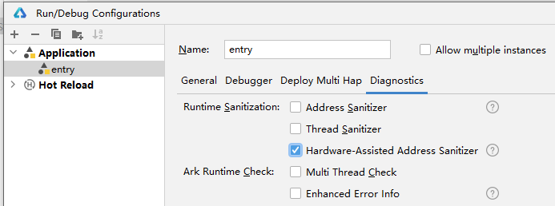
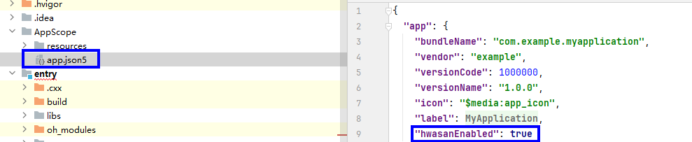
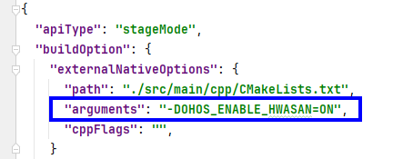
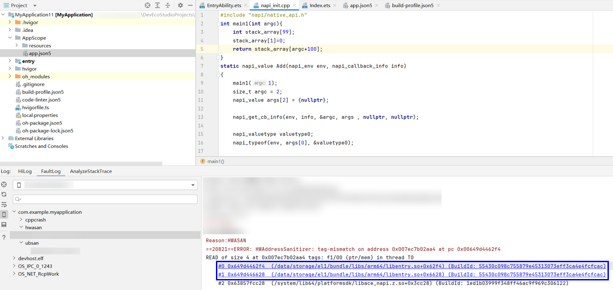
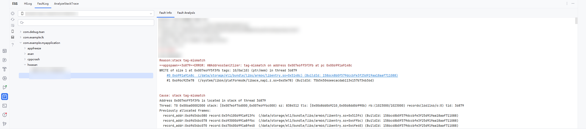
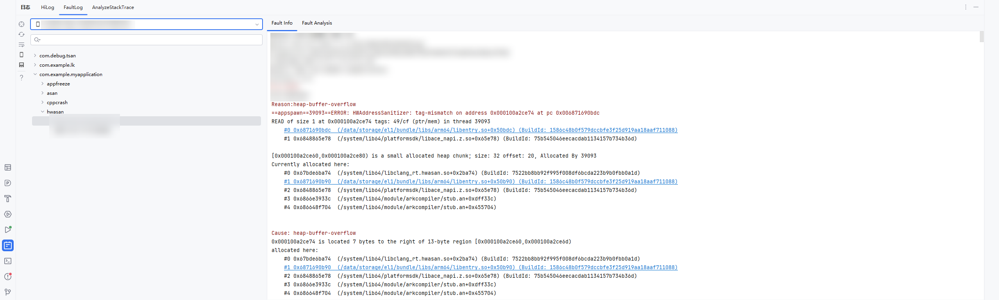
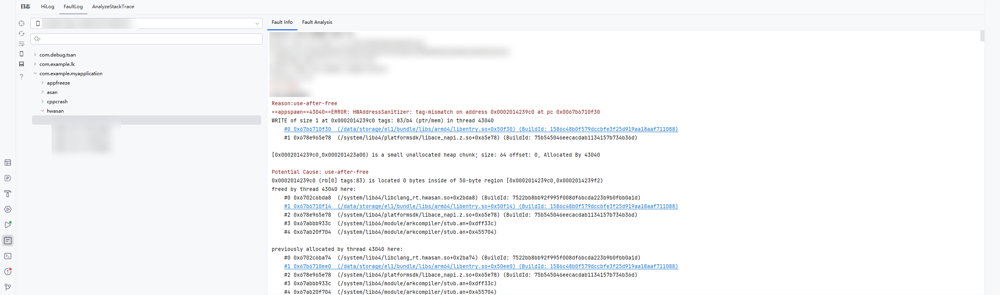

# 使用HWASan检测内存错误

更新时间：2026-03-12 08:45:02

来源：https://developer.huawei.com/consumer/cn/doc/best-practices/bpta-stability-hwasan-detection

HWASan的能力概述和检测原理可参考地址越界检测能力概述以及HWASan检测原理，适用于开发态调试压测场景。


## 使用约束


- ROM版本5.0.0.107及以上支持。
- ASan、TSan、UBSan、HWASan、GWP-ASan不能同时开启，五个只能开启其中一个。


## 配置参数


HWASAN_OPTIONS：在运行时配置HWASan的行为，包括设置检测级别、输出格式、内存错误报告的详细程度等。常用参数请查看表1。

HWASAN_OPTIONS支持在“app.json5”中配置，也支持在“Run/Debug Configurations”中配置。“app.json5”的优先级较高，即两种方式都配置后，以“app.json5”中的配置为准。


### 在app.json5中配置环境变量


打开AppScope > app.json5文件，添加配置示例如下。

```text
{
"app": {
"appEnvironments": [
{
"name": "HWASAN_OPTIONS",
"value": "abort_on_error=0 heap_history_size_main_thread=102300" // 示例仅供参考，具体以实际为准
},
],
...
}
}
```


### 在Run/Debug Configurations中配置环境变量


具体请查看配置环境变量。常用参数如下表所示。


| 参数 | 默认值 | 是否必填 | 说明 |
| --- | --- | --- | --- |
| log_exe_name | true | 是 | 不可修改。指定内存错误日志中是否包含执行文件的名称。 |
| abort_on_error | 0 | 是 | 指定在打印错误报告后调用abort()或_exit()。 false(0)：打印错误后使用exit()结束进程。true(1)：打印错误后使用abort()结束进程，同时会生成cppcrash日志。 |
| strip_path_prefix | - | 否 | 内存错误日志的文件路径中去除所配置的前缀。 如：/data/storage/el1。 |
| halt_on_error | 0 | 否 | 检测内存错误后是否继续运行。 0表示继续运行。1表示结束运行。 |
| malloc_context_size | - | 否 | 内存错误发生时，显示的调用栈层数。 |
| heap_history_size | 1023 | 否 | 指定各个线程用于保存其堆内存释放记录的RingBuffer容量。 |
| heap_history_size_main_thread | 102300 | 否 | 指定主线程用于保存其堆内存释放记录的RingBuffer容量。 |
| print_uaf_stacks_with_same_tag | 1 | 否 | 当检测到UAF查找已释放堆内存时，是否打印所有可能的同Tag堆内存。 false(0)：打印所有地址有关联的内存分配/释放信息。true(1)：仅打印相同Tag的内存分配/释放信息。 |
| freed_threads_history_size | 100 | 否 | 当线程结束后，仍保存其堆内存释放记录。freed_threads_history_size为保留的释放线程数。 |
| heap_record_min | 0 | 否 | 仅记录大于等于heap_record_min的堆内存分配，该值为0时不作判断。 |
| heap_record_max | 0 | 否 | 仅记录小于等于heap_record_max的堆内存分配，该值为0时不作判断。 |
| heap_quarantine_thread_max_count | 128 | 否 | 配置每个线程隔离区容量，在HWASAN不完全开启时，用以检测未使能HWASAN组件的UAF行为。 |
| heap_quarantine_min | 0 | 否 | 仅大于等于heap_quarantine_min的堆内存会进入隔离区，该值必须设置，否则该功能不使能。 |
| heap_quarantine_max | 0 | 否 | 仅小于等于heap_quarantine_max的堆内存会进入隔离区，该值为0时不作判断。 |
| memory_around_register_size | 128 | 否 | 当HWASAN检测到内存问题时，如果寄存器中的值指向有效内存，则打印该内存地址周围±memory_around_register_size的内容。 |
| heap_quarantine_thread_max_count | 128 | 否 | MemDebug指定隔离区容量，即free后保存在隔离区中内存块的最大个数，当超过该容量时，最先进入隔离区的内存块会离开隔离区并在检查填充值后返还给分配器。 |
| heap_quarantine_min | 0 | 否 | MemDebug释放后允许放入隔离区中内存块大小的最小值（包含），小于该值内存块不会进入隔离区。 |
| heap_quarantine_max | 1025 | 否 | MemDebug释放后允许放入隔离区中内存块大小的最大值（不含），大于等于该值的内存块不会进入隔离区。 |
| enable_heap_quarantine_debug | false | 否 | MemDebug开启后可以打印内存块在隔离区中的停留时间，以帮助调整隔离区大小。 |


更多可配置参数请参见hwasan_flags。


## 配置HWASan


可通过方式一和方式二整体使能HWASan，每种方式分为DevEco Studio场景和流水线场景，还可通过方式三对单个so库使能HWASan。


### 方式一 调试窗口快速使能


DevEco Studio场景


点击Run > Edit Configurations >Diagnostics，勾选Hardware-Assisted Address Sanitizer开启检测。





流水线场景

1. 修改工程目录下的AppScope/app.json5文件，添加HWASan配置开关。
```text
"hwasanEnabled": true
```


2. 在hvigorw命令后加上**-p ****ohos-enable-hwasan=true**的选项，执行hvigorw命令，更多options参考[hvigorw文档](https://developer.huawei.com/consumer/cn/doc/harmonyos-guides/ide-hvigor-commandline)。
```text
hvigorw [taskNames...] -p ohos-enable-hwasan=true  <options>
```


### 方式二 配置文件方式使能


DevEco Studio场景


1. 修改工程目录下的AppScope/app.json5文件，添加HWASan配置开关。
```text
"hwasanEnabled": true
```


2. 在需要使能HWASan的模块中，通过添加构建参数开启HWASan检测插桩，在对应模块的模块级build-profile.json5中添加命令参数。
```text
"arguments": "-DOHOS_ENABLE_HWASAN=ON"
```




流水线场景

在AppScope/app.json5和模块build-profile.json5配置对应HWASan项后，可直接执行hvigorw命令，更多options参考hvigorw文档。

```text
hvigorw [taskNames...] -p ohos-enable-hwasan=true  <options>
```


### 方式三 针对单个动态库使能


CMAKE编译

如果要对单个so文件进行插桩编译，可在其对应的CMakeLists.txt中添加以下编译选项：

```text
set(CMAKE_CXX_FLAGS "$CMAKE_CXX_FLAGS -shared-libasan -fsanitize=hwaddress -mllvm -hwasan-globals=0 -fno-emulated-tls -fno-omit-frame-pointer")
```


> [!NOTE]
> 如果按方式一DevEco Studio场景勾选Hardware-Assisted Address Sanitizer以后，配置app.json5中的hwasanEnabled为false，HWASan仍生效。如需同步开启MemDebug，可选择方式一或方式二使能。方式一：在app.json5中增加如下参数：memory_debug=1 heap_quarantine_max=1025 enable_heap_quarantine_debug=1。
>  方式二：进入控制台执行hdc shell param set wrap.bundleName asan_wrapper命令，其中bundleName为需要使能检测能力的应用完整包名。若要关闭MemDebug检测能力，可通过在控制台执行hdc shell param set wrap.bundleName 0命令。通过以上命令开启或关闭MemDebug，均需要重新启动应用生效。本方式不支持自定义HWASAN_OPTIONS中的参数。


## 插桩验证


当应用依赖未经过HWASan插桩的第三方或第四方库时，HWASan无法检测这些库中可能存在的越界错误。因此，对于应用所引用的第三方或第四方动态库，必须单独进行HWASan插桩适配处理，以确保内存错误能够被完整捕获。 动态库插桩状态检查方法，可使用llvm-readelf工具检查目标动态库是否已完成HWASan插桩，当前默认以动态库的方式链接，查询是否插桩成功命令如下：

```text
llvm-readelf -d libthird_party.so | grep 'libclang_rt.hwasan.so'
```

若是静态链接，可使用如下命令查询：

```text
llvm-readelf -s libthird_party.so | grep '__hwasan_init'
```


## 运行HWASan


1. 运行或调试当前应用。
2. 当程序出现内存错误时，弹出HWASan log信息，点击信息中的链接即可跳转至引起内存错误的代码处。



## HWASan异常检测类型


### stack tag-mismatch


背景

“stack tag-mismatch”在HWASan中指的是栈内存标签不匹配错误。这种错误通常发生在访问栈内存时，指针携带的标签与栈内存中存储的标签不一致，触发其异常检测码字的异常类型有：stack-buffer-overflow/underflow、stack-use-after-return。

代码实例

```cpp
// stack-buffer-overflow
int stackBufferOverflowEx() {
  int subscript = 43;
  char buffer[42];
  buffer[subscript] = 42;
  printf("address: %p", buffer);
  return 0;
}


// stack-buffer-underflow
int stackBufferUnderflowEX() {
  int subscript = -1;
  char buffer[42];
  buffer[subscript] = 42;
  printf("address: %p", buffer);
  return 0;
}


// stack-use-after-return
int *ptrEx;
__attribute__((noinline))
void FunctionThatEscapesLocalObjectEx()
{
  int local[100];
  ptrEx = &local[0];
  printf("address: %p", local);
}

int Run(int argc)
{
  FunctionThatEscapesLocalObjectEx();
  return ptrEx[argc];
}
```

影响

导致程序存在安全漏洞，并有崩溃风险。

开启HWASan检测后，触发demo中的函数，应用闪退报HWASAN，包含字段：

HWAddressSanitizer: tag-mismatch on address

Cause: stack tag-mismatch

定位思路

如果有工程代码，直接开启HWASan检测，debug模式运行后复现该错误，可以触发HWASan，直接点击堆栈中的超链接定位到代码行，能看到错误代码的位置。





优化建议

stack-buffer-overflow/underflow：访问索引要落在给定的范围内

stack-use-after-return：在作用域内使用局部变量，如果需要在函数返回后继续使用某些数据，考虑将它们存储在静态或全局变量中


### heap-buffer-overflow


背景

访问堆内存越界（上下界），触发其异常检测码字的异常类型有：heap-buffer-overflow、heap-buffer-underflow

代码实例

```cpp
// heap-buffer-overflow
void HeapBufferOverflowEx()
{
  char *buffer;
  buffer = (char *)malloc(10);
  *(buffer + 11) = 'n';
  *(buffer + 12) = 'n';
  printf("address: %p", buffer);
  free(buffer);
}

// heap-buffer-underflow
void HeapBufferUnderflowEx()
{
  char *buffer;
  buffer = (char *)malloc(10);
  *(buffer - 11) = 'n';
  *(buffer - 12) = 'n';
  printf("address: %p", buffer);
  free(buffer);
}
```

影响

导致程序存在安全漏洞，并有崩溃风险。

开启HWASan检测后，触发demo中的函数，应用闪退报HWASan，包含字段：

HWAddressSanitizer: tag-mismatch

Cause: heap-buffer-overflow

定位思路

如果有工程代码，直接开启HWASan检测，debug模式运行后复现该错误，可以触发HWASan，直接点击堆栈中的超链接定位到代码行，能看到错误代码的位置。





修改方法

注意数组长度，不能越界

heap-buffer-overflow：数组访问位置不要越上界

heap-buffer-underflow：访问数组位置不要越下界

推荐建议

已知大小的数组注意访问不要越界，访问已知大小数组前先判断访问位置是否落在边界外


### Use-after-free


背景

触发其异常检测码字的异常类型有：heap-use-after-free、double-free

heap-use-after-free：当指针指向的内存被释放后，仍然通过该指针访问已经被释放的内存，就会触发heap-use-after-free

double-free：重复释放内存

代码实例

```text
// heap-use-after-free
int UseAfterFreeEx(int argc)
{
int *array = new int[100];
delete[] array;
return array[argc];
}

// double free
void DoubleFreeEx()
{
char *p = (char *)malloc(32 * sizeof(char));
printf("address: %p", p);
free(p);
free(p);
}
```

影响

导致程序存在安全漏洞，并有崩溃风险。

开启HWASan检测后，触发demo中的函数，应用闪退报HWASan，包含字段：

HWAddressSanitizer: tag-mismatch

Cause: use-after-free

定位思路

如果有工程代码，直接开启ASan检测，debug模式运行后复现该错误，可以触发ASan，直接点击堆栈中的超链接定位到代码行，能看到错误代码的位置。





修改方法

heap-use-after-free：已经释放的指针不要再使用，将指针设置为NULL/nullptr。

double-free：已经释放一次的指针，不要再重复释放。

推荐建议

heap-use-after-free：使用智能指针，或实现一个free()函数的替代版本或者delete析构器来保证指针的重置。

double-free：变量定义声明时初始化为NULL，释放内存后也应立即将变量重置为NULL，这样每次释放之前都可以通过判断变量是否为NULL来判断是否可以释放。


## 日志规格和日志获取方式


请参看日志获取方式和HWASan日志规格。
