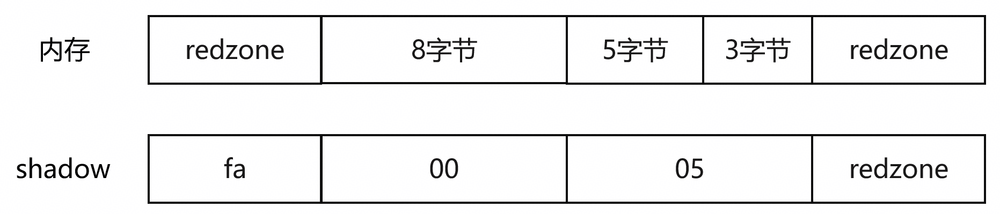
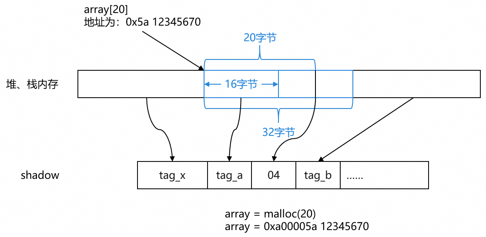
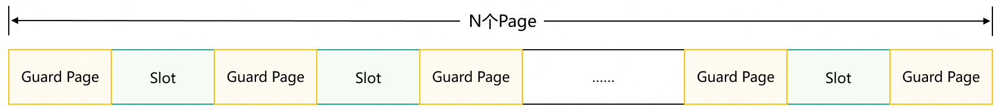
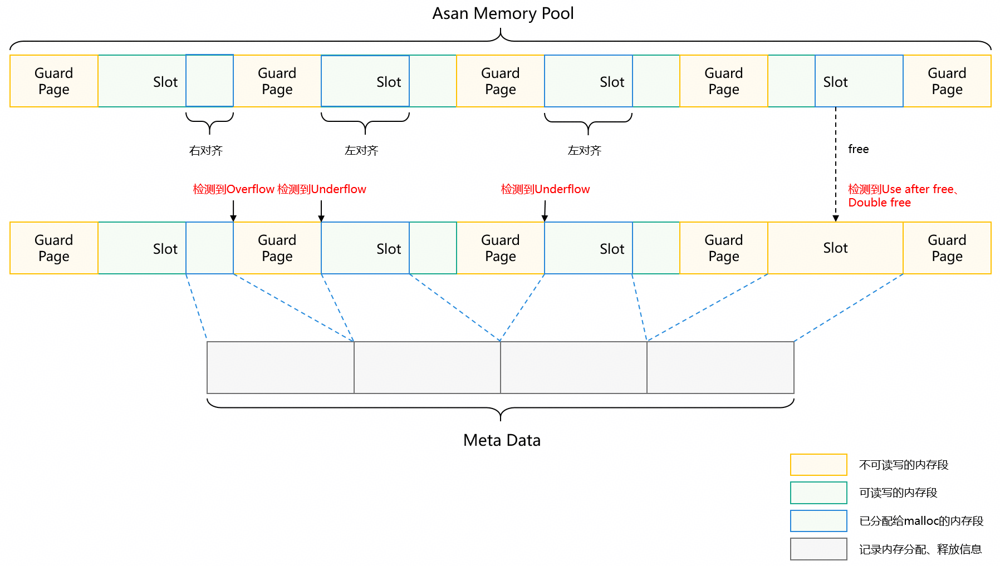

# 地址越界检测工具原理

更新时间：2026-05-18 00:55:31

来源：https://developer.huawei.com/consumer/cn/doc/best-practices/bpta-stability-address-sanitizer-principle

#### ASan检测原理
为追求C/C++的高性能，编译器和OS（Windows/Linux/Mac）运行时框架不会对内存操作进行安全检测。针对该场景，DevEco Studio集成ASan（Address Sanitizer）为开发者提供面向C/C++的地址越界检测能力，并通过FaultLog展示错误的堆栈详情及导致错误的代码行。常见的ASan异常检测类型有：heap-buffer-overflow、stack-buffer-overflow/underflow、heap-use-after-free和double-free等，详情请参考[ASan异常检测类型](https://developer.huawei.com/consumer/cn/doc/best-practices/bpta-stability-asan-detection#section12508111110451)。

#### 原理概述
ASan工具主要由插桩模块和动态运行库模块构成。
插桩模块主要功能为：
- 对于栈内存的分配，ASan会插入代码来分配额外的“红区”（redzones）作为边界检查，以及可能的“影子内存”来跟踪内存的可访问性。
- 对于每次内存访问（读/写），ASan会插入代码来检查访问的内存是否有效，比如是否越界或是否访问了未初始化的内存。
动态运行库主要功能为：
- 将路径中的malloc/free函数进行了替换，在malloc函数中增加了分配redzone内存的部分，将redzone对应的shadow memory进行加锁（poison），主要的内存区域对应的影子内存不进行加锁。
- 将free/delete将所有分配的内存区域加锁（poison），并放入隔离区队列（FIFO）中，以确保一段时间内不会再被分配。
总结：ASan工具在编译时对代码进行插桩，在运行时关注相关内存的shadow memory值，从而判断是否有内存错误的产生。

#### shadow机制
ASan利用在运行时通过影子内存（shadow memory）来标记内存的状态，从而检测出非法的内存操作。默认8个字节内存对应1字节的shadow，也就是当malloc(13)时，ASan会将其按8字节对齐分配16字节有效内存，并在前后插入8字节的红区，如下图所示：


日志中会给出Shadow byte legend，这部分解释了每个shadow byte的含义，每个shadow byte代表8个字节。这些字节被用来表示内存状态，以帮助诊断内存错误。

```ts
Shadow byte legend (one shadow byte represents 8 application bytes):
  Addressable:           00
  Partially addressable: 01 02 03 04 05 06 07 
  Heap left redzone:       fa
  Freed heap region:       fd
  Stack left redzone:      f1
  Stack mid redzone:       f2
  Stack right redzone:     f3
  Stack after return:      f5
  Stack use after scope:   f8
  Global redzone:          f9
  Global init order:       f6
  Poisoned by user:        f7
  Container overflow:      fc
  Array cookie:            ac
  Intra object redzone:    bb
  ASan internal:           fe
  Left alloca redzone:     ca
  Right alloca redzone:    cb
```


| 值 | 名称 | 说明 |
| --- | --- | --- |
| 00 | Addressable | 合法内存，全部可读写。 |
| 01-07 | Partially addressable | 前k个字节可访问，剩下的8-k个字节不可访问。如03表示前3个字节可访问，后5个字节为红区。 |
| fa | Heap left redzone | 堆对象左侧红区（通常右侧红区也用fa来表示）。 |
| fd | Freed heap region | 已释放的堆内存区域，访问将触发use-after-free错误。 |
| f1 | Stack left redzone | 栈变量左侧红区，用于检测栈缓冲区下溢。 |
| f2 | Stack mid redzone | 栈变量间隔离区域，防止跨变量溢出。 |
| f3 | Stack right redzone | 栈变量右侧红区，用于检测栈缓冲区上溢。 |
| f5 | Stack after return | 函数返回后使用局部变量，访问将触发stack-use-after-return错误。 |
| f8 | Stack use after scope | 变量超出生命周期后被访问。 |
| f9 | Global redzone | 全局变量周围的红区，用于检测全局缓冲区溢出，访问将触发global-overflow错误。 |
| f6 | Global init order | 标识全局变量初始化顺序问题，访问将触发initialization-order-fiasco错误。 |
| f7 | Poisoned by user | 用户通过ASAN_POISON_MEMORY_REGION接口去投毒，主动标记为不可访问的内存区域，访问将触发use-after-poison错误。 |
| fc | Container overflow | 容器对象（如 std::vector）的溢出保护区域。 |
| ac | Array cookie | 动态数组分配的元数据区（存储数组大小等信息）。 |
| bb | Intra object redzone | 对象内部成员之间的红区（通过-fsanitize-address-field-padding启用）。 |
| fe | ASan internal | ASan 内部数据结构保留区域，应用程序访问视为错误。 |
| ca | Left alloca redzone | alloca() 分配内存左侧的红区。 |
| cb | Right alloca redzone | alloca() 分配内存右侧的红区。 |

#### 隔离区机制
ASan对于UAF的检测依赖于隔离区。free()函数会将整个内存区域置成不可使用并将其放入隔离区，这样该区域就不会马上被malloc分配给应用程序。目前，隔离区是使用一个FIFO队列实现的，默认大小为256，可通过在asan.option中配置quarantine_size_mb来修改其大小。

> [!CAUTION] 说明
> 


> 隔离区并不能永久保留已释放对象，当其容量quarantine_size_mb达到上限时（默认256），会被重新分配给其他人。当它被重新分配给其他人后，原先的持有者再次访问此块区域将不会报错。因为这一块区域的shadow memory不再是0xfd。所以这算是ASan漏检的一种情况。若程序频繁分配和释放内存，建议合理设置quarantine_size_mb，在保证性能的同时提高检测精度。隔离区的存在可能会增加程序运行时的内存使用量，这是ASan在提升内存错误检测能力时的trade-off。 更详细的内容可参考LLVM AddressSanitizer官方文档。

#### HWASan检测原理
#### 原理概述
HWASan是Hardware-Assisted Address Sanitizer的简称，它是Clang LLVM提供的一套内存错误检测系统，用来检测C/C++中常见的内存访问错误，相比之前的ASan（Address  Sanitizer），它在性能、内存上有不小提升，依赖于编译器的Address Tagging特性，该特性允许应用程序自定义数据存储到虚拟地址的最高8位，当CPU操作该虚拟地址时会自动忽略它。HWASan工具检测地址越界问题的原理如下，
1. 将整个虚拟内存区间按照16：1的比例，划分为user memory和shadow memory；同时，无论是堆上、栈上还是全局对象，其内存起始地址都按照16字节对齐，即保证每16字节的user memory都能映射到1字节的shadow memory；
2. 分配对象的时候，随机分配一个8位的随机tag标记到该对象的虚拟地址最高8位，同时该tag也会保存到其映射的shadow memory中；
3. 编译器在每个内存地址的load/store之前都会插入检查指令，用于确认操作地址的最高8位保存的tag与其映射的shadow memory中的tag值是否一致；
4. 对象回收后也会重新分配一个随机值，保存到其映射的shadow memory中，当出现内存越界行为时，就会检测到tag值不一致的异常；

> [!CAUTION] 说明
> 


> 当分配的对象小于16字节时，多余的内存不会再分配给其它对象，此时shadow memory中保存的是对象所占内存的实际字节数，而tag值则保存在16字节的最后一个字节里面。

常见的HWASan异常检测类型有stack-buffer-overflow/underflow，stack-use-after-return，heap-buffer-overflow等，详见[HWASan异常检测类型](https://developer.huawei.com/consumer/cn/doc/best-practices/bpta-stability-hwasan-detection#section207321025115510)。

#### 功能介绍
HWASan能检测到ASan所能检测到的同一系列错误：
- 堆栈和堆缓冲区上溢/下溢。
- 释放之后的堆使用情况。
- 重复释放/错误释放。
和ASan相比，HWASan具有以下优点：
- HWASan不需要安全区来检测buffer overflow，既极大地降低了工具对于内存的消耗，也不会出现ASan中某些overflow检测不到的情况。
- HWASan不需要隔离区来检测UseAfterFree，因此不会出现ASan中某些UseAfterFree检测不到的情况。
- 此外，HWASan还可以检测返回之后的堆栈使用情况。

#### tag和shadow机制
HWASan的tag机制是其核心部分，利用处理器TopBitIgnore特性，它通过在内存地址的高位（通常是8位）存储一个随机生成的tag值，来标识内存对象。这个tag值与指向该内存对象的指针共享，从而在内存访问时进行匹配检查。
- 内存分配时的tag生成：当程序分配内存时，HWASan会为该内存对象生成一个随机的8位tag值。这个tag值被存储在内存对象的top byte（最高有效位）中。
- 指针的tag同步：指向该内存对象的指针也会被赋予相同的tag值。这样，当程序访问该内存对象时，指针的tag值与内存对象的tag值需要一致，否则会触发错误，上报hwasan日志。
- shadow memory的tag存储：除了在指针中存储tag值，HWASan还会在shadow memory中为每个内存对象存储一个对应的tag值。shadow memory是HWASan用来记录内存对象tag值的辅助存储区域，通常每16字节的内存对应1字节的shadow memory。若分配的内存小于16字节（短颗粒内存（short granules）），shadow会做特殊处理。Shadow Memory存储实际有效长度，而Tag保存内存在该16字节区域的末字节。


更详细的内容可参考LLVM [Hardware-assisted AddressSanitizer官方文档](https://clang.llvm.org/docs/HardwareAssistedAddressSanitizerDesign.html)。

#### MemDebug检测原理
#### 原理概述
MemoryDebug检测原理基于隔离区加投毒填充的机制，同时复用了HWASan的tag机制对一部分问题进行检测，主要应用于检测未进行HWASan插桩的库文件等代码的堆内存问题，同时不影响已进行插桩的代码模块。主要检测逻辑是通过隔离区将释放后的内存保存起来防止立即被再次分配出去，并在其中填充特殊值，放入隔离区中的内存理论上不允许读写，当隔离区满或线程退出时，将隔离区中部分或全部内存释放出隔离区返还给分配器并对其中填充值进行校验，若填充值被修改，则说明发生use-after-free问题。
1. double-free检测逻辑基于HWASan检测机制，分配和释放内存时会在指针和shadow memory生成随机tag值，当释放内存时会检测指针和对应shadow memory的tag，如果不匹配则报use-after-free错误。理论上有1/256的概率出现相同，即有1/256的概率漏检。
2. use-after-free（write）同样是基于投毒和隔离区机制，内存在释放时会被填充上特殊值（0x55）并放入隔离区防止再次被分配，当写操作修改了内存中的内容时不会立即报错，当该内存从离开隔离区真正被释放返还给分配器时会检查内存填充的内容，如果内存中内容不是指定填充值说明在释放后被修改发生了UAF（write）错误。但只能激发错误且不能在发生错误时立即检测到，所以不能提供触发问题时的现场调用栈信息。
3. heap-buffer-overflowoverflow无法通过MemoryDebug直接检测，当写越界行为发生时，可能会修改相邻chunk中的值，如果被修改chunk已被释放填充且还保留在隔离区中，则在chunk离开隔离区被返还给allocator时会被检测到，但不能检测到现场。另外，基于HWASan检测机制，当分配的chunk包含tail时，下越界写会破坏填充的tail_magic，此时可以在free到隔离区时检测到下越界写错误，该机制同样无法检测到越界写发生的现场。

#### GWP-ASan检测原理
在开发阶段可以通过ASan定位一些非法内存行为，但鉴于ASan开启会对性能和内存有很大的影响，所以ASan的能力不能部署到正式生产环境中，GWP-ASan可以帮助开发者在性能影响很小的情况下检查到部分内存使用的非法行为，正是因为性能影响较小，GWP-ASan会被部署到正式环境中，避免了正式环境中出现内存问题时再去使用ASan版本做二次复现。

#### 原理概述
GWP-ASan具有一种内存分配器功能，可帮助查找释放后使用和堆缓冲区溢出bug，启用后，GWP-ASan会拦截随机选择的堆分配子集，并将其放入特殊区域，以便捕获难以检测到的堆内存损坏错误。只要用户足够多，即使在低采样率的情况下，也可以发现常规测试未能发现的堆内存安全错误。常见的GWP-ASan异常检测类型有：double-free，user-after-free，invalid-free-left等，详见[GWP-ASan异常检测类型](https://developer.huawei.com/consumer/cn/doc/best-practices/bpta-stability-gwpasan-detection#section73731529454)部分。
GWP-ASan通过修改内存分配器来工作。它使用概率性采样，随机选择一部分内存分配进行保护。这种设计在性能和内存错误检测之间取得平衡。
当启用GWP-ASan功能后，内存分配会以页对齐的方式分配，并通过**控制页的读写权限**来检测内存访问是否合法。如果某一页的权限被设置为不可读写，那么对该页的任何读写访问都会导致进程接收到SIGSEGV错误信号。
**实现机制：**
GWP-ASan通过在内存分配路径（如 malloc、calloc、realloc）上设置钩子（hook）来实现。它使用[GuardedPoolAllocator](https://gitcode.com/openharmony/third_party_llvm-project/blob/master/compiler-rt/lib/gwp_asan/guarded_pool_allocator.cpp)来进行内存分配，该分配器会为每个分配的内存块设置保护页。
在初始化过程中，GWP-ASan会根据slots数量参数提前分配一个下图所示保护区；每个Guard Page页都被设置为不可读写权限，用于检测堆内存上下溢出。


之后，hook应用堆内存分配行为，每次分配堆内存时，随机决定目标内存是走GWP-ASan分配，还是走系统原生分配。如果走GWP-ASan分配，那么目标内存会被随机左对齐/右对齐分配在一个空闲的Slot上，同时记录分配内存的堆栈信息。


当释放内存时，会先判断目标内存是否在GWP-ASan受保护内存池上，如果是，那么释放这块内存和其所在的Slot，该Slot页设置为不可读写权限，同时记录释放内存的堆栈。Slot空闲后，可以重新被用于分配。堆栈信息记录在metadata中。
**更详细的内容可参考LLVM官方文档** [GWP AddressSanitizer官方文档](https://llvm.org/docs/GwpAsan.html)