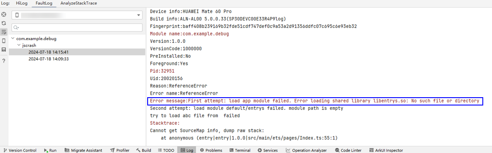

# 使用方舟异常信息增强检测

更新时间：2026-03-12 08:45:02

来源：https://developer.huawei.com/consumer/cn/doc/best-practices/bpta-stability-ark-exception-detection

## 概述


在进行ArkTS项目开发中可能存在需要加载native模块的场景，开启方舟native模块加载异常信息增强功能后，可以丰富ArkTS项目中因加载native模块导致的报错信息，以便更准确地进行native问题定位。


## 启用方舟native模块加载异常信息增强


可以通过以下两种方式启用方舟native模块加载异常信息增强

- 方式一点击**Run > Edit Configurations >** **Diagnostics**，勾选**Enhanced Error Info**。


- 方式二通过命令行开启。
```text
aa start {abilityName} {bundleName} -E
```


## 启用方舟native模块加载异常信息增强


1. 运行或调试当前应用。
2. 当程序出现因native模块加载导致的报错信息时，会显示更详细准确的错误信息。

