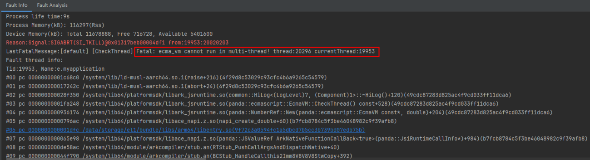

# 方舟运行时检测

更新时间：2026-03-12 08:45:02

来源：https://developer.huawei.com/consumer/cn/doc/best-practices/bpta-stability-ark-runtime-detection

#### 方舟多线程检测

在JS运行时环境中，多线程的安全问题是一个重要的考虑因素。由于JavaScript本身是单线程的，对JS对象的任何操作都必须在创建该JS线程的原始线程上进行。如果违反了这一规则，就会导致多线程安全问题。以下是关于如何判断和处理这些问题的一些详细说明。开启多线程检测会有较大性能损耗，请开发者按需开启。
 
 

#### 原理介绍

- 单线程执行JavaScript是单线程执行的语言，这意味着它一次只能在一个线程上执行代码。任何JavaScript对象都只能在创建它们的线程上进行操作。
- N-API（Node-API）接口N-API接口直接涉及到JavaScript对象的操作。绝大多数N-API接口（约95%）只能在创建这些对象的JavaScript线程上调用。

 
- 多线程检测机制多线程检测机制会检测当前线程和正在使用的JS虚拟机环境（vm/env）中的JS线程ID是否一致。如果不一致，就表明虚拟机环境被跨线程使用，存在多线程安全问题。

 
 

#### 常见多线程安全问题

- 非JS线程使用N-API接口非JavaScript线程尝试调用N-API接口，可能会导致未定义的行为或崩溃。

  
```ArkTS
// Index.ets
Text(this.message)
  .fontSize($r('app.float.page_text_font_size'))
  .fontWeight(FontWeight.Bold)
  .onClick(() => {
    testNapi.multiCheck();
  })
```
 
```cpp
// napi_init.cpp
static napi_value MultiCheck(napi_env env, napi_callback_info info)
{
    std::thread([](napi_env env) {
        napi_value obj = nullptr;
        napi_create_object(env, &obj);
    }, env).join();

    return nullptr;
}
```


 
- N-API接口使用其他线程的env一个线程尝试使用另一个线程创建的env（JavaScript环境），这也会导致多线程安全问题。

  
```ArkTS
// Index.ets
Text(this.message)
  .fontSize($r('app.float.page_text_font_size'))
  .fontWeight(FontWeight.Bold)
  .onClick(() => {
    testNapi.saveEnv();
    const task = new taskpool.Task(createObject);
    taskpool.execute(task);
  })
```
 
```cpp
// napi_init.cpp
napi_env env_ = nullptr;
static napi_value SaveEnv(napi_env env, napi_callback_info info)
{
    env_ = env;
    return nullptr;
}
static napi_value CreateObject(napi_env env, napi_callback_info info)
{
    napi_value obj = nullptr;
    napi_create_object(env_, &obj);
    return nullptr;
}
```


 
**如何判断是否发生了多线程安全问题**
 
如果在运行时遇到以下致命错误信息，这意味着已经发生了多线程安全问题：
 
```text
Fatal: ecma_vm cannot run in multi-thread! thread:3096 currentThread:3550
```
 
当前线程号为3550，而使用的JavaScript线程是由3096线程创建的，这表明虚拟机环境（vm/env）被跨线程使用，从而导致了多线程安全问题。
 
> [!NOTE]
> 若未开启多线程检查开关，即使存在错误的多线程写法，运行时也不一定报错。

 
 

#### 使用约束

方舟多线程检测通过命令行参数开启，点击桌面图标无效。
 
 

#### 开启方舟多线程检测

可通过以下方式启用方舟多线程检测。
 
- **方式一**点击**Run > Edit Configurations >** **Diagnostics**，勾选**Multi Thread Check**。

  



 
- **方式二**通过命令行开启。

  
```bash
hdc shell aa start -a {abilityName} -b {bundleName} -R
```


 
 

#### 使用方舟多线程检测
1. 运行或调试当前应用。
2. 当程序出现多线程安全问题时，会弹出Crash log信息，点击信息中的链接即可跳转至引起多线程安全问题的代码处。
 
 

#### 方舟异常检测码

若fatal信息为Fatal: ecma_vm cannot run in multi-thread! thread:20296 currentThread:19953，则发生了多线程安全问题，意为：当前线程号为19953，而使用的js thread是20296创建出来的，跨线程使用VM。
 


