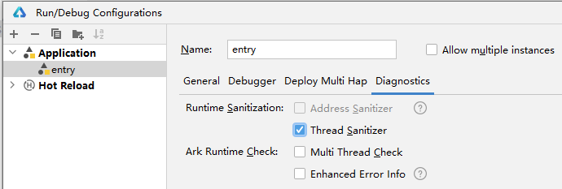
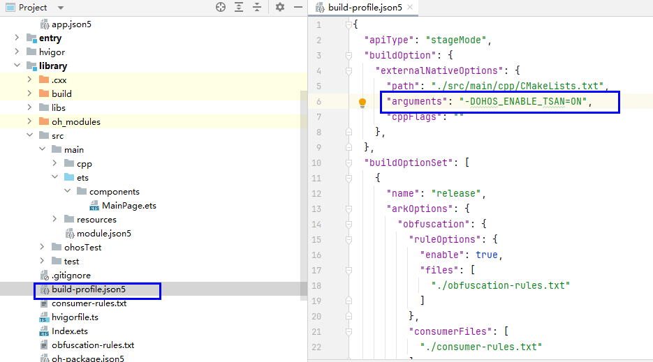
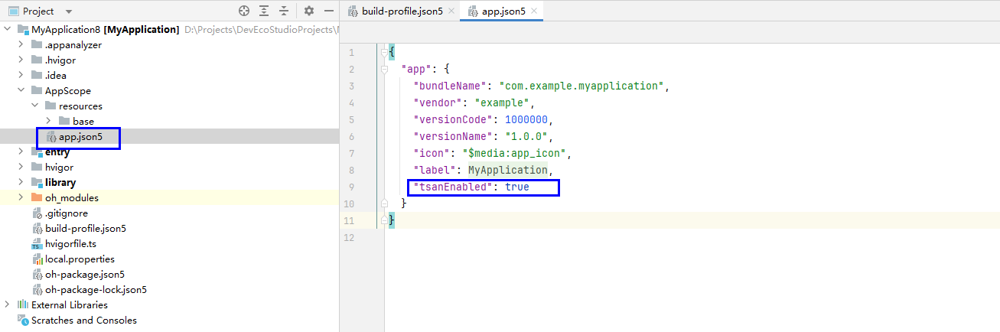
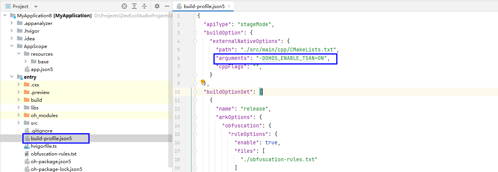
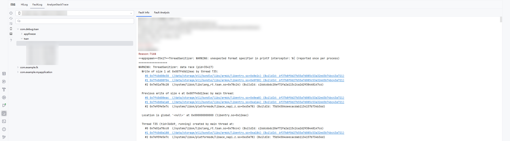
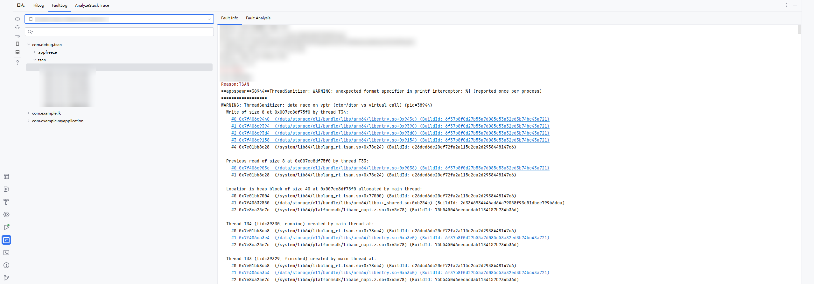
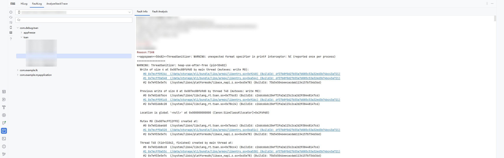
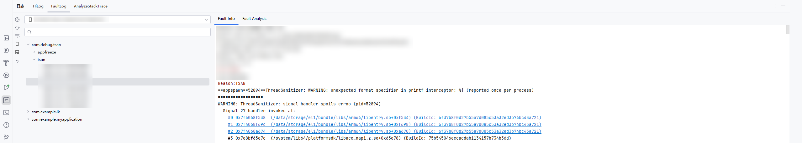
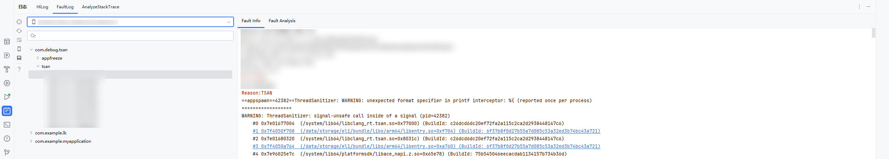
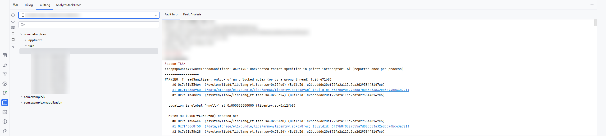

# 使用TSan检测线程问题

更新时间：2026-03-12 08:45:02

来源：https://developer.huawei.com/consumer/cn/doc/best-practices/bpta-stability-tsan-detection

## 原理概述


TSan（ThreadSanitizer）是一个检测数据竞争的工具。它包含一个编译器插桩模块和一个运行时库。TSan开启后，会使性能降低5到15倍，同时使内存占用率提高5到10倍。

TSan使能分为两个阶段：Instrumentation阶段（完成代码插桩）和Runtime阶段（负责竞争判断和报告输出）。


## 功能介绍


### 应用场景


TSan能够检测出如下问题：

- 数据竞争检测：数据竞争（Data Race）是指两个或多个线程在没有适当的同步机制情况下同时访问相同的内存位置，其中至少有一个线程在写入。数据竞争是导致多线程程序行为不可预测的主要原因之一。


- 锁错误检测：TSan不仅能检测数据竞争，还能检测与锁相关的错误：死锁（Deadlock）：死锁是指两个或多个线程互相等待对方释放锁，导致程序无法继续执行。
- 双重解锁（Double Unlock）：同一线程尝试解锁已经解锁的锁。
- 未持有锁解锁：一个线程尝试解锁一个它未持有的锁。


- 条件变量错误检测：条件变量用于线程之间的通信和同步，常见错误包括：未持有锁等待：一个线程在未持有相关锁的情况下调用wait。
- 未持有锁唤醒：一个线程在未持有相关锁的情况下调用signal或broadcast。


常见TSan异常检测类型有data race，heap-use-after-free，signal handler spoils errno等，详见TSan异常检测类型部分。


## 错误报告


当TSan检测到错误时，它会生成详细的报告，包括：

- 错误类型：例如数据竞争、死锁等。
- 内存地址：涉及的内存地址。
- 线程信息：涉及的线程ID和线程创建的堆栈跟踪。
- 源代码位置：每一个内存访问的源代码位置和堆栈跟踪。
- 上下文信息：访问类型（读/写）、访问大小等。


## 使用约束


- TSan仅支持API 12及以上版本。
- ASan、TSan、UBSan、HWASan、GWP-ASan不能同时开启，五个只能开启其中一个。
- TSan开启后会申请大量虚拟内存，其他申请大虚拟内存的功能（如GPU图形渲染）可能会受影响。
- TSan不支持静态链接libc或libc++库。


## 使能TSan


可通过以下两种方式使能TSan。每种方式分为DevEco Studio场景和流水线场景。


### 方式一


DevEco Studio场景

1. 点击**Run > Edit Configurations >** **Diagnostics**，勾选**Thread Sanitizer**。

2. 如果有引用本地library，需在library模块的build-profile.json5文件中，配置arguments字段值为“-DOHOS_ENABLE_TSAN=ON”，表示以TSan模式编译so文件。



流水线场景

在hvigorw命令后加上ohos-debug-tsan=true的选项，执行hvigorw命令，更多options参考命令行构建工具（hvigorw）。

```text
hvigorw [taskNames...] ohos-debug-tsan=true  <options>
```

同上，如果有引用本地library，需在library模块的build-profile.json5文件中，配置arguments字段值为“-DOHOS_ENABLE_TSAN=ON”，表示以TSAN模式编译so文件。


### 方式二


DevEco Studio场景

1. 修改工程目录下AppScope/app.json5，添加TSan配置开关。

2. 设置模块级构建TSan插桩。在需要使能TSan的模块中，通过添加构建参数开启TSan检测插桩，在对应模块的模块级build-profile.json5中添加命令参数：



流水线场景

在hvigorw命令后加上ohos-debug-tsan=true的选项，执行hvigorw命令，更多options参考命令行构建工具（hvigorw）。

```text
hvigorw [taskNames...] ohos-debug-tsan=true  <options>
```

同上，如果有引用本地library，需在library模块的build-profile.json5文件中，配置arguments字段值为“-DOHOS_ENABLE_TSAN=ON”，表示以TSAN模式编译so文件。


## TSan异常检测类型


### Data race


背景

多个线程在没有正确加锁的情况下，同时访问同一块数据，并且至少有一个线程是写操作，对数据的读取和修改产生了竞争，从而导致各种不可预计的问题

错误代码实例

```cpp
int Global = 12;


void Set1() {
  *(char *)&Global = 4;
}


void Set2() {
  Global=43;
}


void *Thread1(void *x){
  Set1();
  return x;
}


static napi_value Add(napi_env env, napi_callback_info info){
  ...
  pthread_t t;
  pthread_create(&t, NULL, Thread1, NULL);
  Set2();
  pthread_join(t, NULL);
  ...
}
```


影响

对数据的读取和修改产生了竞争，从而导致各种不可预计的问题

开启TSan检测后，触发demo中的函数，应用闪退报TSan，包含字段：ThreadSanitizer: data race

定位思路

如果有工程代码，直接开启TSan检测，debug模式运行后复现该错误，可以触发TSan，直接点击堆栈中的超链接定位到代码行，能看到错误代码的位置。





修改方法

加锁或者其它线程同步的方法

推荐建议

多线程访问同一内存时，需要注意线程同步机制，必要时加锁


### data race on vptr


背景

一个线程在删除某个对象（obj）、一个线程在调用虚函数（obj->vcall）

错误代码实例

```cpp
#include <semaphore.h>
#include <pthread.h>


struct A {
  A() {
    sem_init(&sem_, 0, 0);
  }
  virtual void F() {
  }
  void Done() {
    sem_post(&sem_);
  }
  virtual ~A() {
    sem_wait(&sem_);
    sem_destroy(&sem_);
  }
  sem_t sem_;
};


struct B : A {
  virtual void F() {
  }
  virtual ~B() { }
};


static A *obj = new B;


void *Thread1(void *x) {
  obj->F();
  obj->Done();
  return NULL;
}


void *Thread2(void *x) {
  delete obj;
  return NULL;
}


static napi_value Add(napi_env env, napi_callback_info info){
  ...
  pthread_t t[2];
  pthread_create(&t[0], NULL, Thread1, NULL);
  pthread_create(&t[1], NULL, Thread2, NULL);
  pthread_join(t[0], NULL);
  pthread_join(t[1], NULL);
  ...
}
```

影响

线程行为发生冲突，程序崩溃

开启TSan检测后，触发demo中的函数，应用闪退报TSan，包含字段：ThreadSanitizer: data race on vptr（ctor/dtor vs virtual call）

定位思路

如果有工程代码，直接开启TSan检测，debug模式运行后复现该错误，可以触发TSan，直接点击堆栈中的超链接定位到代码行，能看到错误代码的位置。





修改方法

设置合适的线程同步机制，如锁。

推荐建议

确保设置合适的线程同步机制，来保证线程执行逻辑先后的准确性。


### Use After Free


heap-use-after-free

背景

使用了释放的内存（多线程层面）。

错误代码实例

```cpp
#include <pthread.h>


int *mem;
pthread_mutex_t mtx;


void *Thread1(void *x) {
  pthread_mutex_lock(&mtx);
  free(mem);
  pthread_mutex_unlock(&mtx);
  return NULL;
}


__attribute__((noinline)) void *Thread2(void *x) {
  pthread_mutex_lock(&mtx);
  mem[0] = 42;
  pthread_mutex_unlock(&mtx);
  return NULL;
}


static napi_value Add(napi_env env, napi_callback_info info){
  ...
  mem = (int*)malloc(100);
  pthread_mutex_init(&mtx, 0);
  pthread_t t;
  pthread_create(&t, NULL, Thread1, NULL);
  Thread2(0);
  pthread_join(t, NULL);
  pthread_mutex_destroy(&mtx);
  ...
}
```

影响

导致程序存在安全漏洞，并有崩溃风险。

开启TSan检测后，触发demo中的函数，应用闪退报TSan，包含字段：ThreadSanitizer: heap-use-after-free

定位思路

如果有工程代码，直接开启TSan检测，debug模式运行后复现该错误，可以触发TSan，直接点击堆栈中的超链接定位到代码行，能看到错误代码的位置。





修改方法

已释放的内存不要使用，释放的内存需要标记，方便其它线程判断

推荐建议

使用合理的线程同步机制


### Signal Check


signal handler spoils errno

背景

信号处理函数中修改了errno变量


错误代码实例

```cpp
#include "napi/native_api.h"
#include <signal.h>
#include <sys/types.h>
#include <errno.h>
#include <malloc.h>
#include <pthread.h>


static void MyHandler(int, siginfo_t *s, void *c) {
  errno = 1;
  done = 1;
}


static void* sendsignal(void *p) {
  pthread_kill(mainth, SIGPROF);
  return 0;
}


static __attribute__((noinline)) void loop() {
  while (done == 0) {
    volatile char *p = (char*)malloc(1);
    p[0] = 0;
    free((void*)p);
  }
}


static napi_value Add(napi_env env, napi_callback_info info){
  ...
  mainth = pthread_self();
  struct sigaction act = {};
  act.sa_sigaction = &MyHandler;
  sigaction(SIGPROF, &act, 0);
  pthread_t th;
  pthread_create(&th, 0, sendsignal, 0);
  loop();
  pthread_join(th, 0);
  ...
}
```

影响

导致程序存在安全漏洞，并有崩溃风险。

开启TSan检测后，触发demo中的函数，应用闪退报TSan，包含字段：ThreadSanitizer: signal handler spoils errno

定位思路

如果有工程代码，直接开启TSan检测，debug模式运行后复现该错误，可以触发TSan，直接点击堆栈中的超链接定位到代码行，能看到错误代码的位置。





修改方法

不要在信号处理函数中修改error变量

推荐建议

将MyHandler中的error赋值语句去掉


### signal unsafe call inside of a signal


背景

信号处理函数中调用了非信号安全的函数（比如malloc）

错误代码实例

```cpp
#include "napi/native_api.h"
#include <signal.h>
#include <sys/types.h>
#include <malloc.h>
#include <pthread.h>
#include <sys/types.h>
#include <unistd.h>
#include <stdio.h>


pthread_t mainth;
volatile int done;


static void handler(int, siginfo_t*, void*) {
  volatile char *p = (char*)malloc(1);
  p[0] = 0;
  free((void*)p);
}


static napi_value Add(napi_env env, napi_callback_info info)
{
  ...
  struct sigaction act = {};
  act.sa_sigaction = &handler;
  sigaction(SIGPROF, &act, 0);
  kill(getpid(), SIGPROF);
  sleep(1);
  fprintf(stderr, "DONE\n");
  ...
}
```

影响

导致程序存在安全漏洞，并有崩溃风险。

开启TSan检测后，触发demo中的函数，应用闪退报TSan，包含字段：ThreadSanitizer: signal-unsafe call inside of a signal

定位思路

如果有工程代码，直接开启TSan检测，debug模式运行后复现该错误，可以触发TSan，直接点击堆栈中的超链接定位到代码行，能看到错误代码的位置。





修改方法

将信号处理函数中的malloc去掉，在其外部预先分配内存。

推荐建议

建议信号处理程序之外预先分配内存，或者尽可能避免在信号处理程序中进行内存分配和复杂的操作。如果需要在程序中替换malloc，可以考虑使用__malloc_hook或者宏定义等方法


### Mutex Check


unlock of an unlocked mutex（or by a wrong thread）

背景

解锁一个已经解锁/自己不拥有的锁

错误代码实例

```cpp
#include "napi/native_api.h"
#include <pthread.h>
#include <iostream>


pthread_mutex_t mutex = PTHREAD_MUTEX_INITIALIZER;


void* unlocker(void* arg) {
  pthread_mutex_unlock(&mutex);
  return nullptr;
}


static napi_value Add(napi_env env, napi_callback_info info){
  ...
  pthread_t tid;
  pthread_create(&tid, nullptr, unlocker, nullptr);
  pthread_join(tid, nullptr);
  ...
}
```

影响

导致程序存在安全漏洞，并有崩溃风险。

开启TSan检测后，触发demo中的函数，应用闪退报TSan，包含字段：ThreadSanitizer: unlock of an unlocked mutex（or by a wrong thread）

定位思路

如果有工程代码，直接开启TSan检测，debug模式运行后复现该错误，可以触发TSan，直接点击堆栈中的超链接定位到代码行，能看到错误代码的位置。





修改方法

先使用try_lock()接口获取锁，再使用unlock()接口解锁

推荐建议

尽量不要释放自己线程未持有的锁
