# JS内存泄漏问题检测方法

更新时间：2026-03-17 02:20:01

来源：https://developer.huawei.com/consumer/cn/doc/best-practices/bpta-stability-js-memleak-detection

## 使用Snapshot检测虚拟机内存泄漏


### 查看快照详情


1. 创建Snapshot场景调优分析任务，操作方法可参考[性能问题定位：深度录制](https://developer.huawei.com/consumer/cn/doc/harmonyos-guides/deep-recording)。

> [!NOTE]
> 在任务分析窗口，可以通过“Ctrl+鼠标滚轮”缩放时间轴，通过“Shift+鼠标滚轮”左右移动时间轴。或使用快捷键W/S放大或缩小时间轴，使用A键/D键可以左右移动时间轴。将鼠标悬停在泳道任意位置，可以通过M键添加单点时间标签。鼠标框选要关注的时间段，可以通过“Shift+M”添加时间段标签。在任务分析窗口，可以通过“ctrl+,”向前选中单点时间标签，通过“ctrl+.”向后选中单点时间标签。在任务分析窗口，可以通过“ctrl+[”向前选中时间段标签，通过“ctrl+]”向后选中时间段标签。


2. 设置Snapshot泳道。单击任务左上角的

进行泳道的新增和删除，再次单击此按钮可关闭设置并生效。
3. 开始录制后可观察Memory泳道的内存使用情况，在需要定位的时刻单击任务左上角的

启动一次快照。“ArkTS Snapshot”泳道的紫色区块表示一次快照完成。

> [!NOTE]
> 在任务录制过程中，单击分析窗口左上角的可启动内存回收机制。当方舟虚拟机的调优对象的某个程序/进程占用的部分内存空间在后续的操作中不再被该对象访问时，内存回收机制会自动将这部分空间归还给系统，降低程序错误概率，减少不必要的内存损耗。


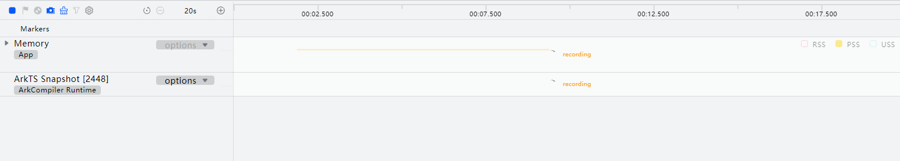


在“Statistics”页签中显示当前快照的详细信息：

- Constructor：构造器。
- Distance：从GC Root到这个对象的距离。
- Shallow Size：该对象的实际大小。
- Retained Size：当前对象释放时，总共可以释放的内存大小。
- Native Size：该对象所引用的Native内存大小。
- Retained Native Size：当前对象释放时，总共可以释放的Native内存大小。
- 构造函数名称后的“x数字”，表示该类型对象的数量，可单击折叠按钮展开。
- 单击列表中任一对象，右侧区域会显示从GC roots到这个对象的路径，通过这些路径可以看到该对象的句柄被谁持有，从而方便定位问题产生的原因。
- 带

标识的对象，表示其为全局对象，可以通过全局window对象直接访问。
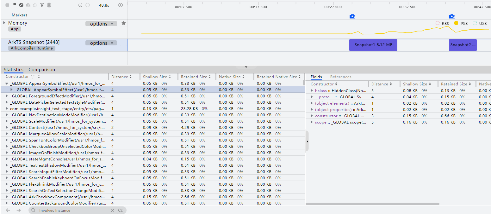


### 节点属性与引用链


在“Snapshot”的“Statistics”页签和“Comparison”页签中，所有实例对象节点展开后会显示“<fields>”以及“<references>”，这两项节点分别代表该实例对象的属性以及该实例对象的引用链信息。

在“Snapshot”的More区域则展示“Fields”和“References”两个页签，分别代表Detail区域所选择对象的属性以及引用链信息，方便快捷查看所选中对象的属性等详细信息，而不需要跳转至对应对象。


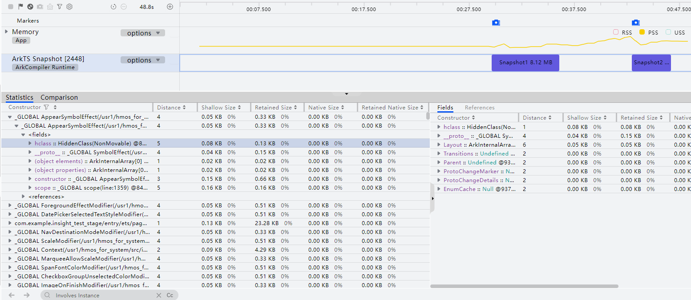


### 节点跳转


在“Snapshot”的“Comparison”页签中，查看内存对象、对象属性及其引用链时，若要查看某一对象的详细信息，可以单击该对象所在行行尾的跳转图标跳转至该对象所在的“Statistics”页签并定位至该对象所在的位置，以查看该对象的详细信息。


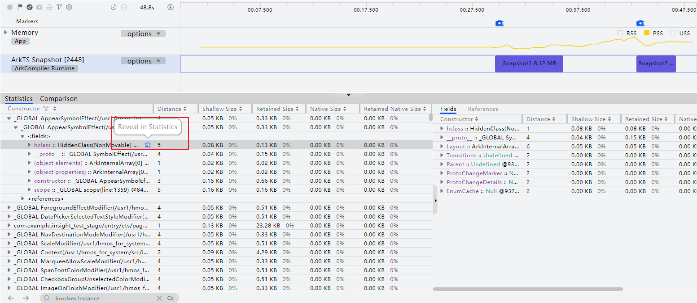


### 历史节点前进/后退


当在“Comparison”和“Statistics”之间进行节点跳转后，单击详情区域左下角的左右箭头可以前进或者后退至下一个或上一个历史节点，以便快速在多个历史节点之间跳转查看。当箭头为激活状态时，表示前进/后退功能可用，当箭头为灰色状态时则代表无法使用该功能。


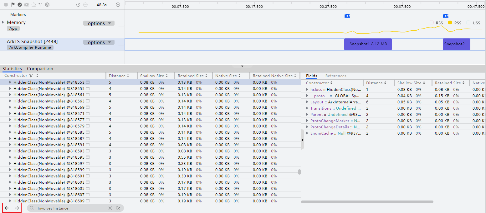


### 比较快照差异


在“Snapshot”的“Comparison”页签中，以当前选择的快照为base，下拉框选择的快照为Target，即可得到两次快照信息的比较结果。


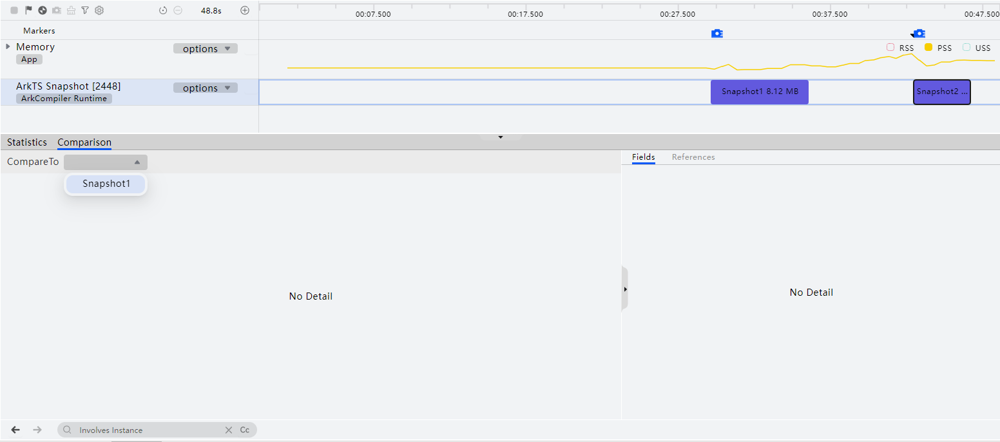
在“Snapshot”的“Comparison”页签中，可进行两次快照的差异比较，比较内容包括新增数、删除数、个数增量、分配大小、释放大小、大小增量等等。通过不断对比，可快速分析和定位内存问题的具体位置。


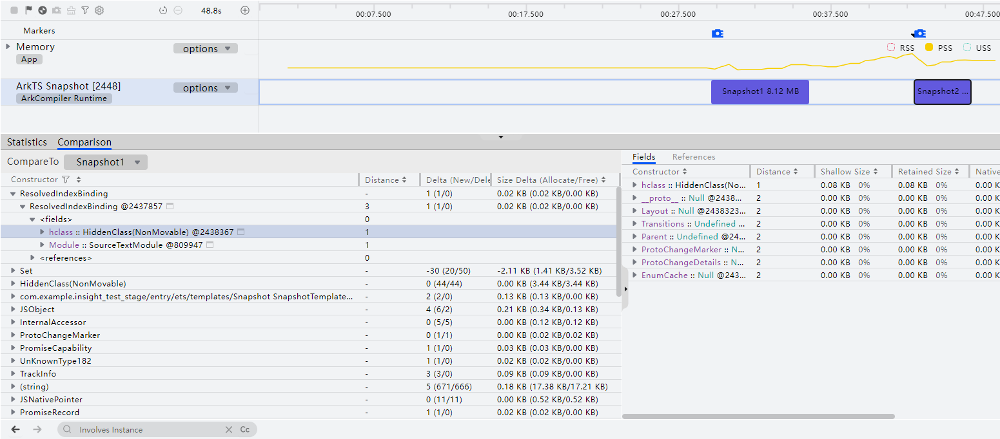


### Heap Snapshot离线导入


DevEco Profiler提供Heap Snapshot离线导入能力，可导入一个或多个.heapsnapshot文件。

您可以在DevEco Profiler主界面的“Create Session”区域中，单击“Open File”，导入.heapsnapshot文件。


> [!NOTE]
> .heapsnapshot文件为方舟虚拟机堆内存dump生成的原始文件。导入的单个文件大小不超过150M。批量导入的文件数量不超过10个。


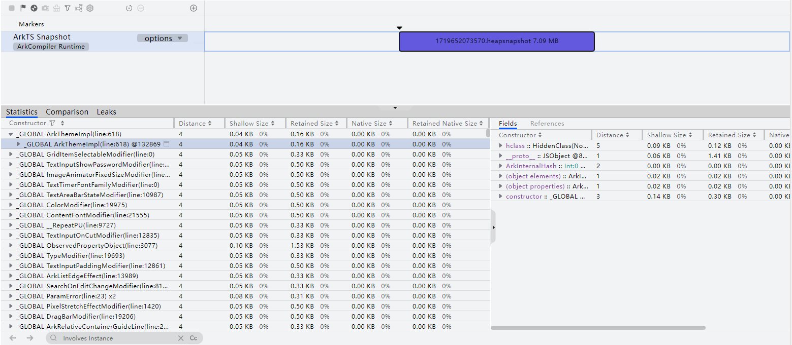
可以导入与heapsnapshot文件匹配的.jsleaklist文件，展示jsleakwatcher监控采集到的内存泄漏对象。


> [!NOTE]
> .jsleaklist文件由JSLeakWatcher内存泄漏检测框架生成。导入的单个jsleaklist文件大小不超过30M。导入的jsleaklist文件通过文件中的hash值与已导入的heapsnapshot文件匹配。可多次导入不同的jsleaklist文件，也可同时导入多个不同的jsleaklist文件，重复导入不会覆盖已导入的匹配上的jsleaklist文件。总的导入匹配成功的文件数量不超过导入的heapsnapshot文件。


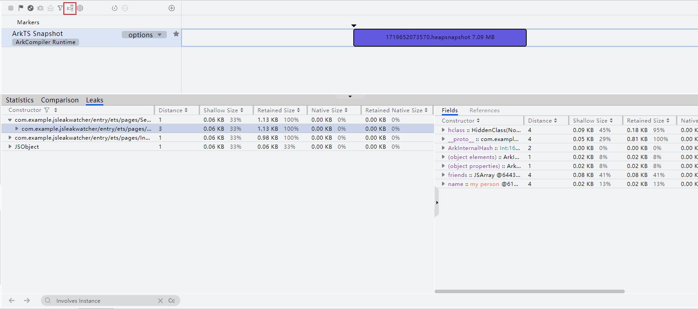


## 使用IDE工具检测虚拟机内存泄漏的详细步骤


### 检测步骤


检测内存泄漏问题步骤如下：

1. 在内存泄漏前拍摄快照；
2. 触发内存泄漏操作后，再次拍摄快照；
3. 对比两次快照的数据，可快速找到泄漏对象并做进一步分析；
4. 当有多个对象在比较视图都存在时，可以重复多次步骤2的操作，分别和未进行操作时对比，观察是否有对象出现明显的线性变化趋势，进一步缩小泄漏对象的范围。


### 录制Snapshot模板数据


1. 连接好设备后启动应用，点击应用选择框(下图中①处)选择需要录制的应用，选择Snapshot模板(下图中②处)，点击Create Session或双击Snapshot图标即可创建一个Snapshot的录制模板。
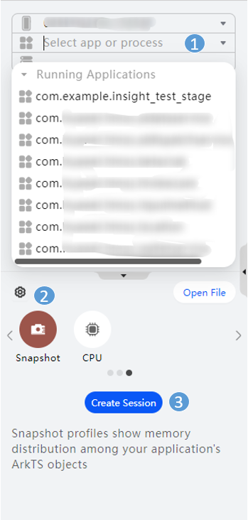
2. 创建好模板后，点击三角按钮即开始录制。
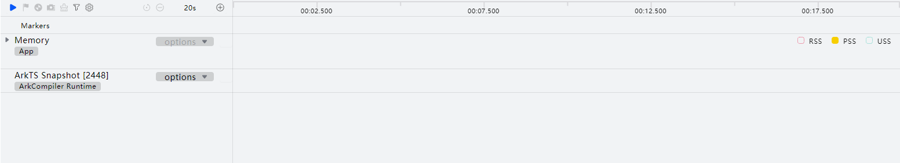
3. 待右侧泳道全部显示recording后则表明正在录制中，此时点击下图中方块按钮或者左侧暂停按钮都可结束录制。
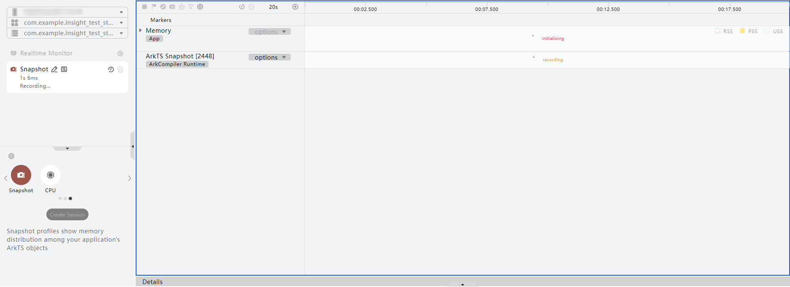
4. 拍摄快照：开始录制后，待右侧泳道全部显示recording后点击图中①处拍摄按钮，待②处显示出紫色条块表示快照拍摄完成。
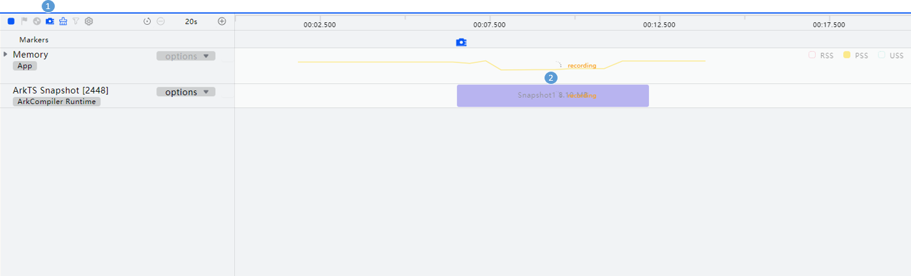
5. 录制完成后可点击下图①处按钮将录制文件导出，而点击下图②处的按钮即可导入之前录制好的导出件。
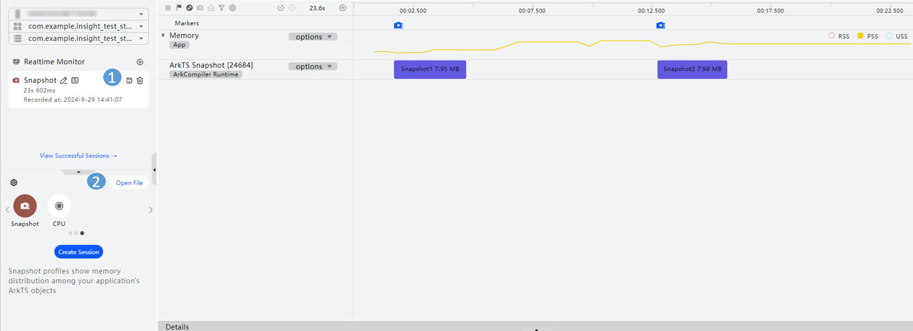


### 常见虚拟机内存对象介绍


JSObject

JSObject展开后为内部的各个属性如下：


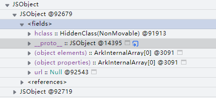


以下通过具体代码来介绍下实例化对象、声明对象、构造函数间的关系：

```ts
class People {
  old: number;
  name: string;
  constructor(old: number, name: string) {
    this.old = old;
    this.name = name;
  }
  printOld() {
    console.log('old = ', this.old);
  }
  printName() {
    console.log('name = ', this.name);
  }
}
let p = new People(20, 'Tom');
```

采集到的snapshot数据如下：


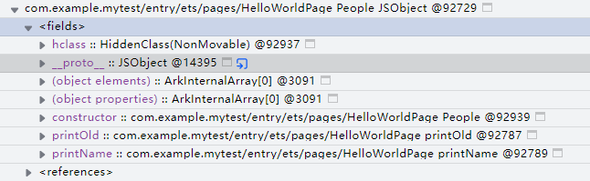


92729对象对应的是People，其主要声明了对象的属性和方法。

实例化对象的_proto_属性指向声明时的对象，声明对象里则会有constructor()构造函数。当实例化多个对象时，实例化对象会有多个，但是声明对象和构造函数只有一个。

JSFunction

目前所有JSFunction都在（closure）标签中，展开即可看到所有JSFunction：


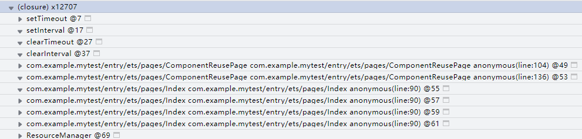


每个函数展开后为函数内的各个属性：


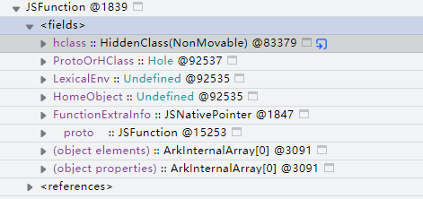


其中HomeObject表示父类对象，即该方法属于哪个对象；_proto_表示原型对象；LexicalEnv表示该函数的闭包上下文；name是内置属性访问器，可获取函数名；FunctionExtraInfo表示额外信息，比如一些napi接口会在这里记录函数地址；ProtoOrHClass表示原型或者隐藏类。

如果函数显示为anonymous()，则表示为匿名函数；如果函数显示为JSFunction()，则表示该函数可能为框架层函数，创建函数的时候未设置函数名。对于这两种函数名不可见的情况，可以通过查看其引用来间接确认其名称：


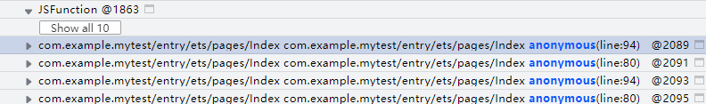


LexicalEnv

闭包变量上下文；闭包是一个链状结构，如下所示：


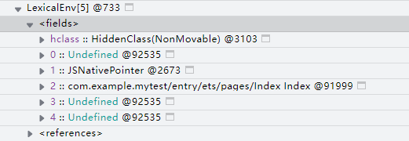


733这个节点本身是一个闭包数组，其中0号元素是调用者（或者再往上的调用者，以此类推）的闭包；1号元素存储的是调试信息；2号及以后的元素存储的就是闭包传递的变量，上例传递了一个变量。

InternalAccessor

内置属性访问器，会有getter和setter方法，通过getter、setter可以获取、设置该属性。

分析方法

查看对象名称

对于声明对象，可以通过constructor属性来确定对象名称。


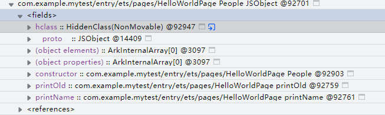


对于实例化对象，一般没有constructor，则需要展开_proto_属性后查找constructor；


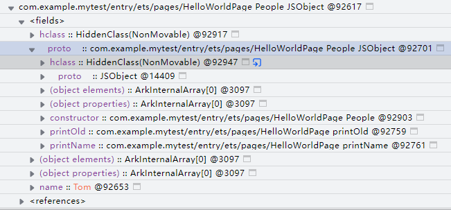


若对象里有一些标志性属性，可以通过在代码里搜索属性名称来找到具体是哪个对象。

如果对象间有继承关系，则可以继续展开_proto_：


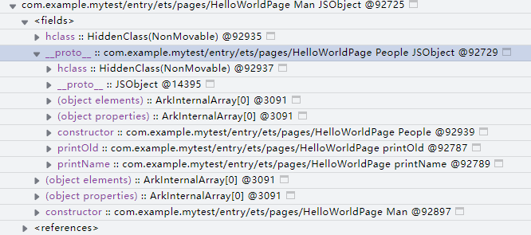


如上图则表明Man对象继承自People对象。
