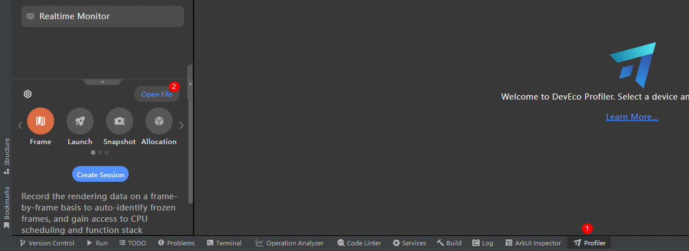
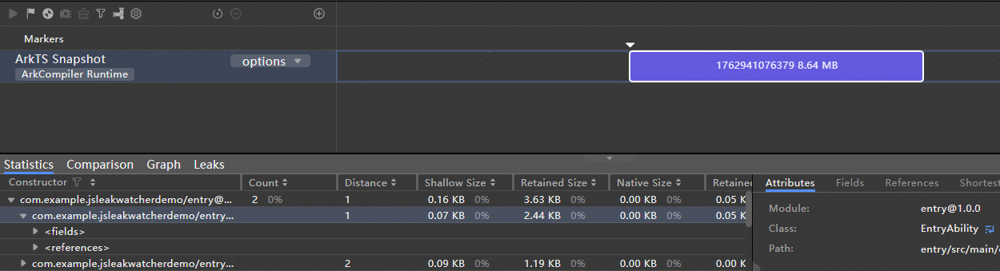
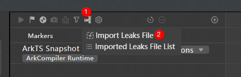
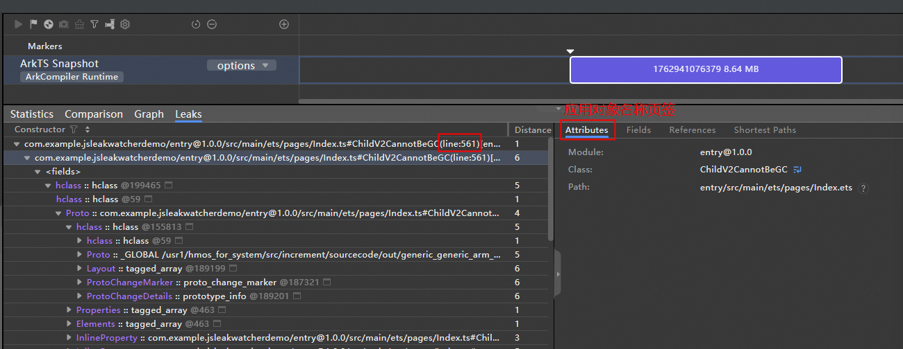
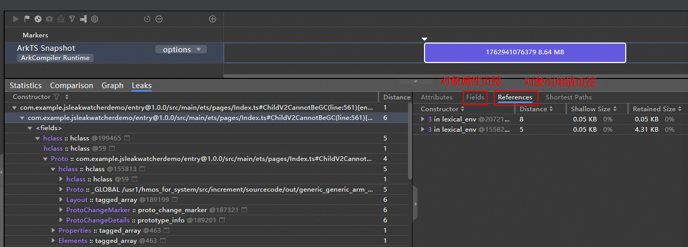

# JsLeakWatcher开发实践

更新时间：2026-03-12 08:45:02

来源：https://developer.huawei.com/consumer/cn/doc/best-practices/bpta-js-leak-watcher

#### 概述

在JavaScript中常见的内存泄漏场景，在ArkTS开发中同样难以完全避免，其根本原因在于不合理的引用管理。尽管这两种语言都配备了垃圾回收器，但它们仅能回收“无任何根可达”的对象。若一个对象不再需要，但仍被某个引用链“意外”持有，则垃圾回收器无法回收该内存，从而导致内存泄漏。
 
ArkTS对象内存泄漏，通常会带来以下影响：
 1. 性能：若应用占用内存持续增长，系统为释放内存会频繁触发GC，而GC执行时会暂停应用主线程（Stop-The-World机制），导致界面卡顿、滑动不流畅；长期泄漏同时也会让内存碎片化严重，系统分配/释放内存效率降低，进一步拖慢应用运行速度，发生响应变慢等问题。
2. 内存：若应用泄漏内存持续积累并达到ArkTS Local堆/共享堆或进程的OOM的上限阈值时，则会产生JS Crash。
3. 功耗：系统频繁GC会消耗大量CPU资源，持续高占用会导致设备发热，加速电量消耗。
4. 功能：部分泄漏会因对象引用残留间接导致功能异常（如ArkUI组件状态错乱、资源冲突、回调重复执行等）。
 

 
本文将介绍以下内容：
 
- [JsLeakWatcher简介](#section1942942918444)
- [JsLeakWatcher泄漏检测流程](#section113834818447)
- [场景案例](#section1726813110465)

 
 

#### 实现原理

 

#### JsLeakWatcher简介

为帮助开发人员快速定位ArkTS对象内存泄漏问题，HarmonyOS提供了JS泄漏检测能力（[@ohos.hiviewdfx.jsLeakWatcher](https://developer.huawei.com/consumer/cn/doc/harmonyos-references/js-apis-jsleakwatcher)），开发者可轻松接入该API，实现对系统内具有生命周期的ArkTS组件对象定期执行泄漏自检测。当检测到ArkTS组件对象有内存泄漏时，会立即将泄漏对象记录到文件。
 
开发者可将生成的泄漏信息文件（包括rawheap文件和jsleaklist文件，详细参考[生成文件类型介绍](#section1528540111118)）导入IDE（DevEco Studio 6.0.0起均支持），进行关联分析。通过泄漏对象列表中的泄漏对象直接跳转到引用链，加速找到持有该泄漏对象的根GC_ROOT，提升泄漏问题闭环效率，降低定界定位成本。
 

 
[@ohos.hiviewdfx.jsLeakWatcher](https://developer.huawei.com/consumer/cn/doc/harmonyos-references/js-apis-jsleakwatcher)提供了清晰、易用的ArkTS接口，主要功能如下：
 1. 定期对目标应用执行一次垃圾回收操作（FullGC），尝试回收当前所有根不可达的ArkTS对象（未被GC_ROOT对象持有的ArkTS对象）。
2. 当执行完垃圾回收操作后，若框架检测到仍有未被回收的ArkTS对象，则立即生成此刻的ArkTS堆快照（rawheap）文件及泄漏对象列表（jsleaklist）文件，并存放在应用沙箱内。
> [!NOTE]
> 存在内存泄漏的ArkTS对象通常是因为使用后未解除其引用关系，导致垃圾回收器无法将其识别为垃圾并回收。 常见原因包括： Native层强引用该对象 ：在Node-API中对ArkTS对象创建了持久化强引用。（Node-API介绍参考 Node-API简介 ；创建和销毁强引用方式参考 napi_create_reference、napi_delete_reference ）。 闭包捕获： 内部函数持有对外部作用域ArkTS对象的引用，即使外部作用域已退出。 全局或模块级缓存 ：使用Map、Array缓存长期持有ArkTS对象。

 
 

#### JsLeakWatcher泄漏检测流程
1. 应用在启动后调用enableLeakWatcher()接口（接口定义参考文档：[jsLeakWatcher.enableLeakWatcher](https://developer.huawei.com/consumer/cn/doc/harmonyos-references/js-apis-jsleakwatcher#jsleakwatcherenableleakwatcher20)）开启ArkTS泄漏检测功能。
2. 检测框架：
- 创建FinalizationRegistry对象，用于监控系统内具有生命周期的5类常见ArkTS组件对象注册生命周期，并注册生命周期结束回调函数。（5类对象包括元能力-Ability、窗口-Window、NodeContainer、XComponent、自定义组件-CustomComponent）。

3. 添加异步定时GC任务，每27秒执行一次FullGC操作，尝试回收当前所有不可达ArkTS对象；同时添加定时dump任务，每30秒执行一次泄漏检测。

4. 尝试去解除引用（参考[dispose](https://developer.huawei.com/consumer/cn/doc/harmonyos-references/js-apis-arkui-framenode#dispose12)()）的组件对象会被记录在列表list1。当组件对象生命周期结束时，FinalizationRegistry对象会通过a步骤注册的回调函数上报销毁组件对象，并将其记录在列表list2；list1与list2的差集（对应下图LeakObjMap）会记录到泄漏对象列表jsleaklist文件，最终会随ArkTS堆快照（rawheap）文件一起落盘至应用沙箱。
- 应用在退出时调用enableLeakWatcher接口关闭ArkTS泄漏检测功能。

 



 
 

#### 生成文件类型介绍
 
| 文件类型 | 介绍 |
| --- | --- |
| rawheap | 记录了抓快照时所有无法被回收的ArkTS对象信息，包括泄漏对象和GC_ROOT可达对象。快照内容包括ArkTS对象的节点属性与引用链，包括对象类型、涉及的代码行等。 |
| jsleaklist | 统计无法回收的ArkTS泄漏对象，导入到IDE可以和rawheap中的ArkTS对象进行匹配，查看ArkTS对象中的各属性。 |
 
 
 

#### 场景案例

 

#### 场景描述

开发人员观测到应用进程的ArkTS内存持续增长，需要定位GC机制无法回收的ArkTS内存泄漏对象，分析对象的引用关系、基础属性、以及涉及代码行数。
 
 

#### 开发步骤
1. **添加依赖**

  
```ArkTS
import { jsLeakWatcher } from '@kit.PerformanceAnalysisKit';
```

2. **JsLeakWatcher检测功能开启**

  
```ArkTS
let config : Array<string> = [];
jsLeakWatcher.enableLeakWatcher(true, config, (filepath: Array<string>) => {
  hilog.info(0x0000, 'testTag', `testJsLeakWatcher leakListFileName: ${filepath[0]}`);
  hilog.info(0x0000, 'testTag', `testJsLeakWatcher heapDumpFileName: ${filepath[1]}`);
});
```
 调用enableLeakWatcher()并传递回调函数。
3. **文件导出**

  当检测到ArkTS对象泄漏后，步骤2设置的回调函数会被调用，并传入ArkTS堆快照和泄漏对象列表的文件路径参数。回调中打印的日志示例如下：

  
```text
11-07 11:45:22.634   17430-17430   A03D00/com.exa...herdemo/JSAPP  com.examp...cherdemo  I     testJsLeakWatcher leakListFileName: /data/storage/el2/base/haps/entry/files/1762487122452.jsleaklist
11-07 11:45:22.634   17430-17430   A03D00/com.exa...herdemo/JSAPP  com.examp...cherdemo  I     testJsLeakWatcher heapDumpFileName: /data/storage/el2/base/haps/entry/files/1762487122452.rawheap
```
 文件名中的时间戳表示从1970年1月1日00:00:00 UTC（格林尼治时间）到当前时间的毫秒数，是全球统一的时间基准。

  日志打印文件路径为应用沙箱路径，若需将真实物理路径的文件导出至本地，可参考：[应用沙箱路径和真实物理路径的对应关系](https://developer.huawei.com/consumer/cn/doc/harmonyos-guides/app-sandbox-directory#应用沙箱路径和真实物理路径的对应关系)。
4. **JsLeakWatcher检测功能关闭**

  若抓取到需要的维测数据，不再需要使用JsLeakWatcher持续生成泄漏文件，可以调用如下接口将JsLeakWatcher维测功能关闭。

  
```ArkTS
let config : Array<string> = [];
jsLeakWatcher.enableLeakWatcher(false, config, () => {});
```

5. **分析生成的文件**

  
- 将*.rawheap文件导入IDE DevEco Studio执行解析：



  解析结果：

  



  上图展示了ArkTS Snapshot的信息，其中记录了ArkTS对象的属性，包括成员变量、占用内存大小、类型名等。

  ArkTS Snapshot介绍参考资料：[Snapshot分析](https://developer.huawei.com/consumer/cn/doc/harmonyos-guides/ide-insight-session-snapshot)。

  ArkTS Snapshot分析方法，详细请参考资料：[分析Snapshot数据](https://developer.huawei.com/consumer/cn/doc/harmonyos-guides/ide-arkts-memory-leak-analysis#section87474517134)。

6. 将*.jsleaklist文件导入DevEco Studio解析：



  解析之后展示泄漏对象的信息，是ArkTS堆快照的子集，分析方法和上述ArkTS Snapshot分析方式相同。

  查看[应用对象名称解析](https://developer.huawei.com/consumer/cn/doc/harmonyos-guides/ide-snapshot-basic-operations#section17661924162612)数据以及泄漏对象对应代码行号：

  



  查看泄漏对象的[节点属性与引用链](https://developer.huawei.com/consumer/cn/doc/harmonyos-guides/ide-snapshot-basic-operations#section1964818525439)：

  


  DevEco支持导入jsleaklist文件的约束限制参考：[离线导入内存快照](https://developer.huawei.com/consumer/cn/doc/harmonyos-guides/ide-snapshot-basic-operations#section6760173514388)。

 


 

JsLeakWatcher对应用性能有影响，仅适用于开发调试和压力测试阶段。在应用上架前，请确保不使用JsLeakWatcher。
 
JsLeakWatcher目前规格机制无法保证和rawheap里面的数据完全同步。
 
若要分析内存泄漏问题，建议观察连续几份jsleaklist文件，找出并分析其中一直被记录的对象。
 

 
 

#### 示例代码

- [性能分析工具](https://gitcode.com/HarmonyOS_Samples/guide-snippets/blob/master/PerformanceAnalysisKit/HiDebugTool/README_zh.md)
