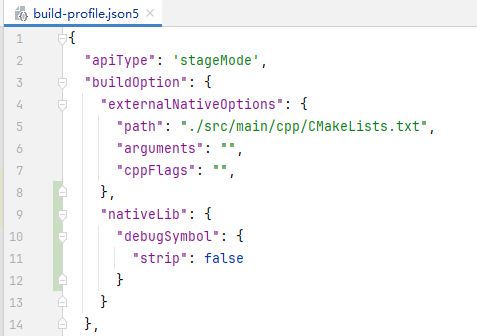
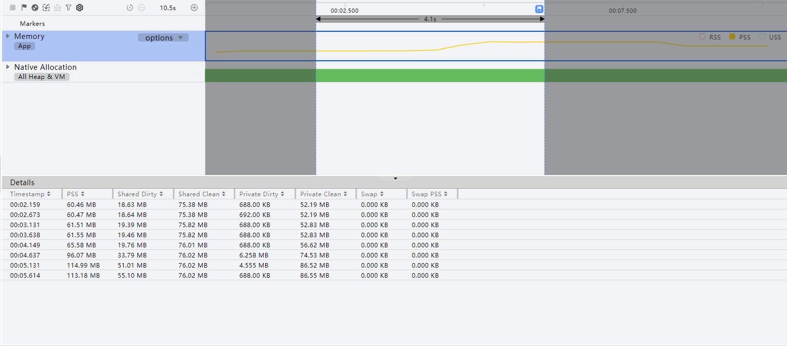
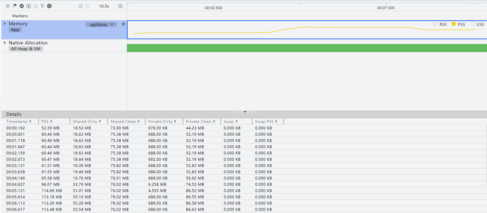
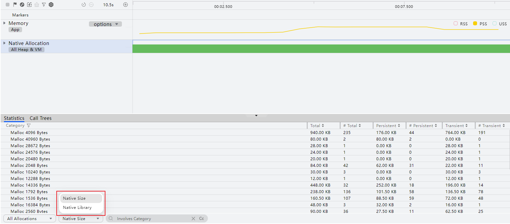

# Native内存泄漏问题检测方法

更新时间：2026-03-12 08:45:02

来源：https://developer.huawei.com/consumer/cn/doc/best-practices/bpta-stability-native-memleak-detection

##### 使用Allocation检测Native内存泄漏

应用在开发过程中，可能会因为API使用错误、变量未及时释放、异常频繁创建/释放内存等情况引发各种内存问题。
 
DevEco Profiler提供了基础的内存场景分析Allocation，您可以使用Allocation来分析应用或元服务在运行时的内存分配及使用情况，识别和定位内存泄漏、内存抖动以及内存溢出等问题，对应用或元服务的内存使用进行优化。
 
在设备连接完成后，可按照如下方法查看内存分析结果：
 1. 请参考模块级[build-profile.json5文件](https://developer.huawei.com/consumer/cn/doc/harmonyos-guides/ide-hvigor-build-profile)，增加strip字段并赋值为false（false值表示附带调试和符号信息，待发布上线版本建议恢复为true）。采集函数栈解析符号需要附带符号表信息，无符号表信息可能采集不到函数名称，因此请录制模板前按照下图进行配置。

2. 创建Allocation分析任务并录制相关数据，操作方法可参考[性能问题定位：深度录制](https://developer.huawei.com/consumer/cn/doc/harmonyos-guides/deep-recording)，或在会话区选择Open File，导入历史数据。

  
> [!NOTE]
> 在任务分析窗口，可以通过“Ctrl+鼠标滚轮”缩放时间轴，通过“Shift+鼠标滚轮”左右移动时间轴。或使用快捷键W/S放大或缩小时间轴，使用A键/D键可以左右移动时间轴。 将鼠标悬停在泳道任意位置，可以通过M键添加单点时间标签。 鼠标框选要关注的时间段，可以通过“Shift+M”添加时间段时间标签。 在任务分析窗口，可以通过“ctrl+,”向前选中单点时间标签，通过“ctrl+.”向后选中单点时间标签。 在任务分析窗口，可以通过“ctrl+[”向前选中时间段时间标签，通过“ctrl+]”向后选中时间段时间标签。 Allocation分析支持离线符号解析能力，请参见 离线符号解析 。

  Allocation分析任务支持在录制前单击

指定要录制的泳道：

  
- Memory泳道：显示当前进程的物理内存使用情况，其度量方式包含：

3. ArkTS Allocation泳道：显示方舟虚拟机上的内存分配信息。该泳道默认不展示，如需录制该泳道数据，在录制前单击左上角菜单栏

图标，勾选ArkTS Allocation泳道。由于隐私安全政策，已上架应用市场的应用不支持录制此泳道。

4. Native Allocation泳道：显示具体的Native内存分配情况，包括静态统计数据、分配栈、每层函数栈消耗的Native内存等信息。由于隐私安全政策，已上架应用市场的应用不支持录制此泳道。

5. 在目标泳道上长按鼠标左键并拖拽，框选要展示分析的时间段。Details区域中显示此时间段内指定类型的内存分析统计信息：

  Memory泳道：

  
主泳道的详情区域显示当前框选时间段内各采样点的应用内存PSS总和以及各种内存页面状态的内存占用总和。

6. 子泳道的详情区域显示该泳道所代表的内存类型的框选时间段内各采样点的PSS总和以及各种内存页面状态的实际占用情况。

7. “Details”区域中带

标识的对象，表示其可以通过窗口访问。每个时段内已释放的内存大小在柱子上置灰，未释放的内存保持绿色。

8. Statistics页签中显示该段时间内的静态分配情况，包括分配方式（Malloc或Mmap）、总分配内存大小、总分配次数、尚未释放的内存大小、尚未释放次数、已释放的内存大小、已释放次数。点击任意对象上的跳转按钮，可跳转至此类对象的详细占用/分配信息。当前统计模式下不支持跳转。

9. Call Trees页签显示线程的内存分配栈情况，包括函数地址或符号、分配大小、占比以及函数栈帧的类别等。单击任一行栈帧，“More”区域将显示经过该栈帧的分配内存最大的调用栈。

10. Allocations List显示内存分配的详细信息，包括内存块起始地址、时间戳、当前活动状态、大小、调用的库、调用库的具体函数、事件类型（与Statistics页签的分配方式对应）等。

11. （可选）根据分析结果，双击可能存在问题的调用栈，跳转至相关代码。开发者可根据实际需要进行优化。
> [!NOTE]
> 当前版本仅支持Debug版本应用跳转到用户侧Native代码。

  

  ##### 分析数据筛选

  Allocation分析过程中提供多种数据筛选方式，方便开发者缩小分析范围，更精确地定位问题所在。

  

  ##### 通过内存状态筛选

  在Allocation分析过程中，对“Native Allocation”泳道的内存状态信息进行过滤，便于开发者定位内存问题。

  在“Native Allocation”泳道的“Details”区域左下方的下拉框中，可以选择过滤内存状态：

  
All Allocations：详情区域展示当前框选时间段内的所有内存分配信息。
- Created & Existing：详情区域展示当前框选时间段内分配未释放的内存。
- Created & Released：详情区域展示当前框选时间段内分配已释放的内存。

 

 
 

##### 通过统计方式筛选

在“Native Allocation”泳道的“Statistics”页签中，可以打开“Native Size”选择统计方式以过滤统计数据：
 
- Native Size：详情区域按照对象的Native内存进行展示。
- Native Library：详情区域按照对象的so库进行展示。

 

 
 

##### 通过so库名筛选

在“Native Allocation”泳道的“Allocations List”页签中，可以单击“Click to choose”选择要筛选的so库以过滤出与目标so库相关的数据：
 

 
 

##### 通过搜索筛选

在**Native Allocation**泳道的页签中， 根据界面提示信息输入需要搜索的项目，可定位到相关内容位置，使用搜索框的<、>按键可依次显示搜索结果的详细内容。
 

 
 

##### 筛选内存分配堆栈

在Native Allocation泳道的Call Trees页签中，可以通过底部的“Call Trees”和“Constraints”选择框来过筛选和过滤内存分配栈。
 
Call Trees选择框包含两种过滤条件：
 
- Separate by Allocated Size：在内存分配栈完全相同的情况下，会按照每次分配栈申请的内存大小将栈分开；
- Hide System Libraries：隐藏内存分配栈中的系统堆栈。

 

 
Constraints选择框也包含了两种过滤条件：
 
- Count：根据指定的内存申请次数过滤内存分配栈信息；
- Bytes：根据指定的内存申请大小过滤内存分配栈信息。

 

 
在Call Trees页签的More区域，单击“Heaviest Stack”旁的隐藏按钮可以单独控制是否显示More区域最大内存分配栈中的系统堆栈。
 

 
在Call Trees页签，可以通过底部的“Flame Chart”切换到火焰图视图。
 

 
 

##### 分析启动内存

应用/元服务在启动过程中对内存资源的占用情况，是开发者较为关心的问题。DevEco Profiler的Allocation分析任务，提供了启动内存分析能力，协助开发者优化启动过程的内存占用。
 
针对调测应用的当前运行情况，DevEco Profiler对其做如下处理：
- 如选择的是已安装但未启动的应用，在启动该分析任务时，会自动拉起应用，进行数据录制，结束录制后可正常进入解析阶段。
- 如选择的是正在运行的应用，在启动该分析任务时，会先将应用关停，再自动拉起应用，进行数据录制，结束录制后可正常进入解析阶段。

 
 
具体操作方法为：在任务列表中单击Allocation任务后的

按钮
 
在分析结束后，呈现出的数据类型以及相应的处理方法，与非启动过程的分析相同。
