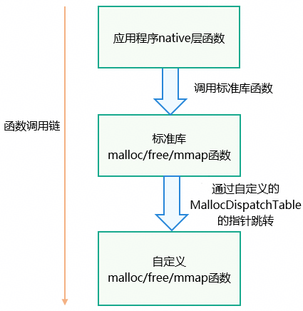

# 内存泄漏定制能力开放使用指导

更新时间：2026-03-19 08:43:01

来源：https://developer.huawei.com/consumer/cn/doc/best-practices/bpta-malloc-dispatch-table

## 概述


三方应用的内存泄漏问题往往难以定位，传统分析方式效率低下。为提升排查效率，HarmonyOS提供了MallocDispatchTable机制，支持开发者定制内存分配函数的Hook行为，灵活插入自定义监控逻辑，从而实现对内存分配行为的精准追踪与泄漏场景的主动捕获。通过这一能力，开发者可按需定制Hook策略，如记录调用栈、统计分配频次、设置阈值告警等，显著增强内存泄漏问题的定制化分析能力。

注：Hook是计算机编程中的一种钩子技术，它允许开发者拦截、修改或扩展函数的行为。通过使用钩子，开发者可以注入自定义代码，在特定事件发生时修改程序的行为。

本文将介绍以下内容：

- [MallocDispatchTable简介](#section192072233251)
- [MallocDispatchTable的Hook流程](#section18679163332511)
- [场景案例](#section1893852252419)


## 实现原理


### MallocDispatchTable简介


MallocDispatchTable简称内存分配表，提供对HarmonyOS libc标准库中的malloc、calloc、realloc、free等内存操作系列函数的Hook能力。此能力可用于跟踪应用的内存分配/释放信息，辅助内存泄漏问题快速定界定位。

注：内存基础知识参考文档：内存基础知识。


### MallocDispatchTable的Hook流程


如下图示例，开发者可使用自定义函数替换标准库函数，应用程序调用标准库函数时实际上执行的是自定义的函数。通过MallocDispatchTable里的函数指针，调用标准库函数时可以重定向到自定义的函数。MallocDispatchTable的主要功能在于将标准库函数的实现和自定义函数进行解耦。





开发人员可使用提供的OH_HiDebug_SetMallocDispatchTable()接口设置libc标准库中使用的MallocDispatchTable；使用OH_HiDebug_GetDefaultMallocDispatchTable()接口获取libc中默认的MallocDispatchTable。


## 场景案例


### 场景描述


开发者观察到程序的匿名内存大小持续上涨，需要记录程序调用标准库的mmap和munmap函数的信息（包括分配内存大小、地址），从而统计使用mmap分配但未被释放（未记录到使用munmap释放对应内存地址）的内存大小。


### 开发步骤


1. **添加头文件依赖。**
```text
#include "hidebug/hidebug.h"
#include "hidebug/hidebug_type.h"
```
 开发首先需要引用MallocDispatchTable相关的头文件。
2. **创建自定义mmap和munmap方法。**
```cpp
static void* MyMmap(void* addr, size_t len, int prot, int flags, int fd, off_t offset)
{
  HiDebug_MallocDispatch* original = (HiDebug_MallocDispatch*)OH_HiDebug_GetDefaultMallocDispatchTable();
  void* returnAddr = original->mmap(addr, len, prot, flags, fd, offset);
  OH_LOG_INFO(LOG_APP, "test MyMmap with len:%{public}d and addr:%{public}p", len, returnAddr);
  return returnAddr;
}

static int MyMunmap(void* addr, size_t len)
{
  HiDebug_MallocDispatch* original = (HiDebug_MallocDispatch*)OH_HiDebug_GetDefaultMallocDispatchTable();
  OH_LOG_INFO(LOG_APP, "test MyMunmap with len:%{public}d and addr:%{public}p", len, addr);
  return original->munmap(addr, len);
}
```
 自定义的函数中将内存地址（函数参数addr）以及内存区间大小（函数参数len）通过日志打印。
3. **创建一个[HiDebug_MallocDispatch](https://developer.huawei.com/consumer/cn/doc/harmonyos-references/capi-hidebug-hidebug-mallocdispatch)类型的分配表。**
```cpp
//Obtain default MallocDispatchTable that can allocate memory directly.
HiDebug_MallocDispatch* original = (HiDebug_MallocDispatch*)OH_HiDebug_GetDefaultMallocDispatchTable();
//Create a MallocDispatchTable struct called current.
HiDebug_MallocDispatch* current = (HiDebug_MallocDispatch*)original->malloc(sizeof(HiDebug_MallocDispatch));
memset(current, 0, sizeof(HiDebug_MallocDispatch));
//replace function pointers of current, from which self-defined functions can be redirected.
current->mmap = MyMmap;
current->munmap = MyMunmap;
```
 创建一个HiDebug_MallocDispatch结构体current，通过[OH_HiDebug_GetDefaultMallocDispatchTable()](https://developer.huawei.com/consumer/cn/doc/harmonyos-references/capi-hidebug-h#oh_hidebug_getdefaultmallocdispatchtable)分配其占用的堆内存。修改结构体中的函数指针，让其指向之前定义的MyMmap和MyMunmap函数。
4. **启用自定义 MallocDispatchTable。**
```cpp
OH_HiDebug_SetMallocDispatchTable(current);
```
 将[libc标准库](https://developer.huawei.com/consumer/cn/doc/harmonyos-references/musl)中使用的MallocDispatchTable替换成自定义的分配表。
5. **调用libc标准库中的mmap函数。**
```cpp
char* mapPtr = nullptr;
const size_t bufferSize = 100;  // 100 : the size of memory
mapPtr = (char*)mmap(nullptr, bufferSize, PROT_READ | PROT_WRITE, MAP_SHARED | MAP_ANONYMOUS, -1, 0);
if (mapPtr == MAP_FAILED) {
  printf("mmap failed\n");
  return;
}
munmap(mapPtr, bufferSize);
```
 在执行上述基础库mmap函数时，会自动重定向到先前定义的MyMmap函数，完成业务自定义功能。
6. **停用自定义 MallocDispatchTable。**
```text
//release memory of self-defined MallocDispatchTable struct.
HiDebug_MallocDispatch* original = (HiDebug_MallocDispatch*)OH_HiDebug_GetDefaultMallocDispatchTable();
original->free(current);
//reset MallocDispatchTable strut that libc uses.
OH_HiDebug_RestoreMallocDispatchTable();
```
 调用[OH_HiDebug_RestoreMallocDispatchTable()](https://developer.huawei.com/consumer/cn/doc/harmonyos-references/capi-hidebug-h#oh_hidebug_restoremallocdispatchtable)接口可以恢复标准库默认的MallocDispatchTable。
7. **CMakeLists.txt文件中添加如下依赖项。**
```text
add_library(entry SHARED napi_init.cpp test_backtrace.cpp test_malloc_dispatch.cpp)
target_link_libraries(entry PUBLIC libace_napi.z.so libhilog_ndk.z.so libohhidebug.so)
```


若应用程序设置了自定义的MallocDispatchTable，则与HarmonyOS提供的部分机制存在互斥，请在上述步骤4启用自定义MallocDispatchTable后注意。

具体限制如下：

1. 无法通过GWP-ASan功能进行内存越界检测。GWP-ASan 的工作原理详见文档：[GWP-ASan检测原理](https://developer.huawei.com/consumer/cn/doc/best-practices/bpta-stability-address-sanitizer-principle#section555616291854)。
2. 无法通过使用[native hook插件](https://developer.huawei.com/consumer/cn/doc/harmonyos-guides/hiprofiler#native-hook插件)对该应用程序进行函数调用栈捕获。


1. 禁止在自定义方法中调用[libc标准库](https://developer.huawei.com/consumer/cn/doc/harmonyos-references/musl)内存操作函数（malloc/free/mmap/munmap），否则会导致死循环。
2. 禁止在自定义malloc方法中使用[hilog](https://developer.huawei.com/consumer/cn/doc/harmonyos-guides/hilog)进行日志打印，否则会导致死锁问题。


## 示例代码


- [性能分析工具](https://gitcode.com/HarmonyOS_Samples/guide-snippets/blob/master/PerformanceAnalysisKit/HiDebugTool/README_zh.md)
