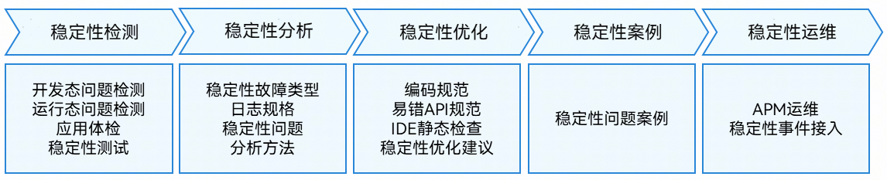

# 稳定性概览

更新时间：2026-03-12 08:45:02

来源：https://developer.huawei.com/consumer/cn/doc/best-practices/bpta-stability-overview

应用稳定性是影响用户体验的重要因素之一，常见的稳定性问题包括：崩溃、应用冻屏、内存泄漏、内存越界等。HarmonyOS提供了完善的稳定性治理框架，围绕着稳定性治理活动，HarmonyOS提供了丰富的工具，工具覆盖开发、调试、上线及运维全生命周期。
 
具体用于稳定性治理活动的工具有日志、应用事件、调用链跟踪、故障管理、观测信息剖析等。HarmonyOS生态厂家可以通过工具之一的应用事件获取相应的故障信息，进一步可以基于应用事件构造在线运维系统APM（Application Performance Management）。在开发阶段，开发者可以通过DevEco Studio调试调优工具进行快速的稳定性问题定界定位。在应用上线后，开发者可以基于APM系统进行故障分析与处理、指标度量、应用质量分析等各项运维活动，提升应用稳定性。
 
以下稳定性最佳实践，结合HarmonyOS生态实践要求，按照故障稳定性检测、稳定性分析、稳定性优化、稳定性案例、稳定性运维等内容，介绍HarmonyOS生态稳定性治理的完整方案。
 

