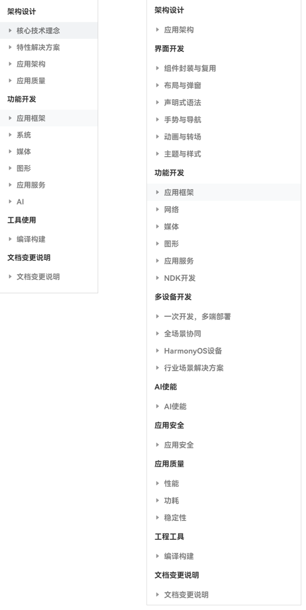
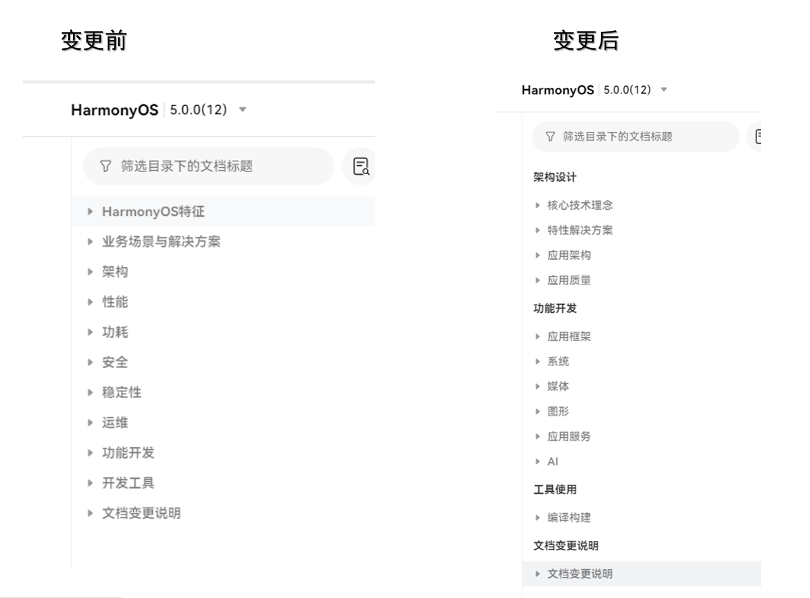

# 最佳实践文档变更说明

更新时间：2026-05-18 00:55:31

来源：https://developer.huawei.com/consumer/cn/doc/best-practices/changelog

#### 2026年4月
#### 自由流转目录结构变更
**变更背景**
为提升开发者使用体验，对全场景协同章节进行全面优化：指南中的自由流转迁移至最佳实践，与全场景协同章节相整合。
**变更内容**
- 将全场景协同更名为自由流转。
- 原指南中的自由流转内容下架，相关内容整合迁移至最佳实践 > 自由流转目录，并与最佳实践中原有的全场景协同内容合并。
- 最佳实践下的自由流转目录重新划分为跨端迁移、多端协同、典型全场景协同开发案例三部分，在原有内容基础上调整目录结构，并优化融合《自由流转概述》《应用接续概述》《应用接续数据迁移》《跨设备拖拽》《跨设备剪贴板》指南文章。
- 调整后，自由流转目录将在最佳实践板块下形成完整的知识体系架构，指导开发者全方位理解并实践自由流转开发。

#### 删除文档
删除文档2篇。
**媒体**
- 音频播放交互场景：介绍在音乐播放器应用中，如何从应用与用户、播放设备以及其他应用的交互三方面入手，为应用带来灵活多样、符合用户直觉的交互体验的示例方案。
- 视频播放：介绍如何基于HarmonyOS能力快速实现视频播放应用。

#### 2026年3月
#### 新增文档
新增文档4篇。
**全场景协同**
- [内容编辑多设备协同](https://developer.huawei.com/consumer/cn/doc/best-practices/bpta-continue)：介绍如何通过应用接续功能（实现不同设备间的快速切换）和跨设备互通功能，提升内容发布的便利性。
- [视频投播](https://developer.huawei.com/consumer/cn/doc/best-practices/bpta-vdeocast)：介绍如何高效利用系统投播组件和接口实现视频投播。
- [音频投播](https://developer.huawei.com/consumer/cn/doc/best-practices/bpta-audio-cast)：介绍如何高效利用系统投播组件和接口实现音频投播。
- [办公编辑全场景协同最佳实践](https://developer.huawei.com/consumer/cn/doc/best-practices/bpta-collaboration-office)：介绍如何插入其他设备的图文、切换设备继续编辑、分享协作。

#### 2026年2月
#### 新增文档
新增文档15篇。
**应用框架**
- [应用图标配置与开发](https://developer.huawei.com/consumer/cn/doc/best-practices/bpta-app-icon-configuration)：介绍了应用图标生成、配置、相关规范与常见开发场景。
**媒体**
- [管理音频输出设备开发实践](https://developer.huawei.com/consumer/cn/doc/best-practices/bpta-managing-audio-output-devices)：介绍了如何实现获取输出设备信息、切换输出设备、响应设备变更等场景，并对开发过程中的常见问题提供解决方案。
- [概述](https://developer.huawei.com/consumer/cn/doc/best-practices/bpta-general-comments)：介绍了多样化的音频播放的实现形式，为了帮助开发者快速了解音频播放功能，提供五种音频格式和业务场景快速选型。
- [基于AudioRender播放PCM音频](https://developer.huawei.com/consumer/cn/doc/best-practices/bpta-playing-pcm-audio-based-audiorenderer)：介绍了如何指导开发者使用AudioRender接口实现播放PCM音频的功能。
- [基于OHAudio播放PCM音频](https://developer.huawei.com/consumer/cn/doc/best-practices/bpta-playing-pcm-audio-based-ohaudio)：介绍了如何指导开发者使用OHAudio接口实现播放PCM音频的功能。
- [基于AVPlayer播放格式化音频（ArkTS](https://developer.huawei.com/consumer/cn/doc/best-practices/bpta-playing-formatted-audio-based-avplayer-arkts)）：介绍了如何指导开发者使用AVPlayer的ArkTS API实现播放格式化音频的功能。
- 基于AVPlayer播放格式化音频（C++）：介绍了如何指导开发者使用AVPlayer的Native API实现播放格式化音频的功能。
- [基于SoundPool播放短音频](https://developer.huawei.com/consumer/cn/doc/best-practices/bpta-playing-short-audio-based-soundpool)：介绍了如何指导开发者使用SoundPool开发播放短音频功能。
- [概述](https://developer.huawei.com/consumer/cn/doc/best-practices/bpta-audio-record-overview)：介绍了五个不同的音频格式和业务场景快速选型，并提供各个方案音频录制支持的能力对比。
- [基于AudioCapturer录制PCM音频（ArkTS）](https://developer.huawei.com/consumer/cn/doc/best-practices/bpta-audio-record-base-on-audiocapturer)：介绍了基于AudioCapturer如何录制PCM音频，指导开发者基于不同的业务场景，使用AudioCapturer实现音频录制功能。
- [基于OHAudio录制PCM音频（C++）](https://developer.huawei.com/consumer/cn/doc/best-practices/bpta-audio-record-base-on-ohaudio)：介绍了基于OHAudio如何录制PCM音频，指导开发者实现基础录制。
- [基于AVRecorder录制格式化音频（ArkTS）](https://developer.huawei.com/consumer/cn/doc/best-practices/bpta-audio-record-base-on-avrecorder-arkts)：介绍了在ArkTS侧基于AVRecorder如何录制格式化音频，指导开发者实现基础录制。
- [基于AVRecorder录制格式化音频（C++）](https://developer.huawei.com/consumer/cn/doc/best-practices/bpta-audio-record-base-on-avrecorder)：介绍了在C/C++侧基于AVRecorder如何录制格式化音频，指导开发者实现基础录制。
- [基于AVScreenCapture录制音频](https://developer.huawei.com/consumer/cn/doc/best-practices/bpta-audio-record-base-on-avscreencapture)：介绍了如何基于AVScreenCapture录制音频，指导开发者实现基础录制。
**性能**
- [高性能Protobuf解析](https://developer.huawei.com/consumer/cn/doc/best-practices/bpta-high-performance-protobuf-parsing)：介绍了以TurboTransProtobuf框架为核心，围绕Protobuf序列化和反序列化的典型场景，包括其使用要点及性能优势。

#### 优化文档
优化文档3篇。
**媒体**
- [基于AudioRender播放PCM音频](https://developer.huawei.com/consumer/cn/doc/best-practices/bpta-playing-pcm-audio-based-audiorenderer)：新增低功耗音频播放场景。
**一次开发，多端部署**
- [响应式布局](https://developer.huawei.com/consumer/cn/doc/best-practices/bpta-multi-device-responsive-layout)：新增断点环境介绍。
**行业场景解决方案**
- [视频类应用横竖屏切换](https://developer.huawei.com/consumer/cn/doc/best-practices/bpta-landscape-and-portrait-development)：由横竖屏切换文章优化生成，新增通过页面跳转实现横竖屏切换章节。

#### 2026年1月
#### 新增文档
新增文档10篇。
**主题与样式**
- [基于colorFilter实现图片滤镜效果](https://developer.huawei.com/consumer/cn/doc/best-practices/bpta-implementing-image-filters)：介绍了如何基于原始图像，使用[colorFilter](https://developer.huawei.com/consumer/cn/doc/harmonyos-references/ts-basic-components-image#colorfilter9)属性实现复古、反色、增强饱和度及美白等常见滤镜效果，并详细解析[colorFilter](https://developer.huawei.com/consumer/cn/doc/harmonyos-references/ts-basic-components-image#colorfilter9)的4x5 RGBA转换矩阵和颜色滤波器两种使用方式。
- [基于resizable实现图片拉伸效果](https://developer.huawei.com/consumer/cn/doc/best-practices/bpta-implementing-image-resizable)：介绍了如何使用resizable属性实现图片拉伸效果，例如聊天消息气泡和可拉伸占位图两个典型场景。
**媒体**
- [基于AudioRender和AudioCapturer实现音频波形动画](https://developer.huawei.com/consumer/cn/doc/best-practices/bpta-audio-ripple-animation)：介绍了如何基于AudioRender和AudioCapturer实现音频波形动画，例如实现音频播放和音频录制的波形。
- [管理音频输入设备开发实践](https://developer.huawei.com/consumer/cn/doc/best-practices/bpta-managing-audio-input-devices)：介绍了音频输入设备的管理，指导开发者实现获取输入设备信息、切换输入设备、响应设备变更等场景，并提供开发过程中常见问题的解决方案。
- [基于Audio能力实现音频耳返](https://developer.huawei.com/consumer/cn/doc/best-practices/bpta-audio-in-ear-monitor)：介绍了如何基于AudioLoopback和OHAudio实现音频耳返。
**图形**
- [图像模糊卡顿问题分析](https://developer.huawei.com/consumer/cn/doc/best-practices/bpta-analysis-of-image-blurring)：介绍了图像模糊卡顿问题检测、分析和优化方案。
**一次开发，多端部署**
- [多设备适配屏幕差异](https://developer.huawei.com/consumer/cn/doc/best-practices/bpta-multi-device-screen-diff)：介绍了如何适配多设备屏幕差异和如何适配折叠设备屏幕。
**行业场景解决方案**
- [基于媒体能力实现直播连麦功能](https://developer.huawei.com/consumer/cn/doc/best-practices/bpta-hmos-live-stream-audio-call)：介绍了客户端开播侧的音视频流解码播放技术实现方案。
**测试框架**
- [自动化测试框架开发实践](https://developer.huawei.com/consumer/cn/doc/best-practices/bpta-automated-testing-frameworks)：介绍了单元测试框架和UI测试框架的实现，旨在帮助开发者了解和掌握自动化测试框架的开发流程与实现细节。
**性能**
- [并行化性能优化](https://developer.huawei.com/consumer/cn/doc/best-practices/bpta-concurrent-optimization)：介绍了如何使用TaskPool和Sendable来进行并行化改造，从而提升性能。

#### 优化文档
优化文档5篇。
**媒体**
- [自定义相机拍照](https://developer.huawei.com/consumer/cn/doc/best-practices/bpta-custom-camera-photo)：新增使用音量键拍照章节和使用音量键拍照的开发步骤。
- [HDR Vivid视频播放与录制开发实践](https://developer.huawei.com/consumer/cn/doc/best-practices/bpta-hdrvivid)：由HDR Vivid视频录制、播放与转码文档拆分生成。
- [HDR Vivid视频转码SDR视频开发实践](https://developer.huawei.com/consumer/cn/doc/best-practices/bpta-hdrtosdr)：由HDR Vivid视频录制、播放与转码文档拆分生成。
**性能**
- [运行效率提高](https://developer.huawei.com/consumer/cn/doc/best-practices/bpta-improve-running-efficiency)：新增路径展开实践场景。
- [操作延时触发](https://developer.huawei.com/consumer/cn/doc/best-practices/bpta-delayed-trigger-operation)：新增模块化lazy-import、动态import实践场景。

#### 删除文档
删除文档1篇。
**媒体**
- 生态应用相机实现系统级相机体验：本文针对三方相机开发场景，基于HarmonyOS提供的相机开放能力，实现系统相机级别的效果和能力，比如分辨率、动图、视频防抖、连续变焦等。

#### 2025年12月
#### 新增文档
新增文档7篇。
**应用框架**
- [Web组件拦截能力的使用](https://developer.huawei.com/consumer/cn/doc/best-practices/bpta-web-interceptor)：介绍三种基于Web组件的拦截方案，并提供各方案在典型应用场景中的实例，帮助开发者更好地掌握ArkWeb拦截能力的选择和使用。
**媒体**
- [音质切换开发实践](https://developer.huawei.com/consumer/cn/doc/best-practices/bpta-sound-quality-switching)：介绍了音质切换功能的实现，如何在AVPlayer和AudioRenderer之间实现切换播放。
- [图片合成视频开发实践](https://developer.huawei.com/consumer/cn/doc/best-practices/bpta-image-to-video-synthesis)：以图库图片合成视频场景为例，介绍了图片解码、图片数据编码、视频生成的主要步骤，并给出开发过程中常见问题的分析思路和解决方案。
**应用安全**
- [ArkWeb组件安全开发](https://developer.huawei.com/consumer/cn/doc/best-practices/bpta-arkweb-component-security)：介绍了在安全的Web资源访问、恰当的权限管控、确保敏感数据传输安全三种典型开发场景下，如何系统性提升应用的整体安全水平。
**性能**
- [高性能JSON解析](https://developer.huawei.com/consumer/cn/doc/best-practices/bpta-high-performance-json-parsing)：介绍了围绕JSON序列化和反序列化的典型场景，包括TurboTransJSON框架的使用要点及性能优势。
- [JsLeakWatcher开发实践](https://developer.huawei.com/consumer/cn/doc/best-practices/bpta-js-leak-watcher)：本文介绍如何使用JsLeakWatcher工具检测js对象泄漏。
- [内存泄漏定制能力开放使用指导](https://developer.huawei.com/consumer/cn/doc/best-practices/bpta-malloc-dispatch-table)：本文介绍如何使用MallocDispatchTable进行内存泄漏维测。

#### 优化文档
优化文档6篇。
**网络**
- [低功耗蓝牙基础使用](https://developer.huawei.com/consumer/cn/doc/best-practices/bpta-bluetooth-low-energy)：新增了BLE扫描过滤器的使用，新增自动重连功能，新增常见问题说明，优化了蓝牙数据传输部分的交互流程以及接口调用的前后顺序说明。
**媒体**
- [音画同步](https://developer.huawei.com/consumer/cn/doc/best-practices/bpta-audio-video-synchronization)：新增音画同步功能开发流程图、新增音画同步本地视频，网络视频，录制视频三种开发场景介绍。
- [自定义相机预览](https://developer.huawei.com/consumer/cn/doc/best-practices/bpta-custom-camera-preview)：新增预览人脸检测章节，介绍了预览流人脸检测信息。
**一次开发，多端部署**
- [多设备工程部署](https://developer.huawei.com/consumer/cn/doc/best-practices/bpta-multi-device-ide)：优化DevEco的版本截图和新增多设备工程部署的注意事项。
- [窗口沉浸式](https://developer.huawei.com/consumer/cn/doc/best-practices/bpta-multi-device-window-immersive)：新增自由窗口标题栏沉浸示例。
- [音频焦点管理解决方案](https://developer.huawei.com/consumer/cn/doc/best-practices/bpta-audio-focus-management)：新增应用内多音频流焦点处理章节，新增移动端和电脑端音频焦点默认策略差异介绍，短视频滑动漏音增加代码介绍。

#### 2025年11月
#### 新增文档
新增文档1篇，为图形模块。
**图形**
- [基于Canvas实现录像回放时间轴](https://developer.huawei.com/consumer/cn/doc/best-practices/bpta-implement-timeline-based-on-canvas)：介绍了如何实现TimeBarView时间轴组件，并结合“滑动时间轴控制视频播放”的核心场景，阐述TimeBarView组件的使用方法。

#### 优化文档
优化文档3篇。
**媒体**
- [HDR Vivid视频录制、播放与转码](https://developer.huawei.com/consumer/cn/doc/best-practices/bpta-hdrvivid)：HDR转码SDR补充原理说明，新增AVCodec转码。
**一次开发，多端部署**
- [页面布局场景](https://developer.huawei.com/consumer/cn/doc/best-practices/bpta-multi-device-page-layout)：合并《分栏布局》、《分级导航》内容，增加类小红书方案，聊天详情页到商品链接页跳转，并实现从双栏显示修改为单栏显示的最佳实践方式。
- [多设备股票类界面](https://developer.huawei.com/consumer/cn/doc/best-practices/multi-ticket-class)：重写文档，从概述、UX设计、工程管理、窗口适配、界面开发、自选股页面、股票详情页方面介绍多设备股票类界面应用。

#### 删除文档
删除文档2篇。
**一次开发，多端部署**
- 分栏布局：优化文档标题名称，新增常见问题章节——如何实现应用在手机设备竖屏状态下单栏显示，横屏状态下双栏显示？
- 分级导航：本文提供分级导航栏的多端适配方案及指导，解决一多开发实现导航栏内的分级效果问题。

#### 2025年10月
#### 新增文档
新增文档2篇，为媒体和全场景协同。
**媒体**
- [基于Surface模式进行视频编码](https://developer.huawei.com/consumer/cn/doc/best-practices/bpta-surface-encoder)：介绍了通过NativeWindow来传递编码的输入数据，使用AVCodec提供的视频编码能力实现视频编码的过程。
**全场景协同**
- [隔空传送快速分享](https://developer.huawei.com/consumer/cn/doc/best-practices/bpta-application-gesture-share)：介绍应用如何实现隔空传送分享文件与链接。

#### 优化文档
优化文档2篇。
**一次开发，多端部署**
- [多设备交互](https://developer.huawei.com/consumer/cn/doc/best-practices/bpta-multi-interaction)：重新优化了多设备交互大纲设计，增加多种交互设备交互方式。
**多端设备支持**
- [智能穿戴应用开发](https://developer.huawei.com/consumer/cn/doc/best-practices/bpta-smartwatch)：优化了目录结构，重构文档大纲。

#### 2025年9月
#### 新增文档
新增文档13篇，为组件封装与复用、应用框架、媒体、布局与弹窗、全场景协同、多端设备支持和行业场景解决方案。
**组件封装与复用**
- [组件复用问题诊断分析](https://developer.huawei.com/consumer/cn/doc/best-practices/bpta-component-reuse-issue-diagnosis-and-analysis)：以列表组件为例，介绍组件复用常见问题的分析与解决方案。
**应用框架**
- [Web页面跨域解决方案](https://developer.huawei.com/consumer/cn/doc/best-practices/bpta-cross-domain-solutions-for-web-pages)：介绍了基于ArkWeb拦截器和Cookies管理能力实现Web页面跨域，快速解决实际项目中的跨域难题。
**网络**
- [多网并发网络加速](https://developer.huawei.com/consumer/cn/doc/best-practices/bpta-multi-path-network-turbo)：介绍了多网并发的机制原理与基本开发流程，结合大文件分片传输和多文件并发传输两个实际应用场景介绍多网并发能力的适配方案。
**媒体**
- [基于AVPlayer基础播控实践](https://developer.huawei.com/consumer/cn/doc/best-practices/bpta-avplayer-basic-control)：介绍了如何基于AVPlayer系统播放器实现视频播放、暂停、跳转播放、静音播放、循环播放、窗口缩放模式设置、倍速设置、音量设置等基本开发场景。
- [基于AVPlayer播放长视频实践](https://developer.huawei.com/consumer/cn/doc/best-practices/bpta-avplayer-long-video)：介绍了如何基于AVPlayer系统播放器实现长视频播放。
- [基于AVPlayer播放短视频实践](https://developer.huawei.com/consumer/cn/doc/best-practices/bpta-avplayer-short-video)：介绍了如何实现基本播控能力、焦点管理、前后台感知、横竖屏切换和旋转感知和短视频列表流畅切换场景。
- [基于AVPlayer播放嵌入式短视频实践](https://developer.huawei.com/consumer/cn/doc/best-practices/bpta-avplayer-embeded-short-video)：介绍如何基于[AVPlayer](https://developer.huawei.com/consumer/cn/doc/harmonyos-references/arkts-apis-media-avplayer)系统播放器实现嵌入式短视频播放。
- [基于AVPlayer播放网络视频](https://developer.huawei.com/consumer/cn/doc/best-practices/bpta-avplayer-embeded-network-video)：介绍如何基于AVPlayer系统播放器实现网络视频播放。
- [渲染视频画面](https://developer.huawei.com/consumer/cn/doc/best-practices/bpta-video-render)：介绍了视频解码后渲染视频画面的三种方式，包括基于XComponent渲染、基于OpenGL渲染和基于Vulkan渲染。
**布局与弹窗**
- [实现富文本编辑器](https://developer.huawei.com/consumer/cn/doc/best-practices/bpta-rich-text-editor)：介绍了如何使用RichEditor组件，在内容发布场景中实现自定义表情、@好友、添加话题等功能，并提供示例代码详细拆解细节逻辑，如@好友如何被视为一个整体，编辑器中内容如何获取并归一化处理等。
**全场景协同**
- [音频投播](https://developer.huawei.com/consumer/cn/doc/best-practices/bpta-audio-cast)：介绍了如何高效利用系统投播组件和接口实现音频投播。
**多端设备支持**
- [Mate TV智慧屏应用开发](https://developer.huawei.com/consumer/cn/doc/best-practices/bpta-matetv-guide)：介绍了Mate TV智慧屏的设备特点、参数、设计规范、窗口、界面、功能开发等。
**行业场景解决方案**
- [媒体直播场景解决方案](https://developer.huawei.com/consumer/cn/doc/best-practices/bpta-hmos-live-stream-solution)**：**介绍了如何基于系统的媒体底座能力实现媒体直播系统的解决方案。包括开播端的音视频采集与编码、看播端的流媒体播放与音画同步等技术方案。

#### 优化文档
优化文档6篇。
**多端设备支持**
- [三折叠应用开发](https://developer.huawei.com/consumer/cn/doc/best-practices/bpta-matext-guide)：优化原有大纲结构，新增硬件说明、相机参数说明以及常见问题，增加了XTs的部分内容。
- [电脑应用开发](https://developer.huawei.com/consumer/cn/doc/best-practices/bpta-pc-guide)：在原有的PC/2in1文档的基础上优化重写，介绍电脑设备特点，参数，设计规范，和窗口、界面、功能开发等。
**性能**
- [点击响应时延分析](https://developer.huawei.com/consumer/cn/doc/best-practices/bpta-click-to-click-response-optimization)：新增使用AppAnalyzer工具检测和分析点击响应时延。
- [点击完成时延分析](https://developer.huawei.com/consumer/cn/doc/best-practices/bpta-click-to-complete-delay-analysis)：新增使用AppAnalyzer工具检测和分析点击完成时延。
- [应用冷启动时延优化](https://developer.huawei.com/consumer/cn/doc/best-practices/bpta-application-cold-start-optimization)：新增章节应用冷启动时延检测与分析，介绍了体检工具AppAnalyzer检测应用冷启动时延的操作步骤及问题分析。
- [图片资源加载优化](https://developer.huawei.com/consumer/cn/doc/best-practices/bpta-texture-compression-improve-performance)：新增非预置图片资源加载优化章节等内容。

#### 2025年8月
#### 新增文档
新增文档5篇，包括布局与弹窗和多端设备支持。
**布局与弹窗**
- [富文本显示的选型与开发](https://developer.huawei.com/consumer/cn/doc/best-practices/bpta-rich-text-display)：介绍了高亮显示的超链接文本、自定义表情、图标与文本的组合元素、自定义的图文元素四个场景的富文本信息的效果实现。
**网络**
- [网络信息查询与连接管理](https://developer.huawei.com/consumer/cn/doc/best-practices/bpta-common-network-query)：介绍了常用的网络信息查询与连接管理功能实现，包括获取网络类型、检查网络可用性、监听网络状态变化、查询Wi-Fi及蜂窝网络信息等
**多端设备支持**
- [MateBook Fold折叠电脑应用开发](https://developer.huawei.com/consumer/cn/doc/best-practices/bpta-mate-book-fold)：介绍了折叠电脑的设备特点、参数、设计规范、窗口、界面、功能开发等。
**全场景协同**
- [跨设备剪贴板](https://developer.huawei.com/consumer/cn/doc/best-practices/bpta-distributed-pasteboard)：介绍了跨设备剪贴板如何通过全场景协同能力同步剪贴板内容，实现手机、PC/2in1、平板等设备间的无缝数据互通。
- [碰一碰文件分享](https://developer.huawei.com/consumer/cn/doc/best-practices/bpta-application-knock-file-share)：介绍应用如何实现碰一碰文件分享。

#### 优化文档
优化文档3篇。
**一次开发，多端部署**
- 分栏布局：优化文档标题名称，新增常见问题章节——如何实现应用在手机设备竖屏状态下单栏显示，横屏状态下双栏显示？
**多端设备支持**
- [平板应用开发](https://developer.huawei.com/consumer/cn/doc/best-practices/bpta-pad-guide)：整篇文档内容优化，介绍了平板设备特点、参数、设计规范、窗口、界面、功能开发等。
- [折叠屏应用开发](https://developer.huawei.com/consumer/cn/doc/best-practices/bpta-foldable-guide)：整篇文档内容优化，介绍了折叠屏设备特点、参数、设计规范、窗口、界面、功能开发等。

#### 2025年7月
#### 应用质量目录结构变更
**变更背景**
为了提升开发者的使用体验，对应用质量的目录结构和文档内容进行补充优化，协同指南Performance Analysis Kit资料整改，提供更加整体化的DFX资料体验。
**变更内容**
对应用质量章节进行结构化调整，新增应用质量概览，作为DFX资料体系的落地页；性能、功耗、稳定性三个领域资料，按照功能概览，检测，分析，优化，案例分类展开。

#### 新增文档
新增文档50篇，包括布局与弹窗、主题与样式、媒体、应用质量概览、性能、功耗和稳定性。
**布局与弹窗**
- [常见瀑布流操作](https://developer.huawei.com/consumer/cn/doc/best-practices/bpta-waterflow-operations)：介绍了瀑布流常见操作，帮助开发者高效构建自己想要的瀑布流效果。
- [常见操作列表](https://developer.huawei.com/consumer/cn/doc/best-practices/bpta-common-list-operations)：介绍列表滚动、列表排版、列表数据更新、列表拖拽等常见功能，通过实现一个简单聊天列表的案例，来介绍常见列表操作以及对应的代码实现。
- [Tabs选项卡常见开发场景](https://developer.huawei.com/consumer/cn/doc/best-practices/bpta-development-scenarios-for-tabs)：介绍了abs选项卡常见开发场景，包括多层嵌套的Tabs、自定义Tabs样式、Tabs数据加载和动态变更显示的Tabs等。
- [基于ScrollComponents实现网格](https://developer.huawei.com/consumer/cn/doc/best-practices/bpta-grid-based-on-scrollcomponents)：介绍了如何基于ScrollComponents实现网格，实现跨页面复用、加速首屏渲染、下拉刷新等场景。
- [基于ScrollComponents实现长列表](https://developer.huawei.com/consumer/cn/doc/best-practices/bpta-list-based-on-scrollcomponents)：介绍了如何基于ScrollComponents实现长列表，实现组件高性能复用、分组布局复用、跨页面复用、加速首屏渲染、下拉刷新等场景。
- [弹窗组件封装](https://developer.huawei.com/consumer/cn/doc/best-practices/bpta-dialog-encapsulation)：介绍了如何通过使用UIContext中获取到的PromptAction对象来实现自定义弹窗工具类的封装，来实现弹窗组件封装开发。
**主题与样式**
- [自定义字体设置](https://developer.huawei.com/consumer/cn/doc/best-practices/bpta-custom-font-settings)：介绍了基于ArkUI提供的字体控制能力，如何实现自定义字体显示文本、自定义字体恢复为系统字体、字体大小跟随系统设置、字体大小不跟随系统设置等功能。
**媒体**
- [基于Buffer模式进行视频转码](https://developer.huawei.com/consumer/cn/doc/best-practices/bpta-buffer-mode-transcoding)：介绍了视频编解码的基本概念、Buffer模式下的视频编解码原理，并详细介绍了视频转码的实现方案和开发步骤。
- [基于AVScreenCapture实现屏幕录制](https://developer.huawei.com/consumer/cn/doc/best-practices/bpta-avscreencapture-for-screen-recording)：介绍如何基于AVScreenCapture实现对屏幕的录制功能，主要包括三种实现方案：ArkTS侧录屏存文件，Native侧录屏存文件，Native侧录屏转码流。
- [自定义相机预览](https://developer.huawei.com/consumer/cn/doc/best-practices/bpta-custom-camera-preview)：介绍了自定义相机预览部分由基础到进阶的开发实践。
- [自定义相机拍照](https://developer.huawei.com/consumer/cn/doc/best-practices/bpta-custom-camera-photo)：以自定义相机为例，介绍基础拍照、参数配置、分段式拍照、HDR Vivid拍照以及动图拍摄等功能。
- [自定义相机录像](https://developer.huawei.com/consumer/cn/doc/best-practices/bpta-custom-camera-video)：以自定义相机为例，介绍相机设备的创建与调用、录像的启动与停止、以及输出处理的完整流程。
**应用质量概览**
- [应用质量概览](https://developer.huawei.com/consumer/cn/doc/best-practices/bpta-quality-overview)：介绍了DFX知识体系一站式地图，包括基础能力、场景化知识地图、常用术语和相关主题。
**性能**
- [内存基础知识](https://developer.huawei.com/consumer/cn/doc/best-practices/bpta-memory-basic-knowledge)：介绍了内存基础知识相关的术语定义、分配规则、内存布局等。
- [分析ArkTS/JS内存](https://developer.huawei.com/consumer/cn/doc/best-practices/bpta-arkts-js-memory-analysis)：介绍了应用ArkTS/JS内存的占用分析，包括如何基于IDE工具如何拆解内存占用。
- [分析native内存](https://developer.huawei.com/consumer/cn/doc/best-practices/bpta-native-memory-analysis)：介绍了应用native内存的占用分析，包括如何基于IDE工具如何拆解内存占用。
- [分析内核态内存](https://developer.huawei.com/consumer/cn/doc/best-practices/bpta-kernel-memory-analysis)：介绍了应用内核态内存的占用分析，包括如何基于IDE工具如何拆解内存占用。
- [分析任务执行超时问题](https://developer.huawei.com/consumer/cn/doc/best-practices/bpta-permission-timeout-analysis)：介绍了任务执行超时问题的分析方法。
**功耗**
- [场景功耗测试](https://developer.huawei.com/consumer/cn/doc/best-practices/bpta-application-power-test)：介绍了开发态的功耗场景化检测方法。
- [功耗基础质量测试](https://developer.huawei.com/consumer/cn/doc/best-practices/bpta-power-basic-quality-test)：介绍了开发态的功耗基础质量检测方法。
- [运行态功耗检测](https://developer.huawei.com/consumer/cn/doc/best-practices/bpta-power-consumption-runtime-analysis)：介绍了运行态功耗检测方法，主要基于HiAppEvent订阅功耗领域相关系统事件。
- [CPU高负载分析](https://developer.huawei.com/consumer/cn/doc/best-practices/bpta-high-cpu-load-analysis)：介绍了CPU高负载分析方法，包括日志获取、分析思路和分析步骤。
- [前台不可见动效问题分析](https://developer.huawei.com/consumer/cn/doc/best-practices/bpta-frontend-invisible-animation-analysis)：介绍了前台不可见动效问题分析方法。
- [Vsync低功耗优化](https://developer.huawei.com/consumer/cn/doc/best-practices/bpta-vsync-power-optimization)：介绍了Vsync低功耗优化案例。
- [Buffer低功耗优化](https://developer.huawei.com/consumer/cn/doc/best-practices/bpta-buffer-power-optimization)：介绍了Buffer低功耗优化案例。
**稳定性**
- [地址越界检测能力概述](https://developer.huawei.com/consumer/cn/doc/best-practices/bpta-stability-address-sanitizer-overview)：介绍了各种地址越界检测的检测工具优劣势和使用场景。
- [地址越界经典问题类型](https://developer.huawei.com/consumer/cn/doc/best-practices/bpta-stability-address-sanitizer-catagory)：介绍了地址越界典型问题类型，包括heap-use-after-free、stack-use-after-return和overflow。
- [地址越界检测工具原理](https://developer.huawei.com/consumer/cn/doc/best-practices/bpta-stability-address-sanitizer-principle)：介绍地址越界类问题检测的底层原理，包括Asan检测原理、HWAsan检测原理、MemDebug检测原理和GWP-Asan检测原理。
- [适配常见问题](https://developer.huawei.com/consumer/cn/doc/best-practices/bpta-stability-address-sanitizer-faq)：介绍应用在适配地址越界检测的常见问题。
- [地址越界类问题检测方法](https://developer.huawei.com/consumer/cn/doc/best-practices/bpta-stability-runtime-address-sanitizer-detection)：介绍了基于HiAppEvent订阅地址越界的系统事件。
- [资源泄漏类问题检测方法](https://developer.huawei.com/consumer/cn/doc/best-practices/bpta-stability-runtime-leak-detection)：介绍了资源泄漏类问题中运行态检测的差异部分。
- [应用冻屏类问题检测方法](https://developer.huawei.com/consumer/cn/doc/best-practices/bpta-stability-runtime-freeze-detection)：介绍了基于HiAppEvent订阅应用冻屏的系统事件。
- [应用崩溃问题检测方法](https://developer.huawei.com/consumer/cn/doc/best-practices/bpta-stability-runtime-crash-detection)：介绍了基于HiAppEvent订阅应用崩溃的系统事件。
- [应用被查杀问题检测方法](https://developer.huawei.com/consumer/cn/doc/best-practices/bpta-stability-runtime-appkilled-detection)：介绍了应用发生主线程堵塞和被系统管控查杀两种场景下因为SIGKILL信号导致的查杀的监控。
- [地址越界类问题分析方法](https://developer.huawei.com/consumer/cn/doc/best-practices/bpta-stability-address-illegal-way)：介绍了地址越界问题检测能力、地址越界问题定位分析思路。
- [资源泄漏类问题分析方法](https://developer.huawei.com/consumer/cn/doc/best-practices/bpta-stability-leak-way)：介绍了资源泄漏问题的相关分析方法。
- [应用冻屏问题排查方法](https://developer.huawei.com/consumer/cn/doc/best-practices/bpta-stability-app-freeze-way)：介绍应用冻屏的问题的定位步骤与思路。
- [CppCrash类问题分析方法](https://developer.huawei.com/consumer/cn/doc/best-practices/bpta-stability-app-crash-cpp-way)：介绍了如何获取CppCrash日志、如何查看日志以及如何分析问题。
- [JS Crash类问题分析方法](https://developer.huawei.com/consumer/cn/doc/best-practices/bpta-stability-app-crash-js-way)：介绍了JS Crash类问题的问题定位思路和异常定位信息增强工具说明。
- [应用被查杀类问题分析方法](https://developer.huawei.com/consumer/cn/doc/best-practices/bpta-stability-app-killed-way)：介绍了应用被异常查杀的日志获取与分析思路和分析步骤。
- [地址越界类问题优化建议](https://developer.huawei.com/consumer/cn/doc/best-practices/bpta-stability-address-sanitizer-opt)：介绍了地址越界类问题的编码过程的优化建议。
- [资源泄漏类问题优化建议](https://developer.huawei.com/consumer/cn/doc/best-practices/bpta-stability-leak-opt)：介绍了内存泄漏问题优化建议、ashmem/ION泄漏问题优化建议、句柄泄漏问题优化建议和线程泄漏问题优化建议。
- [应用冻屏类问题优化建议](https://developer.huawei.com/consumer/cn/doc/best-practices/bpta-stability-app-freeze-opt)：介绍了应用冻屏类问题的优化建议。
- [CppCrash类问题优化建议](https://developer.huawei.com/consumer/cn/doc/best-practices/bpta-stability-cpp-crash-opt)：介绍了CppCrash类问题优化建议。
- [JS Crash类问题优化建议](https://developer.huawei.com/consumer/cn/doc/best-practices/bpta-stability-js-crash-opt)：介绍了JS Crash类问题优化建议。
- [地址越界类问题案例](https://developer.huawei.com/consumer/cn/doc/best-practices/bpta-scenario-stability-address-sanitizer)：本文按照地址越界类问题分析方法的流程展开，以实际案例的形式指导开发者如何从CppCrash日志出发，分析、定位，修复地址越界问题。
- [资源泄漏类问题案例](https://developer.huawei.com/consumer/cn/doc/best-practices/bpta-scenario-stability-leak)：本文按照资源泄漏分析方法的流程展开，以实际案例的形式指导开发者如何从泄漏维测日志出发，分析、定位具体泄漏点。
- [应用冻屏类问题案例](https://developer.huawei.com/consumer/cn/doc/best-practices/bpta-scenario-stability-app-freeze)：介绍了ThreadBlock类问题案例、APP_INPUT_BLOCK类典型案例、LIFECYCLE_TIMEOUT类典型案例和资源高负载类典型案例。
- [CppCrash类问题案例](https://developer.huawei.com/consumer/cn/doc/best-practices/bpta-scenario-stability-cppcrash)：介绍了如何分析并修复CppCrash问题。
- [JS Crash类问题案例](https://developer.huawei.com/consumer/cn/doc/best-practices/bpta-scenario-stability-jscrash)：介绍了高频的JS Crash故障案例，包括TypeError类案例和Error类案例。

#### 优化文档
优化文档17篇。
**组件封装与复用**
- [组件封装](https://developer.huawei.com/consumer/cn/doc/best-practices/bpta-ui-component-encapsulation)：补充常见问题，优化组件公共样式封装、自定义组件封装场景。
**布局与弹窗**
- [使用Swiper组件实现轮播图](https://developer.huawei.com/consumer/cn/doc/best-practices/bpta-carousel-graphic-works)：在图文作品轮播的基础上优化实现轮播图的叠加效果场景，并新增两个常见问题。
**应用框架**
- [应用切面编程设计](https://developer.huawei.com/consumer/cn/doc/best-practices/bpta-application-aspect-programming-design)：优化了补充插桩统计调用次数和namespace相关内容
**性能**
- [启动耗时类问题检测方法](https://developer.huawei.com/consumer/cn/doc/best-practices/bpta-performance-startup-time-detection)：新增启动耗时类问题的运行态检测说明。
- [滑动丢帧类问题检测方法](https://developer.huawei.com/consumer/cn/doc/best-practices/bpta-performance-sliding-frame-drop-detection)：新增滑动丢帧类问题的运行态检测说明。
- [主线程超时类问题检测方法](https://developer.huawei.com/consumer/cn/doc/best-practices/bpta-performance-mainthread-consumption-detection)：新增主线程超时类问题的运行态检测说明。
**功耗**
- [不可见组件低功耗建议](https://developer.huawei.com/consumer/cn/doc/best-practices/low-power-consumption-suggestions)：优化了案例、分析方法等。
**稳定性**
- [稳定性概览](https://developer.huawei.com/consumer/cn/doc/best-practices/bpta-stability-overview)：针对稳定性章节结果变化，优化概览描述。
- [使用Asan检测内存错误](https://developer.huawei.com/consumer/cn/doc/best-practices/bpta-stability-asan-detection)：对部分检测配置进行更新。
- [使用HWAsan检测内存错误](https://developer.huawei.com/consumer/cn/doc/best-practices/bpta-stability-hwasan-detection)：对部分检测配置进行更新。
- [使用GWP-Asan检测内存错误](https://developer.huawei.com/consumer/cn/doc/best-practices/bpta-stability-gwpasan-detection)：对部分检测配置进行更新。
- [稳定性故障类型及日志规格说明](https://developer.huawei.com/consumer/cn/doc/best-practices/bpta-stability-fault-log)：对本章节的日志类型及规格，链接到指南对应章节，本章节不做具体介绍。
- [APM能力建设](https://developer.huawei.com/consumer/cn/doc/best-practices/bpta-stability-operate-apm)：增加对当前支持的系统事件的链接，链接到指南相关章节。
- [JS内存泄漏问题检测方法](https://developer.huawei.com/consumer/cn/doc/best-practices/bpta-stability-js-memleak-detection)：新增JS内存泄漏问题检测方法文档，从原有资源泄漏问题检测章节拆分对应内容独立为一篇文章。
- [Native内存泄漏问题检测方法](https://developer.huawei.com/consumer/cn/doc/best-practices/bpta-stability-native-memleak-detection)：新增Native内存泄漏问题检测方法文档，从原有资源泄漏问题检测章节拆分对应内容独立为一篇文章。
- [文件句柄泄漏类问题检测方法](https://developer.huawei.com/consumer/cn/doc/best-practices/bpta-stability-file-handle-detection)：新增文件句柄泄漏问题检测方法文档，从原有资源泄漏问题检测章节拆分对应内容独立为一篇文章。
- [线程泄漏类问题检测方法](https://developer.huawei.com/consumer/cn/doc/best-practices/bpta-stability-thread-leak-detection)：新增线程泄漏问题检测方法文档，从原有资源泄漏问题检测章节拆分对应内容独立为一篇文章。

#### 删除文档
删除文档4篇。
**网络**
- 基于rcp的文件上传与下载：该文档已合入指南。
**稳定性**
- CppCrash问题分析指导：内容拆分为CppCrash类问题分析方法、CppCrash类问题优化建议和CppCrash类问题案例。
- 应用无响应问题排查方法：介绍了在开发应用程序时，如何应对应用卡顿的问题，以提高应用的稳定性。包含优化UI线程、合理使用异步任务、避免内存泄漏等。
**功耗**
- 应用功耗检测与分析：该文档已拆分为开发态功耗检测与运行态功耗检测两个模块。

#### 2025年6月
#### 一次开发，多端部署目录结构变更
**变更背景**
为了提升开发者的使用体验，对一次开发，多端部署最佳实践的目录结构进行优化。从体验设计、界面开发、功能开发和工程部署4个方面对一次开发，多端部署进行介绍。
**变更内容**
- 原指南中的一次开发，多端部署下架，部分内容迁移至最佳实践中一次开发，多端部署目录
- 最佳实践的一次开发， 多端部署，在原有基础上新增文章：《一次开发，多端部署概览》《从一个例子开始》《多设备体验设计》《窗口模式》《窗口方向》《窗口沉浸式》《布局概述》《响应式布局》《页面布局场景》《组件布局场景》《屏幕类型布局场景》《自适应布局》《相机硬件差异》《多设备交互》《多设备资源文件》《多设备设置界面》《多设备功能开发》《多设备工程部署》。
- 一次开发，多端部署目录以实际一多应用开发的步骤作为介绍顺序，从0到1指导开发者实现多设备开发。

#### 目录结构变更
**变更背景**
为了提升开发者的使用体验，对最佳实践的目录结构进行优化。按照界面、功能、多设备、AI、安全、质量等维度对最佳实践文档进行重新分类。
**变更内容**
最佳实践结构目录优化调整：全文由架构设计、功能开发、工具使用和文档变更说明四个类型拆分为架构设计、界面开发、功能开发、多设备开发、AI使能、应用安全、应用质量、工具使用和文档变更九大类。变更前后如下图所指示。
**变更效果**
**图1 **最佳实践目录变更前后对比

#### 新增文档
新增文档32篇，包括概览、组件封装与复用、布局与弹窗、应用服务、一次开发，多端部署、全场景协同、多端设备支持、行业场景解决方案和AI使能。
**概览**
- [最佳实践概览](https://developer.huawei.com/consumer/cn/doc/best-practices/bpta-best-practices-overview)：介绍了最佳实践的八大架构内容简介，引导开发者快速查找所需内容。
**组件封装与复用**
- [组件复用](https://developer.huawei.com/consumer/cn/doc/best-practices/bpta-component-reuse)：介绍了同一列表和多个列表内组件复用开发场景，帮助开发者更好地理解复用机制，进而优化应用性能。
**布局和弹窗**
- [文本展开折叠](https://developer.huawei.com/consumer/cn/doc/best-practices/bpta-text-expand-collapse)：介绍了如何使用系统自带模块，实现纯文本和富文本的展开、折叠功能。
- [自定义弹窗选型与开发](https://developer.huawei.com/consumer/cn/doc/best-practices/bpta-customdialog-selection-and-development)：介绍了弹窗的基本类型、不同类型弹窗的特性、主要推荐的弹窗类型及能力支持情况、弹窗的使用建议等内容。
- [基于ScrollComponents实现瀑布流](https://developer.huawei.com/consumer/cn/doc/best-practices/bpta-waterflow-based-on-scrollcomponents)：介绍了基于ScrollComponents实现瀑布流的原理、使用场景及实现步骤。
**应用服务**
- [锁屏沉浸实况窗](https://developer.huawei.com/consumer/cn/doc/best-practices/bpta-lock-screen-immersive-live-window)：介绍了锁屏沉浸实况窗的实现原理和场景开发。
**一次开发，多端部署**
- [一次开发，多端部署概览](https://developer.huawei.com/consumer/cn/doc/best-practices/bpta-multi-device-overview)：介绍了“一次开发，多端部署”（后文中简称为“一多”）的定义、目标等，同时从体验设计、页面开发、功能开发等角度，端到端的给出了指导，帮助开发者快速开发出适配多种类型设备的应用。
- [从一个例子开始](https://developer.huawei.com/consumer/cn/doc/best-practices/bpta-multi-device-start)：通过一个天气应用，介绍一多应用的整体开发过程，包括UX设计、工程管理及调试、页面开发等。
- [多设备体验设计](https://developer.huawei.com/consumer/cn/doc/best-practices/bpta-multi-device-design-principles)：介绍了如何设计支持一多的应用开发。
- [窗口模式](https://developer.huawei.com/consumer/cn/doc/best-practices/bpta-multi-device-window-mode)：介绍了如何在多设备窗口模式下进行开发，包括全屏、分屏、自由悬浮窗口。
- [窗口方向](https://developer.huawei.com/consumer/cn/doc/best-practices/bpta-multi-device-window-direction)：介绍了窗口的概念、使用场景、开发案例和常见问题。
- [布局概述](https://developer.huawei.com/consumer/cn/doc/best-practices/bpta-multi-device-layout-overview)：介绍了什么是自适应布局和响应式布局。
- [响应式布局](https://developer.huawei.com/consumer/cn/doc/best-practices/bpta-multi-device-responsive-layout)：介绍了实现响应式布局的四种响应式布局能力，以及如何实现响应式布局效果。
- [页面布局场景](https://developer.huawei.com/consumer/cn/doc/best-practices/bpta-multi-device-page-layout)：从页面布局场景的角度，通过对应的典型布局场景演示不同横向断点下界面的展示效果，介绍如何在多设备上实现跨端布局开发。
- [组件布局场景](https://developer.huawei.com/consumer/cn/doc/best-practices/bpta-multi-device-component-layout)：介绍了响应式组件中常用的属性如何在一多适配体系中动态调整，以适应不同的显示需求。
- [窗口沉浸式](https://developer.huawei.com/consumer/cn/doc/best-practices/bpta-multi-device-window-immersive)：介绍沉浸式开发的实现原理，并分析在多设备场景下不同窗口形态（全屏、分屏、悬浮窗、自由窗）和窗口方向下的适配问题和解决方案。
- [屏幕类型布局场景](https://developer.huawei.com/consumer/cn/doc/best-practices/bpta-multi-device-screen-layout)：介绍了不同屏幕类型维度开发多设备界面时常用的响应式布局方法。
- [自适应布局](https://developer.huawei.com/consumer/cn/doc/best-practices/bpta-multi-device-adaptive-layout)：介绍了针对常见的开发场景，方舟开发框架提炼的七种自适应布局能力，包括拉伸能力、均分能力、占比能力、缩放能力、延伸能力、隐藏能力和折行能力。
- [相机硬件差异](https://developer.huawei.com/consumer/cn/doc/best-practices/bpta-multi-device-camera)：介绍如何将手机相机页面（含预览、拍摄和查看照片功能）适配至双折叠、阔折叠、三折叠和平板等多种设备形态。
- [多设备资源文件](https://developer.huawei.com/consumer/cn/doc/best-practices/bpta-multi-device-resource)：介绍了应用资源和系统资源对颜色、字体、间距、图片等资源的处理方式。
- [多设备设置界面](https://developer.huawei.com/consumer/cn/doc/best-practices/bpta-multi-settings-application-page)：介绍如何使用自适应布局能力和响应式布局能力适配不同尺寸窗口。
- [多设备功能开发](https://developer.huawei.com/consumer/cn/doc/best-practices/bpta-multi-device-function)：介绍应用如何解决设备系统能力差异的兼容问题。
- [多设备工程部署](https://developer.huawei.com/consumer/cn/doc/best-practices/bpta-multi-device-ide)：介绍如何使用DevEco Studio进行多设备应用开发。
**全场景协同**
- [内容编辑多设备协同](https://developer.huawei.com/consumer/cn/doc/best-practices/bpta-continue)：介绍如何通过应用接续功能（实现不同设备间的快速切换）和跨设备互通功能，提升内容发布的便利性。
- [视频投播](https://developer.huawei.com/consumer/cn/doc/best-practices/bpta-vdeocast)：介绍如何高效利用系统投播组件和接口实现视频投播，帮助开发者提升开发效率。
- [碰一碰视频分享](https://developer.huawei.com/consumer/cn/doc/best-practices/bpta-application-knock-video-share)：介绍了在视频分享场景中，如何实现碰一碰快速分享视频的原理与开发步骤。
- [智能穿戴导航协同](https://developer.huawei.com/consumer/cn/doc/best-practices/bpta-smartwatchnavigation)：介绍了手机与智能穿戴设备通过通信协作实现地图导航的技术方案，主要包含了智能穿戴设备协同导航的体验设计、方案设计、界面开发及功能开发。
**多端设备支持**
- [智能穿戴应用开发](https://developer.huawei.com/consumer/cn/doc/best-practices/bpta-smartwatch)：介绍了智能穿戴设备的体验标准、界面开发和功能开发，分析其开发过程中的关键问题，并提出优化建议与解决方案，以提升用户体验。
**行业场景解决方案**
- [基于adaptive_video的短视频适配](https://developer.huawei.com/consumer/cn/doc/best-practices/bpta-short-video-base-adaptivevideo)：介绍adaptive_video支持的短视频页面开发适配场景。
- [阅读器翻页效果](https://developer.huawei.com/consumer/cn/doc/best-practices/bpta-reader-page-flip)：介绍了上下翻页、覆盖翻页和仿真翻页的实现原理和开发步骤。
**AI使能**
- [智能体场景开发案例](https://developer.huawei.com/consumer/cn/doc/best-practices/bpta-agent)：介绍如何基于[智能问答场景](https://developer.huawei.com/consumer/cn/doc/best-practices/bpta-agent#section2907103562520)和[音频播放场景](https://developer.huawei.com/consumer/cn/doc/best-practices/bpta-agent#section15781420152616)，在小艺智能体平台上快速搭建智能体并适配相应需求场景。
- [基于RAG框架实现邮件智能问答](https://developer.huawei.com/consumer/cn/doc/best-practices/bpta-ai-ragqa)：介绍了知识库构建、LLM部署与调用和RAG会话如何实现以及如何基于RAG框架实现邮件系统的智能问答。

#### 删除文档
删除文档7篇。
**全场景协同**
- 应用接续提升内容发布体验：该文档内容已并入内容编辑多设备协同中。
**应用框架**
- 组件复用场景与方法详解：该内容已并入组件复用中。
- 全局自定义组件复用实现：该内容已并入组件复用中。
**网络**
- 基于RCP的网络请求开发实践：该内容已并入指南。
- 网络管理与状态监听开发实践：该内容已并入指南。
**一次开发，多端部署**
- 一多断点开发实践：文档内容优化，由响应式布局替换
- 一多窗口适配：文档内容优化，由窗口模式、窗口方向、窗口沉浸式三篇替换

#### 2025年5月
#### 新增文档
新增文档9篇，包括核心技术理念、特性解决方案、应用框架和图形。
**核心技术理念**
- [多设备游戏界面](https://developer.huawei.com/consumer/cn/doc/best-practices/bpta-multi_game)：介绍“一多”游戏类应用在开发过程中的关键场景实现方案，包括如何从U型设计、页面开发两个角度实现手机、平板和折叠屏三种形态的功能开发。
**特性解决方案**
- [Mate XT三折叠应用开发](https://developer.huawei.com/consumer/cn/doc/best-practices/bpta-matext-guide)：介绍了如何从体验标准、窗口适配和典型布局场景三个角度实现三折叠的开发事项。
- [平板应用开发](https://developer.huawei.com/consumer/cn/doc/best-practices/bpta-pad-guide)：从布局设计、窗口适配和交互体验三个方面介绍开发平板应用过程中的常见问题，并提供推荐的解决方案或开发指导，以满足用户的最佳体验。
- [PC/2in1应用开发](https://developer.huawei.com/consumer/cn/doc/best-practices/bpta-pc-guide)：从布局设计、窗口适配、交互体验和特殊事项四个方面介绍开发PC/2in1应用时的常见问题，并提供推荐的解决方案或开发指导，以确保最佳用户体验。
**应用框架**
- [应用间跳转实践概览](https://developer.huawei.com/consumer/cn/doc/best-practices/bpta-link-between-apps-overview)：介绍应用间跳转的常用场景和分类。以社交分享跳转、广告跳转、特殊文本识别跳转3种典型场景为例，介绍了如何使用应用间跳转提升用户体验。
- [社交分享跳转](https://developer.huawei.com/consumer/cn/doc/best-practices/bpta-social-share)：介绍了如何通过App Linking技术实现社交分享的智能跳转逻辑、直达应用市场和延迟链接优化跳转体验。
- [广告跳转](https://developer.huawei.com/consumer/cn/doc/best-practices/bpta-ads-jump)：介绍了利用App Linking技术实现广告跳转的完整流程，包括从广告展示到应用或网页的高效拉起，以及如何处理未安装应用情况下的延迟跳转。
- [特殊文本识别跳转](https://developer.huawei.com/consumer/cn/doc/best-practices/bpta-special-text-recognition)：介绍了如何在社交应用中通过识别并标记文字中的特殊文本（如链接、日期、电话号码等），来实现自动跳转相关应用。
**图形**
- [图像模糊高效使用](https://developer.huawei.com/consumer/cn/doc/best-practices/bpta-background-blur)：介绍背景模糊技术在应用场景中的高效应用方法。

#### 删除文档
删除文档2篇。
**特性解决方案**
- 平板和PC/2in1开发实践：将原来的一篇文章拆分成平板与PC/2in1两篇。
**应用框架**
- 应用间跳转场景开发实践：该文档已拆分优化为应用间跳转实践概览、社交分享跳转、广告跳转、特殊文本识别跳转四篇。

#### 2025年4月
#### 新增文档
新增文档3篇，包括特性解决方案、系统和媒体。
**特性解决方案**
- [轻量级智能穿戴应用开发](https://developer.huawei.com/consumer/cn/doc/best-practices/bpta-lite-wearable-guide)：介绍了以创建“Hello World”的轻量级智能穿戴应用为例，如何在应用中构建布局、绘制样式、添加组件、绑定事件、实现页面路由跳转等实践。
**系统**
- [基于SFFT的大文件高速并发传输](https://developer.huawei.com/consumer/cn/doc/best-practices/bpta-file-transmission-based-on-sfft)：介绍了如何使用SFFT进行高效的文件传输。
**媒体**
- [音频焦点管理](https://developer.huawei.com/consumer/cn/doc/best-practices/bpta-audio-focus-management)：介绍了系统音频焦点管理机制原理和典型问题场景的解决思路。

#### 2025年3月
#### 新增文档
新增文档2篇，包括特性解决方案和应用质量。
**特性解决方案**
- [Pura X阔折叠应用开发](https://developer.huawei.com/consumer/cn/doc/best-practices/bpta-purax-guide)：介绍了如何在应用程序中实现手机分屏功能。包括手机分屏功能的适用场景、实现原理等内容。
**应用质量**
- [不可见组件低功耗建议](https://developer.huawei.com/consumer/cn/doc/best-practices/low-power-consumption-suggestions)：介绍了如何优化应用程序以减少设备功耗的建议和指导。

#### 删除文档
删除文档2篇。
**特性解决方案**
- 手机上下分屏开发实践：介绍如何在手机上实现应用的分屏显示，包括分屏模式的概念、分屏模式的适配要求、分屏模式的开发流程以及分屏模式的测试方法等内容。
**应用质量**
- 使用UBSan检测未定义行为：介绍了使用ubsan（Undefined Behavior Sanitizer）进行代码检测的方法和技巧。

#### 2025年2月
#### 目录结构变更
**变更背景**
为了更好地满足开发者在不同阶段的多样化需求，提升开发者的使用体验，对最佳实践目录结构进行了优化调整。最佳实践的目录结构从按照功能领域进行划分，优化为按照开发者旅程的维度进行分类。
无论是初学者还是有经验的开发者，都能够依据自身的开发进程快速定位到所需的最佳实践内容，更加直观地获取全面的指导信息，从而提高开发效率，加速HarmonyOS项目的开发进程。
**变更内容**
为了提升开发者的使用体验，对最佳实践的目录结构进行优化。
最佳实践结构目录优化调整：全文分为架构设计、功能开发、工具使用和文档变更说明四个类型。为给予开发者更好的文档阅读和使用体验，最佳实践按照架构设计、功能开发和工具使用三大类重新编排目录。变更前后如下图所指示：
**变更效果**
通过此次变更，实现了以下效果：
- 与开发指南和API文档架构相互对应，使得开发者能够快速定位所需文档位置，提高查找效率。
- 增加业务类型分类，使得最佳实践内容架构更加清晰，可有效降低开发者文档查找混乱，难以查询到所需文档的问题。
- 增加文档变更节点，使开发者可以明确感知到最佳实践文档的所有变更，包括文档新增、下线等，帮助用户了解最佳实践的发展历程。
**图2 **最佳实践目录变更

#### 新增文档
新增文档2篇，包括媒体和文档变更说明。
**媒体**
- [图片获取与保存实践](https://developer.huawei.com/consumer/cn/doc/best-practices/bpta-image_get_and_save)：介绍HarmonyOS上常见的获取图片的方式、获取后读取图片信息、以及将图片保存在本地的操作。
**文档变更说明**
- [最佳实践文档变更说明](https://developer.huawei.com/consumer/cn/doc/best-practices/changelog)：以月为维度，汇总最佳实践文档更新下架或架构变更信息，提升开发者内容更新感知。

#### 删除文档
删除文档2篇。
**应用质量**
- 符号表归档：介绍release模式下调试信息文件的归档配置、路径等内容。
**应用架构**
- 应用导航设计：介绍应用程序导航设计的相关内容。内容涵盖了导航结构的设计、导航元素的选择和布局、导航交互的设计等方面。

#### 2025年1月
#### 新增文档
新增60篇文章，包括HarmonyOS特征、业务场景与解决方案、功耗、安全、稳定性和功能开发模块。
**HarmonyOS特征**
- 一多窗口适配：介绍因窗口类型及属性的差异产生的问题的说明及解决方案指导。
- [Web响应式布局](https://developer.huawei.com/consumer/cn/doc/best-practices/bpta-web-adaptation)：介绍Web侧如何进行多设备适配，结合Web组件实现在不同设备上的定制体验。
- 分级导航：本文提供分级导航栏的多端适配方案及指导，解决一多开发实现导航栏内的分级效果问题。
- [浏览进度接续](https://developer.huawei.com/consumer/cn/doc/best-practices/bpta-application-continue-progess)：介绍如何在长列表进度、媒体播放进度以及Web浏览进度这三个场景，实现浏览进度无缝接续。
**业务场景与解决方案**
- 手机上下分屏开发实践：介绍如何在手机上实现应用的分屏显示，包括分屏模式的概念、分屏模式的适配要求、分屏模式的开发流程以及分屏模式的测试方法等内容。
**功耗**
- [应用功耗体验](https://developer.huawei.com/consumer/cn/doc/best-practices/bpta-power-consumption-experience)：介绍如何通过优化应用程序的设计和开发，减少应用程序对设备电池的消耗。
- 应用功耗检测与分析：介绍功耗体验指标的CPU耗电量进行检测与分析，帮助开发者降低应用运行时的总耗电量。
- [应用后台运行](https://developer.huawei.com/consumer/cn/doc/best-practices/bpta-back-task-implement)：介绍应用切后台各类常见的问题场景及对应解决方案。
**安全**
- [设备标识使用推荐](https://developer.huawei.com/consumer/cn/doc/best-practices/bpta-recommended-use-of-device-id)：介绍设备ID的定义、使用场景、安全性和隐私保护等，以及使用设备ID的最佳实践建议。
**稳定性**
- [稳定性概览](https://developer.huawei.com/consumer/cn/doc/best-practices/bpta-stability-overview)：介绍了在软件开发过程中确保稳定性的重要性。包括稳定性的定义、稳定性测试的重要性、稳定性测试的方法和策略等。
- [使用Asan检测内存错误](https://developer.huawei.com/consumer/cn/doc/best-practices/bpta-stability-asan-detection)：介绍了ASAN的原理、使用方法、常见的内存错误类型，示例代码和调试技巧。
- [使用HWAsan检测内存错误](https://developer.huawei.com/consumer/cn/doc/best-practices/bpta-stability-hwasan-detection)：介绍了如何使用HWASAN工具来检测和修复应用程序中的内存错误，以提高应用程序的稳定性。
- 使用UBSan检测未定义行为：介绍了使用ubsan（Undefined Behavior Sanitizer）进行代码检测的方法和技巧。
- [使用GWP-Asan检测内存错误](https://developer.huawei.com/consumer/cn/doc/best-practices/bpta-stability-gwpasan-detection)：介绍了如何使用GWP-ASan来提高应用程序的稳定性。包括GWP-ASan的原理、使用方法以及示例代码。
- 内存泄漏检测：介绍了稳定性和内存泄漏检测方面的内容。其中包括了稳定性测试的重要性、测试方法和工具，以及如何进行内存泄漏检测和解决内存泄漏问题的技巧和建议。
- 基础内存检测：介绍了在开发过程中如何确保应用程序的稳定性和内存管理的重要性。包括稳定性测试、内存泄漏检测、内存优化等。
- [使用Tsan检测线程问题](https://developer.huawei.com/consumer/cn/doc/best-practices/bpta-stability-tsan-detection)：介绍了如何提高应用程序的稳定性，并使用Thread Sanitizer（TSAN）工具来检测并解决多线程问题。
- [方舟运行时检测](https://developer.huawei.com/consumer/cn/doc/best-practices/bpta-stability-ark-runtime-detection)：介绍了如何使用方舟多线程检测应用程序的稳定性，包含详细的步骤和示例代码，帮助开发者了解如何使用方舟多线程检测来提高应用程序的稳定性。
- [使用方舟异常信息增强检测](https://developer.huawei.com/consumer/cn/doc/best-practices/bpta-stability-ark-exception-detection)：介绍了在使用方舟时，如何进行异常检测以提高应用程序的稳定性。包括常见的异常类型和处理方法，以及如何使用华为提供的工具来进行异常检测和分析。
- [应用体检](https://developer.huawei.com/consumer/cn/doc/best-practices/bpta-stability-app-analyzer)：介绍了应用与元服务体检工具（AppAnalyzer）的功能、安装和配置方法，以及如何使用应用与元服务体检工具进行应用程序的稳定性分析和优化。
- [使用DevEco Testing进行稳定性测试](https://developer.huawei.com/consumer/cn/doc/best-practices/bpta-stability-deveco-testing)：介绍DevEco Testing为HarmonyOS NEXT应用开发者提供的稳定性测试服务，包括稳定性基础质量测试及应用探索测试。
- [故障类型](https://developer.huawei.com/consumer/cn/doc/best-practices/bpta-stability-fault-type)：介绍了在软件开发过程中如何提高系统的稳定性，以及如何识别和处理不同类型的故障。
- [日志规格](https://developer.huawei.com/consumer/cn/doc/best-practices/bpta-stability-log-specs)：介绍了稳定性日志规范的内容。旨在帮助开发者了解如何编写稳定性日志，以便更好地监控和调试应用程序的稳定性问题。
- [地址越界类问题分析方法](https://developer.huawei.com/consumer/cn/doc/best-practices/bpta-stability-address-illegal-way)：介绍地址越界问题检测能力、地址越界问题定位分析思路。
- [地址越界类问题案例](https://developer.huawei.com/consumer/cn/doc/best-practices/bpta-scenario-stability-address-sanitizer)：介绍地址越界问题典型案例分析。分别是stack-tag-mismatch（栈溢出）问题和heap-use-after-free问题。
- 资源泄漏问题排查方法：介绍资源泄漏检测能力、泄漏问题定位分析思路。
- [资源泄漏类问题案例](https://developer.huawei.com/consumer/cn/doc/best-practices/bpta-scenario-stability-leak)：介绍了在软件开发过程中，如何识别和解决资源泄漏问题，以提高应用程序的稳定性。包含了资源泄漏的定义、常见的资源泄漏类型、资源泄漏的危害以及如何通过代码分析和调试工具来定位和修复资源泄漏问题。
- 应用无响应问题排查方法：介绍了在开发应用程序时，如何应对应用卡顿的问题，以提高应用的稳定性。包含优化UI线程、合理使用异步任务、避免内存泄漏等。
- [应用冻屏类问题案例](https://developer.huawei.com/consumer/cn/doc/best-practices/bpta-scenario-stability-app-freeze)：介绍了应用程序稳定性的重要性，以及如何通过分析和解决应用程序冻结问题来提高应用程序的稳定性。包括常见的应用程序冻结案例，并给出了相应的解决方案和建议。
- [栈顶在方舟运行时的应用冻屏问题定位实践](https://developer.huawei.com/consumer/cn/doc/best-practices/bpta-stability-app-freeze-ark-runtime)：介绍如何定位定界栈顶在方舟运行时（libark_jsruntime.so、libace_napi.z.so）的应用无响应freeze问题。
- [CppCrash类问题分析方法](https://developer.huawei.com/consumer/cn/doc/best-practices/bpta-stability-app-crash-cpp-way)：介绍了关于如何使用C++编程语言来编写稳定的应用程序的指导和建议。涵盖了崩溃原因的分析、崩溃日志的收集和分析、内存管理、异常处理、线程安全等方面的内容。
- CppCrash问题案例分析：本文从信号分类、问题场景分类和维测工具分类三个维度来对CppCrash典型问题进行分析和归纳。
- [JS Crash类问题分析方法](https://developer.huawei.com/consumer/cn/doc/best-practices/bpta-stability-app-crash-js-way)：介绍JS Crash异常捕获场景，JS Crash故障分析思路。
- JS Crash问题案例分析：介绍了现在开发者所遇到的高频的两类JS Crash故障进行案例介绍，包含 TypeError 和 Error 类。
- [NDK开发ArkTS侧编码规范](https://developer.huawei.com/consumer/cn/doc/best-practices/bpta-stability-coding-standard-ndk-arkts)：介绍了NDK开发ArkTS侧编码规范，包括import本模块的so和import其它模块的so。
- [Node-API开发规范](https://developer.huawei.com/consumer/cn/doc/best-practices/bpta-stability-coding-standard-node)：介绍了在开发过程中如何编写稳定性高的代码，以确保应用程序的可靠性和稳定性，包括错误处理、资源管理、并发编程、日志记录等方面的建议和规范。
- [C++编码规范](https://developer.huawei.com/consumer/cn/doc/best-practices/bpta-stability-coding-standard-cpp)：介绍了使用C++编写稳定性代码的一些建议和规范，包括错误处理、内存管理、并发编程、异常处理、日志记录等。
- [libuv使用规范及案例](https://developer.huawei.com/consumer/cn/doc/best-practices/bpta-stability-coding-standard-libuv)：介绍了稳定性编码规范和libuv库的使用。其中包括了稳定性编码的重要性、稳定性编码的原则和规范、如何使用libuv库来提高应用程序的稳定性等内容。
- [易错API的使用规范](https://developer.huawei.com/consumer/cn/doc/best-practices/bpta-stability-coding-standard-api)：介绍了在开发过程中如何确保代码的稳定性、遵循编码规范以及使用API的最佳实践。
- [使用DevEco Studio静态检测编码规范](https://developer.huawei.com/consumer/cn/doc/best-practices/bpta-stability-ide-static-detection)：介绍了在使用DevEco Studio进行开发过程中，如何通过静态检测来提高代码的稳定性。
- [HiLog打印规范](https://developer.huawei.com/consumer/cn/doc/best-practices/bpta-stability-log-standard-hilog)：介绍了什么是稳定性日志，为什么需要使用稳定性日志，以及如何使用HiLog进行日志记录和分析。
- [APM能力建设](https://developer.huawei.com/consumer/cn/doc/best-practices/bpta-stability-operate-apm)：介绍如何通过HiAppEvent订阅接口采集系统事件。
- [应用事件](https://developer.huawei.com/consumer/cn/doc/best-practices/bpta-stability-operate-app-event)：介绍如何使用HiAppEvent订阅和触发应用事件。
- 符号表归档：介绍release模式下调试信息文件的归档配置、路径等内容。
**功能开发**
- [跨模块资源访问](https://developer.huawei.com/consumer/cn/doc/best-practices/bpta-cross-module-resource-access)：介绍如何实现跨模块访问HAR和HSP里面的资源。
- [TaskPool使用规范](https://developer.huawei.com/consumer/cn/doc/best-practices/bpta-taskpool_usage_specifications_and_faqs)：介绍了什么是任务池，包括任务池的定义、使用场景、使用规范、任务池的创建和销毁、任务的提交和执行、任务池的监控和调优以及常见问题等内容。
- [基于StateStore的全局状态管理](https://developer.huawei.com/consumer/cn/doc/best-practices/bpta-global-state-management-state-store)：介绍了全局状态管理和状态存储的相关内容，包括全局状态管理的概念、作用和优势、状态存储的不同方式和使用场景，以及如何选择适合的状态存储方案等内容。
- [图片预览器](https://developer.huawei.com/consumer/cn/doc/best-practices/bpta-picture-preview)：介绍了在开发过程中如何实现高效的图片预览功能，包括使用异步加载和缓存技术来提高图片加载速度，使用合适的图片格式和压缩算法来减小图片文件大小，以及如何处理不同屏幕尺寸和分辨率的适配等内容。
- [页面亮度设置](https://developer.huawei.com/consumer/cn/doc/best-practices/bpta-page-brightness-settings)：介绍了在应用程序中如何设置页面亮度的方法，包括通过使用系统提供的API来控制页面亮度，以提供更好的用户体验和节省电池寿命。
- [常见列表流](https://developer.huawei.com/consumer/cn/doc/best-practices/bpta-common-list-flows)：介绍了常见列表流程的最佳实践，包括列表流程的设计原则、列表流程的类型、列表流程的实现方式以及列表流程的性能优化等方面的内容。
- [基于DialogHub的通用弹窗](https://developer.huawei.com/consumer/cn/doc/best-practices/bpta-hadss_dialoghub)：介绍了DialogHub解决方案的概述、架构设计、开发流程、技术要点等。
- [长截图](https://developer.huawei.com/consumer/cn/doc/best-practices/bpta-long-snapshot-practice)：本文以List组件和Web组件为例来介绍长截图功能的开发，分别通过控制器Scroller和WebviewController，结合组件截图模块componentSnapshot，实现长截图功能。
- [2in1异形窗口](https://developer.huawei.com/consumer/cn/doc/best-practices/bpta-2in1-window-shape)：介绍了在开发应用程序时如何适配2in1设备的窗口形状，以提供更好的用户体验。
- [基于Web页面的视频适配](https://developer.huawei.com/consumer/cn/doc/best-practices/bpta-video-adaptation-based-web)：介绍了如何在Web应用中实现视频自适应，以提供更好的用户体验。
- [应用网络重连](https://developer.huawei.com/consumer/cn/doc/best-practices/bpta-network-reconnection)：介绍了如何在移动应用开发中处理网络连接中断和重连。包括网络连接状态的监测、断线重连的策略、错误处理和用户体验优化等方面。
- [低功耗蓝牙基础使用](https://developer.huawei.com/consumer/cn/doc/best-practices/bpta-bluetooth-low-energy)：介绍了基于BLE进行蓝牙扫描管理、蓝牙连接状态管理、蓝牙设备特征值同步三个场景，并分别从服务端和客户端描述其相关实现。
- 基于rcp的文件上传与下载：介绍了如何实现带进度的上传下载、断点续传、后台文件上传下载场景，为开发者提供基于rcp的文件上传与下载的开发实践。
- [基于系统能力获取视频缩略图](https://developer.huawei.com/consumer/cn/doc/best-practices/bpta-video-thumbnail)：介绍了如何使用视频处理服务生成视频缩略图。
- [HDR Vivid视频录制、播放与转码](https://developer.huawei.com/consumer/cn/doc/best-practices/bpta-hdrvivid)：介绍了HDR Vivid解决方案的开发指南。包括视频解决方案的架构设计、开发流程、开发工具和技术要点等方面的内容。
- [位置定位](https://developer.huawei.com/consumer/cn/doc/best-practices/bpta-positioning)：介绍了位置定位能力的使用方法和技巧，包括位置服务的概述、功能特点、开发流程、API调用示例以及常见问题解答等。

#### 2024年12月
#### 新增文档
新增11篇文章，包括HarmonyOS特征、业务场景与解决方案、功耗性能、安全和功能开发模块。
**HarmonyOS特征**
- [折叠屏悬停态](https://developer.huawei.com/consumer/cn/doc/best-practices/bpta-folded-hover)：介绍折叠屏悬停态的三种实现方式，并根据其特点给出各自的适用场景。包括FoldStack、FoldSplitContainer和自定义实现悬停态。
- [多设备交互](https://developer.huawei.com/consumer/cn/doc/best-practices/bpta-multi-interaction)：介绍一多开发过程中涉及到的常见交互事件，包含系统已提供默认实现的交互归一事件适配，以及需要开发者自行进行设计与代码实现的交互操作：焦点导航事件适配、键盘快捷键事件适配。
- [统一拖拽](https://developer.huawei.com/consumer/cn/doc/best-practices/bpta-unified-drag-and-drop)：介绍几种典型拖拽场景及其具体实现方案，包括拖拽图像增加水印、自定义拖拽背板图、AI识别拖拽内容、分屏拖拽、跨设备拖拽和拖入小艺和中转站。
**业务场景与解决方案**
- [音乐服务卡片](https://developer.huawei.com/consumer/cn/doc/best-practices/bpta-music-card)：介绍了以音乐服务卡片场景为例，如何实现音乐播控、歌单推荐、心动歌词三种服务卡片，包括卡片设计和功能开发，以及开发中常见的一些问题。
**功耗性能**
- [高效利用HWC的低功耗设计](https://developer.huawei.com/consumer/cn/doc/best-practices/bpta-utilize-hwc-efficiently)：介绍如何使系统能够充分发挥HWC的能效优势，降低对应操作场景的功耗，提升操作流畅性。
**安全**
- [加解密跨平台数据兼容性](https://developer.huawei.com/consumer/cn/doc/best-practices/bpta-cross-platform-compatibility)：介绍数据编码格式差异以及加解密算法使用差异导致加解密失败的可能原因，并提供相应的解决方案。
**功能开发**
- [一镜到底动效](https://developer.huawei.com/consumer/cn/doc/best-practices/bpta-one-shot-to-the-end)：介绍一镜到底的实现原理和两个典型场景案例。
- [卡片更新与数据交互](https://developer.huawei.com/consumer/cn/doc/best-practices/bpta-card-update-and-data-interaction)：介绍如何在应用程序中实现卡片更新和数据交互的指导和建议。
- [相机预览花屏解决方案](https://developer.huawei.com/consumer/cn/doc/best-practices/bpta-deal-stride-solution)：介绍相机预览花屏的实现原理、场景案例。效果比对和常见问题，并提供相应的示例代码，助力开发者高效解决问题。
- [多线程操作密集型关系型数据库和文件读写](https://developer.huawei.com/consumer/cn/doc/best-practices/bpta-local-file-and-data-multithreaded-io)：介绍如何使用多线程操作密集型关系型数据库和文件读写，包括TaskPool和Sendable的实现原理和使用方法。

#### 2024年11月
#### 性能目录结构优化
**变更内容**
- 优化“性能分析”章节，拆分部分内容到“性能最佳实践导读”和“性能检查”章节。
- 优化“性能分析”和“性能优化”目录结构，精细化子目录分类。
- 原“常见性能优化场景”章节更名为“性能场景优化案例”，修改文档标题，提升查找的准确性和效率。 图3 最佳实践性能目录变更对比

#### 新增文档
新增29篇文章，包括性能、安全、功能开发和工具开发模块。
性能
- [性能概览](https://developer.huawei.com/consumer/cn/doc/best-practices/bpta-performance-guide-reading)：提供了关于如何优化应用程序性能的实用建议和技巧。包括应用程序启动时间优化、内存管理、网络请求优化、图形渲染优化等。
- [开发态性能检测](https://developer.huawei.com/consumer/cn/doc/best-practices/bpta-performance-detection)：介绍调优的方法、常用的工具和详细的说明和指导，以帮助开发者了解如何使用这些工具和实践。
- [分析内存占用问题](https://developer.huawei.com/consumer/cn/doc/best-practices/bpta-analyze-memory-problem)：介绍如何分析内存问题的方法和技巧，以提高应用程序的性能和稳定性。
- [渲染范围控制](https://developer.huawei.com/consumer/cn/doc/best-practices/bpta-control-rendering-range)：介绍在开发过程中如何有效地控制渲染范围，优化应用程序的渲染过程，减少不必要的渲染操作，提高页面加载速度和响应性能。
- [布局节点减少](https://developer.huawei.com/consumer/cn/doc/best-practices/bpta-reduce-layout-nodes)：介绍如何在设计和开发过程中减少布局节点的数量，从而提高应用程序的性能和响应速度。
- [组件绘制优化](https://developer.huawei.com/consumer/cn/doc/best-practices/bpta-pptimized-component-drawing)：介绍如何优化组件绘制的方法和技巧，提高组件绘制的性能和效率。
- [状态刷新控制](https://developer.huawei.com/consumer/cn/doc/best-practices/bpta-state-refresh)：介绍状态刷新的基本概念、常见问题和解决方案，助力开发者快速了解如何有效地管理和刷新应用程序的状态，从而提升应用程序的质量和用户满意度。
- [动画帧率优化](https://developer.huawei.com/consumer/cn/doc/best-practices/bpta-animation-frame)：介绍如何使用动画帧来创建流畅的动画效果、常见问题的解答和注意事项。通过使用动画帧，开发者可以更好地控制动画的帧率和性能，从而提升用户体验。
- [并发能力使用](https://developer.huawei.com/consumer/cn/doc/best-practices/bpta-concurrency-capability)：介绍如何提高应用程序并发能力的建议和指导，包括使用线程池、异步编程、并发数据结构等技术，使开发者了解如何优化应用程序的性能和响应能力，提高用户体验。
- [资源提前加载](https://developer.huawei.com/consumer/cn/doc/best-practices/bpta-preloading-resources)：介绍预加载资源的概念、作用以及实施方法。预加载资源可以提高网页的加载速度和用户体验，减少用户等待时间。
- [运行效率提高](https://developer.huawei.com/consumer/cn/doc/best-practices/bpta-improve-running-efficiency)：介绍如何提高应用程序的运行效率。包括优化代码、减少资源消耗、合理使用内存和存储、优化网络请求等方面的建议和指导。
- [耗时操作减少](https://developer.huawei.com/consumer/cn/doc/best-practices/bpta-reduce-time-consuming)：介绍如何减少耗时操作的方法，具体内容包括减少网络请求次数、优化代码、使用缓存等。
- [操作延时触发](https://developer.huawei.com/consumer/cn/doc/best-practices/bpta-delayed-trigger-operation)：介绍在开发过程中如何使用延迟触发操作来提高系统的性能和稳定性。
- [应用时延优化](https://developer.huawei.com/consumer/cn/doc/best-practices/bpta-application-latency-optimization-cases)：介绍应用延迟优化案例。案例涵盖了不同的场景和应用类型，包括网络请求优化、数据处理优化、UI渲染优化等。 应用闪屏解决方案：介绍在开发过程中遇到屏幕闪烁问题的原因分析、解决方案的具体步骤和注意事项等。
安全
- [网络连接安全配置](https://developer.huawei.com/consumer/cn/doc/best-practices/bpta-network-ca-security)：介绍网络通信和安全方面的内容。包括网络通信的最佳实践，如使用HTTPS协议进行数据传输，使用合适的加密算法保护数据安全，以及优化网络请求等。同时还介绍网络安全的最佳实践，如使用安全的认证和授权机制，防止网络攻击和数据泄露等。
功能开发
- [桌面快捷方式](https://developer.huawei.com/consumer/cn/doc/best-practices/bpta-desktop-shortcuts)：介绍如何创建桌面快捷方式、如何设置快捷方式图标和名称、如何使用快捷方式进行快速访问等内容。
- [跨语言调用复杂参数传递](https://developer.huawei.com/consumer/cn/doc/best-practices/bpta-complex-type-pass)：介绍如何使用复杂类型传递数据的方法。通过详细的指导和示例，帮助开发者了解如何在应用程序中使用复杂类型进行数据传递。
- [Native侧跨HAR/HSP模块接口调用](https://developer.huawei.com/consumer/cn/doc/best-practices/bpta-cross-module-reference)：介绍Native侧跨HAR/HSP模块调用两种典型场景，包括调用Native方法和调用ArkTS方法，以方便开发者更好的掌握Native侧跨模块调用的能力。
- [三方动态链接库集成](https://developer.huawei.com/consumer/cn/doc/best-practices/bpta-dynamic-link-library)：介绍动态链接库（Dynamic Link Library，简称DLL）的定义、使用场景、优势以及开发和使用DLL的最佳实践建议。让开发者快速了解如何有效地使用DLL来提高软件的模块化、可维护性和重用性，从而提升开发效率和软件质量。
- [Native侧子线程与UI主线程通信](https://developer.huawei.com/consumer/cn/doc/best-practices/bpta-native-sub-main-comm)：介绍Native侧子线程与UI主线程通信开发的两种方案，即如何基于线程安全函数机制实现和基于libuv异步库的uv_async_send方法实现。
- [组件冗余刷新解决方案](https://developer.huawei.com/consumer/cn/doc/best-practices/bpta-redundancy-refresh-guide)：介绍冗余刷新的基本概念、冗余刷新的设计原则、冗余刷新的实施步骤以及常见问题和解决方案等。通过阅读该文档，开发者可以了解如何设计和实施一个可靠的冗余刷新系统，以提高系统的稳定性和可用性。
- [Grid网格元素拖拽交换](https://developer.huawei.com/consumer/cn/doc/best-practices/bpta-grid-drag-swap)：介绍如何实现Grid网格拖拽交换的技术，如何实现网格拖拽交换功能。
- [窗口沉浸式](https://developer.huawei.com/consumer/cn/doc/best-practices/bpta-multi-device-window-immersive)：介绍沉浸式体验设计原则和方法。包括了沉浸式设计的定义、设计原则、设计方法和实践建议等方面的内容。
- [深色模式适配](https://developer.huawei.com/consumer/cn/doc/best-practices/bpta-dark-mode-adaptation)：介绍如何在应用程序中实现暗黑模式，并提供了一些实用的技巧和建议。涵盖了暗黑模式的定义、适配的重要性、适配的步骤和注意事项等内容。
- [自定义键盘](https://developer.huawei.com/consumer/cn/doc/best-practices/bpta-custom-keyboard)：介绍关于自定义键盘的详细指导，包括键盘的设计原则、开发流程、代码示例等内容。
**开发工具**
- [定制hvigor插件](https://developer.huawei.com/consumer/cn/doc/best-practices/bpta-custom-hvigor-plugin)：介绍如何使用hvigor插件开发自定义功能，包括插件的基本结构、开发流程、插件的注册和调用等。
- [多目标产物构建](https://developer.huawei.com/consumer/cn/doc/best-practices/bpta-multi-target)：介绍多目标应用开发的相关内容。包括如何设计和构建多目标应用、如何处理不同目标设备的适配和优化、如何处理多目标应用的资源管理等方面的内容。

#### 优化文档
**设备运行效果图优化**
本次最佳实践优化内容为最佳实践设备运行效果图优化。对文档中的手机、折叠屏、平板、2in1、智慧屏和手表设备运行效果图进行了整体的优化，均加上了对应的真机机框效果。
前后对比效果如表所示。

| 设备名称 | 优化前 | 优化后 |
| --- | --- | --- |
| 手机 |  |  |
| 折叠屏 |  |  |
| 平板 |  |  |
| 2in1 |  |  |
| 智慧屏 |  |  |
| 手表 |  |  |

#### 删除文档
删除文档2篇。
**HarmonyOS特征**
- 华为视频接入播控中心和投播实践：部分场景和使用方式过时，已上线新的接续文章[内容编辑多设备协同](https://developer.huawei.com/consumer/cn/doc/best-practices/bpta-continue)。
**性能**
- 调优工具合集：跟随性能整体结构调整合入到性能手册中。

#### 2024年10月
#### 归一化模板
针对系统级解决方案和场景化解决方案进行重新设计。从本期开始，新增的最佳实践内容均会采用新的内容结构进行呈现。存量内容会在后续陆续进行完成优化。

#### 新增文档
新增文档29篇，包括HarmonyOS特征、性能、功耗、安全、功能开发和工具开发。
**HarmonyOS特征**
- 分栏布局：介绍如何使用多列布局来创建响应式网页，涵盖了使用CSS Grid和Flexbox等技术来实现多列布局的方法，并提供了一些常见的布局模式和技巧。
- 应用接续提升内容发布体验：介绍在开发应用程序时，如何正确地管理和释放应用程序与其他设备或服务之间的连接，以提高应用程序的性能和稳定性。
**性能**
- [Web加载完成时延分析](https://developer.huawei.com/consumer/cn/doc/best-practices/bpta-web-completion-delay-analysis)：介绍Web页面的加载流程及关键Trace点、性能分析工具、加载完成时延分析方法、并总结了常见导致加载完成时延过高的原因与解决方案。
- [预置图片资源加载优化](https://developer.huawei.com/consumer/cn/doc/best-practices/bpta-texture-compression-improve-performance)：介绍纹理压缩的概念、原理和优势，并提供了一些在开发过程中使用纹理压缩的最佳实践建议。通过使用纹理压缩，开发者可以减少纹理资源的大小，提高应用程序的性能和加载速度。
**功耗**
- [音乐播放场景低功耗规则](https://developer.huawei.com/consumer/cn/doc/best-practices/bpta-music-playback-scenarios)：介绍在华为设备上实现高质量音乐播放的最佳实践，包括音频焦点管理、音频输出选择、音频格式支持、音频播放控制等方面的内容。
- [导航定位场景低功耗规则](https://developer.huawei.com/consumer/cn/doc/best-practices/bpta-navigation-scenarios)：介绍如何实现低功耗的导航场景，包括实现的规则、开发步骤和调测验证。
- [静态场景低功耗规则](https://developer.huawei.com/consumer/cn/doc/best-practices/bpta-static-scenarios)：介绍如何在静态场景下实现低功耗，包括实现的规则、开发步骤和示例场景。
- [视频场景编解码低功耗规则](https://developer.huawei.com/consumer/cn/doc/best-practices/bpta-video-codec)：介绍如何在视屏场景编解码中实现低功耗，包括实现的规则、开发步骤和调测验证。
- [视频场景弹幕绘制低功耗规则](https://developer.huawei.com/consumer/cn/doc/best-practices/bpta-video-barrage)：介绍视频弹幕的最佳实践方法。文档中包含了视频弹幕的定义、特点以及在不同场景下的应用案例。此外，文档还提供了视频弹幕的实现步骤和技术要点，帮助开发者更好地理解和应用视频弹幕技术。
- [视频场景ROM低功耗建议](https://developer.huawei.com/consumer/cn/doc/best-practices/bpta-video-rom)：介绍视频场景ROM（Read-Only Memory）如何实现低功耗的建议，包括设计原则、开发流程、测试。
- [视频场景图层低功耗建议](https://developer.huawei.com/consumer/cn/doc/best-practices/bpta-video-layer)：介绍视频场景图层功能如何实现低功耗的建议，包括设计原则、开发流程、测试。
- [视频场景Wi-Fi加载低功耗建议](https://developer.huawei.com/consumer/cn/doc/best-practices/bpta-video-wifi)：介绍视频场景Wi-Fi加载功能如何实现低功耗的建议，包括开发流程和调测验证。
- [网络资源低功耗建议](https://developer.huawei.com/consumer/cn/doc/best-practices/bpta-network-resources)：介绍网络资源下载如何实现低功耗的建议和开发流程。
**安全**
- [应用权限申请](https://developer.huawei.com/consumer/cn/doc/best-practices/bpta-permission-application)：介绍在开发过程中如何正确处理和申请权限，以确保应用程序的安全性和用户体验。
**功能开发**
- 应用间跳转场景开发实践：介绍ArkTS页面拉起已安装应用的相关场景，包括拉起指定应用、拉起指定应用并获取返回结果、拉起指定类型应用、拉起系统应用。
- [Web和应用的跳转与拉起](https://developer.huawei.com/consumer/cn/doc/best-practices/bpta-web-app-jump-and-pull-up)：介绍ArkWeb页面跳转以及拉起应用相关的知识，包括ArkWeb页面与ArkTS页面互相跳转、ArkWeb页面指定应用跳转、ArkWeb页面指定类型跳转和ArkWeb页面跳转系统应用页面。
- [Native侧实现文件访问](https://developer.huawei.com/consumer/cn/doc/best-practices/bpta-file-native-side)：介绍三种Native侧访问文件的实现方案，包括访问应用沙箱内文件、访问应用资源文件和访问系统公共目录文件。
- 组件复用场景与方法详解：介绍组件复用的场景和方法。详细说明了什么是组件复用，为什么要进行组件复用，以及如何在开发过程中实现组件复用。
- [Image白块解决方案](https://developer.huawei.com/consumer/cn/doc/best-practices/bpta-image-white-lump-solution)：介绍如何应用沙箱提前缓存，减少Image白块出现时长的优化方案。
- [使用Swiper组件实现轮播图](https://developer.huawei.com/consumer/cn/doc/best-practices/bpta-carousel-graphic-works)：介绍如何通过Swiper组件来动态展示图片，实现图文作品合集轮播和实现轮播图片叠加的效果。
- [评论回复弹窗](https://developer.huawei.com/consumer/cn/doc/best-practices/bpta-comment-reply-pop-up-window)：介绍弹窗组件的选型以及最终方案、软键盘和表情面板切换的适配、和编辑区域主要细节功能这三种评论列表上层弹出的场景实现。
- [常见导航样式案例](https://developer.huawei.com/consumer/cn/doc/best-practices/bpta-multi-tab-practice)：介绍如何在应用程序中使用底部、顶部和侧边多标签功能，以提供更好的用户体验和功能。
- [智慧多窗](https://developer.huawei.com/consumer/cn/doc/best-practices/bpta-multi-window-practice)：介绍悬浮窗/分屏布局适配方案，以及智慧多窗开发过程中的一些常见问题以及解决方案，来帮助开发者快速适配智慧多窗布局开发，提升用户使用体验。
- 网络管理与状态监听开发实践：介绍网络管理中网络连接管理、网络信息查询和网络状态监听等。帮助开发者了解网络管理中常用的查询方式和如何进行网络状态变化的监听。
- 视频播放：介绍如何基于HarmonyOS能力快速实现视频播放应用。
- [在线视频播放卡顿优化](https://developer.huawei.com/consumer/cn/doc/best-practices/bpta-online-video-playback-lags-practice)：介绍如何解决在线视频播放过程中可能遇到的卡顿问题。
- [音画同步](https://developer.huawei.com/consumer/cn/doc/best-practices/bpta-audio-video-synchronization)：介绍如何通过第三方视频播放应用正确获取并使用音频相关信息来保证播放时的音视频同步。
- [水印添加](https://developer.huawei.com/consumer/cn/doc/best-practices/bpta-add-watermark)：介绍水印添加的基本原理以及掌握开发的流程与细节。包括页面上添加水印、图片上添加水印和PDF文档添加水印。
**开发工具**
- [使用lycium工具快速编译三方库](https://developer.huawei.com/consumer/cn/doc/best-practices/bpta-lycium-adapts-to-harmonyos)：介绍如何在Linux环境下，使用lycium工具通过ohos sdk快速编译openssl三方库源码。

#### 删除文档
删除文档1篇。
**业务场景与解决方案**
- 阅读器翻页效果实现

#### 2024年9月
#### 新增文档
新增文档7篇，包括HarmonyOS特征、功能开发和开发工具。
**HarmonyOS特征：**
- 多设备断点开发实践：介绍如何通过横向断点和纵向断点，让开发者可以结合窗口宽度与高度两个维度去适配HarmonyOS的1+8设备，解决多设备UX布局问题。通过该方法，开发者无需关注设备类型，即可达到多设备的自适应UI布局效果。
**功能开发：**
- [高负载场景分帧渲染](https://developer.huawei.com/consumer/cn/doc/best-practices/bpta-dispose-highly-loaded-component-render)：介绍如何在转场场景和滑动场景中实现高负载组件渲染的方法。包括实现原理、解决思路和开发步骤等。
- [相机分段式拍照性能优化](https://developer.huawei.com/consumer/cn/doc/best-practices/bpta-camera-shot2see)：介绍如何在相机Shot2See场景中实现分段式拍照Shot2See的完成时延低于单段式拍照。
- 音频播放交互场景：介绍在音乐播放器应用中，如何从应用与用户、播放设备以及其他应用的交互三方面入手，为应用带来灵活多样、符合用户直觉的交互体验的示例方案。
- [Drawing自绘制性能提升](https://developer.huawei.com/consumer/cn/doc/best-practices/bpta-drawing-capability-improve-performance)：介绍如何通过绘图能力来提高性能的方法。文档中详细解释了绘图能力的重要性，以及如何使用绘图能力来优化应用程序的性能。
- [意图框架习惯推荐场景](https://developer.huawei.com/consumer/cn/doc/best-practices/bpta-intent-recommend-practice)：介绍如何通过意图接入来开发“音乐播放”场景。
**开发工具：**
- [Configure构建工程配置HarmonyOS编译工具链](https://developer.huawei.com/consumer/cn/doc/best-practices/bpta-configure-adapts-to-harmonyos)：介绍如何使用Configure构建工程配置HarmonyOS编译工具链，包括Configure构建三方库适配流程、环境准备和编译三方库。

#### 删除文档
删除文档1篇。
**功能开发**
- 瀑布流页面滑动性能解决方案

#### 2024年8月
#### 新增文档
新增13篇文章，包括HarmonyOS特征、业务场景与解决方案、性能、安全、功能开发和工具开发模块。
**HarmonyOS特征**
- [多设备商务办公界面](https://developer.huawei.com/consumer/cn/doc/best-practices/multi-business-office)：介绍“一多”在实际开发中的应用。主要包含入口、备忘录、笔记汇总、笔记、日历等典型页面，并分别从UX设计、架构设计、页面开发三个角度给出推荐的参考样例。
**业务场景与解决方案**
- [在线短视频流畅切换](https://developer.huawei.com/consumer/cn/doc/best-practices/bpta-smooth-switching)：介绍在应用程序中实现平滑切换的最佳实践和技巧。它涵盖了平滑切换的定义、原则和目标，以及在设计和开发过程中应该考虑的关键因素。
**性能**
- 调优工具合集：介绍调优的工具集合。
- [点击完成时延分析](https://developer.huawei.com/consumer/cn/doc/best-practices/bpta-click-to-complete-delay-analysis)：介绍点击完成时延相关分析工具，点击完成时延问题定位流程以及常见问题根因分析。
- [跨线程序列化耗时问题分析](https://developer.huawei.com/consumer/cn/doc/best-practices/bpta-threads-serialization-timeout-analysis)：介绍如何使用DevEco Studio新增主线程序列化和反序列化检测能力分析跨线程序列化耗时问题，包括工具介绍和案例分析。
**功能开发**
- 全局自定义组件复用实现：介绍全局自定义组件的重用。文档中详细说明了如何创建和使用全局自定义组件，以及如何在不同页面之间共享和重用这些组件。通过使用全局自定义组件，开发者可以提高代码的复用性和可维护性，从而加快应用开发的速度。
- 瀑布流页面滑动性能解决方案：介绍瀑布流页面滑动相关的性能优化解决方案。
- [基于HMRouter的页面跳转](https://developer.huawei.com/consumer/cn/doc/best-practices/bpta-hmrouter)：介绍HMRouter路由框架的使用，包括页面跳转、弹窗提示、转场动效、数据加载、维测场景等。
- [软键盘布局适配](https://developer.huawei.com/consumer/cn/doc/best-practices/bpta-keyboard-layout-adapt)：介绍软键盘的弹出收起和监听、软键盘避让机制和软键盘避让常见问题，以帮助开发者了解软键盘的弹出和收起的控制、避让机制以及软键盘常见问题的解决方法。
- [同层渲染原生组件](https://developer.huawei.com/consumer/cn/doc/best-practices/bpta-render-web-using-same-layer-render)：介绍什么是同层渲染，Web组件首次加载原生组件的方案比对和性能收益比对和列表滑动场景性能收益比对。
- [马良GPU渲染优化](https://developer.huawei.com/consumer/cn/doc/best-practices/bpta-maleoon-gpu-best-practices)：介绍如何在马良（Maleoon）GPU上达到最佳的性能表现，只针对Maleoon GPU的优化实践，帮助开发者高效完成渲染任务。
**开发工具**
- [CMake构建工程配置HarmonyOS编译工具链](https://developer.huawei.com/consumer/cn/doc/best-practices/bpta-cmake-adapts-to-harmonyos)：介绍如何在Linux环境下，使用CMake构建工具通过ohos sdk编译cJSON三方库源码，生成ohos平台三方库的so及二进制文件。
- [Make构建工程配置HarmonyOS编译工具链](https://developer.huawei.com/consumer/cn/doc/best-practices/bpta-make-adapts-to-harmonyos)：介绍如何在Linux环境下，使用Make构建工具通过ohos sdk编译bzip2三方库源码，生成ohos平台三方库的so及二进制文件。

#### 删除文档
删除文档1篇。
**功能开发**
- 使用AOT进行性能优化

#### 2024年7月
#### 新增文档
新增11篇文章，包括业务场景与解决方案、性能、运维和功能开发模块。
**业务场景与解决方案**
- [折叠屏应用开发](https://developer.huawei.com/consumer/cn/doc/best-practices/bpta-foldable-guide)：介绍折叠屏的概述、UX体验标准、应用开发指导和多设备的应用案例等。
**性能**
- [Web点击响应时延分析](https://developer.huawei.com/consumer/cn/doc/best-practices/bpta-web-click-response-delay-analysis)：介绍如何通过分析点击响应延迟来优化网站性能，提高用户体验。包括点击响应延迟的定义、影响因素以及如何进行分析和优化。
- [Swiper组件加载丢帧优化](https://developer.huawei.com/consumer/cn/doc/best-practices/bpta-swiper_high_performance_development_guide)：介绍Swiper性能优化的相关方法。包括懒加载、缓存数据项、提前加载数据和组件复用等。
**运维**
- [崩溃监测实践](https://developer.huawei.com/consumer/cn/doc/best-practices/bpta-crash-monitor-practice)：介绍如何使用HiAppEvent订阅崩溃事件和使用AGC崩溃服务进行崩溃监测。
- [应用埋点](https://developer.huawei.com/consumer/cn/doc/best-practices/bpta-application-track-practice)：介绍如何进行应用埋点开发，包括埋点分类、埋点方案介绍、如何上传埋点数据等。
**功能开发**
- [高负载场景线程优先级设置](https://developer.huawei.com/consumer/cn/doc/best-practices/bpta-thread-priority-setting)：介绍在开发过程中如何合理地设置线程的优先级，以提高应用程序的性能和稳定性。通过调整线程的优先级，可以确保关键任务得到优先处理，从而提高应用的响应速度和用户体验。
- [主线程耗时操作优化](https://developer.huawei.com/consumer/cn/doc/best-practices/bpta-time-optimization-of-the-main-thread)：介绍开发过程中常见的冗余操作，常见的高频回调场景以及其他主线程优化思路。
- [自定义弹窗选型与开发](https://developer.huawei.com/consumer/cn/doc/best-practices/bpta-customdialog-selection-and-development)：介绍自定义对话框开发的实践方法。提供了详细的步骤和示例，帮助开发者了解如何使用开发工具和技术来创建自定义对话框。
- [手势事件冲突解决方案](https://developer.huawei.com/consumer/cn/doc/best-practices/bpta-gestures-practice)：介绍手势触发的基本流程，执行原理、如何响应手势事件、如何解决冲突问题等。主要包括事件响应链收集、手势响应优先级、手势响应控制和常见手势冲突问题。
- 基于RCP的网络请求开发实践：介绍RCP与HTTP的区别，如何使用RCP实现基础的网络请求、多表单提交、双向证书校验、DNS的相关设置、请求与响应拦截和捕获有关HTTP请求/响应流。
- [图像模糊动效优化](https://developer.huawei.com/consumer/cn/doc/best-practices/bpta-fuzzy-scene-performance-optimization)：介绍如何在模糊场景下进行的性能优化，内容包括了对模糊场景的定义和分类，以及在这些场景下的性能优化技巧和注意事项。

#### 2024年7月12日
#### 新增文档
新增16篇文章，包括HarmonyOS特征、业务场景与解决方案、功耗和功能开发模块。
**HarmonyOS特征**
- [多设备便捷生活界面](https://developer.huawei.com/consumer/cn/doc/best-practices/multi-convenient-life)：本文分别从UX设计、架构设计、页面开发三个角度给出符合“一多”的参考样例，介绍“一多”便捷生活应用在开发过程中的最佳实践。
**业务场景与解决方案**
- 阅读器翻页效果实现：已下架。
- [AI辅助图文内容编创](https://developer.huawei.com/consumer/cn/doc/best-practices/bpta-content-creation)：介绍主要实现社交通讯类应用的图文内容编创流程，在该过程中接入自由流转、服务互动等HarmonyOS特性能力。
- [快捷骑行体验](https://developer.huawei.com/consumer/cn/doc/best-practices/bpta-shared-bicycle)：介绍共享租赁、即时配送等应用场景的解决方案，以共享单车为案例，如何使用实况窗、地图导航、原生扫码等技术，为消费者的整个骑行流程带来更好的体验。
**功耗**
- [后台任务合理使用](https://developer.huawei.com/consumer/cn/doc/best-practices/bpta-use-of-background-tasks)：介绍在应用程序中使用后台任务的重要性和好处，并提供了一些实用的建议和示例代码。通过合理使用后台任务，开发者可以提高应用程序的性能和用户体验，同时避免一些常见的问题和错误。
- [控制后台进程CPU使用率](https://developer.huawei.com/consumer/cn/doc/best-practices/bpta-controlling-background-process-cpu)：介绍什么是控制后台进程CPU使用率、约束与调测验证。
- [蓝牙资源合理使用](https://developer.huawei.com/consumer/cn/doc/best-practices/bpta-reasonable-bluetooth-use)：介绍如何合理使用蓝牙资源、蓝牙的约束与示例。
- [网络资源合理使用](https://developer.huawei.com/consumer/cn/doc/best-practices/bpta-reasonable-network-use)：介绍如何合理使用网络资源、约束与示例。
- [音频资源合理使用](https://developer.huawei.com/consumer/cn/doc/best-practices/bpta-reasonable-audio-use)：介绍如何合理使用音频资源、约束与示例。
- [GPS资源合理使用](https://developer.huawei.com/consumer/cn/doc/best-practices/bpta-reasonable-gps-use)：介绍如何合理使用GPS资源、约束与示例。
- [传感器资源合理使用](https://developer.huawei.com/consumer/cn/doc/best-practices/bpta-reasonable-sensor-use)：介绍如何合理使用传感器资源、约束与示例。
- [后台上传下载合理使用](https://developer.huawei.com/consumer/cn/doc/best-practices/bpta-reasonable-request-use)：介绍如何合理使用上传下载资源、约束与示例。
- [后台音频播放合理使用](https://developer.huawei.com/consumer/cn/doc/best-practices/bpta-reasonable-audio-playback-use)：介绍如何合理使用音频播放、约束与示例。
- [后台定位导航服务合理使用](https://developer.huawei.com/consumer/cn/doc/best-practices/bpta-reasonable-position-navigation-use)：介绍如何合理使用定位导航服务、约束与示例。
- [后台系统资源合理使用](https://developer.huawei.com/consumer/cn/doc/best-practices/bpta-reasonable-system-use)：介绍如何合理使用系统资源、约束与示例。
**功能开发**
- [组件嵌套优化](https://developer.huawei.com/consumer/cn/doc/best-practices/bpta-component-nesting-optimization)：本文通过原理概念、优化场景和实践数据对比三个角度，详细介绍组件嵌套的优化，着重从优化场景角度为开发者阐明组件嵌套的优化场景以及优化策略。
- [横竖屏切换](https://developer.huawei.com/consumer/cn/doc/best-practices/bpta-landscape-and-portrait-development)：介绍横竖屏功能的开发过程中需要关注的内容，包括窗口旋转策略的选择、常用应用类型的横竖屏开发和常见的横竖屏开发问题。
- 生态应用相机实现系统级相机体验：本文针对三方相机开发场景，基于HarmonyOS提供的相机开放能力，实现系统相机级别的效果和能力，比如分辨率、动图、视频防抖、连续变焦等。

#### 2024年5月
#### 新增文档
新增7篇文章，包括HarmonyOS特征、业务场景与解决方案、性能、功耗和功能开发模块。
**HarmonyOS特征**
- [多设备地图导航界面](https://developer.huawei.com/consumer/cn/doc/best-practices/multi-travel-navigation)：详细解释了多行程导航的概念、设计原则和实施步骤，并提供了示例代码和注意事项。通过阅读该文档，开发者可以了解如何在应用程序中实现多行程导航功能，以提升用户体验和功能完整性。
**业务场景与解决方案**
- [首页信息流体验优化](https://developer.huawei.com/consumer/cn/doc/best-practices/bpta-news_homepage)：本文主要面向于新闻类页面开发人员，指导开发者从零开始构建一个新闻类的首页面。主要包含地址选择、tabs和tabContent切换的动态图标和流畅动效、下拉刷新上拉加载、首页feed流等常见功能的实现及流畅体验。
**性能**
- [应用内存占用优化](https://developer.huawei.com/consumer/cn/doc/best-practices/bpta-memory-optimization)：介绍如何在开发过程中进行内存优化，以提高应用程序的性能和效率。文档中包含了内存优化的原则、技巧和工具，帮助开发者更好地管理和优化应用程序的内存使用。
**功耗**
- [基于LTPO的低功耗设计](https://developer.huawei.com/consumer/cn/doc/best-practices/bpta-ltpo-description)：介绍LTPO技术的原理、特点以及应用场景和优势。通过阅读该文档，开发者可以了解如何在自己的应用中充分利用LTPO技术，提升用户体验并节省能源消耗。
**功能开发**
- 使用AOT进行性能优化：已下线。
- [组件复用](https://developer.huawei.com/consumer/cn/doc/best-practices/bpta-component-reuse)：介绍如何使用组件复用机制提升应用帧率。
- [懒加载优化性能](https://developer.huawei.com/consumer/cn/doc/best-practices/bpta-lazyforeach-optimization)：介绍如何通过懒加载技术来优化网页性能，提高用户体验。详细介绍懒加载的原理、实现方式和注意事项，并提供了示例代码和最佳实践建议。

#### 2024年4月
#### 新增文档
新增9篇文章，包括HarmonyOS特征、性能、安全、运维和功能开发模块。
**HarmonyOS特征**
- [多设备音乐界面](https://developer.huawei.com/consumer/cn/doc/best-practices/bpta-multi-music-app-overview)：介绍如何将“一次开发，多端部署”应用到音乐播放器的实际开发过程中，包括架构设计、UX设计和页面开发。
- [多设备旅行订票界面](https://developer.huawei.com/consumer/cn/doc/best-practices/multi-travel-accommodation)：介绍“一多”在旅行订票垂类开发中的应用，包括首页、时间选择页、查询车票页、填写购票信息页、提交订单页等11个典型页面开发案例。
**性能**
- [性能分析简介](https://developer.huawei.com/consumer/cn/doc/best-practices/bpta-optimization-overview)：介绍调优的方法、常用的工具，便于开发者可以更好地分析和解决应用程序中的性能问题，提升用户体验，实现应用程序的高效稳定运行。
- [瀑布流加载丢帧优化](https://developer.huawei.com/consumer/cn/doc/best-practices/bpta-waterflow-performance-optimization)：介绍如何进行流水线性能优化的方法和技巧。文档中包含了详细的步骤和示例，帮助开发者在开发过程中提高应用程序的性能和效率。
- [Grid组件加载丢帧优化](https://developer.huawei.com/consumer/cn/doc/best-practices/bpta-improve_grid_performance)：介绍如何提高网格性能的方法，包括减少布局层次、使用合适的布局管理器、使用ViewHolder模式、使用异步加载等。
- [应用包体积优化](https://developer.huawei.com/consumer/cn/doc/best-practices/bpta-decrease_pakage_size)：介绍如何减小应用程序包的大小。包括使用资源压缩、代码混淆、资源合并等技术，以及减少不必要的依赖和资源文件等建议。
**安全**
- [应用代码混淆](https://developer.huawei.com/consumer/cn/doc/best-practices/bpta-app-code-ob)：介绍在开发应用程序时如何进行代码混淆的方法和技巧。包含了代码混淆的定义、原理和常见的混淆技术，以及如何使用混淆工具进行代码混淆的步骤和注意事项。
**运维**
- [CppCrash类问题分析方法](https://developer.huawei.com/consumer/cn/doc/best-practices/bpta-stability-app-crash-cpp-way)：提供了关于如何在C++开发中处理崩溃和异常的指导，以及一些常见的最佳实践建议。它涵盖了崩溃的原因、调试技巧、日志记录和错误处理等方面的内容，旨在帮助开发者更好地处理和解决C++程序中的崩溃问题。
**功能开发**
- [ArkWeb渲染框架适配](https://developer.huawei.com/consumer/cn/doc/best-practices/bpta-arkweb_rendering_framework)：介绍ArkWeb渲染框架的特点、使用方法和最佳实践，帮助开发者更好地利用该框架进行Web应用开发。

#### 2024年3月
#### 新增文档
新增12篇文章，包括HarmonyOS特征、架构、性能、安全、功能开发和开发工具模块。
**HarmonyOS特征**
- [多设备股票类界面](https://developer.huawei.com/consumer/cn/doc/best-practices/multi-ticket-class)：介绍“一多”在股票类应用开发中的应用。主要包含首页、资讯、自选股、个股详情、行情等9个典型页面。
- [多设备移动支付界面](https://developer.huawei.com/consumer/cn/doc/best-practices/multi-mobile-payment)：介绍“一多”在移动支付应用开发中的应用。主要包含支付、收款、扫码等。
**架构**
- 应用导航设计：介绍应用程序导航设计的相关内容。内容涵盖了导航结构的设计、导航元素的选择和布局、导航交互的设计等方面。
- [应用并发设计](https://developer.huawei.com/consumer/cn/doc/best-practices/bpta-app-concurrency-design)：介绍应用在并行任务方案设计过程中，可能会遇到的典型场景以及对应的推荐设计方案，同时给出了方案的关键点及参考案例。
- [应用切面编程设计](https://developer.huawei.com/consumer/cn/doc/best-practices/bpta-application-aspect-programming-design)：介绍对应接口的基本原理，并针对以上业务场景，具体说明怎么利用运行时插桩的接口完成对类方法的埋点和加日志功能。
**性能**
- [Web加载性能优化](https://developer.huawei.com/consumer/cn/doc/best-practices/bpta-web-develop-optimization)：介绍Web页面加载优化、JSBridge和同层渲染的优化方式。
- [应用冷启动时延优化](https://developer.huawei.com/consumer/cn/doc/best-practices/bpta-application-cold-start-optimization)：介绍应用冷启动流程、识别启动缓慢问题和提升应用冷启动速度，来帮助开发者提升应用的冷启动速度，避免卡顿感。
- [文件上传下载优化](https://developer.huawei.com/consumer/cn/doc/best-practices/bpta-file-upload-and-download-performance)：介绍两种常见的上传下载传输和网络请求的关键技术：数据压缩和断点续传，可减少宽带占用，提高传输效率，从而达到提升数据交换性能。
**安全**
- [应用资产保护设计](https://developer.huawei.com/consumer/cn/doc/best-practices/bpta-app-asset-protection-design)：介绍应用在资产保护方案设计过程中，可能会遇到的典型场景以及对应的推荐设计方案，同时给出了方案的关键点及参考案例。
**功能开发**
- [组件封装](https://developer.huawei.com/consumer/cn/doc/best-practices/bpta-ui-component-encapsulation)：介绍公用组件封装、弹窗组件封装和组件工厂类封装的业务场景，并具体说明了各场景及其实现方案。
- [组件动态创建](https://developer.huawei.com/consumer/cn/doc/best-practices/bpta-ui-dynamic-operations)：介绍如何在用户界面中实现动态操作，设计和实现具有动态操作功能的用户界面。包括使用动态数据绑定、使用动态样式和主题、使用动态布局等。
**开发工具**
- [GN构建工程配置HarmonyOS编译工具链](https://developer.huawei.com/consumer/cn/doc/best-practices/bpta-gn-adapts-to-harmonyos)：介绍如何在GN工程中配置HarmonyOS工具链，然后通过HarmonyOS工具链编译出可以在HarmonyOS环境下使用的三方库。

#### 2024年1月
#### 新增文档
新增9篇文章，包括HarmonyOS特征、性能、安全和功能开发模块。
**HarmonyOS特征**
- [多设备短视频界面](https://developer.huawei.com/consumer/cn/doc/best-practices/multi-short-video-app)：介绍如何将“一次开发，多端部署”使用到短视频应用的实际开发过程中，包括首页、商品分类页、商品详情页、商品支付页、咨询客服页、直播间页等。
- [多设备购物比价界面](https://developer.huawei.com/consumer/cn/doc/best-practices/multi-shopping-price-comparison)：介绍如何将“一次开发，多端部署”使用到购物比价应用的实际开发过程中，包括架构设计、UX设计和页面开发。
- [多设备新闻阅读界面](https://developer.huawei.com/consumer/cn/doc/best-practices/multi-news-read)：介绍如何将“一次开发，多端部署”使用到新闻阅读应用的实际开发过程中，包含首页推荐、热门新闻、新闻详情、刷新闻、精选发现等。
- [多设备图片美化界面](https://developer.huawei.com/consumer/cn/doc/best-practices/multi-picture-app)：介绍如何将“一次开发，多端部署”使用到图片美化应用的实际开发过程中，包含相册，大图预览，图片编辑功能。
- 华为视频接入播控中心和投播实践：已下线。
**性能**
- [性能体验设计](https://developer.huawei.com/consumer/cn/doc/best-practices/bpta-smooth-application-design)：介绍如何设计流畅的应用程序。包括减少应用程序的启动时间、优化界面渲染、合理使用内存和网络资源等方面的建议。
- [感知流畅优化](https://developer.huawei.com/consumer/cn/doc/best-practices/bpta-perceived-smoothness)：介绍如何通过优化应用程序的性能和交互体验，提高用户对应用程序的感知流畅度。其中包括了减少卡顿、提高响应速度、优化动画效果等方面的建议和技巧。
**安全**
- [应用安全编码实践](https://developer.huawei.com/consumer/cn/doc/best-practices/bpta-harmony-application-security)：介绍如何保护应用程序免受安全威胁。包括应用程序的数据保护、用户隐私保护、网络安全、代码安全等方面的内容。
**功能开发**
- [UI组件性能优化](https://developer.huawei.com/consumer/cn/doc/best-practices/bpta-ui-component-performance-optimization)：介绍如何优化UI组件的性能，包括减少布局层级、使用合适的动画效果、优化图片加载、避免过度绘制等。

#### 2023年11月
#### 新增文档
新增11篇文章，包括HarmonyOS特征、性能、功耗、安全和功能开发模块。
**HarmonyOS特征**
- [多设备即时通讯界面](https://developer.huawei.com/consumer/cn/doc/best-practices/multi-communication-app)：介绍如何将“一多”使用到即时通讯应用的实际开发过程中，包括架构设计、UX设计和页面开发。
- [多设备社区评论界面](https://developer.huawei.com/consumer/cn/doc/best-practices/multi-community-app)：介绍社区评论行业应用作为典型案例介绍“一多”在实际开发中的应用，主要包括关键布局能力的功能及实现。
- [多设备银行理财界面](https://developer.huawei.com/consumer/cn/doc/best-practices/multi-financial-app)：本文从架构设计、UX设计、页面开发三个角度，以银行理财应用作为典型案例详细介绍“一多”在实际开发中的应用。具体功能主要包含首页推荐、产品专题、产品详情、产品对比、收益明细等。
**性能**
- [点击响应时延分析](https://developer.huawei.com/consumer/cn/doc/best-practices/bpta-click-to-click-response-optimization)：介绍点击响应优化的方法和技巧，包括性能优化的重要性、优化的目标、优化的方法和技巧等。
**功耗**
- [省电和深色模式下低功耗设计](https://developer.huawei.com/consumer/cn/doc/best-practices/bpta-low-power-design-in-dark-mode)：介绍关于如何在暗模式下优化应用程序的电池寿命的指导和建议。包括暗模式的概述，以及在设计和开发过程中需要考虑的关键因素，如颜色选择、图标设计、背光控制等。
**安全**
- [应用隐私保护](https://developer.huawei.com/consumer/cn/doc/best-practices/bpta-app-privacy-protection)：介绍开发者在应用开发过程中如何保护用户隐私的指导和建议。包括隐私政策的编写、数据收集和使用、权限管理、数据安全等方面的内容。
- [应用数据安全](https://developer.huawei.com/consumer/cn/doc/best-practices/bpta-app-data-security)：介绍关于如何保护应用程序中的数据安全的指导和建议。包括使用加密算法保护敏感数据、使用安全存储保护数据、使用安全传输保护数据等。
**功能开发**
- [ArkTS高性能编程](https://developer.huawei.com/consumer/cn/doc/best-practices/bpta-arkts-high-performance)：介绍开发过程中的一些高性能的写法和建议，包含变量声明、属性的访问、数值计算、数据结构的使用以及函数声明与使用等。
- [TaskPool和Worker对比](https://developer.huawei.com/consumer/cn/doc/best-practices/bpta-comparative_practice_of_taskpool_and_worker)：介绍TaskPool和Worker的概念、使用场景以及如何选择适合的方案。通过比较TaskPool和Worker的特点和优势，帮助开发者更好地理解和应用这两种技术，以提高工作效率和性能。
- [状态管理最佳实践](https://developer.huawei.com/consumer/cn/doc/best-practices/bpta-status-management)：介绍状态管理的概念、原则和实施方法，包括状态管理的重要性、状态管理的基本原则、常见的状态管理模式和框架，以及实现状态管理的具体步骤和示例代码。
- [动画使用指导](https://developer.huawei.com/consumer/cn/doc/best-practices/bpta-fair-use-animation)：介绍合理使用动画的技巧和方法，包含了一些关于动画设计原则、性能优化、交互设计和可访问性等方面的建议和技巧。

#### 2023年9月
#### 新增文档
新增8篇文章，包括HarmonyOS特征、架构、性能和功能开发模块。
**HarmonyOS特征**
- [多设备长视频界面](https://developer.huawei.com/consumer/cn/doc/best-practices/multi-video-app)：本文分别从UX设计、工程管理、页面开发和功能开发四个角度给出符合“一多”的参考样例，介绍“一多”长视频应用在开发过程中的最佳实践。
**架构**
- [架构概览](https://developer.huawei.com/consumer/cn/doc/best-practices/bpta-app-architecture-overview)：介绍应用程序架构的重要性，以及如何设计和构建可扩展、可维护和高效的应用程序架构。
- [分层架构设计](https://developer.huawei.com/consumer/cn/doc/best-practices/bpta-layered-architecture-design)：介绍逻辑模型、开发模型和部署模型的应用分层架构设计规则。
- [模块化设计](https://developer.huawei.com/consumer/cn/doc/best-practices/bpta-modular-design)：介绍什么是模块化设计、为什么在软件开发中采用模块化设计和如何实施模块化设计。
**性能**
- [帧率问题分析](https://developer.huawei.com/consumer/cn/doc/best-practices/bpta-zhenlv)：介绍丢帧问题原理、思路分析、常见丢帧问题及优化建议。
- [长列表加载丢帧优化](https://developer.huawei.com/consumer/cn/doc/best-practices/bpta-best-practices-long-list)：介绍了长列表加载场景下，如何使用懒加载、缓存列表项、动态预加载、组件复用及布局优化来优化列表渲染时间、页面滑动帧率和应用内存占用，从而提升性能和用户体验。
**功能开发**
- [布局优化指导](https://developer.huawei.com/consumer/cn/doc/best-practices/bpta-improve-layout-performance)：介绍如何提高布局性能，包括使用CSS Grid和Flexbox进行灵活布局、减少DOM元素的数量、合理使用CSS样式和动画、优化图片加载等。
- [页面间转场](https://developer.huawei.com/consumer/cn/doc/best-practices/bpta-page-transition)：介绍在开发网页时如何实现流畅的页面过渡效果，包括如何使用动画、过渡效果和预加载等技术来优化页面过渡。