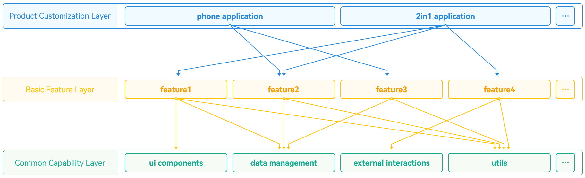
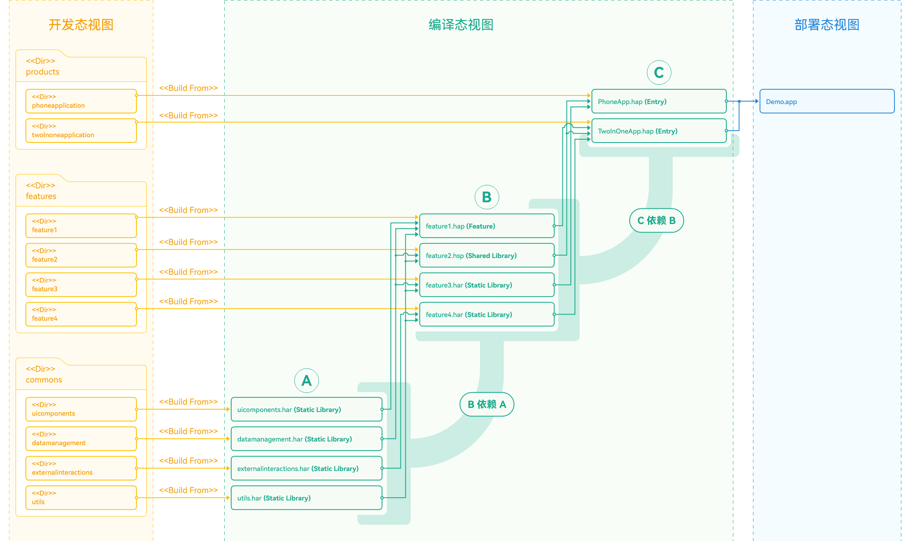
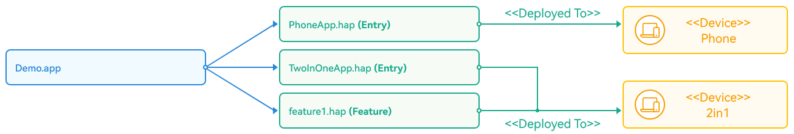

# 分层架构设计

更新时间：2026-03-12 08:45:02

来源：https://developer.huawei.com/consumer/cn/doc/best-practices/bpta-layered-architecture-design

HarmonyOS 应用的分层架构设计基于一套代码工程，支持华为手机、PC/2in1等1+8全场景设备，实现了“一次开发，多端部署”的开发理念。

HarmonyOS应用分层架构包括产品定制层、基础特性层和公共能力层，构建了清晰、高效、可扩展的设计架构。

本文将从逻辑模型、开发模型和部署模型分别介绍应用分层架构设计规则。

## 逻辑模型

图1 分层架构逻辑模型

- **产品定制层**产品定制层专注于满足不同设备或使用场景的个性化需求，包括UI设计、资源和配置，以及特定场景的交互逻辑和功能特性。 产品定制层的功能模块独立运作，依赖基础特性层和公共能力层实现具体功能。 产品定制层作为应用的入口，是用户直接互动的界面。为了满足特定需求，产品定制层可以灵活调整和扩展，以适应各种使用场景。
- **基础特性层**基础特性层位于公共能力层之上，用于存放相对独立的功能UI和业务逻辑实现。每个功能模块都具备高内聚、低耦合、可定制的特点，支持产品的灵活部署。 基础特性层为产品定制层提供稳健且丰富的基础功能支持，包括UI组件和基础服务。公共能力层为其提供通用功能和服务。 为了增强系统的可扩展性和维护性，基础特性层对功能进行了模块化处理。例如，应用底部导航栏的每个选项都是一个独立的业务模块。
- **公共能力层**公共能力层存放公共基础能力，包括公共UI组件、数据管理、外部交互和工具库等共享功能。应用可调用这些公共能力。 公共能力层提供稳定可靠的功能支持，确保应用的稳定性和可维护性。 公共能力层包含以下组成部分： 公共UI组件：公共UI组件设计为通用且高度可复用，确保在不同应用程序模块间保持一致的用户体验。这些组件提供标准化、友好的界面，帮助开发者快速实现常见的用户交互需求，如提示、警告和加载状态显示，从而提高开发效率和用户满意度。
- 数据管理：负责应用程序中数据的存储和访问，包括应用数据、系统数据等，提供了统一的数据管理接口，简化数据的读写操作。通过集中式的数据管理方式不仅使得数据的维护更为简单，而且能够保证数据的一致性和安全性。
- 外部交互：外部交互负责应用程序与外部系统的交互，包括网络请求、文件I/O、设备I/O等，提供统一的外部接口，简化应用程序与外部系统的交互。开发者可以方便地实现网络通信、数据存储和硬件接入，从而加速开发流程并保证程序的稳定性和性能。
- 工具库：工具库提供一系列常用工具函数和类，如字符串处理、日期时间处理、加密解密、数据压缩解压等，帮助开发者提高效率和代码质量。

## 开发模型

图2 分层架构开发模型

- **产品定制层**产品定制层的各个子目录会被编译成一个[Entry类型的HAP](https://developer.huawei.com/consumer/cn/doc/harmonyos-guides/hap-package)，作为应用的主入口。该层面向多种设备，集成相应功能和特性。产品定制层划分为多个功能模块，每个模块针对特定设备或使用场景设计，并根据产品需求进行功能和交互的定制开发。

> [!NOTE]
> 在产品定制层，开发者可以从不同设备对应的应用UX设计和功能两个维度，结合具体的业务场景，选择一次编译生成相同或者不同的HAP（或其组合）。通过使用定制多目标构建产物的定制功能，可以将应用所对应的HAP编译成各自的.app文件，用于上架到应用市场。

- **基础特性层**在基础特性层中，功能模块根据部署需求被分为两类。对于需要通过Ability承载的功能，可以设计为[Feature类型的HAP](https://developer.huawei.com/consumer/cn/doc/harmonyos-guides/hap-package)，而对于不需要通过Ability承载的功能，根据是否需要实现按需加载，可以选择设计为[HAR](https://developer.huawei.com/consumer/cn/doc/harmonyos-guides/har-package)模块或者[HSP](https://developer.huawei.com/consumer/cn/doc/harmonyos-guides/in-app-hsp)模块，编译后对应HAR包或者HSP包。
- **公共能力层**公共能力层的各子目录将编译成HAR包，仅产品定制层和基础特性层可依赖，不允许反向依赖。该层提取模块化公共基础能力，为上层提供标准接口和协议，提高复用率和开发效率。

## 部署模型

图3 分层架构部署模型（不同设备的定制）

应用程序（.app文件）在流水线或应用市场上被解包为N个Entry类型的HAP和N个Feature类型的HAP，根据设备类型和使用场景部署到不同设备，实现多端统一用户体验。

> [!NOTE]
> 当Entry类型的HAP和Feature类型的HAP被分发并部署到相应设备时，它们所依赖的HSP也会一同被分发并部署到相应设备上。

在部署模型中，每个Entry类型的HAP代表了应用的入口点，而Feature类型的HAP则包含了应用的特定功能模块。允许应用能够以模块化的方式适配和部署，从而满足不同设备和场景的需求。

部署模型优化了应用的组织结构，确保了应用在各种设备和场景中的一致性。通过根据设备类型和使用场景区分和部署不同的HAP，用户在任何设备或场景中都能获得统一且高质量的体验。
