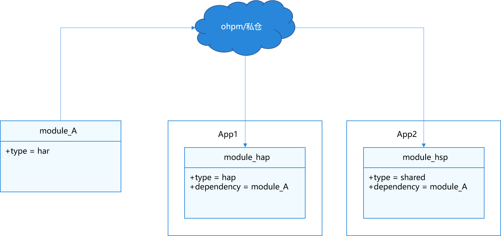
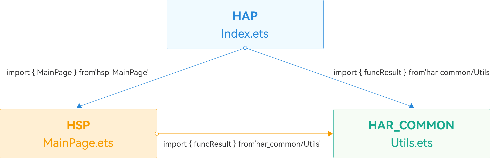
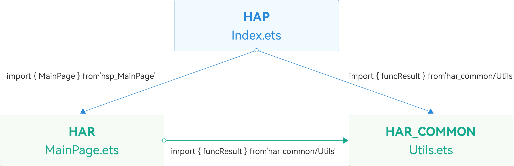
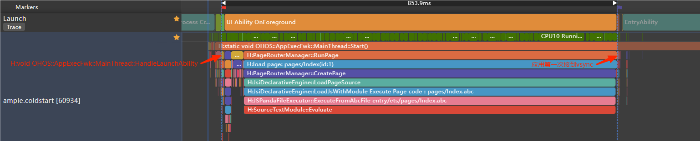
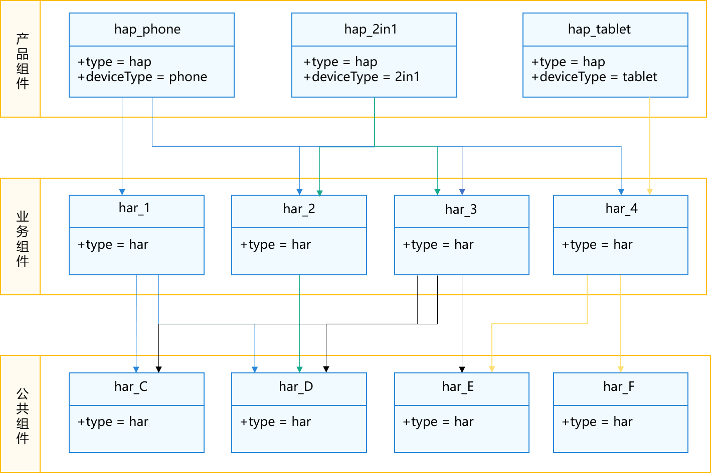
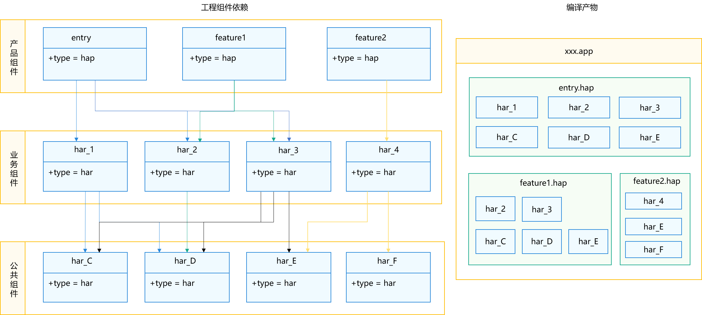
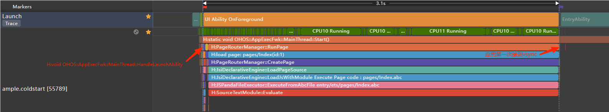

# 模块化设计

更新时间：2026-05-18 00:55:31

来源：https://developer.huawei.com/consumer/cn/doc/best-practices/bpta-modular-design

**   


##### 模块化设计理念

在大型软件工程中，一般会伴随多团队参与开发。各团队之间以弱耦合方式交互，通过契约化接口定义业务之间的交互，确保各团队业务独立发展，互不影响，实现快速迭代演进。业务模块化是现代软件工程的核心原则之一，通过将大型复杂系统拆解为更小、更易管理和理解的功能模块，提高系统的可维护性和可扩展性。每个功能模块都是独立单元，具有清晰定义的接口和职责，能够与其他模块交互以完成复杂任务。
 
 
在HarmonyOS应用开发中，模块化既是设计原则，也是开发实践。该原则要求将应用程序拆分为多个功能模块，每个模块负责特定功能或特性。这些模块可以独立开发、编译和部署，也可以在不同设备上灵活组合和调用。
 

##### 应用程序包结构概念

在进行模块化设计时，需要考虑HarmonyOS的应用包结构选型，HarmonyOS的应用包结构用于定义应用的组织方式。通过开发态、编译态、发布态阶段的应用程序包形态，可以了解不同包类型的具体使用场景及规则。详细请参见[Stage模型应用程序包结构](https://developer.huawei.com/consumer/cn/doc/harmonyos-guides/application-package-structure-stage)。
 
 

##### UIAbility应用组件设计

HarmonyOS应用的业务逻辑需要通过[UIAbility组件](https://developer.huawei.com/consumer/cn/doc/harmonyos-guides/uiability-overview)承载，根据业务设备以及业务诉求不同，需要考虑UIAbility组件的选择以及设计。在多设备的背景下，应用的形态不一定是传统移动设备上的单任务单窗口形式，在一些场景下，多任务多窗口的形态可以让用户获得更好的用户体验，提升使用效率。
 
例如在手机设备上：
 
- 笔记应用，可让用户将信息从笔记的一页复制到另一页。
- 文档编辑应用，可让用户同时打开编辑多个文档，可让用户将内容从一个文档复制或移动到另一个文档。
- 导航/打车应用，可以让导航后台运行，回到主页查找新的位置信息或其它信息。
- 购物类临时客服界面，可让用户通过任务管理快速从商品浏览页切换回到客服会话界面，避免用户一层层打开查找。
- 在应用支付/登录页面，用户可以切换到其他页面查找并复制相关信息。

 
在大屏设备上，应用内的多个任务可以以多窗口的形式存在，用户可以并行操作应用的不同功能。
 
- 视频播放器应用，可让用户在观看播放内容的同时浏览其他可能感兴趣的视频列表。
- 电子邮件应用，可让用户在撰写电子邮件的同时查看收到的邮件列表。
- 地址簿应用，可让用户并排比较多个人员的联系信息。
- 阅读应用，可让用户在查阅所有标题概要后，打开多篇文章供稍后阅读。

 
对于这种类似独立应用的任务，每个任务对应一个UIAbility组件实例，每个任务可以单独显示一个窗口。用户可以在同一应用的不同任务间切换，就像单独的应用一样。在大屏设备上，可以独立移动、调整大小、显示和隐藏应用窗口。所以在进行功能设计时，需考虑应用是否支持多任务多窗口，这影响整体工程模块化结构。
 
- 对于单Ability的情况，可以对应单窗口类型应用、通过多实例实现的多任务应用，或通过指定实例实现的多任务应用。例如，普通游戏应用建议采用单HAP来承载UIAbility。
- 对于多Ability有两种情况：
对于多窗口类型的应用，每个窗口对应不同的功能，通过不同的UIAbility承载。如上述例子中导航/打车应用中，导航功能界面和主页属于不同的功能，并且作为两个任务呈现给用户。可以将该模块作为Feature类型的HAP承载相应的UIAbility组件。
- 对于应用的拓展功能，如卡片和分享业务，这些功能不会作为单独的任务和窗口形态运行。由于这些功能相对独立，并且由系统提供的独立[ExtensionAbility](https://developer.huawei.com/consumer/cn/doc/harmonyos-guides/extensionability-overview)承载，从更好地拆分业务的角度考虑，建议通过Feature类型的HAP承载单独的ExtensionAbility组件。

 
 
 

##### 应用模块化选型

应用架构旨在实现业务服务，从技术角度思考业务实现方式；工程模块化模型则基于技术架构，对代码工程进行模块化选型，需要考虑技术如何在代码工程中落地，只有代码工程模型的技术选型合理了，才能在包体积、性能、产品部署等取得一个最优的综合表现。
 
业务通常分为多个模块，例如某购物软件，包含主页导航、商品详情、购物车、支付、订单、个人信息等模块。技术架构上，这些业务模块表现为高内聚低耦合的模块（Module）。在代码工程模块化的技术选型中，由于Entry类型的HAP是工程默认存在的且不能存在多个，所以主要考虑的模块类型有：Feature类型的HAP模块、HAR模块和HSP模块。
 
在技术架构中选择代码模块类型时，需要根据业务特性和模块功能等多方面因素综合评估。基于常见的应用模块化模型，以下是几种实际业务中可能遇到的情况：
 1. [共享模块](#section72105319817)：某个功能模块（业务模块或者能力模块）需要在多个应用之间共享其代码逻辑和资源。
2. [按需加载模块](#section28312051291)：某个功能模块，使用时由用户决定安装时机，动态从应用市场下载安装使用。
3. [多HAP/HSP引用相同HAR包的影响](#section9492615385)：从性能角度出发，需要减少多HAP/HSP对相同HAR包的引用。
 
 

##### 共享模块

对于大型软件，不同业务和基础能力由多个团队开发，各团队之间需要代码仓隔离。如果某个或若干个HAR工程模块由某个团队负责，又想代码仓隔离，可以在独立工程中开发这些HAR，并通过公司私有的OHPM仓发布和集成编译产物。如下图所示。
 
图1 **多工程合作模式**


 
这部分可以发布到OHPM仓的模块，叫做共享模块，可以将公共能力共享给多个应用使用，如公司内部多个应用使用某个公共能力网络库；或者也可以将该公共能力封装成库贡献给社区，给其他应用集成使用，这样的话这个模块也只能是HAR模块。
 
 

##### 按需加载模块

随着应用业务的扩展，应用为用户提供的功能不断增加。然而，不是所有功能都是用户频繁使用的。根据用户运营报告的分析，对于月活跃度较低的功能，可以将其设计为按需加载模块。用户首次从应用市场安装时，只会下载不包含按需加载模块的内容。当用户需要使用特定功能时，可以选择下载并安装相应的功能模块。
 
按需加载模块有以下好处：
 
- 减少包体积：用户从应用市场首次下载的应用不包含按需加载模块，用户看到的包体积减少，从而减少了用户下载和安装时间，减少了用户等待时间。
- 减少系统资源：应用安装之后所占用的空间也变少（节省ROM空间），应用启动时加载的特性少了（节省了RAM空间）。
- 架构演进：定义为按需加载的特性明确，模块间耦合关系清晰，有利于应用架构演进。

 
如果某个特性做成了按需加载模块，该模块可以设计为Feature类型的HAP或者HSP，HAP和HSP都可以实现按需加载，区别在于Feature类型的HAP可以包含UIAbility组件，结合前面的[UIAbility应用组件设计](#section591504125510)以及业务是否需要按需加载，从整体上可以划分两个大的场景如下：
 
- 单HAP场景：如果只包含一个UIAbility组件（包括UIAbility多实例/指定实例），无需使用ExtensionAbility组件，优先采用单HAP（Entry类型的HAP）来实现应用开发，其中根据是否需要实现按需加载的来决定选择HSP或者HAR作为模块。
- 多HAP场景：要实现多任务承载多个UIAbility组件以及使用ExtensionAbility组件实现扩展功能，可以采用多HAP（即一个Entry类型的HAP和多个Feature类型的HAP）来开发应用。每个HAP包含一个UIAbility组件或一个ExtensionAbility组件。在多HAP情况下，根据是否具有公共能力选择模块类型。

 
应用组件的设计决定了模块化设计是采用单HAP工程还是多HAP工程。设计初期需考虑应用的任务形态，以确定合适的模块化结构。具体按需加载的实现，可参考示例[产品特性按需分发功能接口说明](https://gitcode.com/HarmonyOS_Samples/appgallerykit-samplecode-clientdemo-arkts#产品特性按需分发功能接口说明)。
 
 

##### 多HAP/HSP引用相同HAR包的影响

在应用开发的过程中，可以使用[HSP](https://developer.huawei.com/consumer/cn/doc/harmonyos-guides/in-app-hsp)或[HAR](https://developer.huawei.com/consumer/cn/doc/harmonyos-guides/har-package)的共享包方式将同类的模块进行整合，用于实现多个模块或多个工程间共享ArkUI组件、资源等相关代码。
 
在多HAP/HSP引用相同HAR包时，由于共享包的动态和静态差异，HAR包中的单例可能失效，影响应用冷启动性能。
 
图2 **HAP包和HSP包分别引用相同HAR包**


 
如上图所示，工程内包含三个模块：HAP包作为应用主入口模块，HSP包作为应用主界面显示模块，HAR_COMMON集成了所有通用工具类，其中funcResult是func方法的执行结果。
 
当HAP和HSP模块同时引用HAR_COMMON模块时，会破坏HAR的单例模式。因此，HAP和HSP模块在使用HAR_COMMON中的funcResult时，会导致func方法在两个模块加载时各执行一次，从而增加文件的执行时间。
 
仅从性能角度考虑，可以采用以下方式进行修改，以缩短冷启动阶段的耗时。
 
图3 **切换为HAP包和HAR包分别引用相同HAR包**


 
> [!NOTE]
> 在多HAP/HSP引用相同HAR包的情况下，如果HSP包和HAR包均能满足业务需求，建议将HSP包改为HAR包。 若使用的HSP为 集成态HSP ，可跳过该优化方案。

1. 在被引用HAR_COMMON包中写入功能示例。
```ArkTS
// har_common/src/main/ets/utils/Utils.ets
const LARGE_NUMBER = 100000000;

function func(): number {
  let count = 0;
  while (count < LARGE_NUMBER) {
    count++;
  }
  return count;
}

export let funcResult = func();
```

2. 分别通过使用HSP包和HAR包来引用该HAR_COMMON包中的功能进行性能对比实验。
使用HAP包和HSP包引用该HAR_COMMON包中的功能。HAP包引用HAR_COMMON包中的功能。

  
```ArkTS
// entry/src/main/ets/pages/Index.ets
import { MainPage } from 'har_library';
import { funcResult } from 'har_common';
```


  HSP包引用HAR_COMMON包中的功能。
```ArkTS
// har_library/src/main/ets/pages/MainPage.ets
import { funcResult } from 'har_common';
```

3. 使用HAP包和HAR包引用该HAR_COMMON包中的功能。HAP包引用HAR_COMMON包中的功能。

  
```ArkTS
// entry/src/main/ets/pages/Index.ets
import { MainPage } from 'har_library';
import { funcResult } from 'har_common';
```


  HAR包引用HAR_COMMON包中的功能。
```ArkTS
// har_library/src/main/ets/pages/MainPage.ets
import { funcResult } from 'har_common';
```

 
使用[Launch模板](https://developer.huawei.com/consumer/cn/doc/harmonyos-guides/ide-insight-session-launch)，对优化前后启动性能进行对比分析。
 
分析阶段的起点为启动Ability（即H:void OHOS::AppExecFwk::MainThread::HandleLaunchAbility的开始点），阶段终点为应用第一次接到vsync（即H:ReceiveVsync dataCount:24Bytes now:timestamp expectedEnd:timestamp vsyncId:int的开始点）。
 
图4 **优化前，使用HSP包



 
 
**图5 **优化后，使用HAR代替HSP



 
 
优化前后的对比数据如下：
  
| 方案 | 阶段时长(毫秒) |
| --- | --- |
| （优化前）使用HSP包 | 3125 |
| （优化后）使用HAR代替HSP | 853.9 |
 
 
> [!NOTE]
> 上述示例为凸显差异，func函数的执行循环次数为100000000。 以上实验数据为测试环境中手动修改测试包为HSP和HAR包后的结果，具体收益在不同版本与设备间存在差异，需根据实际情况测试。

 
测试数据表明，将HSP替换为HAR包后，应用启动耗时明显缩短。
 
 

##### 单HAP工程

对于单窗口应用的APP工程，其仅包含一个Entry类型的HAP。划分的模块则根据是否有按需加载的需求，来考虑采用HAR模块和HSP模块。
 
 

##### 不包含按需加载模块

对于不需要按需加载且仅包含一个Entry类型的HAP的App，可以直接全部采用HAR进行开发设计。如下图所示：
 
> [!NOTE]
> 这里提到的“仅有一个HAP”是指一种设备类型仅包含一个HAP，而不是指.app文件包中仅有一个HAP。.app文件包可以包含其他设备的HAP包，例如手表和大屏设备的HAP包，以支持多设备分发。

 
**图6 **非按需加载工程模型**


 
上图工程架构中，除了产品模块层中与设备相关的HAP外，其他模块均为HAR。这些被依赖的HAR最终都会被编译进HAP中。
 
设计成HAR包有以下优点：
 1. 全部编译进HAP，无额外的HSP，节省HSP的安装和加载成本。
2. HAR在编译进HAP时，可以利用ArkTS的语言特性和编译器功能，做类型推断和编译优化。
3. 代码工程架构简单，后续演进较为灵活。
 
 

##### 包含按需加载模块

在单HAP工程中实现按需加载功能时，对应的组件需采用HSP作为按需加载模块。HAR是静态共享库，若多个HAP或HSP依赖同一份HAR，该HAR在应用内会被重复存储。HSP是动态共享库，其安装和加载会有性能损失，过多的HSP可能影响安装效率和App启动性能。需考虑App占用空间是否受限及启动性能的敏感度，根据业务需求在App Size与启动性能之间做好平衡。
 
> [!NOTE]
> 这里提到的App Size指用户安装按需加载模块后，应用的整体大小。

 
**App Size优先**
 
对于App Size优先的，可以考虑将公共依赖的模块封装在一个HSP模块壳中，如下图所示：
 
图7 **公共依赖模块通过HSP模块壳承载**


 
hap_A依赖于独有的共享库har_A，同时需要依赖于har_C和har_D；而按需加载模块hsp_B依赖于独有的共享库har_B，同时需要依赖于har_C和har_D。
 
> [!NOTE]
> 这里的共享库har_A、har_B、har_C、har_D不一定本地工程，有可能是从ohpm仓上依赖下载的。

 
因为har_C和har_D同时被hap_A和hsp_B工程所依赖，所以为了节省App Size，可以将其封装到名为“common_hsp”的Module中，对外暴露har_C和har_D的接口，将har_C和har_D打包到common_hsp中，最后让hap_A和hsp_B依赖于common_hsp工程。common_hsp工程是无实际意义的，它仅是一个“模块壳”，是为了最小化App Size而存在的。
 
**性能优先**
 
对于性能优先的，则不需要再封装一个公共的HSP模块，直接依赖公共HAR包：
 
图8 **公共依赖模块使用HAR模块承载**


 
因为公共HSP包需要安装和加载，所以会有一些性能损耗。对于启动性能敏感型的应用，则将hap_A和hsp_B直接依赖于har_C和har_D。最终编译产物里面有2个，hap_A.hap和hsp_B.hsp，但是这两个编译产物里面均会包含har_C和har_D，App Size会比采用公共HSP模型大。
 
 

##### 多HAP工程

对于同一个设备类型，如果要实现不同的独立功能模块，并且相对独立，以及具有单独的入口的功能特性，建议做成一个独立特性的HAP，按需下载安装。此时一个App包中，就会有多个HAP包，其中有且仅有一个Entry类型的HAP，其他的均是Feature类型的HAP。多HAP之间业务独立，但是可能会有业务能力共享，所以在进行模块化设计时，需要根据是否具有公共能力来进行选择。
 
 

##### 包含公共能力模块

对于具备公共能力模块的工程，和上述HAP+HSP组合是类似的，需要考虑在App Size与启动性能之间做平衡。
 
**性能优先**
 
一般多HAP应用架构普适性采用以下模型，除了产品组件中存在HAP包之外，其余的均是HAR包，如下图所示：
 
图9 **多HAP工程模块示意图**


 
编译产物中，多个HAP之间存在相同的HAR包（如har_2、har_3、har_C、har_D、har_E）。这种情况下，App Size可能会增大。如果App Size不是应用的瓶颈，或者HAR包的大小较小，对App Size的影响可控，可以采用这种模型，从而减少动态加载的性能损耗。
 
**App Size 优先**
 
上述问题的本质在于如何在HAP和HSP之间分布HAR包，以最小化App的大小并减少HAR的重复编译和打包。主要思路是将公共能力模块封装为公共HSP，从而最小化App Size。如下图所示：
 
图10 **多HAP工程模块示意图


 
> [!WARNING]
> 需要注意，在应用间共享的HAR包，原则上是不允许依赖HSP包，因为HSP包是专属于应用，和bundleName进行了绑定，一旦HAR包依赖于应用内HSP，该HAR包就丢失了共享性，无法再给其他应用共享。

 
如上图所示，有3个HAP包（1个entry和2个feature），将公共的HAR包封装到HSP工程中，例如common_wrap_hsp和feature_wrap_hsp。这两个HSP从严格意义上讲，不能称为模块，仅称为模块壳，用于合理放置模块在编译产物中的位置，不具备模块功能，不能共享，仅能在App应用内使用，依赖这些模块壳的模块也无法在应用间共享。
 
上述的模型通过HSP将HAR包合理分配到编译产物中，确保每个HAR包在App编译产物中仅出现一次，从而减小App Size。模块壳数量不宜过多，否则可能影响安装速度和启动性能。
 
这两种模型都是理想模型，业务模型通常是两者的平衡态或组合。例如，某个共享库代码和资源较少，占用空间较小，如打印日志模块。将该模块编译进所有编译产物中，App Size增加较少，同时性能较好。
 
 

##### 不包含公共能力模块

这种应用较少，即使有的话也是一些规模较小的应用，可以参考单HAP的场景。
 
 

##### 总结

应用开发者需根据技术架构选择适合的工程模块化模型。工程模块化模型需根据业务和技术架构演进而演进。根据诉求在HAP、HAR和HSP中选择使用。
 
 
对于具备独立运行和安装的模块只能选择HAP包，并将其作为Feature类型的HAP存在于App中；对于不具备独立特性部分，用户使用频率较少的模块，将其做成HSP按需加载模块存在于App中。对于需要共享的模块，只能采用HAR包，将其通过OHPM仓共享给其他工程使用。而HAR是静态共享库，在多HAP或者按需加载场景下，在编译后可能会在物理上存在多份，所以需要合理采用公共HSP模块壳，使App Size最小化。
