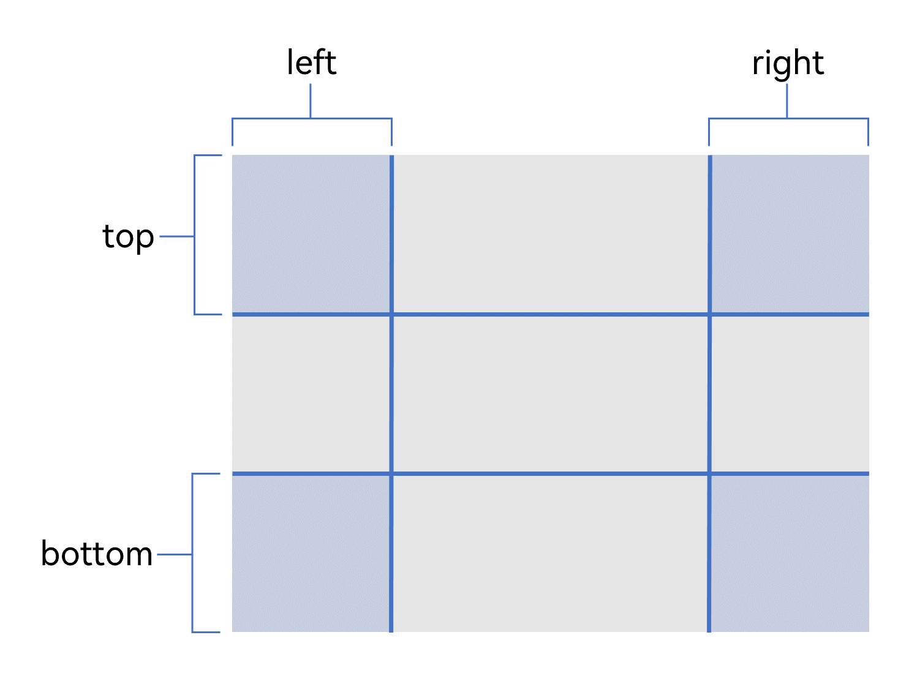
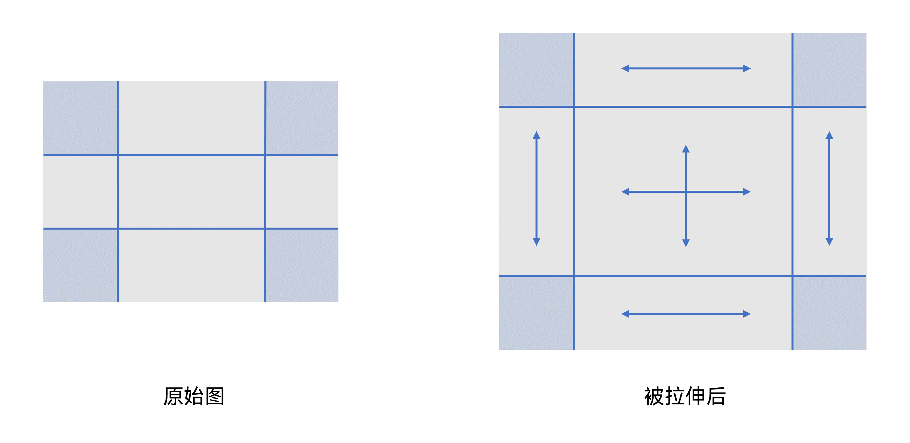
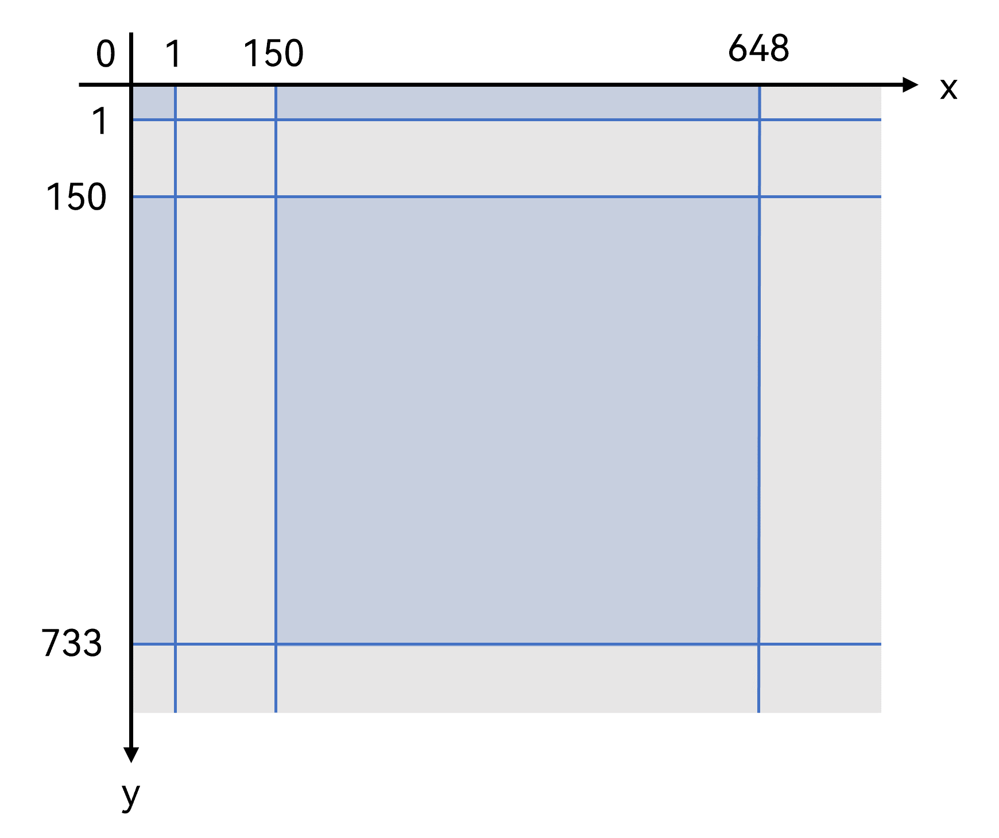
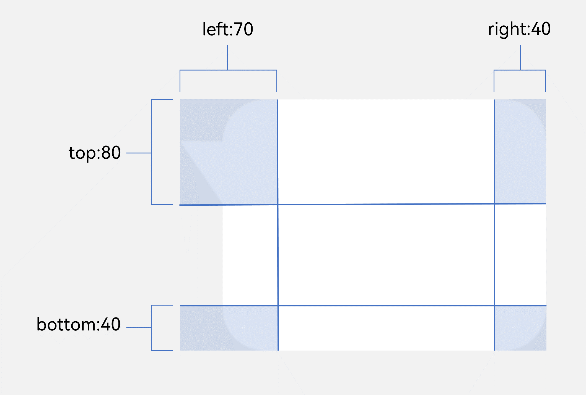
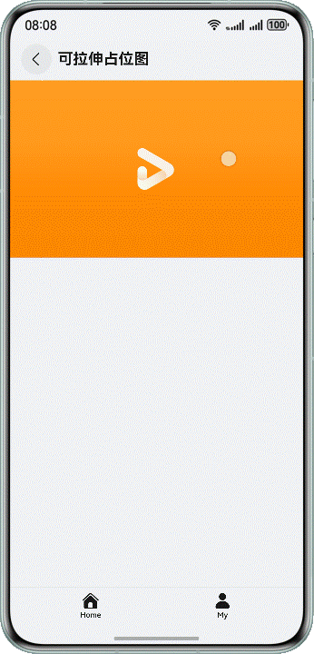
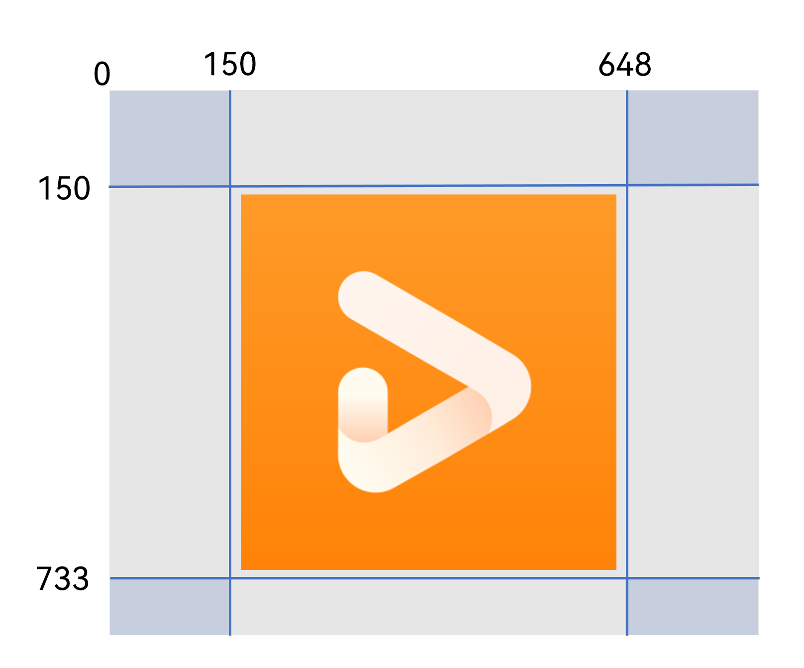
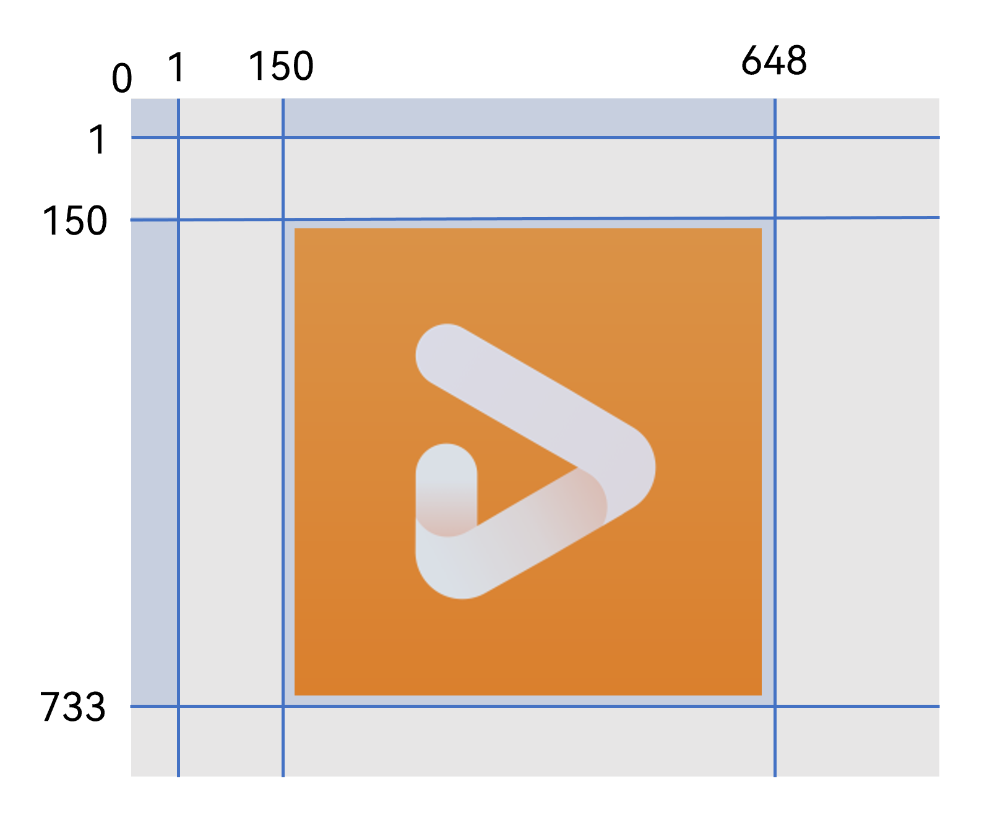

# 基于resizable实现图片拉伸效果

更新时间：2026-03-12 08:45:02

来源：https://developer.huawei.com/consumer/cn/doc/best-practices/bpta-implementing-image-resizable

##### 概述

在一些开发场景中，图片需适配不同尺寸的容器。若直接拉伸，容易导致关键区域（如圆角、边框或图案细节）变形、模糊，影响视觉效果。典型例子如聊天消息气泡，其背景图需随内容长度和高度动态调整。
 
Image组件提供的[resizable](https://developer.huawei.com/consumer/cn/doc/harmonyos-references/ts-basic-components-image#resizable11)属性，可精准指定图片的可拉伸区域与固定区域，从而确保图片在不同尺寸的容器中都能保持良好的视觉效果。
 
本文将以聊天消息气泡和可拉伸占位图两个典型场景为例，介绍如何使用resizable属性实现图片拉伸效果。
 
 

##### 实现原理

通过Image组件的resizable属性实现精准图片拉伸，其核心原理是：使用特定规则划分图片的固定区域与可拉伸区域，当图片拉伸时，仅对可拉伸区域进行拉伸，固定区域保持原始尺寸与形态不变。
 
resizable属性参数类型为[ResizableOptions](https://developer.huawei.com/consumer/cn/doc/harmonyos-references/ts-basic-components-image#resizableoptions11)，支持使用slice(slice: { left, right, top, bottom })和lattice(lattice:  [DrawingLattice](https://developer.huawei.com/consumer/cn/doc/harmonyos-references/ts-basic-components-image#drawinglattice12))两种图片拉伸方案。
 
 

##### 使用slice拉伸图片

通过slice参数指定原图片在上、下、左、右四个方向的偏移值（px像素点），将图片划分为九宫格布局：四个角的区域为固定区域，其余为可拉伸区域。如下图所示：
 



 
下图展示了图片拉伸时各区域的拉伸效果。四个角的区域保持固定的宽高，中间区域可上下左右拉伸，顶部和底部的可拉伸区域保持高度不变，左右两侧的可拉伸区域保持宽度不变。
 



 
slice除了在resizable属性中使用，还支持在[backgroundImageResizable](https://developer.huawei.com/consumer/cn/doc/harmonyos-references/ts-universal-attributes-background#backgroundimageresizable12)属性中使用。
 
需要注意的是，坐标参数传入数字时，默认单位为vp，最终会被转化为px。若要使固定区域的显示效果在不同设备上保持一致，需传入px像素单位的数据。
 
```ArkTS
Image($r('app.media.bg_right_message'))
  // ...
  .resizable({
    slice: {
      left: '40px',
      top: '80px',
      right: '70px',
      bottom: '40px'
    }
  })
```
 
 

##### 使用lattice拉伸图片

通过设置lattice参数，可以利用原图水平和垂直方向的坐标点数组（px像素点）将图片划分为规则矩形网格，行列数为数组长度+1。其中，偶数行与偶数列交叉处的格子为固定区域（如下图中蓝色部分所示），其余区域为可拉伸区域。拉伸时，固定区域保持原尺寸，其他区域根据需要进行拉伸。
 
例如，下图使用x轴坐标点数组[1, 50, 648]和y轴坐标点数组，将图像划分为3行3列的网格，图中蓝色区域即为偶数行与偶数列相交的固定区域。
 



 
> [!WARNING]
> 需要注意的是，此处的行列数计数从0行0列开始。例如，上述蓝色区域为0行0列、0行2列、2行0列、2行2列，均为偶数行列交叉区域，属于固定不可拉伸区域。

 
示例代码如下：
 
```ArkTS
// Array of x-coordinate values for image segmentation,
// where the coordinates refer to pixel positions in the original image
private xDivs: Array<number> = [1, 60, 243];
// Array of y-coordinate values for image segmentation,
// where the coordinates refer to pixel positions in the original image
private yDivs: Array<number> = [1, 50, 253];
// Divide the original image into a (3+1)×(3+1) grid (based on the division coordinates above)
private drawingLatticeFirst: DrawingLattice =
  drawing.Lattice.createImageLattice(this.xDivs, this.yDivs, this.xDivs.length, this.yDivs.length);
// ...
      Image($r('app.media.placeholder_img'))
        .height(this.imgHeight)
        .width('100%')
        .resizable({
          lattice: this.drawingLatticeFirst
        })
// ...
```
 
相较于使用slice实现图片拉伸（仅能指定四个角的区域不可拉伸），lattice功能实现图片拉伸更为灵活，通过设置合理的坐标参数，可指定任意区域进行拉伸或保持不变。
 
 

##### 使用slice与lattice实现图片拉伸对比

下面对比了slice与lattice的实现方式及适用场景，开发者可参考以选择合适的方案。
  
| 对比维度 | slice参数实现 | lattice参数实现 |
| --- | --- | --- |
| 核心实现逻辑 | 通过上、下、左、右四个偏移量定义四个角的区域为固定区域。 | 通过横向与纵向的坐标点，将图片划分为网格矩阵，偶数行与偶数列的交叉区域为固定区域。 |
| 适用场景 | 适用于四个角不拉伸的场景，例如聊天消息气泡、输入框背景、优惠券背景等。 | 适用于更复杂或中间区域不拉伸的场景，如带Logo的占位图、四周带装饰的卡片背景、复杂边框的弹窗背景等。 |
 
 
 

##### 使用slice实现聊天消息气泡

 

##### 场景描述

聊天消息气泡在社交应用中是一种常见场景，效果如下图所示。当消息内容的长度和高度不同时，消息气泡需保持四周圆角和小三角指示符的形状不变。
 



 
 

##### 场景实现

通过slice方案实现消息气泡场景，主要方案是通过保持四周的圆角和三角形固定不变来实现的，具体步骤如下：
 1. 将图片划分为网格区域，确定对应的偏移值。开发者可以通过UX提供的坐标点或者使用PhotoShop等图片编辑工具，找到原始图固定区域上、下、左、右准确的偏移值。消息气泡图片区域划分和坐标点如下图所示：

  


2. 实现消息气泡布局。slice支持在[backgroundImageResizable](https://developer.huawei.com/consumer/cn/doc/harmonyos-references/ts-universal-attributes-background#backgroundimageresizable12)属性中使用。开发者可直接为消息内容的Text组件设置backgroundImage属性，将其作为内容的背景图片。当内容宽高不同时，背景图片会随之进行伸缩。然后，将前面获取的偏移值（{ left:  '70px', top: '80px', right: '40px', bottom: '40px' }），赋给Text组件backgroundImageResizable属性中的slice参数即可。

  
```ArkTS
Text(this.message)
  .fontSize($r('sys.float.Body_L'))
  .fontColor($r('sys.color.font_primary'))
  // Set the background image
  .backgroundImage($r('app.media.bg_left_message'))
  // Set the maximum width and minimum width/height of the text
  // to avoid abnormal display when content is too much or too little.
  .constraintSize({
    maxWidth: 'calc(100% - 90vp)',
    minHeight: 40,
    minWidth: 50
  })
  // Set the padding of the text content
  .padding({
    left: 20,
    top: 10,
    right: 10,
    bottom: 10
  })
  // Set the size of the background image
  .backgroundImageSize({
    height: '100%',
    width: '100%'
  })
  // Set the offset value of the fixed area (nine-grid slice)
  .backgroundImageResizable({
    slice: {
      left: '70px',
      top: '80px',
      right: '40px',
      bottom: '40px'
    }
  })
```

 
 

##### 使用lattice实现可拉伸占位图

 

##### 场景描述

可拉伸占位图需实现边缘区域可拉伸，而中间的Logo区域保持不变，如下图所示。针对可拉伸占位图场景，本文将采用lattice属性实现。
 



 
 

##### 场景实现

可拉伸占位图的中间区域为固定部分。根据[使用lattice拉伸图片](#section0797147172420)的原理，开发者在划分图片时，需将中间区域划分为偶数行与偶数列的交叉点。具体实现步骤如下：
 1. 将图片划分为网格区域，确定坐标点数组。图片Logo区域的坐标数组，可由UX设计人员提供，或由开发者通过Photoshop等图像编辑工具手动定位获取。示例场景中，该区域的x轴坐标数组为[150, 648]，y轴坐标数组为[150, 733]。若直接使用该坐标点数组，图片将被划分为3行3列的网格，Logo区域将位于第1行第1列（非偶数行和列）的交叉点，无法达到预期效果。如下图所示：

  



  为解决此问题，可在x轴和y轴各增加一个坐标点，使Logo区域位于第2行第2列（偶数行和列）的交叉点。为避免影响显示效果，可在原坐标前添加一个较小的坐标值，如1。如此，新的x轴坐标点数组变为[1, 150, 648]，y轴坐标点数组变为[1, 150, 733]，如下图所示：

  


2. 实现可拉伸占位图布局。根据上述获得的x轴和y轴坐标点数组，使用[createImageLattice()](https://developer.huawei.com/consumer/cn/doc/harmonyos-references/arkts-apis-graphics-drawing-lattice#createimagelattice12)方法创建矩形网格对象，并设置给lattice参数。

  
```ArkTS
@Component
struct PlaceholderImgView {
  // Default image height
  @State imgHeight: Length = '35%';
  // Flag indicating whether the image is stretched
  @State isEnlarge: boolean = false;
  // Array of x-coordinate values for image segmentation,
  // where the coordinates refer to pixel positions in the original image
  private xDivs: Array<number> = [1, 60, 243];
  // Array of y-coordinate values for image segmentation,
  // where the coordinates refer to pixel positions in the original image
  private yDivs: Array<number> = [1, 50, 253];
  // Divide the original image into a (3+1)×(3+1) grid (based on the division coordinates above)
  private drawingLatticeFirst: DrawingLattice =
    drawing.Lattice.createImageLattice(this.xDivs, this.yDivs, this.xDivs.length, this.yDivs.length);
  // ...

  build() {
    NavDestination() {
      Stack() {
        Image($r('app.media.placeholder_img'))
          .height(this.imgHeight)
          .width('100%')
          .resizable({
            lattice: this.drawingLatticeFirst
          })
          .onClick(() => {
            if (this.isEnlarge) {
              this.imgHeight = '35%';
            } else {
              this.imgHeight = '100%';
            }
            this.isEnlarge = !this.isEnlarge;
          })
      }
    }
    // ...
  }
}
```

 
 

##### 常见问题

 

##### 给Image组件设置resizable属性之后，在不同手机上的拉伸区域显示效果不一致

**问题描述**
 
在使用resizable的slice参数设置不拉伸区域之后，在手机和平板上的显示效果不一致，在手机上显示正常，但是在平板上不可拉伸区域会变形。
 
**可能原因**
 
开发者在使用resizable设置slice参数时，可能直接传入无单位的数字，该参数会默认以vp为单位。由于不同设备对vp单位的px换算比例存在差异，最终会导致固定区域的显示效果不一致。
 
**解决方案**
 
建议使用px作为参数单位，示例代码如下：
 
```ArkTS
Image($r('app.media.bg_right_message'))
  // ...
  .resizable({
    slice: {
      left: '40px',
      top: '80px',
      right: '70px',
      bottom: '40px'
    }
  })
```
 
 

##### 设置resizable属性后未生效，图片仍然被拉伸变形

**问题描述**
 
通过slice或lattice给图片设定了不可拉伸区域，图片拉伸时该区域依旧会变形。
 
**可能原因**
 1. 使用slice或lattice划分不可拉伸区域时，坐标值定位不准确，无法精准锁定目标区域，导致不可拉伸区域划分错误。
2. slice或lattice参数配置异常，比如参数值超出图片宽高范围，或是设置了无效的参数值。
 
**解决方案**
 1. 若因坐标点定位不准导致问题，开发者可参考[实现原理](#section318520366349)章节，重新校准并划分不可拉伸区域的坐标点。
2. 若因参数设置异常导致问题，开发者需要保证坐标点在图片区域内。
- 对于lattice的x轴坐标点数组元素的值，需要大于等于0，并且小于图片宽度；对于lattice的y轴坐标点数组元素的值，需要大于等于0，并且小于图片高度。

3. 对于slice参数值的取值范围，可以参考[ResizableOptions](https://developer.huawei.com/consumer/cn/doc/harmonyos-references/ts-basic-components-image#resizableoptions11)中slice的参数说明。

  

  ##### 示例代码

  
[基于resizable实现图片拉伸效果](https://gitcode.com/harmonyos_samples/resizable-image)
