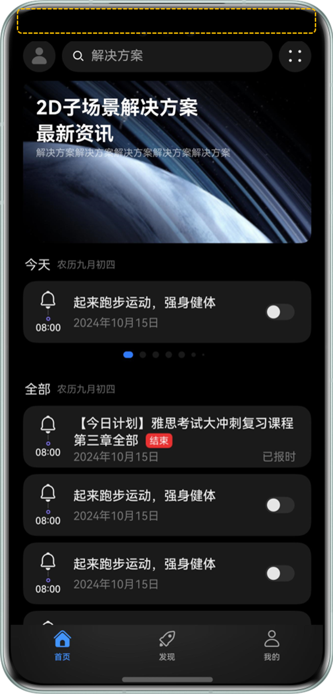

# 深色模式适配

更新时间：2026-05-22 09:46:30

来源：https://developer.huawei.com/consumer/cn/doc/best-practices/bpta-dark-mode-adaptation

**   


##### 概述

深色模式（Dark Mode）又称为暗色模式，是与日常应用使用过程中的浅色模式（Light Mode）相对应的一种UI主题。深色模式最早来源于人机交互领域的研究和实践，该模式并非简单地将页面背景变为黑色、文字内容变为白色，而是提供一整套适配深色模式的应用配色主题。深色模式相较浅色模式更加柔和，能减少亮度对用户眼睛造成的刺激和疲劳，此外深色模式能在一定程度上降低应用功耗，提升续航表现。
 
应用深色模式适配，需遵循基本的UX设计原则，保障应用页面内容的易读性、舒适性和一致性，具体可参考深色模式[设计原则](https://developer.huawei.com/consumer/cn/doc/design-guides/dark-mode-0000001823255497#section727953335811)。应用适配过程主要包含颜色资源如字体颜色、元素背景色的适配，媒体资源如图片图标的适配，以及系统状态栏的适配，此外需要对使用了Web组件加载的Web页面进行单独处理。
 
本文主要介绍深色模式的适配过程，列举常见问题及对应解决方案。
 
 

##### 实现原理

当系统切换到深色模式后，应用内可能会出现部分内容切换到深色主题的情况，例如状态栏、弹窗背景色、系统控件等，会导致应用内页面效果错乱。
 
为应对上述情况，需要对应用进行深色模式下的内容适配，目前该适配主要依靠[资源目录](https://developer.huawei.com/consumer/cn/doc/harmonyos-guides/resource-categories-and-access#资源目录)。当系统对应的设置项发生变化后（如系统语言、深浅色模式等），应用会自动加载对应资源目录下的资源文件。
 
系统为深色模式预留了dark目录，该目录在应用创建时默认不存在。在进行深色模式适配时，需要开发者在src/main/resources中手动创建出dark目录，将深色模式所需的资源放置到该目录下。对于浅色模式所需的资源，可以放入默认存在的src/main/resources/base目录下。
 
> [!NOTE]
> 在进行资源定义时，需要在base目录与dark目录中定义同名的资源。例如在base/element/color.json文件中定义text_color为黑色，在dark/element/color.json文件中定义text_color为白色，那么当深浅色切换时，应用内使用了$('app.color.text_color')作为颜色值的元素会自动切换到对应的颜色，而无需使用其他逻辑判断进行控制。

 
一般情况下深浅色模式切换不会导致应用界面产生结构上的变化，而是保持应用界面结构一致的同时展示不同的主题配色、配图等，使得整个应用在切换到深色模式后依然保持自然美观。以下为深色模式适配的UX示例。
 
图1 **深色模式适配UX示例图**


 
从图1中可以看到，在应用进行深色模式适配过程中主要的适配项有[颜色资源适配](#section1292642062514)、[媒体资源适配](#section07671855272)、[状态栏适配](#section1618831013284)，除此之外若应用内使用了Web组件加载Web页面，那么还需实现[Web页面适配深色模式](#section157048320276)。
 
目前应用向用户提供的深浅色模式切换有以下两种方式。
 
- 应用跟随系统深浅色模式切换实现上，需要开发者使用[setColorMode()](https://developer.huawei.com/consumer/cn/doc/harmonyos-references/js-apis-inner-application-applicationcontext#applicationcontextsetcolormode11)方法将[ColorMode](https://developer.huawei.com/consumer/cn/doc/harmonyos-references/js-apis-app-ability-configurationconstant#colormode)设置为COLOR_MODE_NOT_SET（未设置颜色模式），然后应用在运行过程中就可以自动感知到系统颜色模式切换，若应用完成了深浅色模式适配，将自动切换到对应的颜色模式。
- 应用内提供手动控制深浅色的开关供用户自行选择实现上，切换深色模式需要调用[setColorMode()](https://developer.huawei.com/consumer/cn/doc/harmonyos-references/js-apis-inner-application-applicationcontext#applicationcontextsetcolormode11)方法将[ColorMode](https://developer.huawei.com/consumer/cn/doc/harmonyos-references/js-apis-app-ability-configurationconstant#colormode)设置为COLOR_MODE_DARK（深色模式），切换浅色模式需要将[ColorMode](https://developer.huawei.com/consumer/cn/doc/harmonyos-references/js-apis-app-ability-configurationconstant#colormode)设置为COLOR_MODE_LIGHT（浅色模式），这样就可以完成对应用深浅色的手动控制。

 
综上分析，深色模式适配内容如下表所示。
  
| 适配项 | 适配内容 | 适配方式 |
| --- | --- | --- |
| 颜色资源适配 | 组件背景色，字体颜色等 | 使用受支持的系统资源使用color.json资源文件 |
| 媒体资源适配 | 应用内使用到的图片、图标等 | SVG类型图标可使用fillColor()属性使用media资源目录 |
| 状态栏适配 | 深浅模式下不同的状态栏表现，包括状态栏的背景色以及状态栏内时间等内容的字体颜色 | 对应用背景色进行深浅色适配根据当前深浅色状态动态设置状态栏字体颜色 |
| Web内容适配 | 应用内使用Web组件加载的Web页面 | 参考Web深色模式适配 |
 
 
 

##### 深色模式适配

 

##### 颜色资源适配

 
颜色资源适配是将页面元素的颜色抽离到[限定词目录](https://developer.huawei.com/consumer/cn/doc/harmonyos-guides/resource-categories-and-access#限定词目录)中，让应用在不同的深浅色模式下使用不同限定词目录中的颜色值，从而达成应用页面元素在深浅色下不同的颜色表现。若应用没有正确适配，那么在切换到深色模式后，应用页面元素对比度过低，容易造成用户识别困难。以下为颜色资源适配错误的效果示例。 
| 浅色模式 | 深色模式 |
| --- | --- |
|  |  |
 
 
 
表2中页面效果在浅色模式下显示正常，但是当切换到深色模式后 ，弹窗内文字与背景色的对比度低于5:1，用户识别弹窗内容困难。上述效果的关键问题在于使用自定义弹窗时，若未手动指定弹窗背景色，系统默认对弹窗背景色做了深浅色适配，但是系统无法对弹窗内容（特别是开发者的自定义内容）自动适配深色模式，于是当系统切换到深色模式下，弹窗背景色自动深色，而弹窗内容保持与浅色模式一致的颜色，导致内容无法看清，该类问题对应解决方案有以下两种。
 
- 方式一：使用系统资源（优先建议）。使用受支持的系统资源会自动适配深色模式，开发者可以通过[HarmonyOS Symbol](https://developer.huawei.com/consumer/cn/doc/design-guides/system-icons-0000001929854962)、[系统基础与语义 Token 全量表](https://developer.huawei.com/consumer/cn/doc/design-guides/color-0000001776857164#section17672143841113)获取系统图标、颜色等资源信息。
- 方式二：使用自定义主题，若开发者需要定制在深浅色模式下不同的颜色表现，就需要使用自定义主题，以下为具体实现步骤参考。1. 在src/main/resources/base/element/color.json文件中定义页面元素在浅色模式下的颜色值，此处定义了弹窗内文字在浅色模式下颜色为黑色。
```json
{
  "color": [
    {
      "name": "text_color",
      "value": "#000000"
    }
  ]
}
```


2. 在src/main/resources/dark/element/color.json文件中定义页面元素在深色模式下的颜色值（若有不存在的目录或文件需自行创建），此处定义了弹窗内文字在深色模式下颜色为白色。
```json
{
  "color": [
    {
      "name": "text_color",
      "value": "#FFFFFF"
    }
  ]
}
```


3. 在代码中引用自定义的颜色资源值，使用[\$r](https://developer.huawei.com/consumer/cn/doc/harmonyos-references/js-apis-arkui-resource#r)加载自定义颜色资源，系统将自动在应用深浅色变化时，加载对应限定词目录下的资源文件，从而改变页面元素的颜色完成深浅色适配。此处定义了弹窗内文字颜色为text_color。
```ArkTS
@Entry
@Component
struct Index {
  private customDialogComponentId: number = 0;
  private promptAction = this.getUIContext().getPromptAction();

  @Builder
  customDialogPositiveExample() {
    Column() {
      Text($r('app.string.authorization_succeeds'))
        .fontColor($r('app.color.text_color'))
        // ...
      Text($r('app.string.authorization_code'))
        .fontColor($r('app.color.text_color'))

      Row({ space: 8 }) {
        Button($r('app.string.copy'), { buttonStyle: ButtonStyleMode.TEXTUAL })
          .fontColor($r('app.color.text_color'))
          // ...
        Button($r('app.string.confirm'), { buttonStyle: ButtonStyleMode.TEXTUAL })
        // ...
      }
      // ...
    }
    // ...
  }

  build() {
    // ...
  }
}
```


  
| 浅色模式 | 深色模式 |
| --- | --- |
|  |  |
 
 

##### 媒体资源适配

 
媒体资源适配即在深浅模式下采用不同颜色表现的图片或图标等媒体资源，从而达成更好的用户体验，以下为应用内的图标未适配深色模式的效果示例，未适配内容以黄虚线框出。
  
| 浅色模式 | 深色模式 |
| --- | --- |
|  |  |
 
 
上述错误示例效果的关键问题在于对于应用内的图标并未做深色模式下的适配，于是图标的颜色在深浅色下始终不变。而深色模式下，图标颜色与背景色对比度过低，导致用户无法看清应用内图标。该类问题对应解决方案有以下两种。
 
- 方式一：若适配简单图标并且图标格式为SVG类型，那么只需要结合[颜色资源适配](#section1292642062514)并使用Image组件的fillColor属性（若使用Symbol则使用[SymbolGlyph](https://developer.huawei.com/consumer/cn/doc/harmonyos-guides/arkts-common-components-symbol)的fontColor属性），在不同的深浅色下设置为不同的填充色即可完成深色模式的适配。
- 方式二：若需要适配图片或适配图标，但图标不为SVG类型，那么就需要使用资源目录的方式进行深色模式的适配，具体实现步骤参考如下。1. 在src/main/resources/base/media目录中放入浅色模式下的图片资源，并按需重命名。

2. 在src/main/resources/dark/media目录中放入深色模式下的图片资源（若有不存在的目录需自行创建），并保证资源名称与上一步放入的资源名称一致。

3. 在代码中使用Image组件加载对应的图片资源，此处放入资源名称为bell。
```ArkTS
@Component
struct Home {
  // ...

  build() {
    Scroll() {
      Column() {
        // ...

        Stack({ alignContent: Alignment.TopStart }) {
          Image($r('app.media.bell'))
            .width('100%')
            .borderRadius(12)
            .objectFit(ImageFit.Cover)

          // ...
        }
        // ...
      }
    }
    // ...
  }
}
```


  
| 浅色模式 | 深色模式 |
| --- | --- |
|  |  |
 
 

##### 状态栏适配

 
状态栏适配即在深浅色模式下，采用不同的状态栏背景色与字体颜色。若应用未启用[沉浸式布局](https://developer.huawei.com/consumer/cn/doc/harmonyos-guides/window-terminology#沉浸式布局)，那么默认情况下，浅色模式下状态栏为白底黑字，深色模式下状态栏为黑底白字。当应用启用了沉浸式，状态栏背景色与应用背景色保持一致，而状态栏文字默认在浅色模式下显示黑色，在深色模式下切换成白色。此时如果应用在浅色模式下设置了偏暗的背景或在深色模式下设置了偏亮的背景，都会造成状态栏背景色与状态栏字体颜色对比度过低而显示异常。错误效果示例见图2。
 
图2 **状态栏适配错误效果**


 
上述错误效果的主要问题在于页面的背景色固定为黑色，当系统切换到浅色模式后，状态栏文字默认切换到黑色，此时状态栏背景色与文字颜色一致，对比度过低，于是状态栏中的文字就不可见了，此类问题对应解决方案有以下两种。
 
- 若背景色可以做深浅色适配，则采用[颜色资源适配](#section1292642062514)的方案对应用背景色进行适配，背景色适配时需考虑到状态栏文字在深浅色模式下的默认表现。
```ArkTS
// src/main/ets/pages/Index.ets
@Entry
@Component
struct Index {
  // ...
  build() {
    Navigation(this.navPathStack) {
      // ...
    }
    .backgroundColor($r('app.color.app_background_color'))
    .hideTitleBar(true)
    // ...
  }
}
```

- 若背景色无法做深浅色适配，或做了深浅色适配，但是背景的沉浸式颜色与默认的状态栏文字颜色对比度较低，这种情况下需要获取当前的深浅色状态并动态设置状态栏字体颜色。1. 在EntryAbility中获取并维护当前深浅色状态，在onCreate()时将当前colorMode放在AppStorage中，并在系统环境变量发生变化会触发的[onConfigurationUpdate()](https://developer.huawei.com/consumer/cn/doc/harmonyos-references/js-apis-app-ability-ability#abilityonconfigurationupdate)回调中动态更新深浅色状态。
```ArkTS
export default class EntryAbility extends UIAbility {
  onCreate(_want: Want, _launchParam: AbilityConstant.LaunchParam): void {
    AppStorage.setOrCreate<ConfigurationConstant.ColorMode>('currentColorMode', this.context.config.colorMode);
    hilog.info(0x0000, 'testTag', '%{public}s', 'Ability onCreate');
  }

  // ...

  onConfigurationUpdate(newConfig: Configuration): void {
    const currentColorMode: ConfigurationConstant.ColorMode | undefined = AppStorage.get('currentColorMode');
    if (currentColorMode !== newConfig.colorMode) {
      AppStorage.setOrCreate<ConfigurationConstant.ColorMode>('currentColorMode', newConfig.colorMode);
    }
  }
}
```


2. 在页面内监听深浅色模式状态变量的变化，并根据变化后的深浅色模式来动态设置状态栏文本颜色。
```ArkTS
@Entry
@Component
struct Index {
  // ...
  @StorageProp('currentColorMode') @Watch('onCurrentColorModeChange') currentColorMode: ConfigurationConstant.ColorMode =
    ConfigurationConstant.ColorMode.COLOR_MODE_NOT_SET;
  private windowObj: window.Window | null = null;

  aboutToAppear(): void {
    window.getLastWindow(this.getUIContext().getHostContext(), (err: BusinessError, data) => {
      if (err.code) {
        hilog.error(0x0000, 'Index', `getLastWindow failed. code=${err.code}, message=${err.message}`);
        return;
      }
      this.windowObj = data;
    })
  }

  onCurrentColorModeChange(): void {
    if (!this.windowObj) {
      return;
    }
    try {
      if (this.currentColorMode === ConfigurationConstant.ColorMode.COLOR_MODE_LIGHT) {
        this.windowObj?.setWindowSystemBarProperties({
          statusBarContentColor: '#000000'
        })
      } else if (this.currentColorMode === ConfigurationConstant.ColorMode.COLOR_MODE_DARK) {
        this.windowObj?.setWindowSystemBarProperties({
          statusBarContentColor: '#FFFFFF'
        })
      }
    } catch (error) {
      let err = error as BusinessError;
      hilog.error(0x0000, 'Index', `setWindowSystemBarProperties failed, error code=${err.code}, message=${err.message}`);
    }
  }

  // ...

  build() {
    // ...
  }
}
```


 
图3 **状态栏适配深色模式后效果


 

##### Web页面适配深色模式

 
Web页面的内容不会自动跟随系统颜色模式进行切换。
 
若需要Web页面进行深浅色适配，就需要在Web页面内通过媒体查询的方式单独设置深色模式下的页面样式，并通过Web组件的[darkMode()](https://developer.huawei.com/consumer/cn/doc/harmonyos-references/arkts-basic-components-web-attributes#darkmode9)属性来控制Web页面是否启用深色模式。
 
具体实现开发者可参考：[Web深色模式适配](https://developer.huawei.com/consumer/cn/doc/harmonyos-guides/web-set-dark-mode)。
 

##### 常见问题

 

##### 自定义弹窗无法跟随系统深浅色切换或者只有部分内容跟随深浅色切换

**可能原因**
 
如果自定义弹窗没有设置背景色，那么系统对弹窗默认的背景色做了深色模式适配，但弹窗的内容特别是自定义内容，无法自动适配深色模式，导致无法跟随系统深浅色模式的切换发生变化。
 
**解决措施**
 
参考[上述适配过程](#section1292642062514)对弹窗内容进行适配。
 
 

##### 媒体资源适配时显示文件已存在

**问题现象**
 
当开发者适配媒体资源时（如图片图标等），出现对应资源在另外的目录已存在的弹窗。
 
**解决措施**
 
直接点击弹窗内的“continue”按钮即可，并不会导致适配错误。
 
 

##### 示例代码

- [实现深色模式功能](https://gitcode.com/harmonyos_samples/fit-for-dark-mode)
