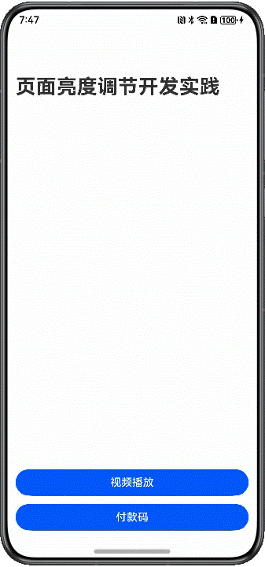

# 页面亮度设置

更新时间：2026-03-12 08:45:02

来源：https://developer.huawei.com/consumer/cn/doc/best-practices/bpta-page-brightness-settings

## 概述


在“视频播放”和“付款码展示”这两种典型场景下，应用需要在不同的页面分别设置不同的屏幕亮度，用户也可以自定义调节屏幕亮度，并且随着页面跳转而自动恢复系统亮度设置。


本文将这两种典型场景拆分为三个功能，帮助开发者掌握页面亮度设置的开发流程与细节。

- [视频播放页面亮度调节](#section02121449165218)
- [视频播放时页面常亮设置](#section13735111620212)
- [付款码页面高亮设置](#section689872941418)


## 实现原理


当前亮度设置的能力由窗口提供，设置亮度后，如果没有再次修改，亮度将不会发生变化（仅在应用内生效，退出应用恢复系统默认亮度）。


窗口作为亮度设置的媒介，窗口的改变会使得该窗口下所有页面的亮度都跟随改变，所以需要一套记录页面和监听页面变化的机制，动态设置不同页面下的亮度。

- 监听机制：[uiObserver.on('navDestinationUpdate')](https://developer.huawei.com/consumer/cn/doc/harmonyos-references/js-apis-arkui-observer#uiobserveronnavdestinationupdate)
- 亮度设置：[setWindowBrightness](https://developer.huawei.com/consumer/cn/doc/harmonyos-references/arkts-apis-window-window#setwindowbrightness9)
- 屏幕常亮：[setWindowKeepScreenOn](https://developer.huawei.com/consumer/cn/doc/harmonyos-references/arkts-apis-window-window#setwindowkeepscreenon9)


## 视频播放页面亮度调节


### 场景描述


视频播放场景，支持用户在视频页调节屏幕亮度，调整完亮度退出页面后其他页面仍为系统亮度，再次进入视频页，屏幕亮度会自动恢复成页面之前保存的亮度。


### 开发步骤


调节屏幕亮度：

1. 维护页面与亮度的映射关系。
```text
private static brightnessMap: Map<string, number> =
new Map([[Constants.NAV_DESTINATION_DEFAULT, this.DEFAULT_BRIGHTNESS],
[Constants.NAV_DESTINATION_ITEM_PAY_CODE, this.MAX_BRIGHTNESS]]);
```
2. 在视频播放器组件上添加滑动组件Slider。
```text
build() {
Stack({ alignContent: Alignment.Start }) {
Video({
src: $rawfile('video1.mp4'),
previewUri: $r('app.media.img_preview'),
})
.loop(true)
.width(Constants.FULL_PERCENT)
.height(Constants.FULL_PERCENT)
.onStart(() => {
this.brightnessViewModel.setWindowKeepScreenState(true);
})
.onPause(() => {
this.brightnessViewModel.setWindowKeepScreenState(false);
})
Slider({
value: this.currentBrightness,
min: 0,
max: 1,
step: 0.01,
style: SliderStyle.InSet,
direction: Axis.Vertical,
reverse: true
})
.trackColor('#66A0A0A4')
.blockColor(Color.Transparent)
.selectedColor(Color.White)
.height('80%')
.margin({ left: 24, bottom: 24 })
.onChange((value: number, mode: SliderChangeMode) => { // Slider onChange callback
if (mode === SliderChangeMode.Moving) {
this.sliderOpacity = 1;
this.brightnessViewModel.updateVideoBrightness(value);
} else if (mode === SliderChangeMode.End) {
this.sliderOpacity = 0;
}
})
.opacity(this.sliderOpacity)
.animation({
duration: 300
})
}
.width(Constants.FULL_PERCENT)
.height(184)
}
```
3. 通过滑动组件调节屏幕亮度，并将调节的亮度值缓存。
```text
/**
 * Video playback page brightness adjustment execution function
 *
 * @param brightness Brightness value
 */
public static updateVideoBrightness(brightness: number): void {
BrightnessUtil.setBrightness(brightness, Constants.SET_BRIGHTNESS_SLIDE);
BrightnessUtil.brightnessMap.set(Constants.NAV_DESTINATION_ITEM_VIDEO, brightness);
}
```
4. 返回首页，恢复屏幕默认亮度，重新进入视频播放页，恢复最后一次在视频播放页设置的亮度。
```text
// Switch and listen to the routing page, and set the brightness of the cached page.
private navDestinationUpdateCallBack: Callback<NavDestinationInfo> = (info: NavDestinationInfo): void => {
switch (info.state) {
case uiObserver.NavDestinationState.ON_SHOWN:
BrightnessUtil.setBrightness(info.name as string, Constants.SET_BRIGHTNESS_CLICK);
BrightnessUtil.setStateBarContentColor(info.name as string, '#FFFFFF');
break;
case uiObserver.NavDestinationState.ON_HIDDEN:
case uiObserver.NavDestinationState.ON_BACKPRESS:
BrightnessUtil.setBrightness(Constants.NAV_DESTINATION_DEFAULT, Constants.SET_BRIGHTNESS_CLICK);
BrightnessUtil.setStateBarContentColor(info.name as string, '#000000');
break;
default:
break;
}
};

public registerNavigationListener(): void {
uiObserver.on('navDestinationUpdate', this.navDestinationUpdateCallBack);
}

public unRegisterNavigationListener(): void {
uiObserver.off('navDestinationUpdate', this.navDestinationUpdateCallBack);
}
```


### 实现效果


图1 视频播放页面


注：录屏无法录制亮度变化，以真机为准。


## 视频播放时页面常亮设置


### 场景描述


视频播放场景，在视频播放期间，即使用户没有屏幕交互操作，也希望保持屏幕常亮，直至视频播放完成或退出视频播放页。


### 开发步骤


1. 视频播放时保持屏幕常亮，暂停或退出页面，取消屏幕常亮。
```text
Video({
src: $rawfile('video1.mp4'),
previewUri: $r('app.media.img_preview'),
})
.loop(true)
.width(Constants.FULL_PERCENT)
.height(Constants.FULL_PERCENT)
.onStart(() => {
this.brightnessViewModel.setWindowKeepScreenState(true);
})
.onPause(() => {
this.brightnessViewModel.setWindowKeepScreenState(false);
})
```
2. 设置屏幕常亮接口。
```text
/**
 * Keep screen brightness
 *
 * @param isKeepOn true：keep；false:cancel keep
 */
public static setWindowKeepScreenState(isKeepOn: boolean): void {
try {
BrightnessUtil.windowClass?.setWindowKeepScreenOn(isKeepOn, (err: BusinessError) => {
const errCode: number = err.code;
if (errCode) {
hilog.error(0x0000, TAG, `Failed set window keep screen state, errorCode: ${err.code}`);
return;
}
hilog.info(0x0000, TAG, `Success set window keep screen state`);
});
} catch (err) {
hilog.error(0x0000, TAG, `Failed set window keep screen state, errorCode: ${err.code}`);
}
}
```


### 实现效果


见图1 视频播放

注：录屏无法录制亮度变化，以真机为准。


## 付款码页面高亮设置


### 场景描述


一些包含支付功能的应用，用户进入付款码页面，应用自动设置屏幕最高亮度，退出付款码页面，恢复屏幕默认亮度。


### 开发步骤


1. 内存中维护一个页面与亮度的映射关系。
```text
private static brightnessMap: Map<string, number> =
new Map([[Constants.NAV_DESTINATION_DEFAULT, this.DEFAULT_BRIGHTNESS],
[Constants.NAV_DESTINATION_ITEM_PAY_CODE, this.MAX_BRIGHTNESS]]);
```
2. 监听页面切换事件，进入付款码页面，设置高亮，返回首页，恢复屏幕默认亮度。
```text
// Switch and listen to the routing page, and set the brightness of the cached page.
private navDestinationUpdateCallBack: Callback<NavDestinationInfo> = (info: NavDestinationInfo): void => {
switch (info.state) {
case uiObserver.NavDestinationState.ON_SHOWN:
BrightnessUtil.setBrightness(info.name as string, Constants.SET_BRIGHTNESS_CLICK);
BrightnessUtil.setStateBarContentColor(info.name as string, '#FFFFFF');
break;
case uiObserver.NavDestinationState.ON_HIDDEN:
case uiObserver.NavDestinationState.ON_BACKPRESS:
BrightnessUtil.setBrightness(Constants.NAV_DESTINATION_DEFAULT, Constants.SET_BRIGHTNESS_CLICK);
BrightnessUtil.setStateBarContentColor(info.name as string, '#000000');
break;
default:
break;
}
};

public registerNavigationListener(): void {
uiObserver.on('navDestinationUpdate', this.navDestinationUpdateCallBack);
}

public unRegisterNavigationListener(): void {
uiObserver.off('navDestinationUpdate', this.navDestinationUpdateCallBack);
}
```


### 实现效果


图2 付款码页面





注：录屏无法录制亮度变化，以真机为准。


## 示例代码


- [实现页面亮度调节的功能](https://gitcode.com/harmonyos_samples/AdjustBrightness)
