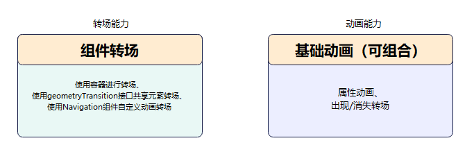
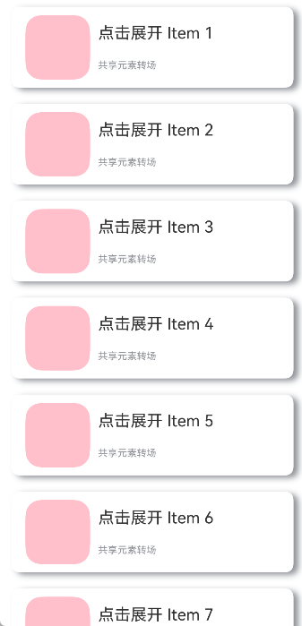
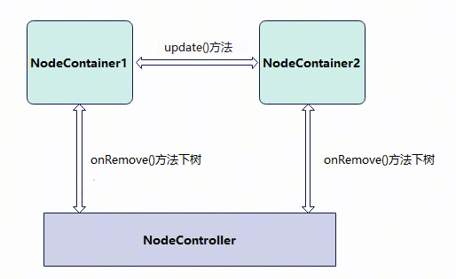

# 一镜到底动效

更新时间：2026-03-12 08:45:02

来源：https://developer.huawei.com/consumer/cn/doc/best-practices/bpta-one-shot-to-the-end

#### 概述

一镜到底动效是页面切换时对相同或者相似的两个元素做的一种位置、大小等属性匹配的过渡动画效果，有助于提升用户操作任务的效率，增强视觉的流畅感，同时也增强动效的品质感，是转场设计中重点推荐的技法。如下例所示，在点击图片后，该图片消失，同时在另一个位置出现新的图片，二者之间内容相同，可以对它们添加一镜到底动效。图1为不添加一镜到底动效的效果，图2为添加一镜到底动效的效果，一镜到底的效果能够让二者的出现消失产生联动，使得内容切换过程显得灵动自然而不生硬。
 
  
| 不添加一镜到底动效 | 添加一镜到底动效 |
| --- | --- |
|  |  |
 
 

#### 实现原理

一镜到底动效中整个页面会以一种平滑的方式从一个场景过渡到另一个场景。这种转场效果常用于展示不同页面之间的关联性，能够给用户带来流畅的视觉体验。
 
根据场景，可以将一镜到底动效分为两类：
 
- 共享元素共享元素一般是转场前后持续存在的界面元素，即上文提到的持续元素，是在转场发生后希望用户关注到的焦点元素，它增强了转场的连续感。如下图，搜索框是共享元素。

  


- 共享容器当一组元素在过渡时包含明确的边界，可使用容器来让转换过程有连续感。容器通过大小、高度、圆角等属性进行补间过渡转换，容器内的元素可通过淡入淡出或共享元素的手法进行过渡。

  


 
根据场景，可以将本文的案例分为以下两类。
  
| 场景分类 | 场景案例 | 实现方式 |
| --- | --- | --- |
| 共享元素转场 | 图片展开：双指放大 | 属性动画+节点迁移 |
| 共享元素转场 | 图片展开：查看大图 | geometryTransition()+位移缩放 |
| 共享元素转场 | 图片移动：半模态 | 属性动画+节点迁移 |
| 共享元素转场 | 图标（搜索框、头像等）展开 | geometryTransition()+显示动画 |
| 共享容器转场 | 卡片展开 | Navigation自定义动画+位移缩放 |
| 共享容器转场 | 列表展开 | geometryTransition()+显示动画 |
| 共享容器转场 | “图书”翻页展开一镜到底 | Navigation自定义动画+旋转 |
| 共享容器转场 | 视频展开 | Navigation自定义动画+节点迁移 |
 
 
一镜到底动效的实现需要转场能力和动画能力组合使用。
 


 
其中组件转场有三种方式实现，开发者可以根据需要选择合适的方式实现：
  
| 方式 | 特点 | 适用场景 |
| --- | --- | --- |
| 使用容器进行节点迁移 | 通过使用NodeController，将组件从一个容器迁移到另一个容器，在开始迁移时，需要根据前后两个布局的位置大小等信息对组件添加位移及缩放，确保迁移开始时组件能够对齐初始布局，避免出现视觉上的跳变现象。之后再添加动画将位移及缩放等属性复位，实现组件从初始布局到目标布局的一镜到底过渡效果。 | 适用于新建对象开销大的场景，如视频直播组件点击转为全屏等。 |
| 使用geometryTransition()共享元素转场 | 利用系统能力，转场前后两个组件调用geometryTransition()接口绑定同一id，同时将转场逻辑置于animateTo动画闭包内，这样系统侧会自动为二者添加一镜到底的过渡效果。 | 此方式适用于创建新节点开销小的场景。 |
| 使用Navigation自定义动画转场 | 进行路由跳转，customNavContentTransition事件提供自定义转场动画的能力。 | 适用于页面切换转场，如标题页和详情页之间的转场。 |
 
 
 

#### 使用容器进行节点迁移

[NodeContainer](https://developer.huawei.com/consumer/cn/doc/harmonyos-references/ts-basic-components-nodecontainer)作为一个占位容器组件，主要是用于自定义节点以及自定义节点树的显示和复用。NodeController提供了一系列生命周期回调，通过[makeNode()](https://developer.huawei.com/consumer/cn/doc/harmonyos-references/js-apis-arkui-nodecontroller#makenode)回调返回一个 [FrameNode](https://developer.huawei.com/consumer/cn/doc/harmonyos-references/js-apis-arkui-framenode#framenode-1)节点树的根节点。将[FrameNode](https://developer.huawei.com/consumer/cn/doc/harmonyos-references/js-apis-arkui-framenode)节点树挂载到对应的[NodeContainer](https://developer.huawei.com/consumer/cn/doc/harmonyos-references/ts-basic-components-nodecontainer)下。同时提供了[aboutToAppear()](https://developer.huawei.com/consumer/cn/doc/harmonyos-references/ts-custom-component-lifecycle#abouttoappear)、[aboutToDisappear()](https://developer.huawei.com/consumer/cn/doc/harmonyos-references/ts-custom-component-lifecycle#abouttodisappear)、[aboutToResize()](https://developer.huawei.com/consumer/cn/doc/harmonyos-references/js-apis-arkui-nodecontroller#abouttoresize)、[onTouchEvent()](https://developer.huawei.com/consumer/cn/doc/harmonyos-references/js-apis-arkui-nodecontroller#ontouchevent)、[rebuild()](https://developer.huawei.com/consumer/cn/doc/harmonyos-references/js-apis-arkui-nodecontroller#rebuild)五个回调方法用于监听对应的NodeContainer的状态。
 



 
举个简单的例子，例如上图，卡片状态可以分为两个形态，折叠态和展开态。开发者可以将折叠态和展开态分为两个节点NodeContainer1和NodeContainer2来控制二者之间的相互切换。NodeController触发onRemove()方法使NodeContainer1下树，调用update()方法更新卡片的展开状态，节点迁移至NodeContainer2，并触发动画。
 

 



 
 

#### 使用geometryTransition()共享元素转场

[geometryTransition()](https://developer.huawei.com/consumer/cn/doc/harmonyos-references/ts-transition-animation-geometrytransition)接口用于组件内隐式共享元素转场，在视图状态切换过程中提供丝滑的上下文继承过渡体验。
 
geometryTransition()的使用方式为对需要添加一镜到底动效的两个组件使用geometryTransition()接口绑定同一id，这样在其中一个组件消失同时另一个组件创建出现的时候，系统会对二者添加一镜到底动效。
 
geometryTransition()绑定两个对象的实现方式使得geometryTransition()区别于其他方法，最适合用于两个不同对象之间完成一镜到底。
 
 

#### 使用Navigation自定义动画转场

Navigation通过[customNavContentTransition()](https://developer.huawei.com/consumer/cn/doc/harmonyos-references/ts-basic-components-navigation#customnavcontenttransition11)事件提供自定义转场动画的能力，通过如下三步可以定义一个自定义的转场动画。
 1. 构建一个自定义转场动画工具类CustomNavigationUtils，通过一个Map管理各个页面自定义动画对象CustomTransition，页面在创建的时候将自己的自定义转场动画对象注册进去，销毁的时候解注册。
2. 实现一个转场协议对象[NavigationAnimatedTransition](https://developer.huawei.com/consumer/cn/doc/harmonyos-references/ts-basic-components-navigation#navigationanimatedtransition11)，其中timeout属性表示转场结束的超时时间，默认为1000ms，transition属性为自定义的转场动画方法，开发者要在这里实现自己的转场动画逻辑，系统会在转场开始时调用该方法，onTransitionEnd为转场结束时的回调。
3. 调用customNavContentTransition()方法，返回实现的转场协议对象，如果返回undefined，则使用系统默认转场。
 
 

#### 元素转场案例

 

#### 图片展开一镜到底

- 双指放大转场图片使用双指放大转场显示图片详情页。

  



  通过NodeContainer组件实现跨节点迁移，通过手势捏合来控制节点的上下树，达成一镜到底动效。

1. 小图模式和大图模式分别为两个页面，通过监听expand值来进行页面切换。
```ArkTS
@StorageProp('expand') @Watch('goToPageTwo') num1: number = 0;
// ...

aboutToAppear(): void {
  if (!getMyNode()) {
    createMyNode(this.getUIContext(), false);
  }
  this.imageGalleryNodeController = getMyNode();
}
```


2. 创建NodeContainer节点类。
```ArkTS
export class ImageGalleryNodeController extends NodeController {
  private rootNode: BuilderNode<[Params]> | null = null;
  private wrapBuilder: WrappedBuilder<[Params]> = wrapBuilder(ImageGalleryBuilder);
  private isExpand: boolean = false;

  constructor(isExpand: boolean) {
    super();
    this.isExpand = isExpand;
  }

  makeNode(uiContext: UIContext): FrameNode | null {
    if (this.rootNode === null) {
      this.rootNode = new BuilderNode(uiContext);
      this.rootNode.build(this.wrapBuilder, { isExpand: this.isExpand });
    }
    return this.rootNode.getFrameNode();
  }

  init(uiContext: UIContext) {
    this.rootNode = new BuilderNode(uiContext);
    this.rootNode.build(this.wrapBuilder, { isExpand: this.isExpand });
  }

  update(isExpand: boolean) {
    if (this.rootNode !== null) {
      this.rootNode.update({ isExpand });
    }
  }
}
```


3. 在小图界面当对图片进行双指捏合操作时，改变isExpand值。
```ArkTS
PinchGesture()
  .onActionStart((event: GestureEvent) => {
    this.offsetY = getTranslateToFullScreen(this.getUIContext(), 'swiper')?.offsetY || 0
    this.imageHeight = this.getUIContext().vp2px(Number(event.target.area.height))
    this.imageWidth = this.getUIContext().vp2px(Number(event.target.area.width))
    this.status = Status.PINCHING;
    this.updateCenter([this.getUIContext().vp2px(event.pinchCenterX),
      this.getUIContext().vp2px(event.pinchCenterY)])
    this.updateTranslateAccordingToCenter();
    this.startGestureScale = this.imageScale;
    this.gestureCount++;
  })
  .onActionUpdate((event: GestureEvent) => {
    this.imageScale = this.startGestureScale * event.scale;
    if (!this.isExpand && this.imageScale >= 1) {
      this.onExpand();
    }
    this.updateExtremeOffset();
  })
```


4. 当expand值更改时，页面进行切换到大图页面，完成一镜到底页面切换。
```ArkTS
NavDestination() {
  NodeContainer(this.imageGalleryNodeController)
}
.mode(NavDestinationMode.DIALOG)
.height('100%')
.width('100%')
.hideTitleBar(true)
.onReady((context: NavDestinationContext) => {
  this.pageInfo = context.pathStack;
  const param = context.pathInfo?.param as Record<string, Object>;
  this.onBack = param['onBack'] as () => void;
})
.onBackPressed(() => {
  AppStorage.setOrCreate('reset', new Date());
  this.getUIContext().animateTo({ duration: 300, curve: Curve.EaseIn }, () => {
    this.backToPageOne();
  })
  return true;
})
```

- 查看大图转场比如图片在九宫格中显示，点击查看大图，同时还支持手势下拉返回到九宫格。

  


  设置geometryTransition属性将图片首页和大图页面的图片绑定同一id值，结合属性动画效果实现一镜到底效果。核心代码如下：

1. 首页通过网格布局实现三行三列图片布局，并给每个图片设置geometryTransition属性，绑定唯一id值，绑定共享的两个图片组件。
```ArkTS
NavDestination() {
  Column() {
    Grid(this.scroller) {
      ForEach(this.data, (item: number) => {
        GridItem() {
          if (this.clickedIndex !== item || (this.isFirstPageShow)) {
            Image($r(`app.media.img_${item % 9}`))
              .width('100%')
              .height('100%')
              .objectFit(ImageFit.Cover)
              .id('item2_' + item)
              .onClick(() => {
                this.onItemClick(item);
              })
              .geometryTransition(this.clickedIndex === item ? 'app.media.img_' + item.toString() : '')
              .transition(TransitionEffect.opacity(0.99))
          }
        }
        .width(this.getUIContext().px2vp(381))
        .height(this.getUIContext().px2vp(381))
      }, (item: number) => item + '')
    }
    .rowsTemplate('1fr 1fr 1fr')
    .columnsTemplate('1fr 1fr 1fr')
    .columnsGap(2)
    .rowsGap(2)
    .size({
      width: this.getUIContext().px2vp(1169),
      height: this.getUIContext().px2vp(1169)
    })
    .margin({ top: 16 })
  }
}
.title('View larger picture')
.height('100%')
.width('100%')
.onReady((context: NavDestinationContext) => {
  this.pageInfo = context.pathStack;
})
```


2. 通过属性动画来进行小图和大图页面的切换，同时为了避免触发Navigation的转场动画，在pushPath()的时候把动画选项设置成了false。
```ArkTS
onItemClick(index: number): void {
  let param: Record<string, Object> = {};
  this.needFollow = false;
  this.clickedIndex = index;
  param['selectedIndex'] = this.clickedIndex;
  param['onIndexChange'] = (index: number) => {
    this.onIndexChange(index);
  };
  param['onBackToFirstPage'] = () => {
    this.onBack();
  }

  this.getUIContext().animateTo({
    duration: 250,
    curve: Curve.EaseIn,
  }, () => {
    this.pageInfo.pushPath({ name: 'ShowLargeImageWithGesturePageTwo', param: param }, false);
    this.isFirstPageShow = false;
  })
}
```

- 半模态转场图片从页面向半模态弹窗中转场显示。

  


  利用NodeContainer组件实现跨节点迁移，将半模态SheetOptions()中的mode设置为SheetMode.EMBEDDED，该模式下新起的页面可以覆盖在半模态弹窗上，页面返回后该半模态依旧存在，半模态面板内容不丢失。通过属性动画，展示组件从初始界面至半模态页面的一镜到底动效，并在动画结束时关闭页面，并将该组件迁移至半模态页面。

1. 创建NodeContainer节点类。
```ArkTS
export class MyNodeController extends NodeController {
  // ...
}
```


2. 首页图片绑定半模态弹窗，并通过bindContentCover设置模态转场动画。
```ArkTS
NavDestination() {
  Column() {
    Image($r('app.media.flower'))
      .opacity(this.opacityDegree)
      .width('90%')
      .id('origin')
      .enabled(this.isEnabled)
      .onClick(() => {
        this.originInfo = this.calculateData('origin');
        this.scaleValue = this.originInfo.scale;
        this.translateX = this.originInfo.translateX;
        this.translateY = this.originInfo.translateY;
        this.clipWidth = this.originInfo.clipWidth;
        this.clipHeight = this.originInfo.clipHeight;
        this.radius = 0;
        this.opacityDegree = 0;
        this.isShowSheet = true;
        this.isShowOverlay = true;
        // Set the artwork to non-interactive interrupt resistant.
        this.isEnabled = false;
      })
  }
  .width('100%')
  .height('100%')
  .padding({ top: 16 })
  .alignItems(HorizontalAlign.Center)
  .bindSheet(this.isShowSheet, this.mySheet(), {
    mode: SheetMode.EMBEDDED,
    height: this.bindSheetHeight,
    onDisappear: () => {
      // Ensure that the state is correct when the half-mode disappears.
      this.isShowImage = false;
      this.isShowSheet = false;
      // Set a mirror at the end of the animation to enter the trigger state.
      this.isAnimating = false;
      // The artwork becomes interoperable again.
      this.isEnabled = true;
    }
  })
  .bindContentCover(this.isShowOverlay, this.overlayNode(), {
    // The modal page is set to no transition
    transition: TransitionEffect.IDENTITY
  })
}
.backgroundColor('#F1F3F5')
.expandSafeArea([SafeAreaType.SYSTEM], [SafeAreaEdge.BOTTOM])
.title('half mode')
```


3. 点击首页图片后将图片节点迁移至半模态，当半模态完成布局之后，触发onLayoutComplete()函数，获取到图片初始位置和半模态位置，通过自定义显示动画完成一镜到底的效果。
```ArkTS
aboutToAppear(): void {
  // Set the layout of the image on the half mode to complete the callback.
  let onLayoutComplete: () => void = (): void => {
    // Grab the layout information when the target image layout is complete.
    this.targetInfo = this.calculateData('target');
    // Only half modes are correctly laid out and a mirror is triggered when there is no animation at this time.
    if (this.targetInfo.scale !== 0 && this.targetInfo.clipWidth !== 0 && this.targetInfo.clipHeight !== 0 &&
      !this.isAnimating) {
      this.isAnimating = true;
      // Property animation for long-take of a modal page.
      this.getUIContext().animateTo({
        duration: 1000,
        curve: Curve.Friction,
        onFinish: () => {
          // Custom node subtree on overlay page.
          this.isShowOverlay = false;
          // Custom nodes on the semi-modal tree, thus completing node migration.
          this.isShowImage = true;
        }
      }, () => {
        this.scaleValue = AppStorage.get('currentBreakpoint') === 'md' ? 0.382 : this.targetInfo.scale;
        this.translateX = AppStorage.get('currentBreakpoint') === 'md' ? 93.5 : this.targetInfo.translateX;
        this.clipWidth = AppStorage.get('currentBreakpoint') === 'md' ? 525 : this.targetInfo.clipWidth;
        this.clipHeight = AppStorage.get('currentBreakpoint') === 'md' ? 785 : this.targetInfo.clipHeight;
        // Fixed height differences due to half-mode height and scaling.
        this.translateY = this.targetInfo.translateY +
          (this.getUIContext().px2vp(WindowUtils.windowHeight_px) - this.bindSheetHeight -
          this.getUIContext().px2vp(WindowUtils.navigationIndicatorHeight_px) -
          this.getUIContext().px2vp(WindowUtils.topAvoidAreaHeight_px)) -
          (AppStorage.get('currentBreakpoint') === 'md' ? 134.3 : 0);
        // Fixed differences in rounded corners due to scaling.
        this.radius = this.sheetRadius / this.scaleValue;
      })
      // The artwork goes from transparent to animated.
      this.getUIContext().animateTo({
        duration: 2000,
        curve: Curve.Friction,
      }, () => {
        this.opacityDegree = 1;
      })
    }
  };
  // Open layout listening.
  this.listener.on('layout', onLayoutComplete);
}
```


 
 

#### 图标（搜索框、头像等）展开一镜到底

搜索框点击后，转场到搜索结果页面。
 


 
将搜索框首页与搜索框页面的Search组件同时设置geometryTransition属性，并绑定同一id值。设置显式动画和transition属性的转场效果，实现搜索框的一镜到底效果。
 1. 搜索框首页在Search组件添加geometryTransition属性，并绑定id值，禁用掉Navigation本身转场的动画。
```ArkTS
// Search animation
private showSearchPage(): void {
  this.transitionEffect = TransitionEffect.OPACITY;
  this.getUIContext().animateTo({
    curve: curves.interpolatingSpring(0, 1, 342, 38)
  }, () => {
    this.pageInfos.pushPath({ name: 'SearchLongTakeTransitionPageTwo' }, false);
  })
}
```

2. 搜索页面中的Search组件添加geometryTransition()，并添加与搜索框首页中的同一id值。
```ArkTS
Search({ placeholder: 'Search' })
  .height(40)
  .placeholderColor($r('sys.color.mask_secondary'))
  .width('100%')
  // set geometry transition
  .geometryTransition('SEARCH_ONE_SHOT_DEMO_TRANSITION_ID', { follow: true })
  .backgroundColor('#0D000000')
  .defaultFocus(false)
  .focusOnTouch(false)
  .focusable(false)
```

 
 

#### 容器转场案例

 

#### 卡片、列表展开一镜到底

在瀑布流或列表流布局中，当用户点击其中一个卡片或列表项时，应用将执行平滑的转场动画，引导用户从概览页面切换到详情页面。
 


 
使用WaterFlow()和LazyForEach()实现卡片列表瀑布流。利用Navigation的自定义导航转场动画能力，通过customNavContentTransition()配置列表页与详情页的自定义导航转场动画，结合componentSnapshot()将卡片进行截图避免跳转页面白屏。
 1. 卡片列表页使用WaterFlow和LazyForEach实现页面布局。
```ArkTS
private onColumnClicked(indexValue: string): void {
  let param: Record<string, Object> = {};
  let clickedIndex = parseInt(indexValue);
  param['indexValue'] = clickedIndex;
  this.clickedIndex = clickedIndex;
  // Click the card to get the corresponding screenshot and save it.
  this.getUIContext()
    .getComponentSnapshot()
    .get('FlowItem_' + indexValue, (error: BusinessError, pixelMap: image.PixelMap) => {
      if (error) {
        hilog.error(0x0000, 'CardLongTakePageOne',
          `componentSnapshot.get error, reason: Code is ${error.code}, message is ${error.message}`);
        // If the screenshot fails, go to the default left/right transition. In this case, the pop-up page will not receive clickedComponentId parameter, and the registration process will not proceed.
        // At that time from and to the animation are undefined, will go in customNavContentTransition transitions by default.
        this.pageInfos.pushPath({ name: 'CardLongTakeTransitionPageTwo', param: param });
        return;
      } else {
        hilog.info(0x0000, 'CardLongTakePageOne', 'componentSnapshot.get success!');
        // If the screenshot is successful, then go to a custom mirror in the end transition.
        param['clickedComponentId'] = CardUtil.getFlowItemIdByIndex(indexValue);
        param['doDefaultTransition'] = () => {
          this.doFinishTransition();
        };
        SnapShotImage.pixelMap = pixelMap;
        this.pageInfos.pushPath({ name: 'CardLongTakeTransitionPageTwo', param: param });
        this.dataSource.getData(this.clickedIndex).isVisible = Visibility.Hidden;
      }
    })
}
```

2. 卡片详情页通过Navigation自定义动画实现一镜到底。这里套了两层Stack()，因为要放截图，以及把原来的详情页内容转移过来。缩放、translate属性设置在Stack()这层上实现边界动画，透明度属性设置在截图上实现内容过渡。在onReady()里面注册自定义动画，通过id对动画属性进行初始化。
```ArkTS
// Try to register a custom transition animation to restore the page properties to their normal state in case of an exception.
tryRegisterCustomTransition(clickedCardId: string): void {
  try {
    // First initialize some transition information.
    this.longTakeAnimationProperties.init(clickedCardId, this.prePageDoFinishTransition);
    CustomTransition.getInstance().registerNavParam(this.pageId, 2000,
      (transitionProxy: NavigationTransitionProxy) => {
        this.longTakeAnimationProperties.doAnimation(transitionProxy);
      });
    hilog.info(0x0000, 'CardLongTakePageTwo', 'register successes');
  } catch (error) {
    let err = error as BusinessError;
    hilog.error(0x0000, 'CardLongTakePageTwo', `this is error:code=${err.code}, message=${err.message}`);
    this.longTakeAnimationProperties.setFinalStatus();
  }
}

// ...

build() {
  NavDestination() {
    // Stack needs to set the alignContent to TopStart, otherwise the screenshot and content will be repositioned with the height as it changes.
    Stack({ alignContent: Alignment.TopStart }) {
      Stack({ alignContent: Alignment.TopStart }) {
        // Used to display a screenshot of the card clicked on the previous page.
        Image(this.snapShotImage)
          .size(this.longTakeAnimationProperties.snapShotSize)
          .objectFit(ImageFit.Auto)
          .opacity(this.longTakeAnimationProperties.snapShotOpacity)
          // eslint-disable-next-line @performance/hp-arkui-image-async-load
          .syncLoad(true)// The position here gives the distance from the screenshot position to the expanded page image position.
          .position({
            x: this.longTakeAnimationProperties.snapShotPositionX,
            y: this.longTakeAnimationProperties.snapShotPositionY
          })

        // The pop-up page originally displays the content, adding transparency to control its display during animation.
        DetailPageContent({
          indexValue: this.indexValue,
          pageInfos: this.pageInfos,
          onBackPressed: () => {
            this.onBackPressed()
          },
          SharedComponentId: CardUtil.getPostPageImageId(this.clickedCardId)
        })
          .size({
            width: '100%',
            height: '100%'
          })
          .opacity(this.longTakeAnimationProperties.postPageOpacity)
      }
      .width('100%')
      .position({
        x: this.longTakeAnimationProperties.positionXValue,
        y: this.longTakeAnimationProperties.positionYValue
      })
    }
    .scale({
      x: this.longTakeAnimationProperties.scaleValue,
      y: this.longTakeAnimationProperties.scaleValue
    })
    .translate({
      x: this.longTakeAnimationProperties.translateX,
      y: this.longTakeAnimationProperties.translateY
    })
    .width(this.longTakeAnimationProperties.clipWidth)
    .height(this.longTakeAnimationProperties.clipHeight)
    .borderRadius(this.longTakeAnimationProperties.radius)
    .expandSafeArea([SafeAreaType.SYSTEM])
    .backgroundColor($r('app.color.water_flow_background_color'))
    .clip(true)
  }
  .backgroundColor(this.longTakeAnimationProperties.navDestinationBgColor)
  .GestureStyles()
  .hideTitleBar(true)
  .onReady((context: NavDestinationContext) => {
    this.pageInfos = context.pathStack;
    let param = context.pathInfo?.param as Record<string, Object>;
    let clickedCardId = param['clickedComponentId'] as string;
    this.indexValue = param['indexValue'] as number;
    this.prePageDoFinishTransition = param['doDefaultTransition'] as () => void;
    if (context.navDestinationId && clickedCardId) {
      this.pageId = context.navDestinationId;
      this.clickedCardId = clickedCardId;
      this.tryRegisterCustomTransition(clickedCardId);
    }
  })
  .onBackPressed(() => {
    return this.onBackPressed();
  })
  .onDisAppear(() => {
    CustomTransition.getInstance().unRegisterNavParam(this.pageId);
  })
}

// ...
```

 
列表一镜到底效果图。
 


 
将列表项与详情页面同时设置geometryTransition属性，并绑定同一id值。每个列表项设置显式动画和transition属性的转场效果，实现列表展开的一镜到底效果。
 1. 列表页面中每一个列表项设置geometryTransition属性，并绑定当前列表的id值。
```ArkTS
@Component
export struct MyButton {
  @Prop listContent: ListContent;
  @Prop indexValue: string;
  @State scaleValue: number = 1;

  build() {
    Column({ space: 10 }) {
      Row({ space: 5 }) {
        Line()
          .startPoint([0, 0])
          .endPoint([0, 20])
          .strokeWidth(5)
          .stroke(Color.Yellow)
          .strokeLineCap(LineCapStyle.Round)
        Text(this.listContent.title)
          .fontWeight(FontWeight.Medium)
          .fontSize(16)
      }

      Text(this.listContent.content)
        .fontColor(Color.Grey)
        .maxLines(1)
        .textOverflow({ overflow: TextOverflow.Ellipsis })
        .fontSize(14)
    }
    .alignItems(HorizontalAlign.Start)
    .padding({
      left: 20,
      right: 20,
      top: 20,
      bottom: 20
    })
    .width('91%')
    .backgroundColor(Color.White)
    .clip(true)
    .borderRadius(20)
    .scale({
      x: this.scaleValue,
      y: this.scaleValue
    })
    .geometryTransition(this.indexValue, { follow: true })
    .onTouch((event?: TouchEvent) => {
      this.onTouchProcess(event);
    })
    .onClick(() => {
      this.onButtonClicked?.(this.indexValue);
    })
  }

  onButtonClicked: (index: string) => void = (_index: string) => {
  };

  private onTouchProcess(event?: TouchEvent): void {
    if (!event) {
      return;
    }
    if (event.type === TouchType.Down) {
      this.getUIContext().animateTo({ curve: curves.interpolatingSpring(0, 1, 350, 35) }, () => {
        this.scaleValue = 0.95;
      })
    } else if (event.type === TouchType.Up) {
      this.getUIContext().animateTo({ curve: curves.interpolatingSpring(0, 1, 350, 35) }, () => {
        this.scaleValue = 1;
      })
    } else if (event.type === TouchType.Cancel) {
      this.getUIContext().animateTo({ curve: curves.interpolatingSpring(0, 1, 350, 35) }, () => {
        this.scaleValue = 1;
      })
    }
  }
}
```

2. 列表详情页中的容器组件Column组件设置geometryTransition属性，并绑定对应列表项的id值，完成一镜到底效果。
```ArkTS
NavDestination() {
  Column({ space: 20 }) {
    Text(this.param.title)
      .fontSize(30)
      .fontWeight(FontWeight.Medium)
    Text(this.param.content)
      .fontColor($r('sys.color.password_icon_focus_color'))
      .lineHeight(28)
      .fontSize(16)
  }
  .alignItems(HorizontalAlign.Start)
  .clip(true)
  .size({
    width: '100%',
    height: '100%'
  })
  .geometryTransition(this.param.geometryId)
}
.padding({
  top: 46,
  left: 16,
  right: 16
})
.backgroundColor(Constants.DEFAULT_BG_COLOR)
.transition(TransitionEffect.OPACITY)
.hideTitleBar(true)
.backgroundColor(Color.Transparent)
.onReady((context: NavDestinationContext) => {
  this.pageInfos = context.pathStack;
  this.param = (context.pathInfo.param as ListDetailPageExtraInfo);
})
.onBackPressed(() => {
  this.getUIContext().animateTo({ curve: curves.interpolatingSpring(0, 1, 342, 38) }, () => {
    this.pageInfos.pop(false);
  })
  return true;
})
```

 
 

#### “图书”翻页展开一镜到底

阅读类应用中，点击一本“图书”的图标后，模拟图书翻页展开的效果，转场到书本内容页面，同时支持手势返回。
 


 
利用Navigation的自定义导航转场动画能力，通过customNavContentTransition()配置书籍页与详情页的自定义导航转场动画实现图书翻页一镜到底效果。使用rotate属性实现书籍翻页的旋转效果。
 1. 书架页面通过Grid组件实现书架第一行书籍布局，使用Swiper()组件实现书架第一行书籍布局。
```ArkTS
build() {
  NavDestination() {
    Scroll() {
      Column({ space: 12 }) {
        // A mirror returns to the first position.
        Grid() {
          ForEach(this.dataSource, (item: BookItem, index: number) => {
            GridItem() {
              Image($r(item.coverImageUrl))
                .id(item.id)
                .width('100%')
                .onClick(() => {
                  this.onColumnClicked(item.id, item.coverImageUrl, this.dataSource[0].id, () => {
                    this.dataSource.sort((a, b) => b.timestamp - a.timestamp);
                  })
                  this.dataSource[index].timestamp = Number(new Date());
                })
            }
            .width(this.columnWidth)
          }, (item: BookItem) => JSON.stringify(item))
        }
        .padding({
          left: 12,
          right: 12,
          top: 12
        })
        .columnsTemplate(this.columnType)
        .columnsGap(10)
        .rowsGap(10)

        // A mirror is returned to its original position.
        Column({ space: 12 }) {
          Text('Recently read')
            .fontSize(16)
            .fontWeight(FontWeight.Medium)
            .fontColor(Color.Gray)
          Swiper(this.swiperController) {
            ForEach(this.recentData, (item: BookItem) => {
              GridItem() {
                Image($r(item.coverImageUrl))
                  .id(item.id)
                  .onClick(() => {
                    this.onColumnClicked(item.id, item.coverImageUrl);
                  })
              }
            }, (item: BookItem) => JSON.stringify(item))
          }
          .indicator(false)
          .displayCount(3)
          .loop(false)
          .itemSpace(10)
        }
        .padding({
          left: 12,
          right: 12
        })
        .alignItems(HorizontalAlign.Start)
      }
    }
  }
  // ...
}

// ...

private onColumnClicked(bookId: string, bookCoverUrl: string, toBookId?: string, prePageCallback?: () => void): void {
  try {
    CustomTransition.getInstance().unRegisterNavParam(this.pageId);
    const fromCardItemInfo: RectInfoInPx =
      ComponentAttrUtils.getRectInfoById(WindowUtils.window.getUIContext(), bookId);
    let param: Record<string, Object> = {};
    param['fromCardItemInfo'] = fromCardItemInfo;
    param['bookCoverUrl'] = bookCoverUrl;
    if (toBookId) {
      const toCardItemInfo: RectInfoInPx =
        ComponentAttrUtils.getRectInfoById(WindowUtils.window.getUIContext(), toBookId);
      param['toCardItemInfo'] = toCardItemInfo;
    }
    if (prePageCallback) {
      param['prePageCallback'] = prePageCallback;
    }
    this.pageInfos.pushPath({ name: 'BookFlipLongTakeTransitionPageTwo', param: param });
  } catch (err) {
    let error = err as BusinessError;
    hilog.error(0x0000, 'BookFlipLongTakeTransitionPageOne',
      `onColumnClicked failed. error code=${error.code}, message=${error.message}`);
  }
}
```

2. 书籍详情页通过Navigation自定义动画实现一镜到底。
```ArkTS
NavDestination() {
  Stack() {
    Column() {
      Text($r('app.string.DetailPage_text'))
        .fontColor($r('sys.color.password_icon_focus_color'))
        .lineHeight(28)
        .fontSize(16)
    }
    .width(AppStorage.get('currentBreakpoint') === 'md' ? '75%' : '100%')
    .height('100%')
    .alignItems(HorizontalAlign.Start)
    .padding({
      left: 16,
      right: 16,
      top: 46
    })

    if (!this.doDefaultTransition) {
      Image($r(this.bookCoverUrl))
        .objectFit(ImageFit.Cover)
        // eslint-disable-next-line @performance/hp-arkui-image-async-load
        .syncLoad(true)
        .rotate({
          x: 0,
          y: 1,
          z: 0,
          angle: this.bookFlipLongTakeTransitionProperties.coverRotateAngle,
          centerX: 0,
          centerY: '50%'
        })
        .scale({
          x: this.bookFlipLongTakeTransitionProperties.coverScale,
          centerX: 0,
          centerY: '50%'
        })
    }
  }
  .scale({
    x: this.bookFlipLongTakeTransitionProperties.scaleValue,
    y: this.bookFlipLongTakeTransitionProperties.scaleValue
  })
  .translate({
    x: this.bookFlipLongTakeTransitionProperties.translateX,
    y: this.bookFlipLongTakeTransitionProperties.translateY
  })
  .width(this.bookFlipLongTakeTransitionProperties.clipWidth)
  .height(this.bookFlipLongTakeTransitionProperties.clipHeight)
  .backgroundColor('#DEDFDF')
}
.backgroundColor(this.bookFlipLongTakeTransitionProperties.navDestinationBgColor)
.GestureStyles()
.hideTitleBar(true)
.onReady((context: NavDestinationContext) => {
  this.pageInfos = context.pathStack;
  let param = context.pathInfo?.param as Record<string, Object>;
  this.bookCoverUrl = param['bookCoverUrl'] as string;
  this.fromCardItemInfo = param['fromCardItemInfo'] as RectInfoInPx;
  this.toCardItemInfo = (param['toCardItemInfo'] || param['fromCardItemInfo']) as RectInfoInPx;
  this.prePageCallback = param['prePageCallback'] as () => void;
  if (context.navDestinationId) {
    this.pageId = context.navDestinationId;
  }
  CustomTransition.getInstance()
    .registerNavParam(this.pageId, 500, (transitionProxy: NavigationTransitionProxy) => {
      this.bookFlipLongTakeTransitionProperties.doAnimation(transitionProxy, this.fromCardItemInfo,
        this.toCardItemInfo);
    }, () => {
      this.bookFlipLongTakeTransitionProperties.onInteractiveFinish();
    }, () => {
      this.bookFlipLongTakeTransitionProperties.onInteractive(
        this.fromCardItemInfo, this.toCardItemInfo);
    });
})
.onBackPressed(() => {
  return this.onBackPressed();
})
.onDisAppear(() => {
  CustomTransition.getInstance().unRegisterNavParam(this.pageId);
})
```

 
 

#### 视频展开一镜到底

视频组件从一个页面向目标页面的转场，在一镜到底的过程中，视频需要持续播放。
 


 
使用WaterFlow()和LazyForEach()实现卡片列表瀑布流。利用NodeController实现组件的跨节点迁移，通过customNavContentTransition配置概览页与视频详情的自定义导航转场动画，给节点的迁移过程赋予一镜到底效果。
 1. 创建NodeController节点类。
```ArkTS
export class MyNodeController extends NodeController {
  // ...
}
```

2. 视频首页使用WaterFlow()和LazyForEach()实现页面布局，点击视频后将视频节点迁移至视频播放页面，通过Navigation自定义动画完成一镜到底的效果。
```ArkTS
NavDestination() {
  WaterFlow() {
    LazyForEach(this.dataSource, (_: CardAttr, index: number) => {
      FlowItem() {
        VideoCardComponent({
          isPlaying: false,
          index,
          onColumnClicked: (prePageCallback) => {
            this.onColumnClicked(`xComponent_${index}`, prePageCallback)
          }
        })
      }
      .width('100%')
      .borderRadius(10)
      .clip(true)
      .id('FlowItem_' + index.toString())
    }, (item: string) => item)
  }
  .edgeEffect(EdgeEffect.Spring)
  .onScrollIndex((first: number) => {
    this.scrollFirstIndex = first;
  })
  .padding(12)
  .columnsTemplate(this.columnType)
  .columnsGap(12)
  .rowsGap(10)
  .width('100%')
  .height('100%')
}
.backgroundColor(Constants.DEFAULT_BG_COLOR)
.title(getResourceString(this.getUIContext(), $r('app.string.video_title'), this))
.onReady((context: NavDestinationContext) => {
  this.pageInfos = context.pathStack;
  if (context.navDestinationId) {
    this.pageId = context.navDestinationId;
  }
})
.onDisAppear(() => {
  CustomTransition.getInstance().unRegisterNavParam(this.pageId);
})
```

 
 

#### 示例代码

- [实现转场动效功能合集](https://gitcode.com/harmonyos_samples/transitions-collection)
