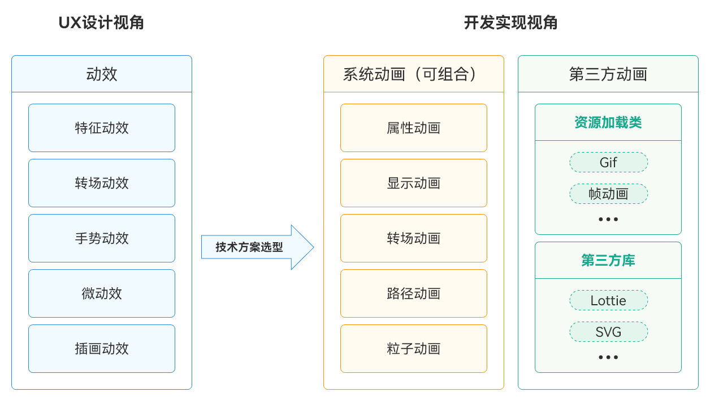
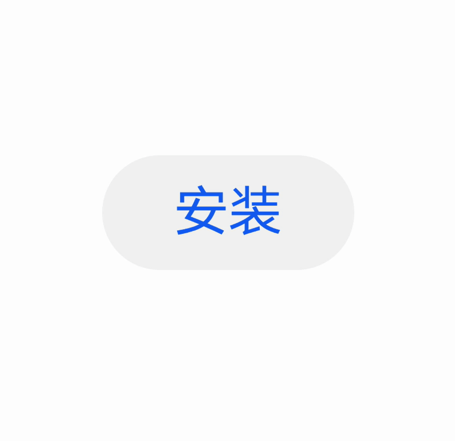
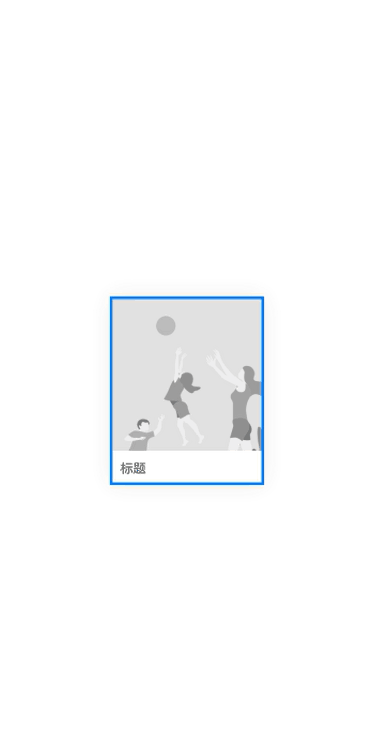
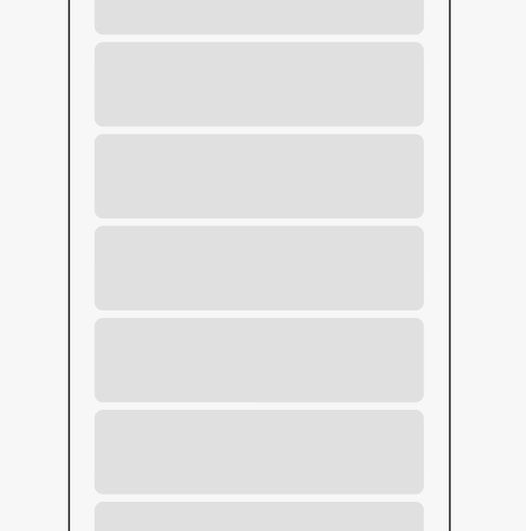
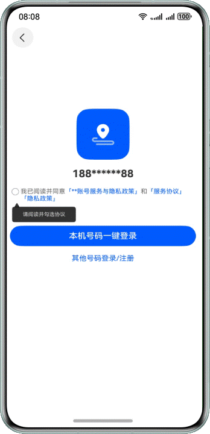
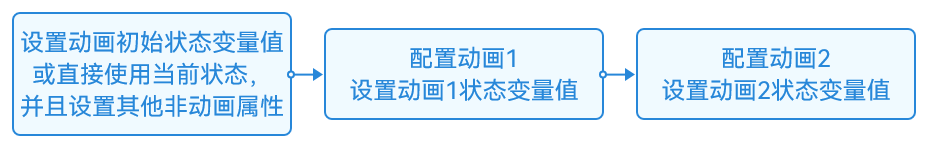
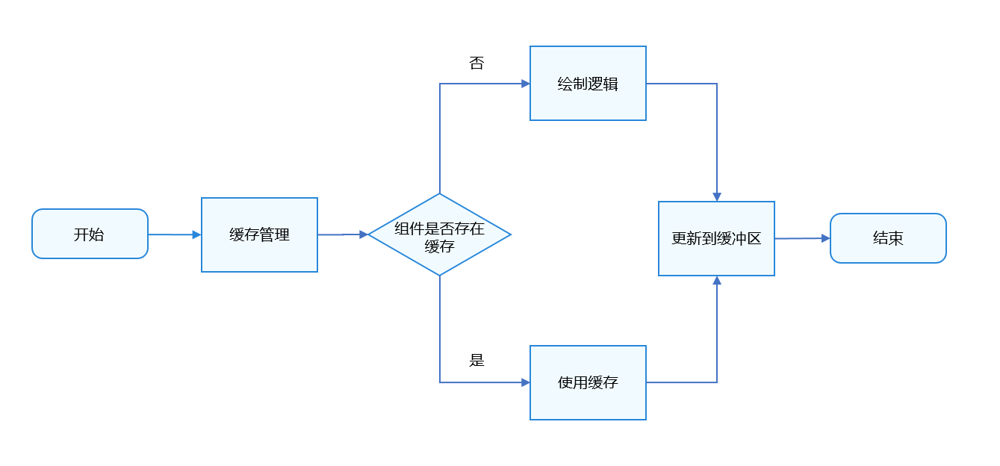
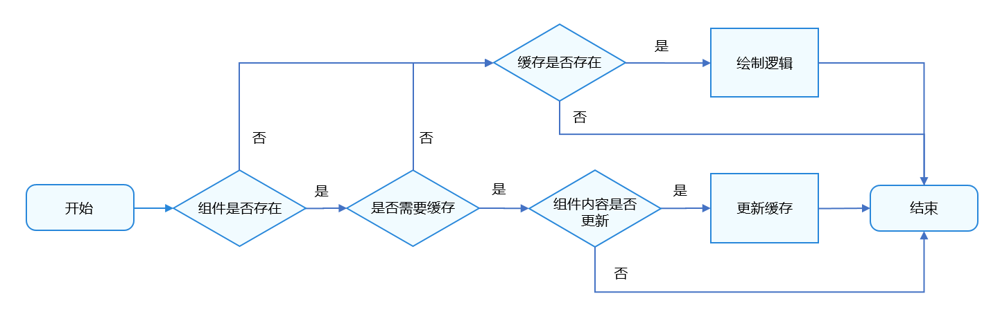

# 动画使用指导

更新时间：2026-03-19 08:43:01

来源：https://developer.huawei.com/consumer/cn/doc/best-practices/bpta-fair-use-animation

## 概述


动画是应用开发中必不可少的部分，它可以使应用程序更加生动和易于互动，一方面可以提升用户体验、增强视觉吸引力，另一方面可以引导用户操作、提高信息传达效率。应用程序中，页面层级间的转场、点击交互、手势操控都可以添加动画。合理使用动画可以通过以下两个方面考虑：

- 提升动画感知流畅度：使用合适的动画能力将UX设计视角转换为开发实现视角，并将设计师提供的动效转化为具体的代码实现。这样可以确保应用在实际使用中达到设计的预期效果，提升动画感知流畅度并提供良好的用户体验。
- 提升动画运行流畅度：优化动画资源的加载和释放，避免内存泄漏和资源浪费；合理使用动画缓存和复用，减少不必要的重复绘制，提高动画的运行效率。


在使用动画时，需要根据具体场景和用户需求进行合理的设计和运用，并且需要注意动画的性能影响，及时采取相应的优化措施。通过合理使用动画，可以提升动画的感知流畅度和运行流畅度，从而提升应用程序的用户体验和性能。


## 提升动画感知流畅度


HarmonyOS动效引力体系，围绕回归本源设计理念，打造了自然、流畅、品质一体的操作体验。基于视觉效果设计，可以将动效划分为特征动效、转场动效、手势动效、微动效、插画动效。在特征动效中呈现出天体运动“力”的既视感；转场动效表现出物体在运动过程中“力”的秩序感；手势动效打造出元素运动互相影响“力”的控制感；微动效和插画动效辅助HarmonyOS动效引力体系，增加用户的操作趣味性和浏览愉悦感。动效要始终围绕操作符合用户心理预期，物体运动符合真实世界，元素表现形态凸显产品的品牌与调性，从用户感知角度提升流畅度。


HarmonyOS系统为开发者提供了丰富的动画能力，在实际开发过程中，需要把上述UX设计视角转换为开发实现视角，即使用HarmonyOS系统提供的动画能力来实现UX设计的场景和动效，一般来说需要采取如下步骤完成视角转换：

1. 了解系统能力：首先，开发者需要深入了解HarmonyOS系统提供的动画能力，包括动画类型和动画相关API。
2. 分析UX设计视角：仔细分析UX设计所提供的动效，理解设计师的意图。
3. 设计动画方案：基于分析的结果，设计出合理的动画方案。确定动画的触发时机、动画的类型和参数等。
4. 使用动画能力：利用HarmonyOS提供的动画能力，如属性动画、路径动画等或者调用三方库，完成设计效果。
5. 调试和优化：在实施动画的过程中，进行调试和优化。确保动画效果流畅，动效符合预期，且满足性能要求。


通过以上步骤，开发者可以将UX设计视角转换为开发实现视角，并将设计师提供的动效转化为具体的代码实现。这样可以确保应用在实际使用中达到设计的预期效果，提升动画感知流畅度并提供良好的用户体验。

图1 合理使用动画





### 动效场景设计


在设计动效过程中，要清楚地理解动效在系统中承载的作用，动效能体现页面的流畅过渡、对象的明确提示、元素的层级关系、产品的品牌印象等。

特征动效

特征动效主要打造 “天体拟物感知”，提供一种天体拟物的品牌效应和宇宙空间感的交互体验，它将力赋予元素，更直观地传递出形象化、拟物化、动态化的设计理念，在不同场景上表达新颖个性的同时又凸显了独特的产品调性。它可以广泛应用于开场动画、加载动画、下载动画等场景。

特征动效是指在用户界面中突出某个特定元素的动画效果。通过特征动效，可以吸引用户的注意力，提升用户体验。例如，在一个应用程序中，当用户点击”下载”按钮时，渐变显示出进度条并动态加载(如下图所示)。

图2 点击特征动效示意




转场动效

转场动效是指在不同页面或视图之间切换时使用的动画效果。通过转场动效，可以平滑地过渡到下一个页面或视图，增加界面间的连贯性和流畅性。

HarmonyOS系统为开发者提供了丰富的转场动效库，使开发者能够轻松实现各种转场动画效果。开发者可以根据具体需求，在应用的不同场景中应用这些转场动效，以提升用户体验和界面的吸引力。需要注意的是，为了最佳的用户体验，开发者应根据界面的功能和特点，合理选择转场动效，并遵循动效的使用准则，以确保转场动效在视觉和交互上的一致性。

图3 转场动效示意




手势动效

手势动效是指根据用户的手势操作而产生的动画效果。通过手势动效，可以增强用户与设备之间的互动体验。

- 点击：点击的接触过程中有一段100ms~300ms的时长是无反馈状态，为了提升感知体验，可以在按下那一刻即响应动效反馈。这一可先行的触控响应机制强化了界面元素的视觉反馈，为理解界面状态提供了更多的线索信息。
- 滑动：滑动手势是用户进行滑动操作时产生的相应动画效果，例如随手指移动的平滑过渡动画，增强了界面的流畅性。保证对象动效反馈的结果与手势动作的连贯性是滑动手势动效设计的关键。
- 翻动：翻动手势动效通常用于模拟翻书或翻页的效果，用户可以通过拖拽或抛滑手势来翻转页面或切换内容，界面元素会产生相应的翻页动画，提供更真实的交互体验。翻页分为成功与未成功，未成功会停留在当前内容上；成功则显示下一页/几页的内容。为了提示性，翻页也有过界拖拽的场景。
- 夹捏：捏合手势是指双/多指合拢或分开的动作，常用于缩放或旋转对象。手势过程中需要令对象跟随手势做出相应的响应趋势。
- 拖拽：拖拽手势是指手指按下同时进行移动的动作，动效设计了对象通过拖拽行为进行状态转换的整个过程，以确保用户操作的连贯性和流畅性。


图4 手势动效示意




微动效

微动效是指在界面中细微的动画效果，用于增加界面的生动感和交互性。微动效可以体现在按钮的点击效果、图标的变化、文本的出现等。例如，当用户打开某个面板时，可以使用微小的缩放或颜色变化来体现（如图所示）。

图5 微动效示意


插画动效

插画动效是指在界面中应用的基于插画的动画效果。通过插画动效，可以为界面增添趣味和个性化。例如，在一个游戏应用中，可以使用插画动效来展示角色的动作、表情或者场景的变化（如图所示）。

通过动画的方式丰富视觉元素所要表达的信息，可以引导解读功能信息并串联前后画面，便于用户理解，也使画面表现更富有生命力。

图6 插画动效示意


### 动画能力选型


开发人员接收到设计需求后，需要选择合适的动画能力完成该设计。HarmonyOS为开发者提供了系统能力、资源调用、三方库三种方式，在选择动画能力时，开发者需要考虑目标和需求以及效率和质量，合理选择能够满足需求的工具、追求高效率和高质量的结果导向，帮助应用实现更好的动画效果。

系统能力

- [属性动画](https://developer.huawei.com/consumer/cn/doc/harmonyos-references/ts-animatorproperty)：通过更改组件的属性值实现渐变过渡效果，例如缩放、旋转、平移等。支持的属性包括width、height、backgroundColor、opacity、scale、rotate、translate等。
- [显式动画](https://developer.huawei.com/consumer/cn/doc/harmonyos-references/ts-explicit-animation)：可以通过用户的直接操作或应用程序的特定逻辑来触发，例如按钮点击时的缩放动画、列表项展开时的渐变动画等。HarmonyOS提供了全局animateTo显式动画接口来指定由于闭包代码导致状态变化的插入过渡动效。
- [转场动画](https://developer.huawei.com/consumer/cn/doc/harmonyos-guides/arkts-transition-overview)：转场动画可以实现平滑的界面切换效果，例如页面之间的淡入淡出、滑动切换、旋转切换等，增强了界面的连贯性和吸引力。具体使用方法可参考[《合理使用页面间转场》](https://developer.huawei.com/consumer/cn/doc/best-practices/bpta-page-transition)。
- [路径动画](https://developer.huawei.com/consumer/cn/doc/harmonyos-references/ts-motion-path-animation)：指对象沿着指定路径进行移动的动画效果。通过设置路径可以实现视图沿着预定义的路径进行移动，例如曲线运动、圆周运动等，为用户呈现更加生动的交互效果。
- [粒子动画](https://developer.huawei.com/consumer/cn/doc/harmonyos-references/ts-particle-animation)：通过大量小颗粒的运动来形成整体动画效果。通过对粒子在颜色、透明度、大小、速度、加速度、自旋角度等维度变化做动画，来营造一种氛围感。
- [关键帧动画](https://developer.huawei.com/consumer/cn/doc/harmonyos-references/ts-keyframeanimateto)：在[UIContext](https://developer.huawei.com/consumer/cn/doc/harmonyos-references/arkts-apis-uicontext-uicontext)中提供keyframeAnimateTo接口来指定若干个关键帧状态，实现分段的动画。


资源调用

- GIF动画：GIF动画可以在特定位置循环播放，为应用界面增添生动的视觉效果。在开发中，可以使用[Image组件](https://developer.huawei.com/consumer/cn/doc/harmonyos-references/ts-basic-components-image)来实现GIF动画的播放。通过在特定位置放置Image组件，并加载GIF格式的图像，开发者可以轻松实现动画效果。
- 帧动画：通过逐帧播放一系列图片来实现动画效果，在开发中可以使用[ImageAnimator组件](https://developer.huawei.com/consumer/cn/doc/harmonyos-references/ts-basic-components-imageanimator)来实现帧动画的播放。开发者可以配置需要播放的图片列表，以及每张图片的播放时长，从而实现精细的动画效果。


三方库

- Lottie：解析Adobe After Effects软件通过Bodymovin插件导出的json格式的动画，并在移动设备上进行本地渲染。Lottie动画可以在各种屏幕尺寸和分辨率上呈现，并且支持动画的交互性，通过添加触摸事件或其他用户交互操作，使动画更加生动和具有响应性。
- SVG：通过将SVG图片解析并渲染到页面上并对SVG图片样式动态改变实现动画。OHOS-SVG不仅能够提供高质量的图形呈现，而且还能够实现图形样式的实时更新，为用户带来更加丰富的视觉体验。


### 动画实践案例


使用显式动画实现特征动效

- 场景描述


在本场景中，圆形按钮上会依次出现多个水波状圆环，这些圆环从中心向外进行扩散，进而凸显功能，实现效果如图所示。

图7 使用显式动画实现水波纹动效


- 实现原理


水波圆环以圆形按钮为中心，将多个圆形图层逐渐向外扩展放大，每个圆形图层的动画开始时间稍微错开，进而形成多个水波圆环依次扩散的效果。其动效实现步骤如下。

1. 实现圆形图层，以圆形图层作为水波圆环的基础形状，并设置相关背景属性。
2. 通过显示动画animateTo实现圆形图层放大的动效，并设置延迟时间。


- 开发步骤


实现圆形图层，通过Stack将圆形图层与Button组件进行重叠。

```ts
@Component
struct ButtonWithWaterRipples {
  @Link isListening: boolean;
  @State immediatelyOpacity: number = 0.5;
  @State immediatelyScale: Scale = { x: 1, y: 1 };
  @State delayOpacity: number = 0.5;
  @State delayScale: Scale = { x: 1, y: 1 };
  private readonly BUTTON_SIZE: number = 120;
  private readonly BUTTON_CLICK_SCALE: number = 0.8;
  private readonly ANIMATION_DURATION: number = 1300;

  @Styles
  ripplesStyle() {
    .width(this.BUTTON_SIZE * this.BUTTON_CLICK_SCALE)
    .height(this.BUTTON_SIZE * this.BUTTON_CLICK_SCALE)
    .borderRadius(this.BUTTON_SIZE * this.BUTTON_CLICK_SCALE / 2)
    .backgroundColor(Color.Red)
  }

  build() {
    Stack() {
      Stack()
      .ripplesStyle()
      .opacity(this.immediatelyOpacity)
      .scale(this.immediatelyScale)
      Stack()
      .ripplesStyle()
      .opacity(this.delayOpacity)
      .scale(this.delayScale)
      Button() {
        Image($r('app.media.ic_public_music_filled'))
        .width($r('app.float.water_ripples_width'))
        .fillColor(Color.White)
      }
      .clickEffect({ level: ClickEffectLevel.HEAVY, scale: this.BUTTON_CLICK_SCALE })
      .backgroundColor($r('app.color.music_icon'))
      .type(ButtonType.Circle)
      .width(this.BUTTON_SIZE)
      .height(this.BUTTON_SIZE)
      .zIndex(1)
      // ...
    }
  }
}
```

实现圆形图层的放大动效，并设置延迟时间。

```ts
Button() {
  Image($r('app.media.ic_public_music_filled'))
  .width($r('app.float.water_ripples_width'))
  .fillColor(Color.White)
}
.clickEffect({ level: ClickEffectLevel.HEAVY, scale: this.BUTTON_CLICK_SCALE })
.backgroundColor($r('app.color.music_icon'))
.type(ButtonType.Circle)
.width(this.BUTTON_SIZE)
.height(this.BUTTON_SIZE)
.zIndex(1)
.onClick(() => {
  this.isListening = !this.isListening;
  if (this.isListening) {
    this.getUIContext().animateTo({
      duration: this.ANIMATION_DURATION,
      iterations: CommonConstants.ITERATIONS,
      curve: Curve.EaseInOut
    }, () => {
      this.immediatelyOpacity = CommonConstants.COMMON_NUMBER_0;
      this.immediatelyScale = {
        x: CommonConstants.COMMON_NUMBER_6,
        y: CommonConstants.COMMON_NUMBER_6
      };
    })
    this.getUIContext().animateTo({
      duration: this.ANIMATION_DURATION,
      iterations: CommonConstants.ITERATIONS,
      curve: Curve.EaseInOut,
      delay: CommonConstants.DELAY_200
    }, () => {
      this.delayOpacity = CommonConstants.COMMON_NUMBER_0;
      this.delayScale = {
        x: CommonConstants.COMMON_NUMBER_6,
        y: CommonConstants.COMMON_NUMBER_6
      };
    })
  } else {
    // Break the animation by modifying the variable with a closure of duration 0.
    this.getUIContext().animateTo({ duration: CommonConstants.COMMON_NUMBER_0 }, () => {
      this.immediatelyOpacity = CommonConstants.COMMON_NUMBER;
      this.delayOpacity = CommonConstants.COMMON_NUMBER;
      this.immediatelyScale = {
        x: CommonConstants.COMMON_NUMBER_1,
        y: CommonConstants.COMMON_NUMBER_1
      };
      this.delayScale = {
        x: CommonConstants.COMMON_NUMBER_1,
        y: CommonConstants.COMMON_NUMBER_1
      };
    })
  }
})
```

使用关键帧动画实现微动效

- 场景描述


如图所示，在本场景中，在登录页面前需要勾选相关的协议，如果未勾选相关协议，提示框将会通过左右移动进行提示。

图8 使用关键帧动画实现左右移动提示




- 实现原理


提示框左右移动提醒是将提示框进行左移，然后再进行右移，如此往复循环多次。其动效可以分为提示框左移和提示框右移两段，可以使用keyframeAnimateTo接口实现分段的动画效果，实现步骤如下所示。

1. 根据需要实现的动画效果，将动画拆分成若干个关键帧，即将动画进行分段，如本案例中将动画分成提示框左移和提示框右移两段。
2. 根据不同的关键帧设置关键帧状态，即设置该段关键帧动画的持续时间、动画曲线和闭包函数等。
3. 设置动画触发条件，使用通用事件点击、出现等，选择对应需求的触发方式。


- 开发步骤


通过keyframeAnimateTo来设置关键帧动画。

```ts
startAnimation() {
  if (!this.uiContext) {
    return;
  }
  this.translateX = CONFIGURATION.POSITION_ZERO;
  this.uiContext.keyframeAnimateTo({ iterations: CONFIGURATION.PLAYBACK_COUNT }, [
  {
    duration: CONFIGURATION.ANIMATION_TIME,
    event: () => {
      this.translateX = CONFIGURATION.TRANSLATE_OFFSET_X;
    }
  },
  {
    duration: CONFIGURATION.ANIMATION_TIME,
    event: () => {
      this.translateX = CONFIGURATION.POSITION_ZERO;
    }
  }
  ]);
}
```

设置onClick事件，通过onClick事件调用关键帧动画。

```ts
Button($r('app.string.login_in'))
  .type(ButtonType.Normal)
  .borderRadius($r('app.integer.comm_border_radius'))
  .fontColor($r('app.color.ohos_id_color_background'))
  .fontSize($r('app.integer.login_button_font_size'))
  .width(Constants.LAYOUT_MAX_PERCENT)
  .onClick(() => {
    if (!this.confirm) {
      this.startVibrate();
      this.startAnimation();
    } else {
      try {
        this.getUIContext()
          .getPromptAction()
          .showToast({
            message: $r('app.string.login_text'),
          });
      } catch (err) {
        let error = err as BusinessError;
        hilog.error(
          0x0000,
          'PageVibrateEffect',
          `error code=${error.code}, message=${error.message}`,
        );
      }
    }
  });
```

使用属性动画实现手势动效

- 场景描述


在本场景中，页面主要分为标题和列表两个部分，当向下滑动列表时，标题会跟随下滑手势扩展显示详细信息，其实现效果如下所示。

图9 使用属性动画实现手势动效


- 实现原理


在实现下拉缩放详情中，主要包含了两个部分，分别是列表下拉的手势和下拉后标题和列表的动画，详细实现步骤如下。

1. 处理手势事件：通过onTouch事件记录当前的触摸点，判断当前的手势是否为向上或向下滑动。
2. 通过属性动画animation实现标题缩放的效果：当列表向上或向下滑动时，改变列表的高度，并通过属性动画进行平滑过度，从而实现标题区域缩放的效果。
3. 实现标题内容的平移：在标题区域进行缩放的同时，标题的内容也会同步进行平移，从而实现标题部分整体缩放的效果。


- 开发步骤


实现手势事件方法。当手指按下时，触发TouchType.Down事件记录当前触碰的位置。手指按压态在屏幕上移动时，可以通过当前的位置与初始位置进行比较，判断手势是否为向上或向下滑动，进而变更列表的高度。

```ts
handleTouchEvent(event: TouchEvent): void {
  switch (event.type) {
    case TouchType.Down:
    this.downY = event.touches[0].y;
    this.lastMoveY = event.touches[0].y;
    this.isMoving = true;
    this.duration = Constants.ANIMATE_DURATION_DRAG;
    break;

    case TouchType.Move:
    const delta = event.touches[0].y - this.lastMoveY;
    this.offsetY = event.touches[0].y - this.downY;
    if (delta < 0) {
      this.heightValue = Constants.AREA_HEIGHT_BEFORE;
      this.isExpanded = false;
      this.atStart = false;
    }
    if (delta > 0 && this.atStart) {
      this.animateToThrottle(() => {
        this.heightValue = Constants.AREA_HEIGHT_AFTER;
        this.isExpanded = true;
      }, 1000);
    }
    this.lastMoveY = event.touches[0].y;
    break;

    case TouchType.Cancel:
    this.isMoving = false;
    this.duration = Constants.ANIMATE_DURATION_BACK;
    break;
    default:
    break;
  }
}
```

为列表设置触摸事件onTouch和属性动画，实现标题区域缩放的效果。

```ts
Column() {
  List({ space: Constants.SEARCH_MEMO_SPACE }) {
    ListItem() {
      Search({ placeholder: $r('app.string.search_placeholder') })
      .width(Constants.LAYOUT_MAX_PERCENT)
      .height(Constants.LAYOUT_EIGHT_PERCENT)
      .backgroundColor(Color.White)
      .enableKeyboardOnFocus(false)
    }

    LazyForEach(this.memoData, (item: MemoInfo) => {
      ListItem() {
        MemoItem({ memoItem: item })
      }
    }, (item: MemoInfo) => JSON.stringify(item))
  }
  .scrollBar(BarState.Off)
  .margin({ left: $r('app.float.layout_10'), right: $r('app.float.layout_10') })
  .width(Constants.LAYOUT_NINETY_PERCENT)
  .expandSafeArea([SafeAreaType.SYSTEM], [SafeAreaEdge.TOP, SafeAreaEdge.BOTTOM])
  .onReachStart(() => {
    this.atStart = true;
  })
}
.width(Constants.LAYOUT_MAX_PERCENT)
.height(this.heightValue)
.animation({ duration: this.duration, curve: Curve.FastOutLinearIn })
.onTouch((event: TouchEvent) => this.handleTouchEvent(event))
```

通过animation属性动画实现标题内容平移，从而达到标题整体缩放的效果。

```ts
Column() {
  Row() {
    Text(!this.isExpanded ? $r('app.string.memo_title') : '')
    .fontSize($r('app.float.init_title_font_size'))
    Blank()
    // Image($r('app.media.is_public_add'))
    //   .width($r('app.float.menu_pic_layout'))
    //   .height($r('app.float.menu_pic_layout'))
    // Image($r('app.media.ic_public_more'))
    //   .width($r('app.float.menu_pic_layout'))
    //   .height($r('app.float.menu_pic_layout'))
    //   .margin({ left: $r('app.float.layout_8') })
  }
  .width(Constants.LAYOUT_MAX_PERCENT)
  .padding($r('app.float.layout_25'))
  .margin({ top: $r('app.float.layout_10') })
  .alignItems(VerticalAlign.Center)
  .translate(this.getMenuTranslateOptions())
  .animation({ duration: this.duration, curve: Curve.FastOutLinearIn })

  Column() {
    Text($r('app.string.memo_title'))
    .fontSize($r('app.float.expanded_title_font_size'))
    Text($r('app.string.memo_counts'))
    .fontSize($r('app.float.memo_counts_font_size'))
    .fontColor(Color.Grey)
  }
  .width(Constants.LAYOUT_MAX_PERCENT)
  .padding({ left: $r('app.float.layout_25') })
  .margin({ top: $r('app.float.layout_10') })
  .alignItems(HorizontalAlign.Start)
  .translate(this.getTitleTranslateOptions())
  .scale(this.getTitleScaleOptions())
  .animation({ duration: this.duration, curve: Curve.FastOutLinearIn })
  .transition({ type: TransitionType.Insert, translate: { y: Constants.TRANSLATE_Y } })
  .visibility(this.isExpanded ? Visibility.Visible : Visibility.Hidden)
}
.height(Constants.LAYOUT_MAX_PERCENT)
.width(Constants.LAYOUT_MAX_PERCENT)
```


### 提升动画感知流畅度总结


在应用开发中，动画可以为用户界面增添生动、流畅的交互效果，提升用户对应用的好感度。然而，滥用动画也会导致应用性能下降，消耗过多的系统资源，甚至影响用户体验。

本文重点描述了如何在特定设计场景下充分利用HarmonyOS提供的动画能力，以确保动画既能够增强用户体验，又不至于对应用性能造成负面影响。开发者需要在实现动画效果时，注意控制动画的复杂度和频率，以节约系统资源，提升应用的性能表现。提升动画感知流畅度需要考虑以下几点：

- 用户体验：动画应该能够提升用户体验，而不是仅仅为了动画而动画。动画应该能够使用户界面更加生动、直观和易于理解，而不应该过于花哨或者繁琐。
- 性能优化：动画的流畅性对于用户体验至关重要。在设计动画时，需要考虑到设备的性能和资源消耗，避免过多的动画效果导致性能下降或者卡顿。
- 可访问性：在设计动画时，需要考虑到一些用户可能存在的视觉或认知障碍。动画效果应该不会影响到用户对应用界面的理解和操作。
- 上下文适应：动画效果应该根据应用的具体场景和功能进行设计，与应用的整体风格和设计语言保持一致。


合理利用HarmonyOS提供的动画能力可以有效提升应用的用户体验和吸引力，但开发者需要在设计和实现过程中综合考虑动画的使用场景、频率以及对系统资源的影响，扬长避短，确保应用的性能和稳定性。


## 提升动画运行流畅度


动画在应用开发中扮演着重要的角色，能够提升用户体验，传达信息，引导用户操作，提升应用品质和增加视觉吸引力。而动画的性能表现也至关重要，优化可以从属性更新和布局等几个方面考虑，尽可能减少冗余刷新。本文将介绍如下5种优化手段，通过这些优化手段的单个使用或组合使用，可以对动画帧率、应用卡顿等方面带来优化，提升性能和用户体验：

- 使用系统提供的动画接口：系统提供的动画接口经过精心设计和优化，能够在不同设备上提供流畅的动画效果，最大程度地减少丢帧率和卡顿现象。
- 使用图形变换属性变化组件布局：通过对组件的图形变换属性进行调整，而不是直接修改组件的布局属性，可以减少不必要的布局计算和重绘操作，从而降低丢帧率，提升动画的流畅度和响应速度。
- 参数相同时使用同一个animateTo：当多个动画的参数相同时，合并它们并使用同一个animateTo方法进行处理能够有效减少不必要的计算和渲染开销。
- 多次animateTo时统一更新状态变量：在进行多次动画操作时，统一更新状态变量可以避免不必要的状态更新和重复渲染，从而减少性能开销。
- 使用renderGroup：在单一页面上存在大量应用动效的组件时，可以使用renderGroup方法来解决卡顿问题，从而提升动画性能。


下文将通过5个测试来验证上述优化方法的收益，以证明这些优化手段的可行性。综合考虑业界共识指标和实际用户使用体验，测试将对比分析如下几个关键指标：

- 丢帧率（Janky Frames）：表示一个时间周期内的丢帧比率，指一个时间周期内有问题的帧比例。HarmonyOS系统要求每一帧都要在11.1ms（90Hz刷新率）内绘制完成，如果页面没有在11.1ms内完成这一帧的绘制，就会出现丢帧。部分丢帧一般用户肉眼是感知不到的，只有出现连续丢帧用户才有明显感知。
- 最大连续丢帧数（maximum successive frame dropping count）：表示从页面开始有响应变化到页面结束刷新的过程中，由于显示器画面刷新频率低于预设的画面帧率而未能正常呈现的最大连续帧数。一般而言，当连续值超过3时，用户可以明显感知到卡顿掉帧，数值越大卡顿时间越长。
- 平均1s大卡顿次数：表示程序运行过程中平均1s出现连续丢3帧以上的卡顿的次数，数值越大用户体验感越差。


测试表明，当系统提供的接口可以实现所需动画效果时，其性能明显优于使用自定义动画实现，自定义动画大量的计算会导致其在应用侧大量丢帧，而系统提供的接口不依赖应用侧计算，更加流畅顺滑；实现位移、缩放、旋转等布局变化动画时，使用图形变换属性替换布局属性实现动画可以将丢帧率从8.1%降至3.7%，且明显减少了大卡顿次数；而多个参数相同的动画闭包同时实现时，将变化属性放入一个动画闭包可以使丢帧率从9.6%降低至4.0%；同样的，避免在两个动画闭包之间更新状态也可以降低动画的丢帧率。


### 使用系统提供的动画接口


一般而言，在HarmonyOS应用开发中，动画设计实现可以通过自定义动画或系统提供的动画接口两种方式来实现。

- 方式一，自定义动画：自定义动画是指通过编写自定义的动画逻辑和计算过程来实现特定的动画效果。开发人员可以根据应用的需求和设计要求，使用自定义的动画算法和逻辑来创建独特的动画效果。自定义动画的优势在于可以实现非常个性化的动画效果，并且能够完全控制动画的每一个细节，但需要开发人员具备一定的动画算法和计算能力。
- 方式二，系统动画接口：系统动画接口是指通过使用系统提供的动画框架和接口来实现动画效果。在移动应用开发中，通常会使用属性动画来实现各种动画效果。通过可动画属性改变引起UI上产生的连续视觉效果，即为属性动画。属性动画是最基础易懂的动画，ArkUI提供两种属性动画接口[animateTo](https://developer.huawei.com/consumer/cn/doc/harmonyos-references/arkts-apis-uicontext-uicontext#animateto)和[animation](https://developer.huawei.com/consumer/cn/doc/harmonyos-references/ts-animatorproperty)驱动组件属性按照动画曲线等动画参数进行连续的变化，产生属性动画。使用系统提供的动画接口可以简化动画的实现过程，并且能够充分利用系统优化的动画计算和渲染能力，从而提高动画的性能和流畅度。


场景设计

针对同一界面多个按钮同时缩放的场景（如下图所示），分别用自定义动画、属性动画、显式动画实现。

图10 同一界面多个按钮同时缩放示意图


自定义动画

播放动画时，系统需要在一个刷新周期内完成动画变化曲线的计算，完成组件布局绘制等操作。使用了自定义动画，动画曲线计算过程很容易引起UI线程高负载，易导致丢帧。

使用自定义动画实现按键缩放，具体实现代码如下：

```ts
@Component
export struct CustomAnimation {
  @State widthSize: number = 80
  @State heightSize: number = 40
  @State flag: boolean = true

  // Custom animation function
  computeSize() {
    let duration = 2000
    // Set the loop cycle
    let period = 1
    let widthSizeEnd = 0
    let heightSizeEnd = 0
    if (this.flag) {
      widthSizeEnd = 50
      heightSizeEnd = 25
    } else {
      widthSizeEnd = 80
      heightSizeEnd = 40
    }
    // Calculate loop count
    let doTimes = duration / period
    // Calculate the variation per cycle
    let deltaHeight = (heightSizeEnd - this.heightSize) / doTimes
    let deltaWeight = (widthSizeEnd - this.widthSize) / doTimes
    // Loop, with each cycle the component increases in width and height by a portion.
    for (let i = 1; i <= doTimes; i++) {
      let t = period * (i);
      setTimeout(() => {
        this.heightSize = this.heightSize + deltaHeight
        this.widthSize = this.widthSize + deltaWeight
      }, t)
    }
    this.flag = !this.flag
  }

  build() {
    Column() {
      Column() {
        Row() {
          Button()
          .width(this.widthSize)
          .height(this.heightSize)
          .margin(20)
          Button()
          .width(this.widthSize)
          .height(this.heightSize)
          .margin(20)
          Button()
          .width(this.widthSize)
          .height(this.heightSize)
          .margin(20)
        }
        // ...
      }
      .height('85%')

      Column() {
        Button('Tap me')
        .width('100%')
        .onClick(() => {
          setTimeout(() => {
            this.computeSize()
          }, 500)
        })
      }
      .justifyContent(FlexAlign.End)
      .width('100%')
      .height('15%')
    }
    .padding({
      left: 16,
      right: 16,
      bottom: 16
    })
    .width('100%')
    .height('100%')
    .justifyContent(FlexAlign.Start)
  }
}
```

系统动画接口

系统提供的动画接口，只需设置曲线类型、终点位置、时长等信息，就能够满足常用的动画功能，减少UI主线程的负载。

- 使用属性动画实现按键缩放，具体实现代码如下：
```ts
@Component
export struct PropertyAnimateTo {
  @State widthSize: number = 80;
  @State heightSize: number = 40;
  @State flag: boolean = true;

  build() {
    Column() {
      Column() {
        Row() {
          Button()
          .width(this.widthSize)
          .height(this.heightSize)
          .animation({
            duration: 2000,
            curve: Curve.Linear,
            delay: 500,
            iterations: 1,
            playMode: PlayMode.Normal
          })
          .margin(20)
          // ...
        }

        // ...
      }
      .height('85%')

      Column() {
        Button('Tap me')
        .width('100%')
        .onClick((event?: ClickEvent | undefined) => {
          if (this.flag) {
            this.widthSize = 50
            this.heightSize = 25
          } else {
            this.widthSize = 80
            this.heightSize = 40
          }
          this.flag = !this.flag
        })
      }
      .height('15%')
    }
    .padding({
      left: 16,
      right: 16,
      bottom: 16
    })
    .width('100%')
    .height('100%')
    .justifyContent(FlexAlign.Start)
  }
}
```


- 使用显式动画实现按键缩放，具体实现代码如下：
```ts
@Component
export struct ExplicitAnimateTo {
  @State widthSize: number = 80;
  @State heightSize: number = 40;
  @State flag: boolean = true;

  build() {
    Column() {
      Column() {
        Row() {
          Button()
          .width(this.widthSize)
          .height(this.heightSize)
          .margin(20)
          // ...
        }

        // ...
      }
      .height('85%')

      Column() {
        Button('Tap me')
        .width('100%')
        .onClick((event?: ClickEvent | undefined) => {
          // Animate the width and height properties of the Button component
          if (this.flag) {
            this.getUIContext().animateTo({
              duration: 2000,
              curve: Curve.Linear,
              delay: 500,
              iterations: 1,
              playMode: PlayMode.Normal
            }, () => {
              this.widthSize = 50;
              this.heightSize = 25;
            })
          } else {
            this.getUIContext().animateTo({
              duration: 2000,
              curve: Curve.Linear,
              delay: 500,
              iterations: 1,
              playMode: PlayMode.Normal
            }, () => {
              this.widthSize = 80;
              this.heightSize = 40;
            })
          }
          this.flag = !this.flag;
        })
      }
      .height('15%')
    }
    .padding({
      left: 16,
      right: 16,
      bottom: 16
    })
    .width('100%')
    .height('100%')
    .justifyContent(FlexAlign.Start)
  }
}
```


性能分析

使用DevEco Studio的Profiler工具检测下述指标，得到的数据如下所示：


|  | 自定义动画 | 属性动画 | 显式动画 |
| --- | --- | --- | --- |
| 丢帧率（%） | 9.2% | 0% | 0% |
| 最大连续丢帧数（帧） | 7 | 0 | 0 |
| 平均1s大卡顿次数（次/s） | 1.50 | 0 | 0 |


分析结论：

1）使用自定义动画实现计算量较大的动画时，丢帧率高达9.2%，最大连续丢失7帧，平均每秒发生大卡顿1.5次。

2）使用系统动画接口实现相同效果时，属性动画接口和显式动画接口都能够达到0丢帧。

这一结果表明，系统动画接口内部实现对开发者是透明的，已经进行了尽可能的性能优化，避免开发者使用自定义动画时产生不必要的性能劣化。自定义动画适合实现个性化的、复杂的动画效果，而系统提供的动画接口则适合实现常见的动画效果并且能够获得更好的性能表现。因此，在动画能够使用系统提供的接口实现的情况下，开发者应尽量使用系统提供的接口实现，保持动画的流畅性和稳定性，提升应用的性能表现。


### 使用图形变换属性变化组件


在应用开发中，改动组件的布局显示可以通过改动布局属性、改动图形变换属性两种方式来实现。

- 方式一，改动布局属性常见的布局属性包括位置、大小、内边距、外边距、对齐方式、权重等。当这些布局属性发生改变时，界面将重新布局以适应新的属性值。
- 方式二，改动图形变换属性图形变换属性是指对组件布局结果的变换操作，如平移、旋转、缩放等操作。通过改变这些图形变换属性，可以实现对组件布局完成后，在界面上的位置和形态进行动态变换。


布局属性和图形变换属性的可替换关系如下表所示：


| 图形变换属性 | 布局属性 |
| --- | --- |
| rotate | / |
| translate | position、offset |
| scale | width、height、Size |
| transform | / |


> [!NOTE]
> 表格中的对应关系仅供参考，开发者可以自行发掘更多的替代关系。


场景设计

针对同一界面多个图片同时缩放并位移的场景（如下图所示），分别通过改变布局属性、改变图形变换属性实现。

图11 同一界面多个图片同时缩放并位移示意图


改变布局属性

布局属性发生变化时，系统需要重新计算组件的位置和大小，然后进行重新布局。这个过程需要消耗大量的计算资源和时间，尤其是在界面中包含大量组件或者复杂布局时，性能开销会更加明显。

通过组件的width、height、position属性来改变组件大小和位置，具体代码实现如下：

```ts
@Component
export struct ImageAnimation {
  @State imageWidth: number = 60;
  @State imageHeight: number = 60;
  @State xPosition: number = 0;
  @State yPosition: number = 0;
  @State imageScaleX: number = 1;
  @State imageScaleY: number = 1;
  @State imageTranslateX: number = 0;
  @State imageTranslateY: number = 0;

  build() {
    Column() {
      Row() {
        Row() {
          Image($r('app.media.startIcon'))
          .width(this.imageWidth)
          .height(this.imageHeight)
          .position({ x: this.xPosition, y: this.yPosition })
          .scale({
            x: this.imageScaleX,
            y: this.imageScaleY,
            centerX: 0,
            centerY: 0
          })
          .translate({ x: this.imageTranslateX, y: this.imageTranslateY })
        }.width('33%')
        // ...
      }
      .height('25%')
      // ...
      Column() {
        Button('Change Layout Properties')
        .width('100%')
        // Key Attribute Settings
        .onClick(() => {
          // Loop animation by play count
          for (let i = 0; i < 10; i++) {
            // Interval playback position, width and height changes
            if (i % 2 == 0) {
              setTimeout(() => {
                this.getUIContext().animateTo({ duration: 1000 }, () => {
                  this.imageWidth = 100;
                  this.imageHeight = 100;
                  this.xPosition = 12;
                  this.yPosition = 12;
                })
              }, 1000 * i)
            } else {
              setTimeout(() => {
                this.getUIContext().animateTo({ duration: 1000 }, () => {
                  this.imageWidth = 60;
                  this.imageHeight = 60;
                  this.xPosition = 0;
                  this.yPosition = 0;
                })
              }, 1000 * i)
            }
          }
        })
        Button('Change Image Properties')
        .width('100%')
        .margin({ top: 12 })
        .onClick(() => {
          // Loop animation by play count
          for (let i = 0; i < 10; i++) {
            if (i % 2 == 0) {
              setTimeout(() => {
                this.getUIContext().animateTo({ duration: 1000 }, () => {
                  this.imageScaleX = 2;
                  this.imageScaleY = 2;
                  this.imageTranslateX = 12;
                  this.imageTranslateY = 12;
                })
              }, 1000 * i)
            } else {
              setTimeout(() => {
                this.getUIContext().animateTo({ duration: 1000 }, () => {
                  this.imageScaleX = 1;
                  this.imageScaleY = 1;
                  this.imageTranslateX = 0;
                  this.imageTranslateY = 0;
                })
              }, 1000 * i)
            }
          }
        })
      }
      .justifyContent(FlexAlign.End)
      .height('25%')
    }
    .padding({
      left: 16,
      right: 16,
      bottom: 16
    })
    .width('100%')
    .height('100%')
    .justifyContent(FlexAlign.Start)
  }
}
```

改变图形变换属性

图形变换只是对组件的显示效果进行变换，而不会改变其在布局中的位置和大小，因此不会触发重新布局的计算过程。这使得使用图形变换属性来实现动画效果时，能够提升界面的流畅性和性能表现。

通过组件的scale、translate属性来改变组件大小和位置，具体代码实现如下：

```ts
@Component
export struct ImageAnimation {
  @State imageWidth: number = 60;
  @State imageHeight: number = 60;
  @State xPosition: number = 0;
  @State yPosition: number = 0;
  @State imageScaleX: number = 1;
  @State imageScaleY: number = 1;
  @State imageTranslateX: number = 0;
  @State imageTranslateY: number = 0;

  build() {
    Column() {
      Row() {
        Row() {
          Image($r('app.media.startIcon'))
          .width(this.imageWidth)
          .height(this.imageHeight)
          .position({ x: this.xPosition, y: this.yPosition })
          .scale({
            x: this.imageScaleX,
            y: this.imageScaleY,
            centerX: 0,
            centerY: 0
          })
          .translate({ x: this.imageTranslateX, y: this.imageTranslateY })
        }.width('33%')
        // ...
      }
      .height('25%')
      // ...
      Column() {
        // ...
        Button('Change Image Properties')
        .width('100%')
        .margin({ top: 12 })
        .onClick(() => {
          // Loop animation by play count
          for (let i = 0; i < 10; i++) {
            if (i % 2 == 0) {
              setTimeout(() => {
                this.getUIContext().animateTo({ duration: 1000 }, () => {
                  this.imageScaleX = 2;
                  this.imageScaleY = 2;
                  this.imageTranslateX = 12;
                  this.imageTranslateY = 12;
                })
              }, 1000 * i)
            } else {
              setTimeout(() => {
                this.getUIContext().animateTo({ duration: 1000 }, () => {
                  this.imageScaleX = 1;
                  this.imageScaleY = 1;
                  this.imageTranslateX = 0;
                  this.imageTranslateY = 0;
                })
              }, 1000 * i)
            }
          }
        })
      }
      .justifyContent(FlexAlign.End)
      .height('25%')
    }
    .padding({
      left: 16,
      right: 16,
      bottom: 16
    })
    .width('100%')
    .height('100%')
    .justifyContent(FlexAlign.Start)
  }
}
```

性能分析

使用DevEco Studio的Profiler工具检测下述指标，得到的数据如下所示：


|  | 改变布局属性 | 改变图形变换属性 |
| --- | --- | --- |
| 丢帧率（%） | 8.1% | 3.7% |
| 最大连续丢帧数（帧） | 8 | 2 |
| 平均1s大卡顿次数（次/s） | 0.48 | 0 |


分析结论：

1）使用布局属性改变图片大小和位置时，丢帧率为8.1%，最多连续丢失8帧，平均每秒发生大卡顿0.48次。

2）使用图形变化属性改变图片大小和位置时，丢帧率降到了3.7%，最多连续丢失2帧，在相同时长内没有发生大卡顿。

这一结果表明，使用图形变化属性改变图片大小和位置时，能够显著降低丢帧率和大卡顿的发生频率。界面布局是非常耗时的操作，因此频繁地改动布局属性会导致界面性能下降，出现卡顿现象，影响用户体验。因此，在动画能够使用图形变化属性实现的情况下，开发者应尽量使用图形变化属性实现，保持动画的流畅性和稳定性，提升应用的性能表现。


### 参数相同时使用同一个animateTo


> [!NOTE]
> 建议开发者优先使用[Code Linter扫描工具](https://developer.huawei.com/consumer/cn/doc/harmonyos-guides/ide-code-linter)进行代码检查，重点关注[@performance/hp-arkui-combine-same-arg-animateto](https://developer.huawei.com/consumer/cn/doc/harmonyos-guides/ide_hp-arkui-combine-same-arg-animateto)规则。若扫描结果中出现该规则相关问题，可参考本章节提供的优化建议进行调整。


每次调用animateTo方法，都会触发一次属性变化，这意味着在每次动画执行时都需要进行动画前后的对比，以确定属性的变化情况。当多次连续调用animateTo时，会增加额外的布局计算和绘制开销，从而降低性能表现。特别是当这些animateTo操作针对同一个组件的属性时，会导致该组件更新的次数增加，进一步影响性能。

在实际开发中，如果多个属性需要以相同的动画参数进行变化，推荐将它们放到同一个动画闭包中执行。通过将多个属性的动画操作合并到同一个动画闭包中，可以减少对组件的多次更新，避免重复的布局计算和绘制操作，提升动画效果的性能。

除了性能方面的优势，将多个属性的动画操作合并到同一个动画闭包中还有助于提高代码的可读性和维护性。通过集中管理相关联的属性变化，可以使代码结构更加清晰，便于后续的维护和修改。

场景设计

针对多个相同组件同时修改多个属性的场景（如下图所示），分别使用多个animateTo闭包和一个animateTo闭包实现。

图12 多个相同组件同时修改多个属性示意图


代码实现

- 将相同动画参数的状态变量更新放在不同的动画闭包中，具体代码实现如下：
```ts
@Component
export struct MultipleProperties {
  @State w:number = 150
  @State h:number = 2
  @State brightNum:number = 1.5
  @State color:Color = Color.Red
  // Animation closure 1, set width change
  func1() {
    this.getUIContext().animateTo({curve: Curve.Sharp, duration: 1000}, () => {
      this.w = (this.w === 80 ? 150 : 80);
    });
  }
  // Animation Closure 2, Set Color Change
  func2() {
    this.getUIContext().animateTo({curve: Curve.Sharp, duration: 1000}, () => {
      this.color = (this.color === Color.Yellow ? Color.Red : Color.Yellow);
    });
  }
  // Animation closure 3, set height variation
  func3() {
    this.getUIContext().animateTo({curve: Curve.Sharp, duration: 1000}, () => {
      this.h = (this.h === 2 ? 5 : 2);
    });
  }
  // Animation Closure 4, Set Highlight Variation
  func4() {
    this.getUIContext().animateTo({curve: Curve.Sharp, duration: 1000}, () => {
      this.brightNum= (this.brightNum=== 1.5 ? 1 : 1.5);
    });
  }
  // ...
  build() {
    Column() {
      Row() {
        Row() {
          Row()
          .width(this.w)
          .backgroundColor(this.color)
          .height(this.h)
          .brightness(this.brightNum)
        }
        .justifyContent(FlexAlign.Center)
        .width('50%')

        Row() {
          Row()
          .width(this.w)
          .backgroundColor(this.color)
          .height(this.h)
          .brightness(this.brightNum)
        }
        .justifyContent(FlexAlign.Center)
        .width('50%')
      }
      .height('25%')
      .width('100%')
      // ...

      Column() {
        Button("Tap nFunc")
        .width('100%')
        // Key Attribute Settings
        .onClick(() => {
          // Loop animation by play count
          for (let i = 0; i < 10; i++) {
            setTimeout(() => {
              this.func1();
              this.func2();
              this.func3();
              this.func4();
            }, 1000 * i)
          }
        })
        // ...
      }
      .justifyContent(FlexAlign.End)
      .height('25%')
    }
    .padding({
      left: 16,
      right: 16,
      bottom: 16
    })
    .width('100%')
    .height('100%')
    .justifyContent(FlexAlign.Start)
  }
}
```


- 将相同动画参数的动画合并在一个动画闭包中，具体代码实现如下：
```ts
@Component
export struct MultipleProperties {
  @State w:number = 150
  @State h:number = 2
  @State brightNum:number = 1.5
  @State color:Color = Color.Red
  // ...
  // Unify animation closures while simultaneously setting changes for four properties
  func() {
    this.getUIContext().animateTo({curve: Curve.Sharp, duration: 1000}, () => {
      this.w = (this.w === 80 ? 150 : 80);
      this.color = (this.color === Color.Yellow ? Color.Red : Color.Yellow);
      this.h = (this.h === 2 ? 5 : 2);
      this.brightNum= (this.brightNum=== 1.5 ? 1 : 1.5);
    });
  }
  build() {
    Column() {
      Row() {
        Row() {
          Row()
          .width(this.w)
          .backgroundColor(this.color)
          .height(this.h)
          .brightness(this.brightNum)
        }
        .justifyContent(FlexAlign.Center)
        .width('50%')

        Row() {
          Row()
          .width(this.w)
          .backgroundColor(this.color)
          .height(this.h)
          .brightness(this.brightNum)
        }
        .justifyContent(FlexAlign.Center)
        .width('50%')
      }
      .height('25%')
      .width('100%')
      // ...

      Column() {
        // ...
        Button("Tap oneFunc")
        .width('100%')
        .margin({ top: 12 })
        // Key Attribute Settings
        .onClick(() => {
          // Loop animation by play count
          for (let i = 0; i < 10; i++) {
            setTimeout(() => {
              this.func();
            }, 1000 * i)
          }
        })
      }
      .justifyContent(FlexAlign.End)
      .height('25%')
    }
    .padding({
      left: 16,
      right: 16,
      bottom: 16
    })
    .width('100%')
    .height('100%')
    .justifyContent(FlexAlign.Start)
  }
}
```


性能分析

使用DevEco Studio的Profiler工具检测下述指标，得到的数据如下所示：


|  | 多个animateTo闭包 | 一个animateTo闭包 |
| --- | --- | --- |
| 丢帧率（%） | 9.6% | 4.0% |
| 最大连续丢帧数（帧） | 9 | 4 |
| 平均1s大卡顿次数（次/s） | 1.01 | 0.24 |


分析结论：

1）将四个属性变化动画分别放在四个animateTo动画闭包中，丢帧率为9.6%，最多连续丢失9帧，平均每秒发生大卡顿1.01次。

2）将四个属性变化动画合入一个animateTo动画闭包中，丢帧率降到了4.0%，最多连续丢失4帧，平均每秒发生大卡顿0.24次。

这一结果表明，将多个属性变化动画合并到同一个animateTo动画闭包中能够显著降低丢帧率和大卡顿的发生频率。合并动画操作可以减少不必要的布局计算和绘制开销，从而提升动画的流畅性和性能表现，有助于优化动画效果的性能。


### 多次animateTo时统一更新状态变量


使用animateTo方法执行动画时，会对执行动画闭包前后的状态进行对比，然后只对差异部分进行动画处理。

在动画执行过程中，脏节点是指在界面上需要进行重新绘制的区域。如果状态发生了变化，ArkUI会跟踪这些变化，并在动画闭包执行前进行状态对比，相关的脏节点会被标记为需要刷新，以便在动画闭包执行前对这些脏节点进行重新绘制。这样，只有发生变化的部分才会被纳入动画处理，而不需要重新绘制整个界面。

这种差异对比的方式能够显著减少不必要的绘制操作，提高动画的性能和流畅度。

场景设计

针对多个相同组件修改多个属性进行动画的场景（如下图所示），分别使用在多个animateTo之间更新状态变量、在animateTo之前显式指定属性初值、在animateTo之前使用原始状态实现。

图13 多个相同组件修改多个属性示意图


在多个animateTo之间更新状态变量

如果多个animateTo之间存在状态更新，会导致执行下一个animateTo之前又存在需要更新的脏节点，可能造成冗余更新，其动画更新流程如下图所示：

图14 多个animateTo之间更新状态变量更新流程


在第一个animateTo前，重新设置了w属性，所以Row组件需要更新一次。在第一个animateTo的动画闭包中，改变了w属性，所以Row组件又需要更新一次并对比产生宽高动画。第二个animateTo前，重新设置了color属性，所以Row组件又需要更新一次。在第二个animateTo的动画闭包中，改变了color属性，所以Row组件再更新一次并产生了背景色动画。Row组件总共更新了4次属性。

此外还更改了与动画无关的状态h，如果不需要改变无关状态，则不应改变造成冗余更新。

其具体代码实现如下：

```ts
@Component
export struct UpdateMultipleProperties {
  @State w: number = 100
  @State h: number = 2
  @State color: Color = Color.Red

  build() {
    Column() {
      Row() {
        Row() {
          Row()
          .width(this.w)
          .backgroundColor(this.color)
          .height(this.h)
        }
        .justifyContent(FlexAlign.Center)
        .width('50%')

        Row() {
          Row()
          .width(this.w)
          .backgroundColor(this.color)
          .height(this.h)
        }
        .justifyContent(FlexAlign.Center)
        .width('50%')
      }
      .height('25%')
      .width('100%')

      // ...
      Column() {
        Button('Tap1')
        .width('100%')
        .margin({ top: 12 })
        .onClick(() => {
          let doTimes = 5;
          for (let i = 0; i < doTimes; i++) {
            setTimeout(() => {
              this.w = 80
              this.h = 4
              this.getUIContext().animateTo({ curve: Curve.Sharp, duration: 1000 }, () => {
                this.w = (this.w === 80 ? 150 : 80);
              });
              // Updating state variables between two animateTo calls
              this.color = Color.Yellow
              this.getUIContext().animateTo({ curve: Curve.Linear, duration: 2000 }, () => {
                this.color = (this.color === Color.Yellow ? Color.Red : Color.Yellow);
              });
            }, 2000 * i)
          }
        })
        // ...
      }
      .justifyContent(FlexAlign.End)
      .height('25%')
    }
    .padding({
      left: 16,
      right: 16,
      bottom: 16
    })
    .width('100%')
    .height('100%')
    .justifyContent(FlexAlign.Start)
  }
}
```

统一更新状态变量

- 在animateTo之前显式指定属性初值


在animateTo之前显式的指定所有需要动画的属性初值，统一更新到节点中，然后再做动画，其动画更新流程如下图所示：

图15 animateTo之前显式指定属性初值更新流程


在第一个animateTo之前，重新设置了w和color属性，所以Row需要更新一次。在第一个animateTo的动画闭包中，改变了w属性，所以Row组件需要更新一次并对比产生宽高动画。在第二个animateTo之前，由于没有执行额外的语句，不存在需要更新的脏状态变量和脏节点，无需更新。在第二个animateTo的动画闭包中，改变了color属性，所以Row组件再更新一次并产生了背景色动画。Row组件总共更新了3次属性。

其具体代码实现如下：

```ts
@Component
export struct UpdateMultipleProperties {
  @State w: number = 100
  @State h: number = 2
  @State color: Color = Color.Red

  build() {
    Column() {
      Row() {
        Row() {
          Row()
          .width(this.w)
          .backgroundColor(this.color)
          .height(this.h)
        }
        .justifyContent(FlexAlign.Center)
        .width('50%')

        Row() {
          Row()
          .width(this.w)
          .backgroundColor(this.color)
          .height(this.h)
        }
        .justifyContent(FlexAlign.Center)
        .width('50%')
      }
      .height('25%')
      .width('100%')

      // ...
      Column() {
        // ...
        Button('Tap2')
        .width('100%')
        .margin({ top: 12 })
        .onClick(() => {
          let doTimes = 5;
          for (let i = 0; i < doTimes; i++) {
            setTimeout(() => {
              // Explicitly specify the initial values of all properties to be animated before the animation.
              this.w = 80
              this.color = Color.Yellow
              this.getUIContext().animateTo({ curve: Curve.Sharp, duration: 1000 }, () => {
                this.w = (this.w === 80 ? 150 : 80);
              });
              this.getUIContext().animateTo({ curve: Curve.Linear, duration: 2000 }, () => {
                this.color = (this.color === Color.Yellow ? Color.Red : Color.Yellow);
              });
              // Refresh non-animated properties after animation completes
              this.h = 5
            }, 2000 * i)
          }
        })
        // ...
      }
      .justifyContent(FlexAlign.End)
      .height('25%')
    }
    .padding({
      left: 16,
      right: 16,
      bottom: 16
    })
    .width('100%')
    .height('100%')
    .justifyContent(FlexAlign.Start)
  }
}
```

- 在animateTo之前使用原始状态


在animateTo之前使用原始状态，让动画从原始状态过渡到指定状态，其动画更新流程如下图所示：

图16 animateTo之前使用原始状态更新流程




在第一个animateTo之前，不存在需要更新的脏状态变量和脏节点，无需更新。在第一个animateTo的动画闭包中，改变了w属性，所以Row组件需要更新一次并对比产生宽高动画。在第二个animateTo之前，由于也没有执行额外的语句，不存在需要更新的脏状态变量和脏节点，无需更新。在第二个animateTo的动画闭包中，改变了color属性，所以Row组件再更新一次并产生了背景色动画。Row组件总共更新了2次属性。

其具体代码实现如下：

```ts
@Component
export struct UpdateMultipleProperties {
  @State w: number = 100
  @State h: number = 2
  @State color: Color = Color.Red

  build() {
    Column() {
      Row() {
        Row() {
          Row()
          .width(this.w)
          .backgroundColor(this.color)
          .height(this.h)
        }
        .justifyContent(FlexAlign.Center)
        .width('50%')

        Row() {
          Row()
          .width(this.w)
          .backgroundColor(this.color)
          .height(this.h)
        }
        .justifyContent(FlexAlign.Center)
        .width('50%')
      }
      .height('25%')
      .width('100%')

      // ...
      Column() {
        // ...
        Button('Tap3')
        .width('100%')
        .margin({ top: 12 })
        .onClick(() => {
          let doTimes = 5;
          for (let i = 0; i < doTimes; i++) {
            setTimeout(() => {
              this.getUIContext().animateTo({ curve: Curve.Sharp, duration: 1000 }, () => {
                this.w = (this.w === 80 ? 150 : 80);
              });
              this.getUIContext().animateTo({ curve: Curve.Linear, duration: 2000 }, () => {
                this.color = (this.color === Color.Yellow ? Color.Red : Color.Yellow);
              });
            }, 2000 * i)
          }
        })
      }
      .justifyContent(FlexAlign.End)
      .height('25%')
    }
    .padding({
      left: 16,
      right: 16,
      bottom: 16
    })
    .width('100%')
    .height('100%')
    .justifyContent(FlexAlign.Start)
  }
}
```

性能分析

使用DevEco Studio的Profiler工具检测下述指标，得到的数据如下所示：


|  | 在多个animateTo之间更新状态变量 | 在animateTo之前显式指定属性初值 | 在animateTo之前使用原始状态 |
| --- | --- | --- | --- |
| 丢帧率（%） | 9.1% | 5.4% | 3.5% |
| 最大连续丢帧数（帧） | 15 | 10 | 5 |
| 平均1s大卡顿次数（次/s） | 0.67 | 0.23 | 0.10 |


分析结论：

1）在多个animateTo之间更新状态变量时，丢帧率高达9.1%，最大连续丢失15帧，平均每秒发生大卡顿0.67次。

2）在animateTo之前显式指定属性初值时，丢帧率降到了5.4%，最多连续丢失10帧，平均每秒发生大卡顿0.23次。

3）在animateTo之前使用原始状态时，丢帧率降到了3.5%，最多连续丢失5帧，平均每秒发生大卡顿0.10次。

在进行属性变化动画时，显式指定属性初值或者使用原始状态作为动画的起始状态能够显著降低丢帧率和大卡顿的发生频率。因此，在进行动画操作时，合理管理状态变量的更新和初始值设定对于优化动画效果的性能至关重要，开发者应根据需要，尽可能地避免在多个animateTo之间更新状态变量，从而提升动画的流畅性和性能表现。


### 使用renderGroup


renderGroup是组件通用方法，它代表了渲染绘制的一个组合。其核心功能就是标记组件，在绘制阶段将组件和其子组件的绘制结果进行合并并缓存，以达到复用的效果，从而降低绘制负载。

首次绘制组件时，若组件被标记为启用renderGroup状态，将对组件和其子组件进行离屏绘制，将绘制结果进行缓存。此后当需要重新绘制组件时，就会优先使用缓存而不必重新绘制，从而降低绘制负载，优化渲染性能。组件渲染流程图如下所示：

图17 组件渲染流程图




在进行缓存更新时，需要满足以下三个条件：

- 组件在当前组件树上。
- 组件renderGroup被标记为true。
- 组件内容被标脏。


在进行缓存清理时，需要满足以下任意条件：

- 组件不存在于组件树上。
- 组件renderGroup被标记为false。


具体缓存管理流程图如下所示：





> [!NOTE]
> 为了能使renderGroup功能生效，组件存在以下约束。
>  组件内容固定不变：父组件和其子组件各属性保持固定，不发生变化。如果父组件内容不是固定的，也就是说其子组件中上存在某些属性变化或者样式变化的组件，此时如果使用renderGroup，那么缓存的利用率将大大下降，并且有可能需要不断执行缓存更新逻辑，在这种情况下，不仅不能优化卡顿效果，甚至还可能使卡顿恶化。例如：文本内容使用双向绑定的动态数据；图片资源使用gif格式；使用video组件播放视频。子组件无动效：由父组件统一应用动效，其子组件均无动效。如果子组件上也应用动效，那么子组件相对父组件就不再是静止的，每一帧都有可能需要更新缓存，更新逻辑同样需要消耗系统资源。


场景设计

此案例在同一个页面下使用了固定的图片和文本内容，并且每个组件统一使用旋转和缩放的动效，并且重复使用了60个这样的组件。

图18 renderGroup案例实现图


代码实现

实现页面中需要使用的组件，并设置renderGroup属性，用@StorageLink修饰绑定renderGroupFlag标识。renderGroup属性的设置要满足父组件统一应用动效，子组件无动效，所以，动效在父组件上统一实现，未在IconItem上设置动效。在Flex组件中，Image和Text都无动效设置，所以在最外层Flex上设置renderGroup属性即可。

具体代码如下所示：

```ts
@Component
export  struct IconItem {
  @StorageLink('renderGroupFlag') renderGroupFlag: boolean = false;
  image: string | Resource = '';
  text: string | Resource = '';

  build() {
    Flex({
      direction: FlexDirection.Column,
      justifyContent: FlexAlign.Center,
      alignContent: FlexAlign.Center
    }) {
      Image(this.image)
      .height(20)
      .width(20)
      .objectFit(ImageFit.Contain)
      .margin({ left: 15 })

      Text(this.text)
      .fontSize(10)
      .fontColor('#182431')
      .margin({ top: 5 })
      .width(50)
      .opacity(0.8)
      .textAlign(TextAlign.Center)
    }
    .backgroundColor('#e3e3e3')
    .width(50)
    .height(50)
    .borderRadius(25)
    // Call renderGroup within IconItem, false to disable, true to enable.
    .renderGroup(this.renderGroupFlag)
  }
}
```

实现展示的页面，将控制renderGroup的标识renderGroupFlag通过APPStorage进行存储。

```ts
import { IconItem } from './IconItem'

class IconItemSource {
  image: string | Resource = ''
  text: string | Resource = ''

  constructor(image: string | Resource = '', text: string | Resource = '') {
    this.image = image;
    this.text = text;
  }
}

@Component
export struct RenderGroup {
  @State renderGroupFlag: boolean = false;
  private iconItemSourceList: IconItemSource[] = [];

  aboutToAppear() {
    for (let index = 0; index < 20; index++) {
      const numStart: number = index * 3;
      this.iconItemSourceList.push(
      new IconItemSource($r('app.media.app_icon'), `item${numStart + 1}`),
      new IconItemSource($r('app.media.app_icon'), `item${numStart + 2}`),
      new IconItemSource($r('app.media.app_icon'), `item${numStart + 3}`),
      );
    }
  }

  build() {
    Column() {
      Row() {
        Row() {
          Text('Example')
          .fontSize(24)
          .lineHeight(24)
          .fontColor(Color.Black)
          .fontWeight(FontWeight.Bold)
          .margin({ left: 30 })
        }

        // Dynamic switching of renderGroup functionality
        Stack({ alignContent: Alignment.End }) {
          Button(this.renderGroupFlag ? 'renderGroup On' : 'renderGroup Off', {
            type: ButtonType.Normal,
            stateEffect: true
          })
          .fontSize(12)
          .borderRadius(8)
          .width(150)
          .height(30)
          .margin({ right: 30 })
          .onClick(() => {
            this.renderGroupFlag = !this.renderGroupFlag;
            AppStorage.setOrCreate('renderGroupFlag', this.renderGroupFlag)
          })
        }
      }
      .height(56)
      .width('100%')
      .justifyContent(FlexAlign.SpaceBetween)

      GridRow({
        columns: 6,
        gutter: { x: 0, y: 0 },
        breakpoints: {
          value: ['400vp', '600vp', '800vp'],
          reference: BreakpointsReference.WindowSize
        },
        direction: GridRowDirection.Row
      }) {
        ForEach(this.iconItemSourceList, (item: IconItemSource) => {
          GridCol() {
            IconItem({ image: item.image, text: item.text })
            .transition(
            TransitionEffect.scale({ x: 0.5, y: 0.5 })
            .animation({ duration: 3000, curve: Curve.FastOutSlowIn, iterations: -1 })
            .combine(TransitionEffect.rotate({ z: 1, angle: 360 }))
            )
          }
          .height(70)
          .width('25%')
        })
      }
      .width('100%')
      .height('100%')
    }
    .width('100%')
    .height('100%')
    .alignItems(HorizontalAlign.Center)
  }
}
```

性能分析

使用DevEco Studio的Profiler工具检测下述指标，得到的数据如下所示：


|  | 未开启renderGroup | 开启renderGroup |
| --- | --- | --- |
| 丢帧率（%） | 52.3% | 0% |
| 最大连续丢帧数（帧） | 36 | 0 |
| 平均1s大卡顿次数（次/s） | 2.3 | 0 |


分析结论：

1）未开启renderGroup时，在render_service侧的丢帧率为52.3%，最多连续丢失36帧，平均每秒发生大卡顿2.3次。

2）开启renderGroup时，既没有发生卡顿，也没有发生丢帧的情况，其丢帧率为0%。

这一结果表明，在满足上述的约束后，使用renderGroup时，能够显著降低丢帧率、最大连续丢帧数和平均1s大卡顿次数。因此，在单一页面上存在大量应用动效的组件，且组件和其子组件各属性保持固定、组件统一应用动效时，开发者可以使用renderGroup来提升应用的性能，保证应用及动画的流畅性。


### 提升动画运行流畅度总结


本文通过5个测试验证了使用系统提供的动画接口、使用图形变换属性变化组件布局、参数相同时使用同一个animateTo、多次animateTo时统一更新状态变量、使用renderGroup这五项措施的有效性。

动画的性能表现对于用户体验、设备资源消耗、应用稳定性和流量消耗等方面都具有重要意义：

- 用户体验：流畅的动画能够提升用户体验，使用户感到界面更加生动和直观。相反，卡顿或者延迟的动画会带来不良的体验。
- 设备资源消耗：动画的性能表现会直接影响设备的资源消耗，尤其是CPU和GPU的占用。低性能的动画可能导致设备发热、耗电量增加，甚至影响其他应用的运行。
- 应用稳定性：性能较差的动画可能会导致应用崩溃或者卡顿，影响应用的稳定性和可靠性。
- 节省流量：高性能的动画可以减少数据传输量，对于移动应用来说，这意味着可以节省用户的流量消耗。
- 适应不同设备：不同设备的性能差异很大，提升动画性能可以使应用在各种设备上都能够流畅运行。


在实际开发中，开发人员可以结合本文提出的四项措施，并根据具体场景和需求进行优化，从而达到更好的动画性能表现。


## 合理使用动画总结


在实际开发过程中，开发者应该充分认识到动画对用户体验的重要性。动画不仅可以增强应用的吸引力，还能够提升用户的参与感和操作的直观性。

本文通过两个角度介绍了如何合理使用动画：

- 提升动画感知流畅度：首先，从UX设计视角出发，开发者需要理解动画在用户体验中的作用和意义。其次，开发者需要具备一定的动画实现技术，能够根据设计需求，合理、高效地使用动画能力实现各类动画效果。
- 提升动画运行流畅度：为了进一步提升动画性能，开发者还需要采取一些措施。例如，可以通过使用系统提供的动画接口、使用图形变换属性变化组件布局、参数相同时使用同一个animateTo、多次animateTo时统一更新状态变量等方式，有效减少动画对系统资源的占用，提升动画的流畅度和稳定性。


总之，合理使用动画对于提升用户体验至关重要。开发者需要从UX设计视角转换为开发实现视角，充分认识动画在用户体验中的作用和意义，并通过合理的实现和性能优化来提升动画的效果和稳定性。
