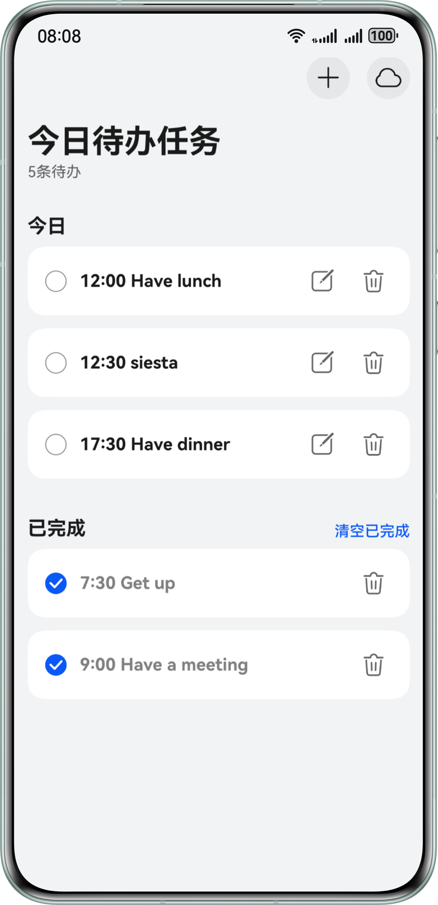
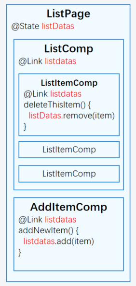
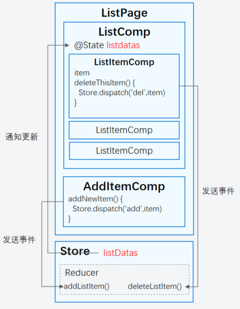
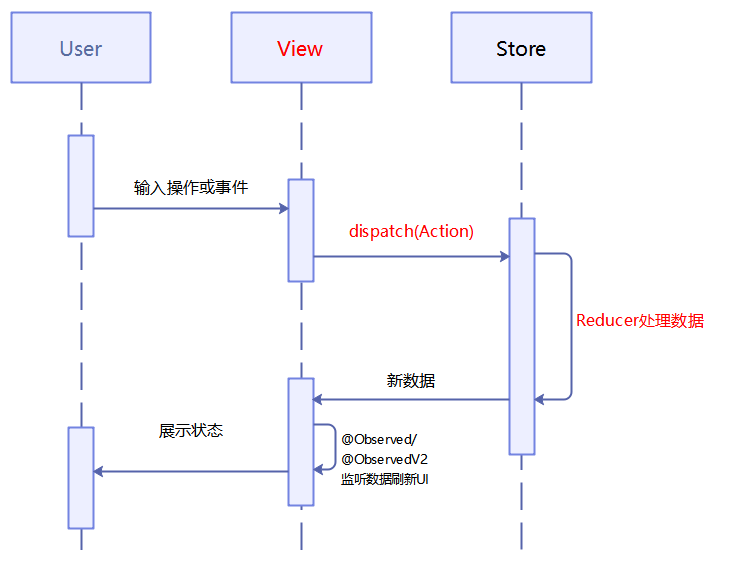
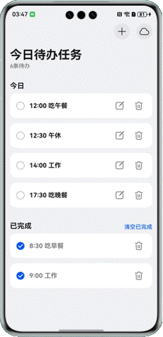
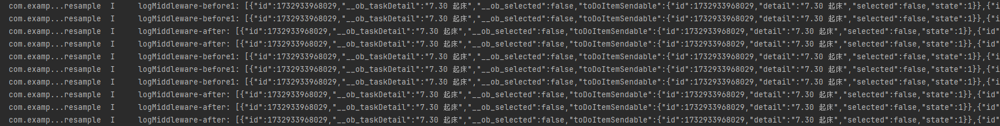
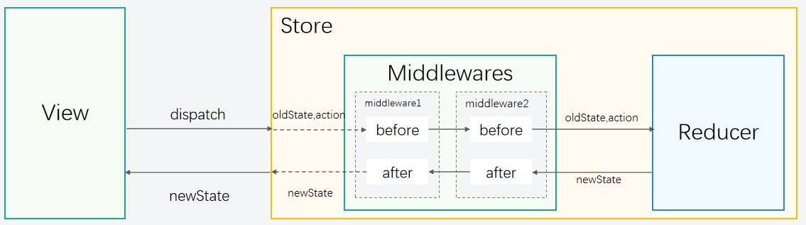

# 基于StateStore的全局状态管理

更新时间：2026-03-17 02:20:01

来源：https://developer.huawei.com/consumer/cn/doc/best-practices/bpta-global-state-management-state-store

## 概述


使用ArkUI开发页面时，多组件状态共享是我们经常会遇到的场景；ArkUI通过装饰器，例如@State+@Prop/@Link、@Provide+@Consume实现父子组件状态共享，但是这样会造成状态数据耦合。

作为ArkUI状态与UI解耦的解决方案，支持全局维护状态，优雅地解决状态共享的问题。让开发者在开发过程中实现状态与UI解耦，多个组件可以方便地共享和更新全局状态，将状态管理逻辑从组件逻辑中分离出来，简化维护。

StateStore提供了下列功能特性：

- 状态对象与UI解耦，支持状态全局化操作。
- 支持在子线程中进行状态对象更新。
- 支持状态更新执行的预处理和后处理。


## ArkUI状态管理现状


在多组件状态共享的场景中，我们常常遇到的问题是，当多个组件需要共享相同的状态时，必须通过它们的共同父组件来传递和维护这些状态数据。

例如，我们实现如下图待办列表的新增与删除功能。

图1 待办列表效果图





新增和删除功能按钮分别位于两个兄弟组件中。在开发时，父组件需要维护一个listDatas列表，并通过@Link装饰器实现数据的双向同步，从而实现兄弟组件之间的状态同步。删除功能和新增功能逻辑分别由两个子组件处理，但是这两个组件都需要引入与UI渲染无关的listDatas数据，造成了状态与UI的高耦合。使得状态管理变得复杂，难以维护和扩展。组件结构图如下：





引入StateStore库后，开发者可以将listDatas数据存储在全局仓库（Store）中，组件从Store中获取数据进行UI渲染，并通过向Store发送事件来更新数据。这样，状态更新逻辑被集中管理，组件无需额外引入状态进行逻辑处理，从而实现了状态与UI的低耦合。组件结构图如下：





## 实现原理


StateStore基于ArkUI的状态管理特性（@Observed和@ObservedV2）实现全局状态管理。统一由UI分发事件指令，状态管理仓库触发对应的状态更新逻辑，实现状态与UI解耦。

具体步骤如下

1. @ObservedV2装饰类实现数据监听

2. Store集中管理被观察对象

3. 状态变更通过装饰器触发UI更新

图2 运行原理图





核心概念解释


- View：视图层View构成了用户界面，它包含了丰富的页面UI组件，并响应用户操作。当用户和UI进行交互时，View会通过dispatch方法分发Action事件，从而触发状态更新的流程。
- Store：状态管理仓库Store作为状态管理的核心，主要向外部提供两个关键方法：getState()和dispatch(action)。getState()方法允许外部获取当前的状态信息，而dispatch(action)方法则用于接收并处理来自UI的Action事件。
- Reducer：状态刷新逻辑处理函数Reducer是一个专门负责状态刷新逻辑的函数。它会根据传入的Action事件指令，对状态进行更新。每一个Action事件都携带着特定的指令，Reducer会根据这些指令来精确地修改状态。
- Dispatch：事件分发方法Dispatch是UI侧与Store进行交互的桥梁，也是UI侧触发状态更新的唯一途径。UI侧通过调用Dispatch方法，将封装了事件类型的Action对象发送到Store，从而触发后续的状态更新流程。
- Action：事件描述对象Action是一个用于描述指示发生了何种事件的对象。它包含了两个重要的属性：type和payload。type属性用于标识事件的类型，而payload属性则携带了事件相关的具体数据。通过这两个属性，Action能够完整地描述一个事件，并引导Reducer进行状态更新。


UI刷新原理

数据改变刷新UI的能力依赖系统侧@Observed/@ObservedV2对数据的观测能力，StateStore不接管数据驱动UI更新。


> [!NOTE]
> 以上概念与基本使用参考[StateStore](https://gitcode.com/openharmony-sig/state_store)


## 开发步骤


1. **定义业务数据**开发者使用@Observed或@ObservedV2修饰业务数据，并生成实例对象。
2. **定义状态更新逻辑函数**开发者需要定义状态处理函数，该函数类型为Reducer。该函数负责根据业务逻辑来更新数据。
3. **创建状态管理仓库**为了集中管理状态更新，开发者使用StateStore.createStore方法来创建一个状态管理仓库（即Store对象）。在调用createStore方法时，需要传入业务数据的对象实例和业务逻辑函数，以便为Store对象绑定相应的**初始状态**和**Reducer**。
4. **组件UI的初始渲染**在组件内部，开发者通过调用Store对象的getState()方法来获取业务数据，并据此编写UI结构。这样，组件即可根据获取到的数据进行渲染。
5. **组件UI的刷新**创建Action事件对象这一步的目的是告诉store对象，你要做什么；例如，我们需要添加某个数据，则创建一个添加事件——AddAction。
6. UI触发事件事件定义好后，需要某个操作来触发事件，即我们在UI中通过dispatch(AddAction)发送该添加事件给store，接收到事件后会通知实际处理者——Reducer，根据接收到的AddAction事件处理对应的添加逻辑，修改状态数据。
7. UI刷新Reducer类型函数的逻辑被触发后，状态会随之更新。借助系统提供的@Observed或@ObservedV2装饰器的监听能力，UI能够与状态保持同步刷新。


## 使用StateStore实现状态与UI解耦


### 场景描述


在开发复杂应用时，状态与UI的强耦合常常导致代码臃肿、难以维护，尤其是在多个组件需要共享状态时，这种问题尤为突出。使用StateStore，开发者可以将状态管理逻辑完全从UI中抽离，实现状态的集中式管理和更新，进而简化代码结构、提高可维护性。

本节以备忘录应用为例，演示如何通过StateStore实现多个组件的状态共享与更新，同时保持UI层的纯粹性。

图3 效果图


### 开发步骤


1. 定义页面数据使用@ObservedV2定义页面需要的数据TodoList、TodoItem。
```ts
@ObservedV2
export class TodoStoreModel {
  @Trace todoList: TodoItemData[] = [];
  @Trace isShow: boolean = false;
  addTaskTextInputValue: string = '';
  // ...

  @Computed
  get uncompletedTodoList(): TodoItemData[] {
    return this.todoList.filter((item) => !item.selected);
  }

  @Computed
  get completedTodoList(): TodoItemData[] {
    return this.todoList.filter((item) => item.selected);
  }
}
```

```ts
@ObservedV2
export class TodoItemData {
  id: number = 0;
  @Trace taskDetail: string = '';
  @Trace selected?: boolean;
  // ...

  constructor(taskDetail: string, selected?: boolean, id?: number) {
    this.id = id ? id : Date.now();
    this.taskDetail = taskDetail;
    this.selected = selected;
    // ...
  }

  // ...
}
```
2. 创建状态管理仓库
- 定义状态更新事件类型Action
```ts
export default class TodoListActions {
  static getTodoList: Action = StateStore.createAction('getTodoList');
  static addTodoList: Action = StateStore.createAction('addTodoList');
  static deleteTodoItem: Action = StateStore.createAction('deleteTodoItem');
  static updateTaskDetail: Action = StateStore.createAction('updateTaskDetail');
  static completeTodoItem: Action = StateStore.createAction('completeTodoItem');
  // ...
}
```
- 定义状态处理函数TodoReducer
```ts
export const todoReducer: Reducer<TodoStoreModel> = (
  state: TodoStoreModel,
  action: Action,
) => {
  let GlobalContent = GlobalContext.getInstance();
  uiContext = GlobalContent.getUIContext();
  switch (action.type) {
    case TodoListActions.getTodoList.type:
      return async () => {
        state.todoList = (
          await RdbUtil.getInstance(uiContext?.getHostContext()!)
        ).query();
      };
    case TodoListActions.addTodoList.type:
      if (state.addTaskTextInputValue === '') {
        uiContext!
          .getPromptAction()
          .showToast({ message: $r('app.string.empty') });
        return null;
      }
      state.todoList.push(new TodoItemData(state.addTaskTextInputValue));
      state.isShow = false;
      state.addTaskTextInputValue = '';
      break;
    case TodoListActions.deleteTodoItem.type:
      // ...
      break;
    case TodoListActions.updateTaskDetail.type:
      // ...
      break;
    case TodoListActions.completeTodoItem.type:
      // ...
      break;
    // ...
  }
  return null;
};
```
- 创建状态管理仓库
```ts
export const TODO_LIST_STORE_ID = 'todoListStore';

export const TodoStore: Store<TodoStoreModel> = StateStore.createStore(
  TODO_LIST_STORE_ID,
  new TodoStoreModel(),
  todoReducer,
  [LogMiddleware],
);
```
3. 在UI中使用
- 通过getState()拿到Store中的状态数据。
- 使用dispatch()派发一个状态更新事件来刷新UI。

 如下例子中：Index组件内，通过getState()方法获取状态数据并绑定UI，通过dispatch触发GetTodoList事件获取全量数据并更新状态；TodoItem子组件中通过dispatch方法派发一个CompleteTodoItem事件来改变全局状态，将当前项设置为已完成。
```text
@Entry
@ComponentV2
struct Index {
@Local viewModel: TodoStoreModel = TodoStore.getState();
// ...
aboutToAppear(): void {
// The dispatch triggers a GetTodoList event to get the full data and update the status
TodoStore.dispatch(TodoListActions.getTodoList);
}

// ...
build() {
Column() {
// ...
if (this.viewModel.todoList.length > 0) {
List({ space: 12 }) {
if (this.viewModel.uncompletedTodoList.length > 0) {
ListItemGroup({ header: this.todayGroupHeader(), space: 12 }) {
ForEach(this.viewModel.uncompletedTodoList, (item: TodoItemData) => {
ListItem() {
TodoItem({ itemData: item });
};
}, (item: TodoItemData) => item.id.toString());
};
}
// ...
}.width('100%')
.height('100%')
.layoutWeight(1);

// ...
}
}
```

```ts
@ComponentV2
export struct TodoItem {
  @Param @Require itemData: TodoItemData;
  // ...

  build() {
    Row({ space: 8 }) {
      Checkbox({ name: 'checkbox1', group: 'checkboxGroup' })
      .select(this.itemData.selected)
      .shape(CheckBoxShape.CIRCLE)
      .onChange((_value) => {
        // The child component changes the global state by sending a CompleteTodoItem event through the dispatch method, setting the current item to complete
        TodoStore.dispatch(TodoListActions.completeTodoItem.setPayload({ id: this.itemData.id, value: _value }));
      });
      // ...
    }
    // ...
  }
}
```


通过StateStore库的使用，在UI上就没有任何状态更新逻辑，UI层面只需要关注界面描述和事件分发，保持了UI层的纯粹性。UI界面通过事件触发dispatch操作发送Action给Store来执行具体的逻辑，达到UI和状态解耦的效果。


## 子线程同步数据库


### 场景描述


在HarmonyOS开发中，子线程无法直接修改或者操作UI状态。这种限制导致子线程在完成复杂任务处理后，需要额外的逻辑将任务结果同步到主线程进行状态更新。

为了解决这一问题，StateStore提供了SendableAction机制，使开发者可以在子线程中采用与主线程一致的方式分发Action，无需关注状态更新逻辑。

在本节中，我们将通过在子线程中同步数据库的场景，介绍如何在子线程中发送状态更新事件。

图4 效果图





上图效果图中，用户点击同步数据库按钮，子线程去读写数据库，同时更新进度条。


### 开发步骤


1. 定义数据
```ts
@Sendable
export class ToDoItemSendable implements lang.ISendable {
  id: number;
  detail: string;
  selected: boolean;
  state: number;

  constructor(id: number, detail: string, selected: boolean = false) {
    this.id = id;
    this.selected = selected;
    this.detail = detail;
    this.state = 0;
  }
}
```
2. 定义子线程操作函数并发送SendableAction通过StateStore.createSendableAction方法定义一个sendableAction事件，它的作用与Action的作用一致，在子线程中需要使用taskpool的sendData发送一个sendableAction事件。 createSendableAction方法接受三个参数分别是：
- storeId: string，必选参数，用于描述当前的sendableAction事件需要操作的数据仓库。
- type: string，必选参数，用于描述当前的sendableAction的事件类型，需要在reducer中有对应的类型逻辑事件。
- payload?: ESObject，可选参数，事件的参数。
```ts
@Concurrent
async function concurrentUpdateProgress(context: Context, data: ToDoItemSendable[]): Promise<void> {
  try {
    let rdb = await RdbUtil.getInstance(context);
    const originalIds = rdb.getAllIds();
    const toAdd = data.filter(todo =>!originalIds.some(id => todo.id === id));
    const toUpdate = data.filter(todo => todo.state === 0 && originalIds.indexOf(todo.id) > -1);
    const toDelete = originalIds.filter(id =>!data.some(todo => todo.id === id));
    // send setTotal event to set the total number of progress bars
    taskpool.Task.sendData(StateStore.createSendableAction(TODO_LIST_STORE_ID, TodoListActions.setTotal.type,
    toAdd.length + toUpdate.length + toDelete.length));

    for (const todo of toAdd) {
      rdb.inset(todo);
      await sleep(500);
      // send the update progress bar event updateProgress
      taskpool.Task.sendData(StateStore.createSendableAction(TODO_LIST_STORE_ID, TodoListActions.updateProgress.type,
      todo.id));
    }
    // ...
  } catch (err) {
    console.error(`${err.message}\n${err.stack}`);
    return undefined;
  }
}
```
3. 主线程接收后触发dispatch修改状态数据主线程中使用onReceiveData接收sendData发送的sendableAction事件，然后调用StateStore.receiveSendableAction来执行这个事件通知reducer修改状态。
```ts
export async function syncDatabase() {
  try {
    const todos: TodoItemData[] = TodoStore.getState().todoList;
    const ToBeSynced = todos.map((item) => item.toDoItemSendable);
    let task: taskpool.Task = new taskpool.Task(
      concurrentUpdateProgress,
      uiContext?.getHostContext()!,
      ToBeSynced,
    );
    task.onReceiveData((data: SendableAction) => {
      // Use the receiveSendableAction method to trigger the Action sent by the child thread to refresh the state
      StateStore.receiveSendableAction(data);
    });
    await taskpool.execute(task);
    TodoStore.dispatch(TodoListActions.clearProgress);
  } catch (err) {
    console.error(`${err.message}\n${err.stack}`);
  }
}
```
4. Reducer定义数据操作逻辑
```ts
case TodoListActions.updateProgress.type:
let item = state.syncTodoList.find(item => item.id === action.payload);
item?.updateState(1);
state.progress.value++;
break;
case TodoListActions.setTotal.type:
state.syncTodoList = state.todoList.filter(item => item.state === 0);
state.progress.total = action.payload;
break;
```
5. UI渲染
```ts
@CustomDialog
export struct AsyncProgressBuilder {
  controller: CustomDialogController;
  // ...

  build() {
    Column() {
      // ...
      Progress({
        value: TodoStore.getState().progress.value,
        total: TodoStore.getState().progress.total,
        type: ProgressType.Linear
    }).style({ enableSmoothEffect: true })
      .width('100%')
      .height(24);
    }
    // ...
  }
}
```


## 状态更新日志埋点


### 场景描述


在状态管理过程中，复杂业务逻辑往往需要在状态更新前后插入额外的处理逻辑，例如记录状态更新日志、请求鉴权等。这些逻辑如果直接耦合在状态管理的核心流程中，会导致代码冗杂且难以维护。

为了解决这一问题，中间件应运而生。中间件是一种灵活的扩展机制，能够在Action分发到Reducer处理的流程中插入自定义逻辑，从而解耦通用功能和核心状态管理逻辑。

在本节中，我们将通过日志埋点场景，展示如何利用中间件优雅地扩展状态管理功能。

图5 日志效果图




图6 中间件执行流程图





### 开发步骤


1. 定义中间件开发者根据业务逻辑需要来实现beforeAction和afterAction两个钩子方法，分别在状态更新前后执行自定义逻辑。
```ts
export class MiddlewareInstance<T> extends Middleware<T> {
  beforeAction: MiddlewareFuncType<T>;
  afterAction: MiddlewareFuncType<T>;

  constructor(
    beforeAction: MiddlewareFuncType<T>,
    afterAction: MiddlewareFuncType<T>,
  ) {
    super();
    this.beforeAction = beforeAction;
    this.afterAction = afterAction;
  }
}

export const LogMiddleware = new MiddlewareInstance<TodoStoreModel>(
  (state: TodoStoreModel, action: Action) => {
    hilog.info(
      0x0000,
      'StateStoreSample',
      `logMiddleware-before1: ${JSON.stringify(state.todoList)}, ${action.type}`,
    );
    return MiddlewareStatus.NEXT;
  },
  (state: TodoStoreModel) => {
    hilog.info(
      0x0000,
      'StateStoreSample',
      `logMiddleware-after: ${JSON.stringify(state.todoList)}`,
    );
    return MiddlewareStatus.NEXT;
  },
);
```
2. 使用中间件
```ts
export const TODO_LIST_STORE_ID = 'todoListStore';

export const TodoStore: Store<TodoStoreModel> = StateStore.createStore(
  TODO_LIST_STORE_ID,
  new TodoStoreModel(),
  todoReducer,
  [LogMiddleware],
);
```


在Store中注册LogMiddleware后，所有状态更新逻辑执行前都会触发LogMiddleware的beforeAction 逻辑打印日志，状态更新逻辑执行后也会触发afterAction 逻辑打印日志。


## 示例代码


- [基于StateStore实现全局状态管理最佳实践](https://gitcode.com/harmonyos_samples/StateStore)
