# 状态管理最佳实践

更新时间：2026-05-18 00:55:31

来源：https://developer.huawei.com/consumer/cn/doc/best-practices/bpta-status-management

#### 概述
在声明式UI编程范式中，UI是应用程序状态的函数，应用程序状态的修改会更新相应的UI界面。ArkUI采用了[MVVM](https://developer.huawei.com/consumer/cn/doc/harmonyos-guides/arkts-mvvm)模式，其中ViewModel将数据与视图绑定在一起，更新数据的时候直接更新视图。如下图所示：
**图1 **ArkUI的MVVM模式

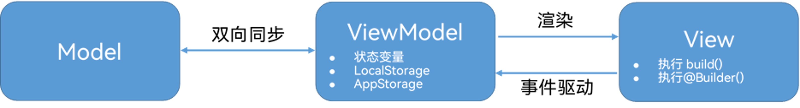
ArkUI提供了一系列装饰器实现ViewModel的能力，如[@Prop装饰器：父子单向同步](https://developer.huawei.com/consumer/cn/doc/harmonyos-guides/arkts-prop)、[@Link装饰器：父子双向同步](https://developer.huawei.com/consumer/cn/doc/harmonyos-guides/arkts-link)、[@Provide装饰器和@Consume装饰器：与后代组件双向同步](https://developer.huawei.com/consumer/cn/doc/harmonyos-guides/arkts-provide-and-consume)、[LocalStorage：页面级UI状态存储](https://developer.huawei.com/consumer/cn/doc/harmonyos-guides/arkts-localstorage)等。当自定义组件内变量被装饰器装饰时变为状态变量，状态变量的改变会引起UI的渲染刷新。
在ArkUI的开发过程中，如果没有选择合适的装饰器或合理的控制状态更新范围，可能会导致以下问题：
1. 状态和UI的不一致，如同一状态的界面元素展示的UI不同，或UI界面展示的不是最新的状态。
2. 非必要的UI视图刷新，如只修改局部组件状态时导致组件所在页面的整体刷新。
当用户与界面产生交互行为时，状态的修改是通过事件驱动处理的。事件的处理可以在应用的任何地方，如果没有进行适当的逻辑处理管理也会导致代码冗余和不利于维护。
本文旨在从装饰器的选择、使用以及状态的逻辑处理管理方面解决以上问题，以实现更好的状态管理。

#### 合理选择装饰器
#### 避免不必要的状态变量的使用
**删除冗余的状态变量标记**
状态变量的管理有一定的开销，应在合理场景使用，普通的变量用状态变量标记可能会导致性能劣化。
反例1

```ArkTS
@Observed
class Translate {
  translateX: number = 20;
}

@Component
struct MyComponent {
  @State translateObj: Translate = new Translate(); // The variable translateObj is not associated with any UI component and should not be defined as a state variable
  @State buttonMsg: string = 'I am button'; // The variable buttonMsg is not associated with any UI component and should not be defined as a state variable
  build() {
  }
}
```

以上示例中变量translateObj，buttonMsg没有关联任何UI组件，没有关联任何UI组件的状态变量不应该定义为状态变量，否则读写状态变量都会影响性能。

> [!NOTE] 说明
> 建议开发者优先使用Code Linter扫描工具进行代码检查，重点关注@performance/hp-arkui-remove-redundant-state-var规则。若扫描结果中出现该规则相关问题，可参考本章节提供的优化建议进行调整。

反例2

```ArkTS
@Observed
class Translate {
  translateX: number = 20;
}

@Component
struct MyComponent {
  @State translateObj: Translate = new Translate();
  @State buttonMsg: string = 'I am button';
  build() {
    Column() {
      Button(this.buttonMsg) // Here we just read the value of the variable buttonMsg, without any write operation.
    }
  }
}
```

以上示例中变量buttonMsg仅有读取操作，没有修改操作，未修改过的状态变量不应定义为状态变量，否则读状态变量会影响性能。

> [!NOTE] 说明
> 建议开发者优先使用Code Linter扫描工具进行代码检查，重点关注@performance/hp-arkui-remove-unchanged-state-var规则。若扫描结果中出现该规则相关问题，可参考本章节提供的优化建议进行调整。

正例

```ArkTS
@Observed
class Translate {
  translateX: number = 20;
}

@Component
struct UnnecessaryState1 {
  @State translateObj: Translate = new Translate(); // If there are both read and write operations and a Button component is associated with it, it is recommended to use state variables.
  buttonMsg = 'I am button'; // Only read the value of the variable buttonMsg, without any write operations, just use the general variables directly
  build() {
    Column() {
      Button(this.buttonMsg)
        .onClick(() => {
          this.getUIContext().animateTo({
            duration: 50
          }, () => {
            this.translateObj.translateX = (this.translateObj.translateX + 50) % 150; // Reassign value to variable translateObj when clicked.
          })
        })
    }
    .translate({
      x: this.translateObj.translateX // Retrieve the value in translateObj.
    })
  }
}
```

在代码中，buttonMsg变量因仅用于读取操作而被定义为普通成员变量，而translateObj变量则因需要根据用户事件改变其x值以驱动动画效果，故被定义为状态变量，并实时更新UI以显示动画。
**建议使用临时变量替换状态变量**
状态变量发生变化时，ArkUI会查询依赖该状态变量的组件并执行依赖该状态变量的组件的更新方法，完成组件渲染的行为。通过使用临时变量的计算代替直接操作状态变量，可以使ArkUI仅在最后一次状态变量变更时查询并渲染组件，减少不必要的行为，从而提高应用性能。状态变量行为可参考[@State装饰器：组件内状态](https://developer.huawei.com/consumer/cn/doc/harmonyos-guides/arkts-state)。
反例

```ArkTS
@Component
struct Index {
  @State message: string = '';
  // Define methods for changing state variables (multiple modifications of state variables)
  appendMsg(newMsg: string) {
    this.message += newMsg;
    this.message += ';';
    this.message += '<br/>';
  }
  build() {
    Column() {
      Button('Click Print Log')
        .onClick(() => {
          this.appendMsg('Operational state variables'); // Calling encapsulated methods for changing state variables
        })
        .width('90%')
        .backgroundColor(Color.Blue)
        .fontColor(Color.White)
        .margin({ top: 10})
    }
    .justifyContent(FlexAlign.Start)
    .alignItems(HorizontalAlign.Center)
    .margin({  top: 15 })
  }
}
```

正例

```ArkTS
@Entry
@Component
struct UnnecessaryState2 {
  @State message: string = '';
  // Define methods for changing state variables (intermediate variables are manipulated during method execution, state variables are modified only once)
  appendMsg(newMsg: string) {
    let message = this.message;
    message += newMsg;
    message += ';';
    message += '<br/>';
    this.message = message;
  }
  build() {
    Column() {
      Button('Click Print Log')
        .onClick(() => {
          this.appendMsg('Manipulating Temporary Variables'); // Calling encapsulated methods for changing state variables
        })
        .width('90%')
        .backgroundColor(Color.Blue)
        .fontColor(Color.White)
        .margin({ top: 10 })
    }
    .justifyContent(FlexAlign.Start)
    .alignItems(HorizontalAlign.Center)
    .margin({ top: 15 })
  }
}
```

#### 最小化状态共享范围
在没有强烈的业务需求下，尽可能按照状态需要共享的最小范围选择合适的装饰器。应用开发过程中，按照组件颗粒度，状态一般分为组件内独享的状态和组件间需要共享的状态。
**组件内独享的状态**
组件内独享的状态的生命周期和组件同步，状态的定义和更新都在组件内，组件销毁，状态也随即消失。常见于界面UI元素数据，比如当前按钮是否可用、文字是否高亮等。组件内独享的状态使用[@State装饰器](https://developer.huawei.com/consumer/cn/doc/harmonyos-guides/arkts-state)，被@State装饰器修饰后状态的修改只会触发当前组件实例的重新渲染。如下图主题列表上单个主题组件内使用@State修饰主题是否被选中的变量，当在界面点击主题时在组件内直接修改状态值。此时，只有当前主题的组件实例会重新渲染，其他主题组件不会重新渲染。
**图2 **HMOS世界App主题选择交互图

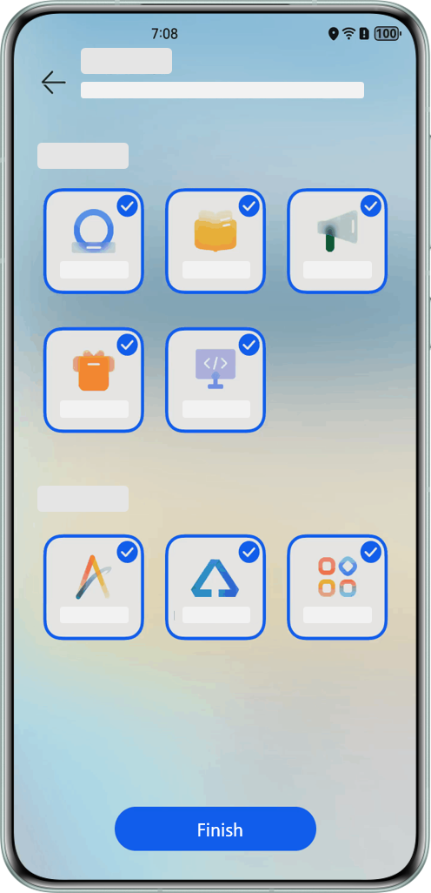
**组件间需要共享的状态**
组件间需要共享的状态，按照共享范围从小到大依次有三种场景：父子组件间共享状态，不同子树上组件间共享状态和不同组件树间共享状态。
- 父子组件间共享状态：如下图，”父组件”和其子组件”子组件A”、”子组件B”共享状态loading。图3 父子组件间共享状态场景
- 不同子树上组件间共享状态：如下图，祖先组件的左子树上”孙子组件AAA”和右子树上”孙子组件BAA”共享状态loading。图4 不同子树上组件间状态共享场景
- 不同组件树间共享状态：如下图，组件树A内”子组件AA”和组件树B内”孙子组件BAA”共享状态loading。图5 不同组件树间共享状态的场景
对于上述三种场景，ArkUI提供了[@State+@Prop](https://developer.huawei.com/consumer/cn/doc/harmonyos-guides/arkts-prop#父组件state到子组件prop简单数据类型同步)、[@State+@Link](https://developer.huawei.com/consumer/cn/doc/harmonyos-guides/arkts-link#简单类型和类对象类型的link)、[@State+@Observed+@ObjectLink](https://developer.huawei.com/consumer/cn/doc/harmonyos-guides/arkts-observed-and-objectlink)、[@Provide+@Consume](https://developer.huawei.com/consumer/cn/doc/harmonyos-guides/arkts-provide-and-consume)、[AppStorage](https://developer.huawei.com/consumer/cn/doc/harmonyos-guides/arkts-appstorage)、[LocalStorage](https://developer.huawei.com/consumer/cn/doc/harmonyos-guides/arkts-localstorage)六种装饰器组合以解决不同范围内的组件间状态共享。按照共享范围能力从小到大，各装饰器组合的共享范围能力和生命周期如下：
1. @State+@Prop、@State+@Link、@State+@Observed+@ObjectLink：三者的共享范围为从@State所在的组件开始，到@Prop/@Link/@ObjectLink所在组件的整条路径，路径上所有的中间组件通过@Prop/@Link/@ObjectLink都可以共享同一个状态。@State修饰的状态和其所属的自定义组件共享生命周期，在组件内定义时创建，组件销毁时被回收。@Link装饰的变量和其所属的自定义组件共享生命周期。@ObjectLink装饰的变量和其所属的自定义组件共享生命周期。
2. @Provide+@Consume：状态共享范围是以@Provide所在组件为祖先节点的整棵子树，子树上的任意后代组件通过@Consume都可以共享同一个状态。@Provide修饰的变量与其所属的组件绑定，在组件内定义时被创建，在组件销毁时被回收。
3. LocalStorage：共享范围为[UIAbility](https://developer.huawei.com/consumer/cn/doc/harmonyos-guides/uiability-overview)内以页面为单位的不同组件树间的共享。存储在LocalStorage中的状态的生命周期与LocalStorage绑定。LocalStorage的生命周期由应用程序决定，当应用释放最后一个指向LocalStorage的引用时，LocalStorage被垃圾回收。
4. AppStorage：共享范围是应用全局。AppStorage与应用的进程绑定，由UI框架在应用程序启动时创建，当应用进程终止，AppStorage被回收。
按照软件开发原则，应优先选择共享范围能力小的装饰器方案，减少不必要的参数层层传递，降低不同模块间的数据耦合，便于状态及时回收。建议选择装饰器的优先级为：@State+@Prop、@State+@Link、@State+@Observed+@ObjectLink > @Provide+@Consume > LocalStorage > AppStorage。

#### 减少不必要的参数层层传递
当按照上述优先级选择装饰器时，由于@State+@Prop、@State+@Link、@State+@Observed+@ObjectLink三种方案的实现方式是逐级向下传递状态，当共享状态的组件间层级相差较大时，会出现状态层层传递的现象。对于状态传递过程中途经的全部组件，都需要增加入参接收该状态再将状态传递给子组件。对于没有使用该状态的中间组件而言，这是“额外的消耗”，不利于代码的维护和拓展。尤其是当业务体系庞大时，需求变更容易出现“牵一发而动全身”的问题。
以“[HMOS世界App](https://gitcode.com/harmonyos_samples/hmosworld)”中路由状态为例，其“探索”Tab和“我的”Tab界面组件如下：
**图6 **HMOS世界App界面组件示意图

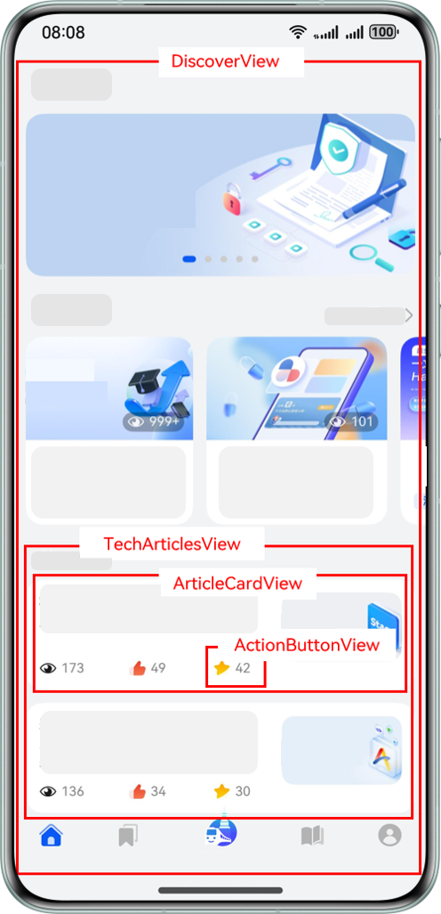
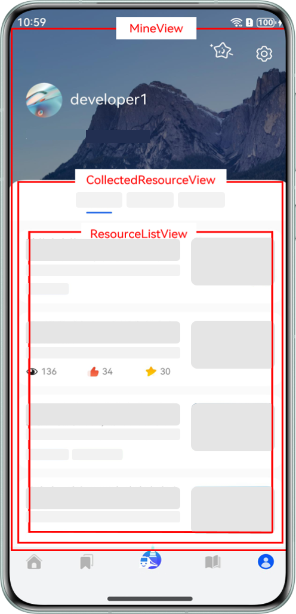
- “MainPage”是主页面，该页面有2个子组件“MineView”和“DiscoverView”。
- “MineView”是“我的”Tab对应的内容视图组件，“CollectedResourceView”是该组件内展示收藏列表的视图组件，“ResourceListView”是“CollectedResourceView”的子组件。
- “DiscoverView”是“探索”Tab对应的内容视图组件，“TechArticlesView”是该组件内展示文章列表的视图组件，“ArticleCardView”是列表上单个卡片视图组件，“ActionButtonView”是卡片上交互视图组件。
项目中使用[Navigation组件](https://developer.huawei.com/consumer/cn/doc/harmonyos-guides/arkts-navigation-navigation)管理路由，定义“appNavigationStack”变量表示应用当前的路由信息。现“DiscoverView”组件和“ResourceListView”组件需要共享路由信息状态。按照@State+@Prop层层传递的方案，当前各组件的设计如下：
**图7 **@State+@Prop当前组件设计图

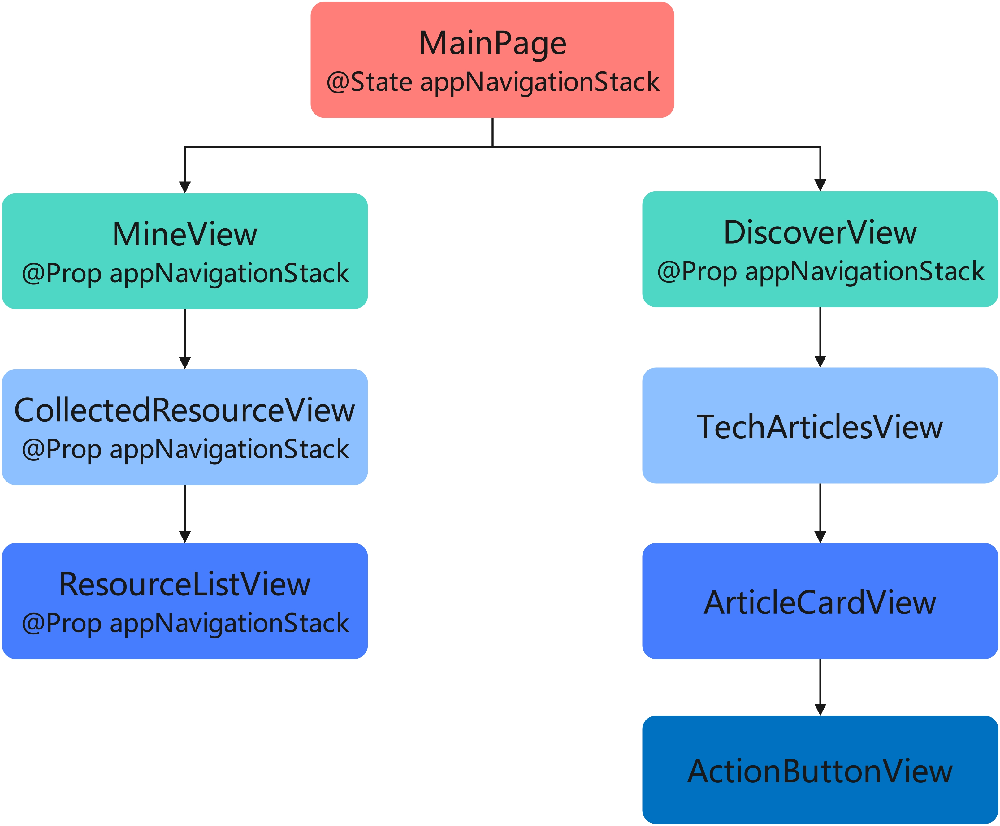
可以看到，为了实现“ResourceListView”组件和“DiscoverView”组件共享状态，将状态定义在两者的最近公共祖先“MainPage”组件上。对公共祖先到两个需要共享路由状态的组件路径上的所有组件使用@Prop装饰器接收“appNavigationStack”参数，层层传递，直到两个需要共享状态的组件。
若此时产品需要新增功能，该功能要求在“DiscoverView”组件的后代“ActionButtonView”组件上新增对路由信息的判断逻辑。此时开发者需修改上述各个组件设计如下图所示：
**图8 **@State+@Prop新增功能后组件设计图

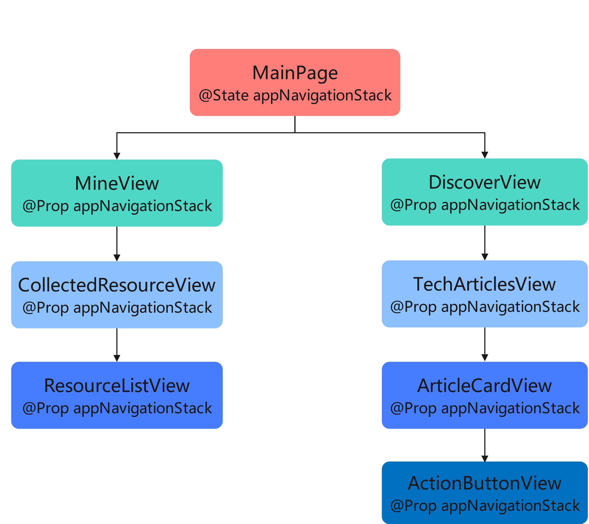
可以看到，新功能的逻辑原本只是在“ActionButtonView”这一个组件中使用，开发者却需要修改从“DiscoverView”组件到“ActionButtonView”组件路径上3个组件的结构。若当业务后续再次变更为无需使用该状态时，也同样需要修改多个组件。这显然不是很好的实现方案。
此时使用@Provide+@Consume方案更为合理。同样是“ResourceListView”组件和“DiscoverView”组件共享状态，此方案各组件设计如下：
**图9 **使用@Provide+@Consume方式当前各组件设计

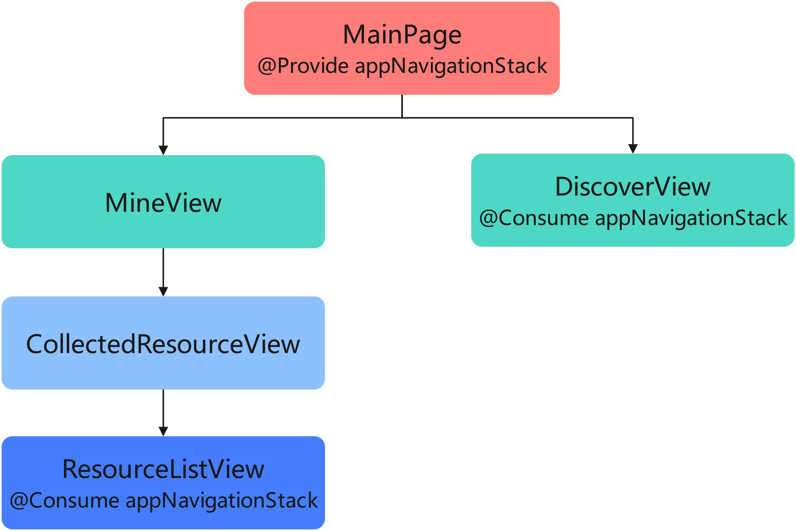
通过在最顶部组件“MainPage”中注入key值为“appNavigationStack”的路由信息状态，其后代组件均可以通过@Consume装饰器获取该状态值。当业务变动需要“DiscoverView”的后代“ActionButtonView”组件也共享路由信息时，此方案只需在组件“ActionButtonView”上使用@Consume装饰器直接获取路由信息状态，而无需修改其他组件。此时各组件设计如下：
**图10 **使用@Provide+@Consume方式业务变动后各组件设计

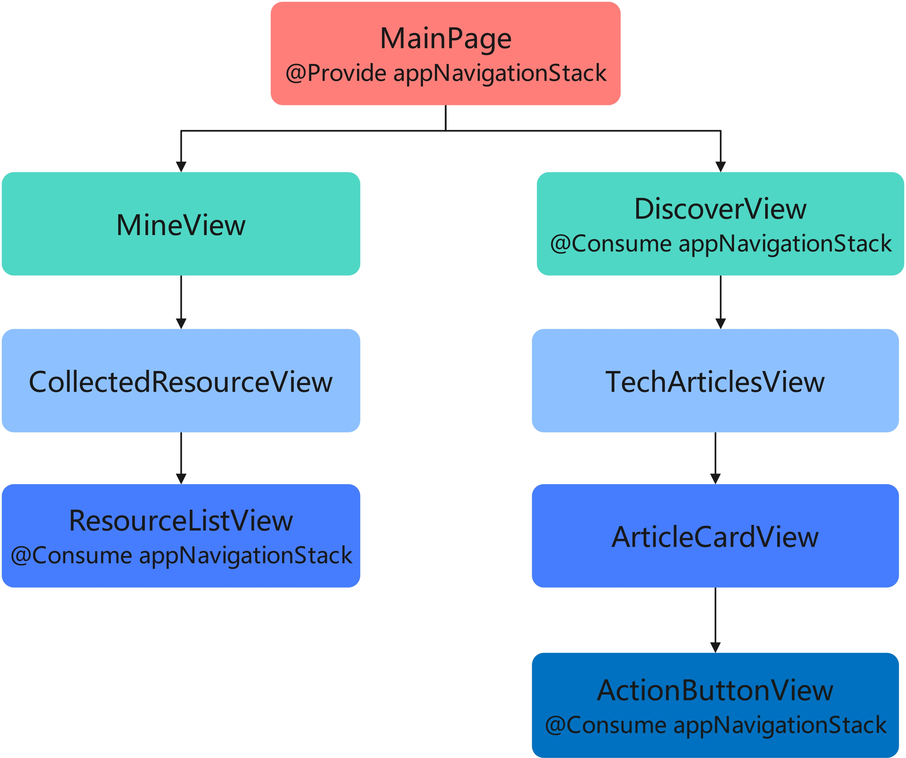
因此当共享状态的组件间跨层级较深时，或共享的信息对于整个组件树是“全局”的存在时，选择@Provide+@Consume的装饰器组合代替层层传递的方式，能够提升代码的可维护性和可拓展性。

#### 按照状态复杂度选择装饰器
对于上述具有相同优先级的装饰器选择方案@State+@Prop、@State+@Link和@State+@Observed+@ObjectLink。在选择方案时，需要结合具体的业务场景和状态数据结构的复杂度。这三种不同的装饰器组合方案在内存消耗、性能消耗和对数据类型的支持能力都不相同，如下：
**图11 **@State+@Prop、@State+@Link和@State+@Observed+@ObjectLink装饰器方案区别

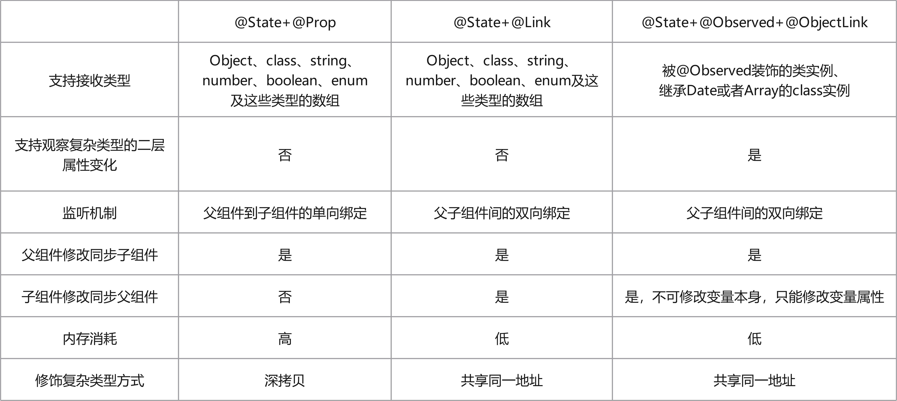
1. @State+@Prop组合方案：@Prop装饰器支持接收Object、class、string、number、boolean、enum类型，以及这些类型的数组。@Prop装饰的变量是对父组件传入状态值的深拷贝，当@Prop装饰器装饰的变量为复杂Object、class或其类型数组时，会增加状态创建时间以及占用大量内存。@Prop装饰的变量和父组件是单向绑定的关系。当父组件数据源发生变化时，接收该数据源的@Prop所在组件的实例会重新渲染。 当该组件内被@Prop装饰的变量被修改时，父组件数据源不会变化，父组件实例也不会重新渲染。
2. @State+@Link组合方案：@Link装饰器支持接收Object、class、string、number、boolean、enum类型，以及这些类型的数组。@Link装饰器修饰的变量是对父组件传入状态的引用的拷贝，两者指向同一个地址。当状态是简单数据类型或简单Object类型时，@Link和@Prop在状态创建时间和内存的占用方面区别不大。当状态为复杂的Object、class或其类型数组时，@Link相较@Prop能明显减少状态创建时间和内存的占用。@Link装饰器的变量和父组件是双向绑定的关系。当父组件数据源发生变化时，接收该数据源的@Link所在组件的实例会重新渲染。 当该组件内被@Link装饰的变量被修改时，父组件数据源会同步修改，父组件实例也会重新渲染。
3. @State+@Observed+@ObjectLink组合方案：@ObjectLink只支持接收被@Observed装饰的class实例及继承Date或者Array的class实例。@ObjectLink装饰的变量是只读的，不支持对状态重新赋值。@ObjectLink必须配合@Observed使用，它的设计是为了解决对嵌套类对象属性变化的监听，如需要观察对象数组中单个数据项的属性值变化，或嵌套对象的对象类型属性的子属性变化。
结合三个方案的特性，在选择时有如下建议：
- 需要观察嵌套类对象的深层属性变化的场景，选择@State+@Observed+@ObjectLink。
- 状态是复杂对象、类或其类型数组的场景，选择@State+@Link。
- 状态是简单数据类型时，使用@State+@Link和@State+@Prop均可。在功能层面上，依据@Prop单向绑定的特性，@State+@Prop适合用于非实时修改的场景，如编辑电话簿联系人信息时，展示编辑界面的子组件信息的修改要求不实时同步回父组件，需要等到编辑完成后点击“确认”按钮时才会以事件驱动的方式修改父组件的状态。依据@Link双向绑定的特性，@State+@Link适合用于实时修改的场景，如组件嵌套时的滚动条同步。

#### 总结
在实际开发中，合理选择装饰器主要包含以下三步：
1.首先根据状态需要共享的范围大小，尽量选择共享能力小的装饰器方案，优先级依次为@State+@Prop、@State+@Link或@State+@Observed+@ObjectLink > @Provide+@Consume > LocalStorage > AppStorage。
2.当共享的状态的组件间层级相差较大时，为避免较差的代码可扩展性和可维护性，@Provide+@Consume的方案要优于层层传递的共享方案。
3.对于具有相同优先级的@State+@Prop、@State+@Link或@State+@Observed+@ObjectLink 三个方案，应结合状态的复杂程度和装饰器各自的特性选择。
实际开发中，应根据业务需求衡量优先级选择合适的装饰器，整体可参考如下建议：
1. @State+@Prop：适合状态结构简单，且共享状态的组件间层级相差不大的场景。或功能上要求子组件不实时同步修改给父组件的场景。
2. @State+@Link：适合状态结构复杂，且共享状态的组件间层级相差不大的场景。或功能上要求子组件对状态的修改实时同步给父组件的场景。
3. @State+@Observed+@ObjectLink：适合需要观察嵌套类对象的子属性变化的场景或对象数组的数据项属性变化的场景，如监听列表卡片上某个属性的变化。
4. @Provide+@Consume：适合用于对于整个组件树而言“全局”的状态，且该状态改动不频繁的状态共享场景，如共享界面的路由信息。
5. AppStorage：适合对于整个应用而言“全局”的变量或应用的[主线程](https://developer.huawei.com/consumer/cn/doc/harmonyos-guides/thread-model-stage)内多个UIAbility实例间的状态共享，如用户信息。
6. LocalStorage：适合对于单个Ability而言“全局”的变量，主要用于不同页面间的状态共享场景。

#### 精细化拆分复杂状态
对于AppStorage的使用，由于其作用范围最广，开发者为了方便开发容易将各种状态存入其中以达到共享的目的，这通常会造成大量的性能损失。
这是因为，在ArkUI中状态的修改刷新是粗颗粒的。使用装饰器修饰对象类型状态时，ArkUI能监听到对象本身值的变化以及对象的属性值的变化。当对象属性值发生变化后，ArkUI会以整个对象颗粒度通知所有使用了该状态的组件重新渲染，而不是按属性颗粒度大小通知使用了该变化属性的组件重新渲染。
对AppStorage的使用，以“HMOS世界App”中共享用户信息和用户收藏信息为例，描述如何拆分状态存储。用户信息和用户收藏信息涉及的模块和界面展示如下：
**图12 **“HMOS世界App”中点赞高亮状态和用户信息组件视图

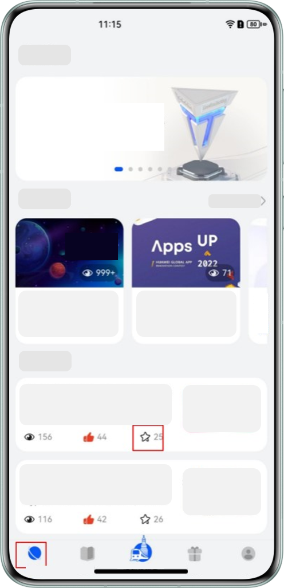
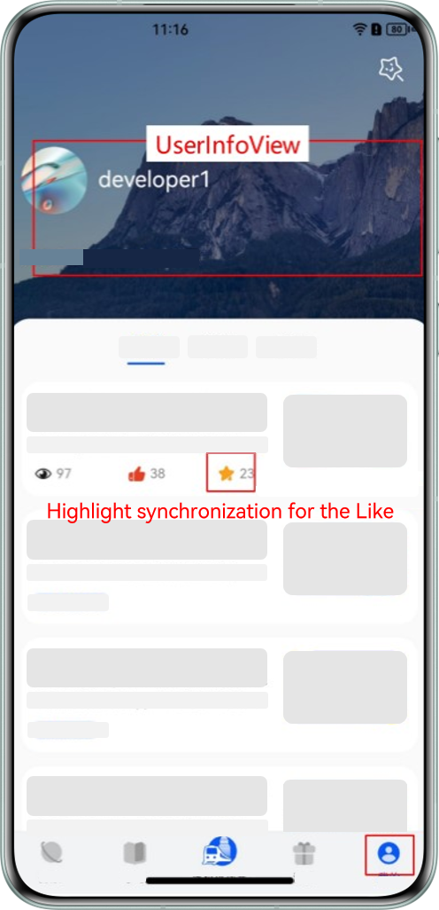
- “我的”模块顶部有展示用户信息的组件“UserInfoView”，底部有展示用户收藏列表，列表卡片上需要高亮展示用户是否点赞了当前文章。
- “探索”模块首页展示技术文章列表，列表卡片上同样需要展示用户是否点赞了当前文章。
- 当两个模块中任一模块的卡片有点赞交互时，需要同步用户是否对文章点赞的状态给另一个模块。
当前项目中已经使用AppStorage存储用户信息UserData，UserData的数据结构和“UserInfoView”组件使用UserData状态展示用户信息的代码如下：

```ArkTS
// Data structure of user information UserData
export interface UserData {
  id: string;
  username: string;
  description: string;
  // ...
}
// ...
  // Getting server-side user information in a business class
  getUserData(): void {
    this.userAccountRepository.getUserData().then((data: UserData) => {
      // 1.Storing user information data into AppStorage
      AppStorage.setOrCreate('userData', data);
    });
  }
  // ...
// View component for displaying user information at the top of the “My” module
@Component
struct UserInfoView {
  // 2.Receive user information stored in AppStorage using @StorageLink decorator in UI
  @StorageLink('userData') userData: UserData | null = null;
  build() {
    Column() {
      Row() {
        // ...
        Column() {
          // 3.Display the user name in the userData.
          Text(this.userData ? this.userData.username : 'default_login')
          // ...
        }
      }
      // ...
    }
    // ...
  }
}
```

现在“探索“模块和“我的“模块需要共享用户的收藏列表信息，只需要共享收藏的文章id数组即可。不同模块间的状态共享考虑将其也存储在AppStorage中，有如下两种存储方案：
1. 收藏信息也是用户信息的一部分，将收藏信息作为用户信息userData的一个属性，存储在当前AppStorage里key值为“userData”的变量上。
2. 收藏信息单独存入AppStorage中，不与用户信息userData绑定。
第一种方案的代码实现如下：

```ArkTS
export interface UserData {
  id: string;
  username: string;
  description: string;

  // 1. Add a list of resources in the user's collection on the user information UserData id Information Type Definition
  collectedIds: string[];
  // ...
}
// ...
  // Getting server-side user information in a business class
  getUserData(): void {
    this.userAccountRepository.getUserData().then((data: UserData) => {
      // 2.Storing user information data into AppStorage
      AppStorage.setOrCreate('userData', data);
    })
  }
  // ...

// Article card component of the Explore module
@Component
export struct ArticleCardView {
  // 3.Get the user information object userData on the ExploreArticleList card with the @StorageLink decorator
  @StorageLink('userData') userData: UserData | null = null;
  @Prop articleItem: LearningResource = new LearningResource();

  // 4.Calculate whether the current article is favorite or not according to the favorite information array
  isCollected(): boolean {
    return !!this.userData && this.userData.collectedIds.some((id: string) => id === this.articleItem.id);
  }

  // 7.Handling interface like interaction logic: when the userData state sub-property collectedIds received using the @StorageLink decorator is modified, the new value is synchronized to AppStorage
  handleCollected(): void {
    // ...
    const index = this.userData?.collectedIds.findIndex((id: string) => id === this.articleItem.id) as number;
    if (index === -1) {
      this.userData?.collectedIds.push(resourceId);
    } else {
      this.userData?.collectedIds.splice(index, 1);
    }
    // ...
  }

  build() {
    ActionButtonView({
      // 5.Determine whether the favorite icon is highlighted according to whether the current article has been favorited by the user or not
      imgResource: this.isCollected() ? $r('app.media.icon') : $r('app.media.icon'),
      count: this.articleItem.collectionCount,
      textWidth: 77
    })
      .onClick(() => {
        // 6.When the user clicks on the favorites icon, the function that handles changes to the status of the favorites is called
        this.handleCollected();
      })
  }
}
```

这种实现方案下，当用户在“UserInfoView ”组件上重新修改用户描述信息userData.description属性值时，属性值变化将同步回AppStorage中。ArkUI监听到AppStorage中key值为“userData”的值变化，随后通知所有使用了AppStorage中key值为“userData”的组件重新渲染。
在上述界面中，“我的“模块中展示用户信息的组件“UserInfoView ”会重新渲染。由于“探索”模块的文章卡片组件ArticleCardView 通过@StorageLink装饰器绑定了AppStorage中key值为“userData”的变量，所有的文章卡片组件也都会重新渲染。而这些组件与用户描述信息无关，不应该被描述信息的修改变化影响，从而导致渲染刷新。
改为使用上述第二种方案实现，代码如下：

```ArkTS
  // Getting user information in a business class
  getUserData(): void {
    this.userAccountRepository.getUserData().then((data: UserData) => {
      //1.Separate storage of user collection information data in AppStorage
      AppStorage.setOrCreate('collectedIds', data.collectedIds);
      AppStorage.setOrCreate('userData', data);
    })
  }
// Article card component of the Explore module
@Component
export struct ArticleCardView {
  // 2.Getting collection information stored in AppStorage via @StorageLink decorator
  @StorageLink('collectedIds') collectedIds: string[] = [];
  @Prop articleItem: LearningResource = new LearningResource();
  // 3.Calculate whether the current article is favorite or not according to the favorite information array
  isCollected(): boolean {
    return this.collectedIds.some((id: string) => id === this.articleItem.id);
  }
  // 6.Handling interface like interaction logic: when the state collectedIds received using the @StorageLink decorator are modified, the new values are synchronized to AppStorage
  handleCollected(): void {
    // ...
    const index = this.collectedIds.findIndex((id: string) => id === this.articleItem.id);
    if (index === -1) {
      this.collectedIds.push(resourceId);
    } else {
      this.collectedIds.splice(index, 1);
    }
    // ...
  }
  build(){
    ActionButtonView({
      // 4.Determine whether the favorite icon is highlighted according to whether the current article has been favorited by the user or not
      imgResource: this.isCollected() ? $r('app.media.icon') : $r('app.media.icon'),
      count: this.articleItem.collectionCount,
      textWidth: 77
    })
      .onClick(() => {
        // 5.When the user clicks on the favorites icon, the function that handles changes to the status of the favorites is called
        this.handleCollected();
      })
  }
}
```

在此方案中，由于文章卡片组件没有绑定AppStorage中key值为“userData”的变量，当用户编辑修改了用户描述userData.description的值时， 文章卡片组件不会重新渲染。
并且，当用户点击文章卡片上的收藏按钮修改文章收藏状态时，变化同步回AppStorage中的key值为“collectedIds”的变量。ArkUI监听到AppStorage中key值为“collectedIds”的值变化，只会通知所有绑定了AppStorage中key值为“collectedIds”变量的组件重新渲染，不会造成“我的“模块用户信息组件“UserInfoView ”重新渲染。
因此，从性能的角度考虑，在使用LocalStorage或AppStorage装饰器存储状态变量时需要合理设计状态的数据结构，避免无意义的渲染刷新。

> [!NOTE] 说明
> 过分追求状态结构拆分可能在某些场景导致组件设计过度，不利于维护。此时，可以将对象或类上经常一起改变的几个属性聚合成一个新的对象或类模型，并使用@Observed装饰器修饰，再作为属性挂载到之前的对象或类上。通过此方法，当属性变化时ArkUI只会通知变化给新的对象或类，不会通知最上层的对象。这样既可以有效的减少无用渲染次数，又能使代码更好维护。 如类ClassA上存在属性b、c、d。其中c和d经常一起发生变化，即当c的状态修改时同时也要修改d的状态。 class ClassA{
  b: string;
  c: number;
  d: boolean;
} 此时，将c和d组合在一起做为新的类ClassE的属性并使用@Observed装饰器修饰。对于ClassA去掉c、d属性，新增属性e且其类型为ClassE，设计如下： class ClassA{
  b: string;
  e: ClassE;
}

@Observed
class ClassE{
  c: number;
  d: boolean;
} 使用此方案，在AppStorage中存入数据结构为ClassA的变量。当ClassA实例的属性e中的属性c的值变化时，ArkUI框架会通知使用ClassE实例的组件重新渲染，不会通知所有使用AppStorage中ClassA实例的组件更新，即只使用了ClassA实例b属性的组件不会重新渲染。

#### 集中化状态修改逻辑
在使用@Link装饰器时，开发者可以直接在@Link装饰器接收状态的组件内部修改状态。当多个子组件修改状态的逻辑基本相同时，建议将状态的修改集中到单个函数中，以提升逻辑的可复用性、代码的可维护性和可测试性。
如在“HMOS世界App”的探索模块首页上点击资讯卡片、文章卡片或顶部轮播图时，都会跳转到详情页，交互效果如下：
**图13 **“HMOS世界App”的探索模块首页上各组件跳转详情页交互

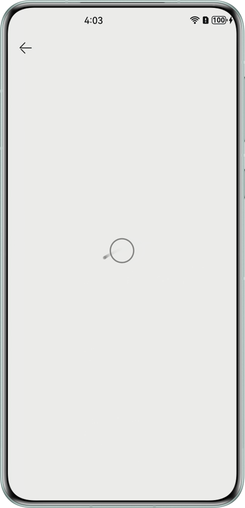
上述的三个组件共享全局路由信息，当发生界面点击交互时，三个组件的逻辑均为根据设备信息修改路由状态实现跳转到详情页。将三个组件处理跳转的逻辑集中到父组件上处理。实现代码如下：

```ArkTS
@Component
export struct DiscoverView {
  private jumpList = () => {
  }
  @State hotFeedList: never[] = [];
  @State articlesDataSource: never[] = [];
  @State discoverModel: GeneratedTypeLiteralInterface_1 = { swiperData: [] };
  // 1.Getting shared state related to jump logic
  @Consume('appPathStack') appPathStack: NavPathStack;
  @Consume('discoverPathStack') discoverPathStack: NavPathStack;
  @StorageProp('currentBreakpoint') currentBreakpoint: string = 'BreakpointTypeEnum.MD';

  // 5.Centralize the jump processing logic of the 3 components in the parent component
  jumpDetail(item: LearningResource): void {
    if (this.currentBreakpoint === 'BreakpointTypeEnum.LG') {
      this.discoverPathStack.pushPathByName('articleDetail', item);
    } else {
      this.appPathStack.pushPathByName('articleDetail', item);
    }
  }

  build() {
    Column() {
      List() {
        ListItem() {
          BannerView({
            swiperData: this.discoverModel.swiperData,
            // 2.The top rotator component passes in the parent component's logic handler function
            handleClick: (item: LearningResource) => this.jumpDetail(item)
          })
        }
        ListItem() {
          Column({ space: CommonConstants.SPACE_12 }) {
            HotFeedsView({
              hotFeedList: this.hotFeedList,
              showMore: this.jumpList,
              // 3.Information list component passes in the logic handler function of the parent component
              handleClick: (item: LearningResource) => this.jumpDetail(item)
            })
            TechArticlesView({
              articlesDataSource: this.articlesDataSource,
              // 4.Logic handler function passed to parent component by technical article component
              handleClick: (item: LearningResource) => this.jumpDetail(item)
            })
          }
        }
      }
    }
  }
}

@Component
struct BannerView {
  @Prop swiperData: LearningResource[] = [];
  private swiperController: SwiperController = new SwiperController();
  // 6.The rotatoire component receives the logic handler passed to it by the parent component.
  handleClick: (item: LearningResource) => void = () => {
  };

  build() {
    Swiper(this.swiperController) {
      ForEach(this.swiperData, (item: LearningResource) => {
        Row() {
          // $r('app.media.icon') needs to be replaced with the resource file required by the developer
          Image($r('app.media.icon'))
            .width(55)
            .height(55)
            // Set the border radius to 5vp
            .borderRadius($r('app.float.component_radius'))
            //  7.When clicking on an image, call the received function to process the logic
            .onClick(() => this.handleClick(item))
        }
        // ...
      }, (item: LearningResource) => item.id)
    }
    // ...
  }
}
```

可以看到，通过将子组件的相似逻辑提升到父组件中集中处理，相同的逻辑代码只需要写一份。否则，上述代码需要在“BannerView ”、“HotFeedsView”、“TechArticlesView”三个组件各写一份跳转逻辑处理代码。当业务逻辑变动时，也只需修改单个函数“jumpDetail”。在开发中，除了界面逻辑可以集中在界面处理，业务逻辑也可以抽取成单个文件集中处理，解耦UI与数据便于逻辑复用。适当的对逻辑进行集中处理，能有效提升代码的可维护性和可复用性。

#### 使用监听和订阅精准控制组件刷新
多个组件依赖对象中的不同属性时，直接关联该对象会出现改变任一属性所有组件都刷新的现象，可以通过将类中的属性拆分组合成新类的方式精准控制组件刷新。
在多个组件依赖同一个数据源并根据数据源变化刷新组件的情况下，直接关联数据源会导致每次数据源改变都刷新所有组件。为精准控制组件刷新，可以采取以下策略。

#### 使用 @Watch 装饰器监听数据源
在组件中使用@Watch装饰器监听数据源，当数据变化时执行业务逻辑，确保只有满足条件的组件进行刷新。

> [!NOTE] 说明
> 建议开发者优先使用Code Linter扫描工具进行代码检查，重点关注@performance/multiple-associations-state-var-check规则。若扫描结果中出现该规则相关问题，可参考本章节提供的优化建议进行调整。

**反例**
在下面的示例代码中，多个组件直接关联同一个数据源，但是未使用@Watch装饰器和Emitter事件驱动更新，导致了冗余的组件刷新。

```ArkTS
@Component
struct Index {
  @State currentIndex: number = 0; // The subscript of the currently selected list item
  private listData: string[] = [];


  aboutToAppear(): void {
    for (let i = 0; i < 10; i++) {
      this.listData.push(`${i}`);
    }
  }


  build() {
    Row() {
      Column() {
        List() {
          ForEach(this.listData, (item: string, index: number) => {
            ListItem() {
              ListItemComponent({ item: item, index: index, currentIndex: this.currentIndex })
            }
          })
        }
        .alignListItem(ListItemAlign.Center)
      }
      .width('100%')
    }
    .height('100%')
  }
}


@Component
struct ListItemComponent {
  @Prop item: string;
  @Prop index: number; // The subscript of the list item
  @Link currentIndex: number;
  private sizeFont: number = 50;


  isRender(): number {
    console.info(`ListItemComponent ${this.index} Text is rendered`);
    return this.sizeFont;
  }


  build() {
    Column() {
      Text(this.item)
        .fontSize(this.isRender())// Dynamically set the color of the text according to the difference between the index and currentIndex of the current list item.
        .fontColor(Math.abs(this.index - this.currentIndex) <= 1 ? Color.Red : Color.Blue)
        .onClick(() => {
          this.currentIndex = this.index;
        })
    }
  }
}
```

上述示例中，每个ListItemComponent组件点击Text后会将当前点击的列表项下标index赋值给currentIndex，@Link装饰的状态变量currentIndex变化后，父组件Index和所有ListItemComponent组件中的Index值都会同步发生改变。然后，在所有ListItemComponent组件中，根据列表项下标index与currentIndex的差值的绝对值是否小于等于1来决定Text的颜色，如果满足条件，则文本显示为红色，否则显示为蓝色，下面是运行效果图。

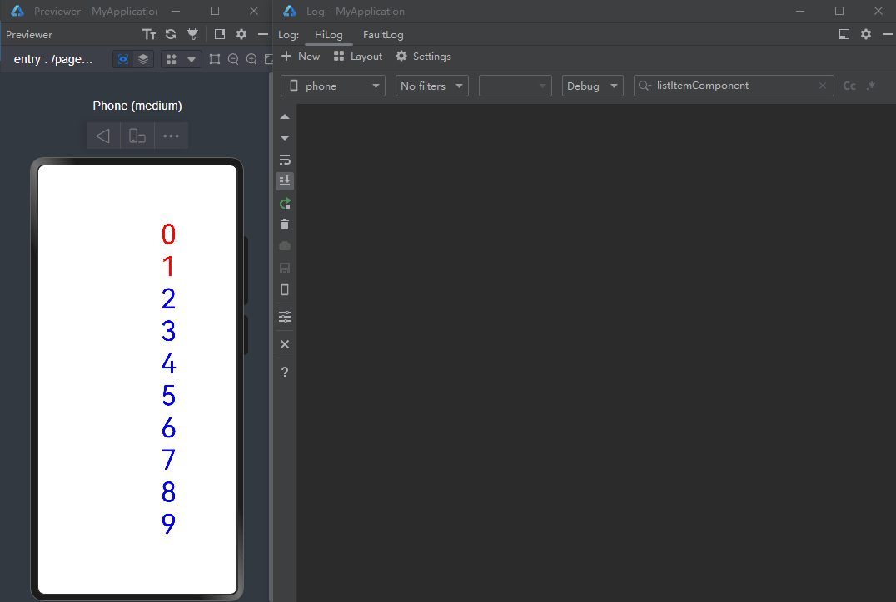
可以看到每次点击后即使其中部分Text组件的颜色并没有发生改变，所有的Text组件也都会刷新。这是由于ListItemComponent组件中的Text组件直接关联了currentIndex，而不是根据currentIndex计算得到的颜色。
针对上述父子组件层级关系的场景，推荐使用状态装饰器@Watch监听数据源。当数据源改变时，在@Watch的监听回调中执行业务逻辑。组件关联回调的处理结果，而不是直接关联数据源。
**正例**
下面是对上述示例的优化，展示如何通过@Watch装饰器实现精准刷新。

```ArkTS
@Entry
@Component
struct UseWatchListener {
  @State currentIndex: number = 0; // The subscript of the currently selected list item
  private listData: string[] = [];
  aboutToAppear(): void {
    for (let i = 0; i < 10; i++) {
      this.listData.push(`${i}`);
    }
  }
  build() {
    Row() {
      Column() {
        List() {
          ForEach(this.listData, (item: string, index: number) => {
            ListItem() {
              ListItemComponent({ item: item, index: index, currentIndex: this.currentIndex })
            }
          })
        }
        .height('100%')
        .width('100%')
        .alignListItem(ListItemAlign.Center)
      }
      .width('100%')
    }
    .height('100%')
  }
}
@Component
struct ListItemComponent {
  @Prop item: string;
  @Prop index: number; // The subscript of the list item
  @Link @Watch('onCurrentIndexUpdate') currentIndex: number;
  @State color: Color = Math.abs(this.index - this.currentIndex) <= 1 ? Color.Red : Color.Blue;
  isRender(): number {
    console.info(`ListItemComponent ${this.index} Text is rendered`);
    return 50;
  }
  onCurrentIndexUpdate() {
    // Dynamically modifies the value of color based on the difference between the index and currentIndex of the current list item.
    this.color = Math.abs(this.index - this.currentIndex) <= 1 ? Color.Red : Color.Blue;
  }
  build() {
    Column() {
      Text(this.item)
        .fontSize(this.isRender())
        .fontColor(this.color)
        .onClick(() => {
          this.currentIndex = this.index;
        })
    }
  }
}
```

上述代码中，ListItemComponent组件中的状态变量currentIndex使用@Watch装饰，Text组件直接关联新的状态变量color。当currentIndex发生变化时，会触发onCurrentIndexUpdate方法，在其中将表达式的运算结果赋值给状态变量color。只有color的值发生变化时，Text组件才会重新渲染，运行效果图如下：

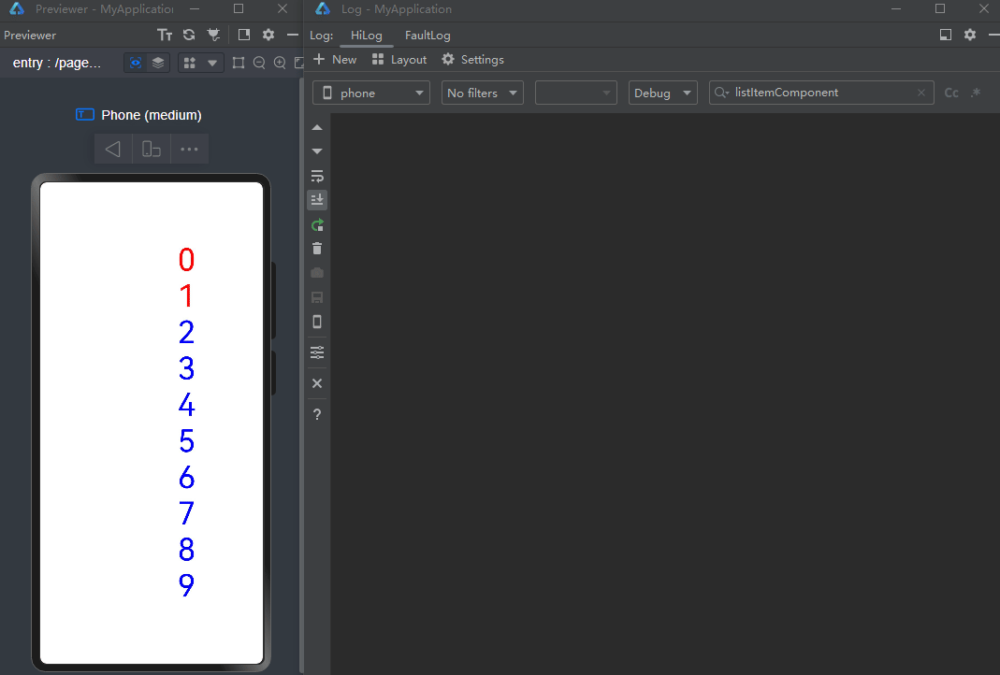
被依赖的数据源仅在父子或兄弟关系的组件中传递时，可以参考上述示例，使用@State/@Link/@Watch装饰器进行状态管理，实现组件的精准刷新。
当组件关系层级较多但都归属于同一个确定的组件树时，推荐使用@Provide/@Consume传递数据，使用@Watch装饰器监听数据变化，在监听回调中执行业务逻辑。

#### 使用自定义事件发布订阅
当组件关系复杂或跨越层级过多时，推荐使用[EventHub](https://developer.huawei.com/consumer/cn/doc/harmonyos-references/js-apis-inner-application-eventhub)或者[Emitter](https://developer.huawei.com/consumer/cn/doc/harmonyos-references/js-apis-emitter)自定义事件发布订阅的方式。当数据源改变时发布事件，依赖该数据源的组件通过订阅事件来获取数据源的改变，完成业务逻辑的处理，从而实现组件的精准刷新。
下面通过部分示例代码介绍使用方式，ButtonComponent组件作为交互组件触发数据变更，ListItemComponent组件接收数据做相应的UI刷新。

```ArkTS
import { ButtonComponent } from '../segment/segment13';
import { ListItemComponent } from '../segment/segment14';
@Entry
@Component
struct UseEmitterPublish {
  listData: string[] = ['A', 'B', 'C', 'D', 'E', 'F'];
  build() {
    Column() {
      Row() {
        Column() {
          ButtonComponent()
        }
      }
      Column() {
        Column() {
          List() {
            ForEach(this.listData, (item: string, index: number) => {
              ListItemComponent({ myItem: item, index: index })
            })
          }
          .height('100%')
          .width('100%')
          .alignListItem(ListItemAlign.Center)
        }
      }
    }
  }
}
```

由于ButtonComponent组件和ListItemComponent组件的组件关系较为复杂，因此在ButtonComponent组件中的Button回调中，可以使用emitter.emit发送事件，在ListItemComponent组件中订阅事件。在事件触发的回调中接收数据value，通过业务逻辑决定是否修改状态变量color，从而实现精准控制ListItemComponent组件中Text的刷新。

```ArkTS
import { emitter } from '@kit.BasicServicesKit';
const CHANGE_COLOR_EVENT_ID = 1;
@Component
export struct ButtonComponent {
  value: number = 2;
  build() {
    Button(`下标是${this.value}的倍数的组件文字变为红色`)
      .onClick(() => {
        let event: emitter.InnerEvent = {
          eventId: CHANGE_COLOR_EVENT_ID,
          priority: emitter.EventPriority.LOW
        };
        let eventData: emitter.EventData = {
          data: {
            value: this.value
          }
        };
        // Sends an event with eventId of CHANGE_COLOR_EVENT_ID and event content of eventData
        emitter.emit(event, eventData);
        this.value++;
      })
  }
}
```


```ArkTS
import { emitter } from '@kit.BasicServicesKit';
const CHANGE_COLOR_EVENT_ID = 1;
@Component
export struct ListItemComponent {
  @State color: Color = Color.Black;
  @Prop index: number;
  @Prop myItem: string;
  aboutToAppear(): void {
    let event: emitter.InnerEvent = {
      eventId: CHANGE_COLOR_EVENT_ID
    };
    // Execute this callback after receiving an event with eventId of CHANGE_COLOR_EVENT_ID
    let callback = (eventData: emitter.EventData): void => {
      if (eventData.data?.value !== 0 && this.index % eventData.data?.value === 0) {
        this.color = Color.Red;
      }
    };
    // Subscribe to events with eventId of CHANGE_COLOR_EVENT_ID
    emitter.on(event, callback);
  }
  build() {
    Column() {
      Text(this.myItem)
        .fontSize(50)
        .fontColor(this.color)
    }
  }
}
```

#### 总结
状态管理是MVVM模式中十分复杂的问题，为解决其中状态和视图一致性、渲染性能体验、代码可复用性和可维护性四个问题，本文主要有以下建议点：
- 在选择装饰器时，应理解各个装饰器的特性和共享范围，结合实际开发场景的优先级，合理选择装饰器，以确保状态和视图的一致性。
- 在使用装饰器时，对装饰器修饰的复杂变量应进行合理拆分设计，以此减少非必要的组件渲染次数，获得更好的性能体验。
- 在代码开发过程中，对相似的逻辑处理，应考虑其复用性合理集中处理，以此有效提升代码的可维护性和可复用性。