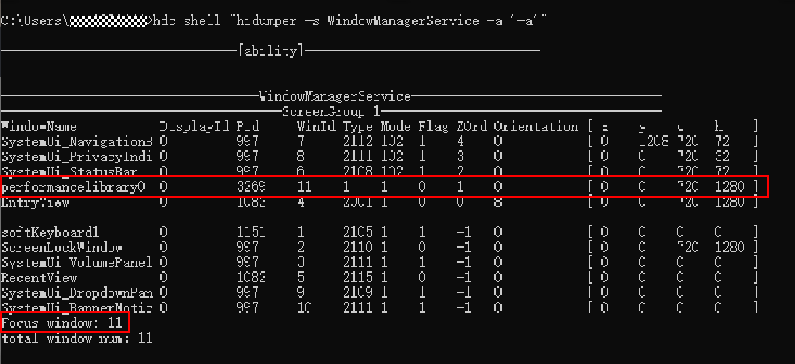

# 组件冗余刷新解决方案

更新时间：2026-03-12 08:45:02

来源：https://developer.huawei.com/consumer/cn/doc/best-practices/bpta-redundancy-refresh-guide

## 简介


自定义组件中的变量被状态装饰器（@State，@Prop等）装饰后成为状态变量，而状态变量的改变会引起使用该变量的UI组件渲染刷新。状态变量的不合理使用可能会带来冗余刷新等性能问题。开发者可以使用状态变量组件定位工具（hidumper）获取状态管理相关信息，例如自定义组件拥有的状态变量、状态变量的同步对象和关联组件等，了解状态变量影响UI的范围，写出高性能应用代码。

下面通过一个点击按钮更改状态变量引起组件刷新的场景示例，结合hidumper工具，介绍状态变量使用范围不当，导致UI冗余刷新的问题定位。


## 示例代码


在以下代码中，创建了自定义组件ComponentA、SpecialImage，每个组件都拥有一些状态变量和UI组件。组件ComponentA中存在Move和Scale两个按钮，在按钮的点击回调中改变状态变量的值刷新相应的组件。

```ts
// constant declaration
const animationDuration: number = 500; // Move animation duration
const opacityChangeValue: number = 0.1; // The value of each change in opacity
const opacityChangeRange: number = 1; // Range of opacity changes
const translateYChangeValue: number = 180; // The value of translateY each time it changes
const translateYChangeRange: number = 250; // The range in which translateY changes
const scaleXChangeValue: number = 0.6; // The value of scaleX for each change
const scaleXChangeRange: number = 0.8; // The value of scaleX for each change

// Style Attribute Classes
class UIStyle {
  public translateX: number = 0;
  public translateY: number = 0;
  public scaleX: number = 0.3;
  public scaleY: number = 0.3;
}

@Component
struct ComponentA {
  @Link uiStyle: UIStyle; // Properties of uiStyle used by multiple components

  build() {
    Column() {
      // Components that use state variables
      SpecialImage({ specialImageUiStyle: this.uiStyle })
      Column() {
        // 需要替换为开发者所需的图像资源文件
        Image($r('app.media.startIcon'))
        .height('150vp')
        .width('150vp')
        .scale({
          x: this.uiStyle.scaleX,
          y: this.uiStyle.scaleY
        })
        Text('Hello World')
        .fontWeight(FontWeight.Bold)
      }
      .translate({
        x: this.uiStyle.translateX,
        y: this.uiStyle.translateY
      })
      .width('95%')
      .height('200vp')
      .margin({
        top: '10vp',
        left: '15vp',
        right: '15vp'
      })
      .borderRadius('16vp')
      .backgroundColor(Color.White)
      // Modify the value of a state variable via a button click callback, causing the corresponding component to refresh.
      Column() {
        Button('Move')
        .width('80%')
        .onClick(() => {
          this.getUIContext().animateTo({ duration: animationDuration }, () => {
            this.uiStyle.translateY = (this.uiStyle.translateY + translateYChangeValue) % translateYChangeRange;
          })
        })
        Button('Scale')
        .width('80%')
        .onClick(() => {
          this.uiStyle.scaleX = (this.uiStyle.scaleX + scaleXChangeValue) % scaleXChangeRange;
        })
        .margin({
          top: '10vp',
          left: '15vp',
          right: '15vp'
        })
      }
      .height('35%')
      .justifyContent(FlexAlign.End)
      .width('100%')
    }
  }
}

@Component
struct SpecialImage {
  @Link specialImageUiStyle: UIStyle;
  private opacityNum: number = 0.5; // Default transparency

  private isRenderSpecialImage(): number {
    // Image transparency increases by 0.1 each time it is rendered, cycling between 0 and 1.
    this.opacityNum = (this.opacityNum + opacityChangeValue) % opacityChangeRange;
    return this.opacityNum;
  }

  build() {
    Column() {
      // 需要替换为开发者所需的图像资源文件
      Image($r('app.media.startIcon'))
      .size({ width: 78, height: 78 })
      .scale({
        x: this.specialImageUiStyle.scaleX,
        y: this.specialImageUiStyle.scaleY
      })
      .opacity(this.isRenderSpecialImage())
      Text("SpecialImage")
      .fontWeight(FontWeight.Bold)
    }
    .width('95%')
    .margin({
      top: '10vp',
      left: '15vp',
      right: '15vp'
    })
    .borderRadius('16vp')
    .height('200vp')
    .backgroundColor(Color.White)
  }
}


@Entry
@Component
struct DFXStateBeforeOptimization {
  @State uiStyle: UIStyle = new UIStyle();

  build() {
    Column() {
      ComponentA({
        uiStyle: this.uiStyle
      })
    }
    .width('100%')
    .height('100%')
    .backgroundColor(0xDCDCDC)
  }
}
```

运行上述示例并分别点击按钮，可以看到点击Move按钮和Scale按钮时组件SpecialImage都出现了刷新，运行效果图如下。

图1 修改代码前点击Scale按钮和Move按钮时运行动图


点击Move按钮的时候SpecialImage组件却发生了旋转动画，这就造成了冗余刷新。


## 问题定位


下面通过这个示例代码结合hidumper工具来介绍冗余刷新的问题定位。

1. 首先在设备上打开应用，进入ComponentA组件所在的页面。

2. 使用以下命令获取示例应用的窗口Id。当前运行的示例应用包名为performancelibrary，可以在输出结果中找到对应窗口名performancelibrary0的WinId，即为应用的窗口Id。或者当应用正处于前台运行时，Focus window的值就是应用的窗口Id。此处示例应用的窗口Id为11，后面的流程中使用的命令都需要指定窗口Id。

```text
hdc shell "hidumper -s WindowManagerService -a '-a'"
```

图2 命令行获取应用窗口Id运行界面





3. 基于上一步获取的窗口Id 11，使用-viewHierarchy命令携带-r 参数递归打印应用的自定义组件树。

```text
hdc shell "hidumper -s WindowManagerService -a '-w 11 -jsdump -viewHierarchy -r'"
```

打印应用的自定义组件树结果如下：

```text
-----------------ViewPUHierarchy-----------------
[-viewHierarchy, viewId=4, isRecursive=true]


|--DFXStateBeforeOptimization[4]ViewPU {isViewActive: true, isDeleting_: false}
  |--ComponentA[6]ViewPU {isViewActive: true, isDeleting_: false}
 |--SpecialImage[8]ViewPU {isViewActive: true, isDeleting_: false}
```

从结果中找到目标组件ComponentA，后面括号中的内容即为组件ComponentA的节点Id 6。

4. 使用命令-stateVariables携带参数-viewId（参数的值为ComponentA的节点Id）获取自定义组件ComponentA中的状态变量信息。

```text
hdc shell "hidumper -s WindowManagerService -a '-w 11 -jsdump -stateVariables -viewId=6'"
```

打印组件ComponentA的状态变量信息如下：

```text
--------------ViewPUState Variables--------------
[-stateVariables, viewId=6, isRecursive=false]

|--ComponentA[6]
@Link 'uiStyle'[-1]
  |--Owned by @Component 'ComponentA'[6]
  |--Sync peers: {
@Link 'specialImageUiStyle'[-2] <@Component 'SpecialImage'[8]>
}
dependencies: variable assignment affects elmtIds: Column[9], Image[10]
  |--Dependent elements: Column[9], Image[10]; @Component 'SpecialImage'[8], Image[18]
```

结果显示ComponentA拥有@Link类型的状态变量uiStyle。每条状态变量的详细信息都包含状态变量的所属组件、同步对象和关联组件。

5. 以状态变量uiStyle为例。

① Sync peers表示uiStyle在自定义组件SpecialImage中存在@Link类型的状态变量specialImageUiStyle订阅数据变化。

② Dependent elements表示当前状态变量和其同步对象的关联组件SpecialImage。

所以当uiStyle变化时，影响的组件范围为自定义组件SpecialImage以及系统组件Column[9]和Image[10]。

示例中组件SpecialImage仅使用了uiStyle传递到specialImageUiStyle中的属性scaleX、scaleY。但点击Move按钮修改uiStyle中的属性translateY时，引起的uiStyle变化也会导致组件SpecialImage的刷新。所以，可以将uiStyle中的属性scaleX、scaleY提取到状态变量scaleStyle中，属性translateX和translateY提取到状态变量translateStyle中，仅传递scaleStyle给组件SpecialImage，避免不必要的刷新。

由于提取后存在Class的嵌套，因此需要使用@Observed/@ObjectLink装饰器装饰相应的Class和状态变量。修改后的部分代码如下：

```ts
// constant declaration
const animationDuration: number = 500; // Move animation duration
const opacityChangeValue: number = 0.1; // The value of each change in opacity
const opacityChangeRange: number = 1; // Range of opacity changes
const translateYChangeValue: number = 180; // The value of translateY each time it changes
const translateYChangeRange: number = 250; // The range in which translateY changes
const scaleXChangeValue: number = 0.6; // The value of scaleX for each change
const scaleXChangeRange: number = 0.8; // The value of scaleX for each change

// Style property class, nested ScaleStyle, TranslateStyle
@Observed
class UIStyle {
  translateStyle: TranslateStyle = new TranslateStyle();
  scaleStyle: ScaleStyle = new ScaleStyle();
}

// Zoom Property Class
@Observed
class ScaleStyle {
  public scaleX: number = 0.3;
  public scaleY: number = 0.3;
}

// Displacement Attribute Class
@Observed
class TranslateStyle {
  public translateX: number = 0;
  public translateY: number = 0;
}

@Component
struct ComponentA {
  @ObjectLink scaleStyle: ScaleStyle;
  @ObjectLink translateStyle: TranslateStyle;

  build() {
    Column() {
      SpecialImage({
        specialImageScaleStyle: this.scaleStyle
      })
      // Other UI components
      Column() {
        // 需要替换为开发者所需的图像资源文件
        Image($r('app.media.startIcon'))
        .height('150vp')
        .width('150vp')
        .scale({
          x: this.scaleStyle.scaleX,
          y: this.scaleStyle.scaleY
        })
        Text('Hello World')
        .fontWeight(FontWeight.Bold)
      }

      .translate({
        x: this.translateStyle.translateX,
        y: this.translateStyle.translateY
      })
      .width('95%')
      .height('200vp')
      .margin({
        top: '10vp',
        left: '15vp',
        right: '15vp'
      })
      .borderRadius('16vp')
      .backgroundColor(Color.White)
      // Modify the value of a state variable via a button click callback, causing the corresponding component to refresh.
      Column() {
        Button('Move')
        .width('80%')
        .onClick(() => {
          this.getUIContext().animateTo({ duration: animationDuration }, () => {
            this.translateStyle.translateY =
            (this.translateStyle.translateY + translateYChangeValue) % translateYChangeRange;
          })
        })
        Button('Scale')
        .width('80%')
        .onClick(() => {
          this.scaleStyle.scaleX = (this.scaleStyle.scaleX + scaleXChangeValue) % scaleXChangeRange;
        })
        .margin({
          top: '10vp',
          left: '15vp',
          right: '15vp'
        })
      }
      .height('35%')
      .justifyContent(FlexAlign.End)
      .width('100%')
    }
  }
}

@Component
struct SpecialImage {
  @Link specialImageScaleStyle: ScaleStyle;
  private opacityNum: number = 0.5; // Default transparency

  // isRenderSpecialImage function
  private isRenderSpecialImage(): number {
    // Image transparency increases by 0.1 each time it is rendered, cycling between 0 and 1.
    this.opacityNum = (this.opacityNum + opacityChangeValue) % opacityChangeRange;
    return this.opacityNum;
  }

  build() {
    Column() {
      // 需要替换为开发者所需的图像资源文件
      Image($r('app.media.startIcon'))
      .size({ width: 78, height: 78 })
      .scale({
        x: this.specialImageScaleStyle.scaleX,
        y: this.specialImageScaleStyle.scaleY
      })
      .opacity(this.isRenderSpecialImage())
      Text("SpecialImage")
      .fontWeight(FontWeight.Bold)
    }
    .width('95%')
    .margin({
      top: '10vp',
      left: '15vp',
      right: '15vp'
    })
    .borderRadius('16vp')
    .height('200vp')
    .backgroundColor(Color.White)
  }
}

@Entry
@Component
struct DFXStateAfterOptimization {
  @State uiStyle: UIStyle = new UIStyle();

  build() {
    Stack() {
      ComponentA({
        scaleStyle: this.uiStyle.scaleStyle,
        translateStyle: this.uiStyle.translateStyle,
      })
    }
    .width('100%')
    .height('100%')
    .backgroundColor(0xDCDCDC)
  }
}
```

修改后的示例运行效果图如下，只有点击Scale按钮时SpecialImage产生刷新现象，点击Move按钮时SpecialImage不会刷新。

图3 修改代码后点击Scale按钮和Move按钮时运行动图


可以使用上文步骤再次获取ComponentA组件的状态变量信息如下，可以看到ComponentA中状态变量scaleStyle影响组件SpecialImage[8]和Image[18]，状态变量translateStyle影响组件Column[9]，translateStyle的变化不会再导致SpecialImage的刷新。

```text
--------------ViewPUState Variables--------------
[-stateVariables, viewId=6, isRecursive=false]

|--ComponentA[6]
@ObjectLink 'scaleStyle'[-1]
  |--Owned by @Component 'ComponentA'[6]
  |--Sync peers: {
@Link 'specialImageScaleStyle'[-3] <@Component 'SpecialImage'[8]>
}
dependencies: variable assignment affects elmtIds: Image[10]
  |--Dependent elements: Image[10]; @Component 'SpecialImage'[8], Image[18]
@ObjectLink 'translateStyle'[-2]
  |--Owned by @Component 'ComponentA'[6]
  |--Sync peers: none
dependencies: variable assignment affects elmtIds: Column[9]
  |--Dependent elements: Column[9]
```
