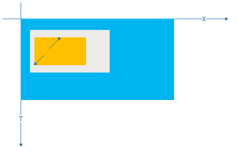
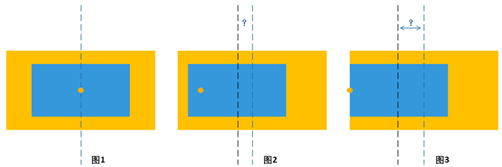
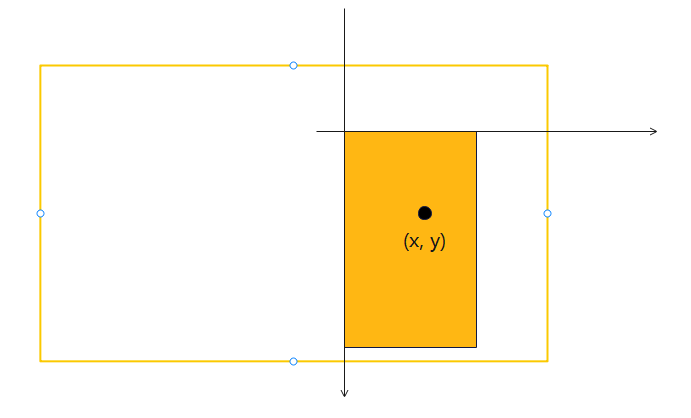
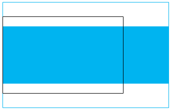
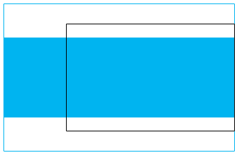

# 图片预览器

更新时间：2026-05-18 00:55:31

来源：https://developer.huawei.com/consumer/cn/doc/best-practices/bpta-picture-preview

#### 概述

图片预览器是常见的开发应用场景。在诸多日常使用的软件中，图片预览器都是提升用户体验的关键组件。它允许用户在上传、分享或编辑图片之前，先对图片进行预览，从而确保图片的质量和效果符合预期。本文章将深入探讨实现图片预览器过程中的几个复杂场景，具体包括：图片如何“跟手”，如何计算并合理限制图片的边界，以及如何解决Swiper组件与滑动手势之间产生的冲突问题。
 


 

 
 

#### 实现原理

 

#### 场景描述

基础的图片预览器功能包括如下操作：
 
1. 双指捏合图片，即实现对图片以双指中心点为基准点的缩放操作。
2. 双击图片即可切换其大小，当图片处于放大状态时，再次双击即恢复至默认尺寸。
3. 大图片支持左右滑动查看。
4. 点击或滑动图片指示器，主图会随之更新。
 
其中，缩放图片是通过矩阵变换功能matrix4来实现的，图片的平移是通过属性translate来实现的。
 

#### 关键技术

图片预览器中的图片查看功能，主要由大图界面来承担，交互操作相对复杂。下面，简要梳理一下大图界面中基本手势的处理与计算方式。
 
**“跟手”的原理**
 
“跟手”操作细分为两大类别：平移“跟手”与缩放“跟手”。
 
在平移“跟手”中，无论用户的手指如何在屏幕上滑动，其触摸点相对于图片所保持的百分比位置始终保持不变。缩放“跟手”，则是在图片依据用户手势进行缩放调整时，用户手势的中心点不仅相对于屏幕上的坐标保持不变，而且相对于图片内容的百分比位置也保持不变。如下图所示，屏幕是蓝色区域，初始图片是橙色区域，放大后的图片是灰色区域。
 



 
假定当前图片位置是<lastScale, offsetX, offsetY>，控件原始宽高为<w, h>，本次缩放图片的缩放值为scale，缩放的中心点百分比位置为<centerX, centerY>，偏移为<offX, offY>，计算终点位置设为<scale', offsetX', offsetY'>。
 



 

 
如上图所示，假定缩放时，未发生偏移，蓝色看作交互开始时的控件，橙色是交互后的控件，如果缩放中心点在图片中心（图1），那么控件最终的offset没有任何变化；如果缩放中心在最左边缘（图3），在放大的过程中，整个控件的中心向右发生了偏移。由此，可以计算出图片的最终位置。其中，图2、图3中的问号代表图片的偏移量，而图中的橙色圆点是图片缩放操作的中心点。在以下计算公式中，0.5 表示图片中心点的百分比位置，即 50% =  0.5。
 
- scale' = 上次手势结束时的缩放值 * 本次缩放图片的缩放值。= lastScale * scale
- offsetX' = 平移带来的偏移 + 缩放中心不在中心而带来的偏移。= (offsetX + offX) +  (0.5 - centerX) * 控件大小变化之差

  = (offsetX + offX) +  (0.5 - centerX) * (w * lastScale - w * lastScale * scale)

  = (offsetX + offX) +  (0.5 - centerX) * w * (scale - 1) * lastScale

  = (offsetX + offX) +  (0.5 - centerX) * w * (1 - scale) * lastScale
- 同理 offsetY' = 平移带来的偏移 + 缩放中心不在中心而带来的偏移。= (offsetY + offY) + (0.5 - centerY) * h * (1 - scale) * lastScale

  缩放中心百分比位置<centerX , centerY>计算。如下图，橙色为手机屏幕，触摸点反馈的坐标(x,y)是相较屏幕左上角的（假设控件布满全屏）。

  


- centerX = ( x - imgX ) / imgWidth= ( 触摸点坐标x- X方向图片左上角的坐标）/  图片的宽度

  = ( 触摸点坐标x- ( ( 组件屏幕的宽度 - 当前图片的宽度) / 2 +上次图片X方向的偏移量)) / 图片的宽度
- 同理 centerY = ( y - imgY ) / imgHeight= ( 触摸点坐标y- Y方向图片左上角的坐标 ) /  图片的高度

  = ( 触摸点坐标y- ( ( 组件屏幕的高度 - 当前图片的高度) / 2 +上次图片Y方向的偏移量)) / 图片的高度

 
**边界限制的原理**
 
边界计算涉及两个方面：当前图片显示边界计算、offset范围计算。
 
- 当前图片显示边界计算可得出当前图片显示的位置，左右上下是否与显示区域边界对齐，如果已经对齐，则不能继续往某个方向继续拖动。
- 平移/缩放时必须对offset作限制，否则图片将被移出显示区域或是手势结束后周围有黑边。从原理上看，某个scale下offset（x&y方向上）的范围是固定的，所以只需在手势交互时根据当前的scale计算得出offsetRange即可（超出边界时取边界作为结果）。

 
假定下面两个图中显示区域为黑框区域，当前放大倍率是curScale。
 
如下图，当X方向offset到达上界时图片上边缘x坐标等于0：
 



 
到达下界时，图片右边缘与显示区域右边缘重合：
 



 
```ArkTS
// Calculate the actual display size of the scaled image.
let scaledImageWidth = this.imageWidth * this.curScale;
let scaledImageHeight = this.imageHeight * this.curScale;

// Calculation of X-axis boundaries
if (scaledImageWidth > this.componentWidth) {
  // If the width of the picture exceeds the width of the screen, you can move it left and right.
  let maxXOffset = (scaledImageWidth - this.componentWidth) / 2;
  this.maxOffsetX = maxXOffset;
  this.minOffsetX = -maxXOffset;
} else {
  // The width of the image does not exceed the width of the screen. It should be centered and no X-axis offset is allowed.
  this.maxOffsetX = 0;
  this.minOffsetX = 0;
}
```
 
Y方向同理，上下界为：
 
```ArkTS
// Calculate the actual display size of the scaled image.
let scaledImageWidth = this.imageWidth * this.curScale;
let scaledImageHeight = this.imageHeight * this.curScale;

// ...

// Y-axis boundary calculation
if (scaledImageHeight > this.componentHeight) {
  // If the image height exceeds the screen height, it can be scrolled up and down.
  let maxYOffset = (scaledImageHeight - this.componentHeight) / 2;
  this.maxOffsetY = maxYOffset;
  this.minOffsetY = -maxYOffset;
} else {
  // The height of the image does not exceed the height of the screen. It should be centered and no Y-axis offset is allowed.
  this.maxOffsetY = 0;
  this.minOffsetY = 0;
}
```
 
 

#### 场景实现

 

#### 跟手的实现

跟手技术细分为两大类别：平移“跟手”与缩放“跟手”，接下来，将对这两者进行讲解。
 


 1. 响应平移手势：使用PanGesture接口实现滑动手势控制，为了实现单指滑动效果，需将参数fingers设置为1，当图片拖动后，即可获取当前图片的偏移量，具体为event.offsetX与event.offsetY。
```ArkTS
// Slide picture
// Swiping left and right under the default size should switch images
PanGesture({ fingers: 1, distance: this.isDisableSwipe ? 3 : 50 })
  .onActionUpdate((event: GestureEvent) => {
    this.isDisableSwipe = this.imageModel.panGestureUpdate(event);
  })
  .onActionEnd(() => {
    this.imageModel.gestureEnd();
  }),
```

2. 图片平移：在onScale()方法中，算出图片经过拖动后，在X轴方向和Y轴方向上的新位置，分别为curOffsetX和curOffsetY，即为平移“跟手”后图片的位置。
```ArkTS
// Pan gestures callback during movement.
panGestureUpdate(event: GestureEvent): boolean {
  this.onScale(event.scale, event.offsetX, event.offsetY);
  this.pictureBoundaryRestriction();
  return this.isDisableSwipe;
}

// ...

// Calculates the offset X and offset Y of the current picture and the scaling value of the current picture.
onScale(scale: number, offX: number, offY: number): void {
  // ...
  if (this.curScale < this.maxScale) {
    this.curOffsetY =
      (this.lastOffsetY + offY) + (0.5 - this.centerY) * this.imageHeight * (1 - scale) * this.lastScale;
    this.curOffsetX =
      (this.lastOffsetX + offX) + (0.5 - this.centerX) * this.imageWidth * (1 - scale) * this.lastScale;
  }
  // When the image is in the process of moving, it has not reached the boundary point.
  this.isArriveBoundary = false;
  // If the image has not reached the boundary, do not allow the image to be switched.
  if (!this.isArriveBoundary) {
    this.isDisableSwipe = true;
  }
}
```

3. 响应缩放手势：使用捏合手势PinchGesture接口，将参数fingers设置为2。当捏合手势识别成功时，onActionStart()回调被适时触发，在这一过程中，会计算出当前图片缩放中心百分比位置。手势移动过程中会触发onActionUpdate()回调函数，在onActionUpdate()回调函数里计算出当前图片的缩放值以及图片在X方向和Y方向的偏移量，并实时更新图片的位置。
```ArkTS
// Two-finger scaling
PinchGesture({ fingers: 2, distance: 1 })
  .onActionStart((event: GestureEvent) => {
    this.imageModel.pinchGestureStart(event);
    if (this.isOverlay) {
      this.isOverlay = false;
    }
  })
  .onActionUpdate((event: GestureEvent) => {
    this.isDisableSwipe = this.imageModel.pinchGestureUpdate(event);
  })
  .onActionEnd(() => {
    this.imageModel.pinchGestureEnd();
  }),
```

4. 图片缩放中心百分比位置的计算：成功识别到双指捏合手势触发onActionStart()函数，计算出图片缩放中心的百分比位置this.center，this.center用于图片缩放时，所产生的偏移量（若缩放中心并非位于图片中心点），下面将具体介绍图片缩放中心的百分比位置的计算方法：
- cX = Math.max((centerX - imgX) / imgDisplayWidth, 0)= Math.max((centerX - ((this.componentWidth - ( (this.imageWidth * this.lastScale))) / 2 + this.lastOffsetX)) / (this.imageWidth * this.lastScale), 0)

  = Math.max((捏合手势中心点的X轴坐标 - ((组件屏幕的宽度 - (图片的宽度 * 上次图片的缩放值)) / 2 + 上次图片X方向的偏移量)) / ( 图片的宽度 * 上次图片的缩放值 ), 0)

5. cY = Math.max((centerY - imgY) / imgDisplayHeight, 0);= Math.max((centerY - ((this.componentHeight - (this.imageHeight * this.lastScale)) / 2 + this.lastOffsetY)) / (this.imageHeight * this.lastScale), 0)

  = Math.max((捏合手势中心点的Y轴坐标 - ((组件屏幕的高度 - (图片的高度 * 上次图片的缩放值)) / 2 + 上次图片Y方向的偏移量)) / (图片的高度 * 上次图片的缩放值), 0)

  
```ArkTS
// Calculates the percentage position of the current zoom center relative to the picture
evaluateCenter(centerX: number, centerY: number): [number, number] {
  let imgDisplayWidth = this.imageWidth * this.lastScale;
  let imgDisplayHeight = this.imageHeight * this.lastScale;
  let imgX = (this.componentWidth - imgDisplayWidth) / 2 + this.lastOffsetX;
  let imgY = (this.componentHeight - imgDisplayHeight) / 2 + this.lastOffsetY;
  let cX = Math.max((centerX - imgX) / imgDisplayWidth, 0);
  let cY = Math.max((centerY - imgY) / imgDisplayHeight, 0);
  return [cX, cY];
}

// ...

// Pinch gesture recognition successful callback.
pinchGestureStart(event: GestureEvent): void {
  this.center = this.evaluateCenter(event.pinchCenterX, event.pinchCenterY);
  this.centerX = 1 - this.center[0];
  this.centerY = 1 - this.center[1];
  AppStorage.setOrCreate('isImgDefaultSize', false);
}
```


6. 图片缩放：在捏合手势触发移动操作时，通过调用自定义onScale()方法，计算得出当前图片的缩放值以及由双指缩放动作引起的水平偏移量curOffsetX和垂直偏移量curOffsetY，最后，调用matrix4.identity().scale()对图片进行缩放，至此，图片的缩放“跟手”操作已完成。
```ArkTS
// General picture scaling value method.
pictureScaling(scale: number): void {
  this.matrix = matrix4.identity().scale({
    x: scale,
    y: scale
  }).copy();
}

// ...

// Pinch gestures callback during a move.
pinchGestureUpdate(event: GestureEvent): boolean {
  this.onScale(event.scale, event.offsetX, event.offsetY);
  this.pictureScaling(this.curScale);
  if (this.curScale > this.defaultScaleValue) {
    this.isDisableSwipe = true;
  }
  this.pictureBoundaryRestriction();
  return this.isDisableSwipe;
}

// ...

// Calculates the offset X and offset Y of the current picture and the scaling value of the current picture.
onScale(scale: number, offX: number, offY: number): void {
  if (this.lastScale * scale > this.maxScale) {
    this.curScale = this.maxScale;
  } else if (this.lastScale * scale < this.minScale) {
    this.curScale = this.minScale;
  } else {
    this.curScale = this.lastScale * scale;
  }
  if (this.lastScale * scale === this.maxScale) {
    this.curScale -= 0.001;
  }
  this.evaluateOffsetRange();
  if (this.curScale < this.maxScale) {
    this.curOffsetY =
      (this.lastOffsetY + offY) + (0.5 - this.centerY) * this.imageHeight * (1 - scale) * this.lastScale;
    this.curOffsetX =
      (this.lastOffsetX + offX) + (0.5 - this.centerX) * this.imageWidth * (1 - scale) * this.lastScale;
  }
  // When the image is in the process of moving, it has not reached the boundary point.
  this.isArriveBoundary = false;
  // If the image has not reached the boundary, do not allow the image to be switched.
  if (!this.isArriveBoundary) {
    this.isDisableSwipe = true;
  }
}
```


  

  #### 边界限制的实现

1. 图片边界限制：主要涉及两个方面：当前图片显示边界的计算以及offset范围计算。调用自定义initCurrentImageInfo()方法，计算出当前图片的宽度this.imageModel.imageWidth和高度this.imageModel.imageHeight。

  
```ArkTS
/**
 * Set information about the current image: uri, whRatio, pixelMap, defaultSize, maxScaleValue
 * Obtain the Image information in advance for the size setting of
 * the image component and subsequent related calculations
 */
initCurrentImageInfo(): void {
  try {
    let img = this.context.resourceManager.getMediaContentSync(this.imageData?.id);
    let imageSource = image.createImageSource(img.buffer.slice(0));
    imageSource.getImageInfo(0).then((data: image.ImageInfo) => {
      this.imageWHRatio = data.size.width / data.size.height;
      // Calculate scale ratios for both width and height to ensure image fits completely
      let widthRatio = this.imageModel.componentWidth / data.size.width;
      let heightRatio = this.imageModel.componentHeight / data.size.height;
      // Use the smaller ratio to ensure the image fits within the screen bounds
      let scaleRatio = Math.min(widthRatio, heightRatio);
      this.imageModel.imageWidth = data.size.width * scaleRatio;
      this.imageModel.imageHeight = data.size.height * scaleRatio;
    }).catch((err: BusinessError) => {
      hilog.error(0x0000, TAG, `[error][getImageInfo]${err.message}`);
    });
  } catch (err) {
    hilog.error(0x0000, TAG, `GetMediaContentSync failed. Cause code: ${err.code}, message: ${err.message}`);
  }
}
```
 调用自定义windowSize()方法，计算出当前组件的宽度this.componentWidth和高度this.componentHeight。

  最后，调用自定义evaluateOffsetRange()方法，在图片缩放后，计算出图片在四个方向上的边界值：具体包括最大水平偏移量this.maxOffsetX、最小水平偏移量this.minOffsetX、最大垂直偏移量this.maxOffsetY以及最小垂直偏移量this.minOffsetY
```ArkTS
// Get window size.
windowSize(): void {
  window.getLastWindow(context).then((window: window.Window) => {
    try {
      this.componentWidth = uiContext!.px2vp(window.getWindowProperties().windowRect.width);
      this.componentHeight = uiContext!.px2vp(window.getWindowProperties().windowRect.height);
    } catch (err) {
      hilog.error(DOMAIN, TAG, FORMAT,
        `GetWindowProperties failed. Cause code: ${err.code}, message: ${err.message}`);
    }
  }).catch((err: BusinessError) => {
    hilog.error(DOMAIN, TAG, FORMAT, `GetLastWindow failed. Cause code: ${err.code}, message: ${err.message}`);
  });
}

// ...

// Calculate the range of the picture boundary.
evaluateOffsetRange(): void {
  // Calculate the actual display size of the scaled image.
  let scaledImageWidth = this.imageWidth * this.curScale;
  let scaledImageHeight = this.imageHeight * this.curScale;

  // Calculation of X-axis boundaries
  if (scaledImageWidth > this.componentWidth) {
    // If the width of the picture exceeds the width of the screen, you can move it left and right.
    let maxXOffset = (scaledImageWidth - this.componentWidth) / 2;
    this.maxOffsetX = maxXOffset;
    this.minOffsetX = -maxXOffset;
  } else {
    // The width of the image does not exceed the width of the screen. It should be centered and no X-axis offset is allowed.
    this.maxOffsetX = 0;
    this.minOffsetX = 0;
  }

  // Y-axis boundary calculation
  if (scaledImageHeight > this.componentHeight) {
    // If the image height exceeds the screen height, it can be scrolled up and down.
    let maxYOffset = (scaledImageHeight - this.componentHeight) / 2;
    this.maxOffsetY = maxYOffset;
    this.minOffsetY = -maxYOffset;
  } else {
    // The height of the image does not exceed the height of the screen. It should be centered and no Y-axis offset is allowed.
    this.maxOffsetY = 0;
    this.minOffsetY = 0;
  }
}
```


2. 图片在滑动或缩放过程中，一旦触及边界，便会触发restrictBound()方法进行判断。若图片抵达最上方边界，则立即将当前Y方向的偏移位置this.curOffsetY设置为该方向的最大偏移值this.maxOffsetY，以此实现对边界的有效限制。同样的逻辑也适用于其他三个方向：当图片到达最下方、最左侧或最右侧边界时，也会相应地调整其偏移位置，确保图片始终在规定的范围内活动。当图片滑动至左边界或右边界时，this.isDisableSwipe会被设置为false；此时，Swiper组件将激活滑动切换功能，允许用户切换图片。

  


  
```ArkTS
// Picture Boundary Restriction
pictureBoundaryRestriction(): void {
  // X-axis boundary restriction
  if (this.curOffsetX > this.maxOffsetX) {
    this.curOffsetX = this.maxOffsetX;
    this.isDisableSwipe = false;
    this.isArriveBoundary = true;
  } else if (this.curOffsetX < this.minOffsetX) {
    this.curOffsetX = this.minOffsetX;
    this.isDisableSwipe = false;
    this.isArriveBoundary = true;
  }
  // Y-axis boundary limit
  if (this.curOffsetY > this.maxOffsetY) {
    this.curOffsetY = this.maxOffsetY;
  } else if (this.curOffsetY < this.minOffsetY) {
    this.curOffsetY = this.minOffsetY;
  }
  // When the image cannot fill the entire screen, force it to be centered.
  let scaledImageWidth = this.imageWidth * this.curScale;
  let scaledImageHeight = this.imageHeight * this.curScale;
  if (scaledImageWidth <= this.componentWidth) {
    // The width of the image does not exceed the screen. Force the X-axis to be centered.
    this.curOffsetX = 0;
  }
  if (scaledImageHeight <= this.componentHeight) {
    // The height of the image does not exceed the screen, and the Y-axis is forced to be centered.
    this.curOffsetY = 0;
  }
}
```


  

  #### 实现Swiper组件与滑动手势冲突的解决方案

  当Swiper组件与PanGesture滑动手势事件在同一组件上并发作用时，两者之间的冲突会导致Swiper无法正常切换图片。下面，将详细讲解如何有效解决Swiper组件与滑动手势之间的冲突问题。

  
> [!NOTE]
> Swiper组件内包含了 PanGesture 拖动手势事件，用于滑动轮播子组件。 disableSwipe 属性设为true会取消内部的PanGesture事件监听。


1. 需要将Swiper组件的disableSwipe属性设置为变量this.isDisableSwipe，即disableSwipe(this.isDisableSwipe)。

  当图片处于默认尺寸，或是已滑动到左右边界之时，应将this.isDisableSwipe的值设定为false；当图片处于放大状态且尚未滑动至左右边界时，应将this.isDisableSwipe的值设定为true。
```ArkTS
@Builder
PhotoSwiper() {
  Swiper(this.homeSwipeController) {
    ForEach(this.ImgData, (img: Resource) => {
      ImageItemView({
        imageData: img,
        isOverlay: this.isOverlay
      })
        .width('100%')
        .height('100%')
    }, (img: Resource, index: number) => JSON.stringify(img) + index)
  }
  // ...
  .disableSwipe(this.isDisableSwipe)
  // ...
```


2. PanGesture接口被用于实现滑动手势控制，其中参数distance需根据变量进行动态设置与判断。具体而言，当this.isDisableSwipe被设置为true时，Swiper组件将禁用滑动切换功能，此时，为了保持拖动图片时的流畅性，需要将distance的值设定为一个较小的数值。相反，当this.isDisableSwipe为false时，Swiper组件则会启用滑动切换功能，此时，为了让用户能够更灵敏地触发Swiper组件的滑动操作，distance的值则需适当增大，以优化用户的交互体验。至此，Swiper组件与滑动手势之间的冲突问题便得到解决。
```ArkTS
PanGesture({ fingers: 1, distance: this.isDisableSwipe ? 3 : 50 })
```


  

  #### 常见问题

  

  #### 在Swiper组件中，当为图片子组件配置了PanGesture后，swiper无法正常翻页，该如何解决手势冲突？

  通过使用Swiper组件的disableSwipe属性，进行动态赋值，在图片保持默认尺寸或图片在放大状态下已触及边界时，将disableSwipe属性设置为false，从而使得Swiper能够切换图片；当图片处于放大状态且尚未到达边界时，则将disableSwipe属性设为true，此时Swiper的切换功能将被禁用。

  

  #### 当图片被放大后，若在拖动图片的过程中，该如何控制其边界，确保图片不会超出显示区域的界限？

  该问题涉及到图片边界的约束。主要涉及两个方面：当前图片显示边界计算以及offset范围计算。当前图片显示边界计算可得出当前图片显示的位置，左右上下是否与显示区域边界对齐，如果已经对齐，则不能继续往某个方向继续拖动。平移/缩放时必须对offset作限制，否则图片将被移出显示区域或是手势结束后周围有黑边。只需在手势交互时根据当前的scale计算得出offset的范围即可（超出边界时取边界作为结果），即可对图片边界进行限制。

  

  #### 示例代码

  
[基于ArkUI实现图片预览功能](https://gitcode.com/harmonyos_samples/PicturePreview)
