# 基于DialogHub的通用弹窗

更新时间：2026-05-22 09:46:30

来源：https://developer.huawei.com/consumer/cn/doc/best-practices/bpta-hadss_dialoghub

#### 概述
在HarmonyOS开发中，弹窗是每个应用都会遇到的场景，其重要性不容忽视。一方面，弹窗可以作为一种即时反馈机制，向用户传递重要的信息或提示，如登录提示、网络请求状态、操作确认等。这些弹窗通常具有模态或半模态特性，能够暂时阻断用户的其他操作，确保用户能够注意到并处理这些信息。另一方面，弹窗还可以用于展示广告、推广内容或引导用户进行下一步操作。例如，在App首页或某些关键页面，通过弹窗展示全屏广告或引导用户参与某项活动，可以有效地提升用户参与度。为了方便开发者在HarmonyOS上高效使用不同的弹窗能力，DialogHub解决方案应运而生。
DialogHub作为ArkUI弹窗能力的解决方案，提供了以下功能特性：
1. **页面级弹窗能力**确保弹窗与页面生命周期紧密绑定，页面销毁时自动清理弹窗资源。 在页面切换或导航时，自动检查并隐藏旧页面的弹窗。
2. **弹窗管理能力**提供弹窗状态管理，区分弹窗是否正在显示、是否已关闭。 提供监听机制，允许开发者在弹窗状态变化时执行自定义逻辑，包括弹出、即将弹出、关闭、即将关闭4种状态。
3. **简化创建弹窗流程**精简链式调用的API设计，确保常用弹窗可以通过简洁的语法创建。 提供默认配置，减少不必要的参数设置，提高调用效率。
4. **自定义弹窗模板提升易用性**允许开发者自定义模板并保存到模板库中，便于后续复用。
5. **层级管理、手势透传等多种自定义配置属性**提供更灵活的层级管理机制，允许开发者动态调整弹窗的Z轴顺序。 提供层级冲突的解决策略，如新旧置顶弹窗的解决策略。 允许开发者自定义手势透传的行为，如是否允许手势穿透弹窗作用到底层页面。 提供更多自定义属性，如弹窗的动画效果、背景颜色、圆角半径等。
6. **弹窗刷新机制**提供属性值的动态更新机制，允许开发者在弹窗显示过程中修改属性。
本文主要以实际开发中的各项场景为例，介绍DialogHub的使用。

#### 实现原理
- **弹窗能力****：**基于ArkUI框架中的OverlayManager和BindSheet能力实现。[OverlayManager](https://developer.huawei.com/consumer/cn/doc/harmonyos-references/arkts-apis-uicontext-overlaymanager)为弹窗提供一个可以覆盖在其他UI元素之上的显示层，而[BindSheet](https://developer.huawei.com/consumer/cn/doc/harmonyos-references/ts-universal-attributes-sheet-transition#bindsheet)则支持将弹窗与特定的页面或组件绑定，实现更精细的控制。
- **页面级弹窗控制：**通过[UIObserver](https://developer.huawei.com/consumer/cn/doc/harmonyos-references/arkts-apis-uicontext-uiobserver)实时监听应用内的路由变化，当路由发生变化时，触发相应的回调，从而允许DialogHub根据当前页面的状态来决定是否显示或隐藏弹窗。

#### 开发流程
**前提**
开发者参考[DialogHub简介](https://gitcode.com/openharmony-sig/dialoghub/blob/master/README.md)进行安装配置。
开发者调用init()接口并传入UIContext以初始化DialogHub。

```ArkTS
DialogHub.init(this.getUIContext());
```

#### 弹窗能力开发流程
通过DialogHub直接创建弹窗然后进行显示或者销毁。
1. **获取弹窗构造器：**调用 DialogHub 的 getToast()等接口，获取不同类型的弹窗构造器 DialogBuilder。 DialogHub.getToast()
2. **配置弹窗内容：**调用 DialogBuilder 的 setContent()、setAnimation()等接口，配置弹窗的具体内容、动画效果、样式等。 DialogHub.getToast()
  .setContent(wrapBuilder(TextToastBuilder), new TextToastParams(CommonConstant.TOAST_TITLE))
  .setAnimation({ dialogAnimation: AnimationType.UP_DOWN })
  .setConfig({ dialogBehavior: { isModal: true } })
  .setStyle({ backgroundColor: Color.White })
3. **创建弹窗实例：**调用 DialogBuilder 的 build() 接口，创建弹窗实例 InfDialog 对象。 let dialog:InfToast = DialogHub.getToast()
  // ...
  .build()
4. **显示与销毁弹窗：**调用 InfDialog 对象的 show() 方法显示弹窗。 dialog.show() 调用 InfDialog 对象的 dismiss() 方法销毁弹窗。 dialog.dismiss()

#### 模板复用能力开发流程
开发者自定义模板并注册到模板库中，便于后续复用。
1. **创建弹窗模板构造器：**调用 DialogHub 的 createToastTemplate()等接口，创建不同类型弹窗的模板构造器 DialogTemplate。 DialogHub.createToastTemplate('SimpleToast')
2. **配置模板内容：**调用 DialogTemplate 的 setContent()、setAnimation()等接口，配置模板的具体内容、动画效果、样式等。 DialogHub.createToastTemplate('SimpleToast')
  .setContent(wrapBuilder(TextToastBuilder), new TextToastParams(CommonConstant.TOAST_TITLE))
  .setAnimation({ dialogAnimation: AnimationType.UP_DOWN })
  .setConfig({ dialogBehavior: { isModal: true } })
  .setStyle({ backgroundColor: Color.White })
3. **注册模板：**调用 DialogTemplate 的 register() 接口，将配置好的模板注册并存储。 DialogHub.createToastTemplate('SimpleToast')
  // ...
  .register()
4. **获取并使用弹窗模板：**调用 DialogHub 的 getToastTemplate()等接口，根据模板名称获取对应的 DialogBuilder。 然后按照弹窗能力开发流程中的步骤2~4，使用 DialogBuilder 配置并显示弹窗。 DialogHub.getToastTemplate('SimpleToast')
  ?.setAnimation({dialogAnimation:AnimationType.FADE_IN_AND_OUT})
  .build()
  .show()  获取模板后配置的属性(如动画、位置等)只针对当前弹窗对象生效，不会修改模板内容。
5. **(可选) 更新模板：**调用 DialogHub 的 updateToastTemplate()、updatePopupTemplate() 等接口，更新对应模板名称的配置，并重新注册。 DialogHub.updateToastTemplate('SimpleToast')
  ?.setStyle({backgroundColor:Color.Blue})
  .register()
6. **(可选) 删除模板：**调用 DialogHub 的 removeTemplate() 接口，删除对应模板名称的弹窗模板。 DialogHub.removeTemplate('SimpleToast')
7. **(可选) 判断模板是否存在：**调用 DialogHub 的 isTemplateExist() 接口，判断指定模板名称的弹窗模板是否已被注册。 DialogHub.isTemplateExist('SimpleToast')

#### 常见业务弹窗
#### 纯文本有持续时间的提示窗
一个简单的文本Toast弹窗，到达指定时间后消失。setDuration()设置Toast持续时间。

```ArkTS
DialogHub.getToast()
  .setContent(wrapBuilder(TextToastBuilder))
  // ...
  .setDuration(CommonConstant.DURATION_3000)
  .build()
  .show();
```

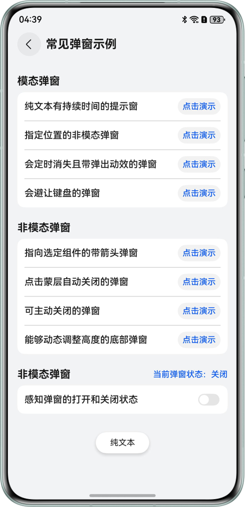

#### 指定位置弹窗的非模态弹窗
在屏幕底部弹出SnackBar，该弹窗可以响应用户点击跳转页面或者关闭弹窗。

```ArkTS
this.specifiedLocationDialog = this.specifiedLocationDialog ?? DialogHub.getCustomDialog()
  .setOperableContent(wrapBuilder(SnackbarBuilder), (action: DialogAction) => {
    let param = new SnackbarParams(() => {
      action.dismiss()
    }, this.pageInfos)
    return param
  })
  // ...
  .setConfig({
    dialogBehavior: { isModal: false, passThroughGesture: true },
    dialogPosition: {
      alignment: DialogAlignment.Bottom,
      offset: { dx: 0, dy: $r('app.float.specified_location_offset') }
    }
  })
  .build();
this.specifiedLocationDialog.show();
```

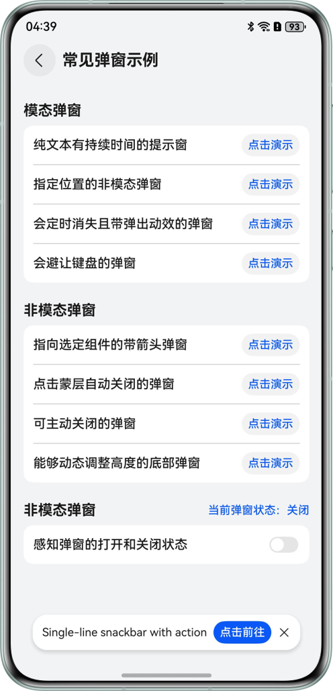

#### 会定时消失且带弹出动效的弹窗
实现一个定时弹窗，6s自动关闭。
- 通过setAnimation()设置弹窗弹出动效。
- 通过dialog实例的updateContent()，定时动态刷新弹窗内容。this.intervalsDisappearsDialog = this.intervalsDisappearsDialog ?? DialogHub.getCustomDialog()
  .setContent(wrapBuilder(TimeToastBuilder), params)
  .setStyle({
 radius: \$r('app.float.popup_disappears_intervals_radius'),
 shadow: CommonConstant.CUSTOM_SAMPLE_STYLE_SHADOW
  })
  .setAnimation({ dialogAnimation: AnimationType.UP_DOWN })
  .setConfig({
 dialogBehavior: { isModal: false, passThroughGesture: true },
 dialogPosition: {
 alignment: DialogAlignment.Top,
 offset: { dy: \$r('app.float.popup_disappears_intervals_offset'), dx: 0 }
 }
  })
  .build();

this.intervalsDisappearsDialog.show();

intervalID = setInterval(() => {
  time -= 1;
  params.content = time + CommonConstant.TIMED_CLOSED;
  this.intervalsDisappearsDialog?.updateContent(params)
  if (time <= 0 && intervalID) {
 this.intervalsDisappearsDialog?.dismiss();
 clearInterval(intervalID);
  }
}, CommonConstant.DURATION_1000);

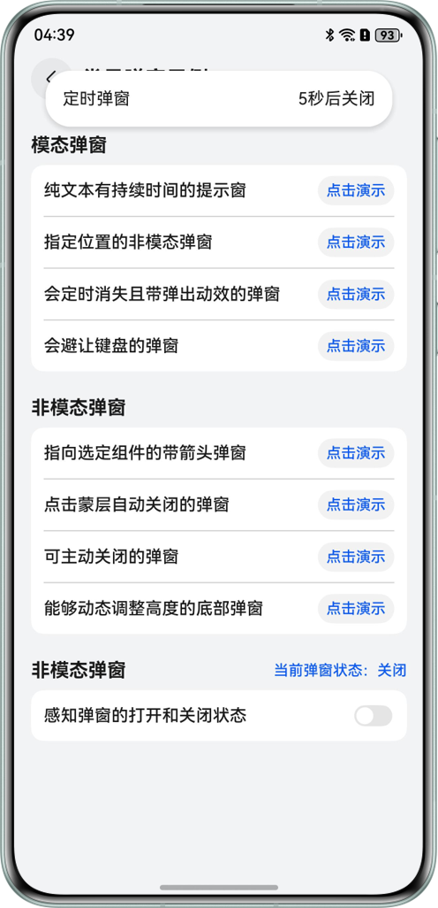

#### 会避让键盘的弹窗
通过setConfig()的keyboardAvoidMode可以配置避让模式，CustomKeyboardAvoidMode.CONTENT_AVOID为弹窗内容避让。
requestFocusWhenShow配置为true，弹窗显示时，弹窗自动获焦。

```ArkTS
this.avoidKeyboardDialog = this.avoidKeyboardDialog ?? DialogHub.getCustomDialog()
  .setContent(wrapBuilder(InputBuilder), param)
  // ...
  .setConfig({
    dialogBehavior: {
      isModal: false,
      passThroughGesture: true,
      requestFocusWhenShow: true,
      keyboardAvoidMode: CustomKeyboardAvoidMode.CONTENT_AVOID
    },
    dialogPosition: { alignment: DialogAlignment.Bottom }
  })
  .build();
this.avoidKeyboardDialog.show();
```

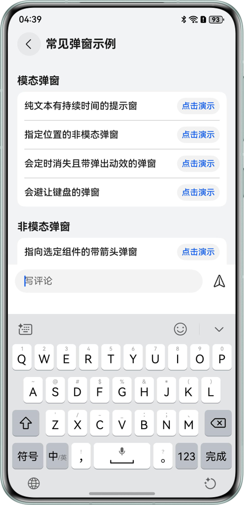


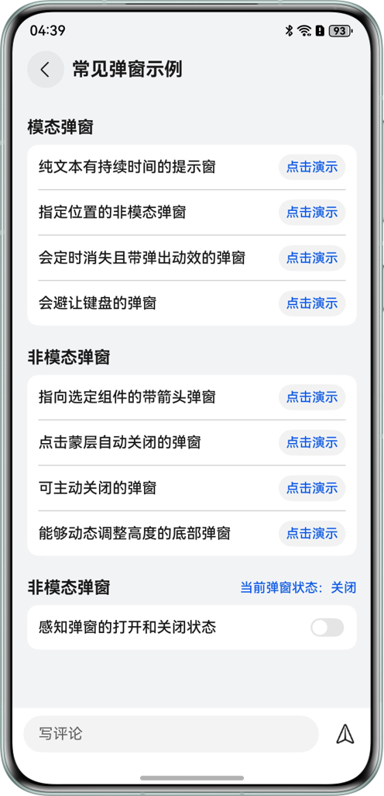

#### 指向选定组件的带箭头弹窗
通过getPopup()构造Popup弹窗实例，setStyle()中enableArrow、arrowOffset、arrowWidth、arrowHeight可配置箭头属性；
setConfig()中preferPlacement可配置箭头偏向。

> [!NOTE] 说明
> 绑定组件需要调用setComponentTargetId(targetCompId)，targetCompId组件id标识确保唯一，否则会报错且弹窗位置异常。


```ArkTS
DialogHub.getPopup()
// ...
  .setComponentTargetId('PopupDialog1')
  .setStyle({
    radius: $r('app.float.image_popup_builder_borderRadius'),
    backgroundColor: Color.White,
    shadow: {
      radius: $r('app.float.image_popup_shadow_radius'),
      color: $r('app.color.image_popup_shadow_color')
    },
  })
  .setConfig({
    dialogPosition: {
      preferPlacement: Placement.Bottom
    }
  })
  .build()
  .show();
```

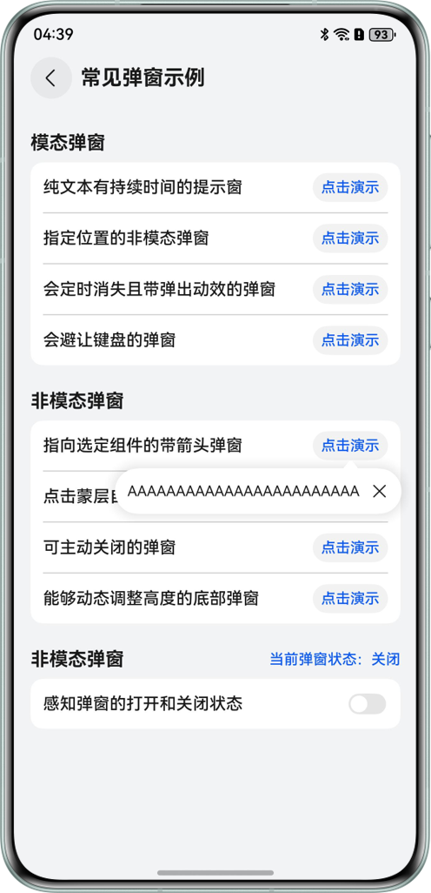

#### 点击蒙层自动关闭的弹窗
弹出此类型弹窗需要打开isModal蒙层开关，并将autoDismiss设置为true

```ArkTS
this.maskCloseDialog = this.maskCloseDialog ?? DialogHub.getCustomDialog()
// ...
  .setConfig({ dialogBehavior: { isModal: true, autoDismiss: true, passThroughGesture: false } })
  .build();
this.maskCloseDialog.show();
```


#### 可主动关闭的弹窗
能够通过点击弹窗按钮关闭弹窗，设置弹窗Content时，调用setOperableContent()，并将DialogHub的Dismiss事件作为参数传递给Builder。

```ArkTS
this.activelyCloseDialog = this.activelyCloseDialog ?? DialogHub.getCustomDialog()
  .setOperableContent(wrapBuilder(ActiveCloseBuilder), (action: DialogAction) => {
    let param =
      new ActiveCloseParams(CommonConstant.LOGOUT, CommonConstant.LOGOUT_TIPS,
        CommonConstant.CANCEL, CommonConstant.OUT, () => {
          action.dismiss();
        }, () => {
          action.dismiss();
        })
    return param;
  })
  .setConfig({ dialogBehavior: { isModal: true, autoDismiss: false, passThroughGesture: false } })
  .setStyle({
    radius: $r('app.float.active_close_builder_borderRadius'),
    backgroundColor: Color.White,
  })
  .build();
this.activelyCloseDialog.show();
```

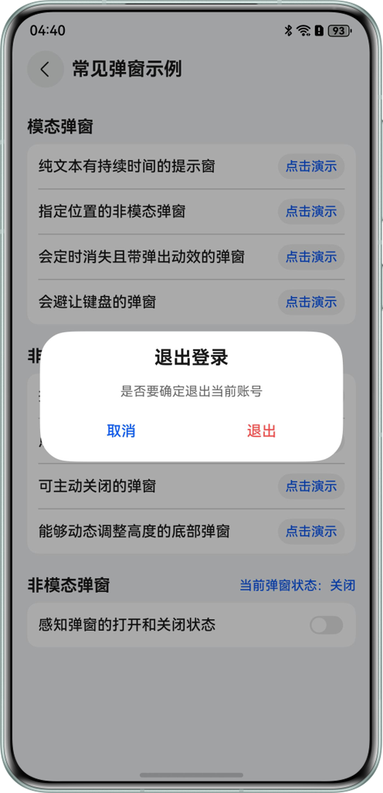

#### 能够动态调整高度的底部弹窗
实现动态调整弹窗高度，不同高度展示不同弹窗内容。
- 获取DialogHub的Sheet类型弹窗实例this.adjustSheetDialog = DialogHub.getSheet()
  .setContent(wrapBuilder(SheetBuilder), sheetParams)
  .setStyle({ preferType: SheetType.BOTTOM, detents: [CommonConstant.SHEET_MIDDLE, CommonConstant.SHEET_LARGE] })
  .setConfig({ enableOutsideInteractive: false, scrollSizeMode: ScrollSizeMode.CONTINUOUS })
  .setComponentTargetId(CommonConstant.ADJUST_SHEET_DIALOG_ID)
  .build();
- 弹窗实例增加Sheet高度监听onHeightDidChange()，当高度变化到一定程度，updateContent()刷新弹窗内容this.adjustSheetDialog.addLifeCycleListener({
  onHeightDidChange: (h: number) => {
 let vpValue = this.getUIContext().px2vp(h);
 let keyboardHeight = this.mainWindow?.getWindowAvoidArea(window.AvoidAreaType.TYPE_KEYBOARD).bottomRect.height;
 if(this.isKeyboardShow){
 this.getUIContext().getFocusController().clearFocus();
 }
 if (vpValue <= CommonConstant.SHEET_MIDDLE && sheetParams.type != 0) {
 sheetParams.type = 0
 } else if (vpValue > CommonConstant.SHEET_MIDDLE && sheetParams.type != 1 && keyboardHeight == 0) {
 sheetParams.type = 1
 }
 this.adjustSheetDialog?.updateContent(sheetParams)
  },
  // ...
});

> [!NOTE] 说明
> sheet类型弹窗须调用setComponentTargetId(targetCompId)以实现页面级弹窗，并且保证绑定的组件id存在。

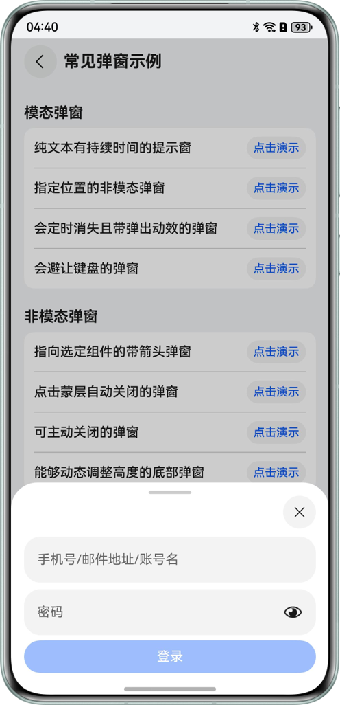


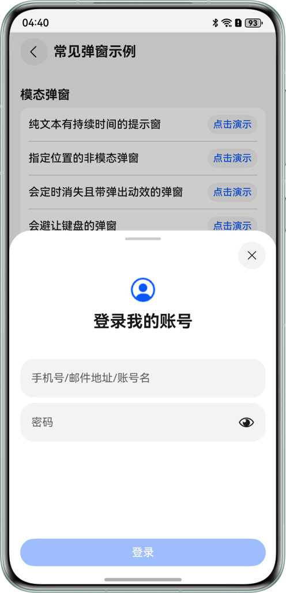

#### 应用感知弹窗的打开、关闭
- 对弹窗实例增加生命周期，拦截弹窗的展示与销毁。this.sensorDialog?.addLifeCycleListener({
  onWillShow: () => {
 this.isSensorDialogShow = true
 return true;
  },
  onWillDismiss: (reason: DialogDismissReason) => {
 this.isSensorDialogShow = false
 return true;
  }
})
- 直接获取弹窗状态// SHOW: 显示，HIDE: 隐藏， DEFAULT: 默认状态
this.sensorDialog?.getStatus();

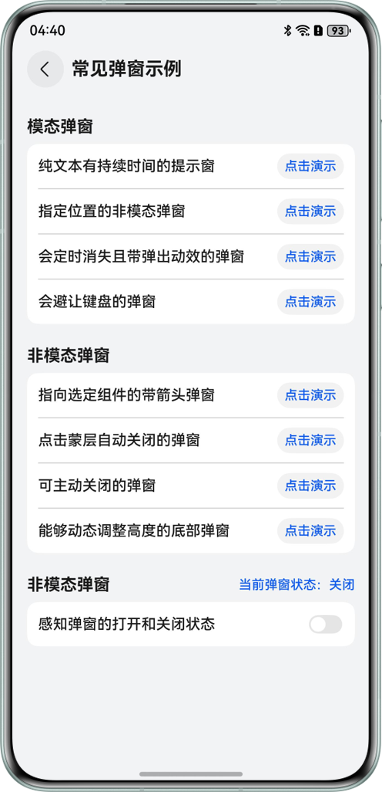


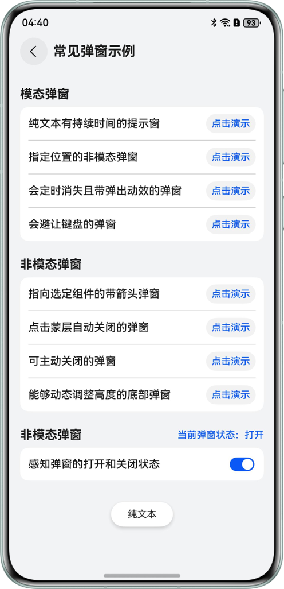

#### 弹窗与周边的交互
#### 弹窗存在时如何定义返回手势是退出页面或关闭弹窗
配置状态变量backCloseDialog，设置true表示返回手势作用于弹窗，false表示作用于页面。

```ArkTS
@State backCloseDialog: boolean = false;
```

在onBackPressed()中拦截手势并选择是退出页面还是关闭最上层弹窗

```ArkTS
.onBackPressed(() => {
  if (this.backCloseDialog) {
    let tmp: DialogBackPressResult = DialogHub.dispatchBackPressToDialog();
    if (tmp !== DialogBackPressResult.NO_DIALOG) {
      return true;
    }
  }
  this.pageInfos.pop();
  return true;
})
```

#### 用户可以透过弹窗内容操作页面
弹出Toast类型的弹窗，或者主动调用setConfig()设置passThroughGesture为true，可实现弹窗内容透传手势。

```ArkTS
let passThroughGestureDialog = DialogHub.getCustomDialog()
  .setOperableContent(wrapBuilder(SimpleCustomBuilder), (action: DialogAction) => {
    return new SimpleCustomParams('弹窗', '可透传弹窗', () => {
      action.dismiss()
    })
  })
  .setConfig({
    dialogBehavior: {
      passThroughGesture: true
    }
  })
  // ...
  .build();
```


```ArkTS
DialogHub.createCustomTemplate(CommonConstant.CUSTOM_TEMPLATE_SIMPLE)
  .setContent(wrapBuilder(TextToastBuilder))
  .setStyle({ backgroundColor: Color.White })
  .setConfig({ dialogBehavior: { passThroughGesture: true, isModal: false } })
```

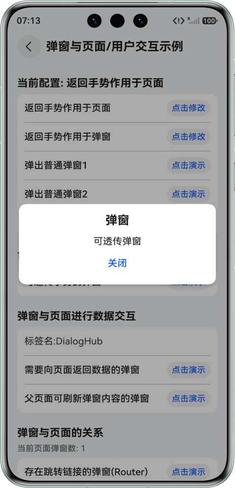

#### 需要向页面返回数据的弹窗
给Builder参数传递修改页面数据的回调函数，在Builder里面进行调用。

```ArkTS
this.returnDataDialog = DialogHub.getCustomDialog()
  .setOperableContent(wrapBuilder(InputCallbackBuilder), (action: DialogAction) => {
    let parms = new InputCallbackParams(CommonConstant.UPDATE_TAG, () => {
      action.dismiss();
    }, (value) => {
      this.tagName = value;
    })
    return parms;
  })
  .setStyle({
    radius: $r('app.float.InputCallbackBuilderBorderRadius')
  })
  .setConfig({ dialogBehavior: { isModal: true, autoDismiss: false } })
  .build();
this.returnDataDialog.show();
```

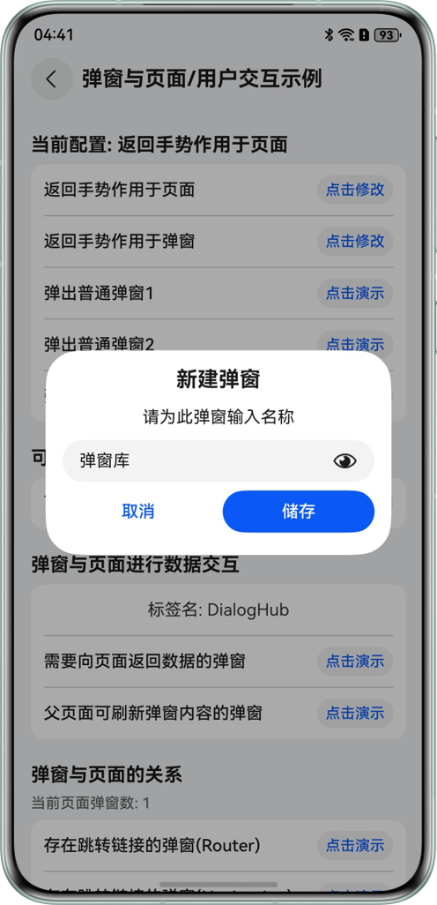


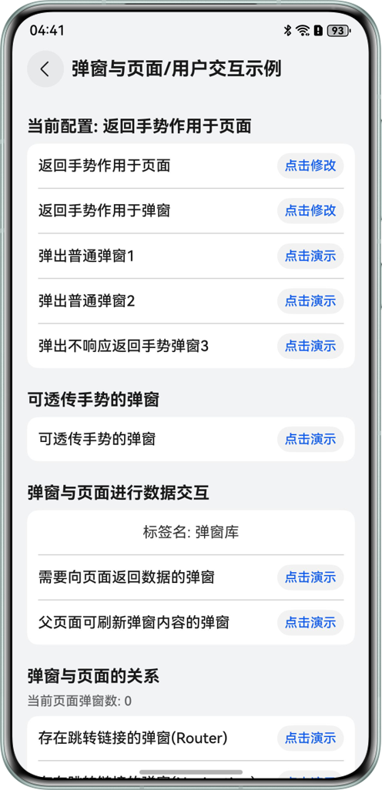

#### 父页面刷新正在展示的弹窗内容
修改Builder参数内容，再调用updateContent()进行修改。

```ArkTS
let params = new ProgressParams(CommonConstant.ProgressName, CommonConstant.ProgressNameStart,
  CommonConstant.ProgressNameTotal);

this.updateByParentDialog = DialogHub.getCustomDialog()
  .setContent(wrapBuilder(ProgressBuilder), params)
  .setStyle({ radius: $r('app.float.ProgressBuilderProgressBorderRadius') })
  .setConfig({ dialogBehavior: { isModal: true, autoDismiss: false } })
  .build();
this.updateByParentDialog.show();
this.intervalID = setInterval(() => {
  params.value += 1
  if (params.value >= CommonConstant.ProgressNameTotal && this.intervalID >= 0) {
    this.updateByParentDialog?.dismiss();
    clearInterval(this.intervalID);
  }
  this.updateByParentDialog?.updateContent(params);
}, CommonConstant.Interval_20);
```

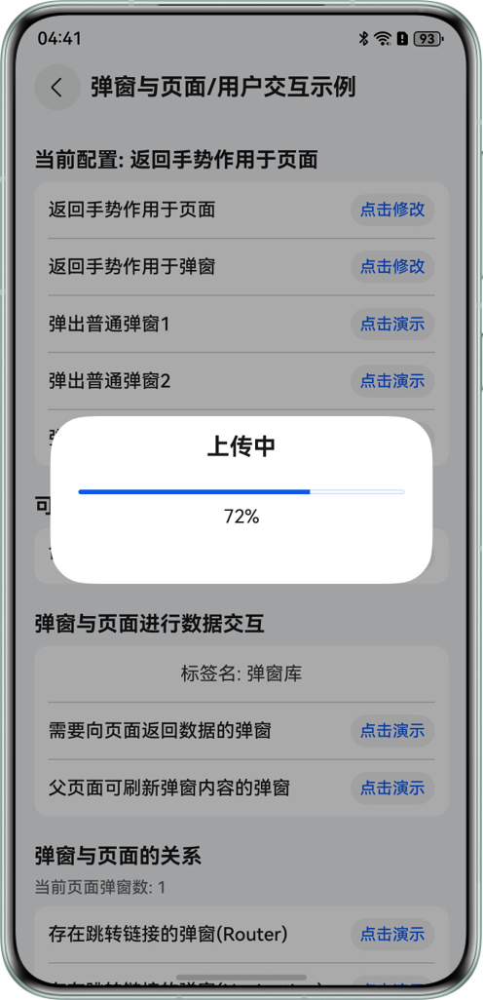

#### 页面需要感知当前页面是否存在弹窗
DialogHub注册页面弹窗数监听，当前页面弹窗数量发生变化会触发。

```ArkTS
DialogHub.addEventListener({
  OnCurentPageDialogNumberChange: (newNum: number, oldNum: number) => {
    this.dialogNum = newNum;
  }
})
```

#### 存在跳转链接的弹窗
点击弹窗上特定内容，跳转到其他页面。
router：在弹窗Builder里通过router模板跳转。
Navigation：将pageInfos传入弹窗Builder，然后在弹窗里进行push页面。

```ArkTS
let parms = new SkipParams(() => {
  this.skipDialog?.dismiss();
}, 1, this.pageInfos);
this.skipDialog?.updateContent(parms);
this.skipDialog?.updateConfig({
  dialogPosition: { offset: { dx: 0, dy: 0 } }
});
this.skipDialog?.show();
```

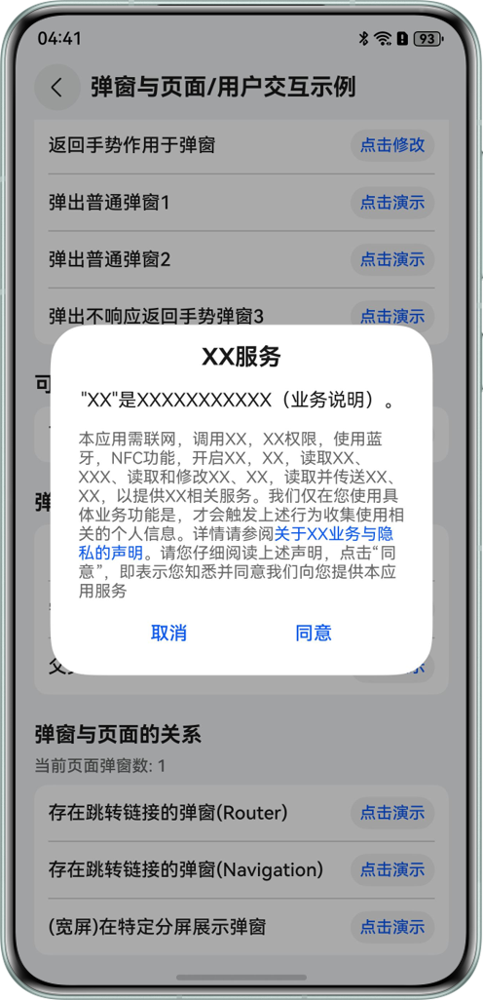

#### 折叠屏展开态不同位置的弹窗
弹窗默认在屏幕中间；通过设置弹窗偏移量可以在不同位置进行弹窗。
弹窗在左半屏：

```ArkTS
let parms = new SkipParams(() => {
  this.skipDialog?.dismiss()
}, 1, this.pageInfos);
this.skipDialog?.updateContent(parms);
this.skipDialog?.updateConfig({
  dialogPosition: { offset: CommonConstant.LEFT_DIALOG_OFFSET }
});
this.skipDialog?.show();
```

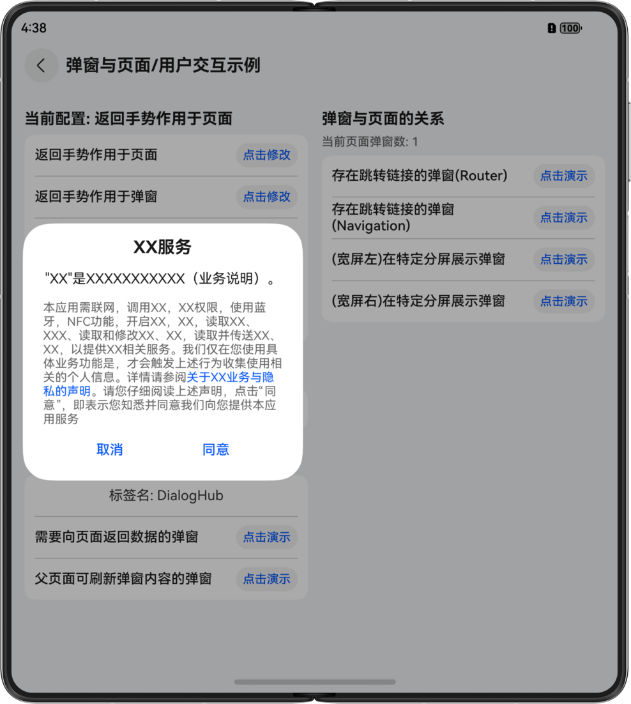
弹窗在右半屏：

```ArkTS
let parms = new SkipParams(() => {
  this.skipDialog?.dismiss();
}, 1, this.pageInfos);
this.skipDialog?.updateContent(parms);
this.skipDialog?.updateConfig({
  dialogPosition: { offset: CommonConstant.RIGHT_DIALOG_OFFSET }
});
this.skipDialog?.show();
```

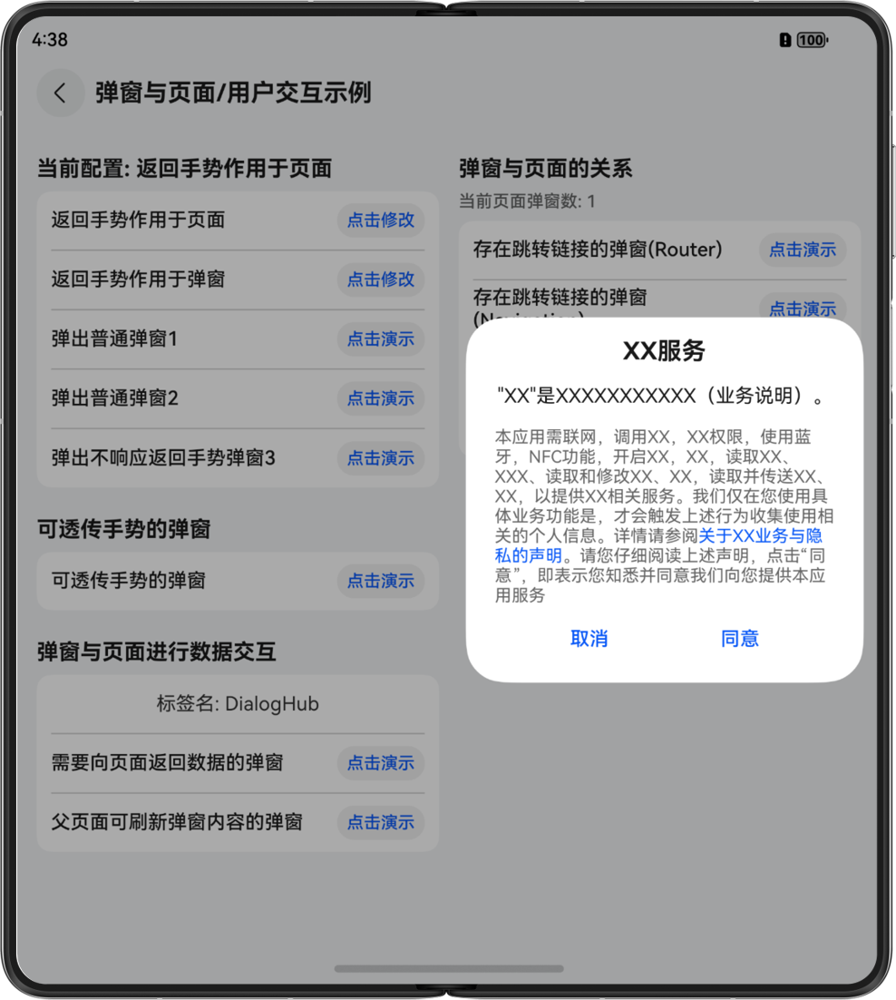

#### 弹窗内容复用场景
#### 通过自定义弹窗模版进行弹窗
- 创建弹窗模板DialogHub.createToastTemplate(CommonConstant.MY_TEMPLATE_NAME)
  .setTextContent(CommonConstant.TOAST_DISPLAYED_CONTENT)
 // ...
  .setDuration(CommonConstant.TOAST_DISPLAY_DURATION)
  .register();
- 直接弹出模板DialogHub.getToastTemplate(CommonConstant.MY_TEMPLATE_NAME)?.build().show();
- 删除弹窗模板DialogHub.removeTemplate(CommonConstant.MY_TEMPLATE_NAME);
- 随机修改弹窗模板背景色let r = (Math.ceil(Math.random() * 239 + 16) % 255).toString(16);
let g = (Math.ceil(Math.random() * 239 + 16) % 255).toString(16);
let b = (Math.ceil(Math.random() * 239 + 16) % 255).toString(16);
let color = '#ff' + r + g + b;
DialogHub.updateToastTemplate(CommonConstant.MY_TEMPLATE_NAME)?.setStyle({
  backgroundColor: color
}).register();
- (可选)通过弹窗模板，定义本次弹出动画后弹出DialogHub.getToastTemplate(CommonConstant.MY_TEMPLATE_NAME)?.setAnimation({
  dialogAnimation: AnimationType.UP_DOWN
}).build().show();

#### 定义一个可复用的弹窗
将弹窗实例对象记录，下次弹窗复用。

```ArkTS
originalTemplateDialog?: InfToast;
```


```ArkTS
this.originalTemplateDialog =
  DialogHub.getToastTemplate(CommonConstant.MY_TEMPLATE_NAME)?.build();
```


```ArkTS
this.originalTemplateDialog?.show();
```

#### 多个弹窗并存场景
#### 新弹窗被已有弹窗抑制
- **弹窗A弹出时抑制弹窗B的弹出**可以通过弹窗A对象的getStatus()方法获取弹窗A的状态，以判断是否允许弹窗B弹出。 if (this.dialogA?.getStatus() != DialogStatus.SHOW) {
  this.dialogB?.show();
}
- **当前页面存在弹窗时抑制弹窗C的弹出**通过调用DialogHub的getCurrentPageDialogs()方法获取当前页面的弹窗数量，判断数量是否为0，并据此控制弹窗C的弹出。 if (DialogHub.getCurrentPageDialogs().length === 0) {
  this.dialogC?.show();
}

#### 开发者可以控制弹窗层级实现弹窗的相互覆盖
- 设置弹窗层级setLayerIndex()this.dialogF = this.dialogF ??
this.createMessageBuilder(CommonConstant.DIALOG_F, CommonConstant.DIALOG_F_CONTENT)
  .setLayerIndex(CommonConstant.DIALOG_F_LAYER_INDEX)
  .build();
- 设置置顶弹窗OLD_FIRST (老置顶弹窗优先，新的置顶弹窗无法弹出)this.dialogG = this.dialogG ??
this.createMessageBuilder(CommonConstant.DIALOG_G, CommonConstant.DIALOG_G_CONTENT).setConfig({
  dialogBehavior: {
 layerPolicy: { alwaysTop: true, topDialogPriority: TopDialogPriority.OLD_FIRST }
  }
}).build();
- 设置置顶弹窗NEW_FIRST (新弹窗优先，新的置顶弹窗弹出，老置顶弹窗被覆盖)this.dialogH = this.dialogH ??
this.createMessageBuilder(CommonConstant.DIALOG_H, CommonConstant.DIALOG_H_CONTENT).setConfig({
  dialogBehavior: {
 layerPolicy: { alwaysTop: true, topDialogPriority: TopDialogPriority.NEW_FIRST }
  }
}).build();

#### 常见问题
#### 如何处理弹窗的获焦问题
- 对于Sheet类别的弹窗，弹窗弹出后的焦点行为与系统BindSheet保持一致；
- DialogHub提供的其他类别弹窗，如CustomDialog，在弹窗弹出时父页面的焦点默认不会转移到弹窗上。开发者可以配置弹窗的requestFocusWhenShow属性实现：弹窗弹出时，将页面的焦点转移到弹窗中。进而实现会避让键盘的弹窗的效果。

#### Popup绑定组件，id报错
[组件标识id](https://developer.huawei.com/consumer/cn/doc/harmonyos-references/ts-universal-attributes-component-id#id)需要开发者保证唯一性。setComponentTargetId()设置绑定的组件id后，如果id有问题，会导致在show的时候报错且弹窗位置异常。
- id不存在：不存在此id的节点，排查绑定组件是否设置该id属性。错误码70000001。

#### 调用build()与show()接口后，无法继续添加属性
调用build()接口后返回的是Dialog实例，只提供更新配置的接口。

#### removeTemplate()后，使用模板创建的弹窗实例可以继续显示
删除模板不影响之前通过模板已经创建的弹窗的显示和相关调用。

#### 调用isTemplateExist()判断模板存在，getxxxTemplate模板报错50000003
模板创建和获取时，需要保证弹窗类型一致，否则无法获取模板并报错，错误码50000003。
可在获取模板前调用queryTemplate()查询模板的弹窗类型。

#### Toast弹窗置顶策略
Toast弹窗默认为置顶弹窗，且置顶冲突策略为TopDialogPriority.NEW_FIRST。

#### 键盘避让模式变化
在使用DialogHub进行弹窗后，会将页面键盘避让模式修改为RESIZE，当页面无弹窗或者页面跳转时，避让模式还原。

#### 弹窗如何处理用户的返回手势
开发者可以通过Dialoghub.init(xxx，xx)设置不同的[弹窗模式](https://gitcode.com/openharmony-sig/dialoghub/blob/master/docs/Reference.md#dialogmode枚举说明)，不同的模式下处理措施不同。
- DialogMode.OverlayManager（默认）模式下，返回手势会优先作用于页面，由页面消费该事件。处理方法如下：在页面的onBackPress()中调用dispatchBackPressToDialog()方法将事件传递给弹窗。在弹窗的onWillDismiss()方法中，针对【DialogDismissReason.PRESS_BACK】原因，对返回手势进行处理。
- DialogMode.CustomDialog模式下，返回手势会作用于弹窗，由弹窗消费该事件。处理方法如下： 直接在弹窗的onWillDismiss()方法中，针对【DialogDismissReason.PRESS_BACK】原因，对返回手势进行处理在弹窗的onWillDismiss()方法中继续处理页面操作，如通过页面栈进行处理。

#### 示例代码
- [基于DialogHub实现通用弹窗库案例](https://gitcode.com/harmonyos_samples/DialogHub)