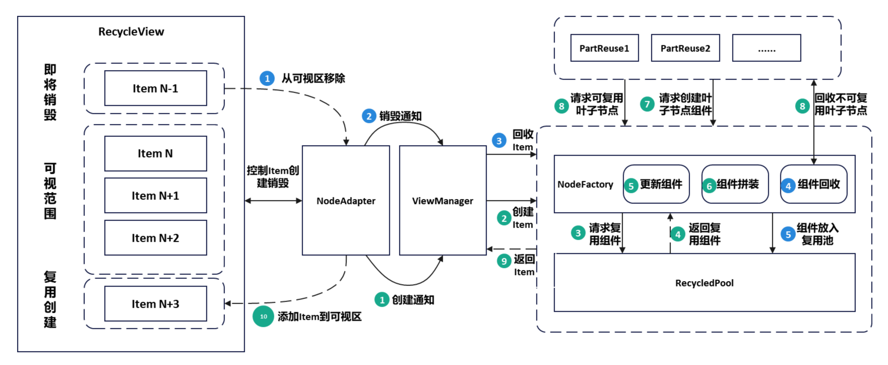
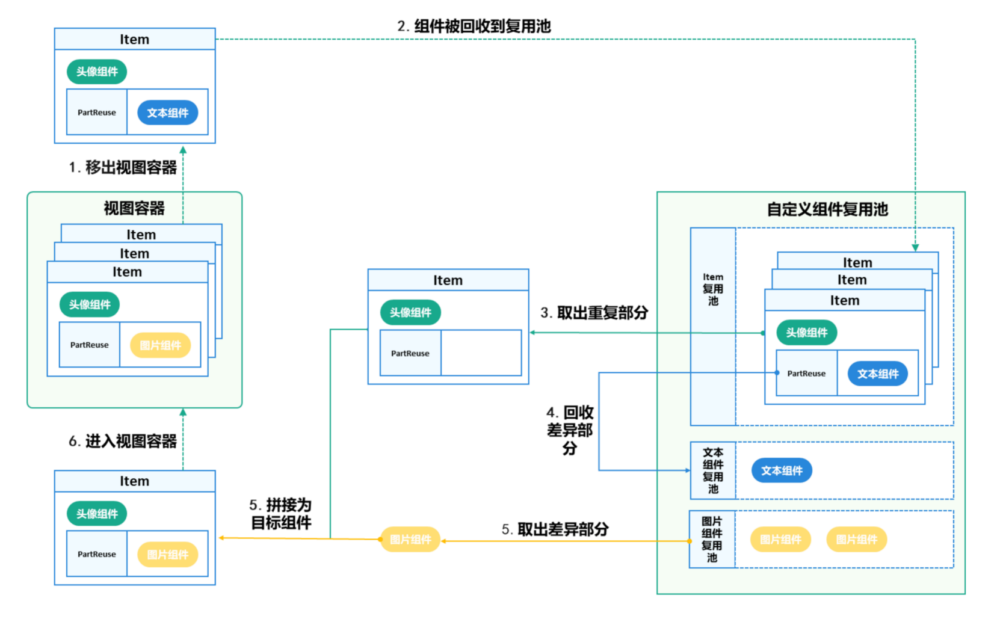
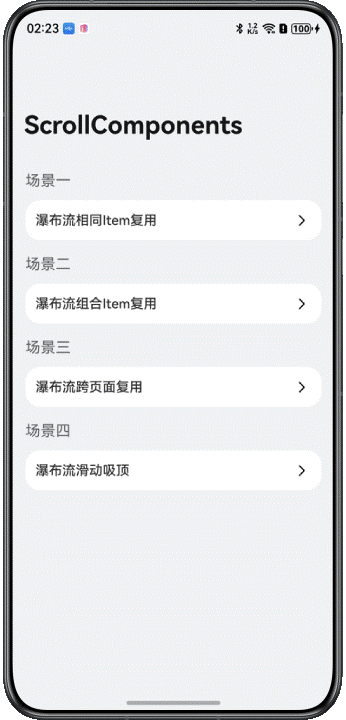
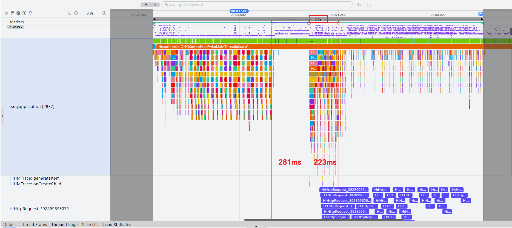
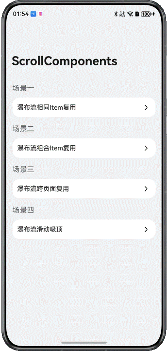
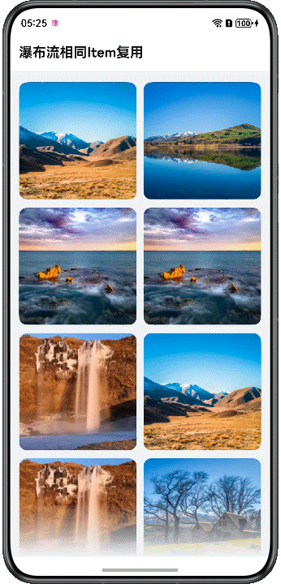

# 基于ScrollComponents实现瀑布流

更新时间：2026-03-12 08:45:02

来源：https://developer.huawei.com/consumer/cn/doc/best-practices/bpta-waterflow-based-on-scrollcomponents

## 概述


瀑布流是应用开发中常见的开发场景。通过容器的布局规则，将元素自上而下排列，形成多列不齐的界面，内容像瀑布一样从上而下倾泻。

瀑布流适用于展示图片资讯、购物商品、直播视频等多种数据。当瀑布流上下滑动时，无限加载特性使其能展示大量数据；不同大小的子元素会带来测量和绘制的性能消耗。本文通过跨页面复用、加速首屏渲染、无限滑动、下拉刷新、上拉加载等场景，介绍ScrollComponents库创建高流畅滑动的瀑布流页面。

ScrollComponents作为高性能滑动解决方案，主要解决组件复用的问题，支持通过少量的代码实现高性能滑动，同时开发者无需关注复用池管理和其他性能优化方案的交互细节。可以参考ScrollComponents使用说明进行安装配置与快速上手。ScrollComponents框架提供了下列功能特性：

- 支持WaterFlow页面的流畅滑动
- 默认支持懒加载，开发者不用使用[LazyForEach](https://developer.huawei.com/consumer/cn/doc/harmonyos-references/ts-rendering-control-lazyforeach)和定义IDataSource数据源，减少一定的代码量
- 支持组件复用，解决滑动丢帧，提升滑动性能
- 支持复用池共享，满足跨页面跨父组件复用能力
- 支持预创建，减少冷启动首次滑动丢帧，提升滑动性能
- 支持预加载，滑动过程提前加载数据，提升浏览体验


ScrollComponents三方库基于系统NodeAdapter、BuilderNode、FrameNode、Prefetcher、FrameCallback的能力，通过高效率组件复用、组件分帧预创建、内容动态预创建、懒加载等方式，实现高性能滑动。同时基于系统FrameNode创建WaterFlow组件的能力，提供了WaterFlowManager接口支持瀑布流页面渲染，为开发者提供WaterFlow组件的其他各种能力，在满足开发者正常开发的前提下简化用法，便于后续能力扩展。


## 实现原理


### 关键技术


ScrollComponents三方库底层封装NodeContainer+FrameNode，结合NodeAdapter+BuilderNode+自定义复用池实现懒加载、组件复用、组件预创建等能力，同时为开发者提供WaterFlowManager视图管理组件，为开发者提供系统滑动组件的其他各种能力，在满足开发者正常开发的前提下提供高性能的滑动能力，只需传入数据源和viewManager即可快速实现懒加载和组件复用的开发，可以更加聚焦业务实现。

如图1是RecyclerView整体流程图，当节点从可视区移除时，NodeAdapter会通知视图管理器将组件回收，经NodeFactory回收处理之后，组件最终被存入到组件复用池。当节点需要创建时，NodeAdapter通知视图管理器开始创建，NodeFactory会向复用池请求复用节点，获取到节点之后经过一系列更新组件、组件拼接之后返回，最后由NodeAdapter将节点添加到可视区。

图1 RecyclerView整体流程图




### 开发流程


1. 创建瀑布流视图管理器。WaterFlowManager仅具备基础的视图能力，开发者需自定义一个继承自WaterFlowManager的类，可以实现onWillCreateItem()方法，从复用池获取组件，开启复用能力，具体参考[复用子节点模板](#li18448145318540)。 创建视图管理器的实例对象中，defaultNodeItem属性表示默认节点模板名称，context属性表示UI上下文。
```text
import { NodeItem, RecyclerView, WaterFlowManager } from '@hadss/scroll_components';
class MyWaterFlowManager extends WaterFlowManager {
onWillCreateItem(index: number, data: BlogData) {
// ...
}
}
@Entry
@Component
struct StandardWaterFlowPage {
waterFlowView: MyWaterFlowManager = new MyWaterFlowManager({
defaultNodeItem: 'StandardGridImageContainer',
context: this.getUIContext()
});
// ...
}
```


> [!NOTE]
> 如果开发者想通过ScrollComponents快速创建瀑布流，方便使用懒加载、预创建等提升滑动效率的能力，而不考虑组件复用，则直接使用ScrollComponents库提供的WaterFlowManager创建瀑布流视图管理器即可。具体可参考[ScrollComponents使用说明-快速开始](https://gitcode.com/openharmony-sig/scroll_components/blob/master/README.md#快速开始)。


2. WaterFlow组件初始化页面初始化时，开发者通过视图管理器的setViewStyle()方法，给瀑布流组件设置属性。
```ts
this.waterFlowView
  .setViewStyle({ scroller: this.scroller })
  .height(CommonConstants.FULL_HEIGHT)
  .columnsTemplate(CommonConstants.WATER_FLOW_COLUMNS_TEMPLATE)
  .columnsGap(CommonConstants.COLUMNS_GAP)
  .rowsGap(CommonConstants.ROWS_GAP)
  .padding({
    top: CommonConstants.PADDING,
    left: CommonConstants.PADDING,
    right: CommonConstants.PADDING,
  })
  .fadingEdge(true, { fadingEdgeLength: LengthMetrics.vp(80) });
```
3. 设置数据源渲染组件通过视图管理器的setDataSource()方法设置数据。ScrollComponents库默认支持懒加载，提供了基于懒加载的数据增删改查能力，开发者无需关心LazyForEach的使用限制，无需定义DataSource，引入即用。懒加载接口可参考：[基于NodeAdapter为视图管理器提供懒加载能力](https://gitcode.com/openharmony-sig/scroll_components/blob/master/docs/Reference.md#lazynodeadapter-类)。
4. 通过视图管理器的registerNodeItem方法注册item子节点模板，需要传入模板名称和子节点@Builder构造函数。
5. ScrollComponents提供了视图占位组件 RecyclerView，RecyclerView绑定视图容器实例即可渲染瀑布流列表。


```ts
import { NodeItem, RecyclerView, WaterFlowManager } from '@hadss/scroll_components';
@Entry
@Component
struct StandardWaterFlowPage {
  waterFlowView: MyWaterFlowManager = new MyWaterFlowManager({
    defaultNodeItem: 'StandardGridImageContainer',
    context: this.getUIContext()
  });
  // ...
  @State dataArray: BlogData[] = [] // Bind data source for data iteration

  aboutToAppear(): void {
    // ...
    generateRandomBlogData().then((data: BlogData[]) => {
      this.waterFlowView.setDataSource(data);
      this.dataArray = data;
    });
    this.waterFlowView.registerNodeItem('StandardGridImageContainer', wrapBuilder(StandardGridImageContainer));
    // ...
  }

  // ...
  build() {
    Column() {
      // ...

      RecyclerView({
        viewManager: this.waterFlowView
      })

    }
    .height(CommonConstants.FULL_HEIGHT)
    .backgroundColor($r('app.color.home_background_color'))
  }
}
// Define an item template
@Builder
function StandardGridImageContainer($$: Params) {
  GridImageView({ blogItem: $$.blogItem })
}
```


> [!NOTE]
> 1. 注册子节点模板registerNodeItem()方法中使用的@Builder函数目前仅支持全局定义。
>  2. 开发者如果使用this.waterFlowView.preCreate()实现组件预创建，则需要在registerNodeItem()方法注册节点模板后使用。


 复用子节点模板
开发者自定义模板后，在定义瀑布流视图管理器时需要实现onWillCreateItem接口，并在此接口中通过dequeueReusableNodeByType()获取可复用node，实现组件复用，同时也需要在复用组件的aboutToReuse生命期中，对数据进行更新。
1. 列表项结构类型相同如果复用的FlowItem组件结构相同，直接注册节点模板。
```ts
class MyWaterFlowManager extends WaterFlowManager {
  onWillCreateItem(index: number, data: BlogData) {
    let node: NodeItem<Params> | null = this.dequeueReusableNodeByType('StandardGridImageContainer');
    node?.setData({ blogItem: data });
    return node;
  }
}
@Entry
@Component
struct StandardWaterFlowPage {
  waterFlowView: MyWaterFlowManager = new MyWaterFlowManager({
    defaultNodeItem: 'StandardGridImageContainer',
    context: this.getUIContext()
  });
  // ...

  aboutToAppear(): void {
    // ...
    this.waterFlowView.registerNodeItem('StandardGridImageContainer', wrapBuilder(StandardGridImageContainer));
    // ...
  }

  // ...
}
// Define an item template
@Builder
function StandardGridImageContainer($$: Params) {
  GridImageView({ blogItem: $$.blogItem })
}
```
2. 列表项内子组件可拆分组合如果复用的FlowItem组件结构基本相同，存在部分差异，比如头部和尾部组件展示相同，中间内容有渲染Text组件或者Image组件，通常需要定义两个不同的@Builder函数与之对应实现复用。在这个场景下，ScrollComponents提供了PartReuse来保证命中组件复用，只需要定义一个@Builder函数。具体可参考[组件复用-列表项子组件可拆分](https://gitcode.com/openharmony-sig/scroll_components/blob/master/README.md#列表项内子组件可拆分)。 当组件将要被销毁时，会移出视图容器并进入到item复用池。当组件将要被创建时，会向item复用池获取item节点，当item节点和目标节点类型存在差异时，会先将差异部分即PartReuse中的组件回收到对应的组件复用池，然后将目标组件所需要的差异组件从对应组件复用池中取出，并和item节点拼接，成为目标组件，并进入到视图容器中。
**图2 **可拆分组件复用创建流程图


 开发者可参考图3日志打印"generateItem reuse "表示复用，检验是否复用成功。
**图3 **日志效果图


> [!NOTE]
> 日志默认不开启，开启日志需要在WaterFlowManager的初始化方法中设置Config参数，将debug设置为true。


```text
import { NodeItem, PartReuse, RecyclerView, WaterFlowManager } from '@hadss/scroll_components';
@Component
struct BlogItem {
@State blogItem: BlogData = new BlogData()

// In reusable components, you must use aboutToReuse to update data, just like native recycling.
aboutToReuse(params: ESObject): void {
this.blogItem = params.blogItem;
}

aboutToRecycle(): void {
this.blogItem.callback = undefined;
this.blogItem.fetchUrl = ImageContent.EMPTY;
}

build() {
Column({ space: 12 }) {
HeaderComponent({ blogItem: this.blogItem })
if (this.blogItem?.content.length > 0) {
// cache component.
PartReuse({
type: 'AdaptiveTextComponent',
builder: wrapBuilder(AdaptiveTextComponentContainer),
data: { blogItem: this.blogItem }
})
}
if (this.blogItem?.images && this.blogItem.images.length > 0) {
PartReuse({
type: 'GridImageViewContainer',
builder: wrapBuilder(GridImageViewContainer),
data: { blogItem: this.blogItem }
})
}

BottomContent({ blogItem: this.blogItem })
}
.padding(12)
.backgroundColor(Color.White)
.borderRadius(12)
}
}
@Builder
export function AdaptiveTextComponentContainer($$: Params) {
AdaptiveTextComponent({ blogItem: $$.blogItem })
}
@Builder
function GridImageViewContainer($$: Params) {
GridImageView({ blogItem: $$.blogItem })
}
```
3. 列表项结构类型不同如果FlowItem结构差异较大，包括布局差异大、差异的组件数量较多、组件类型不同等因素，导致直接复用同一个FlowItem困难，则可定义多个复用模板。
```ts
class MyWaterFlowManager extends WaterFlowManager {
  onWillCreateItem(index: number, data: BlogData) {
    let node: NodeItem<Params>
    if (index % 2 === 0) {
      node = this.dequeueReusableNodeByType('ImageContainer');
    } else  {
      node = this.dequeueReusableNodeByType('TextContainer');
    }
    node?.setData({ blogItem: data });
    return node;
  }
}
@Entry
@Component
struct MultiFlowItemPage {
  waterFlowView: MyWaterFlowManager = new MyWaterFlowManager({
    defaultNodeItem: 'ImageContainer',
    context: this.getUIContext()
  });
  scroller: Scroller = new Scroller();
  @State dataArray: BlogData[] = [] // Bind data source for data iteration

  aboutToAppear(): void {
    this.initView();
    taskpool.execute(generateRandomBlogData).then((data: ESObject) => {
      this.dataArray = data;
      this.waterFlowView.setDataSource(data);
    })

    this.waterFlowView.registerNodeItem('ImageContainer', wrapBuilder(ImageContainer));
    this.waterFlowView.registerNodeItem('TextContainer', wrapBuilder(TextContainer));

    // ...
  }

  initView() {
    this.waterFlowView.setViewStyle({ scroller: this.scroller })
    // ...
  }

  build() {
    Column() {
      RecyclerView({
        viewManager: this.waterFlowView
      })
    }
    .height(CommonConstants.FULL_HEIGHT)
    .backgroundColor($r('app.color.home_background_color'))
  }
}
// Reusable Image Component Template.
@Builder
function ImageContainer($$: Params) {
  ImageContainerView({ blogItem: $$.blogItem })
}
// Reusable Text Component Template.
@Builder
function TextContainer($$: Params) {
  TextContainerView({ blogItem: $$.blogItem })
}
```


## 瀑布流跨页面复用场景


### 场景描述


开发者可能存在多个页面间复用WaterFlow，比如Tab栏切换。ScrollComponents提供了全局复用能力。

图4 效果图


### 开发步骤


1. 定义复用池单例。ScrollComponents默认会生成一个RecycledPool对象，通过定义复用池单例存储该pool对象，提供跨页面使用。以下单例仅做参考，开发者可自行封装。
```ts
import { RecycledPool } from '@hadss/scroll_components';

export class Utils {
  // ...
  private static utils_: Utils;
  nodePool: RecycledPool | null = null;
  // ...
}
```
2. 在首个瀑布流页面使用复用池单例保存RecycledPool对象。WaterFlowManager提供getRecyclePool()方法可获取RecyclePool对象，然后存储到全局单例中。
```ts
if (Utils.getInstance().nodePool) {
  // Registration Reuse Pool
  this.waterFlowView.registerRecyclePool(Utils.getInstance().nodePool!);
} else {
  Utils.getInstance().nodePool = this.waterFlowView.getRecyclePool();
}
```
3. 跨页面共享单例中的RecyclePool对象。跨页面使用registerRecyclePool()方法，将全局单例中的RecyclePool对象注册到该页面定义的WaterFlow视图类对象上，实现跨页面不同RecyclerView视图的复用池共享。
```ts
@Component
export struct SharedPoolSecondPage {
  waterFlowView: MyWaterFlowManager = new MyWaterFlowManager({
    defaultNodeItem: 'TestBlogItemContainer',
    context: this.getUIContext()
  });
  // ...

  aboutToAppear(): void {
    // ...
    if (Utils.getInstance().nodePool) {
      // Registration Reuse Pool.
      this.waterFlowView.registerRecyclePool(Utils.getInstance().nodePool!);
    } else {
      Utils.getInstance().nodePool = this.waterFlowView.getRecyclePool();
    }
    // ...
  }

  // ...
}
```


## 瀑布流加速首屏渲染场景


### 场景描述


冷启动后首次打开瀑布流页面，由于页面的图片或者视频等媒体资源过多，出现白屏或者白块，等好几秒才慢慢刷出内容。ScrollComponents库支持组件预创建，能打开页面后瞬间看到文字、图片骨架，减少卡顿。

图5 效果图




### 开发步骤


通过preCreate()方法对复用模板进行预创建，核心代码参考如下：

```ts
aboutToAppear(): void {
  // ...
  // register components.
  this.waterFlowView.registerNodeItem('BlogItemContainer', wrapBuilder(BlogItemContainer));
  this.waterFlowView.registerNodeItem('AdaptiveTextComponent', wrapBuilder(AdaptiveTextComponentContainer));
  this.waterFlowView.registerNodeItem('GridImageViewContainer', wrapBuilder(GridImageViewContainer));

  this.waterFlowView.preCreate('BlogItemContainer', 30);
  this.waterFlowView.preCreate('AdaptiveTextComponent', 30);
  this.waterFlowView.preCreate('GridImageViewContainer', 30);
  // ...
}
```


### 性能测试


加载相同数据冷启动场景完成时延情况，通过延迟1s模拟冷启动后网络请求场景。

@Reusable：网络请求期间主线程大段空闲，请求结束后首屏组件绘帧耗时较长。

图6 @Reusable测试结果


ScrollComponents：网络请求期间主线程空闲较少，请求结束后首屏组件绘帧耗时较短

图7 ScrollComponents测试结果




|  | 冷启动完成时延 | 主线程空闲时间 | 首屏组件创建时间 |
| --- | --- | --- | --- |
| ScrollComponents | 2.5s | 281ms | 223ms |
| @Reusable | 2.8s | 997ms | 467ms |


可以看出，ScrollComponents在冷启动场景下，完成时延优于原生@Reusable。整体完成时延优化300ms。


## 瀑布流无限滑动场景


### 场景描述


当瀑布流页面存在大量图片或视频时，下滑到列表最底端，再快速下滑可能会引起“滑动白块”的现象。尤其用户使用大量在线数据，在弱网和快速滑动的情况下，滑动过程中白块现象更明显。

为了减少快速滑动过程中网络不好产生的白块，ScrollComponents内置了内容预取能力Prefetcher，支持动态自适应网络状态。通过提前下载图片或资源，确保资源在需要时立即显示，减少白块出现。动态预加载适用于数据请求耗时较长的场景，如滑动列表中包含大量图片资源。

图8 效果图


### 开发步骤


1. 创建组件实例时，注册fetch和cancel回调到视图管理器，并设置数据源。
```ts
// Registers the callback that prefetcher invokes when a data referenced by a data source item needs to be fetched.
this.waterFlowView.registerFetchCallback(this.fetchCallback);
/**
 * Registers the callback that prefetcher invokes when a specific fetch should be
 * canceled to avoid wasting system resources, such as network bandwidth.
 */
this.waterFlowView.registerCancelCallback(this.cancelCallback);
taskpool
  .execute(generateRandomBlogData)
  .then((data: ESObject) => {
    this.data = data;
    this.waterFlowView.setDataSource(data);
  })
  .catch((err: Error) => {
    const error = err as BusinessError;
    Logger.error(
      `generateRandomBlogData failed, code = ${error.code} message = ${error.message}`,
    );
  });
```
2. 实现fetchCallback()和cancelCallback()方法。
```ts
fetchCallback: (item: ESObject, fetchId: number) => Promise<void> = (item: ESObject, fetchId: number) => {
  let data = item as BlogData;
  if (data.images.length == 0) {
    return Promise.resolve();
  }
  let url = data.images[0];
  if (this.imageCaches.has(url)) {
    // If cached, skip re-downloading and load the data directly.
    if (data.callback) {
      data.callback(this.imageCaches.get(url));
    } else {
      data.fetchUrl = this.imageCaches.get(url) as string
    }
    return Promise.resolve();
  }
  this.fetches.set(fetchId, data);
  this.fetchAgent.postMessageWithSharedSendable({
    type: 'fetch',
    cachePath: this.cachePath,
    url: data.images[0],
    fetchId: fetchId
  });
  return Promise.resolve();
}
cancelCallback: (fetchId: number) => void = (fetchId: number) => {
  this.fetches.delete(fetchId);
  this.fetchAgent.postMessageWithSharedSendable({ type: 'cancel', fetchId: fetchId });
}
```
3. 监听滑动组件子组件变化事件。
```ts
this.waterFlowView
  .setViewStyle({
    scroller: this.scroller,
  })
  // ...
  .onScrollIndex((start: number, end: number) => {
    if (end > 0) {
      /**
       * Call this method when the visible area boundaries change.
       * The prefetcher will start prefetching after the first call to this method
       * in all cases where the autoStart option is not set to false.
       */
      this.waterFlowView.visibleAreaChanged(start, end);
    }
    // ...
  })
  .onVisibleAreaChange([0.0, 1.0], (isVisible: boolean) => {
    /**
     * By default, the prefetcher begins invoking user code to fetch data with the first call to the visibleAreaChanged method.
     * Sometimes, this can waste resources because, in practice, onScrollIndex triggers the callback even when the component is not actually visible to the user.
     * To avoid this, subscribe to the onVisibleAreaChange event.
     */
    if (isVisible) {
      // Call this method to start prefetching.
      this.waterFlowView.nodeAdapter.prefetcher?.start();
    } else {
      // Call this method to stop prefetching. For instance, this should be done if a related component becomes invisible.
      this.waterFlowView.nodeAdapter.prefetcher?.stop();
    }
  });
```
4. 修改数据结构。
```ts
// Preload images using prefetch.
Image(this.fetchUrl)
  .sourceSize({ width: 100, height: 100 })
  .width(CommonConstants.FULL_WIDTH)
  .aspectRatio(1)
  .objectFit(ImageFit.Cover);
```


### 性能测试


中网和弱网下，瀑布流页面使用相同数据上拉加载滑动，ScrollComponents提供的prefetch能力和不使用prefetch能力，时长超过100ms和超过40ms的白块结果如表2：

- 中网：使用ScrollComponents提供prefetch能力的白块率降低10%；
- 弱网:  使用ScrollComponents提供prefetch能力的白块率降低17%；


|  | 白块加载时长 | 白块率 | 降低值 |  |
| --- | --- | --- | --- | --- |
| 原生 | prefetch |  |  |  |
| 中网 | 超100ms | 18.89% | 8.27% | 10.62% |
| 超40ms | 19.23% | 8.47% | 10.76% |  |
| 弱网 | 超100ms | 55.38% | 38.03% | 17.35% |
| 超40ms | 55.43% | 38.05% | 17.38% |  |


## 瀑布流下拉刷新场景


### 场景描述


下拉刷新是提升用户体验的关键功能，既要保证数据无缝加载，又要维持流畅的交互效果。推荐使用懒加载刷新数据避免媒体资源加载造成UI渲染阻塞。实现逻辑可参考实现下拉刷新上拉加载更多。

图9 效果图




### 开发步骤


可通过PullToRefresh组件包裹瀑布流页面，实现下拉加载效果。使用onRefresh()方法新增数据。核心代码参考如下：

1. 定义刷新监听函数，模拟数据更新。
```ts
generateRandomBlogData().then((data: ESObject) => {
  this.data = data;
  this.waterFlowView.setDataSource(data);
});
```
2. 将瀑布流页面绑定到PullToRefresh刷新组件上。
```ts
@Builder
getWaterFlow() {
  RecyclerView({
    viewManager: this.waterFlowView
  })
}
```

```ts
PullToRefresh({
  data: $data,
  scroller: this.scroller,
  customList: () => {
    this.getWaterFlow();
  },
  // ...
  onLoadMore: () => {
    return new Promise<string>((resolve) => {
      resolve('');
      generateRandomBlogData().then((data: ESObject) => {
        this.waterFlowView.nodeAdapter.pushData(data);
      });
    });
  },
}).layoutWeight(1);
```


## 瀑布流上拉加载场景


当开发瀑布流页面涉及大量数据，需要进行分页请求时，结合ScrollComponents提供的懒加载能力实现上拉分页加载的效果。

图10 效果图


核心代码参考如下：

```ts
PullToRefresh({
  data: $data,
  scroller: this.scroller,
  customList: () => {
    this.getWaterFlow();
  },
  onRefresh: () => {
    return new Promise<string>((resolve) => {
      isChinese() ? resolve('刷新成功') : resolve('Refresh successful');
      generateRandomBlogData().then((data: ESObject) => {
        this.data = data;
        this.waterFlowView.setDataSource(data);
      });
    });
  },
  // ...
}).layoutWeight(1);
```


> [!NOTE]
> FrameNode创建WaterFlow目前暂不支持设置[footer和footerContent](https://developer.huawei.com/consumer/cn/doc/harmonyos-references/ts-container-waterflow#waterflowoptions对象说明)。


## 瀑布流长按删除场景


长按时显示删除按钮，点击按钮可以删除对应item。

图11 效果图




1. 绑定长按手势。
```ts
Stack() {
  Image(this.blogItem.images[0])
  // ...
}
// ...
.priorityGesture(
GestureGroup(GestureMode.Exclusive,
LongPressGesture().onAction(() => {
  this.showMenu = true;
}))
)
```
2. 从数据源中删除目标数据，删除组件。
```ts
this.context.eventHub.on(CommonConstants.EVENT_REMOVE_ITEM, (blogItem: BlogData) => {

  let foundIndex =
  this.dataArray.findIndex((value: BlogData) => JSON.stringify(value) ===
  JSON.stringify(blogItem))
  if (foundIndex !== CommonConstants.NOT_FOUND_INDEX) {
    this.getUIContext().animateTo({ duration: 200 }, () => {
      this.waterFlowView.nodeAdapter.deleteData(foundIndex)
    })
  }
})
@Builder
popUpBuilder() {
  Row({ space: 2 }) {
    Text($r('app.string.not_interested_button_text'))
  }
  .width(100)
  .height(50)
  .padding(5)
  .justifyContent(FlexAlign.Center)
  .onClick(() => {
    this.context.eventHub.emit(CommonConstants.EVENT_REMOVE_ITEM, this.blogItem)
    this.showMenu = false;
  })
}
```


## 瀑布流分组混合布局场景


### 场景描述


分组混排瀑布流中，不同区域展示不同的item效果，例如前三个每行一个item，中间每行两个item，每个item保持高度一致，后面的每行两个item，每个item高度不一致。瀑布流分组功能参考：《创建瀑布流：分组混合布局》。

图12 效果图


### 开发步骤


需要创建一个瀑布流分组类型WaterFlowSections对象；然后为该对象绑定不同的FlowItem配置信息，可以指定不同的数量、行列数、间距等参数，具体根据 SectionOptions需要自定义。相关代码如下：

1. 设置多个SectionOptions。
```ts
@State sections: WaterFlowSections = new WaterFlowSections();
oneColumnSection: SectionOptions = {
  itemsCount: 3,
  crossCount: 1,
  columnsGap: 5,
  rowsGap: 10,
  margin: {
    top: 8,
    left: 0,
    bottom: 8,
    right: 0
  },
  onGetItemMainSizeByIndex: (index: number) => {
    if (index === 1) {
      return 100;
    } else {
      return 200;
    }
  }
};
twoColumnSection: SectionOptions = {
  itemsCount: 2,
  crossCount: 2,
  onGetItemMainSizeByIndex: () => {
    return 250;
  }
};
```
2. 初始化时为section绑定SectionOptions，并且绑定到WaterFlow上。
```ts
initView() {
  let sectionOptions: SectionOptions[] = [];
  let count = 0;
  let oneOrTwo = 0;
  while (count < this.dataCount) {
    if (oneOrTwo++ % 2 == 0) {
      sectionOptions.push(this.oneColumnSection);
      count += this.oneColumnSection.itemsCount;
    } else {
      sectionOptions.push(this.twoColumnSection);
      count += this.twoColumnSection.itemsCount;
    }
  }
  this.sections.splice(-1, 0, sectionOptions);
  this.waterFlowView.setViewStyle({ scroller: this.scroller, sections: this.sections })
  // ...

  // ...
}
```
3. 滚动时更新section。FrameNode创建的WaterFlow组件，在分组section更新之后必须使用[initialize](https://developer.huawei.com/consumer/cn/doc/harmonyos-references/js-apis-arkui-framenode#typedframenode12)更新组件，section的更新才会生效。
```ts
this.waterFlowView
  .setViewStyle({ scroller: this.scroller, sections: this.sections })
  // ...
  .onScrollIndex((_first: number, last: number) => {
    if (last + 20 >= this.waterFlowView.nodeAdapter.totalNodeCount) {
      let dataArray: number[] = [];
      for (let i = 0; i < 100; i++) {
        dataArray.push(i);
      }
      // update data when the page is scrolling.
      this.waterFlowView.nodeAdapter.pushData(dataArray);
      let newSection: SectionOptions = {
        itemsCount: 100,
        crossCount: 2,
        onGetItemMainSizeByIndex: () => {
          return 100;
        },
      };
      // update section
      this.sections.push(newSection);
      this.waterFlowView.setViewStyle({
        scroller: this.scroller, // it's very important to do initialize that makes section update.
        sections: this.sections,
      });
    }
  });
// ...
```


## 瀑布流滑动吸顶场景


### 场景描述


向上滑动瀑布流，当横向列表组件滑动到顶部，达到吸顶效果时，其下方的瀑布流列表可以继续滑动。

图13 效果图


### 开发步骤


在瀑布流分组中为吸顶的部分预留出位置，监听瀑布流滚动事件，吸顶部分基于瀑布流滚动后的偏移量设置位置，让吸顶部分跟随瀑布流一起滚动，吸顶部分到顶后固定不动。

1. 设置SectionOptions信息。
```ts
@State sections: WaterFlowSections = new WaterFlowSections();
oneColumnSection: SectionOptions = {
  itemsCount: 3,
  crossCount: 1,
  columnsGap: 5,
  rowsGap: 10,
  margin: {
    top: 8,
    left: 0,
    bottom: 8,
    right: 0
  },
  onGetItemMainSizeByIndex: (index: number) => {
    if (index === 1) {
      return 100;
    } else {
      return 200;
    }
  }
};
twoColumnSection: SectionOptions = {
  itemsCount: 2,
  crossCount: 2,
  onGetItemMainSizeByIndex: () => {
    return 250;
  }
};
```
2. 初始化时为section绑定SectionOptions，并且绑定到WaterFlow上。
```ts
initView() {
  let sectionOptions: SectionOptions[] = [];
  let count = 0;
  let oneOrTwo = 0;
  while (count < this.dataCount) {
    if (oneOrTwo++ % 2 == 0) {
      sectionOptions.push(this.oneColumnSection);
      count += this.oneColumnSection.itemsCount;
    } else {
      sectionOptions.push(this.twoColumnSection);
      count += this.twoColumnSection.itemsCount;
    }
  }
  this.sections.splice(-1, 0, sectionOptions);
  this.waterFlowView.setViewStyle({ scroller: this.scroller, sections: this.sections })
  // ...

  // ...
}
```
3. 在预留位置中添加吸顶组件，同时渲染FlowItem排除吸顶组件的索引。
```ts
this.waterFlowView.setViewStyle({ scroller: this.scroller, sections: this.sections })
// ...
.onWillScroll((offset: number) => {
  // Dynamically get the offset position of a waterfall flow
  this.scrollOffset = this.scroller.currentOffset().yOffset + offset;
})
build() {
  Stack({ alignContent: Alignment.TopStart }) {
    RecyclerView({
      viewManager: this.waterFlowView
    })
    Stack() {
      // ...
    }
    .width(CommonConstants.FULL_WIDTH)
    .height(100)
    .padding({ left: CommonConstants.PADDING, right: CommonConstants.PADDING })
    .backgroundColor(Color.White)
    .hitTestBehavior(HitTestMode.Transparent)
    // Set the sticky component's offset.
    .position({ x: 0, y: this.scrollOffset >= 220 ? 0 : 220 - this.scrollOffset })
  }
}
```


## 瀑布流动态切换列数场景


通过动态调整瀑布流的列数，应用能够实现在列表模式与瀑布流模式间的切换，或适应屏幕宽度的变化。WaterFlow视图是继承FrameNode，需要使用节点的attribute属性修改WaterFlow的属性，具体代码参考如下：

```ts
aboutToAppear(): void {
  let orientation = window.Orientation.AUTO_ROTATION;
  this.windowClass.setPreferredOrientation(orientation, (err: BusinessError) => {
    const errCode: number = err.code;
    if (errCode) {
      Logger.error('Failed to set window orientation. Cause:' + JSON.stringify(err));
      return;
    }
    Logger.info('Succeed to setting window orientation');
  })
  this.windowClass.on('windowSizeChange', (size) => {
    let viewWidth = size.width;
    let viewHeight = size.height;

    if (viewWidth > viewHeight) {
      this.waterFlowView.setViewStyle().columnsTemplate('1fr 1fr 1fr');
    } else {
      this.waterFlowView.setViewStyle().columnsTemplate('1fr 1fr');
    }
  })
  this.initView();
  // ...
}
initView() {
  this.waterFlowView.setViewStyle({ scroller: this.scroller })
  .height(CommonConstants.FULL_HEIGHT)
  .columnsTemplate(CommonConstants.WATER_FLOW_COLUMNS_TEMPLATE)
  .columnsGap(CommonConstants.COLUMNS_GAP)
  .rowsGap(CommonConstants.ROWS_GAP)
  .padding({
    top: CommonConstants.PADDING,
    left: CommonConstants.PADDING,
    right: CommonConstants.PADDING
  })
  .fadingEdge(true, { fadingEdgeLength: LengthMetrics.vp(80) })
}
```


## 瀑布流动效场景


### 边缘渐隐效果


通过fadingEdge实现了WaterFlow组件开启边缘渐隐效果，并通过fadingEdgeLength参数设置边缘渐隐长度。效果参考：WaterFlow设置边缘渐隐效果。

```ts
this.waterFlowView
  .setViewStyle({ scroller: this.scroller })
  .height(CommonConstants.FULL_HEIGHT)
  .columnsTemplate(CommonConstants.WATER_FLOW_COLUMNS_TEMPLATE)
  .columnsGap(CommonConstants.COLUMNS_GAP)
  .rowsGap(CommonConstants.ROWS_GAP)
  .padding({
    top: CommonConstants.PADDING,
    left: CommonConstants.PADDING,
    right: CommonConstants.PADDING,
  })
  .fadingEdge(true, { fadingEdgeLength: LengthMetrics.vp(80) });
```


### 删除滑动错位效果


在组件删除时添加动画效果animateTo即可实现删除过渡效果。

```ts
this.context.eventHub.on(
  CommonConstants.EVENT_REMOVE_ITEM,
  (blogItem: BlogData) => {
    let foundIndex = this.dataArray.findIndex(
      (value: BlogData) => JSON.stringify(value) === JSON.stringify(blogItem),
    );
    if (foundIndex !== CommonConstants.NOT_FOUND_INDEX) {
      this.getUIContext().animateTo({ duration: 200 }, () => {
        this.waterFlowView.nodeAdapter.deleteData(foundIndex);
      });
    }
  },
);
```


## 示例代码


- [基于ScrollComponents实现瀑布流](https://gitcode.com/harmonyos_samples/WaterFlowScrollComponent)
