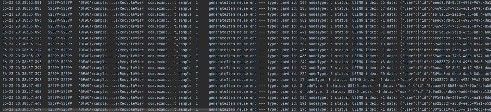

# 基于ScrollComponents实现网格

更新时间：2026-03-12 08:45:02

来源：https://developer.huawei.com/consumer/cn/doc/best-practices/bpta-grid-based-on-scrollcomponents

## 概述


网格是应用开发中常见的开发场景。它通过相交的横线和竖线，形成整齐有序的网状布局。网格适用于展示图片、媒体文件、购物商品等多种数据。当网格上下滑动时，子组件会带来测量和绘制的性能消耗。本文通过跨页面复用、加速首屏渲染、下拉刷新等场景，介绍ScrollComponents库创建高流畅滑动的网格页面。

ScrollComponents作为高性能滑动解决方案，主要解决组件复用的问题，支持通过少量的代码实现高性能滑动，同时开发者无需关注复用池管理和其他性能优化方案的交互细节。可以参考ScrollComponents使用说明进行安装配置与快速上手。ScrollComponents框架提供了下列功能特性：

- 支持List，WaterFlow，Grid三种常见复杂页面的流畅滑动
- 默认支持懒加载，开发者不用使用[LazyForEach](https://developer.huawei.com/consumer/cn/doc/harmonyos-references/ts-rendering-control-lazyforeach)和定义IDataSource数据源，减少一定的代码量
- 支持组件复用，解决滑动丢帧，提升滑动性能
- 支持复用池共享，满足跨页面跨父组件复用能力
- 支持预创建，减少冷启动首次滑动丢帧，提升滑动性能
- 支持预加载，滑动过程提前加载数据，提升浏览体验


## 约束与限制


- 不支持[设置子组件所占行列数](https://developer.huawei.com/consumer/cn/doc/harmonyos-guides/arkts-layout-development-create-grid#设置子组件所占行列数)
- 不支持捏合手势识别


## 实现原理


### 关键技术


ScrollComponents三方库底层封装NodeContainer+FrameNode，结合NodeAdapter+BuildNode+自定义复用池实现懒加载、组件复用、组件预创建等能力，同时为开发者提供WaterFlowManager、ListManager、GridManager等视图管理组件，为开发者提供系统滑动组件的其他各种能力，在满足开发者正常开发的前提下提供高性能的滑动能力，只需要传入数据源和viewManager即可快速实现懒加载和组件复用的开发，可以更加聚焦业务实现。

如图1是RecyclerView整体流程图，当节点从可视区移除时，NodeAdapter会通知视图管理器将组件回收，经NodeFactory回收处理之后，组件最终被存入到组件复用池。当节点需要创建时，NodeAdapter通知视图管理器开始创建，NodeFactory会向复用池请求复用节点，获取到节点之后经过一系列更新组件、组件拼接之后返回，最后由NodeAdapter将节点添加到可视区。

图1 RecyclerView整体流程图


### 开发流程


1. 自定义网格的视图管理器GridManager仅具备基础的视图能力，开发者需要使用组件复用能力，需定义一个继承自GridManager的类，并实现onWillCreateItem()接口，具体可参考[4.注册子节点模板](#li616965082419)。核心代码如下：
```ts
import { GridManager, NodeItem, RecyclerView } from "@hadss/scroll_components";
// ...

@Component
export default struct WordGridComponent {
  gridViewManager: GridViewManager = new GridViewManager({ defaultNodeItem: 'word', context: this.getUIContext() });
  // ...
}

class GridViewManager extends GridManager {
  onWillCreateItem(index: number, data: WordViewModel) {
    // get node based on identifier 'word' from recycle pool.
    let node: NodeItem<WordCellData> | null = this.dequeueReusableNodeByType('word');
    node.setData({ word: data })
    return node;
  }
}
```


> [!NOTE]
> 如果开发者想通过ScrollComponents快速创建网格，方便使用懒加载、预创建等提升滑动效率的能力，而不考虑组件复用，则直接使用ScrollComponents库提供的GridManager创建网格视图管理器即可。具体可参考[ScrollComponents使用说明](https://gitcode.com/openharmony-sig/scroll_components/blob/master/README.md#快速开始)。


1. 网格组件初始化页面初始化时，开发者通过视图管理器的setViewStyle()接口，给视图设置对应的视图属性。
```ts
aboutToAppear(): void {
  this.gridViewManager.setViewStyle()
  .alignItems(GridItemAlignment.STRETCH);
  this.gridViewManager.setViewStyle()
  .columnsTemplate('repeat(auto-fill, 70)')
  .columnsGap(5)
  .rowsGap(5);
  // ...
}
```


1. 设置数据源并渲染组件开发者通过自定义的视图管理器调用setDataSource()方法设置数据。ScrollComponents库默认支持懒加载，提供了基于懒加载的数据增删改查能力，开发者无需关心LazyForEach的使用限制，无需定义DataSource，引入即用。懒加载接口可参考：[基于NodeAdapter为视图管理器提供懒加载能力](https://gitcode.com/openharmony-sig/scroll_components/blob/master/docs/Reference.md#lazynodeadapter-类)。
2. 开发者通过自定义的视图管理器调用registerNodeItem()接口，注册item子节点模板，传入模板名称和节点构建函数。
```ts
import { GridManager, NodeItem, RecyclerView } from "@hadss/scroll_components";
import WordGridViewModel from "../viewModel/WordGridViewModel";
import WordViewModel from "../viewModel/WordViewModel";
// ...

@Component
export default struct WordGridComponent {
  gridViewManager: GridViewManager = new GridViewManager({ defaultNodeItem: 'word', context: this.getUIContext() });
  viewModel: WordGridViewModel = new WordGridViewModel(this.gridViewManager);

  aboutToAppear(): void {
    // ...
    // associates the builder with the identifier 'word'.
    this.gridViewManager.registerNodeItem('word', wrapBuilder(buildWordCell));
    this.viewModel.loadData();
  }

  build() {
    Column() {
      // place the grid in a column.
      RecyclerView({
        viewManager: this.gridViewManager
      })
    }
    .width('100%')
  }
}
```

```ts
@Observed
export default class WordGridViewModel {
  @Track data: WordViewModel[] = [];
  gridViewManager?: GridManager;
  // ...

  async loadData() {
    // simulated request data.
    for (let index = 0; index < 15; index++) {
      let viewModel: WordViewModel = new WordViewModel();
      // ...
      this.data.push(viewModel);
    }
    this.gridViewManager?.setDataSource(this.data);
  }
}
```


> [!NOTE]
> 1. 注册子节点模板方法registerNodeItem()中使用@builder函数目前仅支持全局。
>  2. 开发者如果使用this.gridViewManager.preCreate()实现组件预创建，则需要在注册节点模板后预创建组件。


1. 注册子节点模板开发者自定义模板后，在定义视图管理器时需要实现onWillCreateItem()接口，并在此接口中通过dequeueReusableNodeByType()获取可复用node，实现组件复用，同时也需要在复用组件的aboutToReuse生命期中，对数据进行更新。 单元格结构类型相同如果复用的单元格组件结构相同，数据不同时，直接注册节点模板。
```ts
import WordCell from "./WordCellComponent";

/**
* define item template.
*
* @param data data of node
*/
@Builder
function buildWordCell(data: WordCellData) {
  WordCell({ word: data.word })
}

@Component
export default struct WordGridComponent {
  // ...
  aboutToAppear(): void {
    // ...
    // associates the builder with the identifier 'word'.
    this.gridViewManager.registerNodeItem('word', wrapBuilder(buildWordCell));
    // ...
  }
  // ...
}

class GridViewManager extends GridManager {
  onWillCreateItem(index: number, data: WordViewModel) {
    // get node based on identifier 'word' from recycle pool.
    let node: NodeItem<WordCellData> | null = this.dequeueReusableNodeByType('word');
    node.setData({ word: data })
    return node;
  }
}
```
2. 单元格内子组件可拆分组合如果复用的单元格组件结构基本相同，存在部分差异，差异的部分会复用失效。ScrollComponents提供了PartReuse来保证命中组件复用。
**图2 **可拆分组件复用创建流程图


 开发者可参考图3日志打印"generateItem reuse "表示复用，检验是否复用成功。
**图3 **日志效果图


 子组件1：
```ts
// child component in item
@Component
export default struct UserCardComponent {
  @State user: UserInfoViewModel = new UserInfoViewModel();

  aboutToReuse(params: Record<string, ESObject>) {
    let input = params as CardCellData;
    this.user = input.user;
  }

  build() {
    // ...
  }
}

@Builder
export function buildUserCard(params: CardCellData) {
  UserCardComponent({ user: params.user })
}
```
 子组件2：
```ts
// child component in item
@Component
export default struct ManagerCardComponent {
  @State user: UserInfoViewModel = new UserInfoViewModel();

  aboutToReuse(params: Record<string, ESObject>) {
    let input = params as CardCellData;
    this.user = input.user;
  }

  build() {
    // ...
  }
}

@Builder
export function buildManagerCard(params: CardCellData) {
  ManagerCardComponent({ user: params.user })
}
```
 单元格组件：
```ts
// item component
@Component
export default struct CardComponent {
  @State user: UserInfoViewModel = new UserInfoViewModel();

  aboutToReuse(params: Record<string, ESObject>) {
    let input = params as CardCellData;
    this.user = input.user;
  }

  // ...
  build() {
    Column() {
      if (this.user.role === 'manager') {
        // when need to reuse a subcomponent, use PartReuse to encapsulate it.
        PartReuse({
          type: 'manager',
          builder: wrapBuilder(buildManagerCard),
          data: {
            user: this.user
          }
        })
      } else {
        PartReuse({
          type: 'user',
          builder: wrapBuilder(buildUserCard),
          data: {
            user: this.user
          }
        })
      }
    }
    .bindContextMenu(this.optMenu(), ResponseType.LongPress)
    .width('90%')
    .height(80)
  }
}

@Builder
export function buildCard(data: CardCellData) {
  CardComponent({ user: data.user })
}
```
 组件注册：
```ts
// card grid view
@Component
export default struct CardGridComponent {
  // ...

  aboutToAppear(): void {
    // ...
    // register the reusable template.
    this.gridViewManager.registerNodeItem("card", wrapBuilder(buildCard));
    this.gridViewManager.registerNodeItem("user", wrapBuilder(buildUserCard));
    this.gridViewManager.registerNodeItem("manager", wrapBuilder(buildManagerCard));
    // ...
  }
  // ...

  build() {
    Stack({ alignContent: Alignment.Bottom }) {
      // main grid
      RecyclerView({
        viewManager: this.gridViewManager
      })
      // ...
    }
  }
}

/**
* grid manager class
*/
class GridViewManager extends GridManager {
  onWillCreateItem(index: number, data: UserInfoViewModel): NodeItem<CardCellData> | null {
    let node: NodeItem<CardCellData> | null = this.dequeueReusableNodeByType('card');
    node?.setData({ user: data });
    return node;
  }
}
```
3. 单元格结构类型不同如果GridItem结构差异较大，包括布局差异大、差异的组件数量较多、组件类型不同等因素，导致直接复用GridItem困难，则可定义多个复用模板。
```ts
@Component
export default struct WorkComponent {
  // ...

  aboutToAppear(): void {
    // ...
    this.gridViewManager.registerNodeItem("video", wrapBuilder(buildVideoWork));
    this.gridViewManager.registerNodeItem("picture", wrapBuilder(buildPictureWork));
    this.gridViewManager.registerNodeItem("photoContainer", wrapBuilder(buildPhoto));
    // ...
  }

  // ...
}

/**
* grid manager class
*/
class GridViewManager extends GridManager {
  onWillCreateItem(index: number, data: WorkViewModel): NodeItem<WorkCellData> | null {
    // select the corresponding template according to the data type.
    let node: NodeItem<WorkCellData> | null = this.dequeueReusableNodeByType(data.type);
    node?.setData({ work: data });
    return node;
  }
}
```


## 网格跨页面复用场景


### 场景描述


开发者可能存在多个页面间复用Grid，比如tab栏切换。ScrollComponents提供了全局复用能力。


### 开发步骤


1. 定义复用池单例RecyclerView默认会生成一个RecycledPool，通过定义复用池单例存储该pool，提供跨页面使用。以下单例仅做参考，开发者可自行封装。
```ts
import { RecycledPool } from '@hadss/scroll_components';

export class Utils {
  // ...
  private static utils_: Utils;
  nodePool: RecycledPool | null = null;
  // ...
}
```
2. 复用池单例保存RecycledPoolGridManager提供getRecyclePool()方法可获取RecycledPool，然后存储在全局单例中。
```ts
@Component
export default struct WorkComponent {
  // ...

  aboutToAppear(): void {
    if (Utils.getInstance().nodePool) {
      this.gridViewManager.registerRecyclePool(Utils.getInstance().nodePool!);
    } else {
      // save recycle pool.
      Utils.getInstance().nodePool = this.gridViewManager.getRecyclePool();
    }
    // ...
  }

  // ...
}
```


1. 跨页面共享单例中的RecycledPool跨页面使用registerRecyclePool，将全局单例中的RecyclePool注册到该页面定义的Grid视图类对象上，实现跨页面不同RecyclerView视图的复用池共享。
```ts
@Component
export default struct PhotoGridComponent {
  // ...

  aboutToAppear(): void {
    // ...
    if (Utils.getInstance().nodePool) {
      // register recycle pool.
      this.gridViewManager.registerRecyclePool(Utils.getInstance().nodePool!);
    } else {
      Utils.getInstance().nodePool = this.gridViewManager.getRecyclePool();
    }
    // ...
    // register template after register recycle pool.
    this.gridViewManager.registerNodeItem('photoContainer', wrapBuilder(buildPhoto));
    // ...
  }

  // ...
}
```


## 网格加速首屏渲染场景


### 场景描述


冷启动后首次打开网格页面，由于页面的图片或者视频等媒体资源过多，出现白屏或者白块，等好几秒才缓慢刷出内容。ScrollComponents库支持组件预创建，能打开页面后瞬间看到文字、图片骨架，减少卡顿。


### 开发步骤


核心代码参考如下：

```ts
aboutToAppear(): void {
  // ...
  // register the reusable template.
  this.gridViewManager.registerNodeItem("card", wrapBuilder(buildCard));
  this.gridViewManager.registerNodeItem("user", wrapBuilder(buildUserCard));
  this.gridViewManager.registerNodeItem("manager", wrapBuilder(buildManagerCard));
  // key point: `preCreate()` pre-creates the reusable template,
  // which must be registered before the reusable template.
  this.gridViewManager.preCreate("card", 25);
  this.gridViewManager.preCreate("user", 10);
  this.gridViewManager.preCreate("manager", 30);
  // ...
}
```


### 性能测试


加载相同数据冷启动场景完成时延情况，通过延迟1s模拟冷启动后网络请求场景


@Reusable：网络请求期间主线程大段空闲，请求结束后首屏组件绘帧耗时较长

图4 @Reusable测试结果


ScrollComponents：网络请求期间主线程空闲较少，请求结束后首屏组件绘帧耗时较短

图5 ScrollComponents测试结果


| 实现方式 | 冷启动完成时延 | 主线程空闲时间 | 首屏组件创建时间 |
| --- | --- | --- | --- |
| ScrollComponents | 2.5s | 281ms | 223ms |
| @Reusable | 2.8s | 997ms | 467ms |


结论：ScrollComponents在冷启动场景下，完成时延优于原生@Reusable。整体完成时延优化300ms。


## 网格下拉刷新场景


### 场景描述


下拉刷新是提升用户体验的关键功能，既要保证数据无缝加载，又要维持流畅的交互效果。下拉刷新场景下使用懒加载刷新避免媒体资源加载造成UI渲染阻塞。效果参考：Refresh示例6实现下拉刷新上拉加载更多。


### 开发步骤


1. 使用Refresh组件扩展下拉刷新状态回调。
```ts
@Component
export default struct WorkComponent {
  // ...
  gridViewManager: GridViewManager = new GridViewManager({ defaultNodeItem: 'video', context: this.getUIContext() });
  @State viewModel: WorkGridViewModel = new WorkGridViewModel(this.gridViewManager);
  // ...

  build() {
    Refresh({ refreshing: $$this.viewModel.isRefresh, builder: this.refreshBuilder() }) {
      // ...
      // main grid
      RecyclerView({
        viewManager: this.gridViewManager
      })
      // ...
    }
    // ...
    .onRefreshing(() => {
      this.viewModel.refreshData();
    })
  }
}
```


1. 接收回调后触发数据刷新
```ts
@Observed
export default class WorkGridViewModel {
  // ...
  @Track isRefresh: boolean = false;
  // ...
  gridViewManager?: GridManager;

  constructor(gridViewManager: GridManager) {
    this.gridViewManager = gridViewManager;
  }

  loadData() {
    // ...
    // refresh data source
    this.gridViewManager?.nodeAdapter.deleteData(0, lastLength);
    this.gridViewManager?.setDataSource(this.data);
  }

  /**
   * refresh display data
   */
  refreshData() {
    setTimeout(() => {
      this.loadData();
      this.isRefresh = false;
    }, 1000);
  }
  // ...
}
```


## 网格上拉加载更多场景


### 场景描述


当开发网格页面涉及大量数据，需要进行分页或分批次进行请求时，结合ScrollComponents提供的懒加载能力实现加载更多的效果。效果参考：Refresh示例6实现下拉刷新上拉加载更多。


### 开发步骤


1. 增加监听事件onScrollIndex()
```ts
@Component
export default struct WorkComponent {
  // ...
  gridViewManager: GridViewManager = new GridViewManager({ defaultNodeItem: 'video', context: this.getUIContext() });
  @State viewModel: WorkGridViewModel = new WorkGridViewModel(this.gridViewManager);
  // ...

  aboutToAppear(): void {
    // ...
    this.gridViewManager.setViewStyle()
    .onReachEnd(() => {
      // listen the scroll position.
      this.viewModel.loadMore();
    });
    // ...
  }
  // ...
}
```
2. 触发回调，请求数据并追加到数据源
```ts
@Observed
export default class WorkGridViewModel {
  // ...
  @Track isLoading = false;
  gridViewManager?: GridManager;

  // ...
  /**
   * mock load more data when reach end
   */
  loadMore() {
    if (this.worksCount <= this.data.length) {
      return;
    }
    this.isLoading = true;

    setTimeout(() => {
      if (this.worksCount > this.data.length) {
        for (let index = 0; index < 20; index++) {
          if (this.data.length < this.worksCount) {
            this.gridViewManager?.nodeAdapter.pushData([this.generateData()]);
            this.isLoading = false;
          }
        }
      }
      this.isLoading = false;
    }, 500);
  }

  // ...
  /**
   * generate mock Work
   *
   * @returns work data
   */
  generateData(): WorkViewModel {
    // ...
  }
}
```


## 网格设置排列方式场景


### 场景描述


- 通过设置行列数量与尺寸占比可以确定网格布局的整体排列方式
- 通过layoutDirection设置网格布局的主轴方向


### 开发步骤


### 设置行列数量与占比


通过设置行列数量与尺寸占比可以确定网格布局的整体排列方式。效果参考：Grid设置行列数量与占比。
```ts
aboutToAppear(): void {
  // ...
  this.gridViewManager.setViewStyle()
  .columnsTemplate(this.viewModel.columnsTemplate);
  // ...
}
```


### 设置主轴方向


通过layoutDirection设置网格布局的主轴方向，决定子组件的排列方式。效果参考：Grid设置主轴方向。
```ts
aboutToAppear(): void {
  // ...
  this.gridViewManager.setViewStyle()
  .layoutDirection(GridDirection.Row);
  // ...
}
```


## 网格布局中显示数据的场景


### 场景描述


可以通过在单元格组件中添加文本等组件在网格中显示数据。效果参考：Grid在网格布局中显示数据。


### 开发步骤


在单元格组件中添加文本组件进行数据显示。

```ts
// item component
@Component
export default struct WordCell {
  @State word: WordViewModel = new WordViewModel();

  aboutToReuse(params: Record<string, ESObject>) {
    let input = params as WordCellData;
    this.word = input.word;
  }

  build() {
    // ...
    // define a text component that displays data in a cell after receiving it.
    Text(this.word.value)
    .height(80)
    // ...
  }
}
```


## 网格设置行列间距场景


### 场景描述


在两个网格单元之间的网格横向间距称为行间距，网格纵向间距称为列间距。通过rowsGap和columnsGap可以设置网格布局的行列间距。效果参考：Grid设置行列间距。


### 开发步骤


分别设置columnsGap和rowsGap为8vp。

```ts
aboutToAppear(): void {
  // ...
  this.gridViewManager.setViewStyle()
  .columnsGap(8) // set column spacing to 8vp.
  .rowsGap(8); // set row spacing to 8vp.
  // ...
}
```


## 网格构建可滚动的布局场景


### 场景描述


通过columnsTemplate和rowsTemplate可以让网格拥有滚动能力。效果参考：Grid构建可滚动的网格布局。


### 开发步骤


通过columnsTemplate设置网格为三列等份网格。

```ts
aboutToAppear(): void {
  // ...
  // only set the columnsTemplate property. when the content exceeds the grid area, it can be scrolled vertically.
  this.gridViewManager.setViewStyle()
  .columnsTemplate("1fr 1fr 1fr");
  // ...
}
```


## 网格控制滚动位置场景


### 场景描述


通过对设置Scroller对象，可以进行滚动控制。效果参考：Grid控制滚动位置。


### 开发步骤


1. 绑定Scroller对象
```ts
// card grid view
@Component
export default struct CardGridComponent {
  scroller: Scroller = new Scroller();
  gridViewManager: GridViewManager = new GridViewManager({ defaultNodeItem: "card", context: this.getUIContext() });
  @State viewModel: CardGridViewModel = new CardGridViewModel(this.gridViewManager, this.scroller);

  aboutToAppear(): void {
    // ...
    this.gridViewManager.setViewStyle(this.scroller);
    // ...
  }

  // ...
  build() {
    Stack({ alignContent: Alignment.Bottom }) {
      // main grid
      RecyclerView({
        viewManager: this.gridViewManager
      })

      Row() {
        // button goto pre page
        Button() {
          // ...
        }
        // ...
        .onClick(() => {
          this.viewModel.prePage();
        })

        // button goto next page
        Button() {
          // ...
        }
        // ...
        .onClick(() => {
          this.viewModel.nextPage();
        })
      }
      // ...
    }
  }
}
```


1. 通过Scroller对象的scrollPage方法进行翻页。
```ts
@Observed
export default class CardGridViewModel {
  // ...
  gridViewManager?: GridManager;
  scroller?: Scroller;

  constructor(gridViewManager: GridManager, scroller: Scroller) {
    this.gridViewManager = gridViewManager;
    this.scroller = scroller;
  }

  // ...
  /**
   * goto pre page
   */
  prePage() {
    this.scroller?.scrollPage({
      next: false,
      animation: true,
    });
  }

  /**
   * goto next page.
   */
  nextPage() {
    this.scroller?.scrollPage({
      next: true,
      animation: true,
    });
  }
}
```


## 网格嵌套滚动场景


### 场景描述


通过nestedScroll和onScrollFrameBegin设置嵌套滚动效果。效果参考：Grid示例4grid嵌套滚动。


### 开发步骤


通过nestedScroll设置前后两个方向的嵌套滚动模式，实现与父组件的滚动联动。

```ts
aboutToAppear(): void {
  // ...
  this.gridViewManager.setViewStyle(this.scroller)
  .nestedScroll({
    scrollForward: NestedScrollMode.PARENT_FIRST,
    scrollBackward: NestedScrollMode.SELF_FIRST
  });
  // ...
}
```


## 网格拖拽场景


### 场景描述


通过对拖拽事件处理和数据交换逻辑可以实现单元格拖拽效果。效果参考：Grid示例5grid拖拽场景。


### 开发步骤


1. 设置属性editMode(true)设置网格是否进入编辑模式，进入编辑模式可以拖拽网格组件内部单元格。
2. 在[onItemDragStart](https://developer.huawei.com/consumer/cn/doc/harmonyos-references/ts-container-grid#onitemdragstart8)回调中设置拖拽过程中显示的图片。
3. 在[onItemDrop](https://developer.huawei.com/consumer/cn/doc/harmonyos-references/ts-container-grid#onitemdrop8)中获取拖拽起始位置，和拖拽插入位置，并在[onItemDrop](https://developer.huawei.com/consumer/cn/doc/harmonyos-references/ts-container-grid#onitemdrop8)中完成转移数组位置逻辑。
```ts
@Component
export default struct WorkComponent {
  // ...
  @State workModel: WorkViewModel = new WorkViewModel();

  aboutToAppear(): void {
    // ...
    this.gridViewManager.setViewStyle()
    .editMode(true)
    .onItemDragStart((event: ItemDragInfo, itemIndex: number) => {
      let model = this.viewModel.getItemData(itemIndex);
      this.workModel = model;
      return this.buildDrag();
    })
    .onItemDrop((event: ItemDragInfo, itemIndex: number, insertIndex: number, isSuccess: boolean) => {
      if (!isSuccess) {
        return;
      }
      this.viewModel.move(itemIndex, insertIndex);
    });
    // ...
  }

  @Builder
  buildDrag() {
    Column() {
      buildVideoWork({ work: this.workModel });
    }
    .width(125)
  }
  // ...
}
```

```ts
@Observed
export default class WorkGridViewModel {
  // ...
  gridViewManager?: GridManager;

  // ...
  /**
   * move work index
   *
   * @param fromIndex source index
   * @param toIndex target index
   */
  move(fromIndex: number, toIndex: number) {
    if (toIndex >= this.data.length) {
      return;
    }
    this.gridViewManager?.nodeAdapter.moveData(fromIndex, toIndex);
  }
  // ...
}
```


## 网格自适应场景


### 场景描述


通过layoutDirection、maxCount、minCount、cellLength实现自适应效果。rowsTemplate、columnsTemplate都不设置layoutDirection、maxCount、minCount、cellLength才生效。效果参考：Grid示例6自适应grid。


### 开发步骤


通过设置maxCount、minCount、cellLength实现自适应。

```ts
aboutToAppear() {
  this.gridViewManager.setViewStyle()
  .width("90%")
  .columnsGap(10)
  .rowsGap(5)
  .maxCount(10)
  .minCount(2)
  .cellLength(0)
  .border({ color: Color.Black, width: 1 });

  // ...
}
```


## 网格自适应列数场景


### 场景描述


通过属性columnsTemplate中auto-fill、auto-fit和auto-stretch实现列数自适应效果。效果参考：Grid示例8设置自适应列数。


### 开发步骤


通过设置columnsTemplate为repeat(auto-fill, 70)实现自适应列数。

```ts
aboutToAppear(): void {
  // ...
  this.gridViewManager.setViewStyle()
  .columnsTemplate('repeat(auto-fill, 70)')
  .columnsGap(5)
  .rowsGap(5);
  // ...
}
```


## 网格以当前行最高的单元格的高度为其他单元格的高度场景


### 场景描述


可以通过alignItems设置当前行最高单元格高度为其他单元格的高度。效果参考：Grid示例9以当前行最高的griditem的高度为其他griditem的高度。


### 开发步骤


设置alignItems为GridItemAlignment.STRETCH时，以当前行最高的单元格高度为其他单元格的高度。

```ts
aboutToAppear(): void {
  this.gridViewManager.setViewStyle()
  .alignItems(GridItemAlignment.STRETCH);
  // ...
}
```


## 网格设置边缘渐隐场景


### 场景描述


通过fadingEdge属性来设置边缘渐隐效果。效果参考：Grid示例10设置边缘渐隐。


### 开发步骤


开启边缘渐隐，并设置边缘渐隐长度为40vp。

```ts
aboutToAppear(): void {
  // ...
  this.gridViewManager.setViewStyle()
  .fadingEdge(true, { fadingEdgeLength: LengthMetrics.vp(40) })
  // ...
}
```


## 网格设置单元格样式场景


### 场景描述


可以使用gridViewManager.setItemViewStyle()接口设置单元格样式。效果参考：GridItem示例2设置griditem样式。


### 开发步骤


使用gridViewManager.setItemViewStyle()设置单元格样式和属性。

```ts
aboutToAppear(): void {
  // ...
  this.gridViewManager.setItemViewStyle((gridItem) => {
    gridItem({ style: GridItemStyle.PLAIN })
    .width(80) // set the cell width to 80vp.
    .backgroundColor($r('app.color.home_background_color'))
    .selectable(false)
  });
  // ...
}
```


## 网格长按删除单元格场景


### 场景描述


长按时显示删除按钮，点击按钮可以删除对应item。


### 开发步骤


1. 绑定长按手势
```ts
// item component
@Component
export default struct CardComponent {
  @State user: UserInfoViewModel = new UserInfoViewModel();

  // ...
  @Builder
  optMenu() {
    Row() {
      Button() {
        // ...
      }
      .backgroundColor(Color.Red)
      .onClick(() => {
        this.getUIContext().getHostContext()?.eventHub.emit(CommonConstants.EVENT_REMOVE_ITEM, this.user.id);
      })
    }
    // ...
  }

  build() {
    Column() {
      // ...
    }
    .bindContextMenu(this.optMenu(), ResponseType.LongPress)
    // ...
  }
}
```


1. 响应删除事件
```ts
aboutToAppear(): void {
  // ...
  // register 'delete' event listener.
  this.getUIContext().getHostContext()?.eventHub.on(CommonConstants.EVENT_REMOVE_ITEM, (id: number) => {
    animateToImmediately({ duration: 500 }, () => {
      this.viewModel.deleteData(id);
    })
  });
  // ...
}

aboutToDisappear(): void {
  // when the page is destroyed, cancel the deletion listener.
  this.getUIContext().getHostContext()?.eventHub.off(CommonConstants.EVENT_REMOVE_ITEM);
  this.viewModel.destroy();
}
```
2. 通过this.gridViewManager?.nodeAdapter.deleteData()删除数据及组件
```ts
/**
* delete data by user id
*
* @param id user id
*/
deleteData(id: number) {
  for (let index = 0; index < this.data.length; index++) {
    let model = this.data[index];
    if (model.id === id) {
      // delete components and data
      this.gridViewManager?.nodeAdapter.deleteData(index);
      return;
    }
  }
}
```


## 示例代码


- [基于ScrollComponents实现网格](https://gitcode.com/HarmonyOS_Samples/GridScrollComponent)
