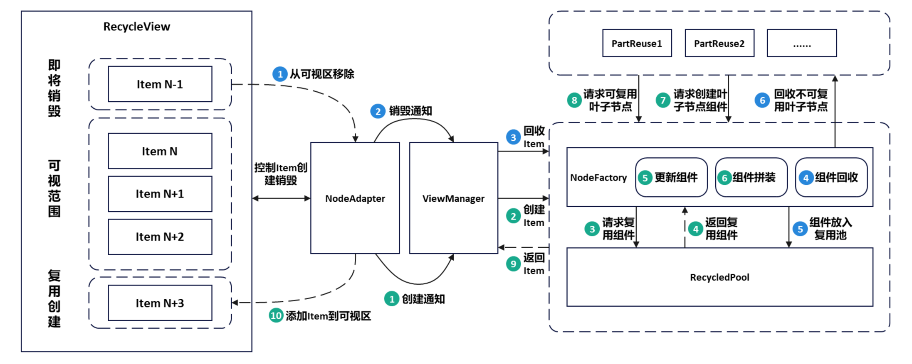
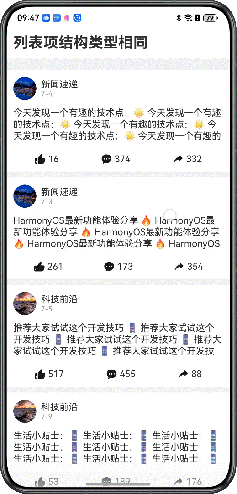
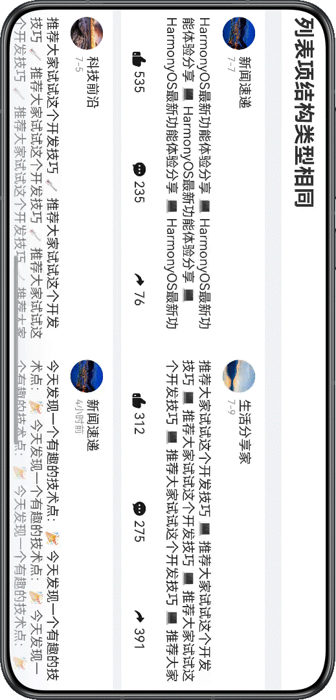
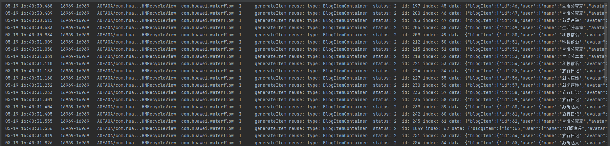
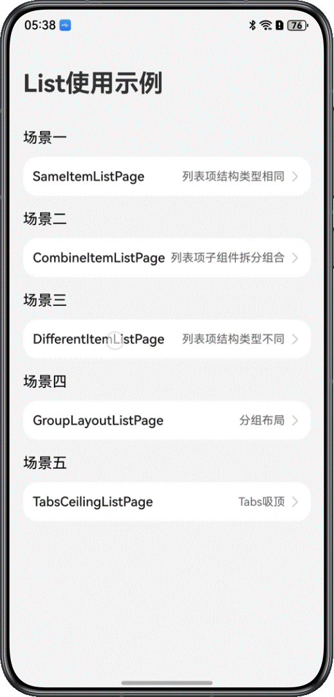
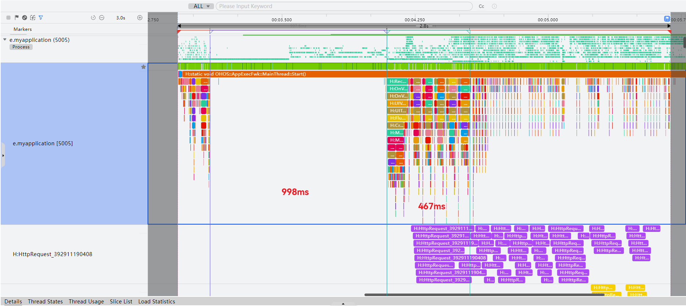

# 基于ScrollComponents实现长列表

更新时间：2026-05-22 09:46:30

来源：https://developer.huawei.com/consumer/cn/doc/best-practices/bpta-list-based-on-scrollcomponents

**   


#### 概述

列表包含一系列相同宽度的列表项，适合连续、多行展示同类数据，例如图片和文本。List具备动态数据处理能力，可以循环生成列表项，适应数据变化。它采用滚动加载技术，仅渲染可视项目，从而提升长列表的性能。同时，支持自定义交互逻辑与视觉样式，以满足多样化的交互需求。其使用场景广泛，涵盖列表类信息展示（如新闻、商品清单）、导航菜单设计（底部导航、侧边栏）及分页长内容呈现（如社交媒体动态、评论区），是实现高效数据可视化与交互的核心组件。
 
当长列表上下滑动时，频繁的子组件创建和测量会大量消耗计算资源，容易造成滑动卡顿。图片等资源的短时集中请求会造成明显的页面滑动白块，影响用户体验。
 
ScrollComponents作为高性能滑动解决方案，主要解决组件复用问题，支持通过少量的代码实现高性能滑动场景开发，同时开发者无需关注复用池管理和其他性能优化方案的交互细节。可以参考[ScrollComponents使用说明](https://gitcode.com/openharmony-sig/scroll_components/blob/master/README.md#快速开始)进行安装配置与快速上手。ScrollComponents三方库提供了下列功能特性：
 
- 支持List，WaterFlow，Grid 三种常见复杂页面的流畅滑动
- 默认支持懒加载
- 支持组件复用，解决滑动丢帧，提升滑动性能
- 支持复用池共享，满足跨页面跨父组件复用能力
- 支持预创建，减少冷启首次滑动丢帧，提升滑动性能
- 支持预加载，滑动过程提前加载数据，提升浏览体验

 
ScrollComponents三方库基于系统[NodeAdapter](https://developer.huawei.com/consumer/cn/doc/harmonyos-references/js-apis-arkui-framenode#nodeadapter12)、[BuilderNode](https://developer.huawei.com/consumer/cn/doc/harmonyos-references/js-apis-arkui-buildernode)、[FrameNode](https://developer.huawei.com/consumer/cn/doc/harmonyos-references/js-apis-arkui-framenode)、[Prefetcher](https://developer.huawei.com/consumer/cn/doc/harmonyos-references/js-apis-arkui-prefetcher)、[FrameCallback](https://developer.huawei.com/consumer/cn/doc/harmonyos-references/arkts-apis-uicontext-framecallback)的能力，通过高效的组件复用、分帧预创建组件、动态内容预创建和懒加载等技术，实现了高性能的滑动效果。此外，它还基于FrameNode封装了系统List、WaterFlow、Grid组件，提供了一系列ViewManager，为开发者提供了多种系统滑动组件的能力，如列表项样式设置、首尾偏移量调整、滚动监听、边缘渐隐等，旨在简化开发流程的同时满足开发者的常规需求。
 
下文将通过长列表的跨页面复用、加速首屏渲染、无限滑动、下拉刷新、上拉加载等场景，详细介绍ScrollComponents库在长列表组件中的应用。
 
 

#### 实现原理

 

#### 关键技术

 
ScrollComponents三方库底层封装了NodeContainer+FrameNode，结合NodeAdapter、BuildNode和自定义复用池实现懒加载、组件复用、组件预创建等功能。同时，它为开发者提供了WaterFlowManager、ListManager、GridManager等视图管理组件，以支持系统滑动组件的其他各种能力。在满足开发者正常开发需求的前提下，提供高性能的滑动能力，只需传入数据源和viewManager即可快速实现懒加载和组件复用的开发，使开发者能够更加专注于业务实现。
 
如下图所示，当节点从可视区域移除时，NodeAdapter会通知视图管理器回收组件，经NodeFactory处理后，组件最终被存入复用池。当需要创建节点时，NodeAdapter通知视图管理器开始创建，NodeFactory会从复用池请求复用节点，获取节点后经过一系列更新和组件拼接，最后由NodeAdapter将节点添加到可视区域。
 
图1 **RecyclerView整体流程图**


 

#### 开发流程
1. 创建长列表视图管理器。ListManager仅具备基础的视图功能。若开发者需要使用组件复用功能，需定义一个继承自ListManager的类，并实现onWillCreateItem()方法，从复用池中获取组件，以开启复用能力。具体实现可参考[复用子节点模板](#li18448145318540)。

  在创建视图管理器的实例对象时，defaultNodeItem属性用于指定默认的列表项模板名称，通常传入唯一标识字符串用于组件复用；context属性用于获取UI上下文，通常传入this.getUIContext()。

  
```ArkTS
import { ListManager, NodeItem, RecyclerView } from '@hadss/scroll_components';
@Component
struct SameItemListPage {
  myListManager: MyListManager = new MyListManager({
    defaultNodeItem: 'EasyBlogItemContainer',
    context: this.getUIContext()
  });
  // ...
}

class MyListManager extends ListManager {
  onWillCreateItem(_index: number, data: BlogData) {
    // ...
  }
}
```


  
> [!TIP]
> 如果开发者希望通过ScrollComponents快速创建长列表，并利用懒加载、预创建等功能来提升滑动效率，而不涉及组件复用，那么可以直接使用ScrollComponents库中提供的ListManager来创建长列表视图管理器。具体的使用方法和配置选项，可以参考 ScrollComponents使用说明-快速开始 。

2. ListManager初始化

  在页面初始化时，开发者通过视图管理器的setViewStyle接口为视图设置相应的属性。这包括设置布局与约束条件、主轴和交叉轴的方向、自定义列表样式（如内容间距、分割线、滚动条等）以及设置滚动监听。
```ArkTS
this.myListManager.setItemViewStyle((item, index, data: Params) => {
  item({ style: ListItemStyle.NONE })
    .width('100%')
    .height('auto')
    .swipeAction({
      // ...
    })
    .onClick(() => Logger.info("index:" + index))
})
this.myListManager.setViewStyle({ space: 10, scroller: this.listScroller })
  .cachedCount(2)// Set the number of preloaded ListItemListItemGroups in the list and whether to display the preloaded nodes
  .width('100%')
  .edgeEffect(EdgeEffect.Spring)
  .layoutWeight(1)
  .contentStartOffset(20)// Sets the offset at the start of the content area
  .contentEndOffset(20)// Sets the offset at the end of the content area
  .scrollBar(BarState.Off)// Set the scrollbar status
  // ...
  .alignListItem(ListItemAlign.Start)// Set the direction of the List cross axis
  .lanes(1)// Set the number of layout columns or rows in the List portlet
  .fadingEdge(true, { fadingEdgeLength: LengthMetrics.vp(80) })
  // Nested scrolling: Set up a scrolling scheme
  .nestedScroll({
    scrollForward: NestedScrollMode.PARENT_FIRST, // The parent component scrolls first, scrolls to the edge, and then scrolls itself
    scrollBackward: NestedScrollMode.SELF_FIRST // Itself rolls first, and then the parent component scrolls to the edge
  })
```

3. 设置数据源渲染组件
- 通过视图管理器的setDataSource()方法设置数据。ScrollComponents库默认支持懒加载，提供基于懒加载的数据增删改查功能，开发者无需担心LazyForEach的使用限制，无需定义DataSource，引入即可使用。懒加载接口可参考：[基于NodeAdapter为视图管理器提供懒加载能力](https://gitcode.com/openharmony-sig/scroll_components/blob/master/docs/Reference.md#lazynodeadapter-类)。

4. 通过视图管理器的registerNodeItem方法注册item子节点模板时，需要传入模板名称和子节点的@Builder构造函数。

5. ScrollComponents提供了视图占位组件RecyclerView，RecyclerView通过绑定视图容器实例即可渲染长列表。
```ArkTS
import { ListManager, NodeItem, RecyclerView } from '@hadss/scroll_components';
@Component
struct SameItemListPage {
  myListManager: MyListManager = new MyListManager({
    defaultNodeItem: 'EasyBlogItemContainer',
    context: this.getUIContext()
  });
  @State myViewModel: SameItemViewModel = new SameItemViewModel(this.myListManager);
  // ...
  aboutToAppear(): void {
    // ...
    // Register a reuse template
    this.myListManager.registerNodeItem('EasyBlogItemContainer', wrapBuilder(EasyBlogItemContainer));
    // ...
    // Simulate request data
    this.myViewModel.loadData();
  }
  // ...
  build() {
    // ...
        Column() {
          RecyclerView({
            viewManager: this.myListManager
          })
        }
        // ...
  }
}

// Define an item template
@Builder
function EasyBlogItemContainer($$: Params) {
  EasyBlogItem({ blogData: $$.blogData })
}
```
 
```ArkTS
@Observed
export class SameItemViewModel {
  @Track dataArray: BlogData[] = [];
  myListManager: ListManager;
  // ...
  loadData() {
    generateRandomBlogData(300, false).then((dataArray: BlogData[]) => {
      this.dataArray = dataArray;
      this.myListManager.setDataSource(dataArray);
    });
  }
  // ...
}
```


  
> [!NOTE]
> 1. 在注册子节点模板的方法registerNodeItem()中，目前仅支持使用全局builder函数。 2. 如果开发者使用this.ListView.myListManager.preCreate()来实现组件的预创建，则必须在注册节点模板之前完成此操作。

- 复用子节点模板

  开发者自定义模板后，在定义长列表视图管理器时，需要实现onWillCreateItem()接口。在此接口中，通过dequeueReusableNodeByType()获取可复用的node，以实现组件复用。同时，还需要在复用组件的aboutToReuse生命周期中更新数据。1. 列表项结构类型相同当ListItem组件的结构相同但数据不同时，直接注册节点模板。

  
```ArkTS
@Component
struct SameItemListPage {
  myListManager: MyListManager = new MyListManager({
    defaultNodeItem: 'EasyBlogItemContainer',
    context: this.getUIContext()
  });
  // ...
  aboutToAppear(): void {
    // ...
    // Register a reuse template
    this.myListManager.registerNodeItem('EasyBlogItemContainer', wrapBuilder(EasyBlogItemContainer));
    // ...
  }
  // ...
}

class MyListManager extends ListManager {
  onWillCreateItem(_index: number, data: BlogData) {
    let node: NodeItem<Params> | null = this.dequeueReusableNodeByType('EasyBlogItemContainer');
    node?.setData({ blogData: data });
    return node;
  }
}

// Define an item template
@Builder
function EasyBlogItemContainer($$: Params) {
  EasyBlogItem({ blogData: $$.blogData })
}
```


2. 列表项内子组件可拆分组合如果复用的ListItem组件结构基本相同，但存在部分差异，例如头部和尾部组件展示相同，而中间内容可能渲染Text组件或Image组件，通常需要定义两个不同的@Builder函数来实现复用。然而，在这种场景下，ScrollComponents提供了PartReuse功能，确保组件复用的实现，只需定义一个@Builder函数。具体可参考[组件复用-列表项子组件可拆分](https://gitcode.com/openharmony-sig/scroll_components/blob/master/README.md#列表项内子组件可拆分)。

  当组件即将被销毁时，会从视图容器中移除并进入item复用池。当组件即将被创建时，会从item复用池中获取item节点。如果item节点与目标节点类型存在差异，会先将差异部分，即PartReuse中的组件回收到对应的组件复用池，然后从对应的组件复用池中取出目标组件所需的差异组件，并与item节点拼接，形成目标组件，再进入视图容器中。

  图2 **可拆分组件复用创建流程图**


```ArkTS
import { ListManager, NodeItem, PartReuse, RecyclerView, } from '@hadss/scroll_components';
@Component
struct CombineItemListPage {
  myListManager: MyListManager = new MyListManager({
    defaultNodeItem: "BlogItemContainer",
    context: this.getUIContext()
  });
  // ...
  aboutToAppear(): void {
    // ...
    // Register a reuse template
    this.myListManager.registerNodeItem('BlogItemContainer', wrapBuilder(BlogItemContainer));
    this.myListManager.registerNodeItem('AdaptiveTextComponentContainer', wrapBuilder(AdaptiveTextComponentContainer));
    this.myListManager.registerNodeItem('GridImageViewContainer', wrapBuilder(GridImageViewContainer));
    // ...
  }
  // ...
}

class MyListManager extends ListManager {
  onWillCreateItem(_index: number, data: BlogData) {
    let node: NodeItem<Params> | null = this.dequeueReusableNodeByType('BlogItemContainer');
    node?.setData({ blogData: data });
    return node;
  }
}

@Builder
function BlogItemContainer($$: Params) {
  BlogItem({ blogData: $$.blogData })
}

@Component
struct BlogItem {
  @State blogData: BlogData = new BlogData();

  aboutToReuse(params: Record<string, ESObject>): void {
    this.blogData = params.blogData;
  }

  build() {
    Column({ space: 12 }) {
      BlogItemHeaderView({ blogData: this.blogData })
      if (this.blogData?.content.length > 0) {
        PartReuse({
          type: 'AdaptiveTextComponent',
          builder: wrapBuilder(AdaptiveTextComponentContainer),
          data: { blogData: this.blogData }
        })
      }
      // Display pictures
      if (this.blogData?.images && this.blogData.images.length > 0) {
        PartReuse({
          type: 'GridImageViewContainer',
          builder: wrapBuilder(GridImageViewContainer),
          data: { blogData: this.blogData }
        })
      }
      BottomActionView({ blogData: this.blogData })
    }
    // ...
  }
}

@Builder
function AdaptiveTextComponentContainer($$: Params) {
  AdaptiveTextComponent({ blogData: $$.blogData })
}

@Builder
function GridImageViewContainer($$: Params) {
  GridImageView({ blogData: $$.blogData })
}
```


  开发者可以参考下图所示的日志打印内容，以检验是否成功复用，"generateItem reuse" 表示复用。

  图3 **日志效果图**


  
> [!NOTE]
> 日志默认是关闭的，若需开启日志，应在ListManager的初始化方法中设置Config参数，将debug设为true。


3. 列表项结构类型不同如果ListItem结构存在较大差异，包括布局不同、子组件数量差异大、组件类型不同等因素，导致难以直接复用同一个ListItem，则可以定义多个复用模板。

  
```ArkTS
@Component
struct DifferentItemListPage {
  myListManager: MyListManager = new MyListManager({
    defaultNodeItem: 'EasyBlogItemContainer',
    context: this.getUIContext()
  });
  @State dataArray: BlogData[] = [];
  @State myViewModel: DifferentItemViewModel = new DifferentItemViewModel(this.myListManager, this.dataArray);
  // ...
  aboutToAppear(): void {
    // ...
    this.myListManager.registerNodeItem('EasyBlogItemContainer', wrapBuilder(EasyBlogItemContainer));
    this.myListManager.registerNodeItem('HotVideoBlogItemContainer', wrapBuilder(HotVideoBlogItemContainer));
    this.myListManager.preCreate('HotVideoBlogItemContainer', 30);
    this.myListManager.preCreate('EasyBlogItemContainer', 30);
    this.myViewModel.loadData();
  }

  initView() {
    this.myListManager.setItemViewStyle((_item, _index, _data: ESObject) => {
    })
    this.myListManager.setViewStyle({ space: 10, scroller: this.scroller })
    // ...
  }

  @Builder
  buildListView() {
    RecyclerView({
      viewManager: this.myListManager
    })
  }

  build() {
    // ...
        PullToRefresh({
          // ...
          customList: () => {
            this.buildListView();
          },
          // ...
        })
        // ...
  }
}
class MyListManager extends ListManager {
  onWillCreateItem(index: number, data: BlogData) {
    if (index % 4 === 3) {
      let node: NodeItem<Params> | null = this.dequeueReusableNodeByType('HotVideoBlogItemContainer');
      node?.setData({ blogData: data });
      return node;
    }
    let node: NodeItem<Params> | null = this.dequeueReusableNodeByType('EasyBlogItemContainer');
    node?.setData({ blogData: data });
    return node;
  }
}

// Reusable EasyBlog Component Template
@Builder
function EasyBlogItemContainer($$: Params) {
  EasyBlogItem({ blogData: $$.blogData })
}

// Reusable HotVideoBlog Component Template
@Builder
function HotVideoBlogItemContainer($$: Params) {
  HotVideoBlogItem({ blogData: $$.blogData })
}
```


 
 

#### 长列表分组布局场景

 

#### 场景描述

 
在长列表中支持数据的分组展示，可以使列表结构更加清晰，便于查找，从而提高使用效率。分组列表在实际应用中非常常见，例如下图所示的联系人列表和商品分类展示列表。
 
在分组场景中，通常会设置Group的header和footer，用于展示组内统一的头部和尾部信息。
 
图4 **商品分类列表展示效果图**


 

#### 开发步骤

1. 定义Item复用的模板
```ArkTS
@Builder
function GoodItemContainer($$: ParamsGoods) {
  GoodItem({ dataModel: $$.dataModel })
}

@Component
struct GoodItem {
  @Prop dataModel: GoodsDataModel = {
    titleId: 0,
    goodsId: 0,
    goodsName: '',
    imgUrl: $r('app.media.pic2'),
    price: 0
  };

  aboutToReuse(params: Record<string, ESObject>): void {
    this.dataModel = params.dataModel;
  }

  build() {
    Row() {
      Image(this.dataModel.imgUrl)
        .height('100%')
        .aspectRatio(1)
        .sourceSize({ width: 96, height: 96})
      Column() {
        Text(this.dataModel.goodsName)
          .width('100%')
          .fontSize(14)
          .maxLines(2)
          .textOverflow({ overflow: TextOverflow.Clip })
          .lineHeight(20)
        Text('￥' + this.dataModel.price)
          .fontSize(18)
          .fontColor(Color.Red)
      }
      .height('100%')
      .padding(12)
      .layoutWeight(1)
      .alignItems(HorizontalAlign.Start)
      .justifyContent(FlexAlign.SpaceBetween)
    }
    .clip(true)
    .width('100%')
    .height(96)
    .backgroundColor(Color.White)
    .borderRadius(18)
  }
}
```

2. 定义ListItemGroupManager类
```ArkTS
class MyListItemGroupManager extends ListItemGroupManager {
  onWillCreateItem(_index: number, data: GoodsDataModel): NodeItem | null {
    let node: NodeItem<ParamsGoods> | null = this.dequeueReusableNodeByType('GoodItemContainer');
    node?.setData({ dataModel: data });
    return node;
  }
}
```

3. 定义ListManager类
```ArkTS
class MyListManager extends ListManager {
  context: UIContext;

  constructor(config: Config) {
    super(config);
    this.context = config.context;
  }

  onWillCreateItem(_index: number, data: CategoryModel): NodeItem {
    const groupManager = new MyListItemGroupManager({ defaultNodeItem: 'GoodItemContainer', context: this.context });
    groupManager.registerNodeItem('GoodItemContainer', wrapBuilder(GoodItemContainer));
    groupManager.setDataSource(data.goodsList);
    // The header and footer of the group
    groupManager.setViewStyle({
      space: 12,
      // ...
    })
    groupManager.setItemViewStyle((listItem, index, data: ParamsGoods) => {
      // Used to set the scratch component of ListItem.
      listItem().swipeAction({
        // ...
      })
    })
    return groupManager.getNodeItem(this);
  }
}
```

4. Group的header和footer设置如果需要设置组头和组尾，可以通过ListItemGroupManager的headerComponent和footerComponent属性实现，并实现其对应的Builder函数。

  
```ArkTS
class MyListManager extends ListManager {
  // ...
  onWillCreateItem(_index: number, data: CategoryModel): NodeItem {
    const groupManager = new MyListItemGroupManager({ defaultNodeItem: 'GoodItemContainer', context: this.context });
    groupManager.registerNodeItem('GoodItemContainer', wrapBuilder(GoodItemContainer));
    groupManager.setDataSource(data.goodsList);
    // The header and footer of the group
    groupManager.setViewStyle({
      space: 12,
      headerComponent: new ComponentContent<Resource>(this.context,
        wrapBuilder<[Resource]>(goodsHeaderBuilderPublic),
        data.titleName),
      // onClick:(...)=>{} can be declared in the DataModel, and data.onClick is used when data is assigned
      // headerComponent: new ComponentContent<DataModel>(this.context,
      //   wrapBuilder<[DataModel]>(groupHeaderBuilderPublic),
      //   dataModel)
      footerComponent: new ComponentContent<[Resource, number]>(this.context,
        wrapBuilder<[[Resource, number]]>(goodsFooterBuilderPublic),
        [data.titleName, data.titleId]),
    })
    // ...
    return groupManager.getNodeItem(this);
  }
}
// The global Builder: passes multiple parameters
@Builder
function goodsHeaderBuilderPublic(headerName: Resource) {
  // ...
}

// The global Builder: passes multiple parameters
@Builder
function goodsFooterBuilderPublic(args: [Resource, number]) {
  // ...
}
```


  
> [!NOTE]
> header目前支持使用headerComponent属性的写法，且goodsHeaderBuilderPublic只支持全局builder。footer的写法与header相同。 对于需要将内部事件传递到Page页面的场景，可以通过在DataModel中设置一个点击回调属性来实现，并在Page页面传递Data时进行赋值。 目前这种写法不支持同时设置header和footer。后续，ScrollComponents库将支持这一功能。

5. 页面实现
```ArkTS
@Component
struct GroupLayoutListPage {
  // ...
  myListManager: MyListManager = new MyListManager({ defaultNodeItem: '', context: this.getUIContext() });
  private goodsListScroller: ListScroller = new ListScroller();
  @State myViewModel: GroupLayoutViewModel = new GroupLayoutViewModel(this.myListManager, this.goodsListScroller);

  aboutToAppear() {
    this.initView();
    this.myListManager.registerNodeItem('GoodItemContainer', wrapBuilder(GoodItemContainer));
    this.myListManager.preCreate('GoodItemContainer', 30);
    this.myViewModel.loadData();
  }

  // ...
  build() {
    // ...
            Column() { // 3.Nested Scrolling: Inner List
              RecyclerView({
                viewManager: this.myListManager
              })
            }
            .height('100%')
            // ...
  }
}

// ...
@Builder
function GoodItemContainer($$: ParamsGoods) {
  GoodItem({ dataModel: $$.dataModel })
}
```

 

#### 长列表跨页面复用场景

 

#### 场景描述

开发者可能需要在多个页面间复用List，例如在Tabs切换时。ScrollComponents提供了全局复用的能力。
 
 
图5 **Tabs组件子页面跨页面复用效果图**


 

#### 开发步骤

1. 定义复用池单例ScrollComponents默认会生成一个RecycledPool对象，通过定义复用池单例存储该pool对象，以便跨页面使用。以下单例仅做参考，开发者可根据需要自行封装。

  
```ArkTS
import { RecycledPool } from '@hadss/scroll_components';

export class Utils {
  // ...
  private static utils_: Utils;
  nodePool: RecycledPool | null = null;
  // ...
}
```

2. 复用池单例保存RecycledPoolHMListManager提供getRecyclePool()方法可获取RecyclePool对象，然后存储到全局单例中。

  
```ArkTS
if (Utils.getInstance().nodePool) {
  this.myListManager.registerRecyclePool(Utils.getInstance().nodePool!);
} else {
  Utils.getInstance().nodePool = this.myListManager.getRecyclePool();
}
```

3. 跨页面共享单例中的RecyclePool通过使用registerRecyclePool()接口，将全局单例中的RecyclePool注册到页面定义的List视图类对象上，实现跨页面HMRecyclerView视图的复用池共享。

  
```ArkTS
@Component
struct TabsCeilingListPage {
  private tabArray: Resource[] = [
  // ...
  ];
  // ...
  aboutToDisappear(): void {
    Utils.getInstance().nodePool?.clear()
  }

  // ...
  build() {
    // ...
              Tabs({ barPosition: BarPosition.Start, controller: this.contentTabController }) {
                ForEach(this.tabArray, (item: Resource, index: number) => {
                  TabContent() {
                    CustomListPage({ index: index })
                  }
                  .tabBar(this.tabBuilder(index, item))
                  .align(Alignment.Center)
                }, (item: string) => item)
              }
              // ...
  }
}

@Component
struct CustomListPage {
  index: number = 1;
  myListManager: MyListManager = new MyListManager({
    defaultNodeItem: 'CustomListItemContainer',
    context: this.getUIContext()
  });
  @State myViewModel: TabsCeilingViewModel = new TabsCeilingViewModel(this.myListManager);
  scroller: Scroller = new Scroller();

  aboutToAppear(): void {
    // ...
    // Shared multiplexing pools
    if (Utils.getInstance().nodePool) {
      this.myListManager.registerRecyclePool(Utils.getInstance().nodePool!);
    } else {
      Utils.getInstance().nodePool = this.myListManager.getRecyclePool();
    }
    // ...
    this.myListManager.registerNodeItem('CustomListItemContainer', wrapBuilder(CustomListItemContainer));
    this.myListManager.preCreate('CustomListItemContainer', 5);
    this.myViewModel.loadData();
  }

  build() {
    RecyclerView({
      viewManager: this.myListManager
    })
  }
}
```

 

#### 长列表加速首屏渲染场景

 

#### 场景描述

冷启动后首次打开长列表页面时，由于页面包含大量图片或视频等媒体资源，可能会出现白屏或白块，需要等待几秒内容才会逐渐加载出来。ScrollComponents库支持组件预创建，使用后可以在打开页面后立即看到文字和图片的骨架，从而减少卡顿。
 
 
图6 **加速首屏渲染效果图**


 

#### 开发步骤

包括注册模板和复用模板的预创建。重点：必须在注册复用模板之后使用preCreate()接口。
 
```ArkTS
aboutToAppear(): void {
  // ...
  // Register a reuse template
  this.myListManager.registerNodeItem('BlogItemContainer', wrapBuilder(BlogItemContainer));
  this.myListManager.registerNodeItem('AdaptiveTextComponentContainer', wrapBuilder(AdaptiveTextComponentContainer));
  this.myListManager.registerNodeItem('GridImageViewContainer', wrapBuilder(GridImageViewContainer));
  // Pre-creation Important: preCreate pre-creates a reusable template, which must be done after the reuse template is registered
  // Pre-create 30 list items to optimize the first-screen performance; the number can be adjusted according to actual needs.
  this.myListManager.preCreate('BlogItemContainer', 30);
  this.myListManager.preCreate('AdaptiveTextComponentContainer', 30);
  this.myListManager.preCreate('GridImageViewContainer', 30);
  // ...
}
```
 
 

#### 性能测试

 
在冷启动场景下加载相同数据的完成时延情况，通过延迟1s来模拟冷启动后的网络请求场景。
 
@Reusable：在网络请求期间，主线程有大段空闲时间，请求结束后首屏组件的绘帧耗时较长。
 
图7 **@Reusable测试结果**


 
在ScrollComponents中，网络请求期间主线程空闲时间较少，请求结束后首屏组件的绘帧耗时较短。
 
图8 **ScrollComponents测试结果**


  
|    | 冷启动完成时延 | 主线程空闲时间 | 首屏组件创建时间 |
| --- | --- | --- | --- |
| ScrollComponents | 2.5s | 281ms | 223ms |
| @Reusable | 2.8s | 997ms | 467ms |
 
 
结论：ScrollComponents在冷启动场景下，完成时延优于原生@Reusable。整体完成时延优化300ms。
 

#### 长列表下拉刷新场景

 

#### 场景描述

下拉刷新是提升用户体验的关键功能，它既要确保数据无缝加载，又要保持流畅的交互效果。建议采用懒加载方式刷新数据，以避免媒体资源加载导致的UI渲染阻塞。实现逻辑可参考[实现下拉刷新上拉加载更多](https://developer.huawei.com/consumer/cn/doc/harmonyos-references/ts-container-refresh#示例6实现下拉刷新上拉加载更多)。
 
图9 **下拉刷新效果图**


 
 

#### 开发步骤

可以通过Refresh组件实现页面下拉操作，并绑定显示刷新Loading动效的容器组件，以达到下拉加载的效果。之后，使用onRefreshing回调重新设置数据，模拟刷新数据的操作。
 
```ArkTS
@Component
struct DifferentItemListPage {
  myListManager: MyListManager = new MyListManager({
    defaultNodeItem: 'EasyBlogItemContainer',
    context: this.getUIContext()
  });
  @State dataArray: BlogData[] = [];
  @State myViewModel: DifferentItemViewModel = new DifferentItemViewModel(this.myListManager, this.dataArray);
  @State isRefreshing: boolean = false;
  @State isLoadMore: boolean = false;
  // ...
  @Builder
  buildListView() {
    RecyclerView({
      viewManager: this.myListManager
    })
  }

  build() {
    // ...
        Refresh({ refreshing: $$this.isRefreshing }) {
          Column() {
            this.buildListView();
            // ...
          }
        }
        .layoutWeight(1)
        .onRefreshing(() => {
          this.myViewModel.loadData((_isSuccess) => {
            this.isRefreshing = false;
          });
        })
        // ...
  }
}
```
 
 
```ArkTS
@Observed
export class DifferentItemViewModel {
  @Track dataArray: BlogData[] = [];
  myListManager: ListManager;
  // ...
  loadData(callBack?: (isSuccess: boolean) => void): void {
    generateRandomBlogData().then((data: BlogData[]) => {
      this.dataArray = data;
      this.myListManager.setDataSource(data);
      if (callBack) {
        callBack(true);
      }
    });
  }
  // ...
}
```
 

#### 长列表上拉加载场景

 

#### 场景描述

 
在开发涉及大量数据的长列表页面时，需要通过分页请求来加载数据。结合ScrollComponents提供的懒加载功能，可以实现加载更多数据的效果。
 
图10 **上拉加载效果图**


 

#### 开发步骤

可以通过Refresh组件实现页面上拉操作，并绑定显示刷新Loading动效的容器组件，以达到上拉加载的效果。之后，使用onReachEnd回调来新增数据，模拟加载数据的操作。
 
```ArkTS
@Component
struct DifferentItemListPage {
  myListManager: MyListManager = new MyListManager({
    defaultNodeItem: 'EasyBlogItemContainer',
    context: this.getUIContext()
  });
  @State dataArray: BlogData[] = [];
  @State myViewModel: DifferentItemViewModel = new DifferentItemViewModel(this.myListManager, this.dataArray);
  @State isRefreshing: boolean = false;
  @State isLoadMore: boolean = false;
  // ...
  initView() {
    this.myListManager.setItemViewStyle((_item, _index, _data: ESObject) => {
    })
    this.myListManager.setViewStyle({ space: 10, scroller: this.scroller })
    // ...
      .onReachEnd(() => {
        if (!this.isLoadMore) {
          this.isLoadMore = true;
          this.myViewModel.loadDataMore((_isSuccess) => {
            this.isLoadMore = false;
          });
        }
      })
  }

  @Builder
  buildListView() {
    RecyclerView({
      viewManager: this.myListManager
    })
  }

  build() {
    // ...
        Refresh({ refreshing: $$this.isRefreshing }) {
          Column() {
            this.buildListView();
            if (this.isLoadMore) {
              Row() {
                LoadingProgress()
                  .width(20)
                  .height(20)
                  .color('#999999')
                Text($r('app.string.loading_more'))
                  .fontSize(14)
                  .fontColor('#999999')
                  .margin({ left: 8 })
              }
              .width(CommonConstants.FULL_WIDTH)
              .height(50)
              .justifyContent(FlexAlign.Center)
            }
          }
        }
        // ...
  }
}
```
 
 
```ArkTS
@Observed
export class DifferentItemViewModel {
  // ...
  private isLoadingMore: boolean = false;
  // ...
  loadDataMore(callBack?: (isSuccess: boolean) => void): void {
    if (!this.isLoadingMore) {
      this.isLoadingMore = true;
      setTimeout(() => {
        generateRandomBlogData().then((data: BlogData[]) => {
          this.myListManager.nodeAdapter.pushData(data);
          this.isLoadingMore = false;
          if (callBack) {
            callBack(true);
          }
        })
      }, this.NetworkTime);
    }
  }
}
```
 

#### 长列表无限滑动场景

 

#### 场景描述

 
为了解决手动上拉加载操作的繁琐问题，在即将下滑到最底端时，提前触发新数据的加载，并将其显示在长列表的最底部，从而实现无限滑动的效果。
 
- 痛点问题：当长列表页面包含大量图片或视频时，下滑至列表底部后快速继续下滑可能会导致“滑动白块”现象。特别是在用户使用大量在线数据的情况下，弱网环境和快速滑动会使滑动过程中的白块现象更加明显。
- 解决方案：为了减少滑动过程中的白块和页面数据加载的等待时间，ScrollComponents内置了内容预取功能Prefetcher，支持根据网络状态动态自适应。通过提前下载图片或资源，确保在需要时能够立即显示，从而减少白块的出现。
- 适用场景：动态预加载特别适用于数据请求耗时较长的场景，例如滑动列表中包含大量图片资源。

 
以下介绍具体的使用：
 
图11 **无限滑动效果图**


 

#### 开发步骤

1. 修改数据体参数，增加位图
```ArkTS
@Observed
class ObservedArray<T> extends Array<T> {
}

@Observed
export class ImagePixelMap {
  imageUrl: string = '';
  imagePixelMap: image.PixelMap | undefined = undefined;
}

@Observed
export class BlogData {
  // ...
  // Multiple graphs define imagePixelMapArray, corresponding to images
  imagePixelMapArray: ObservedArray<ImagePixelMap> = [];
  // A single graph defines an imagePixelMap, which corresponds to an imageUrl
  // imageUrl: string = ''
  // imagePixelMap: image.PixelMap | undefined = undefined;

  callback: Function | undefined = undefined;
  fetchUrl: string | ImageContent = ImageContent.EMPTY;
}
```

2. 实现fetchCallback()和cancelCallback()方法
```ArkTS
fetchCallback: (item: ESObject, fetchId: number) => Promise<void> = (item: ESObject, fetchId: number) => {
  // Simulate a simple pre-loading scenario ,This is where you can migrate the preloaded scenarios for your project
  // 1、When the component is not displayed or created, the image is obtained. PixelMap, when the component is displayed, load the image directly. PixelMap and show no need to wait for the network
  // 2、If the image is displayed but the pixelMap is not obtained, the data is bound to the Image component first, and the image can be refreshed immediately after the pixelMap is obtained
  let data = item as BlogData;
  this.fetchesMore.set(fetchId, new Map());
  return new Promise(resolve => {
    this.loadImagesInBatches(data.imagePixelMapArray, fetchId, 0, resolve);
  })
}

private loadImagesInBatches(images: ImagePixelMap[], fetchId: number, startIndex: number, resolve: () => void): void {
  if (startIndex >= images.length) {
    const fetchMap = this.fetchesMore.get(fetchId);
    if (fetchMap && fetchMap.size === 0) {
      this.fetchesMore.delete(fetchId);
    }
    resolve();
    return;
  }
  const batchSize = 1;
  const endIndex = Math.min(startIndex + batchSize, images.length);
  for (let i = startIndex; i < endIndex; i++) {
    const pixMap = images[i];
    if (pixMap.imagePixelMap) {
      continue;
    }
    let httpRequest = HttpGet(pixMap.imageUrl, (error: number, pixelMap?: image.PixelMap) => {
      let fetchMap = this.fetchesMore.get(fetchId);
      if (fetchMap) {
        fetchMap.delete(i);
        if (fetchMap?.size === 0) {
          this.fetchesMore.delete(fetchId);
        }
      }
      if (error === -1) {
        return;
      }
      if (pixelMap) {
        // You need to create an array to store the pixelMap, because there is a change in the internal data of the array to make the component respond, which is more complicated, the developer can choose the preloading scheme by himself:
        // Define the ImagePixelMap class to store the pixelMap, encapsulate the Image component as an ObservedImage, add @ObjectLink imagePixelMap: ImagePixelMap property to bind the data object,
        // In the preloaded callback fetchCallback, after the image pixelMap is obtained, set ImagePixelMap.imagePixelMap, and the image can be refreshed by ObservedImage
        pixMap.imagePixelMap = pixelMap;
      }
    });
    let fetchMap = this.fetchesMore.get(fetchId);
    if (fetchMap) {
      fetchMap.set(i, httpRequest);
    }
  }
  setTimeout(() => {
    this.loadImagesInBatches(images, fetchId, endIndex, resolve);
  }, 80);
}

cancelCallback: (fetchId: number) => void = (fetchId: number) => {
  const fetchMap = this.fetchesMore.get(fetchId);
  if (fetchMap) {
    Array.from(fetchMap.values()).forEach(element => {
      element.destroy();
    });
    fetchMap.clear();
  }
  this.fetchesMore.delete(fetchId);
}
```

3. 创建组件实例时，注册fetch和cancel方法到视图管理器
```ArkTS
aboutToAppear(): void {
  this.initView();
  // Register a preload function callback
  this.myViewModel.registerPrefetch();
  // ...
}
```
 
```ArkTS
registerPrefetch() {
  this.myListManager?.registerFetchCallback(this.fetchCallback);
  this.myListManager?.registerCancelCallback(this.cancelCallback);
}
```

4. 监听滑动组件子组件变化事件
```ArkTS
@Component
struct CombineItemListPage {
  // ...
  initView() {
    this.myListManager.setViewStyle({ space: 10, scroller: this.scroller })
    // ...
      .onScrollIndex((start: number, end: number) => {
        // Infinite swipe, when the 10th data is counted, new data is requested in advance
        if (end > this.myViewModel.dataArray.length - 10) {
          this.myViewModel.loadDataMore();
        }
        // Trigger a preload callback, request an image in advance, and resolve the white block of the image
        if (end > 0) {
          this.myListManager.visibleAreaChanged(start, end);
        }
      })
  }
  // ...
}
```

5. 自定义Image组件，双向绑定数据
```ArkTS
@Component
struct GridImageView {
  @State blogData: BlogData = new BlogData();

  aboutToReuse(params: Record<string, ESObject>): void {
    this.blogData = params.blogData;
  }

  build() {
    Grid() {
      ForEach(this.blogData.imagePixelMapArray, (image: ImagePixelMap | undefined, _index: number) => {
        GridItem() {
          Stack() {
            ObservedImage({ imagePixelMap: image })
          }
        }
      })
    }
    .columnsTemplate("1fr 1fr 1fr")
    .rowsGap(5)
    .columnsGap(5)
  }
}

@Component
struct ObservedImage {
  @ObjectLink imagePixelMap: ImagePixelMap;

  build() {
    Image(this.imagePixelMap.imagePixelMap)
      .sourceSize({ width: 100, height: 100 })
      .width('100%')
      .aspectRatio(1)
      .objectFit(ImageFit.Cover)
      .borderRadius(8)
  }
}
```

 

#### 长列表侧滑删除场景

 

#### 场景描述

侧滑菜单在许多应用中十分常见。例如，在通讯类应用中，通常会为消息列表提供侧滑删除功能，即用户可以通过向左滑动列表中的某一项，然后点击删除按钮来删除消息。
 
图12 **侧滑删除效果图**


 
 

#### 开发步骤
1. 标准列表侧滑删除
```ArkTS
@Component
struct SameItemListPage {
  // ...
  initView() {
    this.myListManager.setItemViewStyle((item, index, data: Params) => {
      item({ style: ListItemStyle.NONE })
        .width('100%')
        .height('auto')
        .swipeAction({
          end: { builder: () => this.ItemActionEnd(data.blogData) },
          start: { builder: () => this.ItemActionStart(data.blogData) },
          onOffsetChange: (offset: number) => Logger.info("offset:" + offset)
        })
        .onClick(() => Logger.info("index:" + index))
    })
    // ...
  }

  @Builder
  ItemActionStart(data: BlogData) {
    Row() {
      Text($r('app.string.collection'))
      // ...
    }
    // ...
  }

  @Builder
  ItemActionEnd(data: BlogData) {
    Row() {
      Text($r('app.string.delete'))
      // ...
    }
    // ...
  }

  build() {
    // ...
        Column() {
          RecyclerView({
            viewManager: this.myListManager
          })
        }
        // ...
  }
}
```

2. 分组列表侧滑删除目前ListItemGroupManage是写在ListManager内部的，侧滑组件groupManager.setItemViewStyle()需要在ListManager.onWillCreateItem()内部设置。

  
```ArkTS
class MyListManager extends ListManager {
  // ...
  onWillCreateItem(_index: number, data: CategoryModel): NodeItem {
    const groupManager = new MyListItemGroupManager({ defaultNodeItem: 'GoodItemContainer', context: this.context });
    groupManager.registerNodeItem('GoodItemContainer', wrapBuilder(GoodItemContainer));
    // ...
    groupManager.setItemViewStyle((listItem, index, data: ParamsGoods) => {
      // Used to set the scratch component of ListItem.
      listItem().swipeAction({
        end: {
          builderComponent: new ComponentContent<[number, GoodsDataModel, ListItemGroupManager]>(this.context,
            wrapBuilder<[[number, GoodsDataModel, ListItemGroupManager]]>(GroupItemActionEnd),
            [index, data.dataModel, groupManager]),
          onEnterActionArea: () => Logger.info("onEnterActionArea"),
          onExitActionArea: () => Logger.info("onExitActionArea"),
          onStateChange: (state: SwipeActionState) => Logger.info("onStateChange" + state)
        },
        start: {
          builderComponent: new ComponentContent<[number, GoodsDataModel]>(this.context,
            wrapBuilder<[[number, GoodsDataModel]]>(GroupItemActionStart),
            [index, data.dataModel]),
        },
        onOffsetChange: (offset: number) => Logger.info("offset:" + offset),
        edgeEffect: SwipeEdgeEffect.Spring,
      })
    })
    return groupManager.getNodeItem(this);
  }
}
class MyListItemGroupManager extends ListItemGroupManager {
  // ...
}

@Builder
function GroupItemActionStart(args: [number, GoodsDataModel]) {
  // ...
}

@Builder
function GroupItemActionEnd(args: [number, GoodsDataModel, ListItemGroupManager]) {
  // ...
}
```


  
> [!NOTE]
> swipeAction目前仅支持builderComponent属性的写法，且GroupItemActionEnd只能是全局builder。end和start的写法相同。 对于需要将内部事件传递到Page页面的场景，可以通过在DataModel中设置一个点击回调属性来实现，并在Page页面进行数据传递时赋值。

 
 

#### 长列表多类型列表项场景

 

#### 场景描述

List组件作为整个首页长列表的容器，通过ListItem对不同模块进行视图界面的定制，常用于门户首页、商城首页等多类型视图展示的列表信息流场景。多类型列表项场景（List+ListHeaderView）参考：[常见列表流开发实践：多类型列表项场景](https://developer.huawei.com/consumer/cn/doc/best-practices/bpta-common-list-flows#section20614147618)。
 
图13 **ListHeaderView滑动效果图**


 
 

#### 开发步骤

通过Scroll内部包含HeaderView+RecyclerView的方式实现，并通过nestedScroll()接口设置RecyclerView的嵌套滚动方式，来达到上图所示的效果。
 
```ArkTS
@Component
struct GroupLayoutListPage {
  // ...
  initView() {
    // ...
    this.myListManager.setViewStyle({ space: 10, scroller: this.goodsListScroller })
      // ...
      .nestedScroll({
        // 1.Nested scrolling: Set up a scrolling scheme
        scrollForward: NestedScrollMode.PARENT_FIRST,
        scrollBackward: NestedScrollMode.SELF_FIRST
      })
  }

  // ...
  build() {
    // ...
        // Nested scrolling: Implement the ListHeader effect
        Scroll() { // 2.Nested Scroll: Outer Scroll
          Column() {
            ListHeaderView()
            Column() { // 3.Nested Scrolling: Inner List
              RecyclerView({
                viewManager: this.myListManager
              })
            }
            .height('100%')
          }
        }
        .layoutWeight(1)
        .scrollBar(BarState.Off)
        // ...
  }
}


@Component
export struct ListHeaderView {
  build() {
    Column() {
      // ListHeaderView: You can set up various types of subassemblies
      // Swiper(...){...}
      // Grid(...){...}
      // CustomComponent(...){...}
      Stack({ alignContent: Alignment.Center }) {
        Image($r('app.media.pic1'))
        Row() {
          Text($r('app.string.i_am'))
            .fontSize(16)
            .fontColor('#333')
          Text(' ListHeaderView')
            .fontSize(16)
            .fontColor('#333')
        }
      }
    }
    .alignItems(HorizontalAlign.Center)
  }
}
```
 
> [!NOTE]
> 在ArkUI中，可通过List内部包含HeaderView+ForEach实现。HeaderView支持添加多种类型组件以实现与List同步滑动的效果，ForEach展示具体的Item。 ScrollComponents中采用了FrameNode实现并自动管理数据源，可通过Scroll内部包含HeaderView+RecyclerView的方式实现。

 
 

#### 长列表Tabs吸顶场景

 

#### 场景描述

Tabs嵌套List的吸顶效果，常用于新闻和资讯类应用的首页。长列表Tabs吸顶功能参考：[常见列表流开发实践：Tabs吸顶场景](https://developer.huawei.com/consumer/cn/doc/best-practices/bpta-common-list-flows#section103354617711)
 
图14 **Tabs的TabBar吸顶效果图**


 
 

#### 开发步骤
1. 实现Tabs组件TabContent骨架
```ArkTS
@Component
struct TabsCeilingListPage {
  // ...
  build() {
    // ...
            Column() {
              Tabs({ barPosition: BarPosition.Start, controller: this.contentTabController }) {
                ForEach(this.tabArray, (item: Resource, index: number) => {
                  TabContent() {
                    CustomListPage({ index: index })
                  }
                  .tabBar(this.tabBuilder(index, item))
                  .align(Alignment.Center)
                }, (item: string) => item)
              }
              // Set the height of the tab to 'calc(100% - 63vp)' to ensure that the Tabs component leaks out just when the nest slides
              .height('calc(100% - 58vp)')
              .barHeight(56)
              // ...
              .onChange((index: number) => this.currentTabIndex = index)
            }
            .backgroundColor($r('app.color.home_background_color'))
            // ...
  }
}
```

2. RecyclerView实现TabContent内部List页面
```ArkTS
@Component
struct CustomListPage {
  // ...
  aboutToAppear(): void {
    this.myListManager.setItemViewStyle((_item, _index, _data: ESObject) => {
    })
    this.myListManager.setViewStyle({ space: 10, scroller: this.scroller, })
    // ...
  }

  build() {
    RecyclerView({
      viewManager: this.myListManager
    })
  }
}

class MyListManager extends ListManager {
  // ...
}

@Builder
function CustomListItemContainer($$: ParamsItemData) {
  CustomListItem({ itemData: $$.itemData })
}
```

3. 设置嵌套滚动模式
```ArkTS
@Component
struct CustomListPage {
  // ...
  aboutToAppear(): void {
    // ...
    this.myListManager.setViewStyle({ space: 10, scroller: this.scroller, })
    // ...
      .nestedScroll({
        scrollForward: NestedScrollMode.PARENT_FIRST, // Set the effect of scrolling the component to the end: The parent component rolls first, and then rolls itself to the edge
        scrollBackward: NestedScrollMode.SELF_FIRST // Set the effect of rolling the component to the start end: Rolls itself first, and then the parent component scrolls to the edge
      })
    // Shared multiplexing pools
    // ...
  }
  // ...
}
```

4. 设置List组件的高度在滑动到顶部时漏出Tabs组件
```ArkTS
@Component
struct TabsCeilingListPage {
  // ...
  build() {
    // ...
            Column() {
              Tabs({ barPosition: BarPosition.Start, controller: this.contentTabController }) {
                // ...
              }
              // Set the height of the tab to 'calc(100% - 63vp)' to ensure that the Tabs component leaks out just when the nest slides
              .height('calc(100% - 58vp)')
              .barHeight(56)
              // ...
  }
}
```

 
> [!NOTE]
> 存在的问题：当Tabs设置为吸顶时，nestedScroll属性设置不生效。 解决方案：RecyclerView内部默认使用.layoutWeight(1)自动填充高度，需在最外层添加一个布局组件，并设置其高度为.height(calc(100% - 50vp))，以正确设置RecyclerView的高度。

 
 

#### 分组吸顶场景

 

#### 场景描述

双列表同向联动，左侧分类列表用于快速索引，内容列表依据分类进行分组，常用于商品分类选择、通讯录、城市选择、分组选择等页面。长列表分组吸顶功能参考：[常见列表流开发实践：分组吸顶场景](https://developer.huawei.com/consumer/cn/doc/best-practices/bpta-common-list-flows#section16551551888)。
 
本案例实现商品分类选择页面列表头部分类吸顶效果，如下图所示。
 
图15 **分组布局组头吸顶效果图**


 
 

#### 开发步骤
1. 实现商品分类页面的分组展示
```ArkTS
class MyListManager extends ListManager {
  // ...
}
class MyListItemGroupManager extends ListItemGroupManager {
  // ...
}

@Component
struct GroupLayoutListPage {
  // ...
  build() {
    NavDestination() {
      Row() {
        List({ scroller: this.categoryScroller }) {
          // ...
        }
        .width(100)
        .height('100%')
        .scrollBar(BarState.Off)

        // Nested scrolling: Implement the ListHeader effect
        Scroll() { // 2.Nested Scroll: Outer Scroll
          Column() {
            ListHeaderView()
            Column() { // 3.Nested Scrolling: Inner List
              RecyclerView({
                viewManager: this.myListManager
              })
            }
            .height('100%')
          }
        }
        .layoutWeight(1)
        .scrollBar(BarState.Off)
      }
      // ...
    }
    // ...
  }
}

@Builder
function GoodItemContainer($$: ParamsGoods) {
  GoodItem({ dataModel: $$.dataModel })
}
```

2. 设置吸顶属性
```ArkTS
initView() {
  // ...
  this.myListManager.setViewStyle({ space: 10, scroller: this.goodsListScroller })
    // ...
    .sticky(StickyStyle.Header)// Set up grouped ceilings
    // ...
}
```

 
 

#### 长列表二级联动场景

 

#### 场景描述

通过选择左侧的一级列表，右侧的二级列表数据将相应更新，常用于商品分类选择、编辑风格等二级类别选择页面。长列表二级联动功能参考：[常见列表流开发实践：二级联动场景](https://developer.huawei.com/consumer/cn/doc/best-practices/bpta-common-list-flows#section323632114913)。
 
本场景以商品分类列表页面为例，分别使用List组件展示左侧分类导航和右侧导航内容。进入页面后，点击左侧分类导航，右侧将展示对应的分类详情列表数据；滑动右侧列表内容时，列表标题将吸顶显示，同时左侧对应的导航内容高亮显示。
 
图16 **长列表二级联动效果图**


 
 

#### 开发步骤

1. 通过List组件构建左侧分类导航数据
```ArkTS
List({ scroller: this.categoryScroller }) {
  ForEach(this.myViewModel.categoryList, (item: CategoryModel, index: number) => {
    ListItem() {
      Text(item.titleName)
        // ...
    }
  }, (item: CategoryModel) => JSON.stringify(item.titleName))
}
```

2. 通过RecyclerView构建右侧分类内容数据，以及Item复用相关代码
```ArkTS
class MyListManager extends ListManager {
  // ...
}
class MyListItemGroupManager extends ListItemGroupManager {
  // ...
}

@Component
struct GroupLayoutListPage {
  // ...
  aboutToAppear() {
    this.initView();
    this.myListManager.registerNodeItem('GoodItemContainer', wrapBuilder(GoodItemContainer));
    this.myListManager.preCreate('GoodItemContainer', 30);
    this.myViewModel.loadData();
  }

  // ...
  build() {
    // ...
            Column() { // 3.Nested Scrolling: Inner List
              RecyclerView({
                viewManager: this.myListManager
              })
            }
            .height('100%')
            // ...
  }
}
```

3. 为左侧导航列表添加点击事件，为右侧分类详情列表添加[onScrollIndex()](https://developer.huawei.com/consumer/cn/doc/harmonyos-references/ts-container-list#onscrollindex)事件，并调用自定义的listChange方法。在listChange方法内部，根据isGoods变量的值，调用相应列表控制器的[scrollToIndex()](https://developer.huawei.com/consumer/cn/doc/harmonyos-references/ts-container-scroll#scrolltoindex)方法，以实现导航列表和分类详情数据的联动效果。
```ArkTS
List({ scroller: this.categoryScroller }) {
  ForEach(this.myViewModel.categoryList, (item: CategoryModel, index: number) => {
    ListItem() {
      Text(item.titleName)
        // ...
        .onClick(() => this.listChange(index, true))
    }
  }, (item: CategoryModel) => JSON.stringify(item.titleName))
}
```
 
```ArkTS
initView() {
  // ...
  this.myListManager.setViewStyle({ space: 10, scroller: this.goodsListScroller })
    // ...
    .onScrollIndex((index: number) => { // Scrolling listeners
      this.listChange(index, false);
    })
    // ...
}

listChange(index: number, isGoods: boolean) {
  if (this.currentTitleId !== index) {
    this.currentTitleId = index;
    if (isGoods) {
      this.goodsListScroller.scrollToIndex(index);
    } else {
      this.categoryScroller.scrollToIndex(index);
    }
  }
}
```

 

#### 长列表动态切换列数场景

 

#### 场景描述

当设备在横屏和竖屏之间切换，或折叠屏在小屏、中屏和大屏状态之间切换时，长列表的显示列数将根据当前屏幕宽度进行调整，以展示更合适大小的Item。
 
图17 **动态切换列数效果图**


 
 

#### 开发步骤

首先，设置页面可自由旋转，然后监听屏幕尺寸的变化。当发现宽度大于高度时，设置为2列。
 
```ArkTS
@Component
struct SameItemListPage {
  // ...
  private context = this.getUIContext().getHostContext() as common.UIAbilityContext;
  private windowClass = (this.context as common.UIAbilityContext).windowStage.getMainWindowSync();

  aboutToDisappear(): void {
    this.windowClass.off('windowSizeChange');
  }
  aboutToAppear(): void {
    // The settings page is free to rotate
    let orientation = window.Orientation.AUTO_ROTATION;
    this.windowClass.setPreferredOrientation(orientation, (err: BusinessError) => {
      const errCode: number = err.code;
      if (errCode) {
        Logger.error('Failed to set window orientation. Cause:' + JSON.stringify(err));
        return;
      }
      Logger.info('Succeed to setting window orientation');
    })
    // Listen for screen size changes
    this.windowClass.on('windowSizeChange', (size) => {
      let viewWidth = size.width;
      let viewHeight = size.height;
      if (viewWidth > viewHeight) { // Criteria are judged based on business settings
        this.myListManager.setViewStyle().lanes(2);
      } else {
        this.myListManager.setViewStyle().lanes(1);
      }
    })

    this.initView();
    // ...
  }
  initView() {
    // ...
    this.myListManager.setViewStyle({ space: 10, scroller: this.listScroller })
    // ...
      .alignListItem(ListItemAlign.Start)// Set the direction of the List cross axis
      .lanes(1)// Set the number of layout columns or rows in the List portlet
      // ...
  }
  // ...
}
```
 
 
> [!NOTE]
> 在Item高度一致的情况下，推荐使用动态改变列数的场景。当Item大小不一致时，动态设置显示的列数，当前行的高度将以最高的Item为准，这可能导致部分空白区域的出现。此时，需要开发者自行选择合适的布局方案。 目前不支持使用@State属性对List的属性进行双向绑定，需通过this.myListManager.setViewStyle().xxxx的格式进行设置。

 

#### 设置边缘渐隐场景

 

#### 场景描述

通过设置[fadingEdge](https://developer.huawei.com/consumer/cn/doc/harmonyos-references/ts-container-scrollable-common#fadingedge14)属性来实现边缘渐隐效果，效果如图所示。
 
图18 **边缘渐隐效果图


 
 

#### 开发步骤

可以直接在setViewStyle接口中设置渐隐效果。
 
```ArkTS
this.myListManager.setViewStyle({ space: 10, scroller: this.listScroller })
// ...
  .fadingEdge(true, { fadingEdgeLength: LengthMetrics.vp(80) })
```
 
 

#### 示例代码

[基于ScrollComponents实现长列表](https://gitcode.com/harmonyos_samples/ListScrollComponent)
