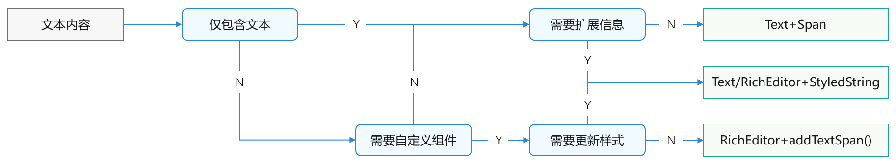
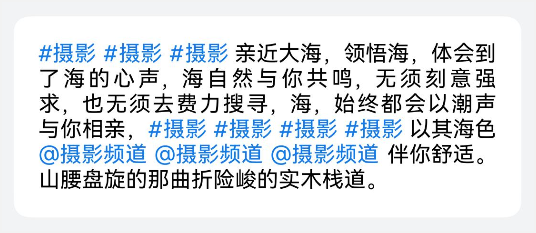
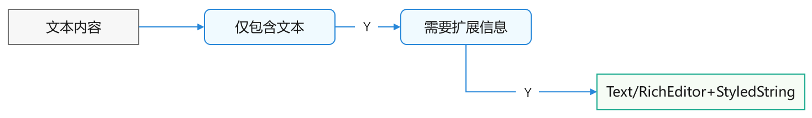
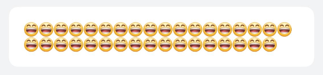
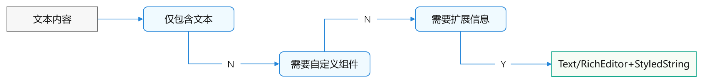
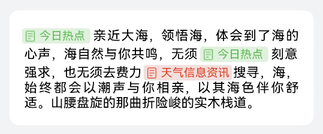
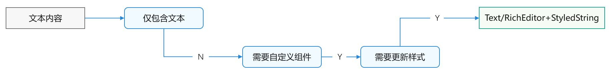

# 富文本显示的选型与开发

更新时间：2026-03-12 08:45:02

来源：https://developer.huawei.com/consumer/cn/doc/best-practices/bpta-rich-text-display

#### 概述

富文本格式是一种便于在不同设备和系统间查看的文本与图形文档格式。本文将重点介绍显示富文本数据所需的相关组件的特性，并探讨如下几种常见场景及其实现方法：
 
- [实现高亮显示的超链接文本](#section16779144302217)
- [实现文本中的图片表情](#section175121131193714)
- [实现自定义的图文元素](#section48901816104715)
- [实现图标与文本的组合元素](#section20943112412539)

 
 

#### 能力介绍

**特点**
 
应用中的富文本可能具有以下特点：
 
- 文本样式：包括字体前景色、背景色、字体类型、字号、粗体、下划线、删除线等装饰线、基线偏移、字符间距、行高和段落样式等。
- 定制效果：如边框、阴影、渐变和背景图片等。
- 图文混排：支持emoji表情、图标和网络图片等。
- 高亮超链接：包括@提醒、#标签、电话、Email和Https链接等。
- 手势交互：支持单击和长按等操作。
- 应用范围：富文本可能在文本显示的任何区域使用，如详情页内容、列表信息流、编辑器及弹窗提示框等。

 
**能力支持**
 
以下为当前各种组件能力支持情况的汇总表，仅供参考。
  
| 技术方案 | Text/RichEditor+ StyledString 属性字符串 | Text+Span子组件 | Text+ enableDataDetector() 文本识别 | RichEditor+ addTextSpan() | Web | RichText(Deprecated) |
| --- | --- | --- | --- | --- | --- | --- |
| 支持元素种类 | 文本、图片、自定义 | Span、ImageSpan、 SymbolSpan、 ContainerSpan | TextDataDetectorType 中的类型，包括电话号码、 链接、邮箱、地址、时间 | 文本、图片、自定义 | 丰富，HTML标签元素 | 支持标签范围内的元素 |
| 扩展元素类型 | 支持 | 不支持 | 不支持 | 支持 | 不支持 | 不支持 |
| 自定义元素样式 | 支持 | Span、ImageSpan、 SymbolSpan、ContainerSpan 组件属性范围内的样式设置 | 支持颜色、装饰线设置 | 支持 | 通过css支持 | 通过css有限支持 |
| 元素事件类型 | 点击、长按 | Span、ImageSpan支持点击 | 点击 | 点击、长按 | 点击 | 不支持 |
| 自定义元素事件 | 支持 | 支持 | 不支持 | 支持 | 支持 | 不支持 |
| 自定义扩展信息 | 支持 | 自行维护 | 自行维护 | 自行维护 | 自行维护 | 自行维护 |
| 加载HTML文本 并渲染显示 | 仅支持&lt;p&gt;、&lt;span&gt;、 &lt;img&gt; | 不支持 | 不支持 | 不支持 | 支持 | 有限支持：标签范围 |
| 长列表中显示 | 支持 | 支持 | 支持 | 支持 | 不推荐，影响性能 | 不推荐，影响性能 |
| 宽高根据内容自 适应 | 支持 | 支持 | 支持 | 支持 | 不支持 | 不支持 |
 
 
**使用建议**
 
建议开发者全面考虑需求场景的特点及其潜在的扩展需求，然后根据自身能力进行技术选型。
  
| Text/RichEditor+ StyledString 属性字符串 | Text+Span 等Text的子组件 | Text+ enableDataDetector() 文本识别方法 | RichEditor+ addTextSpan() 类似方法 | Web | RichText(Deprecated) |
| --- | --- | --- | --- | --- | --- |
| 可以更新各元素的 样式； 可自定义富文本的 呈现效果； 可扩展元素种类并 自定义其样式； 元素可携带自定义 扩展信息。 | 通过子组件布局 实现，结构较为 清晰； 支持的元素种类 有限 （如文本、 图片、图标 等）。 | 使用相对简单； 仅支持文本内容； 依赖底层的识别能力； 事件和菜单不可自定 义。 | 可以自定义富文本 的呈现效果； 可以扩展元素种类 并自定义样式； 不支持更新自定义 Span的样式； 扩展信息需由开发 者自行维护。 | 支持加载和显示本地网页、在线网页及HTML格式的文本； 不适用于长列表等特定场景。 | 可加载并显示 HTML格式的文本， 适用于元素样式在 其标签范围内的 场景； 较为消耗内存 资源； 不适用于长列 表等场景； 不适用于需要 对HTML字符 串显示效果 进行大量自 定义的应用 场景。 |
 
 
**选择路线图**
 
 



 
从上图可以看出，在简单场景中通常使用[Text](https://developer.huawei.com/consumer/cn/doc/harmonyos-references/ts-basic-components-text)+[Span](https://developer.huawei.com/consumer/cn/doc/harmonyos-references/ts-basic-components-span)组件，因为其使用简便且能满足需求，可以优先考虑。相比之下，[RichEditor](https://developer.huawei.com/consumer/cn/doc/harmonyos-references/ts-basic-components-richeditor)+[addTextSpan()](https://developer.huawei.com/consumer/cn/doc/harmonyos-references/ts-basic-components-richeditor#addtextspan)较为复杂，适用于更复杂的场景。而[Text](https://developer.huawei.com/consumer/cn/doc/harmonyos-references/ts-basic-components-text)/[RichEditor](https://developer.huawei.com/consumer/cn/doc/harmonyos-references/ts-basic-components-richeditor)+[StyledString](https://developer.huawei.com/consumer/cn/doc/harmonyos-references/ts-universal-styled-string#styledstring)属性字符串的使用虽然更为复杂，但其兼容性更高，功能更丰富，可以根据具体场景自定义组件，适用范围更广。以下将详细介绍几种常见属性字符串的应用案例。
 

#### 实现高亮显示的超链接文本

 

#### 场景描述

在社交和聊天等应用平台中，常见的文本元素包括@昵称、#话题和https链接等高亮显示的内容。
 



 
 

#### 实现原理

只需对文中的@昵称和#话题等文字设置高亮样式，并添加点击跳转事件，点击后跳转至相应的话题详情页面或用户详情页面。选择的方案如下：
 



 
可以通过属性字符串[StyledString](https://developer.huawei.com/consumer/cn/doc/harmonyos-references/ts-universal-styled-string#styledstring)中的[TextStyle](https://developer.huawei.com/consumer/cn/doc/harmonyos-references/ts-universal-styled-string#textstyle)属性设置样式，并通过[GestureStyle](https://developer.huawei.com/consumer/cn/doc/harmonyos-references/ts-universal-styled-string#gesturestyle)属性实现点击事件。
 
 

#### 开发步骤

1. 初始化时通过[TextStyle](https://developer.huawei.com/consumer/cn/doc/harmonyos-references/ts-universal-styled-string#textstyle)属性定义文字样式，包括文字颜色、大小等。

  
```ArkTS
textAttribute: TextStyle = new TextStyle({
  fontColor: $r('app.color.styled_text_link_font_color'),
  fontSize: LengthMetrics.fp(14)
});
```

2. 使用[GestureStyle](https://developer.huawei.com/consumer/cn/doc/harmonyos-references/ts-universal-styled-string#gesturestyle)属性定义点击超链接时的跳转事件。

  
```ArkTS
generateClickStyle(span: MyCustomSpan): GestureStyle {
  return new GestureStyle({
    onClick: () => {
      this.linkClickCallback(span);
    }
  })
}
```

3. 循环处理文本数据，并生成属性字符串。

  
```ArkTS
handleStyledString() {
  if (this.systemLanguage === 'zh-Hans') {
    this.spans = TitleLinkMock;
  } else {
    this.spans = TitleLinkMock_EN;
  }
  this.spans.forEach((span) => {
    if (span.url) {
      this.handleLink(span);
    } else {
      this.styledStrings.push(new MutableStyledString(span.content, []));
    }
  });

  this.controller = HandleData.handleStyledString(this.styledStrings);
}
```

4. 设置文本样式和点击事件。

  
```ArkTS
handleLink(span: MyCustomSpan) {
  this.styledStrings.push(new MutableStyledString(span.content, [{
    start: 0,
    length: span.content.length,
    styledKey: StyledStringKey.GESTURE,
    styledValue: this.generateClickStyle(span)
  }, {
    start: 0,
    length: span.content.length,
    styledKey: StyledStringKey.FONT,
    styledValue: this.textAttribute
  }
  ]));
}
```

5. 将生成的属性信息拼接成属性字符串，并绑定到[Text](https://developer.huawei.com/consumer/cn/doc/harmonyos-references/ts-basic-components-text)组件以进行渲染显示。

  
```ArkTS
static handleStyledString(styledStrings: MutableStyledString[]): TextController {
  let controller: TextController = new TextController();
  let paragraphStyledString: MutableStyledString = new MutableStyledString('', []);

  // Append the attribute string generated for each text fragment to the attribute string paragraphStyledString
  styledStrings.forEach((mutableStyledString: MutableStyledString) => {
    paragraphStyledString.appendStyledString(mutableStyledString);
  })

  controller.setStyledString(paragraphStyledString);
  return controller;
}
```

 

#### 实现文本中的图片表情

 

#### 场景描述

 
文本中的自定义emoji表情通常使用类似[哈哈]这样的字符进行传输，但在显示时会被替换为本地或网络图片。
 



 

#### 实现原理

文本中显示为表情图片，需要调整其样式设置，而无需编辑文本信息。以下是可选方案：
 


 
可以先获取输入字符对应的图片，然后通过属性字符串[StyledString](https://developer.huawei.com/consumer/cn/doc/harmonyos-references/ts-universal-styled-string#styledstring)的[ImageAttachment](https://developer.huawei.com/consumer/cn/doc/harmonyos-references/ts-universal-styled-string#imageattachment)属性加载图片，并使用[UserDataSpan](https://developer.huawei.com/consumer/cn/doc/harmonyos-references/ts-universal-styled-string#userdataspan)属性存储自定义扩展信息。
 
 

#### 开发步骤
1. 初始化声明文字和图片的对应关系。

  
```ArkTS
export const EMOJI_DATA: Map<string, Resource> = new Map([
  ["[哈哈]", $r('app.media.smile')]
]);
```

2. 循环处理文本数据，并生成属性字符串。

  
```ArkTS
handleStyledString() {
  this.spans = EmojiMock;
  this.spans.forEach((span) => {
    this.handleEmoji(span);
  });

  this.controller = HandleData.handleStyledString(this.styledStrings);
}
```

3. 将输入的文本转换为图片，使用[ImageAttachment](https://developer.huawei.com/consumer/cn/doc/harmonyos-references/ts-universal-styled-string#imageattachment)，设置图片资源和大小等。

  
```ArkTS
handleEmoji(span: MyCustomSpan) {
  this.styledStrings.push(new MutableStyledString(new ImageAttachment({
    resourceValue: EMOJI_DATA.get(span.content),
    size: {
      width: 16,
      height: 16
    }
  })));
}
```

4. 将生成的属性信息拼接成属性字符串，并绑定到[Text](https://developer.huawei.com/consumer/cn/doc/harmonyos-references/ts-basic-components-text)组件以进行渲染显示。

  
```ArkTS
static handleStyledString(styledStrings: MutableStyledString[]): TextController {
  let controller: TextController = new TextController();
  let paragraphStyledString: MutableStyledString = new MutableStyledString('', []);

  // Append the attribute string generated for each text fragment to the attribute string paragraphStyledString
  styledStrings.forEach((mutableStyledString: MutableStyledString) => {
    paragraphStyledString.appendStyledString(mutableStyledString);
  })

  controller.setStyledString(paragraphStyledString);
  return controller;
}
```

 
 

#### 实现自定义的图文元素

 

#### 场景描述

文中包含小图标与文本的组合，点击可跳转至详情页面。
 


 
 

#### 实现原理

文本中包含一个系统小图标和一段高亮显示的文字，点击可跳转至详情页面。选择方案如下：
 



 
需要自定义一个包含系统图标的超链接文本，可以通过属性字符串[StyledString](https://developer.huawei.com/consumer/cn/doc/harmonyos-references/ts-universal-styled-string#styledstring)中的[ImageAttachment](https://developer.huawei.com/consumer/cn/doc/harmonyos-references/ts-universal-styled-string#imageattachment)属性来加载系统图片，并通过[TextStyle](https://developer.huawei.com/consumer/cn/doc/harmonyos-references/ts-universal-styled-string#textstyle)属性设置来调整字体样式，点击事件则可以通过[GestureStyle](https://developer.huawei.com/consumer/cn/doc/harmonyos-references/ts-universal-styled-string#gesturestyle)属性来实现。
 
 

#### 开发步骤
1. 初始化时通过[TextStyle](https://developer.huawei.com/consumer/cn/doc/harmonyos-references/ts-universal-styled-string#textstyle)属性定义文字样式，包括文字颜色、大小等。

  
```ArkTS
textAttribute: TextStyle = new TextStyle({
  fontColor: $r('app.color.styled_text_link_font_color'),
  fontSize: LengthMetrics.fp(14)
});
```

2. 使用[GestureStyle](https://developer.huawei.com/consumer/cn/doc/harmonyos-references/ts-universal-styled-string#gesturestyle)属性定义点击超链接时的跳转事件。

  
```ArkTS
generateClickStyle(span: MyCustomSpan): GestureStyle {
  return new GestureStyle({
    onClick: () => {
      this.linkClickCallback(span);
    }
  })
}
```

3. 实现点击跳转。

  
```ArkTS
private linkClickCallback: (span: MyCustomSpan) => void =
  (span: MyCustomSpan) => {
    // Process according to the type of text hyperlink.
    if (span) {
      let uiContext = this.getUIContext();
      let router = uiContext.getRouter();
         if (span.url !== null) {
        router.pushUrl({ url: span.url });
      }
    }
  };
```

4. 循环处理文本数据，并生成属性字符串。

  
```ArkTS
handleStyledString() {
  if (this.systemLanguage === 'zh-Hans') {
    this.spans = VideoLinkMock;
  } else {
    this.spans = VideoLinkMock_EN;
  }
  this.spans.forEach((span) => {
    if (span.url) {
      this.handleVideoLink(span);
    } else {
      this.styledStrings.push(new MutableStyledString(span.content, []));
    }
  });

  this.controller = HandleData.handleStyledString(this.styledStrings);
}
```

5. 设置小图标、文本样式和点击事件。

  
```ArkTS
handleVideoLink(span: MyCustomSpan) {
  // If the pixelMap for the video link icon exists, add an image attachment styled string before the corresponding link
  this.styledStrings.push(new MutableStyledString(new ImageAttachment({
    resourceValue: $r('app.media.play_round_rectangle'),
    size: {
      width: $r('app.integer.styled_text_video_link_icon_size'),
      height: $r('app.integer.styled_text_video_link_icon_size')
    },
    verticalAlign: ImageSpanAlignment.CENTER,
    objectFit: ImageFit.Contain
  })));
  this.styledStrings.push(new MutableStyledString(span.content, [{
    start: 0,
    length: span.content.length,
    styledKey: StyledStringKey.GESTURE,
    styledValue: this.generateClickStyle(span)
  }, {
    start: 0,
    length: span.content.length,
    styledKey: StyledStringKey.FONT,
    styledValue: this.textAttribute
  }
  ]));
}
```

6. 将生成的属性信息拼接成属性字符串，并绑定到[Text](https://developer.huawei.com/consumer/cn/doc/harmonyos-references/ts-basic-components-text)组件以进行渲染显示。

  
```ArkTS
static handleStyledString(styledStrings: MutableStyledString[]): TextController {
  let controller: TextController = new TextController();
  let paragraphStyledString: MutableStyledString = new MutableStyledString('', []);

  // Append the attribute string generated for each text fragment to the attribute string paragraphStyledString
  styledStrings.forEach((mutableStyledString: MutableStyledString) => {
    paragraphStyledString.appendStyledString(mutableStyledString);
  })

  controller.setStyledString(paragraphStyledString);
  return controller;
}
```

 
 

#### 实现图标与文本的组合元素

 

#### 场景描述

文中包含自定义的小图标与文本的组合。
 



 
 

#### 实现原理

文本中包含一个小图标、文字和背景颜色的复杂样式。以下是选择方案：
 



 
需要通过属性字符串[StyledString](https://developer.huawei.com/consumer/cn/doc/harmonyos-references/ts-universal-styled-string#styledstring)属性中的自定义[CustomSpan](https://developer.huawei.com/consumer/cn/doc/harmonyos-references/ts-universal-styled-string#customspan)来进行绘制。
 
 

#### 开发步骤
1. 创建自定义的[CustomSpan](https://developer.huawei.com/consumer/cn/doc/harmonyos-references/ts-universal-styled-string#customspan)以绘制自定义样式。

  
```ArkTS
export class MyDrawCustomSpan extends CustomSpan {
  width: number = 0;
  word: string = "drawing";
  height: number = 10;
  systemLanguage: string = 'zh-Hans';
  color: string | undefined = undefined;
  gUIContext: UIContext | undefined = undefined;

  // ...

  // Draw
  onDraw(context: DrawContext, options: CustomSpanDrawInfo) {
    let canvas = context.canvas;

    // Set brush
    const brush = new drawing.Brush();
    // ...

    // Calculate offset
    let _left = options.x - 50;
    if (this.systemLanguage !== 'zh-Hans') {
      _left = options.x - 40;
    }

    // Draw a rounded rectangle
    let rect: common2D.Rect = {
      left: _left,
      top: options.lineTop + 11,
      right: options.x + this.width,
      bottom: options.lineBottom
    };

    let roundRect = new drawing.RoundRect(rect, 10, 10);
    canvas.drawRoundRect(roundRect);
    // ...

    const font = new drawing.Font();
    font.setSize(40);
    const textBlob = drawing.TextBlob.makeFromString(this.word, font, drawing.TextEncoding.TEXT_ENCODING_UTF8);
    canvas.attachBrush(brush);
    canvas.drawTextBlob(textBlob, options.x + 5, options.lineBottom - 10);
    canvas.detachBrush();
  }

  setWord(word: string) {
    this.word = word;
  }
}
```

2. 循环处理文本数据，并生成属性字符串。

  
```ArkTS
handleStyledString() {
  if (this.systemLanguage === 'zh-Hans') {
    this.spans = ImageTextMock;
  } else {
    this.spans = ImageTextMock_EN;
  }
  this.spans.forEach((span) => {
    if (span.url) {
      this.handleImageText(span);
    } else {
      this.styledStrings.push(new MutableStyledString(span.content, []));
    }
  });

  this.controller = HandleData.handleStyledString(this.styledStrings);
}
```

3. 设置自定义图文元素。

  
```ArkTS
handleImageText(span: MyCustomSpan) {
  let resourceStr = $r('app.media.doc_plaintext_green');
  // ...

  this.styledStrings.push(new MutableStyledString(new ImageAttachment({
    resourceValue: resourceStr,
    size: {
      width: 13,
      height: 13
    },
    layoutStyle: {
      margin: { top: 4 }
    },
    verticalAlign: ImageSpanAlignment.CENTER
  })));
  // Calculate the required width based on language
  let width = 15 + 40 * span.content.length;
  if (this.systemLanguage !== 'zh-Hans') {
    width = 25 + 21 * span.content.length;
  }
  this.styledStrings.push(new MutableStyledString(new MyDrawCustomSpan(span.content, width, 20,this.systemLanguage,
    span.url, gUIContext)));
}
```

4. 将生成的属性信息拼接成属性字符串，并绑定到[Text](https://developer.huawei.com/consumer/cn/doc/harmonyos-references/ts-basic-components-text)组件以进行渲染和显示。

  
```ArkTS
static handleStyledString(styledStrings: MutableStyledString[]): TextController {
  let controller: TextController = new TextController();
  let paragraphStyledString: MutableStyledString = new MutableStyledString('', []);

  // Append the attribute string generated for each text fragment to the attribute string paragraphStyledString
  styledStrings.forEach((mutableStyledString: MutableStyledString) => {
    paragraphStyledString.appendStyledString(mutableStyledString);
  })

  controller.setStyledString(paragraphStyledString);
  return controller;
}
```

 
 

#### 示例代码

- [实现富文本信息的显示](https://gitcode.com/harmonyos_samples/styledtext)
