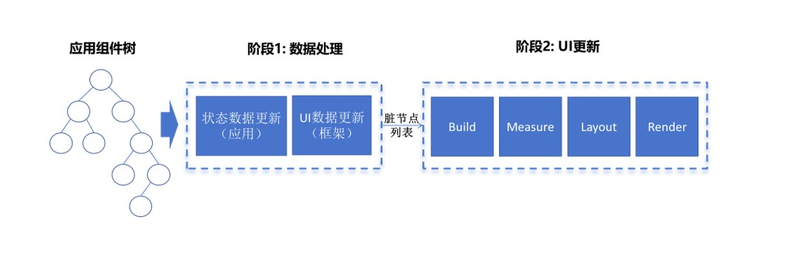
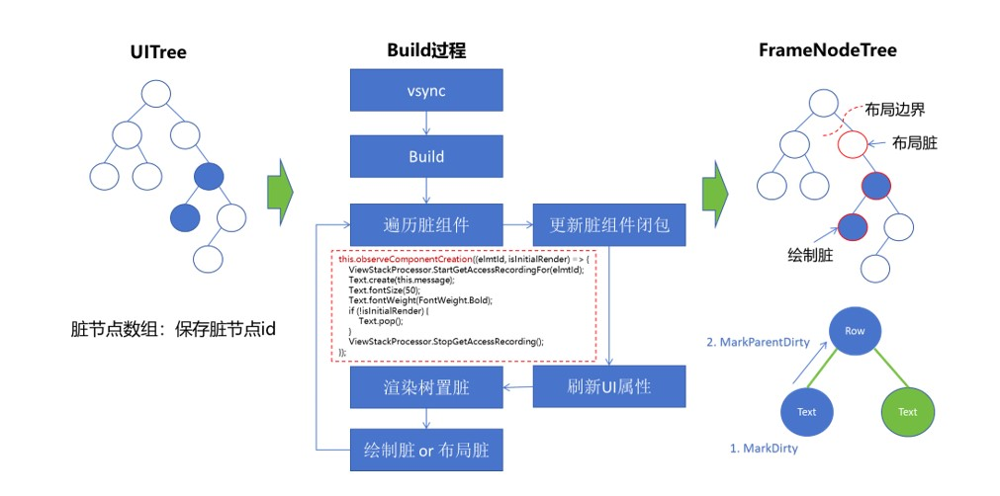
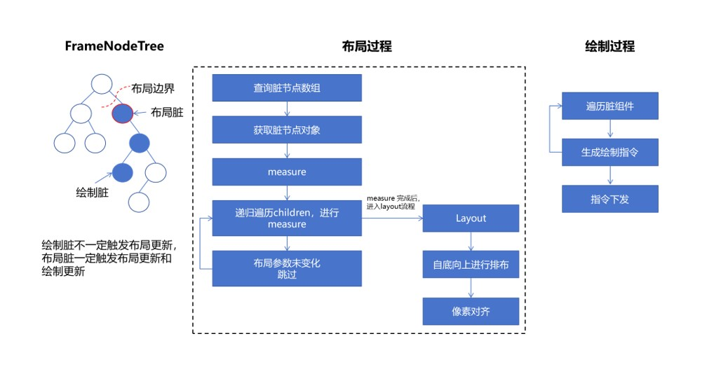
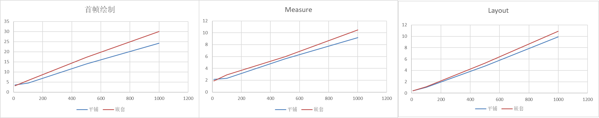
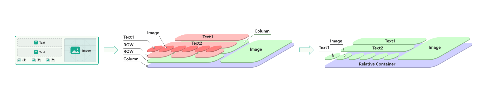
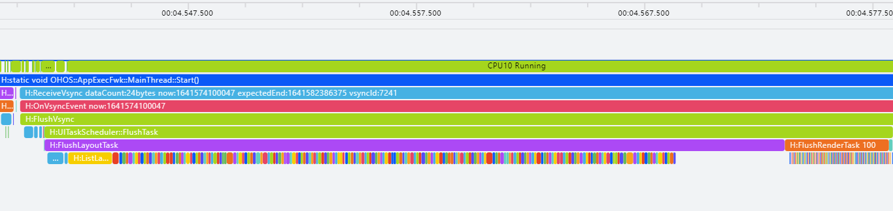
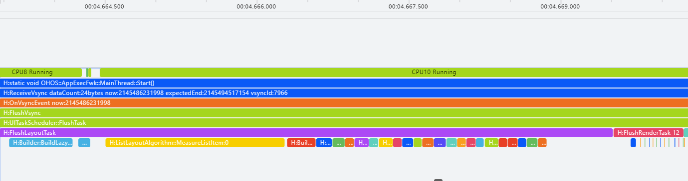

# 布局优化指导

更新时间：2026-03-19 08:43:01

来源：https://developer.huawei.com/consumer/cn/doc/best-practices/bpta-improve-layout-performance

## ArkUI框架执行流程


在使用ArkUI开发中，我们通过布局组件和基础组件进行界面描述，这些描述会呈现出一个组件树的结构，基础组件在其中为叶子节点，布局组件则是中间节点，可以把这棵树称之为应用组件树。当用户执行交互（滑动，点击等行为）时会触发界面修改，界面的修改本质上是通过触发这棵组件树的重新渲染，来实现应用界面更新的过程。





应用界面更新的过程主要分为两个过程：数据处理过程和UI更新过程。

1. 数据处理过程中主要是对状态数据进行更新，状态数据指的是所定义的@State等相关的数据。数据变化时，会有一定的更新耗时，并且数据关联的组件数量，也影响下一步UI更新的耗时，在开发过程中需要避免无效的数据更新，从而减少冗余的UI更新耗时。关于这部分的优化措施可以参考《[状态管理最佳实践](https://developer.huawei.com/consumer/cn/doc/best-practices/bpta-status-management)》。
2. UI更新过程中则是对需要更新的元素进行更新操作，对应的元素会经历Build、Measure、Layout和Render等阶段。其中Build是执行组件创建和组件标脏（即标记需要更新的组件，当组件的属性状态发生变化时，框架会将其标记为"脏"状态，表示需要进行重新构建）的过程，Measure是对组件的宽高进行测量的阶段，Layout是对元素进行在屏幕上位置进行摆放的阶段，而Render则是根据测量和布局得到的大小位置等信息，进行提交绘制的过程。


> [!NOTE]
> 在初次进入页面的时候，所有的组件都会参与到界面的渲染中（换句说法，初次渲染的时候，可以认为所有的组件都需要更新）。


### UI更新过程


UI更新过程包含组件标脏及布局计算。初始加载阶段，所有组件（排除if/else条件不成立的分支和LazyForEach不可视区域内容）都会完整经历Build、Measure、Layout、Render流程。界面更新阶段，当触发列表滑动、显示/隐藏切换、元素属性（内容/样式/位置/尺寸）变化时，UI线程会先将脏节点进行Build，Build的过程会按照组件id，依次更新组件设置的属性，如果属性发生改变，则进行组件标脏。

- 若布局属性变化（width/height/padding/margin等）：标记为"布局脏" ，找到布局边界，进行子树更新。
- 若非布局属性（样式属性）变化（color/backgroundColor/opacity等）：仅会影响自身属性，不会进行子树查找。


多数情况下，如果某个组件的布局发生变化，也会对其他组件的布局也会产生影响，所以当有组件的布局发生变化，最简单的办法就是对整棵树进行重新布局，但是这样对整棵树进行重新布局的代价太大。标脏过程就是用来确定布局最小影响范围，来减少对整棵树进行重新布局的代价，而这个影响范围就是布局边界以内。

一般来讲，如果一个组件设置了固定的宽高尺寸，那这个组件就是布局边界。其内部组件布局的变化，不会影响到此布局边界外部的布局情况，那么在查找的时候，只需要在布局边界内部判断哪些组件的布局会受到影响，可以避免在整棵树结构的查找过程。





确定实际的脏节点数组后，根据脏节点数组来拿到对应的脏节点对象，通过递归遍历children进行Measure过程，如果该对象布局参数没有发生变化，就会跳过对应的Measure阶段。当Measure执行完成后，进行layout阶段。





从以上的过程可以看出，影响UI更新过程的主要因素是参与更新的节点数量。

在初次加载的时候，由于所有的节点都要参与全过程，那么如果对首帧渲染的速度有要求，就需要降低整体页面的组件节点数量。

在页面内容更新过程中，由于状态变量的变化导致UI的更新，可以利用布局边界减少子树更新的数量以及减少布局的计算。


## 精简节点数


> [!NOTE]
> 建议开发者优先使用[Code Linter扫描工具](https://developer.huawei.com/consumer/cn/doc/harmonyos-guides/ide-code-linter)进行代码检查，重点关注[@performance/hp-arkui-remove-container-without-property](https://developer.huawei.com/consumer/cn/doc/harmonyos-guides/ide_hp-arkui-remove-container-without-property)规则。若扫描结果中出现该规则相关问题，可参考本章节提供的优化建议进行调整。


布局阶段是采用递归遍历所有节点的方式进行组件位置和大小的计算， 如果嵌套层级过深，将带来更多的中间节点，在布局测算阶段下，额外的节点数将导致更多的计算过程，造成性能劣化。我们通过模拟10、100、500、1000层Row嵌套的情况下，通过Profiler工具抓取Launch数据查看对应的首帧绘制，以及页面Measure/Layout时间进行对比。

```text
Row() {
... // 10、100、500、1000层Row容器嵌套
Row() {
Text('Inner Text')
}
...
}
```

然后进一步对比在平铺的情况下，Row内组件个数在10、100、500、1000的条件下，使用Profiler工具抓取Launch的数据情况，得到如下结果如表1所示。

```text
Row() {
Row() {}
... // 10、100、500、1000层Row容器并排
Text('Inner Text')
}
```


| 对比指标 | 10 | 100 | 500 | 1000 |  |
| --- | --- | --- | --- | --- | --- |
| 嵌套/层 | 首帧绘制 | 3.2ms | 5.8ms | 17.3ms | 32ms |
| Measure | 1.88ms | 2.89ms | 5.93ms | 10.46ms |  |
| Layout | 0.38ms | 1.12ms | 5.26ms | 10.88ms |  |
| 平铺 /个 | 首帧绘制 | 3.6ms | 4.5ms | 14ms | 24.3ms |
| Measure | 2.15ms | 2.31ms | 5.61ms | 9.26ms |  |
| Layout | 0.39ms | 1.38ms | 4.74ms | 9.92ms |  |


> [!NOTE]
> 以上数据来源均为版本DevEco Studio 4.0.3.415、SDK 4.0.10.9条件下测试得到，不同设备类型数据可能存在差异，测试数据旨在体现性能优化趋势，仅供参考。





根据以上数据对比发现，组件平铺和嵌套在相同组件个数的情况下，其性能差异不大，并且整体上趋势保持一致，随着组件数量增加呈现线性增长的劣化，由此可以得到结论，真正影响布局性能的因素是参与布局的节点数量。所以在进行布局时，应该尽量减少整体的节点数，来减少布局的性能劣化。

针对减少总节点，主要有两个方向：

- 移除冗余的节点。
- 使用扁平化布局减少节点数。


移除冗余节点

对于常出现冗余的情况，例如可能会在Row容器包含一个同样也是Row容器的子级。这种嵌套实际是多余的，并且会给布局层次结构造成不必要的开销。

```text
Row() {
Row(){
Image()
Text()
}
Image()
}
```

由于其中Row容器父子布局方向相同，所以可以去掉Image和Text外层的Row来减少层级，如果视图更加复杂，布局在渲染时，会产生没有必要的计算。

```text
Row() {
Image()
Text()
Image()
}
```

尽管在这里只是多了一层，但是实际开发中的布局往往非常复杂，冗余带来的开销可能非常影响布局性能，尤其是在列表中动态创建组件时，带来的性能影响是显著的。

使用扁平化布局减少节点数

在某些情况下，开发者所实现的布局在嵌套层级上是没有冗余的，但是嵌套层级仍然较深，可能无法通过调整现有的布局方案，使其不包含多余的布局，唯一的解决方案可能是，通过切换到完全不同的布局类型来实现层次结构的扁平化。

例如图1中元素结构示意图，传统使用线性布局的情况下，总共存在4层嵌套、共15个节点，并且其中并没有冗余的嵌套节点。而扁平化布局是一种让页面结构变浅变宽的方式，通过一些高级组件如RelativeContainer、Grid等容器，可以让元素在平面上展开。这种布局方式能够有效减少由于使用线性布局带来的嵌套深度，将其用于描述布局的容器节点进行优化，达到精简节点数的目的。图1中将线性布局改成相对布局的情况下，嵌套2层、总共10个节点，相比之下前后少了5个节点。

图1 扁平化布局示意图




这种方式对于布局的影响主要体现在：

1. 页面创建时，扁平化减少了中间的嵌套层级，使总的组件节点的数量越少，在进行布局时所需要进行的计算相对越少。
2. 页面更新时，当要更新的结构是嵌套子树的结构，其树内包含过多节点时，整体更新会导致更新的节点数过多，造成布局性能劣化。


所以当页面不存在冗余节点时，可以考虑是否能够通过替换为更高级的布局使得页面扁平化，来达到减少节点数的目的。主要方式可以参考：

- [RelativeContainer](https://developer.huawei.com/consumer/cn/doc/harmonyos-guides/arkts-layout-development-relative-layout) 通过相对布局实现扁平化。
- [绝对定位](https://developer.huawei.com/consumer/cn/doc/harmonyos-references/ts-universal-attributes-location#position) 通过锚点定位实现扁平化。
- [Grid](https://developer.huawei.com/consumer/cn/doc/harmonyos-guides/arkts-layout-development-create-grid) 通过二维布局实现扁平化。


## 利用布局边界减少布局计算


对于组件的宽高不需要自适应的情况下，建议在UI描述时给定组件的宽高数值，当其组件外部的容器尺寸发生变化时，例如拖拽缩放等场景下，如果组件本身的宽高是固定的，理论上来讲，该组件在布局阶段不会参与Measure阶段，其节点中保存了对应的大小信息，如果组件内容较多时，由于避免了其中组件整体的测算过程，性能会带来较大的提升。

我们通过修改以下示例代码中Column的宽度，对比给Row设置固定宽度.width(300).height(400)、百分比.width('100%').height('70%')以及不设置宽高的情况下的页面绘制、Measure、Layout时间。
```text
Column() {
Button("修改宽度").onClick(() => {
this.testWidth = '90%'
}).height('20%')

Row() {
// 400条文本数据
}
}.width(this.testWidth )
```


对比的结果如下：


| 对比指标/ms | 限定容器的宽高为固定值 | 未设置容器的宽高 | 限定容器的宽高为百分比 |
| --- | --- | --- | --- |
| 首帧绘制 | 60.20ms | 59.99ms | 60.50ms |
| Measure | 17.80ms | 17.76ms | 16.92ms |
| Layout | 5.5ms | 4.91ms | 4.92ms |
| 重新绘制 | 2.0ms | 38.45ms | 42.62ms |
| 重绘的Measure | 0.50ms | 18.87ms | 20.93ms |
| 重绘的Layout | 0.12ms | 1.41ms | 1.80ms |


> [!NOTE]
> 以上数据来源均为版本DevEco Studio 4.0.3.415、SDK 4.0.10.9条件下测试得到，不同设备类型数据可能存在差异，测试数据旨在体现性能优化趋势，仅供参考。


由上数据可以发现：

- 首次绘制时，三种情况数据相差不大。
- 重新绘制时，限定容器宽高为固定值的情况下，性能提升明显。


分析原因可以得到，这是由于首次绘制的情况下，无论是否设置宽高属性，都会对所有组件进行布局和测算的过程，来得到最终的组件大小和位置。而当触发按钮修改外层Column的宽度时，也就是触发重新绘制的情况下，给定容器宽高为固定值的性能远远优于未设置宽高和设置百分比宽高，这是由于对于未设置宽高以及设置百分比宽高的情况下，在外层容器宽高发生变化时，组件本身也会触发重新进行Measure的过程，对组件的宽高进行重新测算，导致其布局时间很长，而设置了固定宽高的组件，则不会经过这一过程，而是直接使用初次绘制时保留的节点大小数据，减少了测算的时间，这对于性能的提升是尤为明显的，尤其是当组件内的内容十分复杂的情况下。

所以对于能够在初期给定宽高的组件，在进行UI描述时尽量给定宽高数值，能够减少由于容器尺寸变化造成的重新测算过程的性能。


## 合理使用渲染控制语法


### 合理控制元素显示与隐藏


控制元素显示与隐藏是一种常见的场景，使用visibility属性、if条件判断等都能够实现该效果。其中if条件判断控制的是组件的创建、布局阶段，visibility属性控制的是元素在布局阶段是否参与布局渲染。使用时如果使用的方式不当，将引起性能上的问题。

对于不同的场景下，需要选择合适的手段，根据性能或者内存要求选择不同的实现方式：

- 只有初始的一次渲染或者交互次数很少的情况下，建议使用if条件判断来控制元素的显示与隐藏效果，对于内存有较大提升。
- 如果会频繁响应显示与隐藏的交互效果，建议使用切换Visibility.None和Visibility.Visible来控制元素显示与隐藏，提高性能。


通过对一个复杂的视图结构，例如以下示例代码中，对包含100个Image组件的Column容器进行显示与隐藏控制，分别采用if条件判断和visibility属性的方式进行控制。

通过if条件判断控制的示例代码如下：

```text
Row() {
Text("Hello World")
if(this.visible) {
Column() {
... // 100个Image组件
}
}
}
```

通过visibility属性控制的示例代码如下：
```text
Row() {
Text("Hello World")
Column() {
... // 100个Image组件
}.visibility(this.visible?Visibility.Visible:Visibility.None)
}
```


在相同的测试环境下，分别测试在初次加载页面，以及改变状态变量this.visible的值来修改显示隐藏的情况下，通过Profiler工具抓取的布局时Measure、Layout以及组件创建的时长。

在初次加载的情况下的测试结果如下：


| 对比指标 | if判断条件为true | if判断条件为false | Visibility.Visible | Visibility.None |
| --- | --- | --- | --- | --- |
| 组件创建时间 | 13.67ms | 3.83ms | 13.38ms | 13.26ms |
| Measure | 2.83ms | 0.92ms | 2.58ms | 2.24ms |
| Layout | 3.79ms | 0.30ms | 2.14ms | 0.39ms |


> [!NOTE]
> 以上数据来源均为版本DevEco Studio 4.0.3.415、SDK 4.0.10.9条件下测试得到，不同设备类型数据可能存在差异，测试数据旨在体现性能优化趋势，仅供参考。


通过以上数据可以发现：

- 通过if条件判断控制显示与隐藏的方式： 对比判断值为true和false时，初次加载过程中Measure、Layout时间明显存在区别，并且从组件创建时间可以判断，加载时会根据初始值判断是否创建对应组件内容。
- 当条件为false时，对应的组件内容不参与创建、Measure和Layout阶段。

通过visibility控制显示与隐藏的方式：
- 在初次加载时，无论visibility的值为Visibility.None还是Visibility.Visible都会创建对应组件内容。
- visibility属性控制的是Measure和Layout阶段，当visibility属性为Visibility.None时，对应的组件不参与Layout。


在切换显示状态的情况下的结果如下：


| 对比指标 | if判断条件为true | if判断条件为false | Visibility.Visible | Visibility.None |
| --- | --- | --- | --- | --- |
| 组件创建时间 | 13.67ms | 3.83ms | \ | \ |
| Measure | 3.10ms | 0.13ms | 0.19ms | 0.10ms |
| Layout | 1.64ms | 0.60ms | 0.27ms | 0.07ms |


> [!NOTE]
> 以上数据来源均为版本DevEco Studio 4.0.3.415、SDK 4.0.10.9条件下测试得到，不同设备类型数据可能存在差异，测试数据旨在体现性能优化趋势，仅供参考。


在切换显示状态的情况下：

- 使用if条件判断切换显示时，组件会因为条件改变而判断是否参与创建、布局过程，切换过程会出现较大的Measure的性能消耗，原因是创建了新的组件，重新进行了Measure和Layout的过程。


- 使用visibility的情况下，无论是否隐藏，组件在初次已经创建完成，并一直都存在组件树上，不会出现组件重新创建的过程，并且在Measure和Layout阶段的性能消耗比使用if/else的方式性能小很多，原因是组件的计算在首帧时已经计算过，不需要重复计算。


综上所述，在控制组件显示与隐藏时，建议遵循以下原则来选择使用控制方式：

- 在对性能要求较高，并且会频繁切换元素的显示与隐藏的情况下，应该避免使用if条件判断，而改为通过visibility的属性控制，这样在切换Visibility.None和Visibility.Visible时，可以省去组件创建的时间，直接进入渲染过程。
- 如果组件的创建非常消耗资源，且不会立即使用，也并非频繁切换交互的情况下，只在特定条件下才会出现时，可以通过if/else来进行内容的显示与隐藏控制，来达到懒加载的效果。


### 长列表使用懒加载与组件复用


在列表场景下会采用List、Grid、WaterFlow等组件配合ForEach或者LazyForEach来实现，ForEach适合内容长度确定，内容在两屏以内的列表。LazyForEach适合长度超过两屏的列表情况，并且当内容布局相对固定的情况下，配合组件复用的方式来减少滑动过程中的组件创建。在长列表加载丢帧优化中，介绍了较为详细的实践案例，这里我们仅引用一些关键性能收益数据。

懒加载

针对长列表这一场景，在本地模拟了10、100、1000、10000条数据，分别使用ForEach、LazyForEach，来测试关闭和开启懒加载情况下的完全显示所用时间、列表挂载时间、独占内存，并分析了其滑动过程中的丢帧率。其中，列表挂载时间是指创建组件和组件挂载数据的总时长。最终，使用DevEco Studio的Profiler工具检测下述指标，得到的数据如下所示：


| ForEach对比指标 | 10条数据 | 100条数据 | 1000条数据 | 10000条数据 |
| --- | --- | --- | --- | --- |
| 完全显示所用时间 | 1s 741ms | 1s 786ms | 1s 942ms | 5s 841ms |
| 列表挂载时间 | 87ms | 88ms | 135ms | 3s 291ms |
| 独占内存（滑动完成后） | 38.2MB | 48.7MB | 83.7MB | 560.1MB |
| 丢帧率 | 0.0% | 3.8% | 4.5% | 58.2% |


| LazyForEach对比指标 | 10条数据 | 100条数据 | 1000条数据 | 10000条数据 |
| --- | --- | --- | --- | --- |
| 完全显示所用时间 | 1s 544ms | 1s 486ms | 1s 652ms | 1s 707ms |
| 列表挂载时间 | 88ms | 89ms | 94ms | 97ms |
| 独占内存（滑动完成后） | 38.1MB | 44.6MB | 46.3MB | 82.9MB |
| 丢帧率 | 0.0% | 2.3% | 3.6% | 6.6% |


从测试数据可以看出：

1. 在100条数据范围内ForEach和LazyForEach差距不大，总体而言两者各项性能指标都在可接受范围内，而ForEach代码逻辑比LazyForEach简单，此场景下使用ForEach即可。
2. 当数据大于1000条，特别是当数据达到10000条时，ForEach在列表渲染、应用内存占用、丢帧率等各个方面都会有“指数级别”的显著劣化，滑动会出现明显的卡顿，甚至会出现应用crash等现象。
3. 使用LazyForEach除了最后内存稍微增大以外，其列表渲染时间、丢帧率都不会出现明显变化，具有较好的性能。


组件复用

对于使用LazyForEach的情况下，在滑动过程中由于要动态创建组件，会出现BuildLazyItem的耗时，通过组件复用能力，可以减少滑动过程中的组件创建耗时，而组件复用BuildRecycle耗时极短，进一步优化滑动时的性能。

对比长列表案例中开启组件复用和未开启的情况下，其数据如下：


| 组件复用 | 组件复用前 | 组件复用后 |
| --- | --- | --- |
| 丢帧率 | 3.7% | 0% |
| BuildLazyItem耗时 | 10.277ms | 0.749ms |
| BuildRecycle耗时 | 不涉及 | 0.221ms |


可以发现列表滑动时丢帧率明显降低，这是因为，List列表开启了组件复用，不会执行BuildLazyItem这个耗时操作，后续创建新组件节点时，会直接复用缓存区中的节点，这样就大幅节约了组件重新创建的时间。


## 合理使用布局组件


### 选择合适的布局组件


在布局时，子组件会根据父组件的布局算法得到相应的排列规则，然后按照规则进行子组件位置的摆放。不同的布局容器使用的布局算法对性能带来的影响不同。开发者应该根据场景选用合适的布局，除非必须，尽量减少使用性能差的布局组件。

我们常用的基础布局组件包含以下组件：

- 使用[Row](https://developer.huawei.com/consumer/cn/doc/harmonyos-references/ts-container-row)、[Column](https://developer.huawei.com/consumer/cn/doc/harmonyos-references/ts-container-column)构建线性布局。
- 使用[Stack](https://developer.huawei.com/consumer/cn/doc/harmonyos-references/ts-container-stack)构建层叠布局。


上述布局都属于线性布局，顾名思义，在线性布局中排布的组件是按照特定的方向线性放置，如横向/纵向/Z序方向。除上述布局类型外，还有一些复杂布局能力，如Flex、List、Grid、RelativeContainer和自定义布局等。

- 使用Flex构建弹性布局。


- List既具备线性布局的特点，同时支持懒加载和滑动的能力。
- Grid/GridItem提供了宫格布局的能力，同时也支持懒加载和滑动能力。
- RelativeContainer是一种相对布局，通过描述各个内容组件间相互关系来指导内容元素的布局过程，可从横纵两个方面进行布局描述，是一种二维布局算法。


复杂布局提供了场景化的能力，解决一种或者多种布局场景。但是在一些场景下，不恰当的使用这些高级组件，可能带来更多的性能消耗。

我们通过对不同的布局方式，设置对应容器相同的嵌套深度为5、总元素节点为20个Text的情况下，来对比其性能消耗。通过Profiler工具获取其首帧绘制时间进行对比。对比结果如下表：


| 对比指标 | Column/Row | Stack | Flex | RelativeContainer | Grid/GridItem |
| --- | --- | --- | --- | --- | --- |
| 首帧绘制 | 7.13ms | 7.34ms | 11.71ms | 9.13ms | 12.62ms |
| Measure | 2.63ms | 2.70ms | 7.59ms | 3.59ms | 8.68ms |
| Layout | 0.74ms | 0.77ms | 0.83ms | 0.77ms | 0.92ms |


> [!NOTE]
> 以上数据来源均为版本DevEco Studio 4.0.3.415、SDK 4.0.10.9条件下测试得到，不同设备类型数据可能存在差异，测试数据旨在体现性能优化趋势，仅供参考。


可以发现，在布局深度和节点数相同的情况下：

- 使用基础组件如Column和Row容器的性能明显高于其他布局。
- Flex的性能明显低于Column和Row容器，这是由于Flex本身带来的二次布局的影响。
- Grid/GridItem布局、相对布局RelativeContainer的性能消耗高于基础组件Column、Row、Stack等容器。


以上数据都是基于相同布局层数和节点数的情况下的对比结果，反映了布局本身的相对性能消耗，并不意味着使用了该组件性能就一定差，也并非任何情况下使用基础组件都能够保持良好的性能，因为在一些情况下，使用高级组件能够大大减少嵌套层数和节点数，其带来的性能提升反而高于组件本身的性能消耗。所以在使用布局时尽量遵循以下原则：

- 在相同嵌套层级的情况下，如果多种布局方式可以实现相同布局效果，优选低耗时的布局，如使用Column、Row替代Flex实现相同的单行布局。
- 在能够通过其他布局大幅优化节点数的情况下，可以使用高级组件替代，如使用RelativeContainer替代Row、Column实现扁平化布局，此时其收益大于布局组件本身的性能差距。
- 仅在必要的场景下使用高耗时的布局组件，如使用Flex实现折行布局、使用Grid实现二维网格布局等。


### Scroll嵌套List场景下，给定List组件宽高


在使用Scroll容器组件嵌套List组件加载长列表时，若不指定List的宽高尺寸，则默认全部加载。


> [!NOTE]
> Scroll嵌套List时：
>                List没有设置宽高时，List的所有子组件ListItem都会参与布局。        List设置宽高，只有布局区域内的ListItem子组件会参与布局。        List使用ForEach加载子组件时，无论是否设置List的宽高，都会加载所有子组件。        List使用LazyForEach加载子组件时，没有设置List的宽高，会加载所有子组件，设置了List的宽高，会加载List显示区域内的子组件。


在如下代码案例中，通过Scroll嵌套List，对比List设置宽度和不设置的情况下：

```ts
class BasicDataSource implements IDataSource {
  private listeners: DataChangeListener[] = [];
  private originDataArray: string[] = [];

  public totalCount(): number {
    return 0;
  }

  public getData(index: number): string {
    return this.originDataArray[index];
  }

  registerDataChangeListener(listener: DataChangeListener): void {
    if (this.listeners.indexOf(listener) < 0) {
      console.info('add listener');
      this.listeners.push(listener);
    }
  }

  unregisterDataChangeListener(listener: DataChangeListener): void {
    const pos = this.listeners.indexOf(listener);
    if (pos >= 0) {
      console.info('remove listener');
      this.listeners.splice(pos, 1);
    }
  }

  notifyDataReload(): void {
    this.listeners.forEach((listener) => {
      listener.onDataReloaded();
    });
  }

  notifyDataAdd(index: number): void {
    this.listeners.forEach((listener) => {
      listener.onDataAdd(index);
    });
  }

  notifyDataChange(index: number): void {
    this.listeners.forEach((listener) => {
      listener.onDataChange(index);
    });
  }

  notifyDataDelete(index: number): void {
    this.listeners.forEach((listener) => {
      listener.onDataDelete(index);
    });
  }

  notifyDataMove(from: number, to: number): void {
    this.listeners.forEach((listener) => {
      listener.onDataMove(from, to);
    });
  }
}

export class MyDataSource extends BasicDataSource {
  private dataArray: Array<string> = new Array(100).fill('test');

  public totalCount(): number {
    return this.dataArray.length;
  }

  public getData(index: number): string {
    return this.dataArray[index];
  }

  public addData(index: number, data: string): void {
    this.dataArray.splice(index, 0, data);
    this.notifyDataAdd(index);
  }

  public pushData(data: string): void {
    this.dataArray.push(data);
    this.notifyDataAdd(this.dataArray.length - 1);
  }
}
```


不设置宽高的代码样例如下：

```ts
import { MyDataSource } from './segment1';

@Entry
@Component
struct NotSetHeightTestPage {
  private data: MyDataSource = new MyDataSource();

  build() {
    Scroll() {
      List() {
        LazyForEach(this.data, (item: string, index: number) => {
          ListItem() {
            Row() {
              Text('item value: ' + item + (index + 1))
              .fontSize(20)
              .margin(10)
            }
          }
        })
      }
    }
  }
}
```

设置固定高度的代码如下：

```ts
import { MyDataSource } from './segment1';

@Entry
@Component
struct SetHeightTestPage {
  private data: MyDataSource = new MyDataSource();

  build() {
    Scroll() {
      List() {
        LazyForEach(this.data, (item: string, index: number) => {
          ListItem() {
            Row() {
              Text('item value: ' + item + (index + 1))
              .fontSize(20)
              .margin(10)
            }
          }
        })
      }
      .width('100%')
      .height(500)
    }
  }
}
```

通过DevEco Studio的Profiler抓取launch数据可以得到如下：

图2 List宽高不固定




图3 List宽高固定




| 对比数据 | List宽高不固定 | List宽高固定 |
| --- | --- | --- |
| 布局任务数量LayoutTasks/个 | 100 | 12 |
| 布局时间/ms | 32.43 | 6.08 |


未设置宽高的情况下，在进行布局时，从FlushLayoutTask以及FlushRenderTask的数据可以看到参与布局的组件数量是100个，设置了List宽高的情况下，从FlushLayoutTask以及FlushRenderTask的数据可以看到参与布局的组件数量是12个。说明对于Scroll嵌套List的情况下，如果不设置List宽高，由于Scroll是可滚动容器，其高度为无穷大，List在不设置的高度的情况下，高度也为无穷大，所以此时会创建所有的内容。而设置了高度的情况下，只会创建给定高度内的组件内容，所以为12个。体现在布局时间上，没有设置宽高的情况下，总体布局时间是32.43ms，设置了固定宽高数值的情况下，时间为6.08ms，大幅提升了首次加载时的性能。


## 问题定位工具


性能是一个涉及许多方面的复杂问题。DevEco Studio提供了工具可以为您提供关于性能瓶颈发生位置的明确提示，使用工具Profiler 查看性能参数可以参考使用Profiler进行性能调优，使用ArkUI Inspector查看组件树结构可以参考布局分析。
