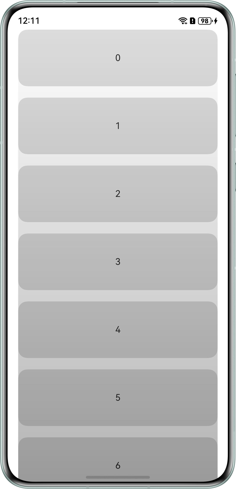
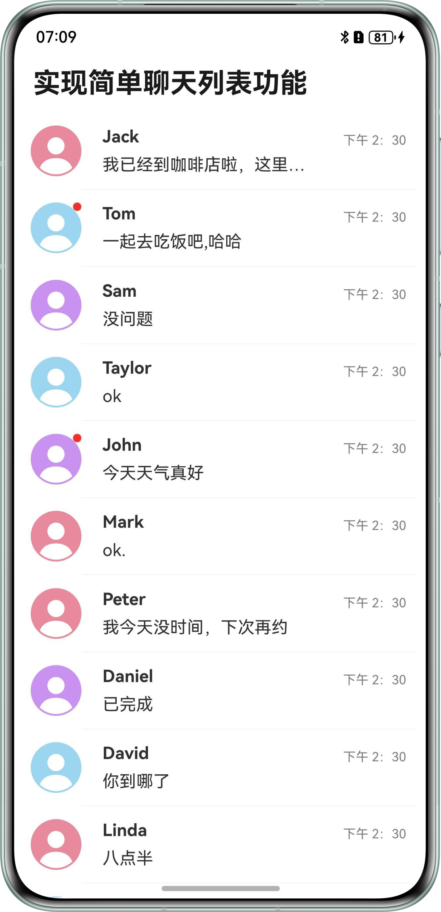
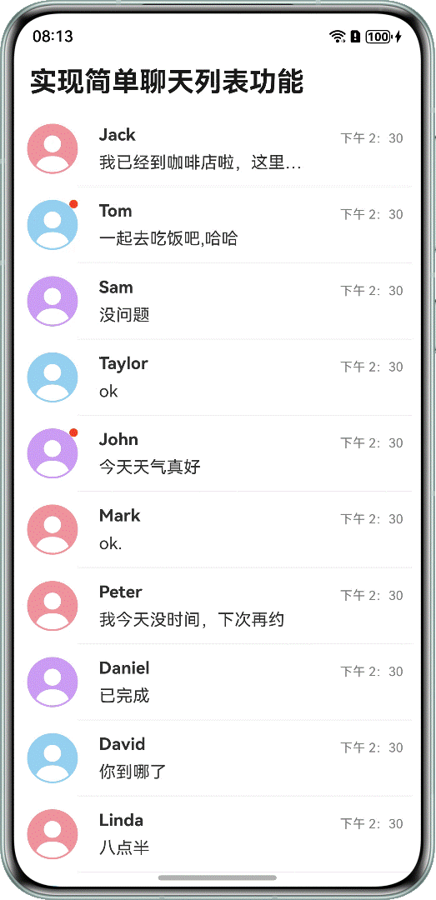

# 常见列表操作

更新时间：2026-03-17 02:20:01

来源：https://developer.huawei.com/consumer/cn/doc/best-practices/bpta-common-list-operations

##### 概述

在应用开发中，列表通常用于展示结构化数据，例如联系人列表、通讯录等。为了提升用户体验和交互效果，开发者需要实现一系列常见的列表操作功能，本文主要介绍列表滚动、列表排版、列表数据更新、列表拖拽等常见功能，通过实现一个简单聊天列表的案例，来介绍常见列表操作以及对应的代码实现。
 
 

##### 列表滚动

列表滚动是指用户通过上下或左右滚动屏幕来浏览超出当前视口范围的内容，它是最常见的交互方式之一，适用于展示联系人列表、商品目录、新闻文章等多种场景。
 
 

##### 滚动到指定位置

列表滚动主要通过List组件的scroller参数绑定一个[Scroller](https://developer.huawei.com/consumer/cn/doc/harmonyos-references/ts-container-scroll#scroller)对象，进行列表的滚动控制。
 
```ArkTS
private scroller: Scroller = new Scroller();
@StorageProp('topRectHeight') topRectHeight: number = 0;

// ...
    List({ space: 20, initialIndex: this.arr.length - 1, scroller: this.scroller }) {
      // ...
    }
```
 
根据滚动位置的不同，本文介绍列表滚动常见的三种形式：滚动到底部、滚动到指定索引、指定偏移量滚动，其实现方式如下：
 
**滚动到底部：**通过initialIndex或者[scrollToIndex()](https://developer.huawei.com/consumer/cn/doc/harmonyos-references/ts-container-scroll#scrolltoindex)接口实现。
 
- 使用List组件的[ListOptions对象](https://developer.huawei.com/consumer/cn/doc/harmonyos-references/ts-container-list#listoptions18对象说明)-initialIndex设置列表初始化显示到最后一个ListItem的位置。
```ArkTS
List({ space: 20, initialIndex: this.arr.length - 1, scroller: this.scroller }) {

  ForEach(this.arr, (item: number) => {
    ListItem() {
      // ...
    }
    .borderRadius(16)
    .backgroundColor(0xDCDCDC)
  }, (item: string) => item)
}
```

- 使用[scrollToIndex()](https://developer.huawei.com/consumer/cn/doc/harmonyos-references/ts-container-scroll#scrolltoindex)接口实现滚动到最后一个ListItem的索引位置。
```ArkTS
this.scroller.scrollToIndex(this.arr.length - 1);
```
 需要注意的是，scrollToIndex与initialIndex都能实现滚动到底部（最后一个ListItem），若ListItem高度过高则不能展示到最底部，可以搭配使用[scrollEdge()](https://developer.huawei.com/consumer/cn/doc/harmonyos-references/ts-container-scroll#scrolledge)滚动到列表底部。

  
```ArkTS
this.scroller.scrollEdge(Edge.Bottom);
```


 
**滚动到指定索引：**通过[scrollToIndex()](https://developer.huawei.com/consumer/cn/doc/harmonyos-references/ts-container-scroll#scrolltoindex)接口滚动到列表数组的指定索引Index。
 
> [!NOTE]
> 在使用scrollToIndex()等场景时，若滚动过程中ListItem大小动态变化，将会导致获取到的currentOffset不准确，无法准确的跳转到指定位置。可以使用 childrenMainSize() 给ListItem固定高度，该属性通过向List组件提供所有子组件在主轴方向的大小信息，确保List组件能够维护其滚动位置准确性。

 
**指定偏移量滚动：**通过[scrollTo()](https://developer.huawei.com/consumer/cn/doc/harmonyos-references/ts-container-scroll#scrollto)接口实现，可以配置上下偏移量、左右偏移量以及动画方式。
 
```ArkTS
Button('scroll 200')
  .height('5%')
  .onClick(() => {
    let curve = curves.interpolatingSpring(10, 1, 228, 30);
    const yOffset: number = this.scroller.currentOffset().yOffset;
    this.scroller.scrollTo({ xOffset: 0, yOffset: yOffset + 200, animation: { duration: 1000, curve: curve } })
  })
```
 
> [!WARNING]
> 需要注意的是，这里的偏移量是相对于组件最顶端的偏移量，并非相对于当前显示Item的偏移量。

 
 

##### 滚动监听

当列表项过多时，通常需要监听列表的滚动偏移量，基于此来展示额外信息或辅助功能。例如，在选择商品时，滚动至一定距离后，用户希望能返回顶部，就需要进行滚动监听。通过在List组件的[onWillScroll()](https://developer.huawei.com/consumer/cn/doc/harmonyos-references/ts-container-scrollable-common#onwillscroll12)或者[onDidScroll()](https://developer.huawei.com/consumer/cn/doc/harmonyos-references/ts-container-scrollable-common#ondidscroll12)方法里面执行scroller.currentOffset()实时监听位移偏移量。
 
```ArkTS
.onWillScroll(() => {
  // Trigger before scrolling component scrolling.
  console.info('currentOffset:' + this.scroller.currentOffset().yOffset)
})
.onDidScroll(() => {
  // Triggered when scrolling components scroll.
  console.info('currentOffset:' + this.scroller.currentOffset().yOffset)
})
```
 
> [!NOTE]
> scroller.currentOffset()偏移量是相对于组件最顶端的偏移量，并非相对于当前显示Item的偏移量。如果想要获取此次滚动偏移量，可以通过onWillScroll()或者onDidScroll()接口的回调参数获取。onwillscroll()中回调的偏移量为计算得到的将要滚动的偏移量值，并非最终实际滚动偏移。可以通过该回调返回值指定Scroll将要滚动的偏移。具体可参考： 设置scroller控制器 。

 
 

##### 嵌套滚动

嵌套滚动是指多个滚动容器相互嵌套，并能协同工作的滚动机制。例如：在移动端应用中，一个页面整体可以垂直滚动，而其中某个子组件（如Tab内容、评论区、图片列表）也只支持独立滚动。根据滚动对象的不同，嵌套滚动主要分为Scroll组件嵌套List组件、Web组件嵌套List组件、List组件嵌套List组件等。
 


 
- [List组件与Scroll组件的嵌套滚动](https://developer.huawei.com/consumer/cn/doc/harmonyos-references/ts-container-scroll#示例2嵌套滚动实现方式一)
- [Web组件与List组件嵌套](https://developer.huawei.com/consumer/cn/doc/harmonyos-guides/web-nested-scrolling#滚动偏移量由滚动父组件统一派发)
- [List组件与List组件嵌套滚动](https://developer.huawei.com/consumer/cn/doc/harmonyos-faqs/faqs-arkui-337)

 
> [!NOTE]
> 若通过 onScrollFrameBegin() 事件和 scrollBy() 方法实现容器嵌套滚动，需设置子滚动节点的 EdgeEffect() 为None。如Scroll嵌套List滚动时，List组件的edgeEffect属性需设置为EdgeEffect.None。

 
 

##### 滚动效果

列表滚动效果指的是当用户通过上下或左右滚动屏幕来浏览超出当前视口范围的内容时，列表项如何平滑地进入和离开视口，以及在此过程中可能伴随的视觉效果，例如单边回弹、滚动过程中禁用滚动、列表项左滑等**。**
 
**单边回弹效果：**
 
单边回弹是指当用户滚动到可滚动区域的一端时，如果继续施加力，该端会出现一种视觉上的“回弹”效果，例如实现顶部回弹效果，可以有2种方式实现：
 
- 在[onDidScroll()](https://developer.huawei.com/consumer/cn/doc/harmonyos-references/ts-container-scrollable-common#ondidscroll12)里获取currentOffset().yOffset，然后拿获取的值与0比较，当其值小于等于0时，说明已到达或超越顶部，此时设置[EdgeEffect](https://developer.huawei.com/consumer/cn/doc/harmonyos-references/ts-container-scrollable-common#edgeeffect11)属性设置边缘滚动效果。
```ArkTS
List({ space: 20, initialIndex: 0, scroller: this.scroller }) {
  // ...
}
.width('90%')
.scrollBar(BarState.Off)
.onDidScroll(() => {
  const y = this.scroller.currentOffset().yOffset;
  this.isTop = y <= 0;
})
.edgeEffect(this.isTop ? EdgeEffect.Spring : EdgeEffect.None)
```

- 通过[onScrollIndex()](https://developer.huawei.com/consumer/cn/doc/harmonyos-references/ts-container-list#onscrollindex)实现单边回弹效果，List显示区域内第一个子组件的索引值为0时，说明已到达顶部，此时设置[EdgeEffect](https://developer.huawei.com/consumer/cn/doc/harmonyos-references/ts-container-scrollable-common#edgeeffect11)属性设置边缘滚动效果。
```ArkTS
.edgeEffect(this.isTop ? EdgeEffect.Spring : EdgeEffect.None)
.onScrollIndex((firstIndex: number) => {
  this.isTop = firstIndex === 0;
  console.info('firstIndex:' + firstIndex + ',' + this.isTop)
})
```


 
当List组件内容大小小于组件自身时，默认不开启滚动效果，可以设置[edgeEffect(EdgeEffect.Spring, { alwaysEnabled: true })](https://developer.huawei.com/consumer/cn/doc/harmonyos-references/ts-container-scrollable-common#edgeeffect11)开启滚动效果。
 


 
**滚动过程中禁用滚动：**可以通过enabled(false)关闭滚动使能，但是如果是惯性滚动触发的，List仍然能依靠惯性滚动一段距离。如果想要实现禁用滚动及惯性滚动，可使用以下2种方式：
 
- 设置[enableScrollInteraction(false)](https://developer.huawei.com/consumer/cn/doc/harmonyos-references/ts-container-list#enablescrollinteraction10)来禁用List滚动。
- 在列表开始滚动时触发[onScrollFrameBegin](https://developer.huawei.com/consumer/cn/doc/harmonyos-references/ts-container-list#onscrollframebegin9)事件，事件参数传入即将发生的滚动量，在事件处理函数中根据应用场景计算实际需要的滚动量，并将其作为事件处理函数的返回值返回，列表将按照返回值的实际滚动量进行滚动，例如，可以将返回值设置为0，则表示不滚动。
```ArkTS
.onScrollFrameBegin((offset: number, state: ScrollState) => {
  return { offsetRemain: 0 } // If the return value is set to 0, it means that there will be no scrolling.
})
```


 
**列表项左滑：**通过给列表项ListItem添加SwiperAction组件实现，可以实现左滑删除、置顶等功能。具体实现方案和示例代码请参见下一章节[案例一：实现简单聊天列表](#section312414023718)中的左滑删除/置顶。
 
**循环滚动：**当用户滚动到列表的末尾或开头时，列表会自动循环回到开头或结尾。例如，实现一个可左右滑动的循环滚动列表，可以通过[onScrollFrameBegin](https://developer.huawei.com/consumer/cn/doc/harmonyos-references/ts-container-list#onscrollframebegin9)事件计算当前的滚动偏移量和即将发生的滚动量之和，与ListItem的总宽度作比较，从而判断用户是左滑还是右滑，计算出列表滚动时实际需要的滚动量，示例代码如下：
 
```ArkTS
.onScrollFrameBegin((offset: number, state: ScrollState) => {
  let currentOffset = this.scroller.currentOffset().xOffset;
  let newOffset = currentOffset + offset;
  let totalWeight = 220 * 10; // The total width of LIST.
  if (newOffset < totalWeight * 0.5) {
    newOffset += totalWeight;
  } else if (newOffset > totalWeight * 2.5) {
    newOffset -= totalWeight;
  }
  return { offsetRemain: newOffset - currentOffset };
})
```
 


 
 

##### 列表排版

列表排版是指根据数据内容或使用场景，将一组相似或相关的列表项（如消息、商品等）按照一定的布局方式进行排列，以便用户能够快速识别并操作列表项。
 
 

##### 列表内容显示

列表内容显示的方式决定了用户能否快速获取信息，直接影响整体的视觉体验和交互效率。主要包括边栏索引、列表底部留白、列表吸顶、边缘模糊效果等，具体说明和实现方式如下：
 
**边栏索引：**可以通过监听List组件的onScrollIndex事件来实现，右侧索引栏需要使用字母表索引组件[AlphabetIndexer](https://developer.huawei.com/consumer/cn/doc/harmonyos-references/ts-container-alphabet-indexer)。具体请参见：[响应滚动位置](https://developer.huawei.com/consumer/cn/doc/harmonyos-guides/arkts-layout-development-create-list#响应滚动位置)
 
**列表底部留白：**可以通过[contentEndOffset](https://developer.huawei.com/consumer/cn/doc/harmonyos-references/ts-container-list#contentendoffset11)设置内容区末尾偏移量。列表滚动到末尾位置时，列表内容与列表显示区域边界保留指定距离。
 
**列表吸顶：**List组件的sticky属性配合ListItemGroup组件使用，用于设置ListItemGroup中的头部组件是否呈现吸顶效果或者尾部组件是否呈现吸底效果。通过给List组件设置sticky属性为StickyStyle.Header，即可实现列表的粘性标题效果。如果需要支持吸底效果，可以通过footer参数初始化ListItemGroup的底部组件，并将sticky属性设置为StickyStyle.Footer。具体请参见：[添加粘性标题](https://developer.huawei.com/consumer/cn/doc/harmonyos-guides/arkts-layout-development-create-list#添加粘性标题)
 
**边缘模糊效果：**例如实现List上下渐隐效果，可以在List组件上添加overlay浮层，通过linearGradient属性给overlay叠加模糊渐变效果实现。
 
```ArkTS
@Builder
overlayBuilder() {
  Stack().width('100%').height('100%')
    .linearGradient({
      direction: GradientDirection.Bottom, // Gradient direction.
      colors: [[0x00000000, 0.0], [0xB3000000, 1.0]]
    })
    .blendMode(BlendMode.DST_IN, BlendApplyType.OFFSCREEN)
}

build() {
  NavDestination() {
    List({ space: 20, initialIndex: 0 }) {
      ForEach(this.arr, (item: number) => {
        ListItem() {
          Text('' + item)
            .width('100%')
            .height(100)
            .fontSize(16)
            .textAlign(TextAlign.Center)
            .borderRadius(16)
            .backgroundColor(0xDCDCDC)
        }
        .borderRadius(16)
        .backgroundColor(0xDCDCDC)
      }, (item: string) => item)
    }
    .overlay(this.overlayBuilder())
```
 



 
**折叠展开：**列表项的折叠与展开用途广泛，常用于信息清单的展示、填写等应用场景。通过改变ListItem的状态，来控制每个列表项是否展开，并通过animation和animateTo来实现展开与折叠过程中的动效效果。具体请参见：**[折叠与展开](https://developer.huawei.com/consumer/cn/doc/harmonyos-guides/arkts-layout-development-create-list#折叠与展开)**
 
 

##### 列表数据更新

列表数据更新操作通常包含列表刷新方式、增删列表项以及在数据刷新时，可能需要保持可见区域内容位置不变，其对应的具体说明和实现方式可参考如下。
 
 

##### 列表刷新

列表刷新指的是在不重新加载整个页面或组件的前提下，根据新的数据源动态地对列表内容进行刷新、替换或局部更新，主要方式包括上拉加载、下拉刷新、左右滚动刷新、局部数据刷新。
 
**上拉加载：**在列表底部添加LoadingProgress()组件用于显示加载动画，并在onScrollIndex()回调中判断显示区域是否到底，当显示到底时加载更多数据。示例如下：
 
```ArkTS
List({ space: 20 }) {
  ForEach(this.arr, (item: number) => {
    ListItem() {
      Text('' + item)
        .width('100%')
        .height(100)
        .fontSize(16)
        .textAlign(TextAlign.Center)
        .borderRadius(16)
        .backgroundColor(0xDCDCDC)
    }
  }, (item: string) => item)
  ListItem() {
    Row() {
      LoadingProgress().height(32).width(48)
      Text('加载中')
    }
  }
  .width('100%')
  .height(64)
}
.width('90%')
.onScrollIndex((start: number, end: number) => {
  if (end > this.arr.length) {
    setTimeout(() => {
      for (let i = 0; i < 5; i++) {
        this.arr.push(this.arr.length);
      }
    })
  }
})
```
 
**下拉刷新：**可通过[Refresh](https://developer.huawei.com/consumer/cn/doc/harmonyos-references/ts-container-refresh)容器进行页面下拉操作并绑定显示刷新动效的容器组件，实现下拉刷新效果。具体实现方案和示例代码请参见下一章节[案例一：实现简单聊天列表](#section312414023718)中的下拉加载更多聊天记录。
 
**左右滚动刷新：**由于refresh没有横滑交互，可以使用Column容器包裹refresh，然后给Column容器设置rotate属性使其旋转90度。
 
```ArkTS
Column() {
  Refresh({ refreshing: $$this.isRefreshing }) {
    List({ space: 10 }) {
      ForEach(this.arr, (item: number) => {
        ListItem() {
          Text('' + item)
            .width(300)
            .height(80)
            .fontSize(16)
            .textAlign(TextAlign.Center)
            .borderRadius(16)
            .backgroundColor(0xFFFFFF)
            .translate({ x: (80 - 300) / 2 })
            .rotate({
              x: 0,
              y: 0,
              z: 1,
              centerX: '50%',
              centerY: '50%',
              angle: 90
            })
        }
        .width(80)
        .height(300)
      }, (item: string) => item)
    }
    .width(300)
    .height(300)
    .alignListItem(ListItemAlign.Center)
    .scrollBar(BarState.Off)
  }
  .onRefreshing(() => {
    setTimeout(() => {
      this.isRefreshing = false;
    }, 2000)
  })
  .backgroundColor(0xDCDCDC)
  .refreshOffset(64)
  .pullToRefresh(true)
}
.justifyContent(FlexAlign.Center)
.width('100%')
.height('100%')
.rotate({
  x: 0,
  y: 0,
  z: 1,
  centerX: '50%',
  centerY: '50%',
  angle: -90
})
```
 


 
**局部数据刷新：**通过直接修改单一ListItem的数据源即可实现。
 
```ArkTS
Button('Partial_Refresh')
  .height('5%')
  .margin({ top: 8, bottom: 8 })
  .onClick(() => {
    this.arr[0] += 10;
  })
```
 
 

##### 增删列表项

增删列表项是指用户可以动态地向列表中添加新项或从列表中删除已有项，通常伴随着数据更新与界面刷新。使用数组的Push()、Pop()或splice()等方法即可实现插入列表项、删除列表项、删除ListItem子元素等操作。
 
```ArkTS
public addData(index: number, data: TextClass): void {
  this.dataArray.splice(index, 0, data);
  this.notifyDataAdd(index);
}

public pushData(data: TextClass): void {
  this.dataArray.push(data);
  this.notifyDataAdd(this.dataArray.length - 1);
}
```
 
 

##### 保持可见区域内容

保持可见区域内容是指在用户滚动列表时，确保当前正在查看的内容不会因为数据更新、界面刷新或组件重新渲染而被替换或消失。例如在一些动态更新的列表中，如聊天消息、任务状态更新、股票行情等，如果每次更新都重新加载整个列表，可能会导致用户正在查看的内容被顶上去或消失，造成体验中断。针对此需求，主要有两种解决方案，参考如下：
 
**方案一：**使用[maintainVisibleContentPosition](https://developer.huawei.com/consumer/cn/doc/harmonyos-references/ts-container-list#maintainvisiblecontentposition12)设置显示区域上方插入或删除数据时是否要保持可见内容位置不变。需要注意的是，此方案只有在[LazyForEach：数据懒加载](https://developer.huawei.com/consumer/cn/doc/harmonyos-guides/arkts-rendering-control-lazyforeach)场景下才能生效。
 
```ArkTS
List({ space: 3 }) {
  LazyForEach(this.data, (item: TextClass) => {
    ListItem() {
      Row() {
        Text(item.message).fontSize(20)
      }
      .height(50)
      .margin({ left: 10, right: 10 })
    }
  }, (item: TextClass) => JSON.stringify(item))
}
.width('100%')
.height('100%')
.scrollBar(BarState.Off)
.maintainVisibleContentPosition(true)
```
 


 
**方案二：**可以给List添加scroller控制器，将列表跳回至原先所在位置this.scroller.scrollToIndex，具体请参考示例：[List的下拉加载如何回滚到当前展示位置](https://developer.huawei.com/consumer/cn/doc/harmonyos-faqs/faqs-arkui-268)
 
 

##### 列表拖拽

列表拖拽指的是用户通过长按或点击并拖动某个列表项ListItem，将其移动到另一个位置或区域的操作。这种交互通常用于列表项优先级调整、列表排序等。可以通过List组件的拖拽方法[onItemDragStart()](https://developer.huawei.com/consumer/cn/doc/harmonyos-references/ts-container-list#onitemdragstart8)和[onItemDragMove()](https://developer.huawei.com/consumer/cn/doc/harmonyos-references/ts-container-list#onitemdragmove8)方法，在列表开始拖拽时和拖拽状态的回调中处理被拖拽的ListItem，当结束拖拽时，在新的位置或区域插入ListItem。具体实现方案和示例代码请参见下一章节[案例一：实现简单聊天列表](#section312414023718)中的消息列表拖拽排序。
 
 

##### 列表场景案例

本章节包含实现简单聊天列表和常见列表流这两个案例，主要通过实现简单聊天列表来介绍列表常见操作、实现方案以及代码实现。
 
 

##### 案例一：实现简单聊天列表

**场景描述**
 
常见聊天界面主要包含联系人消息界面以及聊天窗口界面。其中，联系人列表界面主要支持以下交互场景：
 
- 左滑操作，用于删除或置顶联系人
- 滚动后点击“回到顶部”按钮快速跳转
- 拖拽调整联系人排序

 
聊天窗口界面则包含以下功能：
 
- 初始化时自动定位到底部消息
- 支持下拉加载历史聊天记录
- 实时新增并展示最新聊天内容

 


 
**消息气泡**
 
在ListItem中使用[Badge](https://developer.huawei.com/consumer/cn/doc/harmonyos-references/ts-container-badge)组件可实现给列表项添加标记功能。Badge是可以附加在单个组件上用于信息标记的容器组件。例如，在消息列表中，若希望在联系人头像右上角添加标记，可在实现消息列表项ListItem的联系人头像时，将头像Image组件作为Badge的子组件。在Badge组件中，count和position参数用于设置需要展示的消息数量和提示点显示位置，还可以通过style参数灵活设置标记的样式。
 



 
**实现方案**
 
定义一个变量isNewMessage来标识是否需要给列表项添加标记功能，然后使用[Badge](https://developer.huawei.com/consumer/cn/doc/harmonyos-references/ts-container-badge)组件给列表项添加标记功能。
 
**示例代码**
 
```ArkTS
if (item.isNewMessage) {
  // The Badge component can be used to add tags to list items.
  Badge({
    value: '',
    position: BadgePosition.RightTop,
    style: { badgeSize: 8, badgeColor: '#FA2A2D' }
  }) {
    Image(item.image)
      .width(48)
      .height(48)
  }
} else {
  Image(item.image)
    .width(48)
    .height(48)
}
```
 
**左滑删除/置顶**
 


 
**实现方案**
 
使用组件swipeAction实现ListItem左滑划出组件，然后实现一个左滑区域内容显示的组件itemEnd，将其绑定到swipeAction上。
 
- 实现ListItem置顶，为每个ListItem定义一个变量isTop用于标记是否置顶，然后设置一个排序方式实现置顶项优先显示。
- 实现ListItem删除，利用Item数组自带的splice方法删除指定index的ListItem。

 
**示例代码**
 
```ArkTS
@Builder
itemEnd(item: Item, index: number) {
  Row() {
    Image($r(item.isTop ? 'app.media.up_off' : 'app.media.up_on'))
      .width(24)
      .height(24)
      .margin({ right: 8 })
      .onClick(() => {
        this.toggleTop(item);
      })
    Image($r('app.media.delete'))
      .width(24)
      .height(24)
      .onClick(() => {
        this.sortedList.splice(index, 1);
      })
  }
  .padding(4)
  .height('100%')
  .backgroundColor('#F1F3F5')
  .justifyContent(FlexAlign.SpaceEvenly)
}
```
 
```ArkTS
.swipeAction({
  end: {
    builder: () => {
      this.itemEnd(item, index);
    },
    actionAreaDistance: 56,
    onAction: () => {
      this.getUIContext().animateTo({ duration: 1000 }, () => {
        this.sortedList.splice(index, 1);
      })
    }
  },
  edgeEffect: SwipeEdgeEffect.Spring
})
```
 
**滚动后跳转到指定位置**
 



 
**实现方案**
 
以滚动后跳转到顶部为例，在回调.onWillScroll()中通过scroll组件自带的接口currentOffset()获取当前滚动偏移量，将偏移量与临界值进行对比，当超过临界值时显示按钮，点击后调用scrolltoindex(0)即可跳转到顶部。
 
**示例代码**
 
```ArkTS
.onWillScroll(() => {
  if (this.scroller.currentOffset().yOffset > 100) {
    this.isFlag = true;
  } else {
    this.isFlag = false;
  }
})
```
 
```ArkTS
if (this.isFlag) {
  Image($r('app.media.arrow_up_circle_fill'))
    .width(36)
    .height(36)
    .margin({ right: 10, bottom: 10 })
    .onClick(() => {
      this.scroller.scrollToIndex(0, true);
      this.isFlag = false;
    })
}
```
 
**消息列表拖拽排序**
 


 
**实现方案**
 
通过List组件的拖拽方法onItemDragStart()和onItemDragMove()方法，主要步骤如下：
 1. 开始拖拽列表元素时，[onItemDragStart()](https://developer.huawei.com/consumer/cn/doc/harmonyos-references/ts-container-list#onitemdragstart8)方法被触发，在回调里记录当前拖拽的ListItem并赋值给自定义对象dragItem，返回并展示拖拽时的UI函数dragFloatView()。

  
```ArkTS
.onItemDragStart((event: ItemDragInfo, itemIndex: number) => {
  // Triggered when starting to drag and drop list elements.
  this.dragItem = this.sortedList[itemIndex];
  return this.dragFloatView(this.sortedList[itemIndex]);
})
```

2. 拖拽列表元素在列表范围内移动时触发[onItemDragMove()方法](https://developer.huawei.com/consumer/cn/doc/harmonyos-references/ts-container-list#onitemdragmove8)，在回调里分别记录被拖拽ListItem的索引deleteIndex和拖拽插入位置索引insertIndex，然后通过Item数组的splice方法删除被拖拽的ListItem，同时将被删除的ListItem添加至insertIndex所在的位置。

  
```ArkTS
.onItemDragMove((event: ItemDragInfo, itemIndex: number, insertIndex: number) => {
  // Triggered when dragging and moving within the range of a list element.
  this.getUIContext().animateTo({ duration: 200, curve: Curve.Linear }, () => {
    let deleteIndex = this.sortedList.indexOf(this.dragItem);
    this.sortedList.splice(deleteIndex, 1);
    this.sortedList.splice(insertIndex, 0, this.dragItem);
  })
})
```

3. 定义一个dragFloatView[自定义构建函数](https://developer.huawei.com/consumer/cn/doc/harmonyos-guides/arkts-builder#私有自定义构建函数)作为拖拽时临时展示的UI元素，直至拖拽结束。

  
```ArkTS
@Builder
dragFloatView(item: Item) {
  Row() {
    if (item.isNewMessage) {
      Badge({
        value: '',
        position: BadgePosition.RightTop,
        style: { badgeSize: 8, badgeColor: '#FA2A2D' }
      }) {
        Image(item.image)
          .width(48)
          .height(48)
      }
    } else {
      Image(item.image)
        .width(48)
        .height(48)
    }

    Row() {
      Column() {
        Text(item.name)
          .fontSize(16)
          .fontWeight(FontWeight.Bold)
          .margin({ bottom: 8 })
          .textAlign(TextAlign.Start)
        Text(item.message[item.message.length - 1].msg)
          .fontSize(16)
          .maxLines(1)
          .constraintSize({ maxWidth: '70%' })
          .textOverflow({ overflow: TextOverflow.Ellipsis })
      }
      .height('100%')
      .justifyContent(FlexAlign.Center)
      .alignItems(HorizontalAlign.Start)

      Text(item.time)
        .fontSize(12)
        .margin({ bottom: 20 })
        .fontColor(item.isTop ? Color.Black : Color.Gray)
    }
    .width('80%')
    .justifyContent(FlexAlign.SpaceBetween)
  }
  .width('100%')
  .height(72)
  .backgroundColor(item.isTop ? '#4497FF' : 'rgba(240,240,240,1)')
  .justifyContent(FlexAlign.SpaceAround)
}
```

4. 在拖拽时，被拖拽的ListItem若与记录的dragItem相同，则对其隐藏，避免页面中同时出现相同的ListItem。

  
```ArkTS
.visibility(item == this.dragItem ? Visibility.Hidden : Visibility.Visible)
```

 

 
**初始化显示到底部**
 


 
**实现方案**
 
通过设置参数initialIndex为消息列表的最大长度，此时只是实现了显示到最后一条，还不能达到预期效果。当遇到超长item时，会从最后一条的顶部开始显示，并不能直接显示到底部。还需要在List组件挂载显示后触发的[onAppear()](https://developer.huawei.com/consumer/cn/doc/harmonyos-references/ts-universal-events-show-hide#onappear)回调中通过ScrollEdge(Edge.Bottom)跳转至最底部。
 
**示例代码**
 
```ArkTS
List({ space: 10, scroller: this.scroller, initialIndex: this.itemInfo.message.length - 1 }) {
  ForEach(this.showItemMessage, (item: messageObj, index: number) => {
    ListItem() {
      if (item.sender === 'others') {
        Row() {
          Image(this.itemInfo.image)
            .width(36)
            .height(36)
            .margin({ right: 8 })

          Text(item.msg)
            .fontSize(16)
            .constraintSize({ maxWidth: '70%' })
            .backgroundColor('#F1F3F5')
            .borderRadius(12)
            .padding({
              top: 8,
              bottom: 8,
              left: 12,
              right: 12
            })
        }
        .width('100%')
        .constraintSize({ minHeight: 48 })
        .justifyContent(FlexAlign.Start)
      } else {
        Row() {
          Text(item.msg)
            .fontSize(16)
            .backgroundColor('#F1F3F5')
            .borderRadius(12)
            .padding({
              top: 8,
              bottom: 8,
              left: 12,
              right: 12
            })
          Image($r('app.media.Public_avatar'))
            .width(36)
            .height(36)
            .margin({ left: 8 })
        }
        .width('100%')
        .height(48)
        .justifyContent(FlexAlign.End)
      }
    }
  })
}
.onAppear(() => {
  // Initialize display to the bottom.
  this.scroller.scrollEdge(Edge.Bottom);
})
```
 
**下拉加载更多聊天记录**
 


 
**实现方案**
 
可以使用[Refresh](https://developer.huawei.com/consumer/cn/doc/harmonyos-references/ts-container-refresh)容器组件包裹List组件进行页面下拉操作，进入刷新状态时触发[onRefreshing()](https://developer.huawei.com/consumer/cn/doc/harmonyos-references/ts-container-refresh#onrefreshing)回调，并在其中添加数据更新的操作，实现下拉刷新页面的功能。
 
**示例代码**
 
```ArkTS
Refresh({ refreshing: $$this.isRefreshing }) {
  List({ space: 10, scroller: this.scroller, initialIndex: this.itemInfo.message.length - 1 }) {
    ForEach(this.showItemMessage, (item: messageObj, index: number) => {
      ListItem() {
        if (item.sender === 'others') {
          Row() {
            Image(this.itemInfo.image)
              .width(36)
              .height(36)
              .margin({ right: 8 })

            Text(item.msg)
              .fontSize(16)
              .constraintSize({ maxWidth: '70%' })
              .backgroundColor('#F1F3F5')
              .borderRadius(12)
              .padding({
                top: 8,
                bottom: 8,
                left: 12,
                right: 12
              })
          }
          .width('100%')
          .constraintSize({ minHeight: 48 })
          .justifyContent(FlexAlign.Start)
        } else {
          Row() {
            Text(item.msg)
              .fontSize(16)
              .backgroundColor('#F1F3F5')
              .borderRadius(12)
              .padding({
                top: 8,
                bottom: 8,
                left: 12,
                right: 12
              })
            Image($r('app.media.Public_avatar'))
              .width(36)
              .height(36)
              .margin({ left: 8 })
          }
          .width('100%')
          .height(48)
          .justifyContent(FlexAlign.End)
        }
      }
    })
  }
  .onAppear(() => {
    // Initialize display to the bottom.
    this.scroller.scrollEdge(Edge.Bottom);
  })
  .scrollBar(BarState.Off)
  .contentEndOffset(8)
  .width('100%')
  .height('100%')
}
.width('100%')
.height('100%')
.refreshOffset(64)
.pullToRefresh(true)
.onRefreshing(() => {
  setTimeout(() => {
    this.getLastTenElements(this.itemMessage);
    this.isRefreshing = false;
  }, 1500)
})
```
 
**新增聊天记录**
 


 
**实现方案**
 
通过TextInput组件获取聊天键盘内容，使用新增列表项push()接口将消息添加到聊天记录中。
 
**示例代码**
 
```ArkTS
TextInput({ placeholder: 'input your word...', text: this.inputMessage })
  .height(40)
  .width(200)
  .margin({
    left: 12,
    right: 12
  })
  .onBlur(() => {
    this.scroller.scrollEdge(Edge.Bottom);
  })
  .onChange((value) => {
    this.inputMessage = value;
  })
```
 
点击图标发送消息，通过数组的push()方法将输入的内容添加至List数据源itemMessage数组中，然后调用scrollEdge(Edge.Bottom)使List滚动到底部，同时清空输入框的内容。
 
```ArkTS
Image(this.inputMessage === '' ? $r('app.media.send_off') : $r('app.media.send_on'))
  .width(28)
  .height(28)
  .onClick(() => {
    if (this.inputMessage.trim() === '') {
      return;
    }
    this.itemMessage.push({
      sender: 'myself',
      msg: this.inputMessage
    });
    this.showItemMessage = this.itemMessage.slice(-10);
    this.scroller.scrollEdge(Edge.Bottom);
    this.inputMessage = '';
  })
```
 
 

##### 案例二：常见列表流场景

列表流是采用以“行”为单位进行内容排列的布局形式，每“行”列表项通过文本、图片等不同形式的组合，高效地显示结构化的信息，当列表项内容超过屏幕大小时，可以提供滚动功能。具体场景介绍请参见：[常见列表流](https://developer.huawei.com/consumer/cn/doc/best-practices/bpta-common-list-flows)。
 
 

##### 示例代码

- [实现简单聊天列表功能](https://gitcode.com/harmonyos_samples/simple-chat-list)
