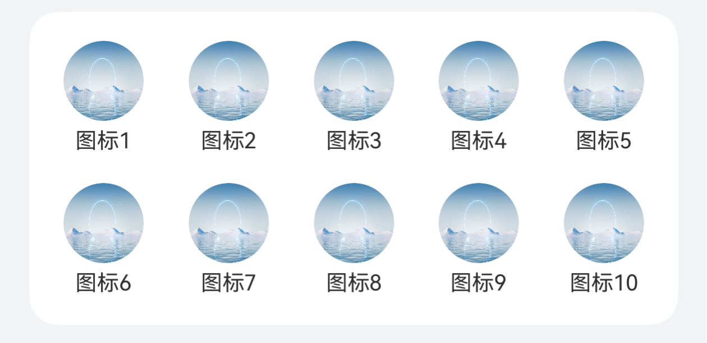
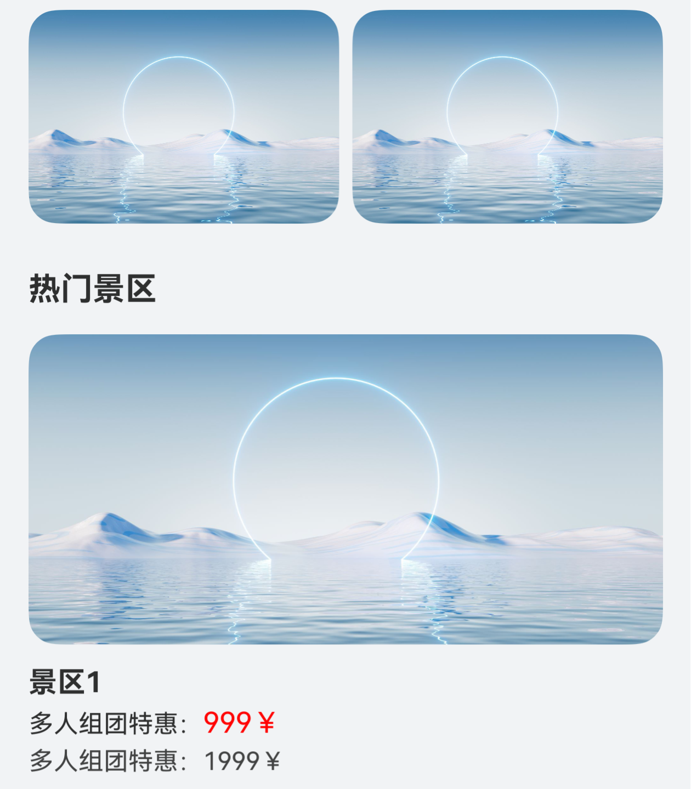

# 常见列表流

更新时间：2026-03-12 08:45:02

来源：https://developer.huawei.com/consumer/cn/doc/best-practices/bpta-common-list-flows

##### 概述

列表流是采用以“行”为单位进行内容排列的布局形式，每“行”列表项通过文本、图片等不同形式的组合，高效地显示结构化的信息，当列表项内容超过屏幕大小时，可以提供滚动功能。列表流具有排版整齐、重点突出、对比方便、浏览速度快等特点。同时列表流也具有非常广泛的使用场景，例如：应用首页、通讯录、音乐列表、购物清单等。
 
列表流主要使用[List](https://developer.huawei.com/consumer/cn/doc/harmonyos-references/ts-container-list)组件，按垂直方向线性排列子组件[ListItemGroup](https://developer.huawei.com/consumer/cn/doc/harmonyos-references/ts-container-listitemgroup)或[ListItem](https://developer.huawei.com/consumer/cn/doc/harmonyos-references/ts-container-listitem)，混合渲染任意数量的图文视图，从而构建列表内容。在实际场景中，一般会根据需要，结合其它基础组件，形成相对复杂的交互功能。
 
本文将介绍以下列表流场景的实现：
 
- [多类型列表项场景](#section20614147618)
- [Tabs吸顶场景](#section103354617711)
- [分组吸顶场景](#section16551551888)
- [二级联动场景](#section323632114913)

 
 

##### 多类型列表项场景

**场景描述**
 
List组件作为整个首页长列表的容器，通过ListItem对不同模块进行视图界面定制，常用于门户首页、商城首页等多类型视图展示的列表信息流场景。
 
本场景以应用首页为例，将除页面顶部搜索框区域的其它内容，放在List组件内部，进行整体页面的构建。进入页面后，下滑刷新模拟网络请求；滑动页面列表内容，景区标题吸顶；滑动到页面底部，上滑模拟请求添加数据。
  
| 页面整体结构图 | 页面效果图 |
| --- | --- |
|  |  |
 
 
**实现原理**
 
根据列表内部各部分视图对应数据类型的区别，渲染不同的ListItem子组件。
 
Refresh组件可以进行页面下拉操作并显示刷新动效，List组件配合使用Swiper、Grid等基础组件用于页面的整体构建，再通过List组件的[sticky](https://developer.huawei.com/consumer/cn/doc/harmonyos-references/ts-container-list#sticky9)属性、[onReachEnd()](https://developer.huawei.com/consumer/cn/doc/harmonyos-references/ts-container-list#onreachend)事件和Refresh组件的[onRefreshing()](https://developer.huawei.com/consumer/cn/doc/harmonyos-references/ts-container-refresh#onrefreshing)事件，实现下滑模拟刷新、上滑模拟添加数据及列表标题吸顶的效果。
 
**开发步骤**
 1. 顶部搜索框区域。
```ArkTS
Row() {
  Text($r('app.string.beijing'))
    // ...
  TextInput({ placeholder: $r('app.string.want_search')})
    // ...
  Text($r('app.string.more'))
    // ...
}
```
 实现效果：

  


2. 在List的第一个ListItem分组中，使用Swiper组件构建页面轮播图内容。
```ArkTS
List({ space: 12 }) {
  // Swiper
  ListItem() {
    Swiper() {
      ForEach(this.swiperContent, (item: SwiperType) => {
        Stack({ alignContent: Alignment.BottomStart }) {
          Image($r(item.pic))
        }
      }, (item: SwiperType) => JSON.stringify(item))
    }
    // ...
    .autoPlay(true) // Set the child component to play automatically
    .duration(1000) // Set the animation duration of the child component switchover
    .curve(Curve.Linear) // Set the animation curve to uniform speed
    .indicator( // Set the navigation point indicator
      new DotIndicator()
        .selectedColor(Color.White)
    )
    .itemSpace(10) // Set the space between child components
    // ...
  }
  // ...
}
```
 实现效果：

  


3. 在List的第二个ListItem分组中，使用Grid组件构建页面网格区域。
```ArkTS
List({ space: 12 }) {
  // Swiper
  ListItem() {
    // ...
  }
  // Grid
  ListItem() {
    Grid() {
      ForEach(this.gridTitle, (item: Resource) => {
        GridItem() {
          Column() {
            Image($r('app.media.pic1'))
              // ...
            Text(item)
              // ...
          }
        }
      }, (item: Resource) => JSON.stringify(item))
    }
    .rowsGap(16) // Set the line spacing
    .columnsGap(19) // Set the column spacing
    .columnsTemplate('1fr 1fr 1fr 1fr 1fr') // Set the proportion of each column
    // ...
  }
  // ...
}
```
 实现效果：

  


4. 推荐内容及列表内容的构建。
```ArkTS
// Scenic spot list content details
@Builder
scenicSpotDetailBuilder(title: Resource) {
  Column() {
    Image($r('app.media.pic1'))
      // ...
    Column() {
      Text(title)
        // ...
      Text() {
        Span($r('app.string.group_discount'))
          // ...
        Span('999￥')
          // ...
      }
      .margin({ top: 4, bottom: 4 })

      Text() {
        Span($r('app.string.group_discount'))
        Span('1999￥')
      }
      // ...
    }
    // ...
  }
}
```
 
```ArkTS
List({ space: 12 }) {
  // Swiper
  ListItem() {
    // ...
  }
  // Grid
  ListItem() {
    // ...
  }
  // Customize display area.
  ListItem() {
    Row() {
      Image($r('app.media.pic1'))
        // ...
      Image($r('app.media.pic1'))
        // ...
    }
    // ...
  }

  // Scenic spot classification list.
  ForEach(this.scenicSpotTitle, (item: Resource) => {
    ListItemGroup({ header: this.scenicSpotHeader(item) }) {
      ForEach(this.scenicSpotArray, (scenicSpotItem: Resource) => {
        ListItem() {
          this.scenicSpotDetailBuilder(scenicSpotItem);
        }
      }, (scenicSpotItem: Resource) => JSON.stringify(scenicSpotItem))
    }
    .borderRadius(this.borderRadiusVal)
  }, (item: Resource) => JSON.stringify(item))

  // ...
}
```
 实现效果：

  


5. 将构建好的页面内容，放在Refresh组件内部，并给List和Refresh组件添加对应的[onReachEnd()](https://developer.huawei.com/consumer/cn/doc/harmonyos-references/ts-container-list#onreachend)和[onRefreshing()](https://developer.huawei.com/consumer/cn/doc/harmonyos-references/ts-container-refresh#onrefreshing)回调，实现下拉模拟刷新和上滑添加列表数据的效果。
```ArkTS
// Top search box.
Row() {
  // ...
}
// ...

// Pull down refresh component.
Refresh({ refreshing: $$this.isRefreshing }) {
  // List as a long list layout.
  List({ space: 12 }) {
    // Swiper
    ListItem() {
      // ...
    }
    // Grid
    ListItem() {
      // ...
    }
    // Customize display area.
    ListItem() {
      // ...
    }

    // Scenic spot classification list.
    ForEach(this.scenicSpotTitle, (item: Resource) => {
      // ...
    }, (item: Resource) => JSON.stringify(item))

    // Customize bottom loading for more.
    ListItem() {
      Row() {
        if (!this.noMoreData) {
          LoadingProgress()
            // ...
        }
        Text(this.noMoreData ? $r('app.string.no_more_data') : $r('app.string.loading_more'))
      }
      // ...
    }
    // ...
  }
  // ...
  .onReachEnd(() => { // Callback triggered when the list is added to the end position
    if (this.scenicSpotArray.length >= 20) {
      // When the list data is greater than or equal to 20, noMoreData is set to true
      this.noMoreData = true;
      return;
    }
    setTimeout(() => {
      this.scenicSpotArray.push('scenic area' + (this.scenicSpotArray.length + 1));
    }, 500)
  })
}
// Pull down refresh, simulate network request.
.onRefreshing(() => {
  this.isRefreshing = true; // Enter the refresh state
  setTimeout(() => {
    this.scenicSpotArray =
      this.scenicSpotArray = ['scenic area 1', 'scenic area 2', 'scenic area 3', 'scenic area 4', 'scenic area 5'];
    this.noMoreData = false;
    this.isRefreshing = false;
  }, 2000)
})
```

 
**实现效果**
  
| 模拟下拉刷新+标题吸顶效果 | 上滑加载更多效果 |
| --- | --- |
|  |  |
 
 
 

##### Tabs吸顶场景

**场景描述**
 
Tabs嵌套List的吸顶效果，常用于新闻、资讯类应用的首页。
 
本场景以Tabs页签首页内容为例，在首页TabContent的内容区域使用List组件配合其它组件，构建下方列表数据内容。进入页面后，向上滑动内容，中间Tabs页签区域实现吸顶展示的效果。
  
| 页面整体结构图 | 页面效果图 |
| --- | --- |
|  |  |
 
 
**实现原理**
 
Tabs组件可以在页面内快速实现视图内容的切换，让用户能够聚焦于当前显示的内容，并对页面内容进行分类，提高页面空间利用率。
 
通过Tabs组件，配合使用Stack、Scroll、Search以及List等基础组件构建完整页面，再使用List组件的[nestedScroll](https://developer.huawei.com/consumer/cn/doc/harmonyos-references/ts-container-list#nestedscroll10)属性，结合calc计算高度，实现中间Tabs页签区域吸顶展示的效果。
 
**开发步骤**
 1. 构建Tabs的自定义tabBar内容。
```ArkTS
@Builder
tabBuilder(img: Resource, title: Resource, index: number) {
  Column() {
    Image(img)
      // ...
      .fillColor(this.currentIndex === index ? '#0a59f7' : '#66000000')
    Text(title)
      // ...
      .fontColor(this.currentIndex === index ? '#0a59f7' : '#66000000')
  }
  // ...
  .onClick(() => {
    this.currentIndex = index;
    this.tabsController.changeIndex(this.currentIndex);
  })
}
```
 
```ArkTS
Tabs({ barPosition: BarPosition.End, controller: this.tabsController }) {
  TabContent() {
    // ...
  }
  .tabBar(this.tabBuilder($r('app.media.mine'), $r('app.string.tabBar1'), 0))

  // ...
}
// ...
.onChange((index: number) => {
  this.currentIndex = index;
})
```
 实现效果：

  


2. 构建顶部搜索区域。
```ArkTS
Row() {
  Image($r('app.media.app_icon'))
    // ...
  Search({
    placeholder: $r('app.string.want_search'),
  })
    .searchButton('search', { fontSize: 14 })
    // ...
  Text($r('app.string.search'))
    // ...
}
```
 实现效果：

  


3. 图片占位区域、自定义导航内容及列表内容构建。
```ArkTS
// Home page content.
Scroll(this.scrollController) {
  Column() {
    // Image placeholder area.
    Image($r('app.media.pic5'))
      // ...

    Column() {
      // Customize tabBar.
      Row({ space: 16 }) {
        ForEach(this.tabArray, (item: string, index: number) => {
          Text(item)
            .fontColor(this.currentTabIndex === index ? '#0a59f7' : Color.Black)
            .onClick(() => {
              // Click to switch tabs content.
              this.contentTabController.changeIndex(index);
              this.currentTabIndex = index;
            })
        }, (item: string) => item)
      }
      // ...

      // Tabs
      Tabs({ barPosition: BarPosition.Start, controller: this.contentTabController }) {
        TabContent() {
          List({ space: 10, scroller: this.listScroller }) {
            CustomListItem({
              imgUrl: $r('app.media.pic1'),
              title: $r('app.string.manager_content')
            })
            // ...
          }
          // ...
        }
        .tabBar('follow')
        // ...
      }
      // ...
    }
    // ...
  }
}
// ...
.scrollBar(BarState.Off) // Hide the scroll bar
```
 实现效果：

  


4. 给List组件添加的[nestedScroll](https://developer.huawei.com/consumer/cn/doc/harmonyos-references/ts-container-list#nestedscroll10)属性，结合calc计算实现中间自定义Tab页签区域吸顶展示的效果。
```ArkTS
Tabs({ barPosition: BarPosition.Start, controller: this.contentTabController }) {
  TabContent() {
    List({ space: 10, scroller: this.listScroller }) {
      // ...
    }
    // ...
    // Customize the tabBar to achieve sticky by combining the nestedScroll attribute with Calc to calculate height.
    .nestedScroll({
      scrollForward: NestedScrollMode.PARENT_FIRST, // Set the effect of scrolling the component to the end: The parent component rolls first, and then rolls itself to the edge
      scrollBackward: NestedScrollMode.SELF_FIRST // Set the effect of rolling the component to the start end: Rolls itself first, and then the parent component scrolls to the edge
    })
  }
  .tabBar('follow')
  // ...
}
.barHeight(0)
.height('calc(100% - 100vp)')
.onChange((index: number) => {
  this.currentTabIndex = index;
})
```

 
**实现效果**
 


 
 

##### 分组吸顶场景

**场景描述**
 
双列表同向联动，右边字母列表用于快速索引，内容列表根据首字母进行分组，常用于通讯录、城市选择、分组选择等页面。
 
本场景以城市列表页面为例，左侧城市列表数据和右侧字母导航数据通过List组件来展示，并通过Stack组件使两个列表数据分层显示。在进入页面后，通过滑动左侧城市列表数据，列表字母标题吸顶展示，对应右侧字母导航内容高亮显示；点击右侧字母导航内容，左侧城市列表展示对应内容。
  
| 页面整体结构图 | 页面效果图 |
| --- | --- |
|  |  |
 
 
**实现原理**
 
左侧List作为城市列表，右侧List为城市首字母快捷导航列表，通过ListItem对对应数据进行渲染展示，并使用Stack堆叠容器组件，字母导航列表覆盖城市列表上方，再给对应List添加[sticky](https://developer.huawei.com/consumer/cn/doc/harmonyos-references/ts-container-list#sticky9)属性和[onScrollIndex()](https://developer.huawei.com/consumer/cn/doc/harmonyos-references/ts-container-list#onscrollindex)方法，实现两个列表数据间的联动效果。
 
**开发步骤**
 1. 城市列表使用ListItemGroup，对“当前城市”“热门城市”“城市数据”进行分组，并通过ListItem展示每个分组中的具体数据。
```ArkTS
// List data content.
@Builder
textContent(content: string) {
  Text(content)
    // ...
}
```
 
```ArkTS
List({ scroller: this.cityScroller }) {
  // Current city.
  ListItemGroup({ header: this.itemHead($r('app.string.current_city')) }) {
    ListItem() {
      Text(this.currentCity)
        .width('100%')
        .height(45)
        .fontSize(16)
        .padding({ left: 16, top: 12, bottom: 12 })
        .textAlign(TextAlign.Start)
        .backgroundColor(Color.White)
    }
  }

  // Popular cities.
  ListItemGroup({ header: this.itemHead($r('app.string.popular_cities')) }) {
    ForEach(this.hotCities, (item: string) => {
      ListItem() {
        this.textContent(item);
      }
    }, (item: string) => item)
  }
  .divider({
    strokeWidth: 1,
    color: '#EDEDED',
    startMargin: 10,
    endMargin: 45
  })

  // City data.
  ForEach(this.groupWorldList, (item: string) => {
    // Traverse the first letter of the city and use it as the header of the city grouping data.
    ListItemGroup({ header: this.itemHead(item) }) {
      // Retrieve and display corresponding city data based on letters.
      ForEach(this.getCitiesWithGroupName(item), (cityItem: City) => {
        ListItem() {
          this.textContent(cityItem.city);
        }
      }, (cityItem: City) => cityItem.city)
    }
  })
}
```

2. 右侧字母导航列表数据，同样通过List组件进行展示。
```ArkTS
// Side letter navigation data.
Column() {
  List({ scroller: this.navListScroller }) {
    ForEach(this.groupWorldList, (item: string, index: number) => {
      ListItem() {
        Text(item)
          // ...
      }
    }, (item: string) => item)
  }
}
```

3. 使用堆叠容器组件Stack，将字母导航内容覆盖到城市列表内容上方。
```ArkTS
Stack({ alignContent: Alignment.End }) {
  // City List Data.
  List({ scroller: this.cityScroller }) {
    // ...
  }
  // ...

  // Side letter navigation data.
  Column() {
    List({ scroller: this.navListScroller }) {
      // ...
    }
  }
  // ...
}
```

4. 最后，给城市列表添加[sticky](https://developer.huawei.com/consumer/cn/doc/harmonyos-references/ts-container-list#sticky9)属性实现标题吸顶效果，及添加[onScrollIndex()](https://developer.huawei.com/consumer/cn/doc/harmonyos-references/ts-container-list#onscrollindex)方法，通过selectNavIndex变量与字母导航列表内容进行关联，控制的对应字母导航内容的选中状态。

  在字母导航列表中，添加点击事件，在点击事件中通过城市列表控制器cityScroller的[scrollToIndex()](https://developer.huawei.com/consumer/cn/doc/harmonyos-references/ts-container-scroll#scrolltoindex)事件，控制城市列表内容的改变，实现二者数据的联动效果。
```ArkTS
Stack({ alignContent: Alignment.End }) {
  // City List Data.
  List({ scroller: this.cityScroller }) {
    // ...
  }
  // ...
  .onScrollIndex((index: number) => {
    // By linking the selectNavIndex state variable with index, control the selection status of the navigation list.
    this.selectNavIndex = index - 2;
  })

  // Side letter navigation data.
  Column() {
    List({ scroller: this.navListScroller }) {
      ForEach(this.groupWorldList, (item: string, index: number) => {
        ListItem() {
          Text(item)
            // ...
            .onClick(() => {
              this.selectNavIndex = index;
              // Select the navigation list and set isClickScroll to true to prevent changes in the navigation list status during the scrolling process with the city list.
              this.isClickScroll = true;
              /*
               * By using the scrollToIndex method of cityScroller, control the sliding city list to specify the Index,
               * as there are "current city" and "popular city" in the city list, so the index needs to be incremented by 2.
               */
              this.cityScroller.scrollToIndex(index + 2, false, ScrollAlign.START);
            })
        }
      }, (item: string) => item)
    }
  }
  // ...
}
```

 
**实现效果**
 


 
 

##### 二级联动场景

**场景描述**
 
通过左边一级列表的选择，联动更新右边二级列表的数据，常用于商品分类选择、编辑风格等二级类别选择页面。
 
本场景以商品分类列表页面为例，分别通过List组件，对左侧分类导航和右侧导航内容进行展示。在进入页面后，点击左侧分类导航，右侧展示对应导航分类详情列表数据；滑动右侧列表内容，列表标题吸顶展示，左侧对应导航内容则高亮显示。
  
| 页面整体结构图 | 页面效果图 |
| --- | --- |
|  |  |
 
 
**实现原理**
 
左右各用一个List实现，分别设置其[onScrollIndex()](https://developer.huawei.com/consumer/cn/doc/harmonyos-references/ts-container-list#onscrollindex)事件，左侧List在回调中判断数据项切换时，调用右侧List滚动到相应类别的对应位置，右侧同理。
 
**开发步骤**
 1. 分别通过List组件构建左侧分类导航数据和右侧分类内容数据。
```ArkTS
// Left List Data Display.
List({ scroller: this.navTitleScroller }) {
  ForEach(this.categoryList, (item: NavTitleModel, index: number) => {
    ListItem() {
      Text(item.titleName)
        // ...
    }
  }, (item: NavTitleModel) => JSON.stringify(item.titleName))
}
// ...

// Display of List Content on the Right.
List({ scroller: this.goodsListScroller }) {
  ForEach(this.categoryList, (item: NavTitleModel) => {
    ListItemGroup({ space: 12, header: this.goodsHeaderBuilder(item.titleName) }) {
      ForEach(item.goodsList, (goodsItem: GoodsDataModel) => {
        ListItem() {
          Row() {
            Image(goodsItem.imgUrl)
              // ...
            Column() {
              Text(goodsItem.goodsName)
                // ...
              Text('￥' + goodsItem.price)
                // ...
            }
            // ...
          }
          // ...
        }
      }, (goodsItem: GoodsDataModel) => JSON.stringify(goodsItem.goodsId))
    }
  }, (item: NavTitleModel) => JSON.stringify(item.goodsList))
}
```

2. 给左侧导航列表添加点击事件，右侧分类详情列表添加[onScrollIndex()](https://developer.huawei.com/consumer/cn/doc/harmonyos-references/ts-container-list#onscrollindex)事件，并调用自定义事件listChange方法，在listChange方法内部根据isGoods变量的值，调用对应列表控制器的[scrollToIndex()](https://developer.huawei.com/consumer/cn/doc/harmonyos-references/ts-container-scroll#scrolltoindex)事件，实现导航列表和分类详情数据的联动效果。
```ArkTS
// List sliding event.
listChange(index: number, isGoods: boolean) {
  if (this.currentTitleId !== index) {
    this.currentTitleId = index;
    if (isGoods) {
      // IsGoods is true, controlling the data in the right-hand list to slide to the specified index.
      this.goodsListScroller.scrollToIndex(index);
    } else {
      // IsGoods is set to false, controlling the left list data to slide to the specified index.
      this.navTitleScroller.scrollToIndex(index);
    }
  }
}
```
 
```ArkTS
// Left List Data Display.
List({ scroller: this.navTitleScroller }) {
  ForEach(this.categoryList, (item: NavTitleModel, index: number) => {
    ListItem() {
      Text(item.titleName)
        // ...
        .onClick(() => {
          // Pass in the current list item index and true.
          this.listChange(index, true);
        })
    }
  }, (item: NavTitleModel) => JSON.stringify(item.titleName))
}
// ...

// Display of List Content on the Right.
List({ scroller: this.goodsListScroller }) {
  // ...
}
// ...
.onScrollIndex((index: number) => {
  // Pass in the current list item index and false.
  this.listChange(index, false)
})
```

 
**实现效果**
 


 
 

##### 示例代码

- [基于List组件实现常见列表流场景](https://gitcode.com/harmonyos_samples/CommonListFlows)
