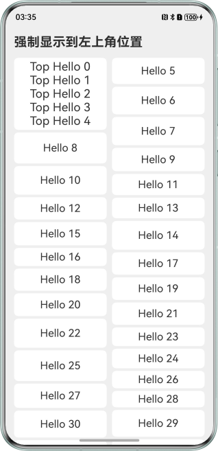
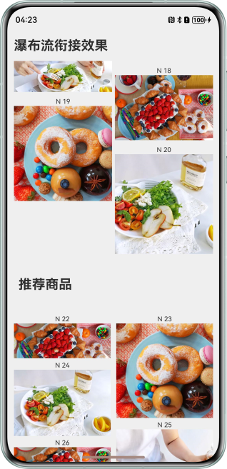

# 常见瀑布流操作

更新时间：2026-05-18 00:55:31

来源：https://developer.huawei.com/consumer/cn/doc/best-practices/bpta-waterflow-operations

#### 概述
在应用开发中，开发者常会遇到希望某些页面的内容呈现出“瀑布流”效果，如图片资讯页面、商品列表页面等。通过将元素自上而下排列，形成参差不齐的界面。本文介绍瀑布流常见操作，帮助开发者高效构建自己想要的瀑布流效果。

#### 瀑布流排版
#### 分组参差布局
在瀑布流常见开发场景中，主要实现方式类似下图布局效果。


为了实现上图中分组参差不齐的效果，首先需要创建多个SectionOptions，并重写其中的[onGetItemMainSizeByIndex()](https://developer.huawei.com/consumer/cn/doc/harmonyos-references/ts-container-waterflow#getitemmainsizebyindex12)方法的返回值。完整代码如下：

```ArkTS
import { CommonConstants } from "../common/constants/CommonConstants";
import { SectionsWaterFlowDataSource } from "../model/SectionsWaterFlowDataSource";

// ...
@Entry
@Component
struct SectionOptionsUsePage {
  // ...
  dataSource: SectionsWaterFlowDataSource = new SectionsWaterFlowDataSource();
  private itemHeightArray: number[] = [];
  sectionMargin: Margin = {
    top: 8,
    left: 16,
    bottom: 0,
    right: 16
  }
  // 1、Create group information.
  @State sections: WaterFlowSections = new WaterFlowSections();
  @StorageProp(CommonConstants.AS_KEY_STATUS_BAR_HEIGHT) statusBarHeight: number = 0;
  // 2、Create the first group.
  oneColumnSection: SectionOptions = {
    itemsCount: 3,
    crossCount: 1,
    margin: this.sectionMargin,
    onGetItemMainSizeByIndex: (index: number) => {
      return 120;
    }
  }
  // 3、Create the second group.
  twoColumnSection: SectionOptions = {
    itemsCount: 2,
    crossCount: 2,
    margin: this.sectionMargin,
    onGetItemMainSizeByIndex: (index: number) => {
      return 160;
    }
  }
  // 4、Create the third group.
  dataSection: SectionOptions = {
    itemsCount: 20,
    crossCount: 2,
    margin: this.sectionMargin,
    onGetItemMainSizeByIndex: (index: number) => {
      return this.itemHeightArray[index % 100];
    }
  }

  // ...

  aboutToAppear(): void {
    this.setItemSizeArray();
    this.initSections();
  }

  // 5、Initialise group data.
  initSections(): void {
    let sectionOptions: SectionOptions[] = [];
    let count: number = 0;
    let oneOrTwo: number = 0;
    let dataCount: number = this.dataSource.totalCount();
    while (count < dataCount) {
      if (dataCount - count < 96) {
        this.dataSection.itemsCount = dataCount - count;
        sectionOptions.push(this.dataSection);
        break;
      }
      if (oneOrTwo++ % 2 === 0) {
        sectionOptions.push(this.oneColumnSection);
        count += this.oneColumnSection.itemsCount;
      } else {
        sectionOptions.push(this.twoColumnSection);
        count += this.twoColumnSection.itemsCount;
      }
    }
    this.sections.splice(0, 0, sectionOptions);
  }

  build() {
    Column({ space: 0 }) {
      Row() {
        Text($r('app.string.section_sort'))
          .width('100%')
          .fontSize(24)
          .fontWeight(FontWeight.Bold)
          .margin({ top: '18vp', left: '16vp', bottom: '8vp' })
      }

      // 6、Link the grouping information to WaterFlow.
      WaterFlow({ scroller: this.scroller, sections: this.sections }) {
        // ...
      }
      .cachedCount(12)
      .columnsGap(8)
      .rowsGap(8)
      .width('100%')
      .height('100%')
      .layoutWeight(1)
    }
    .padding({
      top: this.statusBarHeight
    })
  }
}
```


> [!NOTE] 说明
> 使用分组混合布局时，会忽略columnsTemplate和rowsTemplate属性。使用分组混合布局时，不支持单独设置footer，如果需要footer组件，可使用最后一个分组作为尾部组件。使用section分组后，必须确保WaterFlow中数据总数与section分组所有itemCount之和相等，否则界面可能显示为空白。

#### 自定义高度
WaterFlow中FlowItem的高度通过SectionOptions的[onGetItemMainSizeByIndex()](https://developer.huawei.com/consumer/cn/doc/harmonyos-references/ts-container-waterflow#getitemmainsizebyindex12)方法返回值来控制，其中参数index表示FlowItem的索引位置。

```ArkTS
import { SectionsWaterFlowDataSource } from "../model/SectionsWaterFlowDataSource";

// ...
@Entry
@Component
export struct CustomItemHeightPage {
  // ...
  // 1、Create group information.
  @State sections: WaterFlowSections = new WaterFlowSections();
  sectionMargin: Margin = {
    top: 8,
    left: 0,
    bottom: 0,
    right: 0
  };
  oneColumnSection: SectionOptions = {
    itemsCount: 3,
    crossCount: 1,
    columnsGap: 5,
    rowsGap: 10,
    margin: this.sectionMargin,
    onGetItemMainSizeByIndex: (index: number) => {
      // 1、Return item height.
      return 120;
    }
  };
  // ...
}
```

#### 瀑布流吸顶
在某些开发场景中，开发者可能希望WaterFlow向上滑动时，部分内容先跟随滑动，随后吸附于顶部。效果图如下：


为了实现上图效果，需在WaterFlow分组中需为吸顶的部分预留位置，并监听瀑布流滚动事件。吸顶部分依据瀑布流滑动后的偏移量设置位置，实现与瀑布流同步滚动；吸顶部分达到顶部后固定不动。完整代码如下：

```ArkTS
import { hilog } from '@kit.PerformanceAnalysisKit';
import { CommonConstants } from '../common/constants/CommonConstants';
import MediaItem, { ItemType } from '../model/MediaItem';
import { StickyWaterFlowDataSource } from '../model/StickyWaterFlowDataSource';

const TAG: string = 'StickOnTopPage';

// ...
@Component
export struct StickyPage {
  // ...
  // 1、Define the height of the ceiling layout.
  @State scrollOffset: number = 0;
  private stickItemHeight: number = 90;
  sectionMargin: Margin = {
    top: 8,
    left: 16,
    bottom: 0,
    right: 16
  };
  oneColumnSection: SectionOptions = {
    itemsCount: 3,
    crossCount: 1,
    margin: this.sectionMargin,
    onGetItemMainSizeByIndex: (index: number) => {
      if (index === 1) {
        // 2、Set the ceiling layout height in the group.
        return this.stickItemHeight;
      } else {
        return 200;
      }
    }
  };
  twoColumnSection: SectionOptions = {
    itemsCount: 2,
    crossCount: 2,
    margin: this.sectionMargin,
    onGetItemMainSizeByIndex: (index: number) => {
      return 250;
    }
  };

  // ...
  build() {
    Stack({ alignContent: Alignment.TopStart }) {
      WaterFlow({ scroller: this.scroller, sections: this.sections }) {
        LazyForEach(this.dataSource, (item: MediaItem) => {
          FlowItem() {
            // 3、A location is reserved for the ceiling part, and the ceiling position is at the second element location, so the id is 1.
            FlowVideoItem({ item: item })
          }
          .width('100%')
          .backgroundColor(Color.White)
        }, (item: MediaItem) => item.id.toString())
      }
      .cachedCount(12)
      .columnsTemplate('1fr 1fr')
      .columnsGap(8)
      .rowsGap(8)
      .width('100%')
      .height('100%')
      .layoutWeight(1)
      .onWillScroll((offset: number) => {
        // 4、Listen to the waterfall scrolling event.
        this.scrollOffset = this.scroller.currentOffset().yOffset + offset;
      })

      Stack() {
        // ...
      }
      .width('100%')
      .height(100)
      .backgroundColor(Color.White)
      .hitTestBehavior(HitTestMode.Transparent)
      // 5、Dynamically adjust the sticky position according to the waterfall flow sliding offset.
      .position({ x: 0, y: this.scrollOffset >= 210 ? 0 : 210 - this.scrollOffset })
    }
  }
}

// ...
```

#### 动态切换列数
在应用开发中，开发者需要在列表模式与瀑布流模式间进行切换，或适应屏幕宽度的变化。为解决此类需求，通常通过动态调整瀑布流的列数来实现。建议采用瀑布流的移动窗口布局模式，以实现更快速的列数转换。参考：[动态切换列数](https://developer.huawei.com/consumer/cn/doc/harmonyos-guides/arkts-layout-development-create-waterflow#动态切换列数)。

#### 瀑布流滑动
#### 滑动性能优化
瀑布流上下滑动时，因其具有无限加载数据的特性，能够展示大量数据。不同大小的子元素将会带来测量和绘制的性能消耗过大。例如，在实际开发中，当瀑布流中的数据量过大时，可能会遇到渲染速度慢、滑动丢帧、内存占用高等问题，这些问题直接影响用户操作体验。为了解决这些开发中可能遇到的性能问题，建议参考[瀑布流加载丢帧优化](https://developer.huawei.com/consumer/cn/doc/best-practices/bpta-waterflow-performance-optimization#section088318458314)。

#### 停止滑动时自动播放
在某些开发场景中，开发者可能想要在瀑布流停止滑动时播放其中的视频，效果图如下：


若要实现上述效果，可利用组件的[onVisibleAreaChange()](https://developer.huawei.com/consumer/cn/doc/harmonyos-references/ts-universal-component-visible-area-change-event#onvisibleareachange)方法监听组件显示状态，以控制视频播放或暂停。完整代码如下：

```ArkTS
import { hilog } from '@kit.PerformanceAnalysisKit';
import { CommonConstants } from '../common/constants/CommonConstants';
import MediaItem, { ItemType } from '../model/MediaItem';
import { StickyWaterFlowDataSource } from '../model/StickyWaterFlowDataSource';

const TAG: string = 'FlowItemAutoPlayPage';

@Component
struct FlowVideoItem {
  @Prop item: MediaItem;
  controller: VideoController = new VideoController();

  aboutToReuse(params: Record<string, MediaItem>): void {
    this.item = params.item as MediaItem;
  }

  build() {
    if (this.item.type === ItemType.VIDEO) {
      Stack({ alignContent: Alignment.BottomStart }) {
        Video({ src: this.item.videoUri, previewUri: this.item.videoCover, controller: this.controller })
          .controls(false)
          .muted(true)
          .loop(true)
          .borderRadius(8)
          .onVisibleAreaChange([0.0, 1.0], (isVisible: boolean, currentRatio: number) => {
            // 1、Slide to play the video when visible.
            if (isVisible && currentRatio >= 1.0) {
              this.controller.start();
            }
            // 2、Slide to pause the video when hidden.
            if (!isVisible || currentRatio < 1.0) {
              this.controller.pause();
            }
          })
        Text('NO. ' + (this.item.id + 1))
          .fontSize(12)
          .fontColor(Color.White)
          .margin({
            left: 8,
            bottom: 4
          })
      }
    } else {
      // ...
    }
  }
}

// ...
```


> [!NOTE] 说明
> 示例代码构建的数据屏幕中仅有一个视频。若屏幕中包含多个视频，滑动停止时需要播放首个完全显示的视频，则需借助WaterFlow的onScrollIndex()方法，实现相关逻辑。

#### 瀑布流数据更新
#### 下拉刷新
在某些应用场景中，开发者可能实现如下图所示的刷新效果。


为了实现上述效果，开发者可通过Refresh组件实现瀑布流下拉刷新。通过Refresh组件进行页面下拉操作，并绑定显示刷新Loading动效的容器组件，以实现下拉刷新效果。随后，在[onRefreshing()](https://developer.huawei.com/consumer/cn/doc/harmonyos-references/ts-container-refresh#onrefreshing)事件中更新数据。完整代码如下：

```ArkTS
import { hilog } from "@kit.PerformanceAnalysisKit";
import { CommonConstants } from "../common/constants/CommonConstants";
import { SectionsWaterFlowDataSource } from "../model/SectionsWaterFlowDataSource";

const TAG: string = 'DataUpdateAndAnimationPage';

// ...
@Entry
@Component
struct DataUpdateAndAnimationPage {
  @State isRefreshing: boolean = false;
  @State currentItem: number = -1;
  // ...
  // 1、Refresh Loading Animation Component.
  @Builder
  headerRefresh(): void {
    Column() {
      LoadingProgress()
        .color(Color.Black)
        .opacity(0.6)
        .width(36)
        .height(36)
    }
    .justifyContent(FlexAlign.Center)
  }

  // 5、Pull down to refresh the data update logic.
  refresh(): void {
    this.currentItem = -1;
    setTimeout(() => {
      // Add new data.
      this.dataSource.dataArray = [];
      let value: number = Math.floor(Math.random() * 100);
      for (let i: number = 0; i < 100; i++) {
        this.dataSource.dataArray.push(i + value);
        this.dataSource.notifyDataAdd(i);
      }
      // Update sections itemsCount.
      this.oneColumnSection.itemsCount = 3;
      this.oneColumnSection.crossCount = 1;
      this.twoColumnSection.itemsCount = 2;
      this.twoColumnSection.crossCount = 2;
      this.dataSection.itemsCount = 95;
      this.dataSection.crossCount = 2;
      this.sections.update(0, this.oneColumnSection);
      this.sections.update(1, this.twoColumnSection);
      this.sections.update(2, this.dataSection);
      this.isRefreshing = false;
    }, 2000);
  }

  loadMore(last: number): void {
    setTimeout(() => {
      let totalCount: number = this.dataSource.totalCount();
      if (last + 20 >= totalCount) {
        for (let i: number = 0; i < 20; i++) {
          this.dataSource.addLastItem();
        }
        // Update sections itemsCount.
        this.dataSection.itemsCount += 20;
        this.sections.update(2, this.dataSection);
      }
    }, 1000);
  }

  // ...
  build() {
    Column({ space: 0 }) {
      Row() {
        Text($r('app.string.pull_down_refresh'))
          .width('100%')
          .fontSize(24)
          .fontWeight(FontWeight.Bold)
          .margin({ top: '18vp', left: '16vp', bottom: '8vp' })
      }

      // 2、Pull-to-refresh control.
      Refresh({ refreshing: $$this.isRefreshing, builder: this.headerRefresh() }) {
        // ...
        // For better experience, pre load data.
        .onScrollIndex((first: number, last: number) => {
          this.loadMore(last);
        })
      }
      // 3、Pull down to refresh offset.
      .refreshOffset(56)
      .onRefreshing(() => {
        // 4、Pull down to refresh, triggering the refresh callback function.
        this.refresh();
      })
    }
    .padding({
      top: this.statusBarHeight
    })
  }
}
```

#### 上拉加载
WaterFlow实现加载更多功能，通常采用onReachEnd回调（[onReachEnd](https://developer.huawei.com/consumer/cn/doc/harmonyos-references/ts-container-waterflow#onreachend)）或onScrollIndex回调（[onScrollIndex](https://developer.huawei.com/consumer/cn/doc/harmonyos-references/ts-container-waterflow#onscrollindex11)）来实现。
1. 在onReachEnd加载数据时，应用会在数据源中的所有数据渲染完成后加载新数据，这会导致明显的加载动画出现，用户需等待新数据加载完毕后才能继续浏览瀑布流。
2. 相比onReachEnd方式，onScrollIndex回调可以在用户滑动到接近底部时预加载数据，实现无缝浏览体验。例如，当前可视区最后一个组件的索引加上20等于数据源总量时，才开始加载数据，这能避免每次索引变化时均加载数据。建议在[onScrollIndex](https://developer.huawei.com/consumer/cn/doc/harmonyos-references/ts-container-waterflow#onscrollindex11)回调中执行此操作，使瀑布流在未触底前即开始加载数据，进而提高用户体验，确保用户几乎不察觉数据加载过程。import { hilog } from "@kit.PerformanceAnalysisKit";
import { CommonConstants } from "../common/constants/CommonConstants";
import { SectionsWaterFlowDataSource } from "../model/SectionsWaterFlowDataSource";

const TAG: string = 'DataLoadMorePage';

// ...
@Entry
@Component
struct DataLoadMorePage {
  @State sections: WaterFlowSections = new WaterFlowSections();
  dataSource: SectionsWaterFlowDataSource = new SectionsWaterFlowDataSource();
  // ...
  build() {
 Column({ space: 0 }) {
 Refresh({ refreshing: $$this.isRefreshing, builder: this.headerRefresh() }) {
 WaterFlow({ scroller: this.scroller, sections: this.sections }) {
 // ...
 }
 .cachedCount(12)
 .columnsGap(8)
 .rowsGap(8)
 .width('100%')
 .height('100%')
 .layoutWeight(1)
 // For better experience, pre load data.
 .onScrollIndex((first: number, last: number) => {
 // 1、Obtain the total amount of data in the waterfall flow.
 let totalCount: number = this.dataSource.totalCount();
 // 2、If the index of the last visible area is greater than the total amount of data, it triggers loading more.
 if (last + 20 >= totalCount) {
 // 3、Re-add 20 data entries to the waterfall.
 for (let i: number = 0; i < 20; i++) {
 this.dataSource.addLastItem();
 }
 // 4、Update the itemsCount in the group and refresh the group information.
 this.dataSection.itemsCount += 20;
 this.sections.update(2, this.dataSection);
 }
 })
 }
 // ...
 }
 .padding({
 top: this.statusBarHeight
 })
  }
}

#### 增删数据项
在使用[WaterFlowSections](https://developer.huawei.com/consumer/cn/doc/harmonyos-references/ts-container-waterflow#waterflowsections12)对WaterFlow中的子元素进行分组的场景下，若需删除WaterFlow中的数据，不仅需从数据源中删除数据，还需更新对应section的itemsCount数量，并执行sections.[update()](https://developer.huawei.com/consumer/cn/doc/harmonyos-references/ts-container-waterflow#update12)操作。完整代码如下：

```ArkTS
import { hilog } from "@kit.PerformanceAnalysisKit";
import { SectionsWaterFlowDataSource } from "../model/SectionsWaterFlowDataSource";

const TAG: string = 'FlowItemRemovePage';

// ...
@Entry
@Component
struct FlowItemRemovePage {
  // 1、Select the index of the FlowItem.
  @State currentItem: number = -1;
  // ...
  removeItem(item: number): void {
    // 5、Delete source data.
    let index: number = this.dataSource.indexOf(item);
    this.dataSource.deleteItem(index);
    // 6、Update the itemsCount quantity in the group and refresh.
    const sections: Array<SectionOptions> = this.sections.values();
    let newSection: SectionOptions;
    let tmpIndex: number = 0;
    let sectionIndex: number = 0;
    for (let i: number = 0; i < sections.length; i++) {
      tmpIndex += sections[i].itemsCount;
      if (index < tmpIndex) {
        sectionIndex = i;
        break;
      }
    }
    newSection = sections[sectionIndex];
    newSection.itemsCount -= 1;
    if (newSection.crossCount && newSection.crossCount > newSection.itemsCount) {
      newSection.crossCount = newSection.itemsCount;
    }
    this.sections.update(sectionIndex, newSection);
  }

  build() {
    Column({ space: 0 }) {
      Refresh({ refreshing: $$this.isRefreshing, builder: this.headerRefresh() }) {
        WaterFlow({ scroller: this.scroller, sections: this.sections }) {
          LazyForEach(this.dataSource, (item: number) => {
            FlowItem() {
              Stack() {
                // 3、Delete button.
                Row() {
                  Button('Delete')
                    .fontColor(Color.Red)
                    .backgroundColor(Color.White)
                    .onClick(() => {
                      try {
                        this.getUIContext().animateTo({ duration: 300 }, () => {
                          // 4、Trigger delete operation.
                          this.removeItem(item);
                        });
                      } catch (err) {
                        hilog.error(0x0000, TAG, `animateTo get exception, error:${JSON.stringify(err)}.`);
                      }
                    })
                }
                .width('100%')
                .height('100%')
                .borderRadius(8)
                .justifyContent(FlexAlign.Center)
                .zIndex(1)
                .visibility(this.currentItem === item ? Visibility.Visible : Visibility.Hidden)
                .backgroundColor('#33000000')

                ReusableFlowItem({ item: item })
              }
            }
            .transition({ type: TransitionType.Delete, opacity: 0 })
            // 2、FlowItem's long press event
            .priorityGesture(LongPressGesture()
              .onAction(() => {
                this.currentItem = item;
              }))
            .width('100%')
            .borderRadius(8)
            .backgroundColor(Color.Gray)
          }, (item: string) => item)
        }
        // ...
    }
  }
}
```

#### 瀑布流动效
#### 删除滑动错位
在某些场景，开发者可能想要删除WaterFlow中的数据后，并且界面还需要显示动画效果，效果图如下：


为了实现上图的效果，可通过配置FlowItem的[transition()](https://developer.huawei.com/consumer/cn/doc/harmonyos-references/ts-transition-animation-component)属性并添加转场参数，使组件在插入和删除时显示过渡动画。同时，在删除时添加[animateTo](https://developer.huawei.com/consumer/cn/doc/harmonyos-references/ts-explicit-animation)动画效果即可。完整代码如下：

```ArkTS
import { hilog } from "@kit.PerformanceAnalysisKit";
import { CommonConstants } from "../common/constants/CommonConstants";
import { SectionsWaterFlowDataSource } from "../model/SectionsWaterFlowDataSource";

const TAG: string = 'FlowItemRemoveAnimationPage';

// ...
@Entry
@Component
struct FlowItemRemoveAnimationPage {
  // ...
  build() {
    Column({ space: 0 }) {
      Refresh({ refreshing: $$this.isRefreshing, builder: this.headerRefresh() }) {
        WaterFlow({ scroller: this.scroller, sections: this.sections }) {
          LazyForEach(this.dataSource, (item: number) => {
            FlowItem() {
              Stack() {
                Row() {
                  Button($r('app.string.delete'))
                    .fontColor(Color.Red)
                    .backgroundColor(Color.White)
                    .onClick(() => {
                      // 2、Execute the animateTo animation when triggering the delete operation.
                      try {
                        this.getUIContext().animateTo({ duration: 300 }, () => {
                          this.removeItem(item);
                        });
                      } catch (err) {
                        hilog.error(0x0000, TAG, `animateTo get exception, error:${JSON.stringify(err)}.`);
                      }
                    })
                }
                // ...
              }
            }
            // 1、Add a transition property to FlowItem and configure the transition parameters.
            .transition({ type: TransitionType.Delete, opacity: 0 })
            .priorityGesture(LongPressGesture()
              .onAction(() => {
                this.currentItem = item;
              }))
            .width('100%')
            .borderRadius(8)
            .backgroundColor(Color.Gray)
          }, (item: string) => item)
        }
        // ...
      }
      // ...
    }
    .padding({
      top: this.statusBarHeight
    })
  }
}
```

#### 边缘渐隐
在某些开发场景中，开发者可能需要瀑布流边缘具有渐隐效果，如下图所示：


该效果可通过WaterFlow组件的[fadingEdge](https://developer.huawei.com/consumer/cn/doc/harmonyos-references/ts-container-scrollable-common#fadingedge14)实现，并通过fadingEdgeLength参数设置边缘渐隐长度。具体代码参考：[设置边缘渐隐效果](https://developer.huawei.com/consumer/cn/doc/harmonyos-references/ts-container-waterflow#示例5设置边缘渐隐效果)。

#### 场景案例
#### 场景描述
本案例集成了下拉刷新、预加载、删除错位滑动、滑动吸顶、自动播放等功能，应用于分组混排场景与滑动吸顶场景中。通过上述两场景的开发，可以使开发者更深入地理解WaterFlow在实际应用中的使用方式。

#### 关键技术
1. 实现瀑布流分组混排通过创建多个SectionOptions，不同SectionOptions设置不同的宽度和高度，以实现分组混排效果。具体实现参考瀑布流排版。
2. 实现下拉刷新/上拉加载更多通过Refresh组件和onScrollIndex()方法实现下拉刷新与上拉加载更多功能。具体实现参考瀑布流数据更新。
3. 实现长按删除FlowItem通过长按显示删除按钮，执行删除操作时，不仅需删除源数据，还须更新section对应的itemsCount数量，确保分组数据与数据源数据同步。具体实现参考瀑布流动效。
4. 实现瀑布流吸顶效果通过WaterFlow的onWillScroll()方法和position属性设置最大滑动偏移量，以实现滑动吸顶效果。具体参考瀑布流排版。
5. 实现FlowItem自动播放效果通过onVisibleAreaChange()方法检测组件显示状态，控制FlowItem中视频的播放或暂停。具体参考瀑布流滑动。

#### 实现效果
最终效果如下图：


#### 常见问题
#### 如何将多个FlowItem强制显示到左上角位置，如下图所示：


通过在WaterFlow根节点添加FlowItem，将需要显示在左上角的元素放在此FlowItem内部即可，完整代码如下：

```ArkTS
import { CommonConstants } from '../common/constants/CommonConstants';
import { MyDataSource } from '../model/MyDataSource'

@Entry
@Component
struct ForceShowOnTopLeftPage {
  // ...
  build() {
    Column({ space: 0 }) {
      Row() {
        Text($r('app.string.force_left_show'))
          .width('100%')
          .fontSize(24)
          .fontWeight(FontWeight.Bold)
          .margin({ top: '18vp', left: '16vp', bottom: '16vp' })
      }

      WaterFlow() {
        // 1、Add the layout content in the top left corner of WaterFlow.
        FlowItem() {
          Column() {
            ForEach(this.data.getTopMastData(5), (item: number) => {
              Text(`Top Hello ${item}`).fontSize(22)
            })
          }
          .margin({
            top: 4,
            bottom: 4
          })
        }
        .width('100%')
        .alignSelf(ItemAlign.End)
        .backgroundColor(Color.White)
        .borderRadius(8)

        // 2、Add WaterFlow data.
        LazyForEach(this.data, (item: number, index: number) => {
          FlowItem() {
            Row() {
              Text(`Hello ${item}`).fontSize(20)
            }
          }
          .width('100%')
          .height(30 + Math.random() * 30)
          .backgroundColor(Color.White)
          .borderRadius(8)
        }, (item: number) => item.toString())
      }
      .cachedCount(5)
      .columnsTemplate('1fr 1fr')
      .backgroundColor('#efefef')
      .columnsGap(10)
      .rowsGap(5)
      .margin({
        left: '16vp',
        right: '16vp'
      })
    }
    .backgroundColor('#efefef')
    .padding({
      top: this.statusBarHeight
    })
  }
}
```

#### 如何实现双瀑布流衔接效果，如下图所示：


通过WaterFlow的分组能力(SectionOptions)实现。在中间的FlowItem中预留位置显示 "分类信息" ，随后继续填充瀑布流数据。完整代码如下：

```ArkTS
import { CommonConstants } from '../common/constants/CommonConstants';
import { MyDataSource } from '../model/MyDataSource'

@Entry
@Component
struct MergeDoubleWaterFlowPage {
  // ...
  build() {
    Column({ space: 2 }) {
      Row() {
        Text($r('app.string.merge_double_waterflow'))
          .width('100%')
          .fontSize(24)
          .fontWeight(FontWeight.Bold)
          .margin({ top: '18vp', left: '16vp', bottom: '12vp' })
      }

      WaterFlow({ scroller: this.scroller, sections: this.sections }) {
        LazyForEach(this.data, (item: number) => {
          FlowItem() {
            if (item === 21) {
              // 1、This is the content for stitching the item.
              Column() {
                Text($r('app.string.recommend_goods'))
                  .align(Alignment.Center)
                  .width('100%')
                  .margin({ left: 16, top: 24, bottom: 24 })
                  .fontSize(24)
                  .fontWeight(FontWeight.Bold)
              }
            } else {
              // 2、Other data within WaterFlow.
              Column() {
                Text('N ' + item)
                  .fontSize(12)
                  .height('16vp')
                Image($rawfile(`sections/${item % 4}.jpg`))
                  .objectFit(ImageFit.Cover)
                  .width('100%')
                  .layoutWeight(1)
              }
            }
          }
          .width('100%')
        }, (item: number) => item.toString())
      }
      .cachedCount(10)
      .rowsGap(5)
      .backgroundColor('#efefef')
      .width('100%')
      .height('100%')
    }
    .padding({
      top: this.statusBarHeight
    })
    .backgroundColor('#efefef')
  }
}
```

#### 如何实现双指缩放动态改变瀑布流列数，如下图所示：


通过监听用户捏合手势并配合缩放比例进行动态控制瀑布流列数。完整代码如下：

```ArkTS
import { hilog } from '@kit.PerformanceAnalysisKit';
import { image } from '@kit.ImageKit';
import { CommonConstants } from '../common/constants/CommonConstants';
import { MyDataSource } from '../model/MyDataSource'

const TAG: string = 'StickOnTopPage';

// ...
@Entry
@Component
struct ZoomChangeColumnPage {
  // ...
  // 1、Variables required for scaling operations.
  @State itemScale: number = 1;
  @State imageScale: number = 1;
  @State itemOpacity: number = 1;
  @State gestureEnd: boolean = false;
  @State pixelMap: image.PixelMap | undefined = undefined;
  @State columns: number = 4;
  @StorageProp(CommonConstants.AS_KEY_STATUS_BAR_HEIGHT) statusBarHeight: number = 0;
  private pinchTime: number = 0;
  private columnChanged: boolean = false;
  private oldColumn: number = this.columns;

  // ...
  // 7、Adjust the number of columns according to the zoom ratio.
  changeColumns(scale: number): void {
    this.oldColumn = this.columns;
    if (scale > (this.columns / (this.columns - 0.5))) {
      this.columns--;
      this.columnChanged = true;
    } else if (scale < 1 && this.columns < 4) {
      this.columns++;
      this.columnChanged = true;
    }
    this.columns = Math.min(4, Math.max(1, this.columns));
  }

  build() {
    Column({ space: 2 }) {
      // ...
      Stack() {
        // 2、Display the current screen's snapshot when zooming.
        Image(this.pixelMap)
          .width('100%')
          .height('100%')
          .scale({
            x: this.imageScale,
            y: this.imageScale,
            centerX: 0,
            centerY: 0
          })
        WaterFlow() {
          // ...
        }
        .id('waterflow')
        // 3、Dynamic adjustment of column numbers.
        .columnsTemplate('1fr '.repeat(this.columns))
        .backgroundColor(0xFAEEE0)
        .width('100%')
        .height('100%')
        .layoutWeight(1)
        // 4、WaterFlow's scaling information.
        .opacity(this.itemOpacity)
        .scale({
          x: this.itemScale,
          y: this.itemScale,
          centerX: 0,
          centerY: 0
        })
        .priorityGesture(
          PinchGesture()
            .onActionStart((event: GestureEvent) => {
              // 5、Initialise scaling parameters.
              this.gestureEnd = false;
              this.pinchTime = event.timestamp;
              this.columnChanged = false;
              this.getUIContext().getComponentSnapshot().get('waterflow', (error: Error, pixelMap: image.PixelMap) => {
                if (error) {
                  console.info('error: ' + error.message);
                  return;
                }
                this.pixelMap = pixelMap;
              })
            })
            .onActionUpdate((event: GestureEvent) => {
              // 6、Calculate the zoom ratio based on the finger swipe event and dynamically change the number of columns.
              // 6.1、Intercept duplicate gestures.
              if (event.timestamp - this.pinchTime < 10000000) {
                return;
              }
              this.pinchTime = event.timestamp;
              // 6.2、Calculate the scaling ratio.
              let maxScale: number = this.oldColumn / (this.oldColumn - 1);
              this.itemScale = event.scale > maxScale ? maxScale : event.scale;
              this.imageScale = event.scale > maxScale ? maxScale : event.scale;
              this.itemOpacity = (this.itemScale > 1) ? (this.itemScale - 1) : (1 - this.itemScale);
              this.itemOpacity *= 3;
              // 6.3、Dynamically adjust the number of columns.
              if (!this.columnChanged) {
                this.changeColumns(event.scale);
              }
              if (this.columnChanged) {
                this.itemScale = this.imageScale * this.columns / this.oldColumn;
                if (event.scale < 1) {
                  this.itemScale = this.itemScale > 1 ? this.itemScale : 1;
                } else {
                  this.itemScale = this.itemScale < 1 ? this.itemScale : 1;
                }
              }
            })
            .onActionEnd((event: GestureEvent) => {
              // 8、Reset the relevant scaling parameters and execute the scaling animation.
              this.gestureEnd = true;
              try {
                this.getUIContext().animateTo({ duration: 300 }, () => {
                  this.itemScale = 1;
                  this.itemOpacity = 1;
                });
              } catch (err) {
                hilog.error(0x0000, TAG, `animateTo get exception, error:${JSON.stringify(err)}.`);
              }
              AppStorage.setOrCreate<number>('columnsCount', this.columns);
            })
        )
      }
      .width('100%')
      .height('100%')
    }
    .padding({
      top: this.statusBarHeight
    })
  }
}
```

#### 示例代码
- [实现WaterFlow瀑布流布局功能](https://gitcode.com/harmonyos_samples/water-flow)