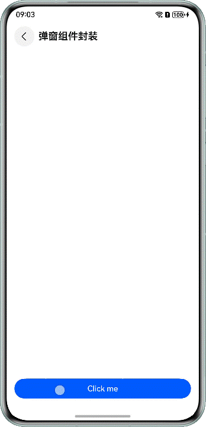

# 弹窗组件封装

更新时间：2026-03-19 08:43:01

来源：https://developer.huawei.com/consumer/cn/doc/best-practices/bpta-dialog-encapsulation

##### 概述

在应用开发中，通常会遇到自定义弹窗的场景，这些业务场景可能需要实现自定义弹窗的结构和样式。这时提供方可以封装一个传入自定义构建函数的工具类，将类对外导出。使用方可以引入该类，将自定义弹窗结构的@Builder函数作为参数传给封装好的静态类函数中，实现自定义弹窗。
 
 

##### 实现原理

通过使用UIContext中获取到的PromptAction对象来实现自定义弹窗工具类的封装。首先通过UIContext实例中的getPromptAction函数获取到promptAction对象，然后通过创建[ComponentContent](https://developer.huawei.com/consumer/cn/doc/harmonyos-references/js-apis-arkui-componentcontent)定义自定义弹窗的内容，将自定义弹窗内容作为参数传入promptAction对象的openCustomDialog函数中。使用方通过PromptAction对象封装的工具类接口打开弹窗就会显示自定义弹窗的内容，从而实现自定义的弹窗结构与样式。
 
 

##### 开发步骤

以使用方点击按钮后展示自定义弹窗场景为例，若需实现下图效果，基于promptAction封装弹窗工具类和使用步骤如下：
 
 



 1. 使用方通过全局@Builder封装弹窗结构。

  
```ArkTS
@Builder
export function buildText(_obj: Object) {
  Column({ space: 16 }) {
    Text($r('app.string.tips'))
      .fontSize($r('app.float.font_size_l'))
      .fontWeight(FontWeight.Bold)
    Text($r('app.string.content'))
      .fontSize($r('app.float.font_size_l'))
    Row() {
      Button($r('app.string.cancel'))
        .fontColor($r('app.color.blue'))
        .backgroundColor(Color.White)
        .margin({ right: $r('app.float.margin_right') })
        .width('42%')
        .onClick(() => {
          PopViewUtils.closePopView();
        })
      Button($r('app.string.confirm'))
        .width('42%')
        .onClick(() => {
          PopViewUtils.closePopView();
        })
    }
    .justifyContent(FlexAlign.Center)
    .width($r('app.float.dialog_width'))
  }
  .width($r('app.float.dialog_width'))
  .padding($r('app.float.padding_l'))
  .justifyContent(FlexAlign.Center)
  .alignItems(HorizontalAlign.Center)
  .backgroundColor(Color.White)
  .borderRadius($r('app.float.border_radius'))
}
```

2. 提供方通过promptAction对象封装弹窗工具类的步骤如下：

  
- 在EntryAbility的onWindowStageCreate()方法中，通过AppStorage.setOrCreate()设置全局UIContext对象。
```ArkTS
onWindowStageCreate(windowStage: window.WindowStage): void {
  // ...
  windowStage.loadContent('pages/Index', (err) => {
    // ...
    try {
      AppStorage.setOrCreate('uiContext', windowStage.getMainWindowSync().getUIContext());
    } catch (err) {
      let error = err as BusinessError;
      hilog.error(0x0000, 'testTag', `aboutToAppear err, code: ${error.code}, message: ${error.message}`);
    }
  });
}
```


3. 通过openCustomDialog创建打开弹窗的showDialog函数。
```ArkTS
import { ComponentContent, promptAction } from '@kit.ArkUI';
import { hilog } from '@kit.PerformanceAnalysisKit';
import { BusinessError } from '@kit.BasicServicesKit';

export enum PopViewShowType {
  OPEN
}

interface PopViewModel {
  com: ComponentContent<object>;
  popType: PopViewShowType;
}

export class PopViewUtils {
  private static popShare: PopViewUtils;
  private infoList: PopViewModel[] = new Array<PopViewModel>();

  static shareInstance(): PopViewUtils {
    if (!PopViewUtils.popShare) {
      PopViewUtils.popShare = new PopViewUtils();
    }
    return PopViewUtils.popShare;
  }

  static showDialog<T extends object>(type: PopViewShowType, contentView: WrappedBuilder<[T]>, args: T,
    options?: promptAction.BaseDialogOptions):void {
    let uiContext = AppStorage.get<UIContext>('uiContext');
    if (uiContext) {
      // The promptAction object was obtained.
      let prompt = uiContext.getPromptAction();
      let componentContent = new ComponentContent(uiContext, contentView, args);
      let customOptions: promptAction.BaseDialogOptions = {
        alignment: options?.alignment || DialogAlignment.Bottom
      };
      // Open pop-ups using openCustomDialog
      prompt.openCustomDialog(componentContent, customOptions).catch((err: BusinessError) => {
        hilog.error(0x0000, 'PopViewUtils', `openCustomDialog failed. code=${err.code}, message=${err.message}`);
      });
      let infoList = PopViewUtils.shareInstance().infoList;
      let info: PopViewModel = {
        com: componentContent,
        popType: type
      };
      infoList[0] = info;
    }
  }

  // ...
}
```


4. 通过closeCustomDialog创建关闭弹窗的closeDialog函数。
```ArkTS
static closeDialog(type: PopViewShowType): void {
  let uiContext = AppStorage.get<UIContext>('uiContext');
  if (uiContext) {
    // The promptAction object was obtained.
    let prompt = uiContext.getPromptAction();
    let sameTypeList = PopViewUtils.shareInstance().infoList.filter((model) => {
      return model.popType === type;
    })
    let info = sameTypeList[sameTypeList.length - 1];
    if (info && info.com) {
      PopViewUtils.shareInstance().infoList = PopViewUtils.shareInstance().infoList.filter((model) => {
        return model.com !== info.com;
      })
      // Close pop-ups using closeCustomDialog.
      prompt.closeCustomDialog(info.com).catch((err: BusinessError) => {
        hilog.error(0x0000, 'PopViewUtils', `closeCustomDialog failed. code=${err.code}, message=${err.message}`);
      });
    }
  }
}
```


5. 封装对外的打开和关闭弹窗接口函数。
```ArkTS
static showPopView<T extends object>(contentView: WrappedBuilder<[T]>, args: T,
  options?: promptAction.BaseDialogOptions):void {
  PopViewUtils.showDialog(PopViewShowType.OPEN, contentView, args, options);
}

static closePopView():void {
  PopViewUtils.closeDialog(PopViewShowType.OPEN);
}
```

- 使用方调用弹窗工具类传入封装好的弹窗结构实现自定义弹窗。

  
```ArkTS
import { PopViewUtils } from '../model/PopViewUtils';
// ...
@Entry
@Component
struct DialogComponent {
  build() {
    NavDestination() {
      Column() {
        Button('Click me')
          .width('100%')
          .onClick(() => {
            PopViewUtils.showPopView<Object>(wrapBuilder(buildText), new Object(), { alignment: DialogAlignment.Center });
          })
      }
      .justifyContent(FlexAlign.End)
      .padding({
        left: $r('app.float.padding'),
        right: $r('app.float.padding'),
        bottom: $r('app.float.padding')
      })
      .width('100%')
      .height('100%')
    }
    .title(getResourceString($r('app.string.dialog'), this))
  }
}
```


 

 

##### 示例代码

- [实现组件的封装](https://gitcode.com/harmonyos_samples/ComponentEncapsulation)
