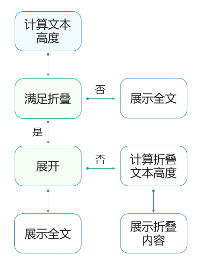
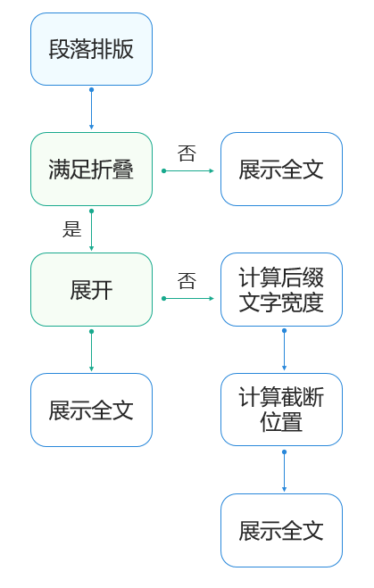

# 文本展开折叠

更新时间：2026-03-12 08:45:02

来源：https://developer.huawei.com/consumer/cn/doc/best-practices/bpta-text-expand-collapse

##### 概述

列表中的博文、评论等复合型内容组件，在文本行数超过预设阈值时，触发“展开”“收起”的功能。内容收起时，如果有用“图片”展示“表情”的功能场景，由于图片出现的位置和大小都不固定，在收起展开时，截止到文字结尾的位置不好判断。
 
本文将介绍解决这一问题的基本逻辑和解决方案，帮助开发者使用系统自带模块，更简洁的解决问题。
 


 
 

##### 纯文本展开折叠

 

##### 场景描述

在示例列表中显示纯文本展开和收起功能，文本与按钮的显示变化。
 1. 文本中只有文字。
2. 超出2行要能显示"...展开"，展开后显示收起。
 
 


 

##### 实现原理

需要计算出“...”前最后一个文字的索引和显示行高，以确定“收起”“展开”按钮的位置，其原理如图所示：
 



 
计算文本高度，结合按钮和“...”的宽度，计算收起文本最后一个文字的坐标，换算为对应内容索引，截断显示相应的内容。
 
分别添加“收起”“展开”按钮及交互，进行文本截断内容和全部内容展示的切换。
 
本示例使用measureTextSize()方法判断文字的高度，API20新增[getParagraphs20+](https://developer.huawei.com/consumer/cn/doc/harmonyos-references/arkts-apis-uicontext-measureutils#getparagraphs20)方法测算文本。getParagraphs()方法代码量更少，更直观的获取显示行数。
 
 

##### 开发步骤
1. 计算原始文本高度。

  使用[measureTextSize()](https://developer.huawei.com/consumer/cn/doc/harmonyos-references/arkts-apis-uicontext-measureutils#measuretextsize12)方法来判断总体文字的高度。

  
```ArkTS
getIsExpanded() {
  let titleSize: SizeOptions = this.uiContext.getMeasureUtils().measureTextSize({
    textContent: this.textSectionAttribute.title, //The text content is calculated
    lineHeight: this.textSectionAttribute.lineHeight,
    constraintWidth: this.textSectionAttribute.constraintWidth, //The text layout width is calculated
    fontSize: this.textSectionAttribute.fontSize //The text font size is calculated
  });
  let height = this.getUIContext().px2vp(Number(titleSize.height));
  if (height <= this.textSectionAttribute.lineHeight * 2) {
    this.textModifier.needProcess = false;
    this.textModifier.title = this.textSectionAttribute.title;
    return;
  } else {
    this.textModifier.needProcess = true;
  }
  if (this.expanded) {
    this.collapseText();
  } else {
    this.expandText();
  }
}
```

2. 计算文本收起高度（示例代码与步骤3同源）。

  使用measureTextSize()方法来判断两行文字的高度，当前为两行文字的高度。
```text
const minLinesTextSize: SizeOptions = uiContext?.getMeasureUtils().measureTextSize({
    textContent: text,
    fontSize: fontSize,
    maxLines: maxLines,
    wordBreak: WordBreak.BREAK_ALL,
    constraintWidth: textWidth
  });
  const minHeight: Length | undefined = minLinesTextSize.height;
```

3. 获取收起文本，显示收起展开按钮。

  减少接收文字字符数。当接收文字高度小于指定行数高度时，使文字显示两行收起。

  
```ArkTS
public static getShortText(textSectionAttribute: TextSectionAttribute, lastSpan: string): string {
  let text = TextUtils.getStringFromResource(textSectionAttribute.title);
  const minLinesTextSize: SizeOptions | undefined = uiContext?.getMeasureUtils().measureTextSize({
    textContent: text,
    fontSize: textSectionAttribute.fontSize,
    maxLines: textSectionAttribute.maxLines,
    wordBreak: WordBreak.BREAK_ALL,
    constraintWidth: textSectionAttribute.constraintWidth
  });
  const minHeight: Length | undefined = minLinesTextSize?.height;
  if (minHeight === undefined) {
    return '';
  }
  // Use the dichotomy to find strings that are exactly two lines in length
  let textStr: string[] = Array.from(text); //Split the string to avoid special characters and inconsistent sizes
  let leftCursor: number = 0;
  let rightCursor: number = textStr.length;
  let cursor: number = Math.floor(rightCursor / 2);
  let tempTitle: string = '';
  while (true) {
    tempTitle = text.substring(0, cursor) + suffix + lastSpan;
    const currentLinesTextSize: SizeOptions | undefined = uiContext?.getMeasureUtils().measureTextSize({
      textContent: tempTitle,
      fontSize: textSectionAttribute.fontSize,
      wordBreak: WordBreak.BREAK_ALL,
      constraintWidth: textSectionAttribute.constraintWidth
    });
    const currentLineHeight: Length | undefined = currentLinesTextSize?.height;
    if (currentLineHeight === undefined) {
      return '';
    }
    if (currentLineHeight > minHeight) {
      // The current character has exceeded two lines, continue to look to the left
      rightCursor = cursor;
      cursor = leftCursor + Math.floor((cursor - leftCursor) / 2);
    } else {
      // The current character is less than two lines, it may be OK, but you still need to look to the right
      leftCursor = cursor;
      cursor += Math.floor((rightCursor - cursor) / 2);
    }
    if (Math.abs(rightCursor - leftCursor) <= 1) {
      // The two pointers basically coincide, which means that they have been found
      break;
    }
  }
  return text.substring(0, cursor) + suffix;
}
```

 
 

##### 富文本展开折叠

 

##### 场景描述

在示例列表中显示富文本展开和收起功能，文本与按钮的显示变化。
 1. 文本中存在表情。
2. 文本中文字存在不同颜色、字号。
3. 超出3行要能显示"...展开"，展开后显示收起。
4. 关键字有超链接功能。
 
当前展示内容需要针对整个文本做截断并最终显示...和"展开"字眼，例如图片中的文本就比较长，需要在"潮声与你"的位置截断。该场景由于文本中有图片和不同字号的限制，使得计算截断文本的位置比较困难。
 


 
 

##### 实现原理

需要计算出“...”前最后一个文字的索引和显示行高，以确定“收起”“展开”按钮的位置，其原理如图所示：
 



 
使用排版，计算实际需要收起内容的高度，结合按钮和“...”的宽度，计算收起文本最后一个文字的坐标，换算为对应内容索引，截断显示相应的内容。
 
分别添加“收起”“展开”按钮及交互，进行文本截断内容和全部内容展示的切换。
 
 

##### 开发步骤
1. 引用[graphics.text](https://developer.huawei.com/consumer/cn/doc/harmonyos-references/js-apis-graphics-text)解析文本、确定内容大小。

  设置文本解析规则，解析字符串。例如，图片显示位置、大小、文本显示位置、文本颜色、文本字号。
2. 设置段落排版。

  创建ParagraphBuilder，初始化文本样式，指定文本大小和文本颜色。注意文本大小这里是传的px，需要用fp2px转换一下（转换时需要考虑字体设置的最大缩放比例和系统字体缩放比例，即选择min(sysFontScale，maxCustomFontScale)）。

  
```ArkTS
let myTextStyle: text.TextStyle = {
  fontSize: uiContext?.fp2px(fontSize)
};

let myParagraphStyle: text.ParagraphStyle = {
  textStyle: myTextStyle,
  align: text.TextAlign.START,
  maxLines: 300, // Just specify a large enough number of rows
  breakStrategy: text.BreakStrategy.GREEDY,
  wordBreak: text.WordBreak.BREAK_WORD
};

let fontCollection = new text.FontCollection();
let paragraphGraphBuilder = new text.ParagraphBuilder(myParagraphStyle, fontCollection);
```

3. 添加占位符，指定样式。

  根据第一步骤解析出来的内容，如果是图片的话，就用addPlaceholder()，添加一张图片占位符，需要指定这张图片的大小（单位px），旁边的文字排版方式，文字基线位置等信息。

  
```ArkTS
paragraphGraphBuilder.addPlaceholder({
  width: item.imgWidth,
  height: item.imgHeight,
  align: text.PlaceholderAlignment.BOTTOM_OF_ROW_BOX,
  baseline: text.TextBaseline.IDEOGRAPHIC,
  baselineOffset: 0
});
```
 如果是文字的话，就使用addText()，添加一段文本，添加这段文本之前可以重新通过pushStyle()方法指定这段文本的字体大小和颜色。

  
```ArkTS
paragraphGraphBuilder.pushStyle({
  fontSize: fontSize,
});
paragraphGraphBuilder.addText(item.content);
```


  如果需要使用之前的文本样式，可以通过popStyle()把当前样式pop出去。

  上面添加的文字大小和图片占位符的大小要同Text控件展示的时候的大小一致，否则会导致计算不准确。
4. 预排版。

  全部添加完成之后，使用paragraph的layoutSync()方法预先排版，传递的大小单位也为px。这个layoutSync()传递宽度要同展示的时候的Text文本宽度一致，否则计算出来的和展示的时候肯定不一致。

  
```ArkTS
let paragraph = paragraphGraphBuilder.build();
paragraph.layoutSync(textMaxWidth);
```

5. 计算截断坐标。

  计算三个点之前的最后一个文字的坐标。设这个字符变量为lastWord。经过paragraph的排版之后，就可以得到这段文本真实的渲染数据了。先通过paragraph.getLineCount()，计算出来一共排版了多少行，如果超过了自己要设定的行数，或者getLineCount()的行数和自己设定的maxLine一致，但是最后一行的宽度+之前计算出来的widthMore，超过了第四步骤设定的最大宽度，则说明需要截断。

  计算lastWord文字的Y坐标，通过getLineHeight()获取每一行的高度加起来，其中最后一行高度需要加一半的高度。

  
```ArkTS
for (let i = 0; i < textSectionAttribute.maxLines; i++) {
  y += i === textSectionAttribute.maxLines - 1 ? paragraph.getLineHeight(i) / 2 : paragraph.getLineHeight(i);
}
```

6. 计算lastWord的X坐标。

  
```ArkTS
if (paragraph.getLineWidth(textSectionAttribute.maxLines - 1) + Number(widthMore) >
textSectionAttribute.constraintWidth) {
  x = textSectionAttribute.constraintWidth - Number(widthMore);
} else {
  x = paragraph.getLineWidth(textSectionAttribute.maxLines - 1)
}
```

7. 转换坐标对应索引。

  计算lastWord的展示索引位置。拿到lastWord的x与y坐标之后，通过getGlyphPositionAtCoordinate()拿到这个坐标的文字所在段落的索引，这个就是最终文字展示的索引。

  
```ArkTS
// The conversion coordinates correspond to the index
let positionWithAffinity = paragraph.getGlyphPositionAtCoordinate(x, y);
let index = 0;
if (positionWithAffinity.affinity === text.Affinity.UPSTREAM) {
  index = positionWithAffinity.position;
} else {
  index = positionWithAffinity.position + 1;
}
```

8. 添加“展开”“收起”按钮。

  显示展开按钮时使用上面获取的shortContentArray数组数据来渲染，完全展示的时候使用RichTextModel里的textArray数组数据来渲染。判断两种情况分别显示按钮。

  
```ArkTS
if (this.textModifier.needProcess && !this.textModifier.exceedOneLine) {
  Span(this.lastSpanAttribute.content[0])
    .fontColor(this.lastSpanAttribute.color)
} else if (this.textModifier.exceedOneLine) {
  Span(this.lastSpanAttribute.content[1])
    .fontColor(this.lastSpanAttribute.color)
}
```

 
 

##### 示例代码

- [实现富文本收起展开功能](https://gitcode.com/harmonyos_samples/TextExpand)
